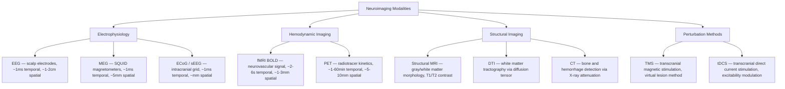

# Neuroimaging Methods

> [!abstract] TL;DR
> Neuroimaging is the collection of techniques that let us observe the living human brain in action — without opening the skull. fMRI tracks neural activity indirectly via the BOLD signal (blood oxygenation-level dependent), which reflects local changes in deoxyhemoglobin driven by neurovascular coupling, giving millimeter spatial resolution at a cost of seconds-scale temporal lag. EEG places electrodes on the scalp to record summed postsynaptic potentials from cortical pyramidal cells with sub-millisecond precision but centimeter-scale spatial blurring — and every method occupies a distinct position in the spatial-vs-temporal resolution trade-off space, making technique choice the first critical decision in any cognitive neuroscience study.

---

## Intuition

**Analogy:** Think of trying to photograph a sports match with different cameras.

A cheap but **ultra-fast burst camera** (EEG) captures every blur of motion at 1000 frames per second — you can see exactly when the ball was kicked — but the lens is so blurry you cannot tell which player touched it. A **slow, high-resolution DSLR** (fMRI) takes one sharp, detailed photograph every two seconds: you can clearly identify every player on the field, but you will miss the split-second moment of the kick entirely. A **radiological scanner** (PET) takes minutes to produce a single metabolic map showing which players burned the most energy during the whole half — excellent for understanding physiology over time, useless for play-by-play action. A **field reporter with a directional mic** placed inside the stadium (ECoG/intracranial recording) hears individual conversations at high fidelity, but can only be deployed in a small section of the crowd and requires invasive access.

No single camera solves the problem. In practice, combining modalities — EEG-fMRI, MEG-MRI, intracranial recordings in clinical patients — is how cognitive neuroscience resolves the trade-off.

---

## How It Works

### fMRI: The BOLD Signal

When a brain region becomes active, local neurons fire and demand more glucose and oxygen. Astrocytes detect excess glutamate at synapses and signal neighbouring arterioles to dilate — a process called **neurovascular coupling**. Blood flow rises 20–30% above demand, paradoxically *reducing* local deoxyhemoglobin (dHb) concentration. Because dHb is paramagnetic (distorts the local magnetic field) while oxyhemoglobin is not, a standard T2*-weighted MRI sequence detects this field perturbation as a small (1–5%) increase in signal intensity. That is the BOLD signal. It peaks ~5–6 seconds after neural onset and returns to baseline over 15–20 seconds, shaped by the **hemodynamic response function (HRF)**.

### EEG: Scalp Electrical Recording

EEG electrodes record voltage fluctuations at the scalp surface caused by **postsynaptic currents** in large populations of cortical pyramidal neurons whose apical dendrites are aligned perpendicularly to the cortical surface. Only synchronous activity from roughly 10,000–100,000 aligned neurons is detectable through the skull, cerebrospinal fluid, dura, and scalp. This spatial smearing (volume conduction) is the fundamental reason EEG spatial resolution is poor. Temporal resolution is excellent: EEG tracks oscillations and transient potentials with sub-millisecond fidelity, enabling measurement of rapid processes that fMRI cannot see.

### MEG: Magnetic Field Recording

MEG detects the tiny magnetic fields (~100 femtotesla, about a billion times weaker than Earth's field) produced by intracellular ionic currents in the same pyramidal neurons measured by EEG. Because magnetic fields pass through the skull and scalp without the same distortion as electric fields, MEG offers modestly better spatial resolution than EEG (~5 mm vs ~1–2 cm). MEG requires superconducting quantum interference devices (SQUIDs) operating at 4K and a magnetically shielded room, making it expensive and immovable.

### PET: Radiotracer Uptake

Positron emission tomography injects a short-lived radioactive tracer intravenously. The tracer emits positrons that annihilate with electrons, producing paired 511 keV gamma rays detected by a ring of scintillators. Different tracers reveal different biology: [¹⁸F]-FDG maps glucose metabolism (neural activity proxy), [¹¹C]-raclopride binds dopamine D2 receptors, and [¹⁸F]-florbetapir labels amyloid plaques. Temporal resolution is limited by tracer kinetics (~1–30 minutes per image) and spatial resolution by positron range (~5–10 mm).

### Comparison Diagram



---

## Key Concepts

### Secondary Level

**Why image the brain at all?** The brain is protected by the skull and blood-brain barrier. Non-invasive imaging lets clinicians detect tumours, strokes, and epileptic foci, and lets researchers link cognitive tasks to specific brain regions — without surgery.

**Structural vs functional imaging:**

- *Structural*: Shows anatomy. CT (X-ray attenuation, fast, detects acute bleeds), MRI (proton relaxation times T1/T2, superb soft-tissue contrast). Neither directly measures brain activity.
- *Functional*: Tracks activity over time. fMRI, EEG, PET.

**Invasive vs non-invasive:** EEG, MEG, fMRI, PET, CT, and MRI are all non-invasive in that they do not require surgery. ECoG and stereo-EEG implant electrodes directly on or into the cortex — invasive, but exclusively in patients already undergoing neurosurgery (e.g., epilepsy resection planning).

**The core trade-off:** Every method trades temporal resolution for spatial resolution and vice versa. No existing technology achieves both millisecond timing and sub-millimetre spatial precision in the intact human brain simultaneously.

---

### Undergraduate Level

#### fMRI in Depth

**The hemodynamic response function (HRF):** The standard model treats the BOLD signal as a linear time-invariant system. A brief neural event (an "impulse") produces a stereotyped HRF: a peak at ~5–6 s, followed by a post-stimulus undershoot lasting 15–20 s before returning to baseline. The canonical HRF is modelled as the difference of two gamma functions — a large positive peak and a small delayed negative undershoot.

**The General Linear Model (GLM):** The HRF is convolved with the experimental stimulus onset function to produce a predicted BOLD time series for each voxel. A GLM then fits this predictor (plus nuisance regressors: head motion, heartbeat, respiration) to the observed fMRI time series, yielding a beta-weight (effect size) and a t/F-statistic per voxel. Statistical maps are thresholded with cluster-level correction (GRF theory or permutation testing) to control false positives.

**Design types:**

- *Block design*: Conditions alternate in long epochs (~30 s). High statistical power but confounds habituation and strategy shifts.
- *Event-related design*: Individual trials jittered in time. Allows single-trial estimation and randomisation but lower power per event.
- *Mixed design*: Sustained blocks with embedded transient events — extracts both phasic and tonic components.

**Analysis pipelines:** SPM (Statistical Parametric Mapping, MATLAB) and FSL (FMRIB Software Library) are the dominant packages. Steps: slice timing correction → motion realignment → co-registration to structural MRI → normalisation to MNI template → spatial smoothing → GLM.

**Spatial resolution:** ~1–3 mm isotropic voxels at 3T. Ultra-high field (7T) achieves sub-millimetre resolution, enabling columnar and laminar imaging. **Temporal resolution:** Repetition time (TR) typically 1–2 s; multiband/simultaneous multislice acquisition can achieve sub-500 ms TRs, but neural resolution remains limited by HRF sluggishness.

#### EEG in Depth

**Oscillatory rhythms:**

| Band | Frequency | Typical association |
|------|-----------|-------------------|
| Delta (δ) | 1–4 Hz | Deep sleep, slow-wave sleep |
| Theta (θ) | 4–8 Hz | Working memory, hippocampal encoding, drowsiness |
| Alpha (α) | 8–13 Hz | Relaxed wakefulness, visual cortex idling |
| Beta (β) | 13–30 Hz | Active cognition, motor planning, sensorimotor cortex |
| Gamma (γ) | 30–100+ Hz | Local feature binding, attention, high-level processing |

**Event-related potentials (ERPs):** Averaging hundreds of trials time-locked to a stimulus cancels out background noise, revealing millisecond-precise voltage deflections:

- **P300** (~300 ms, parietal): Target detection, context updating, attentional resource allocation.
- **N400** (~400 ms, centroparietal): Semantic incongruity — peaks when reading an unexpected word.
- **N170** (~170 ms, occipitotemporal): Face-specific structural encoding.
- **MMN** (Mismatch Negativity, ~100–250 ms, frontal): Automatic auditory deviance detection; does not require attention.

**Source localisation problem:** The "inverse problem" — reconstructing the intracranial generator from scalp recordings — is mathematically ill-posed. Infinitely many source configurations produce the same scalp distribution. Regularisation methods (LORETA, sLORETA, beamformers) impose constraints (smoothness, minimum norm) to arrive at a unique solution, but these solutions are not unique.

#### MEG Advantages over EEG

MEG is less distorted by the skull and scalp (magnetic fields penetrate tissues undistorted). It is more sensitive to tangential sources (sources in sulci) and less sensitive to radial sources. MEG has better defined spatial sensitivity profiles, making source localisation somewhat more tractable than EEG. However: MEG is insensitive to deep, radial, or diffuse sources; EEG is more sensitive to certain deep structures (thalamus, hippocampus) that MEG misses.

#### PET Tracers

- **[¹⁸F]-FDG** (fluorodeoxyglucose): Glucose analogue, trapped in cells after phosphorylation — maps regional metabolic rate. Gold standard for tumour grading, epilepsy focus localisation, dementia diagnosis.
- **[¹¹C]-raclopride**: Binds dopamine D2/D3 receptors. Measures dopamine release indirectly via displacement. Used to study reward, addiction, Parkinson's.
- **[¹¹C]-PIB / [¹⁸F]-florbetapir**: Amyloid PET — detects fibrillar Aβ plaques years before Alzheimer's symptoms.
- **[¹⁸F]-flortaucipir**: Tau PET — maps neurofibrillary tangle burden, tracks disease stage.

#### Diffusion Tensor Imaging (DTI)

Water diffuses anisotropically along myelinated axon bundles. DTI encodes diffusion in ≥6 gradient directions, computing a diffusion tensor per voxel. Fractional anisotropy (FA, 0–1) indexes tract integrity: FA drops in demyelination, axonal loss, or oedema. Tractography algorithms (deterministic or probabilistic) trace streamlines through high-FA regions, reconstructing white matter pathways (corticospinal tract, arcuate fasciculus, corpus callosum).

#### TMS: Perturbation Not Just Observation

Transcranial magnetic stimulation delivers a brief (~0.1 ms) magnetic pulse through a figure-8 coil placed over the scalp, inducing eddy currents in the cortex that transiently depolarise or inhibit neurons within ~1 cm. A single pulse creates a "virtual lesion" — disrupting processing in the target region for ~100 ms. This allows causal inference: if a TMS pulse to V5/MT impairs motion discrimination, MT is *necessary* for that task. Repetitive TMS (rTMS) produces longer-lasting suppression (>10 min); therapeutic rTMS over DLPFC is an FDA-approved treatment for treatment-resistant depression.

---

### Graduate Level

#### BOLD as Neurovascular Coupling (NVC)

BOLD measures the metabolic and vascular response to neural activity — it does not directly record action potentials. Seminal work by Logothetis et al. (2001) in monkeys showed that BOLD correlates best with **local field potentials** (LFPs, reflecting synaptic input and dendritic processing) rather than with spiking output. Implications: BOLD can be positive even with predominantly inhibitory input; net inhibition can sometimes produce positive BOLD. The relationship between neural activity and BOLD is modulated by baseline state, medication, neurovascular health, age, and CO₂ levels.

**Confounds in fMRI:**

- *Head motion*: Even 0.3 mm movement corrupts data. Standard procedure: scrubbing high-motion volumes, ICA-based artefact removal (ICA-FIX, FIX-trained classifier), FD-based exclusion.
- *Physiological noise*: Cardiac (~1 Hz) and respiratory (~0.3 Hz) pulsations alias into BOLD fluctuations, especially problematic at high TR. RETROICOR, PESTICA, or physio-BOLD regressors remove these.
- *Draining vein effect*: Large veins draining from active cortex carry deoxygenated blood and contribute spatially displaced BOLD signal — blurring the true location of activity.
- *Spatial smoothing bias*: Standard 6–8 mm FWHM smoothing improves SNR but sacrifices spatial precision; inappropriate for columnar/laminar imaging.

#### Resting-State fMRI and Functional Connectivity

With no task, BOLD fluctuations (~0.01–0.1 Hz) are highly correlated between distant brain regions forming **resting-state networks (RSNs)**:

- **Default Mode Network (DMN)**: medial PFC, posterior cingulate, angular gyrus — active at rest, deactivated by external tasks.
- **Dorsal Attention Network**: FEF, IPS — engaged by attention.
- **Salience Network**: anterior insula, dACC — detects behaviourally relevant events.

Functional connectivity (FC) is typically measured by Pearson correlation of BOLD time series between ROI pairs. FC alterations are biomarkers for schizophrenia, depression, autism, and ageing.

#### Multivariate Pattern Analysis (MVPA) and RSA

Classical univariate GLM asks: "Does this region respond *more* to condition A than B?" MVPA (decoding) asks: "Does the *pattern* of activity across voxels discriminate between A and B?" A classifier (SVM, logistic regression) trained on brain activity patterns can decode mental states, attended stimuli, or imagined actions at above-chance accuracy — enabling "mind-reading" experiments. **Representational Similarity Analysis (RSA)** compares the geometry of neural representational spaces across brain regions, species, and computational models, without requiring matched voxel counts.

#### Real-Time fMRI Neurofeedback

Participants receive online feedback of their own BOLD signal (e.g., from amygdala or supplementary motor area) displayed as a thermometer. They learn to up-regulate or down-regulate activity through mental strategies. Therapeutic applications include reducing PTSD hyperactivation, enhancing motor cortex excitability in stroke, and modulating chronic pain. Methodological challenges: scanner drift, feedback loop latency (~2 TR), and distinguishing genuine volitional control from Hawthorne effects.

#### Intracranial Electrophysiology: ECoG and sEEG

**Electrocorticography (ECoG)**: Subdural electrode grids placed directly on the cortical surface in surgical patients. Spatial resolution ~1 cm (clinical grid spacing), but ~1 mm for research-grade high-density arrays. Signal is 100× stronger than scalp EEG with broad-band power up to 200 Hz (high-gamma, 70–150 Hz, is the best single-channel correlate of local spiking).

**Stereo-EEG (sEEG)**: Depth electrodes implanted through burr holes into specific brain structures (hippocampus, amygdala, insula). Enables recording from deep structures inaccessible to surface ECoG. Standard for invasive epilepsy mapping in France/European centres; increasingly used in the US.

Both provide the highest-fidelity recordings from human brain in vivo — the closest human analogue to single-unit recording in animals.

#### High-Density EEG Source Reconstruction

Systems with 256–512 channels (Geodesic EEG System, BioSemi) combined with individual MRI-derived boundary element head models allow source reconstruction with ~5–10 mm accuracy for superficial sources. Methods: sLORETA (standardized low resolution electromagnetic tomography) — produces images of "current density" per voxel; beamforming (LCMV) — spatial filter that optimally passes one source location while suppressing others. Combined EEG-fMRI (simultaneous acquisition) offers complementary temporal (EEG) and spatial (fMRI) information with proper gradient artefact removal.

#### Next-Generation Methods

- **Two-photon calcium imaging**: Fluorescent calcium indicators (GCaMP) in genetically modified mice (or via viral vector) allow single-cell resolution imaging through a cranial window. Cannot be applied to intact human brain but is transforming rodent systems neuroscience.
- **Neuropixels probes**: Silicon probes with 960 electrodes per shank recording 400–700 single units simultaneously across cortical layers. Unprecedented for understanding laminar circuits.
- **Functional ultrasound (fUS)**: Ultrafast doppler ultrasound measuring cerebral blood volume at ~100 µm resolution and ~1 ms frame rate. Deployed in awake behaving animals and intraoperatively in humans; may bridge the spatial-temporal resolution gap.

---

## Python Demo

```python
# Simulate a canonical fMRI hemodynamic response function (HRF)
# and convolve it with a block-design stimulus to get predicted BOLD signal.

import numpy as np
import matplotlib.pyplot as plt
from scipy.stats import gamma as gamma_dist

# ── 1. Build the canonical double-gamma HRF ──────────────────────────────────
# SPM parameters: peak gamma (a1=6, b1=1) minus undershoot gamma (a2=16, b2=1)
# scaled by c=1/6

def double_gamma_hrf(t, a1=6.0, a2=16.0, b1=1.0, b2=1.0, c=1.0/6.0):
    """Canonical double-gamma HRF (Glover 1999 / SPM model)."""
    peak      = gamma_dist.pdf(t, a=a1, scale=b1)
    undershoot = gamma_dist.pdf(t, a=a2, scale=b2)
    hrf = peak - c * undershoot
    return hrf / hrf.max()          # normalise to unit peak

t_hrf = np.linspace(0, 32, 3200)   # 32 s at 100 Hz for smooth curve
hrf_smooth = double_gamma_hrf(t_hrf)

# ── 2. Build a block-design stimulus onset vector (sampled at TR = 1 s) ───────
TR      = 1.0    # repetition time in seconds
n_vols  = 80     # number of brain volumes
t_bold  = np.arange(n_vols) * TR

stimulus = np.zeros(n_vols)
stimulus[10:25] = 1   # first block: ON 10–25 s
stimulus[45:60] = 1   # second block: ON 45–60 s

# ── 3. Convolve stimulus with HRF sampled at TR ───────────────────────────────
t_hrf_tr      = np.arange(0, 32, TR)
hrf_at_tr     = double_gamma_hrf(t_hrf_tr)
predicted_bold = np.convolve(stimulus, hrf_at_tr)[:n_vols]

# ── 4. Plot ───────────────────────────────────────────────────────────────────
fig, axes = plt.subplots(3, 1, figsize=(11, 8), sharex=False)

axes[0].plot(t_hrf, hrf_smooth, color="steelblue", linewidth=2)
axes[0].axhline(0, color="gray", linewidth=0.8, linestyle="--")
axes[0].set_title("Canonical HRF (double-gamma)")
axes[0].set_xlabel("Time (s)")
axes[0].set_ylabel("Amplitude (a.u.)")

axes[1].fill_between(t_bold, stimulus, alpha=0.6, color="tomato")
axes[1].set_title("Block-design stimulus (ON = 1)")
axes[1].set_xlabel("Time (s)")
axes[1].set_ylabel("Stimulus")
axes[1].set_xlim([0, n_vols * TR])

axes[2].plot(t_bold, predicted_bold, color="darkorange", linewidth=2)
axes[2].axhline(0, color="gray", linewidth=0.8, linestyle="--")
axes[2].set_title("Predicted BOLD (stimulus * HRF)")
axes[2].set_xlabel("Time (s)")
axes[2].set_ylabel("BOLD (a.u.)")
axes[2].set_xlim([0, n_vols * TR])

plt.tight_layout()
plt.savefig("hrf_convolution_demo.png", dpi=150)
plt.show()
```

**What this shows:** The block stimulus (rectangular ON/OFF epochs) is convolved with the smooth double-gamma HRF. The resulting predicted BOLD signal rises slowly after stimulus onset (~2 s lag), peaks at ~5–6 s into each block, and shows a post-stimulus undershoot — exactly what is observed in real fMRI data. In practice, this predicted regressor is entered into a GLM alongside motion parameters and physiological noise regressors to fit the observed BOLD time series, yielding voxel-level statistical maps.

---

## Real-World Applications

**Clinical neurology and neurosurgery:** Pre-surgical fMRI maps language (Broca's/Wernicke's areas) and motor cortex relative to a tumour, guiding the neurosurgeon to maximise resection while minimising deficit. Structural MRI detects lesions, atrophy patterns, and white-matter hyperintensities.

**Epilepsy:** EEG is the gold standard for seizure characterisation — the interictal spike morphology and localisation determine whether a patient is a surgical candidate. High-density EEG and MEG source imaging refine the irritative zone; invasive ECoG/sEEG maps the seizure onset zone before resection.

**Alzheimer's disease:** Amyloid PET detects Aβ plaques 15–20 years before cognitive symptoms — enabling prodromal trials of anti-amyloid therapies (lecanemab, donanemab). Tau PET stage correlates with cognitive severity better than amyloid load. FDG-PET shows characteristic hypometabolism in posterior cortex (parietal, temporal) in early AD.

**Psychiatric disorders:** fMRI functional connectivity identifies hypo-connectivity between DLPFC and amygdala in depression, excessive default-mode activity in rumination. These are candidate biomarkers for stratifying patients and predicting treatment response to antidepressants or psychotherapy.

**Brain-computer interfaces (BCIs):** ECoG-based BCIs in patients with paralysis (ALS, spinal injury) decode intended speech or hand movement from high-gamma signals in motor/speech cortex, translating neural activity into text or cursor control in near-real time. The superior SNR of ECoG over scalp EEG is essential for clinical-grade BCI performance.

**Neurofeedback therapy:** Real-time fMRI neurofeedback of amygdala BOLD allows PTSD patients to down-regulate fear circuitry. EEG alpha/theta neurofeedback has been used in attention, anxiety, and pain management — with mixed but emerging evidence.

**Lie detection debates:** fMRI "lie detection" has been offered as courtroom evidence in limited US cases. The scientific consensus is that current MVPA classifiers for deception have unacceptable false positive rates when applied to individuals (not groups), are susceptible to countermeasures, and cannot distinguish deception from other processes that engage similar networks. Brain activity ≠ mental content.

---

## Common Pitfalls

- **BOLD does not equal neural firing** — BOLD reflects neurovascular coupling (synaptic input, metabolic demand) not spiking output. A region can show increased BOLD due to net inhibitory input (which is still metabolically costly). Always state "BOLD activity" not "neural firing" when interpreting fMRI results.

- **EEG spatial resolution is fundamentally limited** — Volume conduction through skull and scalp smears sources across centimetres. Source localisation algorithms improve estimates but cannot escape the ill-posed inverse problem. Overly precise anatomical claims from EEG (e.g., "this ERP originates in the anterior hippocampus") require corroboration from other methods.

- **p-hacking and the cluster correction crisis** — Eklund et al. (2016) showed that standard parametric cluster-correction methods in fMRI (SPM, FSL, AFNI) produced false positive rates up to 70% when the cluster-forming threshold was liberal (p < 0.01 uncorrected). The solution: use stringent cluster-forming thresholds (p < 0.001 uncorrected), permutation-based cluster correction, or Bayesian approaches. Always report cluster correction method and threshold.

- **Reverse inference fallacy** — Seeing activation in the "emotion region" (e.g., amygdala) during a task and concluding "participants felt fear" is reverse inference: amygdala activates for novelty, salience, attention, and reward too. Reverse inference is only valid when a region is highly selective — most regions are not. Use neurosynth-style meta-analysis to quantify prior probability.

- **Draining vein spatial bias** — Large pial veins draining active cortex carry deoxygenated blood and contribute BOLD signal displaced 3–5 mm from the true neural source. This is especially problematic for precise laminar or columnar mapping. GE-EPI emphasises draining veins; VASO or SE-EPI sequences can mitigate this.

- **Neurovascular uncoupling** — In tumours, stroke, advanced age, or drug effects, the coupling between neural activity and blood flow may be impaired. An apparently silent region on fMRI might have intact but unmeasured neural activity. Clinical interpretation of fMRI in such patients requires caution.

---

## Related Concepts

- [[_MOC_Cognitive_Neuroscience|↑ Cognitive Neuroscience MOC]] — section map linking all seven cognitive neuroscience topics in this vault section
- [[Gross_Anatomy_of_the_Brain]] — the anatomical coordinate system that all neuroimaging maps are registered to; understanding lobes, sulci, and subcortical structures is prerequisite for interpreting activations.
- [[Cerebral_Cortex_and_Lobes]] — the primary target of both fMRI and EEG; cortical laminar organisation determines which cell types generate the signals each method detects.
- [[Glial_Cells_and_Blood_Brain_Barrier]] — astrocytes mediate neurovascular coupling (the biological mechanism behind BOLD), and the blood-brain barrier determines which PET tracers reach the parenchyma.
- [[Action_Potentials_and_Resting_Membrane_Potential]] — EEG/ECoG signals arise from the summation of postsynaptic potentials (not action potentials directly), but spiking dynamics drive the metabolic demand that BOLD reports.
- [[Synaptic_Transmission_and_Neurotransmitters]] — PET receptor tracers exploit specific neurotransmitter binding sites; BOLD most strongly correlates with synaptic (LFP) rather than spiking activity.
- [[Fourier_Transform]] (Signals and Systems) — EEG spectral analysis (oscillatory band power, event-related spectral perturbations) relies entirely on Fourier decomposition; understanding frequency-domain representations is essential for EEG analysis.

---

## Review Questions

1. **Conceptual:** Explain why fMRI spatial resolution can be ~2 mm but temporal resolution is limited to ~seconds, while EEG achieves sub-millisecond timing but centimetre-scale spatial blurring. What is the fundamental biological or physical constraint behind each limitation?

2. **Scenario:** A researcher wants to study the sequence of brain regions recruited during a 500-ms language comprehension event — from primary auditory cortex to Broca's area. Which imaging modality (or combination) would you recommend, and how would you design the study to maximise sensitivity to the temporal dynamics? What confounds would you need to control?

3. **Trade-off:** A colleague interprets their fMRI result as: "The amygdala fires when subjects see angry faces." List three problems with this statement — one conceptual (what BOLD actually measures), one statistical (what the activation threshold implies), and one inferential (why amygdala activation does not uniquely imply a specific emotional state).

---

## Sources

- [Huettel, Song & McCarthy — *Functional Magnetic Resonance Imaging* (3rd ed., Sinauer 2014)](https://www.sinauer.com/functional-magnetic-resonance-imaging-third-edition.html)
- [Cohen — *Analyzing Neural Time Series Data* (MIT Press 2014)](https://mitpress.mit.edu/9780262019873/)
- [Logothetis NK — "What we can do and what we cannot do with fMRI" *Nature* 453, 869–878 (2008)](https://www.nature.com/articles/nature06976)
- [Eklund A et al. — "Cluster failure: Why fMRI inferences for spatial extent have inflated false-positive rates" *PNAS* 113(28), 7900–7905 (2016)](https://www.pnas.org/doi/10.1073/pnas.1602413113)
- [Glover GH — "Deconvolution of Impulse Response in Event-Related BOLD fMRI" *NeuroImage* 9(4), 416–429 (1999)](https://www.sciencedirect.com/science/article/pii/S1053811998903384)

---

#Neuroscience #CognitiveNeuroscience #Neuroimaging #fMRI #EEG
