# Sleep and Circadian Rhythms

> [!abstract] TL;DR
> The circadian system is a genetically encoded ~24-hour molecular clock — anchored in the suprachiasmatic nucleus (SCN) of the hypothalamus — that coordinates virtually every physiological process in the body to the external light-dark cycle. Sleep itself is regulated by two interacting drives: a circadian alerting signal (Process C) and a homeostatic pressure (Process S) that builds with every hour of wakefulness as adenosine accumulates and is only discharged during sleep. Sleep is not passive unconsciousness but an active, structured state composed of alternating NREM and REM cycles that serve memory consolidation, metabolic waste clearance, and synaptic maintenance.

---

## Intuition — analogy FIRST

Think of your body as a factory that runs 24 hours a day. The circadian clock is the shift-schedule manager: it knows exactly when each department should be active and when it should be shut down for maintenance, independently of whether work is actually happening. The factory also has a fatigue gauge on every machine — the longer the machines run without rest, the louder the alarm gets. Sleep is the maintenance window: conveyor belts slow down, the cleaning crew flushes out the day's industrial waste, and the data-management team archives the day's logs into long-term storage.

The shift-schedule manager (SCN/Process C) and the fatigue gauge (adenosine/Process S) are independent systems that must agree before the factory closes for the night. When they disagree — because you flew across time zones, pulled an all-nighter, or work night shifts — the factory tries to run maintenance during production hours or vice versa, and the quality of both suffers.

---

## How It Works

### Core Mechanics

**1. The circadian clock.**
The suprachiasmatic nucleus (SCN), a pair of ~20,000 neurons above the optic chiasm in the anterior hypothalamus, is the master pacemaker. Its intrinsic period is slightly longer than 24 hours (~24.2 h in humans); it is re-synchronized ("entrained") daily by light. Light signals reach the SCN exclusively via the retinohypothalamic tract (RHT), originating from intrinsically photosensitive retinal ganglion cells (ipRGCs) that express melanopsin (OPN4), a blue-light-sensitive opsin. The SCN broadcasts time-of-day signals to peripheral clocks in every organ via neural projections, the autonomic nervous system, and hormones — particularly melatonin released by the pineal gland.

**2. Melatonin as a darkness hormone.**
The SCN inhibits the pineal gland during the light phase via a sympathetic relay through the superior cervical ganglion. In darkness, this inhibition is lifted and the pineal gland secretes melatonin into the bloodstream. Melatonin signals "night" to peripheral clocks and helps time the opening of the sleep gate; it is not a sedative but a chronobiotic — a time-setting signal.

**3. Two-process model of sleep (Borbély, 1982).**
Sleep propensity at any moment is determined by two processes:
- **Process S (homeostatic drive):** adenosine accumulates in the basal forebrain and striatum during wakefulness as a byproduct of neuronal ATP metabolism; it inhibits wake-promoting arousal circuits, creating increasing sleep pressure. Adenosine is cleared during sleep and by caffeine (a competitive adenosine receptor antagonist that masks but does not reduce sleep debt).
- **Process C (circadian drive):** the SCN generates an alerting signal that rises through the morning and peaks in the late afternoon, opposing the accumulating sleep pressure. As Process C declines in the evening, it stops counteracting Process S and sleep onset occurs when S crosses the upper circadian threshold.

**4. Sleep stages.**
Polysomnography (EEG + EMG + EOG) defines four stages in a repeating ~90-minute cycle:
- **N1 (NREM stage 1):** Light sleep; theta waves (4–7 Hz); hypnic jerks common; ~5% of total sleep time.
- **N2 (NREM stage 2):** True sleep; characterized by sleep spindles (12–15 Hz, 0.5–2 s bursts generated by thalamocortical circuits) and K-complexes (large biphasic slow waves, possibly a response to stimuli); ~50% of total sleep time.
- **N3 (NREM stage 3 / slow-wave sleep):** Deep sleep; high-amplitude delta waves (<2 Hz, >75 µV); most physiologically restorative; glymphatic waste clearance peaks here; ~20% of total sleep time.
- **REM (rapid eye movement):** Low-amplitude mixed-frequency EEG resembling wakefulness; muscle atonia (except eyes and diaphragm); vivid dreaming; ponto-geniculo-occipital (PGO) waves; acetylcholine-dominant neuromodulatory tone; ~25% of total sleep time, proportionately increasing in later cycles.

Early cycles contain more SWS (N3); later cycles are dominated by REM. Total sleep time averages 7–9 h in adults, but optimal duration is genetically variable.

### Flow / Architecture

```mermaid
graph LR
    LIGHT["Light (ipRGC / Melanopsin)"]
    SCN["SCN: Master Circadian Clock"]
    PINEAL["Pineal Gland"]
    MELA["Melatonin (darkness signal)"]
    ADENO["Adenosine Buildup (Process S)"]
    VLPO["VLPO: Sleep-Promoting Neurons"]
    WAKE_NUC["Wake-Promoting Nuclei (LC, TMN, DRN, BF)"]
    OREXIN["Orexin / Hypocretin (LHA)"]
    N1["N1: Theta Waves"]
    N2["N2: Spindles + K-complexes"]
    N3["N3: Slow-wave Sleep (Delta)"]
    REM["REM: ACh Dominant, PGO Waves"]

    LIGHT -->|"Retinohypothalamic tract"| SCN
    SCN -->|"dark-phase disinhibition"| PINEAL
    PINEAL -->|"melatonin release"| MELA
    MELA -->|"permissive sleep gate"| VLPO
    SCN -->|"Process C: circadian alerting"| WAKE_NUC
    ADENO -->|"Process S: inhibits arousal"| VLPO
    VLPO -->|"GABAergic inhibition (flip-flop)"| WAKE_NUC
    WAKE_NUC -->|"reciprocal GABAergic inhibition"| VLPO
    OREXIN -->|"stabilizes wakefulness"| WAKE_NUC
    WAKE_NUC -->|"VLPO wins: sleep onset"| N1
    N1 --> N2
    N2 --> N3
    N3 -->|"first-cycle SWS complete"| REM
    REM -->|"~90 min cycle repeats"| N2
```



---

## Key Concepts

### Secondary Level

**NREM vs REM.** NREM sleep (stages N1–N3) is characterized by progressive neuronal synchrony, slow oscillations, and high arousal thresholds. It is when the body performs most physical repair (growth hormone release peaks in N3). REM sleep resembles wakefulness neurologically but is accompanied by complete skeletal muscle paralysis (atonia) to prevent acting out dreams. REM is when most vivid narrative dreams occur, though dreaming can happen in all stages.

**The sleep cycle.** A full sleep cycle lasts approximately 90 minutes and follows the sequence: N1 → N2 → N3 → N2 → REM. This cycle repeats 4–6 times per night. Crucially, the proportion of N3 and REM differs across cycles: the first 1–2 cycles are SWS-heavy; the final cycles before waking are REM-heavy. Waking someone during SWS causes the highest sleep inertia (grogginess); waking during N2 is usually easiest.

**Circadian rhythm.** A circadian rhythm is any biological process that oscillates with a period of approximately 24 hours, persists in constant conditions (free-running), is entrained by environmental cues (zeitgebers), and is temperature-compensated. Light is the dominant zeitgeber for humans; secondary zeitgebers include exercise, meal timing, and social contact. Virtually every cell in the body has its own molecular clock; the SCN coordinates them all.

**Melatonin.** Melatonin (N-acetyl-5-methoxytryptamine) is synthesized from serotonin in the pineal gland and secreted only during darkness. Its plasma profile (onset ~21:00, peak ~02:00–04:00, offset before dawn) serves as a reliable biomarker of circadian phase. Dim light melatonin onset (DLMO), measured in saliva, is the clinical gold-standard for diagnosing circadian phase disorders. Exogenous melatonin (0.5–3 mg taken at the right circadian phase) advances or delays sleep phase; it does not dramatically increase sleep quality in people without circadian disruption.

**Jet lag.** Jet lag occurs when the internal circadian phase is misaligned with the external light-dark cycle after rapid transmeridian travel. Eastward travel (phase advance required) is harder to adjust to than westward travel (phase delay) because the human free-running period is slightly longer than 24 hours, making delays more natural. Recovery takes approximately 1 day per time zone crossed. Light exposure at the correct circadian phase (morning light for eastward, evening light for westward) and strategic melatonin use accelerate re-entrainment.

**Adenosine and caffeine.** Every hour of wakefulness, neurons produce ATP that is metabolized to adenosine. Adenosine accumulates in the basal forebrain and binds to adenosine A1 and A2A receptors on wake-promoting neurons (particularly in the basal forebrain), inhibiting their firing and promoting sleep. Caffeine is a competitive, non-selective adenosine receptor antagonist: it blocks the receptor without reducing adenosine levels. When caffeine wears off and the receptor becomes available again, all the accumulated adenosine binds at once, causing the characteristic "caffeine crash." Sleep is the only mechanism that clears adenosine.

**Sleep deprivation effects.** Acute total sleep deprivation degrades vigilance, working memory, and emotional regulation within 24 hours. Subjects lose insight into their own impairment — people who are severely sleep-deprived consistently rate their own performance as adequate. After 17–19 hours without sleep, cognitive performance is equivalent to a blood alcohol concentration (BAC) of 0.05%; after 24 hours, it is equivalent to 0.10% BAC. Chronic partial sleep restriction (6 h/night for 2 weeks) produces cumulative performance deficits equal to total sleep deprivation, despite subjective adaptation.

---

### Undergraduate Level

**The SCN molecular clock (TTFL).**
The molecular basis of the circadian clock is a transcription-translation feedback loop (TTFL) that takes approximately 24 hours to complete one cycle:

1. CLOCK and BMAL1 are positive regulators: they heterodimerize and bind E-box elements in the promoters of *Per1*, *Per2*, *Cry1*, and *Cry2* genes.
2. PER and CRY proteins accumulate in the cytoplasm, heterodimerize, and translocate back into the nucleus.
3. The PER/CRY complex directly inhibits CLOCK/BMAL1 transcriptional activity, shutting down their own synthesis — negative feedback.
4. PER and CRY proteins are gradually degraded by casein kinases (CK1δ/ε), relieving the inhibition and allowing a new cycle to begin.
5. A secondary loop: REV-ERBα (activated by CLOCK/BMAL1) represses *Bmal1* transcription; RORα activates it — adding robustness and amplitude to the oscillation.

This TTFL operates cell-autonomously in virtually every cell type, not just in the SCN. The SCN coordinates peripheral clocks by synchronizing their phases via neurohumoral signals.

**Light entrainment: ipRGC → RHT → SCN.**
Intrinsically photosensitive retinal ganglion cells (ipRGCs) constitute ~1% of all retinal ganglion cells. They express melanopsin (OPN4), which has peak spectral sensitivity at ~480 nm (short-wavelength, blue light). Unlike rod/cone signaling, melanopsin-based responses are sluggish, sustained, and particularly sensitive to prolonged bright light — ideal for measuring ambient irradiance over minutes to hours rather than detecting transient visual events. ipRGC axons travel in the optic nerve, bypass the lateral geniculate nucleus, and terminate directly on the SCN via the retinohypothalamic tract. Light at the wrong circadian time (e.g., evening blue light from screens) activates this pathway, delays melatonin onset, and effectively advances the internal clock to a later phase — delaying sleep onset.

**Two-process model (Borbély, 1982).**
Alexander Borbély formalized the observation that sleep propensity is determined jointly by the elapsed duration of prior wakefulness (Process S) and the time of day (Process C). Process S behaves mathematically like a saturating exponential that rises toward an upper threshold (H) during wake and decays toward a lower threshold (L) during sleep. The upper and lower thresholds are not static; they are sinusoidal functions of circadian phase determined by Process C. Sleep onset occurs when S reaches H(t); spontaneous awakening occurs when S decays to L(t). The model explains: (1) why you cannot sleep at certain times regardless of tiredness (Process C is strongly alerting in the afternoon), (2) why shift workers feel perpetually exhausted (S and C are desynchronized), and (3) the biphasic sleep pattern seen in siestas (a natural trough in Process C after lunch).

**Sleep spindles and K-complexes (N2).**
Sleep spindles (12–15 Hz, also called sigma activity) are generated by thalamocortical circuits: the thalamic reticular nucleus (TRN), a GABAergic shell around the thalamus, rhythmically inhibits thalamic relay nuclei, which then burst-fire back onto TRN, creating an ~0.5–2 s waxing-and-waning oscillation. Spindles have two subtypes: slow spindles (~12 Hz, frontal) and fast spindles (~14–15 Hz, parietal/occipital). Fast spindle density in N2 is the strongest predictor of overnight improvement in declarative memory tasks and correlates positively with general intelligence. K-complexes are large-amplitude, biphasic EEG waves that appear spontaneously or in response to external stimuli; they are thought to represent brief cortical up-states that group spindles and suppress cortical processing of arousing stimuli.

**Slow-wave sleep (N3).**
SWS is characterized by cortical slow oscillations: alternating "up" states (sustained membrane depolarization, ~0.5 s) and "down" states (hyperpolarization, near neuronal silence, ~0.5 s) at ~0.5–1 Hz. Up states reflect periods of active recurrent excitation in cortico-thalamic networks; down states are a withdrawal of all excitatory drive. Growth hormone (GH) is released in a pulsatile burst during the first SWS period of the night from the pituitary, under the control of hypothalamic GHRH. SWS is preferentially reduced by alcohol, benzodiazepines, and aging; it is the stage with the strongest homeostatic regulation (rebound after sleep deprivation is almost entirely in SWS).

**REM sleep characteristics.**
During REM sleep: (1) EEG desynchronizes into a low-amplitude mixed-frequency pattern resembling active wakefulness; (2) skeletal muscles achieve complete atonia via active glycinergic/GABAergic inhibition of spinal motor neurons from the sublaterodorsal nucleus (SLD); (3) ponto-geniculo-occipital (PGO) waves originate in the pedunculopontine nucleus (PPT), propagate to the lateral geniculate nucleus of the thalamus, and reach the visual cortex — these sharp waves may be the neural signature of REM hallucinations; (4) the dominant neuromodulator is acetylcholine (ACh) from brainstem nuclei, while monoamines (serotonin from DRN, norepinephrine from LC, histamine from TMN) are virtually silent. REM behavior disorder (RBD), in which muscle atonia fails, is a prodromal marker of synucleinopathies (Parkinson's, Lewy body dementia) with ~80% specificity.

**The glymphatic system.**
Maiken Nedergaard's group (Science, 2013) showed that the brain has a functional lymphatic-equivalent system for removing metabolic waste. During SWS, aquaporin-4 (AQP4) water channels on astrocytic end-feet drive cerebrospinal fluid (CSF) influx along periarterial spaces. This convective CSF flow flushes the interstitium and carries solutes (including amyloid-β and tau) into perivenous spaces, from where they drain into cervical lymphatics. The glymphatic system is ~10× more active during NREM sleep than during wakefulness, driven partly by the 60% expansion in the interstitial space during sleep (neurons and astrocytes slightly shrink). Sleeping on your side (lateral decubitus position) has been proposed to maximize glymphatic flow efficiency compared to supine or prone positions.

---

### Graduate Level

**VLPO as the sleep switch: the flip-flop model.**
Saper and colleagues (2001) proposed that the transition between sleep and wakefulness resembles a bistable electronic flip-flop switch with two mutually inhibitory populations:
- **Wake side:** monoaminergic nuclei — locus coeruleus (LC; norepinephrine), tuberomammillary nucleus (TMN; histamine), dorsal raphe nucleus (DRN; serotonin), and basal forebrain cholinergic neurons — inhibit the VLPO.
- **Sleep side:** ventrolateral preoptic area (VLPO) neurons release GABA and galanin to inhibit all wake-promoting nuclei simultaneously.

The mutual inhibition creates hysteresis: the system strongly prefers either a fully wake or fully asleep state, with rapid transitions between them. This explains why we do not drift in and out of sleep every few minutes — the switch is either "on" or "off." The orexin/hypocretin system from the lateral hypothalamic area (LHA) acts as the stabilizer of this switch, adding extra excitatory drive to the wake side and preventing spurious transitions. Loss of orexin neurons (as in narcolepsy type 1, due to autoimmune destruction) makes the switch unstable: patients experience sudden sleep attacks, cataplexy (loss of muscle tone triggered by emotion — the REM atonia circuit firing while awake), sleep paralysis, and hypnagogic hallucinations.

**Memory consolidation during sleep: the SWS-spindle-ripple framework.**
The hippocampus encodes new episodic memories rapidly during wakefulness via synaptic changes. During SWS, the hippocampus "replays" these experiences in compressed form (at 10–20× real-time) as sharp-wave ripples (SWRs: 80–100 Hz oscillations superimposed on sharp deflections in the stratum radiatum of CA1). The systems-level consolidation hypothesis (Buzsáki, Diekelberg, Wilson) holds that these replayed representations are transferred to neocortex for long-term storage. The mechanism is temporally precise:
1. Cortical slow oscillations (up-state onset) provide the timing framework.
2. Each cortical up-state triggers a thalamic spindle (~14 Hz).
3. The spindle's troughs coincide with hippocampal SWRs, during which CA1 replay occurs.
4. Spindle-ripple coupling allows each hippocampal replay packet to be "stamped" into neocortical circuits during a high-excitability window.

Disrupting either slow oscillations (with zolpidem at supratherapeutic doses) or spindles (with targeted auditory stimulation during spindle troughs) impairs next-morning declarative memory performance. Conversely, transcranial slow oscillation stimulation (tSOS) enhancing slow-oscillation amplitude improves memory consolidation in both young adults and aging individuals.

**Synaptic homeostasis hypothesis (SHY — Tononi & Cirelli, 2003).**
Tononi and Cirelli proposed that wakefulness, by its nature, drives net synaptic potentiation: exposure to a novel environment, learning, and spontaneous activity during waking all strengthen synapses across the cortex via Hebbian plasticity. This progressive synaptic strengthening is metabolically expensive (more ATP, more protein synthesis, more space) and eventually saturates the signal-to-noise ratio of cortical circuits. Sleep, specifically SWS, provides a global period of synaptic downscaling: the cortex is largely deafferented from the environment, and slow oscillations provide a "blanket" down-scaling signal that weakens all synapses proportionally, restoring metabolic efficiency and the dynamic range needed for new learning. Evidence includes: (1) the slow-wave activity (SWA) of SWS is proportional to the amount and intensity of prior wakefulness (consistent with a measure of synaptic load); (2) SWA is locally elevated over cortical regions that were specifically activated during prior wakefulness; (3) dendritic spine density and size increase after wakefulness and decrease after sleep in motor and visual cortex (de Vivo et al., Science, 2017). The SHY is debated — opposing evidence suggests that some synapses are specifically strengthened during sleep replay rather than globally downscaled — but it remains the most comprehensive systems-level theory of why we sleep.

**Chronotypes and circadian genetics.**
Chronotype — preference for morning or evening activity — is substantially heritable (~50%). Genome-wide association studies (GWAS) have identified variants in *CRY1*, *PER2*, *PER3*, *CLOCK*, *RORA*, and *ARNTL* (BMAL1). Rare Mendelian mutations produce extreme phenotypes:
- **Familial Advanced Sleep Phase (FASP/FASPS):** caused by a missense mutation in PER2 (Ser662Gly) that reduces CK1ε phosphorylation of PER2, leading to its over-accumulation and a shortened TTFL period (~20–22 h). Patients fall asleep ~3–4 h earlier than normal and wake at 4–5 AM regardless of social schedule.
- **Familial Delayed Sleep Phase (FDSP):** gain-of-function mutations in CRY1 (e.g., CRY1 exon 11 deletion, period-lengthening to ~24.5–25 h) produce chronic evening-type chronotype; affected individuals cannot sleep before 3–6 AM and are clinically diagnosed with delayed sleep phase disorder (DSPD).

Chronotype shifts across the lifespan: children are morning types, adolescence drives a strong phase delay (driven partly by puberty hormones and partly by social/light environment), and phase advances again in the elderly. Blue-light suppression from evening screen exposure amplifies the adolescent phase delay by 0.5–1.5 h.

---

## Python Demo

```python
# Two-process model of sleep regulation (Borbély, 1982)
# Process S: homeostatic sleep pressure (saturating exponential)
#   - rises during wakefulness as adenosine accumulates
#   - decays exponentially during sleep as adenosine is cleared
# Process C: circadian alerting signal (sinusoidal, ~24h period from SCN)
#   - modulates the upper (H) and lower (L) S-thresholds
# Sleep onset: S reaches upper threshold H(t)
# Wake onset: S decays to lower threshold L(t)

import numpy as np
import matplotlib.pyplot as plt

dt = 0.01       # time step in hours
t = np.arange(0, 48, dt)   # 48-hour simulation (two full days)

# --- Process C: circadian alerting signal ---
# Sinusoidal oscillation with 24h period; minimum at ~04:00 (circadian trough)
period = 24.0
phase_offset = 4.0    # trough at hour 4 (4 AM)
C_amplitude = 0.5
C_mean = 1.5
C = C_mean + C_amplitude * np.cos(2 * np.pi * (t - phase_offset) / period)

# Upper and lower thresholds are displaced versions of Process C
upper_margin = 0.50   # H(t) = C(t) + upper_margin
lower_margin = 0.50   # L(t) = C(t) - lower_margin
H = C + upper_margin  # sleep onset when S >= H(t)
L = C - lower_margin  # wake onset when S <= L(t)

# --- Process S: homeostatic sleep pressure ---
# Exponential approach toward asymptotes during wake and sleep
S_upper_asymptote = 3.0   # maximum S can reach during sustained wake
S_lower_asymptote = 0.2   # minimum S reached after very long sleep
tau_rise = 18.0   # time constant of rise (hours), adenosine buildup
tau_fall = 4.0    # time constant of fall (hours), adenosine clearance

S = np.zeros_like(t)
state = np.zeros(len(t), dtype=int)   # 0 = wake, 1 = sleep

# Initial condition: person waking up at t=0 (S just above lower threshold)
S[0] = L[0] + 0.05
state[0] = 0   # starting awake

for i in range(1, len(t)):
    if state[i - 1] == 0:   # currently awake: S rises toward S_upper_asymptote
        dS = (S_upper_asymptote - S[i - 1]) / tau_rise * dt
        S[i] = S[i - 1] + dS
        # Check for sleep onset: S >= upper threshold H(t)
        if S[i] >= H[i]:
            state[i] = 1
        else:
            state[i] = 0
    else:   # currently asleep: S falls toward S_lower_asymptote
        dS = (S_lower_asymptote - S[i - 1]) / tau_fall * dt
        S[i] = S[i - 1] + dS
        # Check for wake onset: S <= lower threshold L(t)
        if S[i] <= L[i]:
            state[i] = 0
        else:
            state[i] = 1

# --- Plotting ---
fig, axes = plt.subplots(3, 1, figsize=(13, 10), sharex=True)

# Panel 1: Process C and thresholds
axes[0].fill_between(t, L, H, alpha=0.12, color='steelblue', label='Sleep permissive zone')
axes[0].plot(t, H, color='#C62828', lw=1.8, linestyle='--', label='Upper threshold H(t)')
axes[0].plot(t, L, color='#1565C0', lw=1.8, linestyle='--', label='Lower threshold L(t)')
axes[0].plot(t, C, color='#6A1B9A', lw=2.2, label='Process C (circadian alerting)')
axes[0].set_ylabel('Signal (a.u.)')
axes[0].set_title('Two-Process Model of Sleep Regulation (Borbély, 1982)', fontsize=13)
axes[0].legend(fontsize=9, loc='upper right')
axes[0].set_ylim(0.5, 2.8)

# Panel 2: Process S against thresholds
axes[1].fill_between(t, L, H, alpha=0.10, color='steelblue')
axes[1].plot(t, H, color='#C62828', lw=1.5, linestyle='--', alpha=0.6)
axes[1].plot(t, L, color='#1565C0', lw=1.5, linestyle='--', alpha=0.6)
axes[1].plot(t, S, color='#2E7D32', lw=2.2, label='Process S (homeostatic pressure)')
axes[1].set_ylabel('Sleep pressure (a.u.)')
axes[1].legend(fontsize=9, loc='upper right')
axes[1].set_ylim(0.5, 2.8)

# Panel 3: Sleep / Wake state
axes[2].fill_between(t, state, alpha=0.75, color='#1A237E', label='Sleep (1)')
axes[2].fill_between(t, state, 1, alpha=0.15, color='#FDD835', label='Wake (0)')
axes[2].set_xlabel('Time (hours from midnight)', fontsize=11)
axes[2].set_ylabel('State')
axes[2].set_yticks([0, 1])
axes[2].set_yticklabels(['Wake', 'Sleep'])
axes[2].legend(fontsize=9, loc='upper right')

tick_hours = range(0, 49, 6)
axes[2].set_xticks(list(tick_hours))
axes[2].set_xticklabels([f'{int(h) % 24:02d}:00' for h in tick_hours])

plt.tight_layout()
plt.savefig('two_process_model.png', dpi=150)
plt.show()

# Print sleep onset and offset times
transitions = np.diff(state.astype(int))
onset_idx = np.where(transitions > 0)[0] + 1
offset_idx = np.where(transitions < 0)[0] + 1
print('Sleep onset times :',
      [f'Day {int(t[i] // 24)+1} {t[i] % 24:.1f}h' for i in onset_idx])
print('Sleep offset times:',
      [f'Day {int(t[i] // 24)+1} {t[i] % 24:.1f}h' for i in offset_idx])
```

The simulation demonstrates the key features of the two-process model: (1) Process S rises during the waking day and falls during sleep, creating a sawtooth-like pattern bounded by the circadian thresholds; (2) sleep onset occurs later (and with less ease) in the afternoon despite high S, because Process C is peaking — this is the "forbidden sleep zone" or "wake maintenance zone"; (3) wake after sleep is governed by S decaying to the circadian lower threshold, explaining why we tend to wake at roughly the same time each morning even without an alarm. The model predicts that shift workers and jet-lagged travelers feel exhausted precisely because S is high but C is alerting, or vice versa — the two processes are pulling in opposite directions.

---

## Real-World Applications

**Insomnia — CBT-I and pharmacology.**
Chronic insomnia disorder affects ~10–15% of adults. The first-line treatment is Cognitive Behavioral Therapy for Insomnia (CBT-I), which includes sleep restriction (consolidating time-in-bed to build homeostatic pressure), stimulus control (re-associating the bed with sleep only), and cognitive restructuring to reduce sleep-related anxiety. Pharmacologically: melatonin receptor agonists (ramelteon) target Process C; suvorexant (Belsomra) and lemborexant are dual orexin receptor antagonists (DORAs) that block the wake-stabilizing orexin signal, making the flip-flop switch tip more easily toward sleep without suppressing SWS or causing next-morning sedation as much as benzodiazepines.

**Shift work disorder.**
Approximately 20% of the workforce in industrialized nations works non-standard shifts. Circadian misalignment in shift workers is associated with increased risk of metabolic syndrome, Type 2 diabetes, cardiovascular disease, and certain cancers (elevated in night-shift nurses — IARC classifies shift work as a probable carcinogen, Group 2A). The mechanism involves chronic desynchrony between the SCN and peripheral clocks (liver, pancreas, adipose tissue), impaired glucose metabolism, and elevated inflammatory markers. Planned bright-light therapy before night shifts and melatonin at the desired sleep time can partially re-entrain the circadian system.

**Jet lag protocols.**
Evidence-based jet lag mitigation for eastward travel (requiring phase advance): (1) expose yourself to bright light in the morning at the destination — this advances the SCN phase; (2) avoid bright light in the evening at the destination; (3) take melatonin (0.5 mg) in the early evening local time at the destination to advance circadian phase. For westward travel (phase delay): morning light avoidance and evening bright light. The Argonne Anti-Jet-Lag Diet (feast/fast cycling) has limited evidence; the most robust interventions are timed light and melatonin.

**Narcolepsy.**
Narcolepsy type 1 is caused by selective autoimmune destruction of the ~70,000 orexin/hypocretin neurons in the lateral hypothalamus (triggered by H1N1 infection or vaccination in genetically susceptible individuals — HLA DQB1*06:02 allele). Loss of orexin destabilizes the flip-flop switch, producing: excessive daytime sleepiness, cataplexy (sudden bilateral loss of muscle tone provoked by strong positive emotions — laughter, excitement), sleep paralysis, and hypnagogic/hypnopompic hallucinations. Treatment: modafinil/armodafinil (wake-promoting, weak dopamine reuptake inhibitor — does not treat cataplexy); sodium oxybate (GHB; paradoxically consolidates nocturnal sleep and strongly reduces cataplexy); pitolisant (H3-inverse agonist, increases endogenous histamine); suvorexant is contraindicated. A CSF orexin-A level <110 pg/mL is diagnostic.

**Sleep and Alzheimer's disease.**
During SWS, the glymphatic system clears amyloid-β (Aβ) and tau from the brain interstitium. Chronic sleep restriction in rodents accelerates Aβ plaque formation within days; in humans, a single night of total sleep deprivation increases Aβ burden in the right hippocampus and thalamus by ~5% (Shokri-Kojori et al., PNAS 2018). The relationship is bidirectional: Aβ plaques disrupt SWS and slow oscillations (Mander et al., Nature Neuroscience, 2015), creating a vicious cycle where neurodegeneration worsens sleep quality and sleep loss accelerates neurodegeneration. This has made sleep improvement an active therapeutic target in pre-clinical Alzheimer's prevention trials.

**Polyphasic sleep.**
The natural human sleep pattern may be biphasic: pre-industrial societies across cultures show a "first sleep" (3–4 h), a quiet wakeful period of 1–2 h around midnight, and a "second sleep" (3–4 h) — documented by historian Roger Ekirch from medieval records. Modern light exposure has suppressed this pattern by extending evening alertness. Deliberate polyphasic schedules (Uberman: 6 × 20-min naps; Everyman: one 3-h core + 2–3 naps) replace consolidated sleep with distributed micronaps. The evidence is that they severely suppress SWS and REM if total sleep time is reduced below 6 h, with measurable cognitive deficits; extreme polyphasic schedules have no demonstrated safety record for long-term use.

**Sleep deprivation and cognition.**
The psychomotor vigilance task (PVT) — a simple reaction-time measure — is the most sensitive marker of sleep-loss-related cognitive impairment. Prefrontal cortex (PFC) functions degrade first: planning, risk assessment, inhibitory control, and emotional regulation are disproportionately affected relative to more automated skills. Sleep-deprived individuals make riskier decisions and display blunted emotional responses to both negative and positive stimuli; the amygdala shows paradoxically increased reactivity (loss of PFC regulatory control). Military, medical, and aviation industries have adopted evidence-based fatigue risk management systems (FRMS) based on the two-process model to predict impairment from sleep schedules.

---

## Common Pitfalls

- **"Everyone needs 8 hours."** Eight hours is a population mean; the genetically determined optimal sleep duration varies from ~6 h (in rare short-sleepers carrying ADRB1/DEC2 mutations) to >9 h. However, most people who claim to function well on 6 h are chronically sleep-deprived and have lost the ability to accurately perceive their own impairment. True short-sleepers are rare (~3% of the population).
- **"REM sleep is dreamless."** This is the reverse of the truth. REM sleep is when the most vivid, narrative, emotionally rich dreams occur, driven by ACh-dominant neuromodulation and PGO wave activity in visual cortex. NREM stages — particularly N3 — can also involve dreaming, but these are typically more thought-like and fragmentary. The old equation "REM = dreaming, NREM = dreamless" is an oversimplification.
- **"Melatonin is a sleeping pill."** Melatonin does not significantly induce sleep in people with a normally timed circadian clock and adequate sleep pressure. It is a chronobiotic: it shifts the circadian phase. A dose taken at the wrong circadian time achieves nothing; taken at the right phase (2–3 h before desired sleep onset for a phase advance), it reliably shifts the clock. Over-the-counter doses in the US (3–10 mg) are far higher than the physiologically effective dose (~0.5 mg); higher doses do not produce stronger phase shifts and may cause next-day grogginess.
- **"I can train myself to need less sleep."** Sleep debt is a real, measurable physiological deficit. Chronic restriction of sleep time causes progressive degradation of performance that does not plateau — it continues to worsen across days. Subjects who sleep 6 h/night for two weeks typically report feeling "used to it" while objective testing shows impairment equivalent to two full nights of total deprivation. Recovery from two weeks of restriction requires more than one full night of recovery sleep.
- **"Circadian rhythm = sleep/wake cycle."** The circadian clock coordinates hundreds of physiological variables independently of behavioral sleep: hormone secretion, body temperature, immune function, blood pressure, hepatic glucose production, renal sodium excretion, and cell division all follow circadian rhythms. A person can maintain a normal sleep/wake schedule while their circadian system is disrupted by light exposure or food timing, producing metabolic consequences even in the absence of subjective sleepiness.

---

## Related Concepts

- [[_MOC_Cognitive_Neuroscience|↑ Cognitive Neuroscience MOC]] — section map linking all seven cognitive neuroscience topics in this vault section
- [[Limbic_System_and_Diencephalon]] — the SCN (master clock), VLPO (sleep switch), and orexin neurons (LHA) are all hypothalamic structures; the thalamus generates sleep spindles during N2; the hippocampus receives consolidated memories via SWS sharp-wave ripple replay
- [[Learning_and_Memory_Systems]] — sleep consolidation (SWS spindle-ripple coupling) is the dominant mechanism for transferring hippocampal memories to neocortex; the SHY hypothesis frames sleep as the mechanism of synaptic maintenance for learning
- [[Autonomic_Nervous_System]] — parasympathetic tone dominates NREM sleep; sympathetic activation occurs in REM; the autonomic imbalance from sleep deprivation drives elevated cardiovascular risk
- [[Neurodegenerative_Diseases]] — impaired glymphatic amyloid clearance during disrupted SWS is mechanistically linked to Alzheimer's pathology; REM behavior disorder (atonia failure) is a prodromal marker of synucleinopathies with >80% specificity
- [[Anthropogenic_Climate_Change]] — light pollution from artificial light at night (ALAN) suppresses melatonin and disrupts circadian entrainment globally; epidemiological data link increasing ALAN exposure to rising rates of obesity, metabolic disease, and sleep disorders

---

## Review Questions

1. **(Secondary)** A student pulls an all-nighter before an exam and drinks two large coffees in the morning. Using the two-process model, explain: (a) what state Process S is in, (b) what the caffeine is and is not doing to that state, and (c) why the student feels reasonably alert at 10 AM but crashes badly at 3 PM.

2. **(Undergraduate)** A researcher blocks the retinohypothalamic tract (RHT) in a mouse while keeping all other retinal projections intact. Predict: (a) whether the mouse will still have normal visual acuity, (b) whether it will maintain a normal sleep-wake cycle in a standard 12:12 h light-dark environment, (c) what will happen to its circadian period in constant darkness, and (d) whether exogenous melatonin injected at ZT12 will be able to partially rescue the entrainment deficit.

3. **(Graduate)** Tononi's synaptic homeostasis hypothesis (SHY) predicts that slow-wave activity (SWA) during NREM sleep should be highest at the beginning of the night and should be locally elevated over cortical regions that performed demanding tasks during prior wakefulness. Design an experiment (specifying stimulation protocol, measurement modality, and the control condition) that would simultaneously test both predictions and distinguish the SHY from the competing view that SWS primarily serves memory consolidation via spindle-ripple coupling rather than global synaptic downscaling.

---

## Sources

- [Dijk, D.-J. & Czeisler, C.A. "Contribution of the circadian pacemaker and the sleep homeostat to sleep propensity, sleep structure, EEG slow waves, and sleep spindle activity in humans," *Journal of Neuroscience* (1995)](https://www.jneurosci.org/content/15/5/3526)
- [Tononi, G. & Cirelli, C. "Sleep and the Price of Plasticity: From Synaptic and Cellular Homeostasis to Memory Consolidation and Integration," *Neuron* (2014)](https://www.cell.com/neuron/fulltext/S0896-6273(14)00007-4)
- [Walker, M. *Why We Sleep: Unlocking the Power of Sleep and Dreams* (2017), Scribner](https://www.simonandschuster.com/books/Why-We-Sleep/Matthew-Walker/9781501144325)
- [Xie, L. et al. "Sleep Drives Metabolite Clearance from the Adult Brain," *Science* (2013) — Nedergaard glymphatic discovery](https://www.science.org/doi/10.1126/science.1241224)
- [Borbély, A.A. "A two process model of sleep regulation," *Human Neurobiology* (1982)](https://pubmed.ncbi.nlm.nih.gov/7185792/)
- [Saper, C.B., Chou, T.C. & Scammell, T.E. "The sleep switch: hypothalamic control of sleep and wakefulness," *Trends in Neurosciences* (2001)](https://www.cell.com/trends/neurosciences/fulltext/S0166-2236(00)01707-4)
- [Buzsáki, G. "Memory consolidation during sleep: a neurophysiological perspective," *Journal of Sleep Research* (1998)](https://onlinelibrary.wiley.com/doi/10.1046/j.1365-2869.7.s1.3.x)

---

#Neuroscience #CognitiveNeuroscience #Sleep #CircadianRhythms
