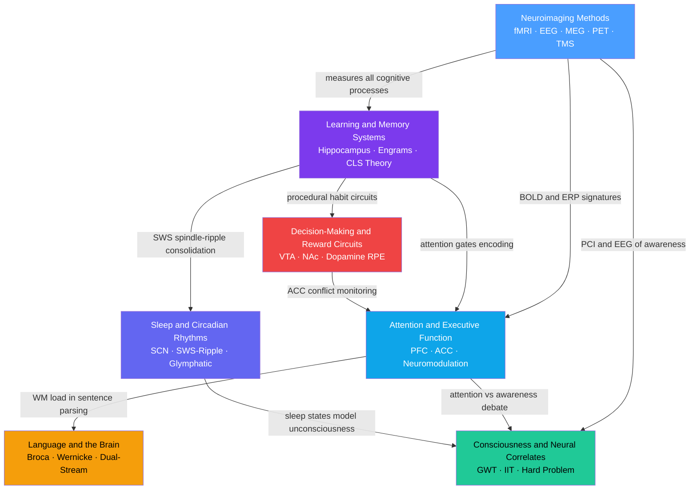

# Cognitive Neuroscience — Map of Content

> [!abstract] About This Section
> Cognitive neuroscience bridges psychology and neuroscience by studying how brain circuits give rise to cognition — memory, attention, language, sleep, consciousness, and decision-making — asking not just which region is active but what computation it performs and why that computation produces observable behaviour. Neuroimaging methods (fMRI, EEG, MEG, PET, TMS) are the empirical instruments that make these questions tractable, allowing researchers to observe synaptic-timescale dynamics and millimetre-scale spatial organisation in the living human brain. Together the seven notes in this section trace a path from the observational toolkit through the canonical cognitive systems to the hardest open question in science: why any physical brain process is accompanied by subjective experience.

> [!info] How to use this map
> Start with **Fundamentals**, follow the arrows, and use the Learning Paths below as your guide. Each node links to a full note. Come back to this map when you feel lost.

---

## Concept Map

Blue = methodological foundation, Purple = core conceptual anchor, Teal/Amber/Indigo = intermediate, Red = advanced circuit-level, Green = advanced integrative. Arrows show "builds on" or "feeds into."

---

## Learning Paths

### Foundation Path

Recommended order for a first pass through this section:

1. [[Neuroimaging_Methods]] — start here to understand the observational toolkit; every empirical claim in the other six notes rests on fMRI, EEG, MEG, or PET evidence, and knowing what BOLD actually measures prevents misinterpretation throughout
2. [[Learning_and_Memory_Systems]] — the most foundational cognitive system; establishes the declarative/procedural/working memory taxonomy, hippocampal indexing, encoding-consolidation-retrieval pipeline, and CLS theory that ties biological memory to machine learning
3. [[Attention_and_Executive_Function]] — builds on the working-memory component introduced in the memory note; covers the prefrontal-parietal circuitry governing goal-directed control, the Miyake three-factor executive model, and neuromodulatory regulation
4. [[Language_and_the_Brain]] — applies PFC and temporal-lobe anatomy to the most distinctly human cognitive capacity; the dual-stream model, Broca/Wernicke dissociation, and N400/P600 ERP signatures build directly on attention and memory foundations

### Advanced Path

Complete after the Foundation Path:

1. [[Decision_Making_and_Reward_Circuits]] — introduces mesolimbic dopamine and temporal-difference learning; reuses the reinforcement concepts from the memory note and the ACC conflict-monitoring circuitry from the attention note
2. [[Consciousness_and_Neural_Correlates]] — capstone integrative note; requires understanding of attention networks, working memory, neuroimaging methods, and sleep states to evaluate GWT, IIT, predictive processing, and the hard problem critically
3. [[Sleep_and_Circadian_Rhythms]] — closes the loop by explaining how offline brain states consolidate memories formed during waking, clear metabolic waste via the glymphatic system, and regulate circadian-phase-dependent cognition

---

## All Notes in This Section

| Note | Core Concept | Level |
|------|-------------|-------|
| [[Neuroimaging_Methods]] | fMRI BOLD, EEG oscillations, MEG, PET tracers, TMS virtual lesions — spatial vs temporal resolution trade-offs | Foundational |
| [[Learning_and_Memory_Systems]] | Multiple parallel memory systems, hippocampal indexing, CLS theory, engrams, reconsolidation | Intermediate |
| [[Attention_and_Executive_Function]] | Top-down/bottom-up attention networks, dlPFC-ACC executive control, Miyake three-factor model | Intermediate |
| [[Language_and_the_Brain]] | Left-hemisphere lateralization, Broca/Wernicke dual-stream model, aphasia taxonomy, N400/P600 ERPs | Intermediate |
| [[Decision_Making_and_Reward_Circuits]] | Dopamine reward prediction error, mesolimbic actor-critic circuit, OFC value encoding, addiction | Advanced |
| [[Sleep_and_Circadian_Rhythms]] | SCN molecular clock, NREM/REM architecture, SWS-spindle-ripple consolidation, glymphatic clearance | Advanced |
| [[Consciousness_and_Neural_Correlates]] | Neural correlates of consciousness, Global Workspace vs IIT, hard problem, PCI, no-report paradigms | Advanced |

---

## Key Questions This Section Answers

- What are the distinct neural systems that support different types of learning and memory, and why does hippocampal damage leave procedural and implicit memory intact?
- How does the prefrontal cortex coordinate attention, working memory, and cognitive flexibility, and what neuromodulators govern this circuit?
- Why is language lateralized to the left hemisphere, and what specific deficit pattern results from damage at each node in the perisylvian network?
- How does sleep actively improve memory rather than merely permitting it, and what molecular events during slow-wave sleep transfer memories from hippocampus to neocortex?
- Why does dopamine encode prediction errors rather than pleasure, and how does this signal drive both adaptive reinforcement learning and pathological addiction?
- What is a neural correlate of consciousness, and why do Global Workspace Theory and Integrated Information Theory disagree about where in the brain consciousness is generated?
- What are the spatial and temporal resolution constraints of each neuroimaging modality, and when should methods be combined to answer a cognitive question?

---

## Cross-Section Connections

- [[Synaptic_Plasticity_and_LTP]] (Section 01 — Cellular Neuroscience) — LTP at CA3-CA1 hippocampal synapses is the molecular implementation of memory encoding; NMDA-receptor Ca²⁺ influx and CaMKII autophosphorylation instantiate each memory trace; the CREB transcription cascade is the gate between short-term and long-term synaptic change
- [[Cerebral_Cortex_and_Lobes]] (Section 02 — Neuroanatomy) — the frontal, temporal, and parietal lobes house the prefrontal executive network, the perisylvian language system, and the posterior parietal attention maps that are the anatomical substrate of every note in this section; cortical layer organisation determines which cell types generate the LFP and spiking signals that fMRI and EEG detect
- [[Auditory_System_and_Sound_Processing]] (Section 03 — Sensory Systems) — the ascending auditory pathway terminates in Heschl's gyrus and feeds directly into Wernicke's area; sensory cortices are the downstream targets of top-down attentional gain modulation; feedforward sensory sweep provides the initial input that triggers global workspace ignition

---

## Link to Master MOC

[[_MOC_Neuroscience_Master]] — return to the full Neuroscience vault entry point

---

#MOC #Neuroscience #CognitiveNeuroscience #SectionMOC
