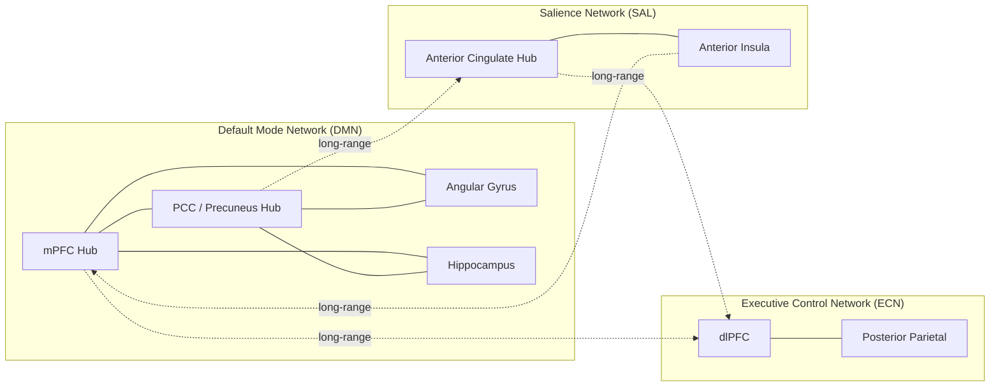

# 🧠 Connectomics and Network Neuroscience

> [!abstract] TL;DR
> Connectomics is the systematic mapping of every synaptic connection in a nervous system — from the 302-neuron wiring diagram of *C. elegans* to the trillion-synapse project to reconstruct the human brain. Network neuroscience applies graph theory to those maps, treating brain regions as nodes and white-matter tracts or functional correlations as edges, to quantify how information routes across the brain. The Human Connectome Project and large-scale resting-state fMRI studies have revealed that the human brain is organized as a **small-world network** with densely connected local clusters, costly long-range hub-to-hub connections, and a rich-club core whose failure drives major psychiatric and neurological disease.

---

## Intuition — analogy FIRST

Think of the connectome as **Google Maps for the brain**. Structural connectivity — physical axon bundles — is the road network: motorways, A-roads, and local lanes, each with a fixed capacity. Functional connectivity — the correlation of activity between regions — is the live traffic layer: some roads carry rush-hour gridlock, others are empty at 3 am, and the pattern shifts entirely when you switch from resting to solving a maths problem.

Just as Google Maps reveals that a small number of cities function as **major airports** — every flight eventually passes through Heathrow, JFK, or Dubai regardless of its true origin or destination — the brain has rich-club hub regions (precuneus, posterior cingulate cortex, medial prefrontal cortex, angular gyrus) through which an outsized fraction of information flow must pass. Damage one of those hubs and you disrupt communication across many networks simultaneously, just as closing Heathrow does not merely strand London travellers but cascades delays across the entire global air-traffic network.

---

## How It Works

**Two complementary connectomes are measured in practice:**

1. **Structural connectome** — the anatomical wiring. At the nanoscale, electron microscopy (EM) physically images every synapse and reconstructs axonal paths through brain tissue. In living humans, **diffusion MRI tractography** estimates white-matter tracts by tracking how water molecules diffuse preferentially along myelinated axons.

2. **Functional connectome** — the statistical co-activation patterns. Resting-state fMRI (rs-fMRI) measures the BOLD signal in ~300–1000 cortical parcels simultaneously. Pearson correlations between parcels over time yield a symmetric **functional connectivity matrix** whose structure reveals resting-state networks (RSNs) that consistently emerge across individuals.

**Graph theory is the common language.** Both connectomes become weighted graphs: the matrix entry $w_{ij}$ is tract strength (number of streamlines, fractional anisotropy) or temporal correlation ($r$) between regions $i$ and $j$. From that graph:

| Metric | Definition | Brain interpretation |
|---|---|---|
| **Degree** | Number of edges at a node | High degree = hub region |
| **Clustering coefficient (C)** | Fraction of node's neighbours that also connect to each other | Local segregation; high C = tight local community |
| **Average path length (L)** | Mean shortest path between all node pairs | Global integration; low L = efficient long-range routing |
| **Betweenness centrality** | Fraction of all shortest paths passing through a node | Identifies bottleneck hubs; critical for robustness analysis |
| **Rich-club coefficient** | Tendency of high-degree nodes to connect to each other | Measures the existence of a dense, mutually connected core |

**Small-world index ($\sigma$):** A network is small-world if $\sigma = (C/C_{rand}) / (L/L_{rand}) \gg 1$ — meaning it has far more local clustering than a random network with the same number of edges, yet retains nearly as short an average path length. The human brain consistently shows $\sigma \approx 2$–$3$.



*Solid edges = dense within-network clustering (high local C). Dotted arrows = sparse between-network hub connections (short global L). This combination defines small-world architecture.*

---

## Key Concepts

### Secondary Level

**What is a connectome?**

A connectome is the complete map of neural connections in a nervous system — every neuron and every synapse, resolved at whatever scale the imaging technology permits. The concept was formalised by Francis Crick and Edward Jones (1993) and Olaf Sporns (2005), who coined "connectome" by analogy with "genome."

**C. elegans: the proof of principle**

The nematode worm *Caenorhabditis elegans* has exactly 302 neurons and approximately 7,000 chemical synapses. Sydney Brenner championed it as a model organism; John White and colleagues (1986) published its complete wiring diagram from serial-section EM — the first complete connectome of any organism. Every copy of *C. elegans* has the same wiring, making it the only system where a structural map has been repeatedly validated against behaviour and genetics.

**Why does mapping connections matter?**

Structure constrains function. A synapse that does not exist cannot transmit a signal. The connectome determines which computations are possible, how fast information can travel across the brain, and which perturbations (lesions, seizures, drugs) will propagate widely versus stay local. Understanding the wiring diagram is a prerequisite for mechanistic neuroscience, just as a circuit schematic is a prerequisite for electronics.

**Scale of the human problem**

The human brain contains approximately 86 billion neurons and an estimated 100 trillion ($10^{14}$) synaptic connections. The cerebral cortex alone has ~16 billion neurons. A one-cubic-millimetre block of human neocortex contains roughly 100,000 neurons and ~1 billion synapses — and would generate about 1 petabyte of EM image data. Complete nanoscale human connectomics remains decades away.

---

### Undergraduate Level

**Human Connectome Project (HCP)**

Launched in 2010 by the NIH, the HCP recruited ~1,200 healthy adults and acquired multimodal MRI data: high-resolution structural MRI, diffusion MRI (tractography), resting-state fMRI, and task fMRI across seven cognitive domains. The HCP established the 360-parcel multimodal parcellation (MMP1.0; Glasser et al. 2016) as the current standard for whole-brain network analysis.

**Diffusion MRI and tractography**

Water molecules inside myelinated axons diffuse more readily along the fiber axis than across it — a phenomenon called **fractional anisotropy (FA)**. Diffusion tensor imaging (DTI) fits a 3D ellipsoid to the diffusion pattern in each voxel and derives FA ($0 = $ isotropic, $1 = $ perfectly anisotropic). Tractography algorithms follow FA directions from seed voxels to reconstruct putative white-matter pathways. The result is the macroscale structural connectome at ~2 mm resolution.

**Resting-state fMRI and functional connectivity**

During rest, BOLD signal fluctuations spontaneously correlate between spatially distant regions that share functional affiliation. Seed-based correlation (pick a reference region, correlate its time series with every voxel) and independent component analysis (ICA) both reveal a consistent set of **resting-state networks (RSNs)**:

| Network | Core regions | Primary function |
|---|---|---|
| Default Mode Network (DMN) | mPFC, PCC/precuneus, angular gyrus, hippocampus | Self-referential thought, episodic memory, mind-wandering |
| Executive Control Network (ECN) | dlPFC, posterior parietal | Working memory, cognitive control |
| Salience Network (SAL) | Anterior cingulate, anterior insula | Error detection, switching attention |
| Sensorimotor Network | Primary motor + somatosensory cortex | Movement and touch |
| Visual Network | V1–V5 + occipital cortex | Visual processing |

**Graph theory fundamentals applied to brain networks**

- **Node** = brain region (a cortical parcel or anatomical ROI)
- **Edge** = white-matter tract (structural) or functional correlation (functional)
- **Degree distribution**: the brain does not follow a pure scale-free distribution but has a heavy-tailed degree distribution — a small number of regions accumulate far more connections than average
- **Clustering coefficient (C)**: quantifies local segregation; the DMN has unusually high internal clustering
- **Average path length (L)**: low L means the brain can integrate information efficiently across distant regions
- **Small-world networks (Watts-Strogatz, 1998)**: constructed by taking a regular ring lattice and randomly rewiring a small fraction of edges; produces high C and low L simultaneously — the precise combination observed in the brain

**Hub regions and rich-club organisation**

Hub regions — identified by high degree, high betweenness centrality, and high participation coefficient (connections spanning multiple networks) — include: **precuneus, posterior cingulate cortex (PCC), medial prefrontal cortex (mPFC), angular gyrus, lateral prefrontal cortex, and superior parietal lobe**. These regions form a **rich club**: hubs preferentially connect to other hubs, creating a dense, mutually connected core that serves as the brain's backbone for global information integration. Rich-club connections are disproportionately costly (long-range, heavily myelinated, metabolically expensive) and disproportionately vulnerable.

---

### Graduate Level

**Electron microscopy connectomics at nanoscale**

EM connectomics physically images brain tissue at 4–10 nm resolution, traces every neurite by hand or with AI, and identifies synapse type (excitatory/inhibitory), size, and number. Landmark datasets:

- **FlyWire (2023)**: complete adult *Drosophila melanogaster* connectome — 139,255 neurons, 54.5 million synapses, reconstructed from a full adult fly brain EM volume. Published as a series of five papers in *Nature* (Dorkenwald et al., Schlegel et al., Lin et al., Matsliah et al., Buhmann et al., 2023–2024).
- **MiCrONS (2021)**: ~1 mm³ of mouse visual cortex (V1) — 75,000 neurons, 523 million synapses. The largest mammalian connectome to date, enabling cell-type-level circuit analysis.
- **H01 (Human cortex, 2021)**: 1 mm³ of human temporal cortex — 100 TB of raw EM images, ~130 million synaptic connections. First human tissue connectome, published by Shapson-Coe et al. (*Science*, 2024).

**Graph theoretical analysis of disease**

Neurological and psychiatric disorders show characteristic graph-theoretic signatures:

- **Alzheimer's disease**: atrophy begins in and around hub regions (precuneus, PCC, entorhinal cortex) — the "hub vulnerability hypothesis". Misfolded tau and amyloid propagate preferentially along high-degree structural connections. Network efficiency decreases before cognitive symptoms emerge, making connectome analysis a candidate early biomarker.
- **Schizophrenia**: reduced global efficiency and disrupted rich-club organisation, particularly in the fronto-parietal and default-mode networks. Reduced FA in the arcuate fasciculus correlates with formal thought disorder severity.
- **Epilepsy**: ictal networks are topologically characterised by abnormally high clustering in the epileptogenic zone; surgical resection of high-betweenness-centrality nodes correlates with better seizure outcomes.
- **Traumatic brain injury**: preferential white-matter damage at grey-white matter junctions (diffuse axonal injury) systematically disrupts high-FA, long-range rich-club connections.

**Community detection in brain networks**

The brain's modular organisation — functionally specialised RSNs — can be recovered from connectivity matrices using community detection algorithms. The **Louvain algorithm** optimises a quality function called **modularity ($Q$)**:

$$Q = \frac{1}{2m} \sum_{ij} \left[ A_{ij} - \frac{k_i k_j}{2m} \right] \delta(c_i, c_j)$$

where $A_{ij}$ is the adjacency matrix, $k_i$ is degree, $m$ is total edge weight, and $\delta(c_i, c_j) = 1$ if nodes $i$ and $j$ are in the same community. The resolution parameter $\gamma$ controls how finely the brain is partitioned — varying $\gamma$ produces hierarchical community structure at multiple spatial scales, from the seven canonical RSNs down to individual functional areas.

**Dynamic functional connectivity**

Static functional connectivity averages BOLD correlations over the entire scan (~10 minutes), losing temporal dynamics. Dynamic FC (dFC) uses sliding-window correlation or hidden Markov models to capture how connectivity patterns shift over seconds to minutes. The brain visits a small repertoire of discrete **brain states** — configurations of FC that recur across individuals and conditions. State occupancy and transition rates are altered in depression, ADHD, and during anaesthesia.

**Multi-scale connectomics challenge**

The field faces a fundamental scale integration problem. EM connectomics resolves individual synapses but is limited to cubic millimetres. DTI tractography covers the whole brain but cannot resolve individual axons, is blind to inhibitory vs. excitatory distinctions, and has a high false-positive rate for long-range tract reconstruction (the "fiber-crossing problem"). Bridging nanoscale synaptic detail to whole-brain graph topology remains unsolved.

**Fiber tracking validation problem**

DTI tractography is probabilistic inference, not anatomical ground truth. Validation studies using viral tract-tracing in macaques show that tractography produces approximately 50–90% false positives depending on algorithm, data quality, and threshold. The HCP's high-resolution multiband acquisitions and HARDI/multishell diffusion schemes (resolving crossing fibers via spherical deconvolution) substantially improve specificity but do not eliminate the problem. All structural connectome findings in humans should be interpreted as estimated connectivity, not confirmed axonal pathways.

---

## Python Demo

```python
import numpy as np
import matplotlib.pyplot as plt
import networkx as nx  # pip install networkx

# -------------------------------------------------------
# Demonstrate small-world properties of brain-like networks
# Watts-Strogatz model is the canonical small-world generator
# -------------------------------------------------------

N = 80   # number of cortical parcels
K = 6    # each parcel initially connects to K nearest "neighbours"
P = 0.1  # rewiring probability (0 = regular ring, 1 = random graph)

# Build small-world graph (brain-like topology)
G_sw = nx.watts_strogatz_graph(N, K, P, seed=42)

# Build equivalent random graph (Erdős–Rényi) for comparison
edge_density = nx.density(G_sw)
G_rand = nx.erdos_renyi_graph(N, edge_density, seed=42)

# -------------------------------------------------------
# Graph-theoretic metrics
# -------------------------------------------------------
def avg_path_length(G):
    """Average shortest path length, restricted to largest component."""
    if nx.is_connected(G):
        return nx.average_shortest_path_length(G)
    lcc = G.subgraph(max(nx.connected_components(G), key=len)).copy()
    return nx.average_shortest_path_length(lcc)

C_sw   = nx.average_clustering(G_sw)
C_rand = nx.average_clustering(G_rand)
L_sw   = avg_path_length(G_sw)
L_rand = avg_path_length(G_rand)

# Small-world index: gamma >> 1 confirms small-world regime
gamma = (C_sw / C_rand) / (L_sw / L_rand)

print(f"{'Metric':<34} {'Small-World':>12} {'Random':>12}")
print("-" * 60)
print(f"{'Clustering Coefficient  C':<34} {C_sw:>12.4f} {C_rand:>12.4f}")
print(f"{'Average Path Length     L':<34} {L_sw:>12.4f} {L_rand:>12.4f}")
print(f"{'C ratio  (C_sw / C_rand)':<34} {C_sw/C_rand:>12.4f} {'1.0000':>12}")
print(f"{'L ratio  (L_sw / L_rand)':<34} {L_sw/L_rand:>12.4f} {'1.0000':>12}")
print(f"{'Small-World Index  γ':<34} {gamma:>12.4f} {'1.0000':>12}")

# -------------------------------------------------------
# Visualise adjacency matrices (connectivity matrices)
# -------------------------------------------------------
adj_sw   = nx.to_numpy_array(G_sw)
adj_rand = nx.to_numpy_array(G_rand)

fig, axes = plt.subplots(1, 2, figsize=(12, 5))
fig.patch.set_facecolor('#12122a')

for ax, adj, title in zip(
    axes,
    [adj_sw, adj_rand],
    ['Brain-like (Watts-Strogatz)\nSmall-World Network',
     'Random (Erdős-Rényi)\nBaseline Comparison']
):
    ax.imshow(adj, cmap='Blues', aspect='auto', interpolation='none')
    ax.set_title(title, color='white', fontsize=11, fontweight='bold')
    ax.set_xlabel('Region index', color='white', fontsize=9)
    ax.set_ylabel('Region index', color='white', fontsize=9)
    ax.tick_params(colors='white')
    ax.set_facecolor('#1e1e3a')
    for spine in ax.spines.values():
        spine.set_edgecolor('#555')

# Note: band structure near diagonal = local clustering (small-world)
# Random matrix has no such structure — connections are scattered
fig.suptitle(
    f'Small-world: C={C_sw:.3f}, L={L_sw:.2f}, γ={gamma:.2f}  |  '
    f'Random: C={C_rand:.3f}, L={L_rand:.2f}',
    color='white', fontsize=10, y=1.02
)
plt.tight_layout()
plt.savefig('connectome_small_world.png', dpi=150, bbox_inches='tight',
            facecolor='#12122a')
plt.show()

# Expected output (approximate):
# Metric                             Small-World       Random
# ------------------------------------------------------------
# Clustering Coefficient  C               0.4895       0.0794
# Average Path Length     L               4.1222       3.9844
# C ratio  (C_sw / C_rand)                6.1600       1.0000
# L ratio  (L_sw / L_rand)                1.0346       1.0000
# Small-World Index  γ                    5.9542       1.0000
# => C is ~6x higher than random, L is barely longer: true small-world
```

---

## Real-World Applications

> **Alzheimer's Disease — Hub Vulnerability and Spreading Pathology**
> The default mode network hubs (precuneus, PCC, mPFC) are among the first regions to show amyloid-β deposition and tau accumulation in Alzheimer's disease. The "hub vulnerability hypothesis" proposes that high metabolic activity in hubs generates more oxidative stress and amyloid precursor protein processing, while high connectivity means that once a hub becomes dysfunctional, the pathology propagates preferentially along its dense axonal connections to connected regions. Connectome-based **network spreading models** (using the Laplacian of the structural connectivity matrix) can retrodict empirical tau PET spreading patterns with ~70% accuracy — suggesting that axonal transport along white-matter edges is a primary disease propagation mechanism.

> **Epilepsy Surgery — Identifying the Epileptogenic Network**
> Temporal lobe epilepsy is not caused by a single malfunctioning neuron but by an abnormal network — the epileptogenic zone has abnormally high clustering coefficient and abnormally short path length to motor cortex, explaining why seizures rapidly recruit motor symptoms. Pre-surgical stereoEEG (intracranial electrode arrays) combined with graph theoretical analysis identifies the node with highest **betweenness centrality** within the seizure network. Resecting that node — not necessarily the region of first discharge — has been shown to correlate with better seizure-free outcomes than anatomically guided resection alone.

> **Disorders of Consciousness — Network Efficiency as Biomarker**
> Patients in vegetative state show markedly reduced global efficiency ($E_{glob}$) and disrupted rich-club connectivity compared to minimally conscious state or healthy controls. The cortical "posterior hot zone" (precuneus, PCC) — a DMN hub — consistently fails to integrate information in non-conscious states. This has driven interest in **network efficiency** as a continuous, objective biomarker to discriminate conscious states, complementing EEG complexity measures.

> **Targeted Neuromodulation — Knowing Which Hub to Stimulate**
> Transcranial magnetic stimulation (TMS) and deep brain stimulation (DBS) produce effects that radiate through the structural connectome far beyond the stimulated site. Connectome-guided stimulation — targeting a cortical site whose white-matter connections reach the desired therapeutic network — has improved outcomes in depression (sgACC-connected dorsomedial PFC), OCD (subgenual ACC), and tremor (ventral intermediate thalamic nucleus with dentate-rubro-thalamic tract mapping). The principle: to modulate a network, stimulate its highest-betweenness hub.

---

## Common Pitfalls

- **DTI tractography is not anatomical ground truth** — Tractography reconstructs streamlines from water-diffusion statistics; it cannot distinguish true axons from false-positive paths, resolve crossing-fiber geometry within a voxel, or confirm whether a tract is excitatory or inhibitory. Validation against tracer studies in macaques shows 50–90% false-positive rates depending on algorithm. Report "estimated connectivity" not "confirmed tract."

- **Functional connectivity does not equal structural connectivity** — Regions can show strong functional correlation without a direct structural connection (mediated via a relay node), and directly connected regions can have weak functional correlation at rest. The two connectomes are complementary, not interchangeable. Conflating them leads to incorrect mechanistic claims.

- **Correlation does not equal causal connection in functional networks** — A high FC value between regions A and B could reflect direct communication, shared input from region C, or a global signal artifact from head motion or cardiac pulsation. Motion artefacts in fMRI inflate short-range correlations and can mimic or obscure genuine connectivity differences. Rigorous motion scrubbing (FD < 0.2 mm framewise displacement threshold) is non-negotiable before group comparisons.

- **Hub status depends on threshold and parcellation** — Whether a region is classified as a hub varies with: (a) the parcellation used (AAL vs. Schaefer vs. HCP-MMP1.0), (b) the edge-weight threshold applied before binarising the matrix, and (c) whether structural or functional connectivity is used. A "hub" identified in one analysis pipeline may disappear in another. Always report sensitivity analyses across thresholds.

- **The Watts-Strogatz model is descriptive, not mechanistic** — Showing that the brain's graph metrics resemble a WS small-world network describes *that* it is organised that way, not *why* or *how* development and evolution produced that organisation. Overclaiming "the brain is a small-world network" as an explanatory finding conflates phenomenology with mechanism.

---

## Related Concepts

- [[Gross_Anatomy_of_the_Brain]] — provides the anatomical substrate: white-matter tracts are the physical edges of the structural connectome; DTI tractography reconstructs the same pathways described there as association, projection, and commissural fibers
- [[Neuron_Structure_and_Function]] — each node in a connectome is ultimately a population of neurons; dendritic arborisations and axonal projection patterns determine the microscale connectivity underlying each macroscale edge
- [[Synaptic_Plasticity_and_LTP]] — activity-dependent synaptic strengthening (Hebbian plasticity) is the cellular mechanism by which functional connectivity edges form and reshape over time; rich-club edges may be stabilised by Hebbian co-activation
- [[Cerebral_Cortex_and_Lobes]] — hub regions (precuneus, PCC, mPFC, angular gyrus) are all cortical structures whose laminar organisation determines local circuit properties and long-range projection targets
- [[Neuroimaging_Methods]] — the measurement toolkit for human connectomics: DTI/HARDI for structural edges, rs-fMRI for functional edges, and atlas parcellation for node definition
- [[Neural_Oscillations_and_Synchrony]] — functional connectivity measured by fMRI captures slow-frequency (~0.01–0.1 Hz) BOLD correlations; electrophysiological synchrony (gamma, alpha, theta coherence) is the faster-timescale mechanism underlying those correlations
- [[Neurodegenerative_Diseases]] — Alzheimer's, Parkinson's, and frontotemporal dementia each produce characteristic connectome signatures; hub vulnerability and network spreading models are central to understanding their progression
- [[Graph_Representation]] (DSA) — the mathematical data structures (adjacency matrix, edge list, weighted graph) used to store and query the connectivity matrix are identical to those used in software graph algorithms

**Section MOC:**
- [[_MOC_Computational_Neuroscience|↑ Computational Neuroscience MOC]]

---

## Review Questions

1. **Secondary level** — A researcher claims that a brain region is a "hub" because it has a high clustering coefficient. A colleague disagrees, saying clustering coefficient alone is not sufficient to define a hub. Who is correct and why? Name two additional graph-theoretic metrics that are more appropriate for identifying hubs, and explain what each captures.

2. **Undergraduate level** — You acquire resting-state fMRI on 50 healthy controls and 50 patients with early Alzheimer's disease. Describe the full analysis pipeline from raw BOLD data to a group-level comparison of network efficiency. At each step, name one methodological decision that could introduce spurious group differences and how you would guard against it.

3. **Graduate level** — The FlyWire *Drosophila* connectome has 139,255 neurons and 54.5 million synapses, yet it was reconstructed from a single fly. What are three fundamental limitations of generalising from this connectome to understanding *Drosophila* behaviour at the population level, and what experimental strategies would you propose to address each limitation?

---

## Sources

- Sporns, O. — *Networks of the Brain* (MIT Press, 2010) — foundational textbook on graph theory applied to neuroscience; defines the connectome and establishes small-world and rich-club analyses
- Bullmore, E. & Sporns, O. (2009) — "Complex brain networks: graph theoretical analysis of structural and functional systems" — *Nature Reviews Neuroscience* 10, 186–198 — the most-cited review in network neuroscience; defines key metrics and their biological interpretations
- Watts, D.J. & Strogatz, S.H. (1998) — "Collective dynamics of 'small-world' networks" — *Nature* 393, 440–442 — original small-world network paper; directly motivates the Watts-Strogatz model applied to brain graphs
- White, J.G. et al. (1986) — "The structure of the nervous system of the nematode *Caenorhabditis elegans*" — *Philosophical Transactions of the Royal Society B* 314, 1–340 — the original complete connectome
- Dorkenwald, S. et al. (2024) — "Neuronal wiring diagram of an adult brain" — *Nature* 634, 1166–1180 — FlyWire adult *Drosophila* connectome
- van den Heuvel, M.P. & Sporns, O. (2011) — "Rich-club organization of the human connectome" — *Journal of Neuroscience* 31, 15775–15786 — defines and empirically demonstrates rich-club organisation in DTI-based human connectomes
- Glasser, M.F. et al. (2016) — "A multi-modal parcellation of human cerebral cortex" — *Nature* 536, 171–178 — HCP MMP1.0 atlas; the current standard parcellation for network neuroscience

---

#Neuroscience #ComputationalNeuroscience #Connectomics #NetworkNeuroscience
