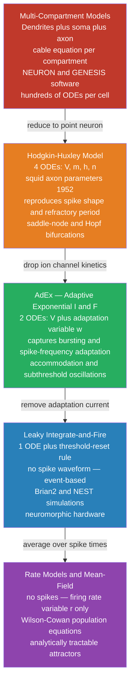

# ⚡ Hodgkin-Huxley Model and Computational Neurons

> [!abstract] TL;DR
> The **Hodgkin-Huxley (HH) model** is the canonical conductance-based neuron model, published in 1952, that explains action potential generation as the interplay of voltage-gated Na⁺ and K⁺ conductances governed by three gating variables (*m*, *h*, *n*) — a result that earned Hodgkin and Huxley the Nobel Prize in 1963. Simpler models — the leaky integrate-and-fire (LIF), adaptive exponential integrate-and-fire (AdEx) — sacrifice biophysical realism for computational efficiency, enabling real-time simulation of networks containing tens of thousands of neurons. Together this family of models forms the quantitative bridge between single-cell electrophysiology, large-scale brain simulation, neuromorphic hardware design, and bio-inspired artificial intelligence.

---

## Intuition — analogy FIRST

**The HH neuron as an electrical circuit; the LIF neuron as a leaky bucket.**

Picture the cell membrane as a simple **RC circuit**. The lipid bilayer is a capacitor (it stores charge without letting ions cross). Wired in parallel across that capacitor are several variable resistors — one for Na⁺, one for K⁺, one small leak — and each resistor is in series with a battery set to the Nernst potential of that ion species. When you push current into this circuit, the capacitor charges up. At a critical voltage, the Na⁺ resistor suddenly *decreases* its resistance (channels swing open), a self-amplifying loop drives the voltage skyward, and then an automatic resetting mechanism (Na⁺ channel inactivation + K⁺ channel opening) repolarizes the membrane. This is the Hodgkin-Huxley model in one sentence: a parallel RLC circuit whose resistors are nonlinear, voltage-dependent, and time-lagged.

The leaky integrate-and-fire neuron strips away all that richness and replaces it with a **leaky bucket filling with water**. The tap pouring water in is the synaptic input current; the hole in the bucket's bottom is the passive membrane leak draining the voltage back toward rest; the bucket's rim is the firing threshold. When water reaches the rim, the neuron fires a spike — a single abstract event with no shape — the bucket is instantly emptied (voltage reset), and the process repeats. No variable resistors, no gating variables, just a one-line equation and a threshold rule. This simplification costs accuracy but grants the ability to simulate entire cortical columns in milliseconds.

---

## How It Works

### Core Mechanics

**The Hodgkin-Huxley equations** express the rate of change of membrane voltage as the sum of ionic currents and external drive, divided by membrane capacitance:

$$C_m\frac{dV}{dt} = -\bar{g}_{Na}m^3h(V-E_{Na}) - \bar{g}_K n^4(V-E_K) - \bar{g}_L(V-E_L) + I_{ext}$$

The three gating variables each obey **first-order kinetics**, relaxing between 0 (closed) and 1 (fully open) at rates that depend on the instantaneous membrane voltage:

$$\frac{dm}{dt} = \alpha_m(V)(1-m) - \beta_m(V)m$$

$$\frac{dh}{dt} = \alpha_h(V)(1-h) - \beta_h(V)h$$

$$\frac{dn}{dt} = \alpha_n(V)(1-n) - \beta_n(V)n$$

The steady-state value of each variable is $x_\infty(V) = \alpha_x / (\alpha_x + \beta_x)$ and the voltage-dependent relaxation time constant is $\tau_x(V) = 1 / (\alpha_x + \beta_x)$.

| Variable | Channel | Biological role | Dominant kinetics |
|----------|---------|----------------|-------------------|
| m | Na⁺ activation | Opens on depolarisation; initiates the spike | Fast (~0.3 ms) |
| h | Na⁺ inactivation | Closes on sustained depolarisation; terminates Na⁺ influx | Slow (~2 ms) |
| n | K⁺ activation | Opens on depolarisation; drives repolarisation | Slow (~5 ms) |

The Na⁺ conductance $\bar{g}_{Na}m^3h$ peaks when *m* has risen sharply but *h* has not yet fallen — the brief window in which all three activation subunits are open and the inactivation gate has not yet shut. The $m^3$ and $n^4$ powers reflect the cooperativity of multi-subunit channels: the channel opens only when all required independent subunit gates are simultaneously in the open state.

**The Leaky Integrate-and-Fire (LIF) model** replaces all channel kinetics with a single subthreshold ODE:

$$\tau_m\frac{dV}{dt} = -(V-E_L) + R_m I_{ext}$$

where $\tau_m = R_m C_m$ is the membrane time constant (typical: 10–20 ms for cortical neurons), $E_L$ is the leak reversal potential (~−65 mV), and $R_m$ is the input resistance. When $V$ reaches threshold $V_{th}$, the model emits a spike event, resets $V$ to $V_r$, and enforces an absolute refractory period $\tau_{ref}$. The steady-state firing rate as a function of constant input current — the **F-I curve** — is analytically exact:

$$f = \left[\tau_{ref} + \tau_m \ln\!\left(\frac{R_m I_{ext} - (V_r - E_L)}{R_m I_{ext} - (V_{th} - E_L)}\right)\right]^{-1}$$

This gives zero firing below the rheobase current $I_{rh} = (V_{th} - E_L)/R_m$ and a monotonically increasing rate above it — the **Type I** (continuous) F-I characteristic.

### Flow / Architecture



---

## Key Concepts

### Secondary Level

**Neuron as an electrical circuit.** The membrane separates charge like a capacitor. Ion channels are selective pores — each is a conductance element in parallel with the capacitor, in series with a battery set to the reversal potential of that ion. When a channel opens, current flows to push the membrane voltage toward the channel's reversal potential. This circuit metaphor is exact, not approximate: the HH equations are derived by applying Kirchhoff's current law to the membrane.

**Threshold and the all-or-nothing principle.** At approximately −55 mV, the rate of Na⁺ channel opening and the resulting Na⁺ current exceed the outward K⁺ and leak currents that oppose depolarisation. Beyond this tipping point, the system is self-regenerating: more depolarisation → more Na⁺ channels open → more inward current → more depolarisation. Every action potential in a given neuron fires with the same stereotyped shape and amplitude, regardless of whether the stimulus was barely suprathreshold or ten times stronger. Intensity is encoded in **firing rate**, not spike size.

**Refractory period.** In the absolute refractory period (~1–2 ms), the Na⁺ inactivation gate *h* is near zero — the channel cannot open no matter how strong the stimulus. In the relative refractory period (~3–5 ms), *h* has partially recovered but K⁺ conductance remains elevated, raising the effective threshold. These periods enforce unidirectional propagation and cap the maximum firing frequency.

**Why computational models?** Neurons are not accessible for continuous measurement in behaving animals. A validated mathematical model allows prediction of network behaviour under novel conditions (drug doses, stimulation patterns), serves as a null hypothesis for interpreting in vivo recordings, and enables the design of neuromorphic chips whose transistor dynamics mimic the gating equations.

---

### Undergraduate Level

**Rate constants and the Boltzmann steady state.** The empirical rate functions Hodgkin and Huxley fitted to voltage-clamp data at 6.3°C for the squid giant axon are exponential or sigmoidal functions of voltage. The steady-state gating variable $x_\infty(V)$ follows a Boltzmann curve: $x_\infty(V) = 1 / (1 + \exp(-(V - V_{1/2})/k))$, where $V_{1/2}$ is the half-activation voltage and $k$ is the slope factor in mV. More positive $V_{1/2}$ means the variable activates at higher voltages; larger $k$ means a more gradual voltage dependence.

**Phase-plane analysis (V–n plane).** Reducing the four-dimensional HH system to two dimensions by treating *m* as instantaneous (fast variable) and *h* as a fixed function of *n*, and plotting nullclines on the (V, n) plane reveals two qualitatively distinct behaviors separated by a **bifurcation point** at the rheobase current. Below rheobase, the system has a single stable fixed point (resting state). Above rheobase, a stable limit cycle emerges — repetitive firing. The nature of the bifurcation (saddle-node vs. Hopf) governs the neuron's firing type and is observable in the F-I curve.

**LIF model — reset mechanism and time constant.** The time constant $\tau_m = R_m C_m$ sets how rapidly the membrane integrates incoming current. A neuron with a long $\tau_m$ integrates over a wide temporal window — useful for detecting the coincidence of widely separated inputs. After a spike, resetting $V$ to $V_r$ (typically below $E_L$) mimics the afterhyperpolarisation without requiring explicit K⁺ channel dynamics.

**F-I curve and gain.** The slope $df/dI$ (firing rate gain, in Hz per µA/cm²) of the LIF F-I curve is infinite at threshold (the Type I characteristic). Adding an after-spike adaptation current in the AdEx model linearises and tilts the F-I curve, more accurately matching the gradual, accommodating firing patterns of most cortical neurons.

**Cable equation for dendrites.** A dendritic segment of length $dx$, membrane resistance per unit length $r_m$ (Ω·cm), and axial resistance $r_a$ (Ω/cm) satisfies the cable equation:

$$\lambda^2 \frac{\partial^2 V}{\partial x^2} - \tau_m \frac{\partial V}{\partial t} = V - E_L$$

where $\lambda = \sqrt{r_m / r_a}$ is the **space constant** (typical: 0.1–1 mm) and $\tau_m = r_m c_m$. Synaptic inputs on distal dendrites attenuate exponentially with distance; only inputs arriving near the axon initial segment reliably drive threshold crossing. Multi-compartment models discretise the cable equation into coupled RC segments, enabling simulation of dendritic computation.

---

### Graduate Level

**Bifurcation theory: Type I vs. Type II neurons.** The distinction between neuron firing types maps to bifurcation geometry. A **Type I neuron** transitions from rest to repetitive firing via a **saddle-node on an invariant circle (SNIC) bifurcation**: the fixed point coalesces with a saddle point on the limit cycle, allowing arbitrarily low firing frequencies near threshold — the F-I curve rises continuously from zero. A **Type II neuron** (classical HH at standard parameters) transitions via a **subcritical Hopf bifurcation**: the resting fixed point loses stability as a pair of complex eigenvalues cross the imaginary axis, generating a discontinuous jump to a finite frequency at threshold and a hysteresis loop. These differences have profound functional consequences: Type I neurons are good frequency encoders; Type II neurons are better coincidence detectors and more prone to network oscillations.

**AdEx model — capturing adaptation and bursting.** The adaptive exponential integrate-and-fire model adds an exponential spike-initiation term and an adaptation variable *w*:

$$C_m\frac{dV}{dt} = -g_L(V-E_L) + g_L\Delta_T \exp\!\left(\frac{V-V_T}{\Delta_T}\right) - w + I_{ext}$$

$$\tau_w\frac{dw}{dt} = a(V-E_L) - w$$

At each spike, *w* increases by a jump $b$, incrementally reducing the effective drive and producing **spike-frequency adaptation**. With appropriate choices of $a$, $b$, and $\tau_w$, AdEx reproduces all major electrophysiological classes observed with patch-clamp: regular spiking, intrinsic bursting, chattering, fast spiking, and low-threshold spiking cortical neurons — a phenomenological atlas of mammalian neuron types.

**Multi-compartment models and NEURON software.** Point-neuron models assume the membrane is isopotential. Real neurons have extensive dendritic trees whose passive and active properties filter and transform inputs spatially. Multi-compartment models (implemented in NEURON or GENESIS) discretise the dendritic morphology obtained from confocal or electron microscopy reconstructions into cylindrical segments, each with its own membrane equation and active channels. Reproducing the backpropagating action potential (bAP) into dendrites, plateau potentials from NMDA spikes, and Ca²⁺ electrogenesis requires at minimum separate soma, proximal, and distal compartments with different channel densities.

**Spiking neural network (SNN) simulators.** Brian2 (Python-based, flexible specification language, good for prototyping) and NEST (highly optimised C++ kernel with MPI parallelism, good for cortical-scale networks of >10⁷ neurons) both implement event-driven simulation: the simulator advances time only when a spike event changes the state of the network, skipping subthreshold idle periods. This event-driven paradigm mirrors the operation of neuromorphic processors.

**Energy efficiency of spiking vs. rate coding.** Each action potential dissipates roughly 5 × 10⁻¹² J (5 pJ) to restore ion gradients; a neuron firing at 100 Hz consumes ~0.5 µW. Rate-coded artificial neurons (performing multiply-accumulate operations at every timestep) consume power proportional to the number of computations per second, regardless of the data being processed. Spiking neurons are silent — consuming zero dynamic power — in the absence of input. This is why neuromorphic chips (Intel Loihi 2, IBM TrueNorth) achieve orders-of-magnitude lower power consumption than GPU-accelerated rate-coded deep learning for sparse, event-driven sensory tasks.

**Neuromorphic computing.** Intel Loihi 2 implements 1 million LIF-type neuron cores on chip, with on-chip Hebbian and STDP learning rules updated at each spike event. IBM TrueNorth implements 256 "neurosynaptic cores" each containing 256 spiking neurons, achieving 46 billion synaptic operations per second at 70 mW — roughly 1000× more energy-efficient than a GPU for equivalent inference tasks on sparse sensory inputs. The mapping of SNN models to neuromorphic hardware requires transforming trained weights (often from a rate-coded ANN) into spike-timing-compatible conductance values, a non-trivial quantization problem.

---

## Python Demo

```python
# ===================================================================
# Hodgkin-Huxley model via scipy.integrate.solve_ivp +
# Leaky Integrate-and-Fire model via Euler integration
# Demonstrates: repetitive HH spiking, gating variable dynamics,
#               and LIF threshold-reset behaviour
# Libraries: numpy, scipy, matplotlib only
# ===================================================================

import numpy as np
from scipy.integrate import solve_ivp
import matplotlib.pyplot as plt

# ------------------------------------------------------------------ #
#  PART 1: Hodgkin-Huxley model                                       #
#  Parameters: Hodgkin & Huxley (1952), squid giant axon at 6.3°C    #
# ------------------------------------------------------------------ #
C_m     = 1.0     # membrane capacitance  (µF/cm²)
gbar_Na = 120.0   # max Na+ conductance   (mS/cm²)
gbar_K  = 36.0    # max K+  conductance   (mS/cm²)
g_L     = 0.3     # leak conductance      (mS/cm²)
E_Na    =  50.0   # Na+ reversal potential (mV)
E_K     = -77.0   # K+  reversal potential (mV)
E_L_hh  = -54.387 # leak reversal potential (mV)


def alpha_m(V):
    """Na+ activation opening rate (ms⁻¹). L'Hôpital limit at V = -40 mV."""
    dV = V + 40.0
    return 1.0 if abs(dV) < 1e-7 else 0.1 * dV / (1.0 - np.exp(-dV / 10.0))


def beta_m(V):  return 4.0 * np.exp(-(V + 65.0) / 18.0)
def alpha_h(V): return 0.07 * np.exp(-(V + 65.0) / 20.0)
def beta_h(V):  return 1.0 / (1.0 + np.exp(-(V + 35.0) / 10.0))


def alpha_n(V):
    """K+ activation opening rate (ms⁻¹). L'Hôpital limit at V = -55 mV."""
    dV = V + 55.0
    return 0.1 if abs(dV) < 1e-7 else 0.01 * dV / (1.0 - np.exp(-dV / 10.0))


def beta_n(V):  return 0.125 * np.exp(-(V + 65.0) / 80.0)


def hh_rhs(t, y):
    """
    Hodgkin-Huxley right-hand side for solve_ivp.
    State vector y = [V (mV), m, h, n].
    External current: 10 µA/cm² step applied from 5 to 30 ms.
    """
    V, m, h, n = y
    I_ext = 10.0 if 5.0 <= t <= 30.0 else 0.0
    I_Na  = gbar_Na * m**3 * h * (V - E_Na)
    I_K   = gbar_K  * n**4     * (V - E_K)
    I_lk  = g_L                * (V - E_L_hh)
    dVdt  = (I_ext - I_Na - I_K - I_lk) / C_m
    dmdt  = alpha_m(V) * (1.0 - m) - beta_m(V) * m
    dhdt  = alpha_h(V) * (1.0 - h) - beta_h(V) * h
    dndt  = alpha_n(V) * (1.0 - n) - beta_n(V) * n
    return [dVdt, dmdt, dhdt, dndt]


# Steady-state initial conditions at resting potential V0 = -65 mV
V0 = -65.0
am0, bm0 = alpha_m(V0), beta_m(V0)
ah0, bh0 = alpha_h(V0), beta_h(V0)
an0, bn0 = alpha_n(V0), beta_n(V0)
y0 = [V0, am0 / (am0 + bm0), ah0 / (ah0 + bh0), an0 / (an0 + bn0)]

# Integrate 0–50 ms with dense output (max_step keeps spike peaks accurate)
sol = solve_ivp(hh_rhs, [0.0, 50.0], y0, method='RK45', max_step=0.025)
t_hh          = sol.t
V_hh, m_hh, h_hh, n_hh = sol.y

# ------------------------------------------------------------------ #
#  PART 2: Leaky Integrate-and-Fire model (Euler integration)         #
# ------------------------------------------------------------------ #
tau_m_lif = 10.0    # membrane time constant (ms)
E_L_lif   = -65.0  # leak reversal (mV)
R_m_lif   = 10.0   # input resistance (MΩ) — R_m * I in mV when I in nA
V_th      = -50.0  # spike threshold (mV)
V_reset   = -65.0  # reset potential (mV)
t_ref_abs =  2.0   # absolute refractory period (ms)

# Rheobase: R_m * I_rh = V_th - E_L = 15 mV  →  I_rh = 1.5 nA
# Drive:    R_m * I_ext = 20 mV  → 0.33 * tau_m above rheobase
I_drive_mV = 20.0  # equivalent voltage drive (R_m * I_ext, in mV)

dt_lif    = 0.1    # timestep (ms)
T_lif     = 200.0  # total simulation (ms)
n_steps   = int(T_lif / dt_lif)
t_lif     = np.arange(0, T_lif, dt_lif)
V_lif     = np.full(n_steps, E_L_lif)
spikes    = []
t_last    = -np.inf

for i in range(1, n_steps):
    t_now = t_lif[i]
    if (t_now - t_last) < t_ref_abs:
        V_lif[i] = V_reset
        continue
    I_eff  = I_drive_mV if t_now >= 20.0 else 0.0
    dV     = (-(V_lif[i - 1] - E_L_lif) + I_eff) / tau_m_lif
    V_lif[i] = V_lif[i - 1] + dV * dt_lif
    if V_lif[i] >= V_th:
        V_lif[i] = 40.0       # spike marker for visualisation
        spikes.append(t_now)
        t_last = t_now

# ------------------------------------------------------------------ #
#  Plot                                                               #
# ------------------------------------------------------------------ #
fig, axes = plt.subplots(3, 1, figsize=(11, 9))

# Panel 1: HH membrane voltage
axes[0].plot(t_hh, V_hh, color='royalblue', lw=2, label='V(t)')
axes[0].axvspan(5, 30, alpha=0.10, color='gold', label='I_ext = 10 µA/cm²')
axes[0].axhline(-55, color='tomato', ls='--', lw=1, label='~Threshold (−55 mV)')
axes[0].set_ylabel('V (mV)', fontsize=11)
axes[0].set_title('Hodgkin-Huxley Model — Repetitive Firing (solve_ivp, RK45)', fontsize=12)
axes[0].legend(fontsize=9, loc='upper right')
axes[0].set_ylim(-90, 60)
axes[0].set_xlim(0, 50)

# Panel 2: HH gating variables
axes[1].plot(t_hh, m_hh, color='deepskyblue', lw=1.8, label='m — Na⁺ activation')
axes[1].plot(t_hh, h_hh, color='tomato',      lw=1.8, label='h — Na⁺ inactivation')
axes[1].plot(t_hh, n_hh, color='limegreen',   lw=1.8, label='n — K⁺ activation')
axes[1].set_ylabel('Gating Variable', fontsize=11)
axes[1].set_title('Gating Variable Dynamics During Repetitive Spiking', fontsize=12)
axes[1].legend(fontsize=9, loc='upper right')
axes[1].set_ylim(0, 1.1)
axes[1].set_xlim(0, 50)

# Panel 3: LIF voltage
axes[2].plot(t_lif, V_lif, color='darkorchid', lw=1.5)
axes[2].axvline(20.0, color='gray',  ls=':', lw=1.2, label='Current onset (t = 20 ms)')
axes[2].axhline(V_th, color='tomato', ls='--', lw=1.2, label=f'Threshold ({V_th} mV)')
axes[2].set_ylabel('V (mV)', fontsize=11)
axes[2].set_xlabel('Time (ms)', fontsize=11)
axes[2].set_title(
    f'Leaky Integrate-and-Fire — τ_m = {tau_m_lif} ms, '
    f'τ_ref = {t_ref_abs} ms, R_m·I = {I_drive_mV} mV',
    fontsize=12
)
axes[2].legend(fontsize=9, loc='upper right')
axes[2].set_ylim(-75, 55)
axes[2].set_xlim(0, T_lif)

plt.tight_layout()
plt.show()

# Analytical LIF firing rate (steady-state formula)
import math
drive_above_th = I_drive_mV - (V_th - E_L_lif)   # = 20 - 15 = 5 mV
drive_above_r  = I_drive_mV - (V_reset - E_L_lif) # = 20 - 0  = 20 mV
f_theory = 1.0 / (t_ref_abs + tau_m_lif * math.log(drive_above_r / drive_above_th))
print(f"LIF simulated:   {len(spikes)} spikes in {T_lif - 20:.0f} ms "
      f"-> {1000 * len(spikes) / (T_lif - 20):.1f} Hz")
print(f"LIF analytical:  {1000 * f_theory:.1f} Hz  "
      f"(formula: 1 / (τ_ref + τ_m * ln(20/5)))")
```

**What to observe:**
- Panel 1: Under a 10 µA/cm² step (5–30 ms), the HH model fires 4–5 repetitive spikes; voltage drops back to baseline when the step ends, demonstrating that the HH model intrinsically terminates firing.
- Panel 2: The sequence is unmistakable on each spike — *m* rises first (Na⁺ channel opening), then *h* falls (Na⁺ inactivation), then *n* rises (K⁺ channel opening, repolarisation), then *h* slowly recovers. The refractory period corresponds exactly to the interval while *h* is depressed.
- Panel 3: The LIF neuron integrates smoothly toward threshold over ~15 ms (one $\tau_m$), fires, resets, and repeats at a constant rate predicted by the analytical formula (~58–63 Hz for these parameters). Note the complete absence of spike shape — only the amplitude marker at +40 mV.

---

## Real-World Applications

**Drug design — modeling ion channel blockers.** Before synthesising a candidate antiepileptic drug, pharmaceutical teams simulate its effect on the HH Na⁺ channel gating equations (shifting the inactivation curve $h_\infty(V)$ leftward to reproduce *use-dependent block*). This predicts selectivity for rapidly firing neurons (seizure foci) over slowly firing neurons (motor cortex) without wet-lab experiments — a key pre-screening step. Validated HH-based models for Nav1.1 (Dravet syndrome) and Nav1.6 have been used to compute dose-response relationships for novel anticonvulsants.

**Neuromorphic chips — Intel Loihi and IBM TrueNorth.** Both chips implement thousands of on-chip LIF neurons with configurable leak, threshold, and synaptic weights stored in SRAM alongside each core. Spike events propagate asynchronously — no global clock — exactly mimicking event-driven SNN simulators like NEST. Intel Loihi 2 integrates 1 million neurons and 120 million synapses in 31 mm² at 28 nm CMOS, consuming 1–2 orders of magnitude less energy per inference than an equivalent GPU on sparse, temporal tasks (gesture recognition, olfactory classification, constraint satisfaction).

**Deep brain stimulation (DBS) parameter optimisation.** DBS for Parkinson's disease delivers ~130 Hz electrical pulses to the subthalamic nucleus via an implanted electrode. The stimulation parameters (frequency, pulse width, amplitude) must be tuned per patient. HH-type compartment models of subthalamic neurons, basal ganglia circuits, and axonal activation thresholds allow simulation of DBS spread and network entrainment without patient trials, reducing programming clinic time and improving therapeutic outcomes. The closed-loop DBS systems under development use real-time LIF-based decoders to detect pathological beta oscillations and trigger stimulation adaptively.

**Cochlear implant signal processing.** Cochlear implant processors decompose the audio signal into frequency bands and stimulate spiral ganglion neurons (which synapse onto the auditory nerve) via electrode arrays. The electrode-nerve coupling is modelled using the cable equation and HH-type spiral ganglion neuron models. These models predict the minimum pulse charge needed to elicit a spike in each channel without exceeding the electrochemical safety limit of the platinum electrode, directly informing implant firmware.

**Brain-inspired AI — spiking neural networks.** Spiking neural networks (SNNs) use LIF neurons as trainable units and backpropagate through time using surrogate gradients (smooth approximations to the spike threshold non-differentiability). Deployed on neuromorphic hardware, SNNs achieve state-of-the-art accuracy on event-camera object recognition (N-MNIST, N-Caltech101) at power consumption orders of magnitude below equivalent convolutional neural networks, making them attractive for edge AI in battery-powered wearables.

**Cardiac arrhythmias — HH-type models for cardiac myocytes.** The cardiac action potential (plateau ~300 ms, driven by L-type Ca²⁺ channels) follows the same parallel-conductance framework as HH, extended to include $I_{Na}$, $I_{CaL}$, $I_{Kr}$, $I_{Ks}$, $I_{K1}$, and the electrogenic Na⁺/K⁺ pump. The Luo-Rudy model (1991, extended 1994) is the standard for cardiac electrophysiology simulation. Pharmaceutical cardiac safety screening now routinely uses the CiPA (Comprehensive In Vitro Proarrhythmia Assay) initiative, which mandates HH-type in silico modelling of drug-induced QT prolongation before first-in-human trials.

---

## Common Pitfalls

- **"HH parameters are universal — just run the equations."** The 1952 Hodgkin-Huxley parameters were fitted to the squid giant axon at 6.3°C in artificial sea water. Mammalian cortical neurons at 37°C have different channel subtypes (Nav1.1–1.6, Kv1–4, HCN channels), different Q10 temperature coefficients, and different baseline ion concentrations. A HH simulation with squid parameters run on mammalian data will predict incorrect firing thresholds, spike widths, and frequency ranges. Always use species- and cell-type-specific parameter sets (e.g., Wang–Buzsáki for fast-spiking interneurons, Traub–Miles for CA3 pyramidal cells).

- **"The LIF model can simulate any neuron."** LIF neurons fire at a constant rate for constant input — they cannot produce bursting (a cluster of spikes followed by silence), spike-frequency adaptation (decreasing rate despite constant drive), subthreshold membrane potential oscillations, post-inhibitory rebound (firing upon release from hyperpolarisation), or intrinsic resonance. These firing patterns, which are present in the majority of identified neuron types in the brain, require at minimum the AdEx adaptation variable or explicit low-threshold Ca²⁺ channel currents. Using a LIF model for interneurons or thalamic relay cells in a network simulation leads to qualitatively wrong dynamics.

- **"More compartments means a better model."** Adding dendritic compartments introduces hundreds of free parameters (channel densities, spine distributions, electrotonic lengths, passive properties) that are typically unknown for any specific neuron. An over-parameterised multi-compartment model can be tuned to reproduce one experimental observation while being wildly wrong about others. Model complexity should be justified by the specific question: point LIF neurons suffice for studying population rate dynamics; multi-compartment models are needed when dendritic non-linearities, backpropagating action potentials, or the spatial integration of synaptic inputs are the subject of investigation.

- **"solve_ivp with a fixed timestep is sufficient."** The HH equations are moderately stiff — the fastest timescale (m gate, ~0.3 ms) is 15× faster than the slowest (n gate, ~5 ms). Fixed-step Euler integration requires a step size at least 10× smaller than the fastest timescale (~0.01 ms or smaller) to remain numerically stable during a spike. RK45 with adaptive stepping (as in `solve_ivp` with `method='RK45'` and `max_step=0.025`) is far more efficient and accurate, but for network simulations of >10,000 neurons, event-driven LIF simulators (Brian2, NEST) are orders of magnitude faster because they skip the subthreshold integration entirely.

---

## Related Concepts

**Neuroscience Vault (same vault):**
- [[Action_Potentials_and_Resting_Membrane_Potential]] — the biophysical phenomenon the HH model explains; the gating variables *m*, *h*, *n* and their roles in the spike phases are presented in full experimental context there
- [[Ion_Channels_and_Receptor_Pharmacology]] — the molecular architecture of the Na⁺ and K⁺ channels whose macroscopic conductances the HH model aggregates; Markov gating models at the single-channel level are the modern extension of the HH formalism
- [[Neural_Coding_and_Spike_Trains]] — once the spike generation mechanism is established, this note addresses what information spike trains carry: rate codes, temporal codes, ISI distributions, information-theoretic decoding, and population vector models *(planned note)*
- [[Sensorimotor_Integration_and_Feedback]] — large-scale forward and inverse model frameworks for motor control that are implemented as networks of LIF or rate-model neurons in the computational literature *(planned note)*

**Cross-vault:**
- [[Systems_of_ODEs]] (Mathematics) — the HH equations are a four-dimensional nonlinear ODE system; phase-plane analysis, nullclines, limit cycles, and Hopf bifurcations studied abstractly there apply directly to the V–n plane analysis of neuron firing type
- [[Neural_Network_Basics]] (AI-ML) — the sigmoid activation function is the continuous approximation to the integrate-and-fire threshold; understanding the biological LIF model illuminates why discrete spikes were replaced by smooth rates in backpropagation-trained networks, and why SNNs aim to recover the efficiency of the spiking formulation

**Section MOC:**
- [[_MOC_Computational_Neuroscience|↑ Computational Neuroscience MOC]]

---

## Review Questions

**Secondary Level**
1. The HH model has three gating variables: *m*, *h*, and *n*. Without using equations, describe the sequence of events during a single action potential in terms of which gates are opening and which are closing, and explain why the spike is self-terminating.
2. You have two neurons, both LIF models, but one has $\tau_m = 5$ ms and the other has $\tau_m = 50$ ms. Under the same noisy synaptic bombardment, which neuron fires more reliably at the coincidence of two simultaneous inputs? Which is better at detecting sustained low-level input? Explain.
3. Why is the absolute refractory period useful for a neural code, and what would go wrong if neurons had no refractory period?

**Undergraduate Level**
1. The HH Na⁺ activation gate uses $m^3$ and the K⁺ activation gate uses $n^4$. What do these powers imply about the number of independent subunit gates in each channel? If a mutation eliminated one of the K⁺ subunit gates (so that only three subunits had to open), write the new conductance expression and predict whether this would make repolarisation faster or slower. Justify using the probability that all required gates are open.
2. Derive the analytical F-I curve for the LIF neuron (firing rate as a function of constant input current $I$) by finding the time it takes to integrate from $V_r$ to $V_{th}$ under constant drive, then adding $\tau_{ref}$. Use the result to find the minimum (rheobase) current below which the neuron never fires.
3. A neuron in voltage clamp is held at −65 mV and stepped to +20 mV. Describe the time course of the total ionic current $I_{Na} + I_K$: identify (a) the initial transient inward peak, (b) the zero-crossing, and (c) the sustained outward plateau. How does the gating variable sequence ($m$ rising, $h$ falling, $n$ rising) explain each feature?

**Graduate Level**
1. The standard HH model (at the original squid axon parameters) exhibits a subcritical Hopf bifurcation at the onset of repetitive firing, making it a Type II neuron. Explain what a subcritical Hopf bifurcation means geometrically in phase space, why it produces a non-zero onset frequency and a hysteresis loop, and describe an experimental measurement you would perform to distinguish a Type I (saddle-node) from a Type II (Hopf) bifurcation in a real neuron.
2. An AdEx neuron with large $b$ (spike-triggered adaptation jump) and slow $\tau_w$ produces bursting: several spikes followed by a long silent interval. Explain the mechanism using the dynamics of the adaptation variable *w*, and identify the parameter changes that would shift the neuron from bursting to regular spiking or to tonic silence.
3. You are designing a spiking neural network to run on Intel Loihi 2 for real-time gesture recognition from an event camera. Your rate-coded ANN achieves 95% accuracy with 1 million synapses. Describe the three principal steps in converting this to an SNN, the main source of accuracy loss at each step, and the reason why even a slightly less accurate SNN may be preferable in this application context.

---

## Sources

- [Hodgkin, A.L. & Huxley, A.F. — "A quantitative description of membrane current and its application to conduction and excitation in nerve." *J. Physiol.* 117, 500–544 (1952)](https://doi.org/10.1113/jphysiol.1952.sp004764)
- [Dayan, P. & Abbott, L.F. — *Theoretical Neuroscience: Computational and Mathematical Modeling of Neural Systems* (MIT Press, 2001)](https://mitpress.mit.edu/9780262541855/theoretical-neuroscience/)
- [Gerstner, W., Kistler, W.M., Naud, R. & Paninski, L. — *Neuronal Dynamics: From Single Neurons to Networks and Models of Cognition* (Cambridge University Press, 2014)](https://neuronaldynamics.epfl.ch/)
- [Brette, R. & Gerstner, W. — "Adaptive exponential integrate-and-fire model as an effective description of neuronal activity." *J. Neurophysiol.* 94, 3637–3642 (2005)](https://doi.org/10.1152/jn.00686.2005)
- [Mahowald, M. & Douglas, R. — "A silicon neuron." *Nature* 354, 515–518 (1991)](https://doi.org/10.1038/354515a0)
- [Davies, M. et al. — "Loihi: A neuromorphic manycore processor with on-chip learning." *IEEE Micro* 38, 82–99 (2018)](https://doi.org/10.1109/MM.2018.112130359)

---

#Neuroscience #ComputationalNeuroscience #HodgkinHuxley #NeuronModel
