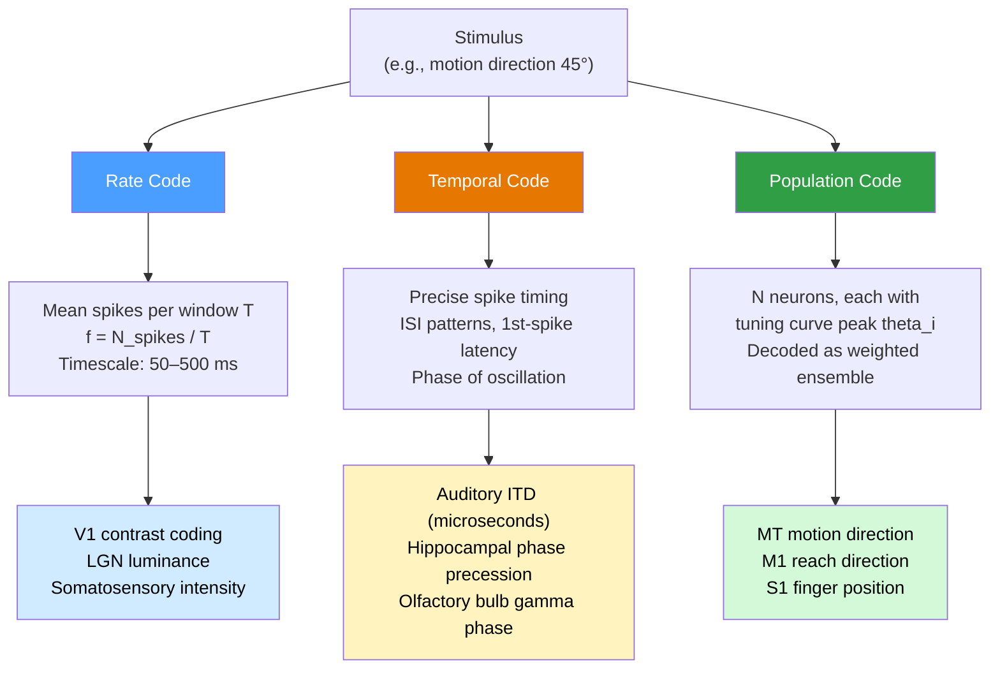

# Neural Coding and Spike Trains

> [!abstract] TL;DR
> The **neural coding** problem asks how the pattern of action potentials — the **spike train** — produced by a neuron (or population) represents information about the external world, internal state, or intended movement. Three complementary schemes have been established across brain regions: **rate coding** (information in the mean firing rate over a time window), **temporal coding** (information in the precise timing of individual spikes), and **population coding** (information distributed across an ensemble of neurons, each with its own stimulus preference). Understanding the neural code is essential both for neuroscience theory — explaining perception, memory, and motor control — and for engineering — building brain-computer interfaces that can decode intent from recorded spike trains in real time.

---

## Intuition

**Analogy:** A spike train is like a Morse code transmission. The dots and dashes (spikes and silences) carry a message — but the question is *which aspect of the pattern carries it*. **Rate coding** is like caring only about how fast the dots come — a rapid stream means the letter `E`, a slow one means `T`; timing within each burst is irrelevant. **Temporal coding** is like the full Morse message: the exact sequence of long and short pauses between dots is the signal, and smearing them together loses the meaning entirely.

Now imagine ten radio operators all transmitting simultaneously, each specialised for a different topic. Even if each individual transmission is noisy and ambiguous, the combined pattern across all ten makes the message clear — that is **population coding**. The brain likely uses all three strategies in different circuits and at different timescales.

---

## How It Works

### Core Mechanics

Neurons communicate via **action potentials (spikes)** — stereotyped, all-or-nothing voltage pulses of fixed shape (~1 ms wide, ~100 mV amplitude). Because every spike in a given neuron looks identical, the signal cannot be in spike amplitude. Three schemes have been proposed to explain how stimulus information is encoded in sequences of these uniform pulses:

**1. Rate coding.**
The relevant variable is the mean firing rate f(t) — the number of spikes divided by the counting window T. Rate coding is robust to noise (averaging over many spikes reduces variance) and is supported by decades of single-unit physiology: V1 neurons fire faster for higher-contrast stimuli; muscle spindle afferents fire faster under greater stretch. The price is **temporal resolution**: averaging over 100 ms discards all sub-100 ms structure.

$$f(t) = \frac{N_{\text{spikes}}}{T} \quad \text{(spikes per second)}$$

**2. Temporal coding.**
Precise spike times — inter-spike intervals (ISI), spike-timing relative to a reference signal, or first-spike latency — carry information beyond what the mean rate alone conveys. Evidence: auditory neurons in the brainstem resolve interaural time differences (ITDs) down to 10–20 µs; some olfactory and retinal neurons carry significant information in first-spike latency that is lost when only rate is examined. Temporal codes demand that the downstream decoder have access to a clock or reference — a non-trivial biological requirement.

**3. Population coding.**
Each neuron has a preferred stimulus value (its tuning curve peak) and fires at a rate that decreases as the stimulus moves away from this preference. The stimulus is recovered by reading the joint activity of many neurons — a vector of firing rates weighted by each neuron's preference. Population codes are tolerant of individual neuron failures, can represent continuous variables with high precision (Fisher information scales with N), and are the dominant coding strategy discovered in motor cortex (M1), area MT, and primary somatosensory cortex.

### Coding Scheme Comparison



---

## Key Concepts

### Secondary Level

**The All-or-Nothing Action Potential**
Every spike from a given neuron is stereotyped: the same ~100 mV amplitude, same ~1 ms duration. The brain cannot encode information in spike *size*. This is why the neural coding problem exists at all: information must live in the *pattern* of these uniform pulses across time and across neurons. See [[Action_Potentials_and_Resting_Membrane_Potential]] for the biophysics.

**Firing Rate and Frequency Coding**
The simplest model: the stronger the stimulus, the faster the neuron fires. A nociceptor fires at 5 Hz for a warm stimulus and 80 Hz for a painfully hot one. The rate-intensity curve (F-I curve) maps stimulus intensity to steady-state firing frequency and is often sigmoid-shaped: a linear range with saturation at both ends.

**What Do Neurons Encode?**
Single neurons can encode:
- **Stimulus identity** (a face cell in IT cortex fires for a specific person's face)
- **Stimulus feature** (a V1 cell fires for a bar at 45°, silences for all other orientations)
- **Stimulus value** (orbitofrontal cortex neurons encode reward magnitude)
- **Movement parameters** (M1 cells fire for a specific reach direction)
- **Space** (hippocampal place cells fire only when the animal is in a specific location)

**Tuning Curves**
A tuning curve plots mean firing rate as a function of a stimulus parameter. Examples:
- **Place cells (hippocampus):** peak firing at a specific spatial location ("place field"); almost silent elsewhere. Discovered by O'Keefe & Dostrovsky (1971), Nobel Prize 2014.
- **Direction-selective cells (MT/V5):** Gaussian tuning centered on a preferred motion direction; half-width ~40–60°. A neuron preferring 90° fires vigorously to rightward motion but weakly to leftward.
- **Orientation columns (V1):** preferred orientation rotates continuously across the cortical surface; individual simple cells have half-widths of ~15–30°.
- **Head direction cells (entorhinal cortex):** fire only when the animal faces a specific allocentric heading; the first compass cells discovered in mammals.

---

### Undergraduate Level

**Poisson Neuron Model**
The canonical model of neural variability: the probability of a spike in any tiny time window dt is r·dt, independent of all previous spikes. For a Poisson process with mean rate r over window T:

$$P(N = k) = \frac{(rT)^k e^{-rT}}{k!}$$

Key property: **variance equals mean** (Fano factor = 1). Real neurons have Fano factors between 0.5 and 2.0 across most cortical areas, making Poisson a reasonable first approximation. The Poisson assumption motivates a maximum-likelihood framework for decoding: the likelihood of observing spike count k from a neuron with mean rate r(s) given stimulus s is the Poisson probability above.

**Fano Factor and Signal-to-Noise**
$$F = \frac{\text{Var}(N)}{\langle N \rangle}$$
For a perfect clock (regular spike train), F → 0. For a Poisson process, F = 1. For a bursty neuron, F > 1. The Fano factor characterizes the reliability of single-neuron rate coding; neurons with F ≈ 1 mean that the standard deviation of spike count equals the square root of the mean — so to estimate a rate of 20 spikes/s in 100 ms (expected count = 2), the standard deviation is √2 ≈ 1.4, giving a signal-to-noise of ~1.4. More spikes (longer windows or higher rates) improve SNR as √N.

**Inter-Spike Interval (ISI) Distributions**
The distribution of times between consecutive spikes characterizes a spike train's statistical structure:
- **Poisson/regular:** exponential ISI distribution (p(t) = r·e^{−rt})
- **Bursty neurons:** multi-modal ISI distribution with a peak at very short intervals (intra-burst) and a peak at longer intervals (inter-burst)
- **Refractory period:** causes deviations from exponential at very short ISIs (<2 ms)
- **Theta-rhythmic place cells:** bimodal ISI distribution reflecting within-cycle and across-cycle spike timing

**Peristimulus Time Histogram (PSTH)**
The PSTH estimates the time-varying firing rate r(t) by averaging spike counts across many repeated presentations of the same stimulus, then smoothing:

$$\text{PSTH}(t) = \frac{1}{N_{\text{trials}}} \sum_{i=1}^{N_{\text{trials}}} \text{spike count in bin}[t, t+\Delta t]$$

The PSTH captures the reliable, time-locked component of the neural response while averaging away the trial-to-trial Poisson noise. It is the workhorse of systems neuroscience data analysis.

**Tuning Curve Width and Discrimination**
A narrow tuning curve (small half-width σ) means the neuron fires only for stimuli very close to its preference — high selectivity but covers only a small range. A broad tuning curve covers more of the stimulus space. The **optimal tuning width for a population decoder** (Fisher information argument) depends on the number of neurons: for N large, broader curves can outperform narrow ones because they reduce the "dead zones" between preferred stimuli. For MT neurons decoding direction in a 2AFC task (discriminating two directions Δθ apart), the performance-limiting slope is dr/dθ near the boundary between the two directions — neurons tuned away from the boundary contribute more to discrimination than those tuned to it.

**Mutual Information Between Stimulus and Response**
Shannon's mutual information quantifies how much knowing the spike count r reduces uncertainty about the stimulus s:

$$I(S; R) = \sum_{s,r} p(s,r) \log_2 \frac{p(s,r)}{p(s)p(r)} \quad \text{(bits)}$$

This is model-free — it makes no assumptions about the tuning curve shape. A neuron carrying 1 bit can perfectly distinguish between 2 equally probable stimuli; 2 bits can distinguish 4. Typical V1 orientation-selective neurons carry ~0.5–2 bits per spike about grating orientation; MT neurons carry ~1–3 bits per spike about motion direction.

**Two-Alternative Forced Choice (2AFC) and the Psychophysics Link**
In a 2AFC direction discrimination experiment, the subject reports whether motion is "leftward" or "rightward" relative to a boundary. Neurometric performance (percent correct based on single-neuron spike counts) can be compared to the animal's psychometric performance. The **neuron doctrine** predicts that when the animal just barely discriminates (d' = 1), a single ideal-observer neuron should also be near threshold. In practice, MT neurons *in the direction of motion* reach psychophysical threshold — a remarkable match that supports the idea that MT activity causally underlies motion perception (Britten et al. 1992; Newsome et al. 1989).

---

### Graduate Level

**Fisher Information and the Cramér-Rao Bound**
Fisher information measures how precisely a population can encode a stimulus parameter θ. For a population of N independent Poisson neurons each with tuning curve f_i(θ):

$$\mathcal{I}(\theta) = \sum_{i=1}^{N} \frac{1}{f_i(\theta)} \left(\frac{df_i}{d\theta}\right)^2$$

The **Cramér-Rao bound** states that no unbiased estimator can achieve variance below 1/I(θ):

$$\text{Var}(\hat{\theta}) \geq \frac{1}{\mathcal{I}(\theta)}$$

For N neurons with identical Gaussian tuning curves (peak r_max, width σ_θ, baseline r_0 ≈ 0), Fisher information scales as:

$$\mathcal{I}(\theta) \propto \frac{N \cdot r_{\max}}{\sigma_\theta^2}$$

This explains why larger populations and higher firing rates give more precise decoding, and why there is an optimal tuning width that maximises I(θ) for a given N. For very large populations, broader tuning curves carry more Fisher information than narrow ones.

**Optimal Linear Decoder and Maximum Likelihood**
The **population vector decoder** (Georgopoulos et al. 1986) computes a weighted vector sum of each neuron's preferred direction, weighted by its current spike count. For M1 reach direction, this gives ≈15–20° accuracy from ~100 simultaneously recorded neurons in 100 ms. The population vector is biased when tuning curves are asymmetric; the **maximum likelihood (ML) decoder** is unbiased and achieves the Cramér-Rao bound:

$$\hat{\theta}_{ML} = \arg\max_\theta \sum_{i=1}^{N} \left[ k_i \ln f_i(\theta) - f_i(\theta) \cdot T \right]$$

where k_i is the observed spike count from neuron i in window T. ML decoding requires a model of the tuning curves but outperforms the population vector by a factor of ≈2× in angular precision for typical MT parameters.

**Spike-Triggered Average (STA) for Receptive Field Estimation**
The STA estimates the linear filter (receptive field) that a neuron applies to the stimulus. For a white-noise stimulus s(t):

$$\text{STA}(\tau) = \frac{1}{N_{\text{spikes}}} \sum_{t_k} s(t_k - \tau)$$

where t_k are spike times. By the cross-correlation theorem, the STA equals the first-order Volterra kernel of the neuron's stimulus-response mapping. For a V1 simple cell stimulated with spatiotemporal white noise, the STA reveals the cell's oriented, spatiotemporally inseparable receptive field in a single experiment (no need to sweep oriented gratings). STA is the basis of the **linear-nonlinear (LN) model**, which cascades a linear filter with a static nonlinearity (threshold + saturation) to predict responses to arbitrary stimuli.

**Generalized Linear Model (GLM) for Neurons**
The GLM extends the LN model to include spike-history effects (refractory period, burst dynamics) and coupling between simultaneously recorded neurons:

$$\lambda_i(t) = \exp\!\left( k_i^T \cdot s(t) + h_i^T \cdot \mathbf{r}_i(t) + \sum_{j \neq i} J_{ij}^T \cdot r_j(t) + b_i \right)$$

where λ_i(t) is the instantaneous Poisson rate, k_i is the stimulus filter (STA analog), h_i is the spike-history filter (captures refractoriness and bursting), and J_ij are the coupling filters from other neurons. The GLM is fit by maximum likelihood (log-concave objective), has a closed-form score function, and is now the standard model for multi-electrode array data. Pillow et al. (2008) showed that GLMs fit to 27 simultaneously recorded primate retinal ganglion cells could predict responses to naturalistic movies with high accuracy, including cross-cell correlations.

**Reverse Correlation**
A generalisation of the STA to higher-order stimulus statistics. The **spike-triggered covariance (STC)** identifies stimulus dimensions beyond the linear filter that drive or suppress the neuron:

$$\text{STC} = \frac{1}{N_{\text{spikes}}-1} \sum_{t_k} (s_{t_k} - \text{STA})(s_{t_k} - \text{STA})^T - C_{\text{prior}}$$

Eigenvectors of STC with eigenvalues significantly above the prior covariance represent additional excitatory subspaces; those below represent suppressive subspaces. Applied to V1 complex cells, STC reveals the two quadrature-phase simple-cell inputs that form the energy model (Simoncelli & Schwartz 1999).

**Sparse Coding and Natural Statistics (Olshausen & Field 1996)**
Olshausen & Field proposed that the goal of V1 is to represent natural images with a **sparse** code: each image activates only a small fraction of the neuron population at any moment. Training an ICA-like generative model to represent natural image patches with minimal total activity and accurate reconstruction spontaneously produces oriented Gabor-like basis functions — matching real V1 simple-cell receptive fields. This is a normative theory: V1 receptive fields are *optimal* for efficiently encoding the statistical structure of natural scenes. Sparse coding implies that temporal coding (fewer, more precisely timed spikes) is more metabolically efficient than a dense rate code.

**Predictive Coding Framework**
Rao & Ballard (1999) proposed that the cortical hierarchy implements **predictive coding**: higher areas send predictions (top-down) to lower areas, which only feed forward the residual **prediction error**. Under this framework:
- Feedforward connections carry surprise (what was not predicted)
- Feedback connections carry expectation (what is predicted)
- Adaptation and repetition suppression reflect error minimisation: once a stimulus is predicted, prediction errors shrink and firing rates decrease
- Attention amplifies prediction errors for behaviourally relevant stimuli, boosting their representation

Predictive coding makes specific quantitative predictions about spike train statistics: neurons firing to expected stimuli should show lower rates and lower Fano factors than those firing to unexpected stimuli — consistent with observations in V1 and V2 for deviant vs. standard stimuli.

**Burst Coding and Oscillatory Phase Coding**
Beyond mean rate and precise single-spike timing, two additional temporal strategies are known:
- **Burst coding:** A short burst of 2–5 spikes at ~200–400 Hz within a 10 ms window carries qualitatively different information than a single spike. Thalamic relay neurons switch between tonic and burst modes depending on arousal; burst mode increases signal-to-noise for salient stimuli at the cost of temporal precision.
- **Phase coding:** The phase of a spike relative to an ongoing oscillation (e.g., theta at 4–12 Hz in the hippocampus) carries information beyond the spike count. **Phase precession:** as a rat traverses a place field, the place cell's spike phase advances (relative to the theta cycle) from the late phase at field entry to the early phase at field exit. This temporal map compresses the spatial sequence of visited places into a ~100 ms theta cycle, potentially enabling sequence learning through STDP (spike-timing-dependent plasticity).

**Cramér-Rao Summary Table**

| Decoder | Bias | Efficiency | Requirements |
|---|---|---|---|
| Population vector | Biased (for asymmetric TC) | ~50% of CRB | Only tuning curves |
| Maximum likelihood | Unbiased | Achieves CRB | Tuning curves + noise model |
| Bayesian decoder | Optional prior | CRB + prior gain | Prior + tuning curves + noise |
| Template matching | Unbiased | Between PV and ML | Full response distributions |

---

## Python Demo

```python
# Population coding demo: direction-tuned MT-like neurons with Poisson noise.
# Demonstrates tuning curves, single-trial population response, population vector
# decoding, and how decoding error scales with population size.
# Requirements: numpy, matplotlib (no other dependencies)

import numpy as np
import matplotlib.pyplot as plt

# ---- Simulation parameters ----
N_NEURONS    = 32        # neurons covering 0-360 degrees
PEAK_RATE    = 40.0      # max firing rate (spikes/s)
BASELINE     = 2.0       # baseline firing rate (spikes/s)
TUNING_WIDTH = 45.0      # Gaussian half-width (degrees)
T_OBS        = 0.5       # observation window (seconds)
RNG          = np.random.default_rng(seed=42)

PREFERRED_DIRS = np.linspace(0, 360, N_NEURONS, endpoint=False)

def tuning_curve(stim_dir, pref_dir, peak=PEAK_RATE, base=BASELINE, sigma=TUNING_WIDTH):
    """Circular Gaussian tuning curve: r = base + (peak-base)*exp(-delta^2 / 2*sigma^2)"""
    delta = ((stim_dir - pref_dir + 180) % 360) - 180   # circular difference
    return base + (peak - base) * np.exp(-delta**2 / (2 * sigma**2))

def poisson_population_response(stim_dir, n=N_NEURONS):
    """Simulate Poisson spike counts for n neurons given a stimulus direction."""
    pref = np.linspace(0, 360, n, endpoint=False)
    rates = np.array([tuning_curve(stim_dir, pd) for pd in pref])
    counts = RNG.poisson(rates * T_OBS)
    return counts, rates, pref

def population_vector_decode(counts, pref_dirs):
    """Weighted circular vector sum → estimated direction (degrees)."""
    rad = np.deg2rad(pref_dirs)
    vx = np.sum(counts * np.cos(rad))
    vy = np.sum(counts * np.sin(rad))
    return np.rad2deg(np.arctan2(vy, vx)) % 360

def circular_error(est, true_dir):
    """Absolute circular error in degrees."""
    return abs(((est - true_dir + 180) % 360) - 180)

# ---- Figure 1: Tuning curves and a single-trial population response ----
TRUE_DIR = 120.0
counts, rates, prefs_n = poisson_population_response(TRUE_DIR)
est_dir = population_vector_decode(counts, PREFERRED_DIRS)

smooth_dirs = np.linspace(0, 360, 720)

fig, axes = plt.subplots(1, 2, figsize=(13, 5))

# Panel A: sample tuning curves
for i in range(0, N_NEURONS, 4):
    tc_vals = [tuning_curve(d, PREFERRED_DIRS[i]) for d in smooth_dirs]
    axes[0].plot(smooth_dirs, tc_vals, alpha=0.6, lw=1.5)
axes[0].set_xlabel("Stimulus direction (deg)")
axes[0].set_ylabel("Mean firing rate (spikes/s)")
axes[0].set_title(f"Gaussian Tuning Curves — {N_NEURONS} MT-like Neurons")
axes[0].set_xlim(0, 360)
axes[0].grid(alpha=0.25)

# Panel B: single-trial population response
bar_w = 360 / N_NEURONS - 1
axes[1].bar(PREFERRED_DIRS, counts, width=bar_w, alpha=0.7,
            color="steelblue", label="Observed spike counts (Poisson)")
axes[1].plot(PREFERRED_DIRS, rates * T_OBS, "ro-", ms=4, lw=2,
             label="Expected counts (rate × T)")
axes[1].axvline(TRUE_DIR, color="green", ls="--", lw=2,
                label=f"True direction = {TRUE_DIR:.0f}°")
axes[1].axvline(est_dir, color="orange", ls="--", lw=2,
                label=f"PV estimate = {est_dir:.1f}°")
axes[1].set_xlabel("Neuron preferred direction (deg)")
axes[1].set_ylabel("Spike count in 500 ms window")
axes[1].set_title("Population Vector Decode — Single Trial")
axes[1].legend(fontsize=8)
axes[1].grid(alpha=0.25)

plt.tight_layout()
plt.show()

# ---- Figure 2: Decoding accuracy vs. population size ----
TRUE_DIR = 90.0
N_TRIALS = 1000
pop_sizes = [2, 4, 8, 16, 32, 64, 128]
mean_errors = []
std_errors  = []

for n in pop_sizes:
    pref_n = np.linspace(0, 360, n, endpoint=False)
    errors = []
    for _ in range(N_TRIALS):
        rates_n = np.array([tuning_curve(TRUE_DIR, pd) for pd in pref_n])
        cnts = RNG.poisson(rates_n * T_OBS)
        est = population_vector_decode(cnts, pref_n)
        errors.append(circular_error(est, TRUE_DIR))
    mean_errors.append(np.mean(errors))
    std_errors.append(np.std(errors))

mean_errors = np.array(mean_errors)
std_errors  = np.array(std_errors)

fig2, ax = plt.subplots(figsize=(7, 4))
ax.plot(pop_sizes, mean_errors, "o-", color="darkcyan", lw=2, ms=8,
        label="Mean |error|")
ax.fill_between(pop_sizes,
                mean_errors - std_errors,
                mean_errors + std_errors,
                alpha=0.2, color="darkcyan", label="± 1 SD")
# Theoretical 1/sqrt(N) trend for reference
ref = mean_errors[0] * np.sqrt(pop_sizes[0]) / np.sqrt(np.array(pop_sizes, float))
ax.plot(pop_sizes, ref, "k--", lw=1.5, label="1 / √N reference")
ax.set_xscale("log", base=2)
ax.set_xticks(pop_sizes)
ax.set_xticklabels(pop_sizes)
ax.set_xlabel("Population size (number of neurons)", fontsize=11)
ax.set_ylabel("Mean absolute decoding error (degrees)", fontsize=11)
ax.set_title("Population Vector Decoding Accuracy vs. Population Size", fontsize=12)
ax.legend()
ax.grid(alpha=0.25)
plt.tight_layout()
plt.show()
# Expected: error decreases ~1/sqrt(N) — Poisson pooling gain from averaging
# With 128 neurons at 40 spikes/s in 500 ms: error ≈ 3-5 degrees
```

**What to observe:**
- Panel A shows 32 direction-tuned neurons with 45° Gaussian half-width covering the full circle — typical of MT.
- Panel B shows a single Poisson-noisy population response: the bump is centred near 120° but the individual bars are noisy; the population vector estimate (orange dashed) lands close to the true direction (green dashed).
- Figure 2 shows that decoding error decreases roughly as 1/√N — the key statistical gain from population coding under Poisson variability. Adding neurons beyond ~64 gives diminishing returns when tuning width and observation window are fixed.

---

## Real-World Applications

**Brain-Computer Interfaces (BCIs) — Decoding Motor Intent**
BCI systems for paralysed patients (BrainGate, Neuralink) record spike trains from M1 while the patient imagines a movement. A real-time population decoder (typically a Kalman filter or recurrent neural network trained on spike counts) extracts intended reach velocity or cursor position. The seminal result: Georgopoulos et al. (1986) showed that a population vector computed from ~100 M1 neurons predicts reach direction with ~15° precision. Modern closed-loop BCIs achieve typing rates of ~40 characters/minute from intracortical arrays with 96–1024 electrodes, relying entirely on rate-code decoding within 50–200 ms windows.

**Retinal Prosthetics — Encoding Visual Input as Spike Trains**
Devices such as Argus II (Second Sight) bypass degenerated photoreceptors by stimulating surviving retinal ganglion cells with patterned electrode arrays. The encoding problem is the *inverse* of decoding: given a desired visual percept, what spike train pattern should be injected? Current approaches use simple rate codes (more current = more spikes = brighter percept), but research into temporal and population coding patterns is underway to achieve higher resolution (Lorach et al. 2015). The limitation is the mismatch between the 1,500-electrode array and the 1.2 million retinal ganglion cells in a healthy retina.

**Neural Signal Compression for Wireless BCIs**
Transmitting raw voltage traces from 1,024 electrodes at 30 kHz with 10-bit resolution requires ~300 Mbit/s — far beyond safe wireless power budgets for implantable devices. Spike sorting (detecting and classifying spike waveforms) reduces this to firing rates per unit: ~1 kbit/s per channel, a 300,000× compression. Understanding which aspects of the spike train carry information (rate vs. timing) determines the minimum required bandwidth: if only rate matters, binning at 10 ms is sufficient; if timing matters, sub-millisecond precision must be preserved.

**Understanding Sensory Perception Limits**
The neural coding framework directly predicts psychophysical thresholds. For direction discrimination in MT:
- Fisher information from N neurons predicts a just-noticeable difference (JND) ≈ σ_θ / √(N · r_max · T)
- Inserting typical MT parameters (N = 300 neurons signalling motion direction, r_max = 60 spikes/s, T = 300 ms, σ_θ = 45°) gives JND ≈ 1.5° — matching the human psychophysical threshold of ~2° for random-dot motion at high coherence (Watamaniuk & Sekuler 1992).

---

## Common Pitfalls

- **"Rate coding and temporal coding are mutually exclusive"** — They are not binary alternatives. Rate and temporal codes coexist within the same neurons and circuits: an MT neuron encodes motion direction in its tuning curve (rate code) while the exact spike times within a gamma cycle may carry additional stimulus information (temporal code). The appropriate coding scheme depends on the downstream decoder's integration time, not just the upstream neuron's response.

- **"Poisson variability is noise to be filtered out"** — Neural variability may itself be informative. In some models (e.g., probabilistic population codes, Fiser et al. 2010), trial-to-trial variability encodes the *uncertainty* of the internal representation — larger variance signals lower confidence. Calling all variability "noise" prematurely closes off richer coding models.

- **"Single-neuron recording captures the population code"** — A single electrode records one neuron; the brain's decision is driven by the activity of tens to thousands of neurons in the relevant area. Single-unit studies (Britten et al. 1992) can establish that a neuron's signal correlates with behaviour, but they cannot establish that this particular neuron — rather than the population average — drives the read-out. Multi-electrode and calcium imaging studies routinely show that the population vector outpredicts any individual neuron's response.

- **"Firing rate is independent of the choice of window T"** — The estimated firing rate f = N/T is only stable if the underlying rate process is stationary within T. For transient responses (e.g., stimulus-evoked ON-responses in V1 that last 30 ms), choosing T = 200 ms drastically underestimates the peak rate. PSTH time-bin selection and smoothing kernel choice introduce systematic biases in measured tuning curves.

- **"Population codes require synchrony"** — Population vector decoding requires only mean firing rates across neurons; it does not assume synchronised oscillations. Synchrony-based codes (e.g., gamma-band binding) are a separate — and empirically more contested — hypothesis about how the brain tags neurons as belonging to the same object.

---

## Related Concepts

- [[_MOC_Computational_Neuroscience|↑ Computational Neuroscience MOC]]

**Neuroscience vault:**
- [[Action_Potentials_and_Resting_Membrane_Potential]] — the biophysical substrate of every spike; all-or-nothing threshold, refractory period, and maximum firing rate are determined by Na⁺/K⁺ channel kinetics described by the Hodgkin-Huxley model
- [[Visual_System_and_Visual_Cortex]] — orientation tuning curves in V1, direction-selective population codes in MT, and the predictive coding framework are the primary experimental testing ground for neural coding theory
- [[Sensory_Systems_and_Transduction]] — receptor potentials grade with stimulus intensity before being converted to all-or-nothing spike trains; the transformation from graded to digital signal is where neural coding begins
- [[Motor_System_and_Motor_Control]] — M1 population vector coding of reach direction is the original and most clinically impactful application of population coding theory
- [[Hodgkin_Huxley_Model_and_Computational_Neurons]] *(future note)* — the canonical conductance-based model that defines when and how often a neuron spikes under given input; the F-I curve emerges directly from the HH equations
- [[Population_Coding_and_Decoding]] *(future note)* — deep dive into Fisher information, Cramér-Rao bounds, optimal linear decoders, and probabilistic population codes for continuous stimulus estimation
- [[Brain_Computer_Interfaces]] *(future note)* — real-time population decoding of M1 spike trains to restore communication and motor function in paralysed patients

**Cross-vault:**
- [[Information_Theory]] (AI-ML) — Shannon entropy, mutual information, and channel capacity provide the mathematical framework for quantifying how much information a spike train carries; the neural coding problem is an application of communication theory to biology

---

## Review Questions

**Secondary Level**
1. A tactile receptor fires at 5 spikes/s when a 1 g weight is placed on the skin and at 80 spikes/s for a 100 g weight. What coding scheme is this? If every spike in the neuron looks identical in shape and amplitude, explain how the brain could possibly distinguish the two stimuli.
2. Why do neuroscientists use PSTHs rather than single-trial spike counts when characterising a neuron's tuning curve? What information does the PSTH discard?
3. Draw the expected tuning curves for three MT neurons with preferred directions of 45°, 90°, and 135° under a Gaussian model. A stimulus moves at 80°. Rank the three neurons by their expected firing rates and sketch how a population vector decoder would recover the 80° direction.

**Undergraduate Level**
1. A Poisson neuron fires at a mean rate of 50 spikes/s. You observe it for 200 ms and count 8 spikes instead of the expected 10. Calculate the Fano factor for this observation and explain what a Fano factor of 2.5 (rather than 1) would imply about the spike generation process.
2. You want to compare the performance of a single MT neuron and a human subject on a 2AFC motion direction task (leftward vs. rightward, near threshold). Define "neurometric threshold" and "psychometric threshold" and describe what the Newsome lab experiment concluded when they compared these two measures in macaques. What does this imply about the relationship between single-neuron activity and perception?
3. Explain why mutual information I(S;R) is a more complete characterisation of a neuron's coding capacity than simply measuring the slope of its tuning curve (dr/dθ). Under what conditions are they equivalent?

**Graduate Level**
1. A population of N = 100 MT neurons with Gaussian tuning curves (σ = 45°, r_max = 40 spikes/s, r_baseline ≈ 0) is observed for T = 200 ms. Using the Fisher information formula for Poisson neurons, estimate the Cramér-Rao lower bound on direction discrimination variance. Compare this to the human JND of ~2° and discuss what the comparison implies about the efficiency of the brain's motion direction decoder.
2. You fit a GLM to a V1 neuron using spatiotemporal white noise. The recovered stimulus filter (k) is an oriented Gabor at 45°, and the spike-history filter (h) shows strong inhibition at 1–3 ms and weak facilitation at 5–10 ms. Interpret each component of the GLM in terms of known V1 biophysics (refractory period, gamma-band synchrony). How would you test whether the coupling filters J_ij to neighbouring neurons improve prediction accuracy beyond the single-cell GLM?
3. Compare rate coding and phase coding as strategies for representing a continuous stimulus variable (e.g., spatial position of a rat in a 1D track). For each strategy, identify: (a) the information-carrying variable, (b) the required downstream decoder, (c) the timescale over which the code is readable, and (d) one experimental manipulation that would selectively disrupt that code without affecting the other.

---

## Sources

- [Dayan, P. & Abbott, L.F. — *Theoretical Neuroscience: Computational and Mathematical Modeling of Neural Systems* (MIT Press, 2001)](https://mitpress.mit.edu/9780262541855/theoretical-neuroscience/)
- [Rieke, F., Warland, D., de Ruyter van Steveninck, R. & Bialek, W. — *Spikes: Exploring the Neural Code* (MIT Press, 1997)](https://mitpress.mit.edu/9780262681087/spikes/)
- [Quiroga, R.Q. & Panzeri, S. — Extracting information from neuronal populations: information theory and decoding approaches. *Nature Reviews Neuroscience* 10, 173–185 (2009)](https://doi.org/10.1038/nrn2578)
- [Georgopoulos, A.P., Schwartz, A.B. & Kettner, R.E. — Neuronal population coding of movement direction. *Science* 233, 1416–1419 (1986)](https://doi.org/10.1126/science.3749885)
- [Britten, K.H., Shadlen, M.N., Newsome, W.T. & Movshon, J.A. — The analysis of visual motion: a comparison of neuronal and psychophysical performance. *Journal of Neuroscience* 12, 4745–4765 (1992)](https://doi.org/10.1523/JNEUROSCI.12-12-04745.1992)
- [Olshausen, B.A. & Field, D.J. — Emergence of simple-cell receptive field properties by learning a sparse code for natural images. *Nature* 381, 607–609 (1996)](https://doi.org/10.1038/381607a0)
- [Pillow, J.W. et al. — Spatio-temporal correlations and visual signalling in a complete neuronal population. *Nature* 454, 995–999 (2008)](https://doi.org/10.1038/nature07140)

---

#Neuroscience #ComputationalNeuroscience #NeuralCoding #SpikeTrain
