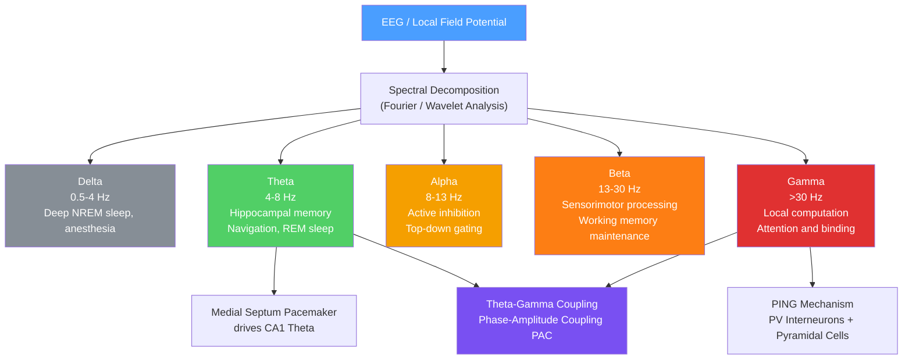

# 〰️ Neural Oscillations and Synchrony

> [!abstract] TL;DR
> Neural oscillations are rhythmic fluctuations in the electrical activity of neural populations that emerge from the delayed negative feedback inherent in excitatory-inhibitory (E-I) network dynamics — they are not noise but structured temporal patterns that carry information and gate communication between brain regions. Different frequency bands (delta 0.5–4 Hz, theta 4–8 Hz, alpha 8–13 Hz, beta 13–30 Hz, gamma >30 Hz) are selectively engaged during distinct cognitive and behavioral states, each generated by specific circuit mechanisms. Synchrony between distant cortical areas — measured as spectral coherence — implements the **communication-through-coherence** principle: a region gates its output to targets by aligning spike output to the excitable phase of the target's oscillation, making oscillatory phase the brain's routing mechanism.

---

## Intuition — analogy FIRST

Imagine a city with dozens of radio stations, each broadcasting on a different frequency band. Individual stations are always transmitting, but your radio only picks up a station when it is *tuned* — synchronized — to that exact frequency. Two people across the city can have a private conversation by agreeing on a channel; every other broadcast becomes background noise to them.

The brain works precisely this way. Every cortical area continuously generates oscillations at multiple frequencies, driven by its local E-I circuitry. When two areas need to communicate, they synchronize at the same frequency — they "tune in" to each other. The visual cortex and parietal cortex lock their gamma oscillations (~40–80 Hz) during focused attention, creating a high-bandwidth channel for visual information while unsynchronized areas are effectively muted. Theta oscillations (~6 Hz) act as a broadcast carrier for hippocampal memory signals, with faster gamma oscillations nested within each theta cycle — like time-division multiplexing on a single radio channel, where the carrier frequency determines who can listen and the nested bursts carry the actual content.

---

## How It Works

### E-I Balance and Oscillogenesis

Oscillations arise naturally from the delayed negative feedback built into excitatory-inhibitory circuits:

1. **Excitatory pyramidal cells** receive external drive and begin firing, increasing local excitation via recurrent collaterals.
2. Their axon collaterals also drive fast-spiking **PV (parvalbumin) interneurons** through AMPA receptors.
3. PV interneurons fire rapidly and release GABA onto the pyramidal cell population — powerfully inhibiting them within ~5 ms.
4. As GABA-A conductance decays (~10 ms time constant), pyramidal cells rebound from inhibition and fire again.
5. This PING (Pyramidal-Interneuron Network Gamma) cycle repeats at 40–80 Hz, generating gamma.

The oscillation frequency is primarily set by the GABA-A inhibitory time constant (tau_I ≈ 10 ms → f ≈ 40–80 Hz). Increasing excitatory drive shifts the frequency up within the gamma range; slower or stronger inhibition shifts it down into beta or theta.

**Theta oscillations** in the hippocampus are generated by a different mechanism: the medial septum–diagonal band of Broca acts as an external pacemaker, projecting rhythmic GABAergic and cholinergic fibers onto CA1 interneurons and pyramidal cells via the septohippocampal pathway at 4–8 Hz. This imposes theta on hippocampal circuits regardless of local E-I dynamics alone.

**EEG** measures the summed postsynaptic potentials — predominantly dipole currents from apical dendrites of cortical pyramidal neurons oriented perpendicular to the skull surface — not individual action potentials. This is why EEG is sensitive to synchronized population activity: a thousand neurons firing synchronously produce a detectable scalp signal; the same thousand neurons firing asynchronously cancel out to near zero.

### Frequency Band Classification



---

## Key Concepts / Details

### Secondary Level

**Brain Wave Frequency Bands**

| Band | Frequency | Typical Amplitude | Key Correlates |
|------|-----------|-------------------|----------------|
| Delta | 0.5–4 Hz | ~200 µV (high) | Stages 3–4 NREM sleep, deep anesthesia, infants |
| Theta | 4–8 Hz | ~100 µV (medium) | Hippocampal memory encoding, spatial navigation, REM sleep |
| Alpha | 8–13 Hz | ~50 µV (medium) | Relaxed wakefulness with eyes closed, active cortical inhibition |
| Beta | 13–30 Hz | ~20 µV (low) | Active cognition, sensorimotor processing, alert wakefulness |
| Gamma | 30–150 Hz | <10 µV (very low) | Local cortical computation, attention, perceptual binding |

Frequency and amplitude are inversely related across bands: the fastest oscillations carry the smallest signals because they are generated by smaller local circuits with less spatial synchrony.

**EEG Recording**

Electroencephalography records voltage fluctuations between pairs of scalp electrodes. The international **10–20 system** names sites by region (Fp = frontal pole, F = frontal, C = central, P = parietal, O = occipital, T = temporal) and hemisphere (even = right, odd = left, z = midline). Clinical EEG uses 19–64 channels; high-density research EEG can reach 256+ channels.

Key properties:
- **Temporal resolution:** ~1 ms — excellent for tracking oscillation cycles
- **Spatial resolution:** ~5–10 cm — poor, due to volume conduction through skull and scalp tissues
- **Signal source:** Synchronised postsynaptic potentials from cortical pyramidal neurons with perpendicular dipole orientation to the scalp surface
- **Non-invasive alternatives:** MEG (magnetoencephalography) records the same sources magnetically; ECoG (electrocorticography) records directly from the cortical surface intraoperatively

**Sleep Stage Oscillations**

Sleep stages are defined electrographically by their oscillatory signatures:
- **NREM Stage 1:** Theta replaces alpha; vertex sharp waves; slow rolling eye movements
- **NREM Stage 2:** Sleep spindles (12–14 Hz thalamocortical bursts, ~1 sec duration) and K-complexes (large single negative-positive deflection; protective inhibition of arousal)
- **NREM Stages 3–4 (Slow-Wave Sleep, SWS):** Delta oscillations dominate; memory consolidation via hippocampal-to-neocortical transfer driven by sharp-wave ripples
- **REM Sleep:** Low-amplitude, mixed-frequency EEG; theta prominent in hippocampus; phasic REMs and muscle atonia; cortically resembles waking

### Undergraduate Level

**PING Mechanism (Pyramidal-Interneuron Network Gamma)**

The most studied gamma-generating circuit in neocortex:

1. Excitatory drive activates pyramidal cells (E cells) which fire bursts.
2. E cells excite nearby fast-spiking **PV interneurons** via AMPA receptors.
3. PV cells fire and release GABA-A onto the pyramidal population.
4. GABA-A receptor opening hyperpolarizes E cells (Cl⁻ influx), suppressing firing for ~10–15 ms.
5. As the GABA-A conductance decays, E cells recover and fire again — the next gamma cycle.

Oscillation frequency: f ≈ 1 / (tau_I + tau_E) ≈ 40–80 Hz with tau_I ≈ 10 ms (GABA-A) and tau_E ≈ 5 ms (AMPA).

PING requires **balanced** E-I: too much inhibition quenches the oscillation; too little inhibition leads to runaway excitation and seizure. An alternative, **ING (Interneuron Network Gamma)**, arises from recurrently connected interneurons driven by strong tonic excitation without requiring pyramidal cell rhythm participation — but PING is more prominent in cortical tissue.

**Theta-Gamma Coupling (Phase-Amplitude Coupling, PAC)**

In the hippocampus, gamma oscillations do not occur uniformly in time — they are strongest at specific phases of the ongoing theta cycle. This nested oscillation structure has a natural computational interpretation:
- Each theta cycle (~125 ms) contains 5–7 gamma sub-cycles (~20 ms each)
- Each gamma cycle can encode a distinct memory item or spatial location
- Theta phase specifies temporal order; gamma power encodes content
- This creates a working memory buffer of roughly 7 items per theta cycle — strikingly consistent with Miller's "magical number 7±2"

PAC is measured with the **Modulation Index (MI)**: compute the gamma amplitude envelope, bin it by theta phase angle (0–360°), then measure the deviation of that distribution from uniformity using Kullback-Leibler divergence or vector strength.

**Alpha as Active Inhibition (Jensen-Mazaheri Hypothesis)**

The classical view of alpha (8–13 Hz) as "idle" or "resting" brain activity has been substantially revised. Alpha is now understood as a mechanism of active cortical suppression:
- Alpha power **increases** over task-irrelevant regions during demanding attention tasks
- Transcranial magnetic stimulation (TMS) applied to occipital cortex at alpha frequency *impairs* visual processing in that region
- Jensen & Mazaheri (2010): alpha oscillations rhythmically inhibit neuronal excitability, creating pulsed suppression at ~100 ms intervals
- Practical consequence: information processing occurs preferentially during the *trough* of local alpha oscillations

**Attention and Gamma Power**

Directing spatial attention to a stimulus reliably increases gamma-band power (30–80 Hz) in the cortical area processing that stimulus. This has been demonstrated in primate V1, V4, and MT, and in human MEG:
- Attended stimuli drive higher gamma power, lower response latencies, and improved detection
- Gamma power predicts hit/miss trial-by-trial, even when stimulus and task are identical
- Mechanism: attention increases tonic excitatory drive to local circuits via top-down projections → shifts E-I balance → higher PING frequency and power

**Hippocampal Theta and Place Cell Phase Precession**

CA1 place cells fire whenever an animal is in a specific location (the "place field"). Within the field:
- When the animal *enters* the field, the place cell fires at a *late* theta phase
- As the animal traverses the field, firing systematically shifts to *earlier* phases
- This **theta phase precession** (O'Keefe & Recce, 1993) encodes the animal's position within the field relative to the theta cycle
- Successive positions are compressed into a single theta cycle — a temporal sequence code that enables ordering of past, current, and anticipated locations

**Coherence as Functional Connectivity**

Spectral coherence between signals A and B at frequency f:

$$C_{AB}(f) = \frac{|S_{AB}(f)|^2}{S_{AA}(f) \cdot S_{BB}(f)}$$

Ranges 0 (no phase coupling) to 1 (perfectly phase-locked). High coherence at a given frequency indicates two regions share oscillatory dynamics and is a candidate index of functional communication. In practice, coherence is estimated via multitaper spectral methods (Thomson, 1982) or the imaginary part of coherency (which is insensitive to volume conduction artifacts).

### Graduate Level

**Communication Through Coherence (CTC, Fries 2005, 2015)**

Pascal Fries' CTC hypothesis provides a mechanistic account of oscillation-based routing:

1. A sending region oscillates at frequency f, creating alternating windows of high and low excitability.
2. A receiving region also oscillates at f with a specific phase offset.
3. If spike volleys from the sender arrive during the receiver's *excitable phase* (trough of local inhibition), they have maximum synaptic impact — the "communication window is open."
4. If the regions are phase-coherent, every spike burst from sender reliably hits the receiver's excitable phase.
5. A competing input that is phase-incoherent with the receiver arrives during inhibitory phases and is attenuated.
6. Attention = biasing phase coherence between task-relevant pairs of regions, selectively routing that signal.

CTC makes three testable predictions: coherence should be directional; coherent communication should be more effective than incoherent; changing coherence should change communication efficacy. All three have been confirmed with varying degrees of rigor.

**Interneuron Subtypes and Oscillatory Roles**

Cortical inhibitory interneurons are not a monolithic population; at least three major classes have distinct oscillatory functions:

| Interneuron Type | Molecular Marker | Synaptic Target | Primary Oscillatory Role |
|-----------------|-----------------|-----------------|--------------------------|
| Fast-Spiking Basket Cell | PV | Perisomatic: E cell body and axon initial segment | Generates gamma (PING); precise temporal inhibition |
| Bistratified Cell | PV | Proximal and distal dendrites | Theta-modulated dendritic inhibition |
| Martinotti Cell | SOM (somatostatin) | Distal dendrites | Feedback inhibition; theta and slow oscillations |
| VIP Cell | VIP | Other interneurons (primarily SOM) | Disinhibition; top-down gain modulation |

VIP cells are particularly important for attention: they are activated by neuromodulatory top-down inputs (acetylcholine, serotonin) and inhibit SOM cells, releasing pyramidal cell dendrites from inhibition and amplifying local E-I drive — implementing a disinhibitory gain control that upregulates gamma power without directly injecting excitation.

**Spike-Phase Locking**

Individual neurons can fire preferentially at specific phases of a population oscillation. **Spike-phase locking** is quantified by the Phase Locking Value (PLV) or the Pairwise Phase Consistency (PPC, which is unbiased with respect to spike count). A high PLV indicates a neuron's spikes are tightly coupled to the LFP oscillation cycle, meaning it participates in the local rhythmic computation. In hippocampus, CA1 pyramidal cells lock to the trough of theta; in visual cortex, different cell types fire at distinct gamma phases, creating a temporal firing-phase sequence that could encode stimulus features without rate modulation.

**Gamma Disruption in Schizophrenia**

Schizophrenia involves selective loss of PV interneurons: reduced parvalbumin expression and reduced GAD67 (the rate-limiting GABA synthesis enzyme) are consistently found post-mortem. Since PV cells are the engine of PING, this predicts:
- Reduced gamma power and gamma synchrony — confirmed by auditory steady-state responses (ASSR) at 40 Hz: schizophrenia patients show robustly reduced 40 Hz ASSR amplitude (Kwon et al., 1999; Uhlhaas & Singer, 2010)
- Disrupted working memory maintenance (gamma sustains delay-period activity in PFC)
- PV interneuron restoration is now a therapeutic target; clozapine partially normalises GAD67 expression

**Theta Sequence Replay During Slow-Wave Sleep**

During SWS, hippocampal **sharp-wave ripples (SWRs)** — brief (~80 ms), high-frequency (~100–200 Hz) bursts generated in CA3 and expressed in CA1 — drive memory replay:
1. CA3 generates a sharp population burst (SPW); CA1 responds with a ripple
2. The sequence of place cells active during the waking episode replays in compressed time (~20× faster) within a single ripple event
3. SWR timing is coordinated with cortical **UP states** (the high-excitability phase of the slow oscillation / delta rhythm in neocortex)
4. This three-level nesting — ripples within theta (during encoding) → ripples within slow oscillations (during consolidation) — enables selective hippocampal-to-neocortical memory transfer

**Kuramoto Model of Coupled Oscillators**

The Kuramoto model describes a large population of coupled phase oscillators:

$$\frac{d\theta_i}{dt} = \omega_i + \frac{K}{N}\sum_{j=1}^N \sin(\theta_j - \theta_i)$$

where $\theta_i$ is the phase of oscillator $i$, $\omega_i$ its natural frequency drawn from a distribution $g(\omega)$, and $K$ the global coupling strength. Above a critical coupling $K_c = 2/[\pi g(\bar{\omega})]$, the system undergoes a phase transition from incoherence to global synchrony. Applied to neuroscience, this framework predicts: (a) how thalamocortical loops synchronize cortex; (b) how pathological global synchrony (epileptic seizure) emerges when coupling exceeds $K_c$; (c) how anesthetics may desynchronize cortex by reducing effective coupling.

**Granger Causality and Directed Connectivity**

Spectral coherence is symmetric and cannot distinguish driver from follower. **Granger causality** addresses directionality: region A Granger-causes B if past values of A improve prediction of current B beyond B's own past alone. Frequency-domain implementations (Geweke, 1982; Barnett & Seth MVGC toolbox, 2014) decompose directed influence by frequency band. During attention tasks: feedforward gamma flows from early visual cortex to higher areas; feedback alpha and beta flows from frontal areas downward — implementing the "gamma ascending, alpha/beta descending" hierarchy consistent with predictive processing frameworks.

**Biophysical and Deep Learning Oscillation Models**

Conductance-based Hodgkin-Huxley-type network models can reproduce specific oscillations with mechanistic fidelity (Wang-Buzsáki model for gamma; Dickson et al. for theta). More recently, E-I constrained RNNs trained on cognitive tasks spontaneously develop oscillatory dynamics resembling cortical recordings — and task performance degrades when the oscillatory structure is disrupted — providing computational evidence that oscillations are functionally necessary, not incidental. Spiking neural networks (SNNs) with adaptive-threshold neurons reproduce spike-phase locking and theta phase precession, closing the loop between phenomenology and computation.

---

## Python Demo

```python
import numpy as np
import matplotlib.pyplot as plt
from scipy import signal

# Leaky rate model of an E-I network producing gamma oscillations via PING
# E cells: excitatory pyramidal neurons (AMPA-mediated, tau_E = 5 ms)
# I cells: fast-spiking PV interneurons (GABA-A-mediated, tau_I = 10 ms)
# The GABA-A time constant is the primary determinant of gamma frequency

dt = 0.0001          # 0.1 ms time step (seconds)
T  = 1.0             # 1 second total simulation
t  = np.arange(0, T, dt)
N  = len(t)

# Time constants: AMPA decay ~5 ms, GABA-A decay ~10 ms
tau_E = 0.005
tau_I = 0.010

# Synaptic weights
w_EE = 0.5   # E -> E recurrent excitation
w_EI = 3.0   # I -> E inhibitory strength (GABA-A)
w_IE = 3.5   # E -> I excitatory drive (AMPA)
w_II = 0.3   # I -> I weak self-inhibition

I_ext = 1.5  # Tonic external drive to E cells (models afferent input)

def sigmoid(x):
    """Sigmoid gain function: maps total input to firing rate in [0, 1]."""
    return 1.0 / (1.0 + np.exp(-5.0 * (x - 0.5)))

# Initialise population firing rates
E = np.zeros(N)
I = np.zeros(N)
E[0], I[0] = 0.15, 0.05

# Euler integration of the coupled rate equations
for k in range(1, N):
    drive_E = w_EE * E[k-1] - w_EI * I[k-1] + I_ext  # net input to E
    drive_I = w_IE * E[k-1] - w_II * I[k-1]           # net input to I
    dE = (-E[k-1] + sigmoid(drive_E)) / tau_E
    dI = (-I[k-1] + sigmoid(drive_I)) / tau_I
    E[k] = E[k-1] + dt * dE
    I[k] = I[k-1] + dt * dI

# Power spectral density via Welch's method (steady-state window: skip first 0.2 s)
fs = int(1.0 / dt)
ss = int(0.2 / dt)
freqs, psd_E = signal.welch(E[ss:], fs=fs, nperseg=2048)
_,    psd_I  = signal.welch(I[ss:], fs=fs, nperseg=2048)

mask = freqs < 200
peak_hz = freqs[mask][np.argmax(psd_E[mask])]
print(f"Dominant oscillation frequency: {peak_hz:.1f} Hz")
print(f"Expected: ~{1000 / (2 * tau_I * 1000 + tau_E * 1000):.0f} Hz from tau_I = {tau_I*1000:.0f} ms")

# Plot 200 ms of steady-state dynamics and the power spectrum
window = slice(ss, ss + int(0.2 / dt))
t_ms   = t[window] * 1000

fig, (ax1, ax2) = plt.subplots(2, 1, figsize=(10, 6))

ax1.plot(t_ms, E[window], color="#e03131", linewidth=1.5, label="E (pyramidal cells)")
ax1.plot(t_ms, I[window], color="#1971c2", linewidth=1.5, alpha=0.8, label="I (PV interneurons)")
ax1.set_xlabel("Time (ms)")
ax1.set_ylabel("Population firing rate (a.u.)")
ax1.set_title("E-I Network: Gamma Oscillations via PING Mechanism")
ax1.legend()

ax2.semilogy(freqs[mask], psd_E[mask], color="#e03131", label="E power")
ax2.semilogy(freqs[mask], psd_I[mask], color="#1971c2", alpha=0.7, label="I power")
ax2.axvspan(30, 100, alpha=0.12, color="red", label="Gamma band (30-100 Hz)")
ax2.axvline(peak_hz, color="black", linestyle="--", alpha=0.7, label=f"Peak: {peak_hz:.0f} Hz")
ax2.set_xlabel("Frequency (Hz)")
ax2.set_ylabel("Power spectral density")
ax2.set_title("Power Spectrum — GABA-A time constant sets oscillation frequency")
ax2.legend()

plt.tight_layout()
plt.show()
```

Running this code produces gamma oscillations in the 40–80 Hz range. To observe how E-I balance shifts frequency: (a) increase `I_ext` to raise gamma frequency; (b) increase `tau_I` to 0.020 s to shift toward beta (~25 Hz); (c) increase `w_EI` beyond ~5.0 to quench the oscillation.

---

## Real-World Applications

**EEG Neurofeedback (ADHD, Cognitive Enhancement)**
Real-time EEG feedback trains users to modulate their own oscillations. ADHD neurofeedback typically rewards increased sensorimotor rhythm (SMR, 12–15 Hz) or reduced theta/beta ratio over frontal-central electrodes, targeting the elevated resting theta found in many ADHD children. Commercial systems (Emotiv, OpenBCI) have extended this to consumer peak-performance training.

**Brain-Computer Interfaces (Motor Imagery)**
Motor imagery reliably desynchronizes beta oscillations — Event-Related Desynchronization (ERD) — over the contralateral motor cortex. BCI systems for paralyzed patients (BrainGate, EEG-BCI) decode the spatial pattern of beta ERD to infer imagined left vs. right hand movement, translating oscillatory signatures directly into cursor control or prosthetic arm commands.

**Alzheimer's Disease — GENUS Therapy**
In AD mouse models, hippocampal and cortical gamma oscillations are disrupted early, correlated with amyloid pathology. The GENUS (Gamma ENtrainment Using Sensory Stimuli) protocol from MIT (Iaccarino et al., 2016) exposes animals to 40 Hz flickering light and sound, entraining cortical and hippocampal gamma, reducing amyloid and tau loads, and improving cognition. Human trials (OVERTURE, 2022–2024) demonstrated EEG entrainment at 40 Hz and showed early signals of slowed hippocampal atrophy — making GENUS one of the few candidate interventions arising directly from oscillation neuroscience.

**Epilepsy (Pathological Synchrony)**
Epileptic seizures represent pathological hypersynchrony: excessive coupling drives cortical circuits past the Kuramoto transition, generating high-frequency oscillations (HFOs, 80–500 Hz) that spread across cortex. Electrocorticography (ECoG) in surgical patients detects HFOs as biomarkers of the seizure onset zone. Closed-loop systems (NeuroPace Responsive Neurostimulation, RNS) detect pathological oscillatory bursts and deliver electrical counter-pulses to suppress them before a full seizure develops.

**Transcranial Alternating Current Stimulation (tACS)**
tACS applies a weak sinusoidal current (1–2 mA) at the scalp at a specific target frequency. It can entrain ongoing oscillations, shift their phase, and synchronize or desynchronize two areas depending on whether the same or opposite phase is applied to each site. tACS has become the primary causal tool for testing CTC predictions: synchronizing two visual areas at gamma enhances visual discrimination; disrupting the phase relationship impairs it.

**Anesthesia Monitoring (BIS)**
The Bispectral Index (BIS) monitor processes frontal EEG to compute a 0–100 index of anesthetic depth, primarily tracking the transition from high-frequency waking rhythms to slow delta oscillations and burst-suppression patterns. It reduces intraoperative awareness incidents by providing a continuous real-time readout of the oscillatory correlates of consciousness depth.

---

## Common Pitfalls

- **Oscillations are epiphenomenal** — A persistent error is treating oscillations as a passive readout of neural activity with no causal function. tACS entrainment studies, optogenetic driving of PV interneurons at gamma frequency, and the causal tests of CTC collectively demonstrate that oscillation phase and power *causally* determine what information is routed and processed. The oscillation is the mechanism, not the shadow.

- **Alpha equals idle brain** — Treating high alpha as "disengaged" or "not thinking" reverses the actual relationship. Alpha actively increases over task-irrelevant regions during cognitive tasks to suppress interfering inputs. Misinterpreting this leads to incorrect BCI and neurofeedback designs (e.g., reinforcing alpha when you intend to enhance engagement).

- **Scalp EEG gamma reflects neural gamma** — EEG recorded at the scalp above 30 Hz is severely contaminated by electromyographic (EMG) artifacts from facial, scalp, and neck muscles. EMG has a broadband, white-noise-like spectrum that dominates high-frequency EEG. Reporting scalp gamma power as neural gamma without thorough ICA-based artifact removal is a major and documented source of false positives in the EEG literature; MEG or ECoG are required for unambiguous gamma oscillation recording.

- **Coherence implies causal connection** — High coherence between two regions means they share oscillatory phase dynamics, but this can arise from common input (shared thalamic drive), volume conduction (the same dipole current spreading to two electrodes), or genuine causal interaction. Granger causality, phase-slope index, or transfer entropy are required to infer directionality; imaginary coherence or the debiased weighted phase lag index (wPLI) at minimum addresses volume conduction.

---

## Related Concepts

- [[_MOC_Computational_Neuroscience|↑ Computational Neuroscience MOC]]

**Within the Neuroscience vault:**
- [[Neural_Coding_and_Spike_Trains]] — spike timing relative to LFP oscillation phase (spike-phase locking) is the bridge between single-unit coding and population oscillatory dynamics; rate codes and temporal/phase codes are complementary
- [[Sleep_and_Circadian_Rhythms]] — every NREM/REM sleep stage is defined by its oscillatory signature; memory consolidation relies on hippocampal sharp-wave ripples nested within cortical slow oscillations during SWS
- [[Consciousness_and_Neural_Correlates]] — loss of consciousness under anesthesia correlates with breakdown of long-range gamma and theta coherence; global workspace theory predicts ignition-driven synchrony across frontoparietal networks as the neural correlate of conscious access
- [[Attention_and_Executive_Function]] — spatial attention modulates gamma power in sensory cortex and alpha power in task-irrelevant areas, implementing the CTC routing mechanism; beta oscillations maintain attentional set and working memory content in prefrontal cortex
- [[Neuroimaging_Methods]] — EEG and MEG directly measure oscillatory LFPs; electrocorticography (ECoG) provides the highest spatial-temporal fidelity; fMRI BOLD correlates with infra-slow and delta amplitude envelopes; intracranial microelectrode arrays enable simultaneous LFP and single-unit oscillation recording

**Within the Cellular Neuroscience vault:**
- [[Synaptic_Transmission_and_Neurotransmitters]] — GABA-A kinetics (tau ≈ 10 ms) and AMPA kinetics (tau ≈ 5 ms) are the molecular parameters that set gamma frequency; NMDA-mediated plateau potentials contribute to theta
- [[Ion_Channels_and_Receptor_Pharmacology]] — HCN channels (I_h) contribute to theta pacemaking; K_v channel kinetics determine PV interneuron firing speed; GABA_B metabotropic receptors generate slow inhibitory potentials underlying alpha
- [[Action_Potentials_and_Resting_Membrane_Potential]] — the rhythmic volleys of spikes from PV interneurons that constitute the PING inhibitory phase are individual action potentials; the LFP is the summed postsynaptic consequence of these spikes

**Cross-vault links:**
- [[Fourier_Transform]] (Signals & Systems) — spectral decomposition of the EEG signal into frequency bands is mathematically a Fourier transform; Welch's periodogram and multitaper spectral estimation (DPSS windows) are adaptations for non-stationary biological signals
- [[Oscillations_and_SHM]] (Physics) — the Kuramoto model of neural synchrony is a direct generalization of coupled harmonic oscillators; the mathematics of phase coupling, limit cycles, resonance, and the transition to chaos underlies both SHM and oscillogenesis

---

## Review Questions

**Secondary (conceptual recall)**
1. Why does EEG detect synchronised neural activity far more sensitively than asynchronous activity — and what structural feature of cortical pyramidal neurons makes them the dominant EEG signal source rather than interneurons or stellate cells?

**Undergraduate (mechanistic reasoning)**
2. A researcher reports increased gamma power (35–65 Hz) over occipital cortex during a visual attention task using scalp EEG and concludes that attentional gamma is enhanced. A reviewer is skeptical. What artifact is the most likely confound, how would you test whether it is present, and what alternative recording modality would definitively resolve the question?

**Graduate (integrative / causal)**
3. The communication-through-coherence framework predicts that attention routes information by increasing gamma-band phase coherence between task-relevant cortical areas. Design an experiment using tACS together with a dual-task visual paradigm to causally test this prediction. Specify the stimulation conditions (frequency, phase, electrode placement), the behavioral measure, and the pattern of results that would confirm the hypothesis versus the pattern that would refute it.

---

## Sources

- [Buzsáki, G. (2006). *Rhythms of the Brain*. Oxford University Press.](https://doi.org/10.1093/acprof:oso/9780195301069.001.0001)
- [Fries, P. (2015). Rhythms for Cognition: Communication through Coherence. *Neuron*, 88(1), 220–235.](https://doi.org/10.1016/j.neuron.2015.09.034)
- [Cohen, M. X. (2014). *Analyzing Neural Time Series Data: Theory and Practice*. MIT Press.](https://mitpress.mit.edu/9780262019873/)
- [Jensen, O., & Mazaheri, A. (2010). Shaping Functional Architecture by Oscillatory Alpha Activity: Gating by Inhibition. *Frontiers in Human Neuroscience*, 4, 186.](https://doi.org/10.3389/fnhum.2010.00186)
- [Iaccarino, H. F. et al. (2016). Gamma frequency entrainment attenuates amyloid load and modifies microglia. *Nature*, 540, 230–235.](https://doi.org/10.1038/nature20587)
- [Uhlhaas, P. J., & Singer, W. (2010). Abnormal neural oscillations and synchrony in schizophrenia. *Nature Reviews Neuroscience*, 11, 100–113.](https://doi.org/10.1038/nrn2774)

---

#Neuroscience #ComputationalNeuroscience #NeuralOscillations #BrainWaves #Synchrony
