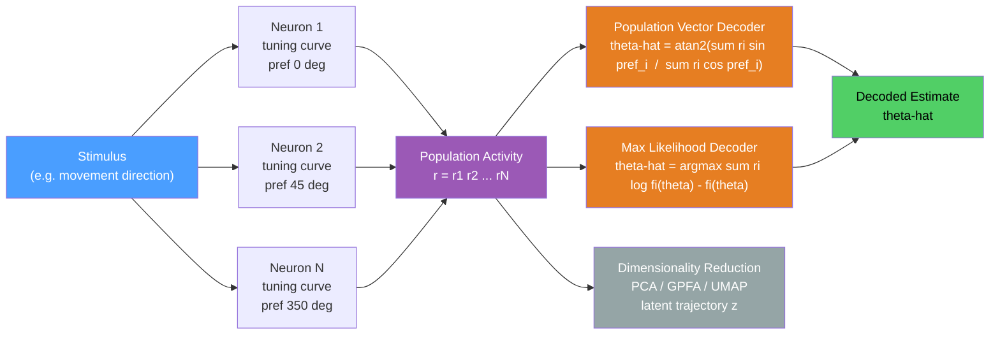

# 🧠 Population Coding and Decoding

> [!abstract] TL;DR
> Population codes distribute information about a stimulus or motor variable across the collective activity of many neurons, each with a different preferred value and a graded tuning curve, so that no individual cell is a reliable reporter but the ensemble is highly informative. Decoding algorithms — including the population vector, maximum likelihood, and linear classifiers — read out that distributed representation by aggregating weighted contributions from the full population. Dimensionality reduction methods (PCA, GPFA, UMAP) reveal that high-dimensional population activity lives on low-dimensional manifolds whose geometry reflects the structure of the encoded variable.

---

## Intuition

**Analogy:** Imagine a committee of 1,000 voters, each of whom has a strong opinion about only a narrow range of political positions and expresses that opinion unreliably — sometimes getting confused, sometimes falling asleep. No single voter gives you trustworthy information. But if you tally the votes intelligently — weighting each voter's signal by how strongly they hold their opinion — the committee's collective answer is highly accurate. Decoding is the tallying procedure. Dimensionality reduction is asking: "What are the two or three main political axes that account for most of the variance in how voters line up?"

In the brain, each neuron is a noisy voter tuned to a preferred stimulus feature (a direction of movement, an orientation, a location in space). The population of thousands of such neurons, taken together, can encode a continuous variable with precision far beyond any individual cell. Reading that population — whether you are a downstream neuron or a brain-computer interface engineer — requires an explicit algorithm.

---

## How It Works

### Tuning Curves

The starting point is the **tuning curve**: the mean firing rate of neuron $i$ as a function of the stimulus $\theta$. For direction-selective neurons (as in M1 motor cortex, MT visual area, or head-direction cells), a Gaussian tuning curve is a good model:

$$f_i(\theta) = r_{\max} \exp\!\left(-\frac{(\theta - \theta_i)^2}{2\sigma^2}\right)$$

where $\theta_i$ is the preferred direction of neuron $i$, $\sigma$ is the tuning width, and $r_{\max}$ is the peak rate. On any given trial, the actual spike count $r_i$ is drawn from a Poisson distribution with mean $f_i(\theta)$: the neuron is noisy. The set of mean rates $\{f_i(\theta)\}$ across all $N$ neurons constitutes the **population tuning vector** for stimulus $\theta$.

### Population Vector Decoder

Georgopoulos et al. (1986) showed that movement direction in motor cortex can be decoded by a simple weighted sum: assign each neuron $i$ a vector $\mathbf{v}_i$ pointing in its preferred direction, weight it by the observed firing rate $r_i$, and sum:

$$\hat{\theta}_{\text{PV}} = \arg\!\left(\sum_{i=1}^{N} r_i \, \mathbf{v}_i\right)$$

equivalently written as:

$$\hat{\theta}_{\text{PV}} = \text{atan2}\!\left(\frac{\sum_i r_i \sin\theta_i}{\sum_i r_i},\; \frac{\sum_i r_i \cos\theta_i}{\sum_i r_i}\right)$$

The population vector is interpretable and computationally trivial. Its limitation is that it implicitly assumes neurons are statistically independent and that preferred directions tile the stimulus space uniformly; when these assumptions break down, the estimate is biased.

### Maximum Likelihood Decoder

A statistically principled decoder asks: given the observed population response $\mathbf{r} = (r_1, \ldots, r_N)$, what stimulus $\theta$ most likely produced it? Under the assumption of independent Poisson neurons:

$$\hat{\theta}_{\text{ML}} = \arg\max_\theta \sum_{i=1}^{N} \left[ r_i \log f_i(\theta) - f_i(\theta) \right]$$

The ML decoder is asymptotically efficient: for large $N$ its variance approaches the **Cramér-Rao lower bound** $1/I(\theta)$, where the Fisher information for a Poisson population is:

$$I(\theta) = \sum_{i=1}^{N} \frac{\left[f_i'(\theta)\right]^2}{f_i(\theta)}$$

For $N$ Gaussian tuning curves uniformly tiling direction space, $I(\theta) \propto N$, so the optimal decoding RMSE scales as $N^{-1/2}$. The population vector decoder achieves roughly the same scaling under symmetric conditions, explaining why both decoders improve with population size.

### Dimensionality Reduction

Real population recordings from Neuropixels or multi-electrode arrays produce activity vectors in $\mathbb{R}^N$ with $N$ often in the hundreds to thousands. Three families of methods are used to find low-dimensional structure:

| Method | Assumes | Output | Timescale |
|--------|---------|--------|-----------|
| **PCA** | Linear, static | Principal axes; % variance explained | Instantaneous |
| **GPFA** (Gaussian Process Factor Analysis) | Linear, smooth in time | Latent trajectories + noise model | Trial-by-trial dynamics |
| **UMAP / t-SNE** | Nonlinear | 2D/3D embedding preserving local topology | Snapshot |

The **neural manifold hypothesis** states that, even though individual neuron responses are heterogeneous and high-dimensional, the population traces a low-dimensional surface whose geometry is interpretable: position cells in hippocampus form a ring manifold; M1 during reaching sweeps out a rotational trajectory; grid cells tile a torus.

### Flow / Architecture



---

## Key Concepts

### Secondary Level

**Why populations instead of single neurons?**
Individual neurons are Poisson-noisy: the coefficient of variation of spike counts is approximately 1.0, so a neuron firing at 20 Hz has a standard deviation of ~4.5 spikes per second. A single neuron encoding direction via a 40°-wide Gaussian tuning curve gives a direction estimate with RMSE ≈ 30–50°. A population of 100 such neurons with independent noise reduces RMSE to ~3–5°, below the animal's behavioral threshold — the central justification for population coding.

**Georgopoulos and the Motor Cortex Population Vector**
In a landmark 1986 Science paper, Georgopoulos, Schwartz, and Kettner recorded from ≈200 M1 neurons in macaques performing arm reaches to 8 targets arranged in a circle. Each neuron fired maximally for one "preferred direction" with a broad cosine tuning. No single neuron unambiguously signalled direction. However, the population vector — the vector sum of all individual preferred-direction vectors weighted by firing rate — pointed accurately in the actual movement direction, even predicting movement to intermediate targets not explicitly trained. This experiment established the population vector as a biologically implemented decoding algorithm and launched the field of motor BCIs.

**Place Cell Ensembles**
In hippocampus, "place cells" fire preferentially when the animal occupies a particular location (the cell's "place field"). The animal's current position can be reconstructed from the population by applying a Bayesian decoder: given the observed spike counts from ~100 simultaneously recorded place cells, the decoded location matches the true location with centimetric precision. Ensembles of place cells thus constitute a neural GPS — an internal map encoded in population activity.

**Noise Correlations**
When neurons are recorded simultaneously, their trial-to-trial fluctuations are often correlated (noise correlations, $r_{\text{noise}}$). A crucial distinction: noise correlations aligned with the stimulus coding direction (differential correlations) degrade decoding accuracy even as population size grows. Noise correlations orthogonal to the coding direction have little effect. This means "more neurons" is not always better — the geometry of noise relative to signal matters.

---

### Undergraduate Level

**Gaussian Tuning Curves and the Basis Function View**
A population of $N$ neurons with Gaussian tuning curves at different preferred values forms a **basis function representation** of the stimulus space. Any smooth function of $\theta$ can be approximated by a weighted sum of these basis functions. The population response vector $\mathbf{r}(\theta) \in \mathbb{R}^N$ is a nonlinear, distributed code: each component $r_i = f_i(\theta) + \text{noise}$ provides a "local" signal, and the decoder reads the combination. This framework generalises to multidimensional stimuli (e.g., 3D reach direction, colour + luminance) by using multidimensional Gaussian receptive fields.

**Population Vector Decoder: Geometric Interpretation**
The population vector $\sum_i r_i \mathbf{v}_i$ is the centroid of the preferred-direction vectors, weighted by firing rates. It is optimal (minimum variance) only when:
1. Neurons tile the stimulus space uniformly,
2. Neurons are statistically independent,
3. Noise is symmetric around the tuning peak.

When preferred directions are non-uniform or tuning widths vary, the population vector is biased. An unweighted average over all neurons would give a vector anchored at the mean preferred direction; weighting by firing rate pulls it toward the most active neurons.

**Maximum Likelihood for Circular Variables**
For directional variables ($\theta \in [0°, 360°)$), the Poisson log-likelihood must respect the circular topology: circular differences, von Mises distributions (the circular analogue of Gaussian), and a grid search or gradient ascent in circular space. A common approximation for unimodal population responses is the **Bayesian circular mean**, which under flat priors equals the ML estimate.

**Cramér-Rao Bound and Fisher Information**
The Fisher information $I(\theta)$ sets a fundamental limit: no unbiased estimator can achieve a variance below $1/I(\theta)$ regardless of the decoding algorithm. For a population of Poisson neurons:

$$I(\theta) = \sum_{i=1}^{N} \frac{[f_i'(\theta)]^2}{f_i(\theta)}$$

For $N$ identical Gaussian tuning curves with width $\sigma$ and peak rate $r_{\max}$, uniformly tiling $[0°, 360°)$:

$$I(\theta) \approx \frac{N r_{\max}}{2\sigma^2}$$

so the optimal RMSE decreases as $1/\sqrt{N r_{\max}}$, motivating both larger populations and higher firing rates.

**Signal vs Noise Correlations**
Two neurons recorded simultaneously have two distinct types of correlation:
- **Signal correlation** ($r_{\text{signal}}$): similarity of their tuning curves (do they prefer similar stimuli?). High for nearby neurons.
- **Noise correlation** ($r_{\text{noise}}$): correlation of their trial-to-trial firing fluctuations above and beyond the signal. Can be positive (common input) or negative (lateral inhibition).

Signal and noise correlations are biologically independent: neurons can have similar tuning but anti-correlated noise (inhibitory interneurons). Only noise correlations that project onto the Fisher-information-efficient coding direction (differential correlations, Moreno-Bote et al. 2014) impose a hard ceiling on decoding accuracy that does not improve with $N$.

**Simultaneous Recording Technology**
- **Utah Array (96 electrodes)**: penetrating microelectrodes in a 10×10 grid, spanning ~4 mm², records ~100 neurons simultaneously; used in BrainGate BCIs.
- **Neuropixels probe**: 960 electrodes on a silicon shank 10 mm long; records from ~300–1000 neurons per probe across multiple cortical layers and subcortical structures simultaneously. Transformed systems neuroscience from dozens to thousands of simultaneously recorded neurons.
- **Calcium imaging (two-photon)**: optical recording of fluorescent calcium indicators; single-cell resolution; can record 10,000+ neurons in superficial layers with ~50 ms temporal resolution. Slower than electrophysiology but unprecedented spatial coverage.

---

### Graduate Level

**Dimensionality Reduction: PCA and Beyond**
PCA finds the linear subspace of $\mathbb{R}^N$ capturing maximal population variance. Projecting the $T \times N$ activity matrix onto the top $k$ principal components gives a $T \times k$ trajectory. For motor cortex, the top 10 PCs often explain >70% of variance, suggesting the population trajectory lives near a 10-dimensional subspace despite $N > 100$. Limitations: PCA does not separate signal from noise, assumes Gaussian statistics, and collapses time (treats each time-bin as independent).

**Gaussian Process Factor Analysis (GPFA)**
Yu et al. (2009) model population activity as:

$$\mathbf{r}_t = C \mathbf{z}_t + \mathbf{d} + \boldsymbol{\epsilon}_t, \quad \mathbf{z}_t \sim \mathcal{GP}(\mathbf{0}, K)$$

where $\mathbf{z}_t \in \mathbb{R}^k$ is the latent state, $C$ is the loading matrix, and the Gaussian process prior over time enforces smooth latent trajectories. Unlike PCA, GPFA simultaneously denoises and reduces dimensionality, extracting trial-by-trial latent dynamics rather than trial-averaged trajectories. It is the standard tool for uncovering smooth neural manifolds from spiking data.

**LFADS (Latent Factor Analysis via Dynamical Systems)**
Pandarinath et al. (2018) use a variational autoencoder with a recurrent neural network prior to infer latent dynamics from single-trial spiking population data. LFADS explicitly models the dynamical system governing neural trajectories, allowing it to infer single-trial states even for neurons not simultaneously recorded — a form of "neural denoising" that recovers signal undetectable in raw data.

**The Neural Manifold Hypothesis**
Gallego et al. (2017) showed that M1 population activity during reaching occupies a consistent low-dimensional subspace (the "neural manifold") that is stable across months, despite continuous synaptic remodelling of individual neurons. Vyas et al. (2020) extended this to show that different movement conditions (reach direction, speed, force) correspond to different trajectories on the same manifold, and that preparation and execution are separated along orthogonal dimensions of the manifold — the "null space" (preparation activity that does not drive output) and "output-potent space" (activity that drives downstream muscles).

**Communication Subspaces (Semedo et al. 2019)**
When two areas communicate, they do not share all their variance. Semedo et al. showed that V1 uses a low-dimensional "communication subspace" (a few linear combinations of V1 neurons) to drive V2, distinct from the subspace that captures most V1 variance. This subspace decoding explains why two simultaneously recorded populations share only a fraction of their dimensionality, and suggests that inter-area communication is specifically regulated.

**Tensor Component Analysis (TCA) for Multi-Condition Data**
When data have three natural modes (neurons × time × conditions/trials), PCA conflates them. TCA (Williams et al. 2018) decomposes the $N \times T \times K$ tensor into a sum of rank-1 terms: each component has a neuron factor, a temporal factor, and a condition factor. For multi-condition motor tasks, TCA reveals components that are selective for movement direction, speed, and trial epoch simultaneously.

**MVPA and Representational Geometry in fMRI**
Multivoxel pattern analysis (MVPA) treats each fMRI volume as a point in voxel space and trains a linear classifier (SVM, LDA) to decode trial conditions from the spatial pattern. The "representational dissimilarity matrix" (RDM) captures the pairwise geometry of representations across conditions — two conditions whose neural patterns are far apart in voxel space are "representationally distant." Comparing RDMs between brain areas (representational similarity analysis, RSA) and between brain and deep learning models (encoding/decoding models) is the primary tool for understanding high-level cortical representations.

**Variational Autoencoders for Latent Dynamics**
The VAE framework encodes a population activity matrix $\mathbf{r}_{1:T}$ to a posterior $q(\mathbf{z}|\mathbf{r})$ over latent trajectories and decodes back to reconstruct firing rates. The KL divergence term regularises the latent space toward a smooth prior (often a dynamical system). VAE-based models (LFADS, pi-VAE, CEBRA) allow flexible nonlinear embeddings and can incorporate behavioural labels to disentangle task-relevant and task-irrelevant neural variance.

---

## Python Demo

```python
import numpy as np
import matplotlib.pyplot as plt

rng = np.random.default_rng(42)

# ── Parameters ─────────────────────────────────────────────────────────────
N_TOTAL   = 50        # neurons in the full population
N_TRIALS  = 300       # repeated trials per condition (for RMSE estimation)
R_MAX     = 30.0      # peak firing rate (spikes / 1-second bin)
SIGMA_TC  = 40.0      # tuning width in degrees (Gaussian standard deviation)
TRUE_DIR  = 60.0      # ground-truth direction being decoded

# Preferred directions uniformly tiling [0, 360)
pref_dirs     = np.linspace(0, 360, N_TOTAL, endpoint=False)   # (N_TOTAL,)
pref_dirs_rad = np.deg2rad(pref_dirs)
pref_vecs     = np.column_stack([np.cos(pref_dirs_rad),         # (N_TOTAL, 2)
                                  np.sin(pref_dirs_rad)])

# ── Helpers ─────────────────────────────────────────────────────────────────
def circ_diff(a, b):
    """Circular difference a-b in degrees, mapped to (-180, +180]."""
    return ((a - b + 180) % 360) - 180

def compute_mean_rates(direction, prefs, r_max=R_MAX, sigma=SIGMA_TC):
    """
    Gaussian tuning curves.
    f_i(theta) = R_max * exp(-0.5 * (theta - theta_i)^2 / sigma^2)
    direction : scalar or array (stimulus)
    prefs     : array of preferred directions, shape (N,)
    """
    d = circ_diff(direction, prefs)
    return r_max * np.exp(-0.5 * (d / sigma) ** 2)

# ── Decoders ────────────────────────────────────────────────────────────────
def population_vector_decoder(rates, vecs):
    """
    Population vector: vector sum of preferred-direction unit vectors
    weighted by observed firing rates.
    Returns decoded direction in [0, 360) degrees.
    """
    pv = rates @ vecs                               # dot product, shape (2,)
    return np.rad2deg(np.arctan2(pv[1], pv[0])) % 360

# Pre-build the (360,) candidate grid for the ML decoder
CANDIDATES = np.linspace(0, 360, 360, endpoint=False)

def ml_decoder(rates, prefs, r_max=R_MAX, sigma=SIGMA_TC):
    """
    Maximum likelihood decoder under independent Poisson neurons.
    log P(r | theta) = sum_i [ r_i * log(mu_i(theta)) - mu_i(theta) ]
    Vectorised over 360 candidate directions.
    Returns decoded direction in [0, 360) degrees.
    """
    # d shape: (360, N);  mu shape: (360, N)
    d   = circ_diff(CANDIDATES[:, None], prefs[None, :])
    mu  = r_max * np.exp(-0.5 * (d / sigma) ** 2) + 1e-9
    # Poisson log-likelihood summed over neurons for each candidate direction
    ll  = np.sum(rates[None, :] * np.log(mu) - mu, axis=1)   # (360,)
    return CANDIDATES[np.argmax(ll)]

# ── Sweep over population size ───────────────────────────────────────────────
pop_sizes = [5, 10, 15, 20, 30, 40, 50]
rmse_pv   = []
rmse_ml   = []

for N in pop_sizes:
    # Select N neurons evenly spread around the circle from the full 50
    idx   = np.round(np.linspace(0, N_TOTAL - 1, N)).astype(int)
    prefs = pref_dirs[idx]
    vecs  = pref_vecs[idx]
    mu    = compute_mean_rates(TRUE_DIR, prefs)

    sq_pv, sq_ml = [], []
    for _ in range(N_TRIALS):
        spikes = rng.poisson(mu).astype(float)

        est_pv = population_vector_decoder(spikes, vecs)
        sq_pv.append(circ_diff(est_pv, TRUE_DIR) ** 2)

        est_ml = ml_decoder(spikes, prefs)
        sq_ml.append(circ_diff(est_ml, TRUE_DIR) ** 2)

    rmse_pv.append(np.sqrt(np.mean(sq_pv)))
    rmse_ml.append(np.sqrt(np.mean(sq_ml)))

# ── Visualisation ─────────────────────────────────────────────────────────
fig, axes = plt.subplots(1, 2, figsize=(12, 4))

# Left panel: Gaussian tuning curves for the full population (every 5th)
ax = axes[0]
theta_sweep = np.linspace(0, 360, 360)
for i in range(0, N_TOTAL, 5):
    tc = compute_mean_rates(theta_sweep,
                             np.full_like(theta_sweep, pref_dirs[i]))
    ax.plot(theta_sweep, tc, alpha=0.4, lw=1)
ax.axvline(TRUE_DIR, color='red', lw=2, ls='--',
           label=f'True direction = {TRUE_DIR:.0f} deg')
ax.set_xlabel('Stimulus direction (degrees)')
ax.set_ylabel('Mean firing rate (Hz)')
ax.set_title('Gaussian Tuning Curves (N = 50; every 5th shown)')
ax.legend(fontsize=9)
ax.set_xlim(0, 360)

# Right panel: RMSE vs population size
ax = axes[1]
ax.plot(pop_sizes, rmse_pv, 'o-', color='steelblue', lw=2,
        label='Population Vector')
ax.plot(pop_sizes, rmse_ml, 's--', color='tomato', lw=2,
        label='Max Likelihood')
ax.set_xlabel('Population size N')
ax.set_ylabel('RMSE (degrees)')
ax.set_title(f'Decoding Accuracy vs Population Size ({N_TRIALS} trials)')
ax.legend()
ax.grid(alpha=0.3)

plt.tight_layout()
plt.savefig('population_decoding.png', dpi=150)
plt.show()

# Expected output:
# Left : overlapping Gaussian curves peaking at different directions.
# Right: both RMSE curves fall roughly as 1/sqrt(N);
#        ML is equal to or slightly better than population vector,
#        with the gap closing as N increases (both approach the Cramer-Rao bound).
```

---

## Real-World Applications

**Brain-Computer Interfaces (BCIs)**
The Neuropixels or Utah Array records spiking activity from M1 or premotor cortex of a paralysed patient. A real-time decoder (Kalman filter, LSTM, or population vector) translates the firing patterns into intended movement velocity, driving a robotic arm or screen cursor. The BrainGate trials demonstrated that tetraplegic patients can achieve ~2 bits/s communication from 96 electrodes, exploiting the fact that motor intention signals persist in M1 long after spinal cord injury. The iBCI (intracortical BCI) from Chang and Willett (2023) decoded attempted handwriting at 90 characters/min — the highest achieved communication rate — by decoding letter-specific population patterns.

**Retinal Prosthetics**
Devices such as the Argus II implant a 60-electrode array on the epiretinal surface and encode visual information into spatiotemporal stimulation patterns designed to drive the surviving ganglion cell population in a way that approximates natural population responses. Next-generation prosthetics use population-level models of retinal ganglion cell responses to optimise the stimulation pattern for each electrode jointly — a decoding-in-reverse problem.

**Decoding Imagined Speech**
Makin et al. (2020) and Willett et al. (2023) decoded imagined speech from ECoG electrodes over sensorimotor cortex by treating the cortical population response as a high-dimensional state and training linear or RNN decoders on letter- and phoneme-specific population patterns. The key insight is that attempted speech activates a reproducible, low-dimensional population trajectory even without audible output.

**Predicting Behavior from Population Activity**
In decision-making tasks, the time course of population activity in LIP (lateral intraparietal area) predicts the monkey's upcoming choice on a trial-by-trial basis, sometimes hundreds of milliseconds before the overt response. Linear discriminant decoders applied to LIP population vectors achieve 90%+ accuracy in predicting "left vs right" saccade decisions — revealing that population dynamics, not single-neuron firing rates, carry the decision variable.

**Understanding Perceptual Decision-Making**
The drift-diffusion model of decision-making has a population-coding counterpart: the "race" between two population vectors (one tuned to each choice) predicts reaction times and error rates across difficulty levels. Population-level analyses in area MT (visual motion) and LIP jointly describe the sensory-to-decision transformation as a cascade of population representations.

---

## Common Pitfalls

- **Population vector assumes independent neurons** — The PV formula is derived assuming zero noise correlations. In real cortex, noise correlations are widespread (typically $r_{\text{noise}} \approx 0.1$ to $0.3$). Ignoring them does not necessarily bias the PV estimate if correlations are symmetric, but it incorrectly models the variance, causing confidence interval calculations to be wrong.

- **More neurons is not always better** — When differential (information-limiting) noise correlations are present, the decoding error does not decrease below a hard floor even as $N \to \infty$. Adding neurons that share the same noise structure as existing neurons contributes no new information. The geometry of noise in neural space matters as much as population size.

- **The "neural manifold" is a modelling choice, not a physical structure** — The dimensionality of population activity depends on the analysis method, the time bin, the trial epoch, and the animal's behavioral state. PCA gives different dimensionality than GPFA; the same data yields different manifolds depending on task conditions. Claiming that "the brain represents X in a D-dimensional manifold" is always conditional on these analytical choices.

- **Dimensionality of activity is analysis-dependent** — The number of PCs needed to explain 90% of variance depends on the bin size (coarser bins average out noise, lowering apparent dimensionality), the number of neurons recorded (more neurons can reveal more dimensions), and whether the analysis is done on raw rates or mean-subtracted rates. Comparisons across studies must control for these factors.

- **Decoding accuracy does not imply neural coding** — A linear decoder that achieves 95% accuracy in distinguishing two conditions proves that the information *is present* in the population, but it does not prove that downstream neurons *read out* that information with that algorithm. Perfect decoding from an area that is not causally involved in behavior (e.g., from primary auditory cortex during a visual task) would be a false positive for "the area codes this variable."

- **Poisson noise is an assumption, not a law** — Real spike count distributions are often sub-Poisson (Fano factor < 1) for high-firing neurons and super-Poisson for bursting neurons. The ML decoder's performance guarantee relies on correct noise modelling; misspecified noise variance corrupts the likelihood and can make ML worse than the PV decoder in practice.

---

## Related Concepts

- [[Motor_System_and_Motor_Control]] — the Georgopoulos population vector experiment is the founding result of population coding in motor cortex; M1 BCIs directly implement the population vector principle on Utah Array data
- [[Visual_System_and_Visual_Cortex]] — orientation columns in V1 and direction-selective cells in MT are the primary model systems for studying population codes in sensory cortex; MVPA is routinely applied to fMRI responses in visual areas
- [[Sensory_Systems_and_Transduction]] — population coding principles (tuning curves, basis function representations) apply to somatosensory, auditory, and olfactory systems as directly as to vision and motor cortex
- [[PCA]] (AI-ML vault) — principal component analysis is the most widely used linear dimensionality reduction method for extracting neural manifolds from population recordings; understanding PCA is prerequisite to GPFA and TCA
- [[UMAP]] (AI-ML vault) — UMAP provides nonlinear dimensionality reduction that preserves local geometry, used to visualise high-dimensional population trajectories in 2D while maintaining cluster structure that PCA often obscures
- [[Bayesian_Statistics]] (Mathematics vault) — the maximum likelihood decoder and the Cramér-Rao bound are direct applications of Bayesian and frequentist statistical theory; Bayesian population decoders extend ML by incorporating prior distributions over stimuli

**Section MOC:**
- [[_MOC_Computational_Neuroscience|↑ Computational Neuroscience MOC]]

---

## Review Questions

**Secondary / Conceptual**
1. A monkey performs reaches to 8 different targets. You record from 200 M1 neurons and find that every neuron fires broadly across directions, with no neuron responding only to a single target. A naive observer concludes that M1 cannot encode movement direction. Using the population vector concept, explain why this conclusion is wrong and describe the experiment Georgopoulos et al. performed to demonstrate it.

**Undergraduate / Integrative**
2. You have two populations of 100 neurons each. Population A has zero noise correlations and population B has pairwise noise correlations of $r_{\text{noise}} = 0.3$, with correlations aligned along the direction that maximises Fisher information (differential correlations). Both populations have the same mean firing rates and tuning curves. (a) Which population will have lower decoding error at $N = 100$? (b) What happens to the decoding error as you add more neurons to each population (i.e., as $N \to \infty$)? Justify using the Fisher information framework.

**Graduate / Trade-off**
3. You apply PCA to Neuropixels recordings from 500 M1 neurons during a reaching task and find that 15 principal components explain 85% of variance. A colleague applies GPFA to the same data and finds that 6 latent dimensions explain the smooth, behaviorally relevant dynamics, with the remaining variance attributed to noise. (a) Why do PCA and GPFA give different dimensionality estimates? (b) The colleague claims: "The motor system is 6-dimensional." Identify two methodological choices that could change this number and explain the direction of the change. (c) Does a 6-dimensional manifold imply that only 6 neurons are necessary for motor control? Why or why not?

---

## Sources

- [Dayan P & Abbott LF — *Theoretical Neuroscience*, MIT Press 2001, Chapter 3 (Neural Decoding)](https://mitpress.mit.edu/9780262541855/theoretical-neuroscience/)
- [Georgopoulos AP, Schwartz AB, Kettner RE (1986) — Neuronal population coding of movement direction. *Science* 233:1416–1419](https://pubmed.ncbi.nlm.nih.gov/3749885/)
- [Cunningham JP & Yu BM (2014) — Dimensionality reduction for large-scale neural recordings. *Nature Neuroscience* 17:1500–1509](https://www.nature.com/articles/nn.3776)
- [Yu BM et al. (2009) — Gaussian-process factor analysis for low-dimensional single-trial analysis of neural population activity. *Journal of Neurophysiology* 102:614–635](https://journals.physiology.org/doi/full/10.1152/jn.90941.2008)
- [Moreno-Bote R et al. (2014) — Information-limiting correlations. *Nature Neuroscience* 17:1410–1417](https://www.nature.com/articles/nn.3807)
- [Pandarinath C et al. (2018) — Inferring single-trial neural population dynamics using sequential auto-encoders. *Nature Methods* 15:805–815 (LFADS)](https://www.nature.com/articles/s41592-018-0109-9)
- [Semedo JD et al. (2019) — Cortical areas interact through a communication subspace. *Neuron* 102:249–259](https://www.cell.com/neuron/fulltext/S0896-6273(19)30055-2)

---

#Neuroscience #ComputationalNeuroscience #PopulationCoding #Decoding
