# Sensorimotor Integration and Feedback

> [!abstract] TL;DR
> Sensorimotor integration is the process by which the brain combines efferent motor commands with afferent sensory feedback — using internal forward models to predict the sensory consequences of movement — enabling fast, accurate motor control that bypasses the irreducible 50–100 ms biological delay in sensory feedback pathways. Corollary discharge, a prediction about expected sensory consequences computed from the efference copy of a motor command, allows the brain to distinguish self-generated from externally generated stimuli, explaining phenomena like why you cannot tickle yourself and how the motor cortex suppresses its own auditory reafference during speech. The cerebellum is the primary anatomical site for forward model computation, receiving efference copies via the pontine nuclei, comparing predictions against actual sensory feedback via inferior olive climbing fibres, and updating internal models through long-term depression (LTD) at parallel fibre–Purkinje cell synapses.

---

## Intuition

**Analogy:** Imagine reaching for your coffee mug in a completely dark room. Before your hand arrives, your brain has already predicted where the mug will be, how much force to apply, and how the ceramic surface will feel — derived from memory and a real-time internal simulation of the unfolding movement. When your fingertips unexpectedly contact the rim rather than the handle, a corrective adjustment fires within milliseconds, faster than conscious awareness. This is sensorimotor integration: the brain runs a silent internal simulation (the forward model) in parallel with the actual movement, using the simulation to guide fast action and actual sensory feedback to correct errors and update the model for the next attempt.

Think of it as autopilot with manual override. The forward model is autopilot: given the current control inputs (efference copy), it predicts the vehicle's next state without waiting for instrument readings. The pilot's hands on the controls (sensory feedback) can override when reality deviates from prediction. A Kalman filter is the co-pilot who decides — moment by moment and with precise mathematical optimality — how much to trust the autopilot prediction versus the onboard instruments, weighting each in proportion to its current reliability.

---

## How It Works

### Forward and Inverse Models

**Forward model:** Given the current state $x_t$ and motor command $u_t$, the forward model predicts the next state:

$$\hat{x}_{t+1} = f(x_t, u_t)$$

The brain implements this in the cerebellum, which receives an efference copy of the descending motor command via the pontine nuclei (mossy fibres) and runs the prediction in parallel with the actual movement execution. The output — the predicted sensory consequence — is available immediately, without waiting for peripheral feedback.

**Inverse model:** Given the current state $x_t$ and a desired future state $x^*$, the inverse model computes the motor command:

$$u_t = g(x_t, x^*)$$

This is the feedforward controller: it opens the loop and programs the movement in advance. Primary motor cortex (M1) and supplementary motor area (SMA) implement inverse models for well-practised movements. Inverse models are mathematically ill-posed because the motor system is redundant — infinitely many joint-angle trajectories achieve the same endpoint — so the brain regularises solutions using constraints such as minimum jerk or minimum endpoint variance.

### Efference Copy and Corollary Discharge

When motor cortex issues a descending command, a copy of that neural signal — the **efference copy** — is simultaneously broadcast to the cerebellum (for forward model computation) and to sensory processing areas (to suppress expected reafference). The **corollary discharge** is the computed prediction of the expected sensory consequences that results from this efference copy reaching sensory areas. The terms are related but not interchangeable: efference copy is the command copy; corollary discharge is the predicted perceptual consequence derived from it. The distinction originates with von Holst and Mittelstaedt (1950) and Sperry (1950), who proposed independent versions of the same framework from observations on fish eye movements.

### Kalman Filter: Optimal State Estimation

Neither the forward model nor peripheral feedback is noise-free. The Kalman filter provides the Bayes-optimal solution for combining both under Gaussian uncertainty:

**Prediction step** (forward model using efference copy):
$$\hat{x}^-_{t} = A\hat{x}_{t-1} + Bu_{t-1}$$
$$P^-_{t} = AP_{t-1}A^\top + Q$$

**Update step** (fuse with sensory observation $z_t$):
$$K_t = P^-_t H^\top \bigl(HP^-_t H^\top + R\bigr)^{-1}$$
$$\hat{x}_t = \hat{x}^-_t + K_t\bigl(z_t - H\hat{x}^-_t\bigr)$$
$$P_t = (I - K_t H)P^-_t$$

The Kalman gain $K_t$ is the weight given to sensory feedback relative to the forward-model prediction. When sensory noise $R$ is large (dark room, reduced proprioception), $K_t \to 0$ and the estimate relies primarily on the forward model. When $R$ is small (bright room, clear visual feedback), $K_t \to 1$ and the estimate tracks the sensor. This matches human behavioural data precisely: Körding and Wolpert (2004) showed that subjects optimally shifted their reliance between visual and proprioceptive feedback as a function of each signal's reliability, consistent with Bayesian maximum-likelihood integration.

### Flow / Architecture

```mermaid
flowchart LR
    Goal["Desired State (Goal)"]
    InvM["Inverse Model (M1 and SMA)"]
    UCmd["Motor Command u + Efference Copy"]
    Fwd["Forward Model (Cerebellum)"]
    Plant["Plant (Muscles and Limb)"]
    Xpred["Predicted State x-hat-prior"]
    Xtrue["True State x"]
    SDelay["Sensory Delay (50-100 ms)"]
    ZFB["Afferent Feedback z (proprioception and vision)"]
    KF["Kalman Filter (Optimal State Estimator)"]
    Xhat["Fused Estimate x-hat (posterior)"]
    Err["Motor Error (Goal minus Estimate)"]

    Goal --> InvM
    InvM --> UCmd
    UCmd --> Plant
    UCmd --> Fwd
    Fwd --> Xpred
    Plant --> Xtrue
    Xtrue --> SDelay
    SDelay --> ZFB
    Xpred --> KF
    ZFB --> KF
    KF --> Xhat
    Goal --> Err
    Xhat --> Err
    Err --> InvM

    style Goal fill:#4a9eff,color:#fff
    style InvM fill:#ff6b6b,color:#fff
    style UCmd fill:#ff6b6b,color:#fff
    style Fwd fill:#51cf66,color:#fff
    style Plant fill:#e67e22,color:#fff
    style Xpred fill:#51cf66,color:#fff
    style Xtrue fill:#e67e22,color:#fff
    style SDelay fill:#95a5a6,color:#fff
    style ZFB fill:#95a5a6,color:#fff
    style KF fill:#9b59b6,color:#fff
    style Xhat fill:#9b59b6,color:#fff
    style Err fill:#4a9eff,color:#fff
```



---

## Key Concepts

### Secondary Level

**Feedforward vs Feedback Control**

| Property | Feedforward | Feedback |
|----------|-------------|----------|
| Timing | Acts before error occurs | Acts after error is detected |
| Mechanism | Internal model / motor programme | Sensory comparison loop |
| Latency | Zero (pre-programmed) | 50–100 ms (reflex) to ~180 ms (voluntary) |
| Limitation | Requires accurate internal model | Too slow for fast movements |
| Example | Ballistic throw | Slow drawing with visual guidance |

Fast movements (tennis swing, piano keystroke) are necessarily feedforward — there is not enough time for sensory correction mid-movement. Slow, visually-guided movements can rely on feedback throughout. The brain continuously blends both strategies depending on movement speed and environmental uncertainty.

**Proprioception: The Sixth Sense**

Proprioception reports the state of the musculoskeletal system. Its two main receptor classes are:

- **Muscle spindles** (intrafusal fibres innervated by Ia and group-II afferents): detect muscle *length* (static) and rate of *length change* (dynamic). Ia afferents fire in proportion to stretch velocity; group-II afferents fire in proportion to static length. Gamma motoneurons control intrafusal fibre tension via fusimotor drive, keeping spindles sensitive across all operating lengths.
- **Golgi tendon organs (GTOs)** (Ib afferents, in series at the musculotendinous junction): detect muscle *force*. High force → Ib inhibitory interneuron → autogenic inhibition of the agonist motoneuron. This protects against tendon avulsion and provides a force signal to the cerebellum for forward-model refinement.

Both signals travel to the cerebellum (spinocerebellar tracts) and the somatosensory cortex (lemniscal pathway) in parallel.

**Visual Feedback in Reaching**

Visual feedback dominates error correction during the deceleration phase of reaching (after ~150 ms). Optically displacing the target mid-flight (using liquid-crystal shutters) causes smooth online correction trajectories that begin ~100–150 ms after the perturbation — consistent with the visuomotor feedback latency. Vision is also critical for long-term model recalibration, as demonstrated by prism adaptation.

**Why You Cannot Tickle Yourself**

Self-generated touch is predicted by corollary discharge. When you reach to tickle your own palm, the motor command simultaneously sends a corollary discharge to somatosensory cortex, attenuating the predicted touch signal before it arrives. External tickle carries no such prediction, so it reaches full perceptual amplitude. Blakemore et al. (1998) confirmed this with fMRI: self-generated touch produces less S1 activation than identical touch delivered externally or with a temporal delay that desynchronises prediction and sensation.

---

### Undergraduate Level

**Forward and Inverse Models: Computational Roles**

The forward model solves the *prediction problem*: "If I send this command, where will my hand be 100 ms from now?" It replaces the missing sensory feedback during the delay. Wolpert, Ghahramani, and Jordan (1995) provided the first clean experimental evidence in human arm movements, showing that adaptation to a novel velocity-dependent force field (which perturbs only fast, not slow, movements) requires an internal model of limb dynamics, not just error-correction feedback.

The inverse model solves the *control problem*: "What motor command do I need to reach the target from here?" Because dynamics are non-linear and the body has more degrees of freedom than constraints (redundancy), the inverse map is not uniquely defined. The brain imposes smoothness priors (Gaussian process models of trajectories follow minimum-jerk profiles) to select one of infinitely many solutions. In practice, forward models are easier to learn than inverse models because the forward mapping is a smooth function; inverse models are learned indirectly by running the forward model in recurrent loops.

**Efference Copy vs Corollary Discharge**

| Concept | Definition | Computational Role |
|---------|-----------|-------------------|
| Efference copy | A copy of the descending motor command sent to the cerebellum and sensory areas | Input to the forward model |
| Corollary discharge | The predicted sensory consequence of the motor command, computed from the efference copy | Subtracted from incoming afference to produce a prediction error |

In speech, corollary discharge suppresses auditory cortex activity for the expected acoustic consequence of one's own voice. Patients with schizophrenia show reduced corollary discharge, which is proposed to cause them to misattribute their own inner speech as external voices (hallucinations) — the predicted and actual speech signals are not properly cancelled.

**Kalman Filter Intuition**

Imagine you are navigating a ship using two imperfect sources: a GPS that has intermittent noise and a dead-reckoning system (compass + speedometer) that accumulates drift. Neither alone is reliable, but their *combination* — weighted by inverse variance — is better than either. The Kalman gain $K$ determines this weighting: when GPS is reliable ($R$ small), trust GPS; when GPS fails ($R$ large), trust dead-reckoning. The brain does the same with sensory feedback (GPS) and the forward model (dead-reckoning). $K$ updates dynamically every time step, which is why motor control degrades gracefully rather than failing catastrophically when one source becomes noisy.

**Multisensory Integration: Bayesian Optimal Combination**

When estimating hand position, the brain combines proprioceptive and visual information. Ernst and Banks (2002) showed that the weight given to each modality matches the *maximum likelihood estimate (MLE)*:

$$\hat{x}_{fused} = w_{vis} \hat{x}_{vis} + w_{prop} \hat{x}_{prop}$$

where $w_i = \sigma^{-2}_i / (\sigma^{-2}_{vis} + \sigma^{-2}_{prop})$. Under blurred vision (higher $\sigma_{vis}$), proprioceptive weight increases — subjects localize their hand more by feel. This is Bayesian optimal under a flat prior: weight each estimate in inverse proportion to its variance.

**Posterior Parietal Cortex (PPC) as the Sensorimotor Transformation Hub**

Brodmann areas 5 and 7 (superior and inferior parietal lobule) integrate somatosensory, visual, vestibular, and proprioceptive signals with corollary discharge to maintain a continuously updated estimate of body state in space. Two key subregions:
- **Area 5**: encodes limb position in body-centred coordinates; damage produces astereognosis (inability to recognise objects by touch) and misreaching.
- **Area 7 (LIP, MIP in monkeys)**: encodes target location for reaching and eye movements; coordinates the transformation from retinal (eye-centred) to body-centred reference frames.

PPC lesions (from stroke or tumour) produce **optic ataxia**: patients can describe the position of an object (intact visual perception) but cannot reach to it accurately under direct vision, revealing the dissociation between ventral ("what") and dorsal ("where/how") visual streams.

**Prism Adaptation: Probing Internal Model Recalibration**

Wearing prism goggles that shift the visual field 10–15° leftward causes systematic rightward reaching errors initially. Within 50–100 reaches, the error corrects to near-zero as the cerebellar forward model is updated. After removing the prisms, an **aftereffect** — errors in the opposite direction — persists for several minutes before washing out. The aftereffect has two components localised by lesion studies: (1) a strategic component in prefrontal cortex (deliberate correction strategy), and (2) an implicit sensorimotor recalibration component in the cerebellum and posterior parietal cortex that persists even without conscious awareness.

---

### Graduate Level

**MOSAIC Architecture: Multiple Paired Internal Models**

Wolpert and Kawato (1998) proposed the **MOSAIC** (Modular Selection and Identification for Control) architecture, addressing how the brain handles environments with multiple distinct dynamics (e.g., holding a rigid cup vs. a flexible bag vs. a heavy book). MOSAIC posits:
- $N$ paired forward and inverse models, each specialised for a different context
- Each pair has a **responsibility estimator** that computes the probability that model $i$ is appropriate given current sensory context
- The final motor command is a *mixture of experts*: $u = \sum_i \lambda_i u_i^{inv}$, where $\lambda_i$ are responsibility signals
- Responsibilities are updated online using forward-model prediction errors as a competition signal

Neuroimaging evidence suggests the cerebellum houses a library of such forward models; switching between objects or environments activates distinct cerebellar lobules (Imamizu et al. 2000, fMRI during cursor-control with novel dynamics).

**Cerebellar Forward Model: Synaptic Substrate**

The cerebellar microcircuit implements a supervised learning machine:
- **Mossy fibres** carry the input (efference copy + contextual state) to granule cells, whose axons (parallel fibres) fan out across the molecular layer
- **Purkinje cells** receive ~200,000 parallel fibre synapses and produce the output (forward-model prediction)
- **Climbing fibres** from the inferior olive carry the *teaching signal* — the actual-vs-predicted motor error — and arrive at a rate of ~1 Hz per Purkinje cell
- **Long-term depression (LTD)** at parallel fibre–Purkinje cell synapses that are co-active with climbing fibre input implements Hebbian updating: over-predicted muscle torques are down-weighted

This microcircuit maps directly onto the Widrow–Hoff perceptron learning rule, making the cerebellum one of the best-understood implementations of supervised learning in biological neural tissue.

**Gain Field Neurons in PPC: Implementing Coordinate Transforms**

A key problem in sensorimotor integration is transforming target location from retinal coordinates (where the visual image falls on the retina) to body-centred coordinates (where the arm should move). Andersen and colleagues discovered that PPC neurons have **gain fields**: a neuron's firing rate to a visual stimulus at retinal location $\phi$ is multiplicatively modulated by current eye position $\theta$:

$$r(\phi, \theta) = f(\phi) \cdot g(\theta)$$

This multiplicative, non-linear tuning implements a basis-function decomposition that allows a downstream population to read off target location in *any* desired reference frame by linearly combining the gain-field neurons with appropriate weights. This is a neural implementation of the coordinate transforms required to convert a seen target into a motor command for the limb.

**Predictive Coding as a Sensorimotor Extension**

Rao and Ballard (1999) proposed that hierarchical cortical circuits implement *predictive coding*: higher areas send top-down predictions of expected sensory input to lower areas; lower areas send upward only the *residual prediction error*. This framework extends naturally to sensorimotor loops:
- Forward models act as top-down predictors of proprioceptive and somatosensory signals
- Only mismatch signals (errors) are propagated upward and used to update the model
- This dramatically reduces the bandwidth of the feedback signal and explains the suppression of expected reafference (corollary discharge) as a natural consequence of subtraction at the first cortical relay

Active inference (Friston 2010) extends this further: rather than merely predicting sensory consequences, the motor system *enacts* predictions — it moves the body to minimise the prediction error between desired and actual sensory input, unifying perception and action under a single free-energy minimisation objective.

**Bayesian Brain Hypothesis**

Körding and Wolpert (2004, Nature) provided landmark evidence that sensorimotor learning is Bayesian. In a reaching task with a lateral displacement of visual feedback drawn from a Gaussian distribution with known mean and variance, subjects' hand position corrections followed Bayes-optimal integration of the visual likelihood with the known prior on displacement — not just the raw visual signal. Subjects internalised the prior from training and applied it optimally even on probe trials. This established that the brain represents motor uncertainty as a probability distribution, not just a point estimate, and updates it in accordance with Bayes' theorem.

**Tool Use and the Extension of Body Schema**

With repeated use of a hand tool (e.g., a rake), PPC neurons in macaques that previously responded only to stimuli near the hand come to respond to stimuli near the rake tip (Iriki et al. 1996). The forward model incorporates the tool kinematics into its body schema: the predicted sensory consequence of a motor command now includes the tool's endpoint, not just the hand. This plastic updating of body schema in PPC has been proposed as the neural basis of skilful tool use in humans and as the mechanism by which prosthetic limbs become "embodied" after extended use.

**Phantom Limb as Forward Model Without Feedback**

After limb amputation, the forward model and body schema in PPC and motor cortex remain structurally intact — the corticotopic representation does not immediately disappear. When the patient attempts to move the phantom limb, the efference copy activates the forward model, generating vivid kinesthetic predictions (sensations of movement) in the absence of any peripheral sensory confirmation. Painful phantom limb contractions arise when the forward model predicts a clenched fist (a habitual posture from pre-amputation spasm) that the missing limb cannot release. Mirror therapy works by providing the visual corollary discharge of an unclenching movement (from the intact limb reflected in a mirror), reducing the forward-model prediction error and relieving phantom pain.

**Robotics: Kalman Filter and SLAM**

The engineering analogue of cerebellar sensorimotor integration is the **Extended Kalman Filter (EKF)** in robotics. A mobile robot uses odometry (efference copy: wheel rotation commands) as its forward model and laser/camera sensor data as its feedback. The EKF fuses both to maintain a real-time state estimate (position + orientation). **SLAM** (Simultaneous Localisation and Mapping) extends this to simultaneously estimate both robot state and environment map — an analogue of how the brain maintains both a body state estimate and an allocentric spatial map in the hippocampal–parietal system. The mathematical correspondence is exact: forward model = process model; sensory feedback = measurement model; Kalman gain = optimal weighting of each.

---

## Python Demo

```python
import numpy as np
import matplotlib.pyplot as plt

# Simulate a 1D reaching task with a Kalman filter
# combining efference-copy-based prediction (forward model)
# with noisy sensory feedback, showing how Kalman gain shifts
# with feedback reliability.

np.random.seed(0)
dt     = 0.01         # seconds per step
T      = 2.0          # total duration, s
t      = np.arange(0, T, dt)
n      = len(t)

# --- True hand trajectory: smooth exponential approach to 10 cm target ---
target = 10.0
x_true = target * (1.0 - np.exp(-4.0 * t))  # cm

# --- Efference copy: velocity command derived from the intended trajectory ---
v_cmd = np.gradient(x_true, dt)              # cm/s — this is the efference copy

# --- Process noise: forward model is imperfect ---
Q = 0.01   # variance of model prediction noise

def run_kalman(R, noise_seed):
    """
    Run a scalar Kalman filter on a noisy reaching trajectory.
    R: sensor noise variance
    Returns: noisy sensor signal z, posterior estimate x_hat, Kalman gains K
    """
    rng = np.random.default_rng(noise_seed)
    z     = x_true + rng.normal(0, np.sqrt(R), n)  # noisy proprioceptive/visual feedback
    x_hat = np.zeros(n)
    P     = np.zeros(n)
    K_arr = np.zeros(n)
    x_hat[0], P[0] = 0.0, 1.0

    for i in range(1, n):
        # Prediction step: use efference copy (forward model)
        x_prior = x_hat[i-1] + v_cmd[i-1] * dt
        P_prior = P[i-1] + Q

        # Update step: fuse with sensory feedback
        K        = P_prior / (P_prior + R)           # Kalman gain
        x_hat[i] = x_prior + K * (z[i] - x_prior)   # posterior estimate
        P[i]     = (1.0 - K) * P_prior               # posterior variance
        K_arr[i] = K

    return z, x_hat, K_arr

# Low sensory noise: trust feedback (clear vision, accurate proprioception)
z_lo, xhat_lo, K_lo = run_kalman(R=0.05, noise_seed=1)
# High sensory noise: trust forward model (dark room / anaesthesia block)
z_hi, xhat_hi, K_hi = run_kalman(R=4.0,  noise_seed=2)

fig, (ax1, ax2) = plt.subplots(2, 1, figsize=(10, 7), sharex=True)

ax1.plot(t, x_true,  'k-',  lw=2.5, label="True position (ground truth)")
ax1.plot(t, z_lo,    'b.',  ms=2,   alpha=0.35, label="Low-noise sensor (R=0.05 cm²)")
ax1.plot(t, z_hi,    'r.',  ms=2,   alpha=0.35, label="High-noise sensor (R=4.0 cm²)")
ax1.plot(t, xhat_lo, 'b-',  lw=1.8, label="Kalman estimate — low noise")
ax1.plot(t, xhat_hi, 'r--', lw=1.8, label="Kalman estimate — high noise")
ax1.axhline(target, color='grey', ls=':', lw=1.2, label=f"Target ({target} cm)")
ax1.set_ylabel("Hand position (cm)")
ax1.set_title("1D Reaching: Kalman Filter Fusing Forward Model + Sensory Feedback")
ax1.legend(fontsize=8, ncol=2)

ax2.plot(t, K_lo, 'b-',  lw=2, label="Kalman gain K — low noise (trusts sensor)")
ax2.plot(t, K_hi, 'r--', lw=2, label="Kalman gain K — high noise (trusts forward model)")
ax2.axhline(0.5, color='grey', ls=':', lw=1, alpha=0.6)
ax2.set_xlabel("Time (s)")
ax2.set_ylabel("Kalman Gain K")
ax2.set_title("Kalman Gain: Weight Given to Sensory Feedback (K→1) vs Forward Model (K→0)")
ax2.set_ylim(0.0, 1.05)
ax2.legend(fontsize=8)

plt.tight_layout()
plt.savefig("kalman_reaching_1d.png", dpi=150)
plt.show()

# Interpretation:
# Low noise: K stays high (~0.98) — the sensor is reliable, so the filter
#   tracks the noisy measurement closely and corrects errors in real time.
# High noise: K is low (~0.002) — the sensor is unreliable, so the filter
#   trusts the efference-copy-based prediction and barely updates on feedback.
# This mirrors how the brain shifts from visual to proprioceptive dominance
# and ultimately to forward-model dominance as sensory reliability decreases.
```

---

## Real-World Applications

**Stroke rehabilitation and forward-model relearning**
After a stroke affecting the corticospinal tract or cerebellum, patients must relearn or compensate for degraded forward models. Robotic rehabilitation platforms (e.g., MIT-MANUS, Lokomat) provide systematically graded sensory feedback to drive cerebellar re-learning, exploiting the supervised learning architecture of the cerebellum. Constraint-induced movement therapy (CIMT) forces repeated attempts with the paretic limb, generating the prediction-error signals (climbing fibre activity) that drive synaptic recalibration. Transcranial direct current stimulation (tDCS) over the cerebellum can accelerate this process by increasing excitability during the recalibration window.

**Prosthetic limb control**
Myoelectric prostheses (e.g., DEKA LUKE Arm, BrainGate) decode motor intention from EMG or intracortical signals to drive joint actuators. The critical bottleneck is the absence of sensory feedback: without proprioceptive signals flowing back to the forward model, the brain cannot update its internal model of the prosthetic limb's state. Sensorised prosthetics with nerve-electrode interfaces (targeted sensory reinnervation, intraneural electrodes) that deliver tactile and proprioceptive signals to afferent fibres allow the Kalman filter-like integration to restore near-normal grip force control and greatly reduce cognitive load.

**Cerebellar ataxia and loss of internal models**
Spinocerebellar ataxias (SCAs), Friedreich's ataxia, and cerebellar degeneration from alcohol or paraneoplastic syndromes destroy the cerebellar substrate for forward models. The clinical result is dysmetria (past-pointing during the finger-nose test), intention tremor (oscillations that grow as the target approaches because each correction overshoots), and dysdiadochokinesia (inability to perform rapid alternating movements). Crucially, patients perform significantly better in slow, visually guided movements where feedback can substitute for the missing prediction — confirming that feedback is intact but the forward model is lost.

**Surgical simulation and haptic fidelity**
Laparoscopic surgery simulators must provide haptic feedback realistic enough for the surgeon's internal model to generalise from simulation to the operating room. If the simulator's force–displacement response differs from real tissue, the surgeon builds the wrong forward model for the tool–tissue interaction. High-fidelity physics simulation and haptic rendering (Geomagic Touch, custom force-feedback devices) are engineered to match the sensorimotor integration requirements of the human cerebellar learning system.

**Humanoid robot control: SLAM and model predictive control**
Boston Dynamics Atlas and similar humanoid robots implement a direct computational analogue of the cerebellar feedback control architecture: a physics-engine forward model (body dynamics + contact model) is integrated with IMU, force/torque sensor, and LIDAR feedback through an Extended Kalman Filter or Unscented Kalman Filter. Model Predictive Control (MPC) plans over the forward model horizon while the Kalman filter continuously corrects the state estimate — mirroring inverse-model planning and Kalman-filter state estimation in biological sensorimotor integration.

**Virtual reality and proprioceptive mismatch**
In VR, visual position cues for the virtual hand can be decoupled from proprioceptive signals from the real hand. The rubber hand illusion exploits this: stroking a rubber hand visually aligned with the subject's hidden real hand produces a multisensory conflict that the brain resolves in favour of vision (because visual noise is lower in normal lighting). The virtual hand comes to feel like the subject's own. This mismatch is therapeutically exploited: in complex regional pain syndrome (CRPS) and phantom limb pain, providing visual feedback of a pain-free virtual limb reduces pain by supplying the forward model with a new, incongruent sensory signal that gradually updates the pathological body schema.

---

## Common Pitfalls

- **Feedback control alone is too slow for fast movements** — Voluntary reaction time is ~180 ms; reflex latency is ~50–100 ms. A cricket batsman has ~400 ms from ball release to contact; a pianist at 10 keystrokes per second must time each stroke within 50 ms. These movements must be programmed largely feedforward using inverse models. Assuming the motor system simply "corrects in real time" via feedback misses the fundamental computational role of internal models in fast motor control.

- **Inverse models are not uniquely determined** — The human arm has 7 mechanical degrees of freedom (DoF) at the shoulder, elbow, and wrist, but specifying a 3D endpoint requires only 3 DoF. This kinematic redundancy means infinitely many joint-angle trajectories produce the same hand position. Without additional constraints (smoothness, torque minimisation, noise minimisation), inverse models have no unique solution. The brain resolves this using task-dependent cost functions, not a fixed inverse map.

- **Corollary discharge is not the same as efference copy** — Efference copy is the raw command copy; corollary discharge is the *predicted sensory consequence* computed from that copy. Using the terms interchangeably (as older literature sometimes does) obscures the computational transformation performed by the forward model. The forward model converts the efference copy into a corollary discharge; they are input and output of the same computation.

- **The Kalman filter is optimal only under Gaussian noise** — Biological noise distributions are often non-Gaussian (heavy-tailed, bimodal during multi-sensory conflict). Particle filters and unscented Kalman filters are more appropriate in these regimes. Using the linear Kalman filter as a universal model of neural state estimation is an approximation that breaks down under sensory conflict or high-amplitude perturbations.

- **Cerebellar adaptation is not the only site of motor learning** — The cerebellum implements fast, implicit adaptation (prism adaptation, force field adaptation). But motor sequence learning, habit formation, and strategic corrections engage the striatum, M1, and prefrontal cortex on longer timescales. Attributing all sensorimotor learning to cerebellar forward models misses the multi-site architecture.

- **Phantom limb sensations arise from the forward model, not from stump signals** — A common misconception is that phantom limb pain originates entirely from ectopic discharge in the stump neuromas. While peripheral sensitisation contributes, the core phenomenon is a functioning forward model in M1/PPC predicting movement outcomes for a limb that no longer provides confirmatory feedback. Mirror therapy works by manipulating the *visual* input to the forward model, not by altering peripheral signalling.

---

## Related Concepts

- [[Motor_System_and_Motor_Control]] — the motor hierarchy that generates the efference copy and implements inverse models; cerebellar forward model computation is described in detail in the graduate section of that note
- [[Sensory_Systems_and_Transduction]] — the afferent limb of the sensorimotor loop; proprioception (muscle spindles, GTOs) and visual feedback are the primary inputs to the Kalman filter state estimator
- [[Spinal_Cord_and_Peripheral_Nervous_System]] — contains the stretch reflex arc, the fastest closed-loop feedback controller in the body; its gain is modulated by gamma motoneuron drive from the efference-copy pathway
- [[Cerebral_Cortex_and_Lobes]] — posterior parietal cortex (areas 5 and 7, parietal lobe) is the site of gain-field neurons and sensorimotor coordinate transformations; note covers the anatomical context
- [[RL_Fundamentals]] (AI/ML vault) — reinforcement learning formalises the same credit assignment problem that the cerebellum solves; the temporal difference (TD) error in RL is the direct computational analogue of the climbing-fibre error signal that drives cerebellar LTD

> **Planned notes** — the following are referenced across the vault but not yet written: `Cerebellum_and_Basal_Ganglia` (detailed cerebellar microcircuit and basal ganglia loops), `Hodgkin_Huxley_Model_and_Computational_Neurons` (single-neuron computational models underpinning forward model implementation), `Brain_Computer_Interfaces` (decoding motor intention from M1 population activity for prosthetic control).

**Section MOC:**
- [[_MOC_Computational_Neuroscience|↑ Computational Neuroscience MOC]]

---

## Review Questions

1. **Conceptual** — A patient with a pure cerebellar lesion (intact M1, intact sensory pathways) shows dysmetria and intention tremor during finger-to-nose testing, but their movements improve substantially when performed very slowly with visual guidance. Using the forward model framework, explain at a mechanistic level why fast movements are disproportionately impaired, which synaptic learning rule has been disrupted, and what the intact slow-movement performance tells you about the patient's feedback-processing capability.

2. **Scenario** — An astronaut returns to Earth after six months in microgravity. Their arm reaches initially overshoot in the gravitational environment because their cerebellar forward model was recalibrated for zero-g. Model this as a Kalman filter: (a) which parameter has been miscalibrated — the process model $A$, the process noise $Q$, or the measurement noise $R$? (b) During relearning on Earth, how would the Kalman gain $K$ change over the first 100 reaches, and what proprioceptive signal drives the cerebellar climbing-fibre error? (c) If you administered cerebellar TMS to suppress adaptation during this relearning window, what outcome would you predict?

3. **Trade-off** — A sensory substitution device for a prosthetic hand delivers vibrotactile feedback on the residual limb to convey grip force. Compare two design choices: (a) transmitting raw force sensor data at 1 kHz, versus (b) running an on-board Kalman filter that estimates the current grip state from both efference-copy commands (sent from the user's motor intent decoder) and the force sensor, and delivering only the residual prediction error signal to the tactile display. Which approach better exploits the user's existing cerebellar sensorimotor prediction circuitry, and what experimental paradigm (force-field adaptation, prism adaptation, or psychophysical discrimination threshold) would you use to validate that the brain has successfully incorporated the feedback into its forward model?

---

## Sources

- [Wolpert DM, Ghahramani Z, Jordan MI (1995) — "An internal model for sensorimotor integration." *Science* 269:1880–1882](https://pubmed.ncbi.nlm.nih.gov/7569931/)
- [Körding KP, Wolpert DM (2004) — "Bayesian integration in sensorimotor learning." *Nature* 427:244–247](https://www.nature.com/articles/nature02169)
- [Shadmehr R, Wise SP — *The Computational Neurobiology of Reaching and Pointing*, MIT Press 2005](https://mitpress.mit.edu/9780262693271/the-computational-neurobiology-of-reaching-and-pointing/)
- [Wolpert DM, Kawato M (1998) — "Multiple paired forward and inverse models for motor control." *Neural Networks* 11:1317–1329](https://wolpertlab.neuroscience.columbia.edu/sites/default/files/content/papers/WolKaw98.pdf)
- [Ernst MO, Banks MS (2002) — "Humans integrate visual and haptic information in a statistically optimal fashion." *Nature* 415:429–433](https://www.nature.com/articles/415429a)
- [Blakemore SJ, Wolpert DM, Frith CD (1998) — "Central cancellation of self-produced tickle sensation." *Nature Neuroscience* 1:635–640](https://www.nature.com/articles/nn1198_635)
- [Andersen RA, Buneo CA (2002) — "Intentional maps in posterior parietal cortex." *Annual Review of Neuroscience* 25:189–220](https://www.annualreviews.org/doi/10.1146/annurev.neuro.25.112701.142922)
- [Friston K (2010) — "The free-energy principle: a unified brain theory?" *Nature Reviews Neuroscience* 11:127–138](https://www.nature.com/articles/nrn2787)
- [Imamizu H et al. (2000) — "Human cerebellar activity reflecting an acquired internal model of a novel tool." *Nature* 403:192–195](https://www.nature.com/articles/35003194)

---

#Neuroscience #ComputationalNeuroscience #SensorimotorIntegration #MotorControl
