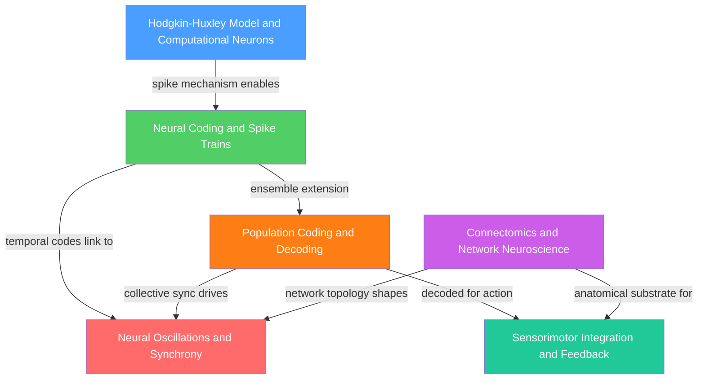

# Computational Neuroscience — Map of Content

> [!info] How to use this map
> Start with **Fundamentals**, follow the arrows, and use the Learning Path below as your guide.
> Each node links to a full note. Come back to this map when you feel lost.

---

> [!abstract] Section Overview
> Computational neuroscience uses mathematical and computational models to understand neural circuits, from single-neuron dynamics (Hodgkin-Huxley) through population codes, oscillations, and large-scale connectomics, bridging neuroscience with machine learning and signals processing. It provides a quantitative language for translating biological observations into testable predictions and engineering applications — from brain-computer interfaces and neuromorphic chips to forward-model-based motor control — treating the brain as an information-processing system governed by differential equations, information theory, and graph theory.

---

## Concept Map

(Blue = foundational entry point, Green = intermediate, Orange = intermediate-advanced, Red/Teal = advanced, Purple = integrative/systems; arrows = "leads to" or "requires")

---

## Learning Paths

### Model-First Path

Recommended for anyone coming from mathematics, physics, or AI/ML:

1. [[Hodgkin_Huxley_Model_and_Computational_Neurons]] — the neuron as an electrical circuit; HH equations, LIF/AdEx models, and spiking neural networks; the biophysical foundation for everything that follows
2. [[Neural_Coding_and_Spike_Trains]] — once spikes exist, what information do they carry? Rate, temporal, and population coding; Poisson variability; Fisher information; the GLM for spike trains
3. [[Population_Coding_and_Decoding]] — ensemble representations; population vector and ML decoders; Cramér-Rao bound; GPFA and neural manifolds; BCIs as a direct application
4. [[Neural_Oscillations_and_Synchrony]] — how E-I populations synchronise at gamma and theta; PING mechanism; communication-through-coherence routing; disease disruption of synchrony

### Systems Path

Recommended for those approaching from biology, psychology, or clinical neuroscience:

1. [[Connectomics_and_Network_Neuroscience]] — start with the large-scale wiring diagram; graph theory, small-world topology, rich-club hubs, and how disease exploits this architecture
2. [[Sensorimotor_Integration_and_Feedback]] — how the brain uses forward models and Kalman filtering to control movement despite sensory delays; cerebellar supervised learning
3. [[Population_Coding_and_Decoding]] — understand how motor intentions and sensory states are encoded and decoded across neuron populations; the foundation for BCIs
4. [[Neural_Oscillations_and_Synchrony]] — oscillatory synchrony as the routing and binding mechanism that ties the full network-level system together

---

## All Notes in This Section

| Note | Core Concept | Level |
| ---- | ------------ | ----- |
| [[Hodgkin_Huxley_Model_and_Computational_Neurons]] | Conductance-based HH model explains spike generation via Na+/K+ gating; LIF and AdEx as efficient computational alternatives | Intermediate |
| [[Neural_Coding_and_Spike_Trains]] | Rate coding, temporal coding, and population coding; tuning curves; Poisson variability; Fisher information; GLM for spike trains | Intermediate |
| [[Population_Coding_and_Decoding]] | Population vector and maximum likelihood decoders; Cramér-Rao lower bound; dimensionality reduction (PCA, GPFA, UMAP); neural manifold hypothesis | Intermediate–Advanced |
| [[Neural_Oscillations_and_Synchrony]] | E-I circuits generate delta/theta/alpha/beta/gamma oscillations; PING mechanism; communication-through-coherence; Kuramoto model | Intermediate–Advanced |
| [[Sensorimotor_Integration_and_Feedback]] | Forward/inverse internal models; Kalman filter for optimal state estimation; corollary discharge; cerebellar LTD as supervised learning | Advanced |
| [[Connectomics_and_Network_Neuroscience]] | Structural and functional connectomes; small-world, rich-club graph topology; EM and DTI methods; hub vulnerability in neurological disease | Advanced |

---

## Key Questions This Section Answers

- How do voltage-gated ion channels generate the stereotyped action potential, and what simpler models (LIF, AdEx) faithfully approximate the neuron's computational role?
- Which aspect of a spike train — mean firing rate, precise timing, or oscillatory phase — carries information about a stimulus, and how can downstream neurons or algorithms decode it?
- Why does distributing a representation across thousands of noisy neurons improve precision so dramatically, and what is the fundamental statistical limit (Cramér-Rao bound) on that improvement?
- How do excitatory-inhibitory circuit dynamics spontaneously generate specific oscillation frequencies, and how does inter-area coherence route and gate information flow?
- How does the cerebellum use an efference-copy-based forward model and Kalman-filter-like state estimation to execute fast movements despite 50–100 ms sensory delays?
- What does the complete wiring diagram of the brain reveal about its network topology, and why do highly connected hub regions fail disproportionately in Alzheimer's disease and traumatic brain injury?

---

## Cross-Section Connections

- [[_MOC_Cellular_and_Molecular_Neuroscience|S01 Cellular and Molecular Neuroscience MOC]] — action potentials and ion channel biophysics (S01) are the biological foundation for every computational model here; the Hodgkin-Huxley equations formalise the voltage-clamp experiments described in that section
- [[_MOC_Systems_Neuroscience|S03 Systems Neuroscience MOC]] — sensory tuning curves (V1, MT, S1) and motor cortex population vectors (M1) are the primary experimental systems being modelled throughout this section; sensorimotor loops studied behaviourally in S03 are implemented computationally here
- [[_MOC_AI_ML_Master]] (AI-ML vault) — LIF spiking neurons are the biophysical ancestor of the sigmoid-activated artificial neuron; population coding is the biological precedent for distributed neural network representations; cerebellar LTD mirrors the Widrow-Hoff delta rule; reinforcement learning's TD error is the direct analogue of the climbing-fibre teaching signal; neuromorphic hardware (Intel Loihi, IBM TrueNorth) directly implements HH/LIF dynamics at scale

---

[[_MOC_Neuroscience_Master|↑ Neuroscience Master MOC]]

---

#MOC #Neuroscience #ComputationalNeuroscience #SectionMOC
