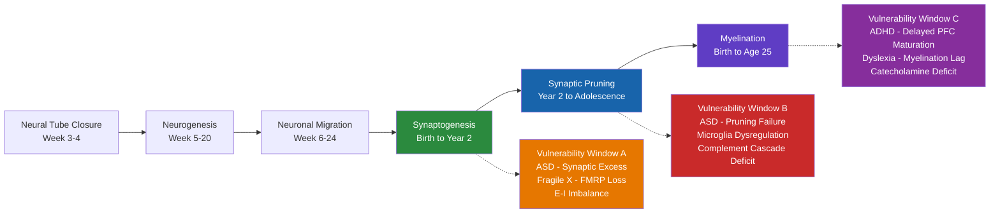

# Neurodevelopmental Disorders

> [!abstract] TL;DR
> Neurodevelopmental disorders arise when the genetically programmed sequence of neural tube closure, neurogenesis, migration, synaptogenesis, pruning, and myelination is disrupted during critical embryonic or early postnatal windows, permanently altering circuit architecture and function. Autism Spectrum Disorder, ADHD, dyslexia, and intellectual disability are the four most prevalent categories, together affecting roughly 15% of the global population, with overlapping but distinct genetic and circuit-level mechanisms. No single cause explains any disorder — instead, polygenic risk, rare copy number variants, and environmental insults converge to shift neural connectivity, neurotransmitter balance, and cortical maturation trajectories in ways that range from subtle cognitive differences to profound functional impairment.

---

## Intuition — analogy FIRST

Think of brain development as a multi-year skyscraper construction project managed by a master blueprint.

The **blueprint** is the genome — it specifies the number of floors, where each load-bearing wall goes, and what wiring runs to which room. When the blueprint contains errors (de novo mutations, copy number variants, trisomies) the entire structure is built to the wrong specification: this is the genetic contribution to conditions like Down syndrome, Fragile X, and high-heritability ASD.

The **construction process itself** can also be disrupted even if the blueprint is perfect. Toxic materials delivered at the wrong time (prenatal valproate exposure, maternal infection), scaffolding failures (premature birth), or subcontractors finishing their work in the wrong order (asynchronous myelination) all leave the finished building looking nearly normal from the outside while concealing structural flaws — misrouted wiring, overpacked rooms, underpowered circuits — that only become apparent when the building is put under load.

Two rules follow from this analogy. First, the **earlier** the disruption, the more widespread its effects, because early processes constrain everything built on top of them. A wiring error in the basement propagates to every floor; a cosmetic error on the top floor affects only that floor. Second, the same disruption at different times produces different disorders — explaining why the same genetic variant can predispose to ASD in one individual, intellectual disability in another, and epilepsy in a third.

---

## How It Works

### Neural Development Stages and Vulnerability Windows

Human brain development unfolds in six overlapping stages, each representing a distinct vulnerability window:

1. **Neural tube closure (gestational week 3–4)** — The flat neural plate folds and seals into the neural tube, the precursor of the entire CNS. Failure to close causes anencephaly (rostral) or spina bifida (caudal). Folic acid deficiency and valproate are established risk factors.

2. **Neurogenesis (week 5–20)** — Progenitor cells in the ventricular and subventricular zones divide to generate the ~86 billion neurons of the adult brain. Over-proliferation, under-proliferation, or apoptosis errors here alter total neuron number — the substrate of macrocephaly and microcephaly seen in some ASD subtypes.

3. **Neuronal migration (week 6–24)** — Newly born neurons migrate radially along radial glia or tangentially to their cortical laminar positions. Migration failures produce lissencephaly (smooth cortex), polymicrogyria, and focal cortical dysplasia — severe epilepsy syndromes with comorbid intellectual disability.

4. **Synaptogenesis (month 5 of gestation through postnatal year 2)** — Axons reach their targets and form synapses at an extraordinary rate — approximately 1 million new synapses per second at peak. By age 2 the brain has roughly twice the synaptic density of the adult brain. ASD and Fragile X are associated with dysregulation at this stage: FMRP (the RNA-binding protein lost in Fragile X) normally suppresses excess dendritic protein synthesis, and its loss allows runaway synaptogenesis.

5. **Synaptic pruning (year 2 through adolescence)** — Microglia, directed by complement proteins C1q and C3 tagging weak synapses, eliminate roughly half of all synapses in the first two decades of life. This is not destruction but refinement — the sculptor's removal of excess marble. In ASD, post-mortem studies show reduced microglial activation and persistently elevated synaptic density in prefrontal cortex, consistent with pruning failure. In schizophrenia, complement gene overexpression may drive excessive pruning in adolescence.

6. **Myelination (birth through the mid-20s)** — Oligodendrocytes wrap axons in myelin sheaths, increasing conduction velocity up to 50-fold and reducing energy cost. Myelination proceeds in a fixed posterior-to-anterior, primary-to-association sequence. The prefrontal cortex — seat of executive function, working memory, and impulse control — is among the last regions to fully myelinate. ADHD is associated with a measurable 3–5 year delay in cortical maturation, particularly in PFC, detectable by longitudinal MRI.

### Disorder-Specific Circuit Mechanisms

**Autism Spectrum Disorder (ASD):**
The core deficits — impaired social communication, restricted interests, sensory over/under-reactivity — reflect a circuit-level imbalance between excitatory and inhibitory signalling (**E-I imbalance model**). Multiple genetic hits converge on this phenotype: SHANK3 (scaffolding protein at glutamatergic synapses), NLGN3/4 (neuroligins, synapse cell-adhesion), TSC1/2 (mTOR pathway regulators), and FMRP all influence excitatory synapse number or function. The mTOR pathway in particular acts as a master regulator of synapse formation; its overactivation drives the synaptic excess seen in Tuberous Sclerosis Complex-associated ASD.

**ADHD:**
Core deficits in sustained attention, working memory, and response inhibition map onto the **prefrontal–striatal circuit**. The catecholamine hypothesis proposes that suboptimal levels of dopamine and norepinephrine in PFC reduce signal-to-noise in pyramidal cell firing, degrading the stable working-memory representations needed for goal-directed behaviour. Stimulant medications (methylphenidate, amphetamine) normalise catecholamine tone in PFC, explaining their paradoxical calming effect. Structural MRI meta-analyses show reduced volume in caudate nucleus, cerebellum, and PFC in children with ADHD, with partial normalisation by adulthood.

**Dyslexia:**
Reading is not a natural human capacity — it requires years of instruction to remap the auditory phonological system onto visual orthographic symbols. The **phonological deficit hypothesis** proposes that dyslexia arises from imprecise phonological representations in left perisylvian cortex (particularly posterior superior temporal gyrus), making the grapheme-to-phoneme mapping unstable. Functional MRI consistently shows reduced activation of left posterior temporal and inferior parietal regions during reading in dyslexic adults, with compensatory overactivation of Broca's area (a slower, more effortful articulatory route) and right hemisphere homologues.

### Brain Development Timeline with Vulnerability Windows



---

## Key Concepts

### Secondary Level

**Autism Spectrum Disorder (ASD)** is characterised by three core features: (1) persistent deficits in social communication and social interaction across multiple contexts; (2) restricted, repetitive patterns of behaviour, interests, or activities; and (3) sensory sensitivities — hyper- or hypo-reactivity to sensory input. The DSM-5 collapsed the former subcategories (Autistic Disorder, Asperger's, PDD-NOS) into a single spectrum defined by severity levels 1–3. Prevalence is approximately 1 in 36 children in the USA (CDC, 2023). ASD is four times more common in males, though this ratio narrows when assessment tools are designed for female presentation.

**ADHD** presents in three subtypes: predominantly inattentive, predominantly hyperactive-impulsive, and combined. Core symptoms are inattention (difficulty sustaining focus, losing things, forgetfulness) and/or hyperactivity-impulsivity (fidgeting, excessive talking, acting before thinking). Prevalence is ~5–7% in children and ~4% in adults. ADHD frequently co-occurs with ASD, anxiety, and learning disabilities.

**Dyslexia** is a specific learning disorder characterised by difficulties with accurate and/or fluent word recognition and poor spelling and decoding abilities, despite adequate intelligence and educational opportunity. It is not about seeing letters backwards — this is a widespread misconception. The fundamental difficulty is phonological: extracting and manipulating the sound units within words.

**Intellectual Disability (ID)** is defined by: (1) deficits in intellectual functions (IQ < 70, approximately 2 SD below the mean); and (2) deficits in adaptive behaviour (conceptual, social, and practical skills). Severity ranges from mild (~85% of cases) to profound. ID can be caused by chromosomal abnormalities, single-gene mutations, metabolic disorders, or environmental factors (prenatal alcohol exposure, perinatal asphyxia).

**Down Syndrome (Trisomy 21)** is the most common chromosomal cause of ID, occurring in ~1 in 700 live births. An extra copy of chromosome 21 results in overexpression of hundreds of genes, producing characteristic facial features, congenital heart defects, hypotonia, and mild-to-moderate ID. Individuals with Down syndrome have a near-certainty of developing Alzheimer's pathology by age 40, attributable to triplication of the APP gene on chromosome 21.

**Neurodiversity perspective:** Coined by sociologist Judy Singer in 1998, neurodiversity frames autism, ADHD, dyslexia, and related conditions as natural variations in human cognitive architecture rather than deficits requiring cure. This perspective does not deny that neurodivergent individuals may face real functional challenges or need support, but argues that interventions should aim to reduce barriers and build strengths, not normalise cognition at any cost.

---

### Undergraduate Level

**ASD genetics:** Twin studies estimate heritability at ~80%. The genetic architecture is heterogeneous: hundreds of common variants each contribute small effects (polygenic component), while rare de novo copy number variants (deletions or duplications at 16p11.2, 22q11.2, 15q11-13) and single-gene mutations confer large individual risk. Key genes include:
- **SHANK3** — postsynaptic scaffolding protein; loss causes Phelan-McDermid syndrome with severe ASD
- **NLGN3/4** — neuroligins; presynaptic-postsynaptic adhesion molecules critical for synapse specification
- **TSC1/TSC2** — negative regulators of mTOR; mutations cause Tuberous Sclerosis Complex, ~50% ASD rate
- **CHD8** — chromatin remodelling factor; loss is the most prevalent single-gene ASD risk factor

**E-I Imbalance Model:** The hypothesis that ASD results from an excess of excitatory relative to inhibitory synaptic drive. Evidence: reduced GABAergic interneuron density in post-mortem ASD cortex; elevated glutamate/glutamine ratios by MRS; rescue of social deficits in mouse models by enhancing inhibition. However, whether the imbalance is universal or only in specific circuits remains debated.

**ADHD neuroimaging:** Meta-analyses of structural MRI find significantly reduced volume in caudate nucleus (~3%), cerebellum, and dorsolateral PFC in children with ADHD vs. controls. Crucially, Shaw et al. (2007) demonstrated that ADHD involves a *delay* in cortical maturation of approximately 3 years (peak cortical thickness delayed from age 7.5 to age 10.5 in controls), rather than a fixed deficit — and that this delay normalises in many adults.

**Catecholamine hypothesis of ADHD:** PFC pyramidal neurons require optimal (not too low, not too high) levels of dopamine (D1 receptor) and norepinephrine (alpha-2A receptor) to maintain stable, delay-activity firing during working memory tasks. Low catecholamine tone increases "noise" (spontaneous firing) and reduces "signal" (task-relevant sustained activity), degrading the representations that underpin impulse control and sustained attention.

**Phonological deficit in dyslexia:** Phonological awareness — the ability to detect, isolate, and manipulate phonemes — predicts reading acquisition better than any other variable. Children with dyslexia show impaired phoneme awareness, rapid automatised naming, and verbal short-term memory, pointing to a core phonological representation deficit rather than a visual problem.

**Down syndrome molecular basis:** Three copies of chromosome 21 alter expression of over 300 genes. Most clinically significant triplicated genes include:
- **APP** — beta-amyloid precursor protein; drives Alzheimer-like pathology by age 40
- **DYRK1A** — kinase that hypophosphorylates tau and disrupts synaptogenesis
- **DSCR1 (RCAN1)** — calcineurin regulator; disrupts synaptic plasticity

**Fragile X Syndrome:** The most common inherited cause of ID and the most common single-gene cause of ASD. A CGG trinucleotide repeat expansion in the 5' UTR of the FMR1 gene (>200 repeats = full mutation) triggers CpG methylation of the promoter, silencing transcription of FMRP. FMRP is an mRNA-binding protein that normally suppresses local dendritic translation at synapses. Without FMRP, excessive translation of synaptic proteins drives runaway synaptogenesis and impaired LTD — the cellular basis of the learning deficits.

---

### Graduate Level

**Synaptic pruning mechanism in ASD:** During normal development, C1q (complement component 1q) binds weak, low-activity synapses, tagging them for elimination by C3 opsonisation and phagocytosis by microglia via CR3 (complement receptor 3). Sekar et al. (2016) showed that copy number variations in C4 genes underlie schizophrenia risk through excessive pruning in adolescence. In ASD, the opposite phenotype predominates: Tang et al. (2014) found significantly greater spine density in post-mortem ASD pyramidal neurons across all cortical layers, with reduced microglial activation markers — consistent with pruning failure rather than pruning excess.

**mTOR pathway overactivation in ASD:** mTOR (mechanistic target of rapamycin) is a serine/threonine kinase that integrates nutrient, energy, and growth factor signals to control protein synthesis and cell growth. In neurons, mTOR activation drives local synaptic protein synthesis — the mechanism behind synaptogenesis and certain forms of LTP. TSC1/TSC2 mutations, PTEN mutations, and FMR1 loss all converge to over-activate mTOR, producing a synaptic excess phenotype. Rapamycin (mTOR inhibitor) rescues social behaviour, seizures, and synaptic density in multiple rodent ASD models, and clinical trials in TSC patients are ongoing.

**Early developmental biomarkers:** Because the window for maximum intervention efficacy is before age 3 and behavioural diagnosis of ASD is typically made at age 3–4, there is intense interest in earlier biomarkers. EEG-based measures (gamma oscillation power, mismatch negativity amplitude, connectivity) and eye-tracking paradigms (reduced fixation on social regions of faces by 2–6 months in siblings later diagnosed with ASD) are the most advanced. Infant siblings of ASD probands carry ~20× elevated risk, making them tractable for prospective biomarker studies.

**CRISPR models:** Zebrafish and mouse models with CRISPR-engineered mutations in SHANK3, CNTNAP2, TSC1/2, and FMR1 have validated circuit-level hypotheses and enabled drug screening. Cerebral organoids (3D stem-cell-derived brain models) from ASD patient iPSCs show premature cortical differentiation and altered inhibitory interneuron migration, recapitulating aspects of the disorder in a dish — though organoids currently lack vascularisation, microglia, and normal sensory input.

**Reward and motivation in ASD:** Reduced social reward salience — not simply a social cognition deficit — may be a primary driver of ASD social behaviour. fMRI studies show reduced activation of the ventral striatum (nucleus accumbens) and orbitofrontal cortex when autistic individuals view social stimuli, while activation is preserved or enhanced for preferred special interests. This reframes ASD partly as a motivational disorder: social interactions do not deliver the same dopaminergic reinforcement signal that they do in neurotypical individuals.

**Executive function in ADHD:** Beyond attention, ADHD involves broad executive function deficits: working memory (reduced digit span, impaired verbal rehearsal), cognitive flexibility (perseverative errors on set-shifting tasks), planning, and response inhibition. Barkley's inhibitory control model proposes that the core deficit is in behavioural inhibition — the ability to withhold a prepotent response, interrupt an ongoing response, and protect goal-directed behaviour from interference. All downstream executive deficits follow from this primary inhibitory failure.

**Pharmacogenomics of ADHD treatment:** ~70–80% of children respond to first-line stimulants, but response and adverse effects vary substantially. CYP2D6 polymorphisms affect atomoxetine (non-stimulant) metabolism; poor metabolisers achieve higher plasma levels and may experience greater side effects. COMT Val158Met genotype moderates methylphenidate response: Val/Val carriers (lower PFC dopamine tone) show the greatest cognitive improvement. Routine pharmacogenomic testing is not yet standard but is increasingly available.

**Female ASD and ADHD — camouflaging and late diagnosis:** Girls and women with ASD and ADHD are systematically under-diagnosed relative to males. The mechanisms include: genuine sex-differences in presentation (females tend toward internalising over externalising symptoms); active camouflaging — consciously or unconsciously masking symptoms through social mimicry; and assessment tools validated primarily on male samples. Late or missed diagnosis leads to accumulation of trauma, anxiety, and depression on top of the primary condition, and delayed access to accommodations.

---

## Python Demo

This simulation models activity-dependent synaptic pruning in a small neural microcircuit. The initial overcrowded connectivity matrix represents peak synaptogenesis. A weight threshold determines which synapses survive — high threshold = healthy pruning; low threshold = impaired pruning (ASD-like overconnectivity).

```python
import numpy as np
import matplotlib.pyplot as plt

np.random.seed(42)
n = 20  # neurons in the microcircuit

# Step 1: Build an overcrowded initial connectivity matrix
# Models peak synaptogenesis: ~80% of possible synapses are formed
rng = np.random.default_rng(42)
density_mask = rng.binomial(1, 0.80, size=(n, n))
weights = rng.uniform(0.0, 1.0, size=(n, n))
W_initial = weights * density_mask
np.fill_diagonal(W_initial, 0.0)  # no self-connections

# Step 2: Activity-dependent pruning
# "Use it or lose it": synapses with weight < threshold are eliminated
def activity_dependent_prune(W, threshold):
    pruned = W.copy()
    pruned[pruned < threshold] = 0.0
    return pruned

# Healthy pruning: aggressive (threshold 0.50 eliminates ~half of all synapses)
W_normal = activity_dependent_prune(W_initial, threshold=0.50)

# Impaired pruning (ASD-like): weak threshold, too many connections survive
W_asd = activity_dependent_prune(W_initial, threshold=0.15)

def n_connections(W):
    return int(np.count_nonzero(W))

print(f"Initial connections : {n_connections(W_initial)}")
print(f"Normal pruning      : {n_connections(W_normal)}")
print(f"ASD-like pruning    : {n_connections(W_asd)}")

# Step 3: Visualise as connectivity matrices
fig, axes = plt.subplots(1, 3, figsize=(15, 5))
configs = [
    (W_initial, "Initial\nOvercrowded Synaptogenesis",   "Oranges"),
    (W_normal,  "Normal Pruning\nThreshold = 0.50",       "Blues"),
    (W_asd,     "Impaired Pruning - ASD-like\nThreshold = 0.15", "Reds"),
]

for ax, (W, title, cmap) in zip(axes, configs):
    im = ax.imshow(W, cmap=cmap, vmin=0, vmax=1, aspect="auto")
    ax.set_title(title, fontsize=11, fontweight="bold")
    ax.set_xlabel(f"Postsynaptic Neuron  [connections: {n_connections(W)}]")
    ax.set_ylabel("Presynaptic Neuron")
    plt.colorbar(im, ax=ax, fraction=0.046, pad=0.04)

plt.suptitle("Synaptic Pruning Simulation: Normal vs ASD-like Overconnectivity",
             fontsize=13, fontweight="bold")
plt.tight_layout()
plt.savefig("synaptic_pruning_simulation.png", dpi=120, bbox_inches="tight")
plt.show()
```

Expected output: `Initial connections: ~304`, `Normal pruning: ~152`, `ASD-like: ~258`. The ASD-like matrix retains dense connectivity similar to the immature brain, whereas normal pruning produces the sparser, high-weight network characteristic of mature cortex.

---

## Real-World Applications

**Early intensive ABA intervention:** Applied Behaviour Analysis using discrete trial training remains the most evidence-supported early intervention for ASD. Lovaas (1987) reported that ~47% of children who received 40 hours/week of ABA before age 4 achieved normal intellectual and educational functioning by age 7. Effect sizes are largest when intervention starts before age 3 — directly reflecting the synaptogenesis/pruning vulnerability window.

**ADHD pharmacotherapy:** Methylphenidate (Ritalin, Concerta) and amphetamine salts (Adderall, Vyvanse) remain first-line treatments, normalising catecholamine signalling in PFC circuits. Non-stimulant options — atomoxetine (NET inhibitor), guanfacine, clonidine (alpha-2A agonists) — are used when stimulants are contraindicated or ineffective. ~70–80% of patients show clinically meaningful improvement.

**Educational accommodations:** For dyslexia: text-to-speech software, extended test time, reduced written output expectations, and explicit phonics instruction (Orton-Gillingham method) — a structured, multisensory approach that systematically teaches grapheme-phoneme correspondences. For ADHD: preferential seating, chunked instructions, frequent check-ins, homework modifications.

**Genetic counselling and prenatal diagnosis:** Chromosomal microarray identifies copy number variants (CNVs) responsible for ASD and ID in ~15–20% of cases with known aetiology. Down syndrome is detectable prenatally via cell-free DNA screening (99% sensitivity, >99% specificity for trisomy 21) and confirmed by karyotype. Genetic counselling informs recurrence risk: chromosomal Down syndrome recurrence risk is ~1% plus maternal age risk; Familial Fragile X recurrence follows X-linked dominant inheritance with penetrance modulated by repeat length.

**Adult ADHD and ASD diagnosis:** A significant fraction of ADHD (~60% of childhood cases) and ASD persist into adulthood, yet adult diagnosis rates lag far behind. Adult ADHD affects executive function, occupational performance, relationships, and driving safety. Adult ASD diagnosis — especially in women who have camouflaged throughout childhood — can be profoundly validating, enabling access to workplace accommodations, therapy aligned to autistic neurology, and community.

**Neurodiversity hiring programmes:** SAP's Autism at Work programme (launched 2013) and Microsoft's Autism Hiring Program specifically recruit autistic adults for roles in software testing, data analysis, and documentation, recognising that the attention to detail, pattern recognition, and rule-adherence characteristic of many autistic individuals are genuine occupational strengths in these domains.

---

## Common Pitfalls

- **Vaccines cause autism** — This claim originates from a 1998 Lancet paper by Andrew Wakefield that was retracted in 2010 after investigation revealed data fabrication and undisclosed conflicts of interest. Wakefield lost his medical licence. More than 20 large-scale epidemiological studies involving millions of children across multiple countries have found no association between any vaccine or vaccine component and ASD. The MMR-ASD hypothesis is scientifically closed.

- **ASD is a linear severity spectrum** — The DSM-5 uses "levels 1–3" for administrative purposes, but autism is multidimensional: a person can be level 1 for social communication and level 3 for restricted behaviours, or be intellectually gifted while functionally disabled by anxiety. Treating the spectrum as a single axis obscures the heterogeneity and leads to mismatched support.

- **ADHD is a childhood disorder that children outgrow** — Longitudinal studies show that ~60% of children with ADHD retain clinically significant symptoms as adults, though hyperactivity tends to diminish while inattention persists. Adult ADHD is under-recognised and under-treated, contributing to higher rates of unemployment, relationship breakdown, substance misuse, and traffic accidents.

- **Dyslexia means seeing letters backwards** — Mirror writing and letter reversal are normal in early literacy development and are not specific to dyslexia. The core deficit is phonological, not visual. Dyslexic readers are not seeing the world differently; they are processing the sound structure of language less efficiently.

- **Intellectual disability and ASD are the same** — They frequently co-occur (~30–35% of people with ASD also have ID), but they are distinct conditions with different genetic bases and cognitive profiles. Many autistic people have average or above-average IQ; many people with ID are not autistic.

- **Stimulant medications stunt growth in ADHD** — Early studies suggested mild growth suppression (~1–2 cm predicted height loss), but long-term follow-up studies show the effect is small, largely offset by medication holidays, and should not prevent treatment in children with clinically significant ADHD.

---

## Related Concepts

- [[Synaptic_Plasticity_and_LTP]] — ASD involves failure of activity-dependent synaptic pruning; the same Hebbian machinery that strengthens memories through LTP is dysregulated in the ASD synaptogenesis window
- [[Language_and_the_Brain]] — dyslexia represents a specific disruption to phonological processing circuits in left perisylvian cortex, particularly Wernicke's area and posterior parietal cortex; fMRI hypoactivation in dyslexia is the mirror image of the language-area activation maps
- [[Glial_Cells_and_Blood_Brain_Barrier]] — microglia are the effectors of developmental synaptic pruning via C1q/C3 complement tagging; their under-activation in ASD cortex is one of the strongest post-mortem findings in the field
- [[Connectomics_and_Network_Neuroscience]] — ASD shows characteristic local overconnectivity and reduced long-range connectivity in structural and functional connectomes, reflecting the pruning failure captured at the synaptic scale
- [[Psychopharmacology_and_Drug_Mechanisms]] — ADHD pharmacotherapy (methylphenidate, amphetamine, atomoxetine, guanfacine) and emerging ASD pharmacology (rapamycin in TSC, GABA-B agonists) are directly grounded in the circuit-level mechanisms described here
- [[Neuroplasticity_and_Rehabilitation]] — compensatory neuroplasticity underlies the partial normalisation of ADHD brain structure in adults and the effectiveness of behavioural interventions in ASD; understanding plasticity windows informs when and how intervention is most effective
- [[Psychological_Disorders_Overview]] (Psychology vault) — clinical diagnostic framework, prevalence data, and psychosocial treatment approaches for the same conditions from a psychological rather than neurobiological vantage point

---

## Review Questions

**Tier 1 — Conceptual understanding**
1. Explain, in terms of the six stages of neural development, why a genetic mutation that disrupts mTOR signalling during synaptogenesis produces a very different phenotype from one that disrupts myelination, even if both mutations occur in the same individual.

**Tier 2 — Clinical scenario**
2. A 32-year-old woman presents for the first time with lifelong complaints of disorganisation, difficulty finishing tasks, emotional dysregulation, and poor working memory. She did well in school through compensatory strategies and was never evaluated as a child. What neurodevelopmental diagnosis should be considered, what is the neurobiological basis of her symptoms, and what assessment tools are appropriate for adults?

**Tier 3 — Trade-off and experimental design**
3. Rapamycin rescues synaptic density, social behaviour, and seizure frequency in TSC1/TSC2 mouse models of ASD by inhibiting mTOR. What are the risks of translating this to a human clinical trial in children with TSC-associated ASD, and how would you design a trial that balances potential therapeutic benefit against the known immunosuppressive effects of chronic rapamycin?

---

## Sources

- Kandel ER, Koester JD, Mack SH, Siegelbaum SA. *Principles of Neural Science*, 6th ed. McGraw-Hill, 2021.
- Lord C, Elsabbagh M, Baird G, Veenstra-Vanderweele J. Autism spectrum disorder. *Lancet*. 2018;392(10146):508–520. https://doi.org/10.1016/S0140-6736(18)31129-2
- Shaywitz SE. *Overcoming Dyslexia*. Knopf, 2003.
- Tang G, Gudsnuk K, Kuo SH, et al. Loss of mTOR-dependent macroautophagy causes autistic-like synaptic pruning deficits. *Neuron*. 2014;83(5):1131–1143.
- Sekar A, Bialas AR, de Rivera H, et al. Schizophrenia risk from complex variation of complement component 4. *Nature*. 2016;530(7589):177–183.
- Shaw P, Eckstrand K, Sharp W, et al. Attention-deficit/hyperactivity disorder is characterized by a delay in cortical maturation. *PNAS*. 2007;104(49):19649–19654.
- Barkley RA. *ADHD and the Nature of Self-Control*. Guilford Press, 1997.

---

#Neuroscience #ClinicalNeuroscience #NeurodevelopmentalDisorders #Autism #ADHD
