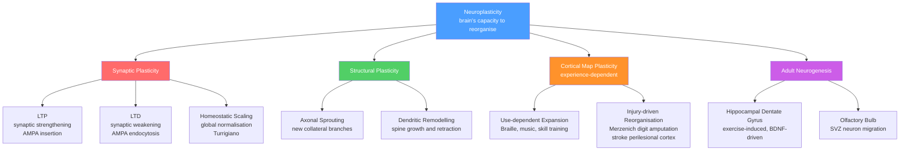

# 🧠 Neuroplasticity and Rehabilitation

> [!abstract] TL;DR
> Neuroplasticity is the brain's lifelong capacity to reorganize its structure, connections, and function in response to experience, learning, or injury — from millisecond-scale synaptic weight changes to weeks-long cortical map reshaping. It encompasses synaptic mechanisms (LTP/LTD and homeostatic scaling), structural changes (axonal sprouting, dendritic remodeling), experience-dependent cortical map reorganization, and, in limited regions, adult neurogenesis. Rehabilitation medicine harnesses these mechanisms deliberately — through repetitive task-specific practice, constraint-induced movement therapy, and non-invasive brain stimulation — to promote functional recovery after stroke, spinal cord injury, traumatic brain injury, and aphasia.

---

## Intuition — analogy FIRST

When a major road is blocked — a bridge closed by flood damage — your GPS doesn't give up. It reroutes, threading side streets and alternate highways to reach the same destination. Drive that detour every day and something changes: you stop needing the GPS for it. The alternate route becomes automatic, efficient, and eventually faster than you remember the original being.

The injured brain works exactly this way. A stroke that destroys the primary motor cortex representation of the left hand does not permanently erase hand movement — neighboring cortical regions, ipsilateral pathways, and subcortical routes can gradually be recruited as substitutes. **Rehabilitation is the intensive daily practice of driving the same detour.** The more consistently a new neural pathway is activated under demanding conditions, the more it is sculpted by LTP-like mechanisms into a stable, efficient route. The brain rewires itself in response to demand, not merely in response to injury. The injury creates the opportunity; the rehabilitation provides the signal that determines which new routes get built.

---

## How It Works

### Core Mechanisms

1. **Synaptic plasticity (LTP and LTD):** The most rapid mechanism. Repeated co-activation of pre- and postsynaptic neurons strengthens (LTP) or weakens (LTD) synaptic connections within minutes to hours, via NMDA-receptor-mediated Ca²⁺ influx and AMPA receptor trafficking. In motor rehabilitation, repetitive task-specific practice drives LTP at corticospinal and intracortical synapses, consolidating motor programs. LTD is exploited therapeutically — low-frequency repetitive TMS (rTMS at 1 Hz) over the intact contralesional cortex induces LTD-like depression of the overactive hemisphere to allow the damaged hemisphere to express itself.

2. **Homeostatic synaptic scaling (Turrigiano):** When a neuron receives chronically reduced input — as after deafferentation or injury — it globally upscales all its synaptic strengths to restore a target firing rate (synaptic scaling up). Conversely, overactive networks scale down to prevent runaway excitation. This negative-feedback process, mediated by TNF-α and cell-surface GluA1 regulation, stabilizes networks during the massive reorganization that follows large lesions. It operates on timescales of hours to days, complementing the faster Hebbian mechanisms.

3. **Structural plasticity:** Beyond synapse strength, the physical architecture changes. Axons sprout new collateral branches to innervate denervated targets; dendritic spines grow, enlarge, or retract in response to activity patterns. In perilesional cortex in the weeks after stroke, surviving pyramidal neurons show increased dendritic branching and new spine formation as adjacent areas compensate for the lost territory.

4. **Cortical map reorganization (experience-dependent):** Michael Merzenich's seminal owl-monkey experiments (1983–1990) demonstrated that somatosensory cortical maps are not fixed anatomical facts — amputation of a finger causes its cortical territory to be colonized by neighboring finger representations within weeks. Conversely, Braille readers show dramatically expanded index-fingertip representations in somatosensory cortex compared with sighted controls. The same principle holds for motor cortex, auditory cortex, and visual cortex. The rule is **use it or lose it**: cortical territory is allocated by the competitive balance of afferent activity.

5. **Adult neurogenesis:** New neurons are continuously generated in the hippocampal dentate gyrus from neural stem cells in the subgranular zone (SGZ) and in the olfactory bulb from progenitors in the subventricular zone (SVZ). In rodents, aerobic exercise, environmental enrichment, and learning dramatically increase SGZ neurogenesis; BDNF signaling through TrkB is the primary mediator. New dentate granule cells are transiently hyper-excitable and preferentially incorporated into memory circuits during a sensitive window (~4–6 weeks post-birth). Their role in pattern separation and cognitive flexibility makes them a compelling target for cognitive rehabilitation.

6. **Critical periods:** There are developmental windows — for visual acuity, binaural hearing, and language acquisition — during which the brain is maximally plastic to specific inputs. After the critical period closes, plasticity contracts but is not eliminated. The closure is driven by the maturation of perineuronal nets (PNNs) — dense extracellular matrix structures rich in chondroitin sulfate proteoglycans (CSPGs) that ensheath parvalbumin interneurons and shift the cortical excitatory/inhibitory balance toward inhibition. Understanding PNNs has opened potential strategies to partially reopen critical period plasticity for therapeutic purposes.

### Types of Plasticity — Overview



---

## Key Concepts / Details

### Secondary Level

**Synaptic plasticity — the cellular currency of learning:** Every skill you have ever learned changed the physical strength of synaptic connections in your brain. LTP (strengthening) and LTD (weakening) are the two fundamental operations. They are Hebbian: connections strengthen when the neurons on both sides fire together, and weaken when they fire asynchronously. Rehabilitation leverages this by making patients practice the impaired function repetitively and with high intensity — driving synchronous firing along the target pathway.

**Use it or lose it:** Cortical representations are maintained by use. When a body part is amputated, its cortical territory is not wasted — neighboring regions expand into it. When a stroke destroys primary motor cortex, the premotor and supplementary motor areas can partially take over if aggressively trained. Forced use of an impaired limb (constraint-induced movement therapy) exploits this principle directly.

**Critical periods — maximum windows of plasticity:** The developing brain passes through sensitive periods during which specific experiences are required for normal circuit formation. The classic example is the visual critical period (Hubel and Wiesel, Nobel Prize 1981): if one eye is deprived of visual input in the first weeks of life (amblyopia), its cortical representation is permanently outcompeted by the other eye. Language acquisition shows a similar window — children effortlessly become native speakers; adults acquiring a second language after puberty do so with more effort and less perfect phonology. These windows do not slam shut completely; they narrow.

**Adult brain can change — overturning old dogma:** For most of the 20th century, the dominant view was that the adult brain was essentially fixed — neurons do not regenerate, and circuits do not rewire in adulthood. Merzenich's cortical map experiments in the 1980s, and later the popular science synthesis in Norman Doidge's *The Brain That Changes Itself* (2007), demolished this dogma. Adult neuroplasticity is now the scientific consensus and the conceptual foundation of all modern rehabilitation medicine.

**Rehabilitation basics:** Effective neurological rehabilitation shares common principles: high repetition, task specificity, progressive challenge, and early initiation. Passive movement generates minimal plasticity; active, goal-directed practice against resistance generates far more. The intensity and timing of rehabilitation relative to the injury critically shapes outcome.

**Phantom limb pain — maladaptive plasticity:** After amputation, the cortical territory previously representing the amputated limb does not disappear quietly. It is taken over by adjacent representations — most often the face region in upper-limb amputees. This cortical reorganization can create aberrant cross-activation: touching the face triggers the phantom limb sensation. Ramachandran's mirror box therapy is a behavioral technique to retrain these aberrant cortical maps by providing visual feedback of the intact limb.

---

### Undergraduate Level

**Critical periods — the molecular brake:** The closure of critical periods is driven by the maturation of the cortical GABAergic system, particularly fast-spiking parvalbumin (PV) interneurons, and the deposition of perineuronal nets (PNNs) around PV cells. PNNs are complex ECM structures — predominantly aggrecan, brevican, neurocan, and versican — that stabilize synaptic contacts and reduce Hebbian competition. The opening of the visual critical period is triggered by GABA circuit maturation (accelerated by dark-rearing suppression or BDNF infusion); its closure correlates with full PNN assembly around PV cells. Disrupting PNNs with chondroitinase ABC (ChABC) in adult cats can re-open a visual critical period-like state.

**Adult neurogenesis — the controversy:** In rodents, adult neurogenesis in the hippocampal dentate gyrus is robust and well-characterised. In humans, the picture is contested. Sorrells et al. (2018, *Nature*) used rigorous immunohistochemistry on post-mortem human tissue and found no evidence of doublecortin-positive immature neurons in the adult human dentate gyrus, concluding that hippocampal neurogenesis ceases in early childhood. In the same year, Boldrini et al. (2018, *Cell Stem Cell*) reported evidence of persisting adult neurogenesis throughout the human lifespan. Methodological differences — fixation protocols, antibody validation, tissue processing time — account for much of the discrepancy. The current consensus is cautious: adult hippocampal neurogenesis in humans, if it exists, is far more limited than in rodents.

**Cortical map reorganization — Merzenich's monkey experiments:** Merzenich and colleagues surgically amputated digit 3 of owl monkeys and, weeks later, mapped somatosensory cortex with microelectrodes. The territory formerly responsive to digit 3 had been colonized by inputs from digits 2 and 4. In a complementary experiment, they sutured two fingers together, forcing their simultaneous use; the cortical maps of the two fingers merged into a single fused representation. These experiments established that somatotopic maps are activity-dependent, competitive, and continuously updated throughout adult life.

**Constraint-Induced Movement Therapy (CIMT) and learned non-use:** After stroke, patients learn to suppress use of their impaired limb because attempts are effortful and often fail — Taub called this "learned non-use." It produces a vicious cycle: the impaired limb is used less, its cortical representation shrinks, making recovery harder. CIMT reverses this by constraining the intact limb in a mitt for most waking hours, forcing the patient to use the affected limb in intensive, structured practice sessions. Taub's original 2-week protocol (6 hours/day × 10 days) produced functionally meaningful improvements in chronic stroke patients who had plateaued under conventional therapy, and fMRI showed expansion of the perilesional motor cortex representation of the affected hand.

**Aphasia rehabilitation:** Damage to Broca's area (left inferior frontal gyrus, production) or Wernicke's area (left posterior superior temporal gyrus, comprehension) produces aphasia. Speech-language pathology (SLP) exploits neuroplasticity: Constraint-Induced Aphasia Therapy (CIAT) enforces spoken language in intensive group settings, discouraging compensatory strategies (pointing, writing). Melodic intonation therapy (MIT) recruits right-hemisphere language-capable regions by exaggerating the natural speech melody — patients who cannot speak words can often sing them. Neuroimaging confirms right-hemisphere activation patterns after successful MIT that are not present before therapy.

**Homeostatic synaptic scaling — Turrigiano's contribution:** Gina Turrigiano's 1998 discovery (with Nelson) that neurons scale all their synaptic weights up or down as a global multiplicative operation to maintain target firing rates was transformative. Crucially, scaling preserves the *relative* weights among synapses (and thus the learned information) while normalizing absolute excitability — like adjusting the master volume on an amplifier without changing the balance of instruments. After a stroke creates a large zone of silence, surrounding neurons scale up, potentially increasing vulnerability to seizure (post-stroke epilepsy) and contributing to the excess excitability that makes the perilesional zone accessible for reorganization.

**Maladaptive plasticity — focal dystonia and CRPS:** Plasticity is not inherently beneficial. Focal dystonias (e.g., musician's cramp — involuntary finger movements that disrupt fine motor control in professional pianists and guitarists) result from excessive, repetitive, stereotyped practice that blurs the boundaries between adjacent finger representations in somatosensory cortex — cortical dedifferentiation. Complex Regional Pain Syndrome (CRPS) involves central sensitization and cortical reorganization that amplifies and perpetuates pain far beyond any ongoing tissue injury. Treating these conditions requires *reversing* aberrant plasticity, not merely strengthening it.

---

### Graduate Level

**Perineuronal nets as critical period brakes — ChABC therapy:** PNNs are highly organized, lattice-like ECM structures whose major components are chondroitin sulfate proteoglycans (CSPGs) — predominantly aggrecan, brevican, neurocan, and versican — cross-linked by hyaluronan and tenascin-R. They form preferentially around PV fast-spiking interneurons and are required for the strong, stable synaptic contacts that define closed-period circuits. Enzymatic degradation of the sulfated glycosaminoglycan chains by chondroitinase ABC (ChABC) in adult animals re-opens critical period-like plasticity: adult amblyopic cats regain ocular dominance plasticity after ChABC injection into visual cortex, adult rats show improved memory extinction (relevant to PTSD treatment), and ChABC in spinal cord injury models promotes axonal sprouting and functional recovery. The challenge for translation is delivering ChABC to specific circuits without causing indiscriminate circuit destabilization.

**BDNF/TrkB signaling — the molecular catalyst:** Brain-derived neurotrophic factor (BDNF) is both a mediator and modulator of neuroplasticity. It is released in an activity-dependent manner from presynaptic terminals and postsynaptic dendrites; binding to TrkB (tyrosine kinase B) receptors activates Ras/MAPK and PI3K/Akt pathways that promote synaptic protein synthesis, CREB-dependent transcription, and dendritic arborization. BDNF is required for LTP maintenance, critical period opening (BDNF over-expression accelerates critical period onset), and hippocampal neurogenesis. In the context of rehabilitation: aerobic exercise robustly increases serum and brain BDNF in humans. The optimal prescription — aerobic exercise in the hour before or after motor skill training — maximizes the BDNF availability window during which LTP induction is facilitated.

**tDCS and TMS — non-invasive modulation of plasticity:** Transcranial direct current stimulation (tDCS) applies weak DC current (1–2 mA) through scalp electrodes. Anodal tDCS depolarizes neuronal resting potential, increasing spontaneous and evoked firing rates and facilitating LTP induction; cathodal tDCS hyperpolarizes membranes and has the opposite effect. Effects outlast the stimulation by minutes to hours, dependent on protein synthesis for the longest-lasting changes. In stroke rehabilitation, anodal tDCS over the ipsilesional motor cortex, or cathodal tDCS over the contralesional cortex, paired immediately with motor training, enhances behavioral gains compared with training alone. Repetitive TMS (rTMS) protocols produce more specific effects: high-frequency rTMS (>5 Hz) facilitates cortical excitability (LTP-like); low-frequency rTMS (1 Hz) suppresses it (LTD-like). Theta-burst stimulation (TBS) protocols from Huang et al. (2005) produce LTP-like (intermittent TBS) or LTD-like (continuous TBS) changes with only 40 seconds of stimulation.

**Timing of brain stimulation with rehabilitation — LTP-like induction protocols:** The therapeutic window for combining brain stimulation with motor practice mirrors the associative nature of LTP. NIBS must be applied temporally coincident with, or immediately before, motor practice to drive Hebbian strengthening of the trained pathway. Stimulation applied hours after training, or at rest without accompanying behavior, produces negligible functional gains. This timing-dependence is mechanistically analogous to the requirement for coincident pre- and postsynaptic activity in NMDA-receptor-dependent LTP — the stimulation primes excitability while the behavioral task provides the afferent signal needed to complete the coincidence.

**Spinal cord injury rehabilitation — epidural stimulation and serotonergic pharmacology:** After complete SCI, the spinal cord caudal to the lesion retains pattern-generating capability (central pattern generators, CPGs, in the lumbar spinal cord). Epidural electrical stimulation of the posterior lumbar cord, combined with intensive weight-supported locomotor training, can reactivate CPGs. Angeli et al. (2014) and Harkema et al. reported voluntary leg movement in clinically complete SCI patients during stimulation — a result previously considered impossible. Serotonin (5-HT) agonists potentiate motoneuron excitability and CPG activity; combining pharmacological 5-HT enhancement with activity-based training produces additive locomotor recovery in rodent SCI models. These advances demonstrate that the spinal cord itself is a target for plasticity-based rehabilitation, not merely the brain.

**Optogenetics to probe and reopen critical periods:** Channelrhodopsin-2 (ChR2) and halorhodopsin expressed in cell-type-specific populations allow millisecond-precision manipulation of defined circuits in awake animals. To test whether increased PV interneuron activity closes the visual critical period, Hensch and colleagues expressed ChR2 in PV cells and showed that precocious PV activation accelerated critical period closure. Conversely, expressing inhibitory opsins in PV cells to reduce their activity prolonged the critical period. These experiments established PV interneuron activity level as a causal regulator of critical period timing — not merely a correlate — and validated the PNN/PV axis as a mechanistic target for reopening plasticity therapeutically.

**Stem cells, exosomes, and regenerative approaches:** Beyond activity-dependent plasticity, emerging regenerative strategies aim to replace lost neurons or reconnect axons. Mesenchymal stem cell (MSC) transplantation after SCI reduces inflammation and releases neurotrophic factors but does not directly replace spinal neurons. Exosomes secreted by MSCs carry miRNA cargoes (including miR-21, miR-133b) that suppress apoptosis and promote axon growth in target neurons — a paracrine mechanism that may account for much of the behavioral benefit observed in MSC transplant studies. Neural stem cell grafts in SCI models extend axons that synapse with host neurons and form functional relay circuits. Human trials are in early phases. Critically, even regenerative approaches require activity-based rehabilitation to guide the integration and stabilization of new connections — growth without directed use produces disorganized circuits rather than functional recovery.

---

## Python Demo

```python
import numpy as np
import matplotlib.pyplot as plt
import matplotlib.patches as mpatches

# Simulate Merzenich-style cortical map reorganisation after digit-3 amputation.
# Model: 50 cortical columns arranged along a 1-D somatotopic strip.
# Each column is "owned" by whichever digit's Gaussian tuning curve peaks there.
# Amputation silences digit 3's input; digits 2 and 4 expand into vacated territory.

np.random.seed(0)

N_COLS = 50
N_DIGITS = 5
SIGMA = 5.5   # tuning curve width (columns)
DIGIT_COLORS = ['#e41a1c', '#377eb8', '#4daf4a', '#984ea3', '#ff7f00']

# Equally-spaced preferred-centre columns for each digit
centres = np.linspace(4, N_COLS - 5, N_DIGITS)   # [4, 15.75, 27.5, 39.25, 45]

def compute_map(active_digits, centres, sigma, n_cols):
    """Winner-takes-all: assign each column to highest-tuning active digit."""
    cols = np.arange(n_cols, dtype=float)
    tunings = np.zeros((N_DIGITS, n_cols))
    for i in range(N_DIGITS):
        if (i + 1) in active_digits:
            tunings[i] = np.exp(-0.5 * ((cols - centres[i]) / sigma) ** 2)
    return np.argmax(tunings, axis=0) + 1   # 1-indexed digit label

# Before amputation: all 5 digits compete
map_before = compute_map(set(range(1, 6)), centres, SIGMA, N_COLS)
# After digit-3 amputation: only digits 1, 2, 4, 5 are active
map_after  = compute_map({1, 2, 4, 5}, centres, SIGMA, N_COLS)

# ---- Plot ----
fig, axes = plt.subplots(3, 1, figsize=(11, 5),
                          gridspec_kw={'height_ratios': [1, 1, 0.45]})

def draw_strip(ax, cortical_map, title):
    for col_idx, digit in enumerate(cortical_map):
        ax.barh(0, width=1, left=col_idx, height=0.7,
                color=DIGIT_COLORS[digit - 1], edgecolor='white', linewidth=0.4)
    ax.set_xlim(0, N_COLS)
    ax.set_ylim(-0.5, 0.5)
    ax.set_yticks([])
    ax.set_xlabel('Cortical column index', fontsize=9)
    ax.set_title(title, fontsize=10, fontweight='bold', pad=4)

draw_strip(axes[0], map_before,
           'Before: intact 5-digit somatotopic map  (equal competitive territory)')
draw_strip(axes[1], map_after,
           'After digit-3 amputation: digits 2 and 4 expand into vacated territory')

patches = [
    mpatches.Patch(color=DIGIT_COLORS[i],
                   label=f'Digit {i+1}{"  (amputated — input silenced)" if i == 2 else ""}')
    for i in range(N_DIGITS)
]
axes[2].legend(handles=patches, ncol=2, loc='center', frameon=False, fontsize=9)
axes[2].axis('off')

plt.suptitle('Merzenich Cortical Map Reorganisation — use-dependent plasticity',
             fontsize=12, fontweight='bold')
plt.tight_layout()
plt.show()

# Print territory summary
print(f"\n{'Digit':<10} {'Before (cols)':>14} {'After (cols)':>14}  {'Change':>8}")
print('-' * 50)
for d in range(1, N_DIGITS + 1):
    before = int(np.sum(map_before == d))
    after  = int(np.sum(map_after  == d))
    tag = '  <- AMPUTATED' if d == 3 else ''
    print(f'Digit {d}   {before:>14}  {after:>14}  {after - before:>+8}{tag}')
```

Running the script produces a two-strip comparison: before amputation, each of the five digits occupies a contiguous 10-column block; after digit 3 is removed, its 10-column territory is taken over by digit 2 (expanding rightward) and digit 4 (expanding leftward), exactly replicating the pattern Merzenich observed with microelectrode mapping in owl monkeys. The printed table makes the quantitative shift explicit.

---

## Real-World Applications

**Stroke rehabilitation — CIMT and robot-assisted therapy:** Constraint-Induced Movement Therapy (Taub, University of Alabama) is the highest-evidence motor rehabilitation protocol for chronic hemiplegia. Constraining the intact arm for 90% of waking hours over a 2-week period, combined with 6 hours/day of intensive shaping exercises, produces functionally meaningful gains in arm use even years post-stroke — far exceeding the plateau under conventional therapy. Robot-assisted systems (MIT-MANUS, Lokomat) deliver high-repetition, task-specific practice with programmable assistance levels, enabling thousands of repetitions per session rather than the hundreds typical of manual therapy. Functional electrical stimulation (FES) uses surface electrodes to produce coordinated muscle contractions during task practice, pairing sensory and motor signals in the temporal pattern required for associative plasticity.

**Aphasia therapy — CIAT and melodic intonation therapy:** Constraint-Induced Aphasia Therapy enforces spoken communication in group settings by prohibiting writing, gesturing, and drawing — forcing the impaired language system to work. Melodic Intonation Therapy (Norton, Schlaug) recruits the right hemisphere's intact prosodic processing capacity by having patients intone speech in exaggerated rhythmic melody. fMRI studies show that successful MIT produces a lasting shift toward right-hemisphere activation in Broca's area homologue, confirming that the therapy drives genuine cortical reorganization rather than simple practice effects.

**Spinal cord injury rehabilitation — epidural stimulation and locomotor training:** Body-weight-supported treadmill training (BWSTT) with partial unloading activates lumbar spinal CPGs in SCI patients, rebuilding rhythmic locomotor patterns even when voluntary control is absent. Epidural spinal cord stimulation at L2 combined with BWSTT has enabled clinically complete SCI patients to generate voluntary leg movements during stimulation. The recovery depends on plasticity both in the spinal cord (CPG reorganization, motoneuron excitability changes) and in spared supraspinal axons that can be retrained.

**Cochlear implant plasticity:** Cochlear implants (CIs) restore hearing by electrically stimulating the auditory nerve with a tonotopic electrode array. The auditory cortex must reorganize from years of auditory deprivation to process the highly degraded, spectrally limited CI signal. Children implanted before age 3.5 years — within the auditory critical period — achieve near-normal speech perception and language outcomes. Children implanted after age 7 typically cannot achieve this even with perfect CI function, because the auditory cortex has been colonized by other sensory modalities (cross-modal plasticity). This is one of the clearest clinical demonstrations that critical period timing determines the ceiling for rehabilitation.

**Musical training and brain structure:** Professional musicians who began training before age 7 show enlarged corpus callosum (anterior body), larger hand representations in somatosensory cortex, and greater cerebellar volume compared with non-musicians — structural correlates of billions of practice repetitions. These changes are not genetic endowment: identical twin pairs discordant for musical training show the expected differences in the trained twin. The Braille reading cortical map expansion, the taxi-driver hippocampal enlargement (Maguire et al. 2000), and the string player's expanded finger cortex (Elbert et al. 1995) all demonstrate that adult human cortex continuously remodels in response to use.

**Mindfulness meditation and cortical thickness:** Sara Lazar and colleagues (Harvard, 2005) reported greater cortical thickness in the right anterior insula and prefrontal cortex of experienced meditators (average 9 years practice), and a negative correlation between thickness and hours of practice. Subsequent longitudinal studies showed 8 weeks of Mindfulness-Based Stress Reduction increased gray matter density in the hippocampus, posterior cingulate cortex, and temporo-parietal junction while decreasing gray matter in the amygdala — the direction expected from stress reduction. These structural changes correspond to functional improvements in attention regulation and emotional reactivity.

**BCI-assisted rehabilitation:** Brain-Computer Interfaces (BCIs) decode motor cortex signals in real time and use them to drive FES of the paralyzed limb, completing a closed loop in which voluntary motor intention drives actual movement. The Bouton et al. (2016, *Nature*) BCI bypass restored hand function in a tetraplegic patient by routing cortical signals through a sleeve of muscle electrodes. Critically, the intention-to-movement contingency is itself a plasticity-driving signal: the brain learns to decode its own outputs more efficiently over days of closed-loop training. BCIs thus act as rehabilitation tools — they do not merely bypass the lesion but retrain the surviving circuits through contingent feedback.

---

## Common Pitfalls

- **Neuroplasticity has limits — not every function fully recovers.** The capacity for functional reorganization depends on lesion size, location, age at injury, and the availability of spared pathways. Destruction of the primary motor cortex hand knob with concurrent damage to corticospinal tract fibers at the internal capsule can leave little substrate for reorganization regardless of rehabilitation intensity. Overpromising "full recovery through neuroplasticity" harms patients and families.

- **Maladaptive plasticity worsens some conditions.** Phantom limb pain, complex regional pain syndrome, and focal dystonia are driven by genuine cortical reorganization — real plasticity producing real suffering. Interventions that non-specifically enhance plasticity (BDNF, tDCS) could in principle worsen these conditions. Therapeutic plasticity must be directed, not merely amplified.

- **Adult neurogenesis in humans remains highly controversial.** The dramatic rodent neurogenesis literature does not translate directly to humans. Sorrells et al. (2018) found no doublecortin-positive immature neurons in post-mortem human dentate gyrus beyond early childhood — a finding with profound implications for therapies that target adult neurogenesis. The controversy hinges on tissue fixation artifacts, antibody cross-reactivity, and sampling bias; it is not yet resolved. Claims that exercise "grows new neurons in the human hippocampus" should be qualified accordingly.

- **Critical periods do not fully reopen with any current intervention.** ChABC in animals re-opens plasticity windows experimentally but causes indiscriminate ECM disruption and does not yet have a safe delivery mechanism for human clinical use. Adult monocular deprivation produces only a small, reversible amblyopia in adults — far milder than in kittens — confirming that PNN-mediated stabilization is genuine and not completely circumvented. Expectations for adult amblyopia treatment or second-language phonological restoration should be calibrated to this reality.

- **Intensity and timing requirements are easy to underestimate.** The animal studies that demonstrate dramatic plasticity use protocols involving thousands of repetitions over compressed time windows, often starting within hours of injury. Typical clinical rehabilitation in many health systems is two 45-minute sessions per day — far below the dose shown to drive substantial reorganization in animal models. Translating animal plasticity data to human clinical protocols requires attending carefully to the dose-response relationship.

- **Stimulation polarity and timing are non-trivial.** Anodal tDCS over the contralesional hemisphere in some patients exacerbates imbalance rather than helping. rTMS protocols that target the "wrong" hemisphere or are applied at the wrong frequency can impair rather than improve function. The inter-individual variability in response to NIBS is large (30–40% non-responders in most trials), and its sources — cortical anatomy, baseline excitability, neuromodulatory state — are not fully understood.

---

## Related Concepts

- [[Synaptic_Plasticity_and_LTP]] — provides the cellular-level mechanism (LTP/LTD, CaMKII, AMPA trafficking) that underlies rehabilitation-driven circuit reweighting; this note builds directly on those mechanisms
- [[Motor_System_and_Motor_Control]] — the corticospinal and corticoreticulospinal pathways that are reorganized after stroke; CIMT and robot-assisted therapy target specifically the motor hierarchy described there
- [[Pain_and_Nociception]] — phantom limb pain and CRPS are paradigm cases of maladaptive plasticity, driven by the same central sensitization and cortical reorganization mechanisms discussed in this note
- [[Language_and_the_Brain]] — aphasia (Broca's / Wernicke's area lesions) is one of the primary targets of plasticity-based rehabilitation; melodic intonation therapy works by recruiting right-hemisphere language homologues
- [[Visual_System_and_Visual_Cortex]] — the visual critical period (Hubel & Wiesel) is the founding paradigm for critical period plasticity; cochlear implant plasticity is the auditory analog
- [[Cerebral_Cortex_and_Lobes]] — cortical map reorganization, perilesional plasticity, and the somatotopic organization that Merzenich studied are grounded in the cortical architecture described there
- [[Spinal_Cord_and_Peripheral_Nervous_System]] — spinal cord injury rehabilitation, CPGs, and epidural stimulation operate at the spinal level; axonal sprouting after SCI is a structural plasticity mechanism

> **Forward links (notes planned for this vault):**
> - `Stroke_and_Traumatic_Brain_Injury` — clinical context for the majority of motor and aphasia rehabilitation applications
> - `Brain_Computer_Interfaces` — closed-loop BCI-assisted rehabilitation as a plasticity-driving paradigm
> - `Learning_and_Memory_Systems` — systems consolidation and the role of hippocampal neurogenesis in memory-based rehabilitation

---

## Review Questions

1. **(Secondary)** A 60-year-old stroke patient has lost voluntary movement of her right hand. Her neurologist explains that "constraint therapy forces the brain to rewire itself." Using the analogy of cortical map reorganization, explain in plain language (a) why the hand is weak even though the hand itself was not injured, (b) why constraining the intact left hand should help, and (c) what cellular mechanism in the motor cortex drives the functional improvement.

2. **(Undergraduate)** A researcher wants to accelerate motor recovery after stroke by combining tDCS with physical therapy. She must choose: (a) anodal tDCS over ipsilesional motor cortex, (b) cathodal tDCS over contralesional motor cortex, (c) both simultaneously (dual-hemisphere protocol), or (d) no stimulation. Discuss the mechanistic rationale for each, the timing of stimulation relative to the practice session, and the chief risk of getting the polarity or timing wrong.

3. **(Graduate)** Perineuronal nets (PNNs) are described both as a "critical period brake" and as a potential therapeutic target in spinal cord injury. (a) What are the molecular components of PNNs and why do they reduce Hebbian plasticity in the circuits they wrap? (b) Chondroitinase ABC (ChABC) degrades PNNs and promotes axonal sprouting and plasticity in animal SCI models — what are the translational barriers to using ChABC in human SCI? (c) Design an experiment using cell-type-specific viral delivery of ChABC (restricted to PV interneurons in perilesional motor cortex) in a rodent stroke model to test whether focal PNN removal is sufficient to improve skilled forelimb function without inducing seizure.

---

## Sources

- Kandel, E.R., Schwartz, J.H., Jessell, T.M., Siegelbaum, S.A. & Hudspeth, A.J. (2013). *Principles of Neural Science*, 5th ed. McGraw-Hill. (Chapters 57–60 on plasticity, learning, and rehabilitation)
- Merzenich, M.M. (2013). *Soft-Wired: How the New Science of Brain Plasticity Can Change Your Life*. Parnassus Publishing.
- Doidge, N. (2007). *The Brain That Changes Itself*. Viking Penguin. (Popular synthesis of cortical map reorganization and clinical applications)
- Turrigiano, G.G. & Nelson, S.B. (2004). "Homeostatic plasticity in the developing nervous system." *Nature Reviews Neuroscience*, 5(2), 97–107.
- Taub, E., Uswatte, G. & Morris, D.M. (2003). "Improved motor recovery after stroke and massive cortical reorganization following constraint-induced movement therapy." *Physical Medicine and Rehabilitation Clinics of North America*, 14(1 Suppl), S77–91.
- Sorrells, S.F. et al. (2018). "Human hippocampal neurogenesis drops sharply in children to undetectable levels in adults." *Nature*, 555, 377–381.
- Boldrini, M. et al. (2018). "Human hippocampal neurogenesis persists throughout aging." *Cell Stem Cell*, 22(4), 589–599.
- Huang, Y.Z. et al. (2005). "Theta burst stimulation of the human motor cortex." *Neuron*, 45(2), 201–206.
- Bhattacharyya, A. & Bhattacharyya, K. (2015). "Neuroplasticity and rehabilitation: mechanisms and clinical applications." *Frontiers in Systems Neuroscience*, review.
- Angeli, C.A. et al. (2014). "Altering spinal cord excitability enables voluntary movements after chronic complete paralysis in humans." *Brain*, 137(5), 1394–1409.

---

#Neuroscience #ClinicalNeuroscience #Neuroplasticity #Rehabilitation
