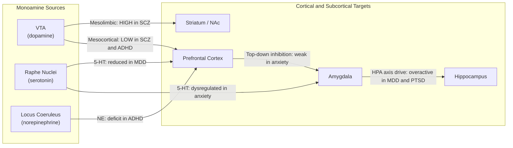

# Psychiatric Disorders and Neurobiology

> [!abstract] TL;DR
> Psychiatric disorders are disorders of the brain's circuits and neurochemistry — every major syndrome is associated with identifiable disturbances in neurotransmitter systems, neural circuits, and brain structure that are increasingly measurable with imaging, genetics, and post-mortem neuropathology. Current diagnostic classification (DSM-5) remains symptom-based and syndromal, but the National Institute of Mental Health's Research Domain Criteria (RDoC) framework is driving a parallel neuroscience-based taxonomy organized around circuits, behaviors, and biomarkers rather than symptom checklists. The major disorders — schizophrenia, major depressive disorder, bipolar disorder, anxiety disorders, and ADHD — all converge on dysregulation of three core systems: monoamines (dopamine, serotonin, norepinephrine), glutamate/GABA balance, and the prefrontal-limbic circuit axis.

---

## Intuition — analogy FIRST

Imagine the brain as a large software platform running many parallel programs simultaneously. **Psychiatric disorders are best understood as circuit-level software bugs, not hardware failures.** The neurons themselves (the hardware) are largely intact; what goes wrong are the programs — the patterned firing of specific circuits and the balance of neurotransmitters that calibrate those circuits.

**Schizophrenia is a signal-to-noise ratio problem.** The mesolimbic dopamine pathway is turned up too loud, flooding the striatum with excessive "salience" signals so that irrelevant inputs feel profound and meaningful — the neurobiological seedbed of delusions and hallucinations. Simultaneously, the mesocortical pathway to the prefrontal cortex is turned down too low, impairing the executive editor that would normally filter that noise, generating the cognitive and negative symptoms.

**Major depression is a reward circuit stuck in low gain.** The prefrontal-striatal pathway that converts anticipation into motivation is dampened; the hippocampus is literally shrinking from glucocorticoid toxicity; and the subgenual anterior cingulate cortex broadcasts a continuous signal of negative affect. **Anxiety disorders represent the opposite failure:** the amygdala's alarm is hair-trigger sensitive, firing threat responses to stimuli that are not dangerous, while the prefrontal cortex is too weak to silence the alarm once it sounds.

---

## How It Works

### Schizophrenia: The Dopamine–NMDA Dual Hypothesis

Two complementary models together explain the full symptom syndrome:

**1. Dopamine hypothesis (revised):** Mesolimbic dopamine projections (VTA → striatum/nucleus accumbens) are hyperactive, causing excessive attribution of salience to neutral stimuli — the neurobiological basis of positive symptoms. Simultaneously, mesocortical DA projections (VTA → PFC) are hypoactive, impairing working memory and generating negative symptoms (alogia, avolition, flat affect) and cognitive symptoms. All antipsychotics that reduce positive symptoms work by blocking D2 receptors; their clinical potency correlates directly with D2 binding affinity (Seeman and Lee, 1975).

**2. NMDA receptor hypofunction model:** PCP and ketamine — NMDA receptor antagonists — produce both positive AND negative symptoms of schizophrenia in healthy humans, something dopaminergic drugs alone cannot replicate. NMDA hypofunction on fast-spiking GABAergic parvalbumin (PV) interneurons in the PFC disinhibits pyramidal cells, generating excessive glutamate output, disrupted gamma-band oscillations (~40 Hz required for working memory), and prefrontal circuit breakdown. This unifies both hypotheses: NMDA interneuron dysfunction → mesocortical DA deficit → cognitive symptoms; simultaneously → hippocampal hyperactivity → elevated tonic striatal DA → positive symptoms.

### Major Depressive Disorder: Beyond Monoamines

**1. Monoamine depletion hypothesis:** Reduced serotonin and norepinephrine activity in forebrain circuits — evidenced by the efficacy of SSRIs (block SERT) and SNRIs (block SERT + NET). However, since SSRIs elevate synaptic 5-HT within hours yet antidepressant effects take 2–6 weeks, downstream circuit-level adaptations rather than acute NT concentration are the operative mechanism.

**2. Neuroplasticity / BDNF hypothesis:** MDD is associated with reduced BDNF in hippocampus and PFC, 10–20% hippocampal volume loss in severe MDD, and suppression of adult neurogenesis in the dentate gyrus. All effective antidepressants — SSRIs, ketamine, TMS, ECT — upregulate BDNF-TrkB signaling. The delay to clinical response corresponds to the time required for synaptogenesis and circuit remodeling, not receptor occupancy.

**3. HPA axis dysregulation:** Chronic stress drives CRH → ACTH → cortisol hypersecretion. Excess glucocorticoids suppress hippocampal neurogenesis, downregulate BDNF, and cause CA3 dendritic atrophy via glucocorticoid receptor (GR) activation. The dexamethasone suppression test (non-suppression in ~50% of melancholic depression) quantifies HPA dysregulation clinically.

### Anxiety Disorders: PFC–Amygdala Imbalance

The amygdala evaluates incoming stimuli for threat via a fast thalamo-amygdala route (milliseconds, coarse resolution) and a slow thalamo-cortical-amygdala route (hundreds of ms, detailed). In anxiety disorders the amygdala is hyperreactive — fear conditioning too easily acquired, extinction too slowly consolidated. The ventromedial PFC normally suppresses amygdala reactivity via indirect GABAergic inhibitory pathways. In anxiety, vmPFC top-down inhibition is weak and GABA tone in the amygdala itself is reduced, tipping the circuit toward chronic threat-sensitization.

### ADHD and Bipolar Disorder

**ADHD** is primarily a disorder of the mesocortical dopamine and norepinephrine systems. Reduced catecholamine signaling in the PFC degrades signal-to-noise for sustained attention, impulse control, and working memory. Stimulants (methylphenidate blocks DAT/NET; amphetamine reverses them) normalize PFC DA and NE, restoring prefrontal inhibitory control over striatal impulsivity.

**Bipolar disorder** involves pathological state-switching between depressive and manic episodes. Mania is associated with elevated striatal DA and glutamate-driven cortical hyperexcitability. Lithium stabilizes mood through multiple mechanisms: inhibiting GSK-3β (a kinase overactive in mania), depleting inositol for IP3 second-messenger cascades, and enhancing BDNF expression. The efficacy of anticonvulsants (valproate, lamotrigine) as mood stabilizers supports excessive neuronal excitability as a core feature.

### Circuit Abnormality Comparison



| Disorder | Primary Circuit Abnormality | Key Neurochemical Change |
|----------|-----------------------------|-----------------------------|
| Schizophrenia | Mesolimbic DA↑, mesocortical DA↓, NMDA hypofunction on PV interneurons | DA imbalance + glutamate deficit |
| MDD | PFC/hippocampal atrophy, sgACC hyperactivity, reward circuit blunted | 5-HT↓, NE↓, BDNF↓, cortisol↑ |
| Anxiety | Amygdala hyperreactivity, PFC-amygdala inhibition failure | GABA deficit, 5-HT dysregulation |
| ADHD | Mesocortical DA and NE deficit | DA↓ and NE↓ in PFC |
| Bipolar | Striatal DA↑ (mania), reward/circadian circuit instability | DA, glutamate, GSK-3β dysregulation |

---

## Key Concepts / Details

### Secondary Level

**Major Diagnostic Categories and Core Symptoms**

| Disorder | Core Symptoms | First-Line Treatment |
|----------|---------------|---------------------|
| **Schizophrenia** | Hallucinations (positive), delusions (positive), flat affect (negative), alogia, avolition, cognitive impairment | Atypical antipsychotics (SGAs) |
| **Major Depressive Disorder** | Depressed mood, anhedonia, sleep/appetite changes, fatigue, poor concentration, suicidal ideation | SSRIs / SNRIs + psychotherapy |
| **Generalized Anxiety Disorder** | Excessive worry, restlessness, muscle tension, sleep disturbance | SSRIs + CBT; benzodiazepines short-term |
| **ADHD** | Inattention, hyperactivity, impulsivity; onset before age 12 | Methylphenidate, amphetamine salts |
| **Bipolar I Disorder** | Manic episodes (elevated mood, grandiosity, decreased sleep need, impulsivity) alternating with depressive episodes | Lithium, valproate, atypical antipsychotics |
| **PTSD** | Flashbacks, hyperarousal, avoidance, negative cognitions; follows traumatic event | SSRIs + trauma-focused CBT / EMDR |

**Positive vs Negative Symptoms of Schizophrenia**

The distinction matters because different circuits and drug mechanisms target each:

- *Positive symptoms* (excess of normal function): hallucinations, delusions, disorganized thought, agitation — primarily driven by mesolimbic DA hyperactivity; respond to D2 antagonism.
- *Negative symptoms* (loss of normal function): flat affect, alogia, avolition, anhedonia, social withdrawal — primarily driven by mesocortical DA deficit and NMDA hypofunction; poorly addressed by D2 blockade alone and often worsened by high D2-affinity drugs.
- *Cognitive symptoms*: impaired working memory, attention, executive function — tied to NMDA/PFC circuit dysfunction; not adequately treated by any current agent.

**The Chemical Imbalance Narrative — and Why It Is Incomplete**

The popular "low serotonin causes depression" framing captures a kernel of truth but drastically oversimplifies. SSRIs raise synaptic 5-HT within hours, yet antidepressant effects take 2–6 weeks — a delay incompatible with a simple chemical rebalancing story. The real therapeutic mechanisms are downstream circuit-level adaptations: autoreceptor desensitization, neurogenesis, dendritic spine remodeling, and normalization of HPA axis activity. The chemical imbalance narrative has been critiqued for overselling pharmacotherapy and dismissing psychotherapy, and for implying a purely biomedical model of what are fundamentally biopsychosocial conditions.

---

### Undergraduate Level

**Dopamine Hypothesis of Schizophrenia: Evidence and Limitations**

*Supporting evidence:*
- All antipsychotics that reduce positive symptoms block D2 receptors; clinical potency correlates directly with D2 receptor binding affinity across 20 different drugs (Seeman and Lee, 1975).
- Amphetamine and cocaine (which flood dopamine into the synapse) can trigger psychosis-like states with positive symptoms.
- PET imaging shows elevated striatal D2/D3 receptor binding and increased amphetamine-induced DA release in the striatum of patients with schizophrenia.

*Limitations:*
- Pure D2 blockade addresses positive symptoms but worsens or fails to address negative and cognitive symptoms.
- NMDA antagonists (ketamine, PCP) produce the full syndrome including negative symptoms, which dopaminergic drugs alone cannot replicate.
- Clozapine — the most effective antipsychotic for treatment-resistant schizophrenia — has relatively low D2 affinity compared to first-generation agents, suggesting that D2 alone is insufficient.

*Grace's tonic-phasic dopamine model (refinement):* The hippocampus normally gates VTA phasic DA release by regulating tonic firing states. NMDA interneuron dysfunction in the hippocampus generates hyperactivity that drives elevated tonic DA in the striatum, reducing the signal-to-noise ratio for meaningful phasic DA signaling and generating aberrant salience.

**NMDA Receptor Hypofunction: The Parvalbumin Interneuron Hypothesis**

Parvalbumin (PV)-positive GABAergic interneurons in the PFC are exquisitely sensitive to NMDA hypofunction because they require tonic NMDA activation to maintain their high firing rates. Their silencing disinhibits pyramidal neurons, producing paradoxically excessive excitatory output and disruption of the ~40 Hz gamma oscillations required for working memory maintenance. Post-mortem brains of patients with schizophrenia consistently show reduced parvalbumin and GAD67 (GABA synthesis enzyme) expression in PFC interneurons. This interneuron-specific circuit model integrates both hypotheses: NMDA hypofunction → PV interneuron dropout → mesocortical DA deficit (cognitive symptoms) + hippocampal hyperactivity → mesolimbic DA excess (positive symptoms).

**HPA Axis Dysregulation in Depression: Molecular Cascade**

1. Psychosocial stress → hypothalamic PVN releases CRH into hypophyseal portal circulation.
2. CRH binds CRH-R1 on pituitary corticotrophs → ACTH release.
3. ACTH travels to adrenal cortex → cortisol synthesis and secretion.
4. Normally cortisol exerts negative feedback on hippocampus (high GR density), hypothalamus, and pituitary. In MDD, this GR-mediated feedback is blunted (dexamethasone non-suppression).
5. Chronic cortisol excess suppresses hippocampal BDNF, inhibits neurogenesis in the dentate gyrus, and causes retraction of CA3 dendritic arbors via GR-mediated gene expression changes.
6. Result: progressive hippocampal atrophy, worsening contextual memory, reduced pattern separation, and deepening depressive episodes.

Antidepressants that normalize HPA function also promote hippocampal neurogenesis — the correlation between neurogenesis restoration and behavioral recovery is among the strongest mechanistic arguments for the BDNF hypothesis.

**GABA/Glutamate Imbalance in Anxiety**

The basolateral amygdala (BLA) is tonically regulated by GABAergic interneurons. In anxiety disorders, reduced GAD65-mediated GABA synthesis lowers inhibitory tone in the amygdala and hippocampus. Simultaneously, glutamatergic drive from the sensory thalamus and insular cortex is elevated, tipping the BLA toward threat-sensitization. Benzodiazepines (positive allosteric modulators of GABA-A receptors) acutely restore GABAergic tone throughout the brain including the amygdala — explaining rapid anxiolysis — but their chronic use causes GABAergic downregulation and tolerance, worsening the underlying imbalance.

**Genetics of Psychiatric Disorders: GWAS Architecture**

All major psychiatric disorders are highly polygenic, with no single gene of large effect:

| Disorder | Heritability | GWAS Loci (significant) | Key Genetic Findings |
|----------|-------------|--------------------------|---------------------|
| Schizophrenia | ~80% | >100 (PGC 2014) | MHC/HLA region (immune); CACNA1C (voltage-gated Ca²⁺ channel); copy number variants (22q11.2 deletion) |
| MDD | ~37% | >100 (Howard et al., 2019) | Enriched in neuronal and synaptic genes; CACNA1C shared with BD and SCZ |
| Bipolar Disorder | ~70% | >40 | 70% genetic correlation with SCZ; ANK3, CACNA1C top loci |
| ADHD | ~74% | >12 | Dopamine and norepinephrine pathway genes enriched |

The shared genetic architecture across disorders (especially SCZ–BD overlap) supports the biological validity of a continuous psychosis spectrum rather than discrete categorical entities.

---

### Graduate Level

**RDoC: Research Domain Criteria Framework**

NIMH's RDoC (Insel et al., 2010) reframes psychiatric research around five domains of neurobehavioral function — (1) Negative Valence Systems, (2) Positive Valence Systems, (3) Cognitive Systems, (4) Social Processes, (5) Arousal/Regulatory Systems — each analyzed across units of analysis ranging from genes and molecules through cells, circuits, physiology, behavior, and self-report. RDoC explicitly rejects the DSM symptom-based categorical approach and treats psychiatric conditions as quantitative deviations in neurobiological dimensions. The framework has generated transdiagnostic research programs such as the Hierarchical Taxonomy of Psychopathology (HiTOP) and has guided NIMH grant strategy since 2013. Its primary limitation is that it is a research infrastructure framework, not a clinical taxonomy — it has not replaced DSM-5 in clinical practice, because dimensional neurobiological profiles have not yet been validated as decision supports for treatment selection.

**Anti-NMDAR Encephalitis: Proof of Concept for the Glutamate Hypothesis**

Anti-NMDA receptor encephalitis (Dalmau et al., 2007) is an autoimmune condition in which patients develop IgG antibodies against the GluN1 subunit of NMDA receptors. The clinical syndrome — psychosis, catatonia, stereotypies, autonomic instability, dyskinesias — is indistinguishable from acute severe schizophrenia during its early phases. Crucially, the antibodies preferentially target fast-spiking PV interneurons (which have higher surface NMDA-R density), recapitulating the interneuron hypofunction model. Treatment by removing antibodies (corticosteroids, plasma exchange, rituximab) resolves the psychotic syndrome in most patients, providing the strongest human evidence that NMDA-R dysfunction directly causes psychosis and suggesting that a subset of apparent "schizophrenia" diagnoses may have an autoimmune or inflammatory etiology amenable to immunotherapy.

**Ketamine and Esketamine as Rapid Antidepressants: Mechanistic Model**

Subanesthetic ketamine (0.5 mg/kg IV over 40 min) produces antidepressant effects within 2–4 hours lasting up to one week in treatment-resistant depression — a transformative finding for a field where all prior antidepressants required weeks. The mechanism is not simply blockade of NMDA receptors on principal neurons. The leading integrated model:

1. At rest, ketamine blocks tonically active NMDA receptors on inhibitory interneurons (disinhibition of pyramidal cells).
2. This triggers a burst of glutamate that activates AMPA receptors on pyramidal cells (AMPA potentiation hypothesis — confirmed by the finding that AMPA receptor antagonists block ketamine's antidepressant effect in rodents).
3. AMPA activation stimulates BDNF release from presynaptic terminals and postsynaptic TrkB activation.
4. TrkB → PI3K → mTOR pathway drives rapid dendritic spine synthesis (minutes to hours) in PFC and hippocampus.
5. Synaptogenesis restores prefrontal-limbic synaptic connectivity lost to chronic stress.

Esketamine (S-ketamine; Spravato nasal spray) received FDA approval in 2019 for treatment-resistant depression and in 2020 for MDD with acute suicidal ideation, making it the first truly new antidepressant mechanism approved in over 30 years.

**Psychedelics and Neuroplasticity: Psychoplastogens**

Psilocybin, DMT, and LSD produce psychedelic effects by activating postsynaptic 5-HT₂A receptors on cortical layer V pyramidal neurons, modulating thalamo-cortical gating and profoundly suppressing the default mode network (DMN). However, sub-psychedelic doses promote structural plasticity — new dendritic spines, axon outgrowth, synaptogenesis — via a TrkB receptor-signaling mechanism that is largely independent of 5-HT₂A activation, likely through direct TrkB agonism at transmembrane allosteric sites. These "psychoplastogen" properties may underlie the sustained antidepressant effects seen in clinical trials (COMPASS Pathways Phase 2b, NEJM 2021; Carhart-Harris et al., NEJM 2021) and the notable finding that a single high-dose psilocybin session produces antidepressant effects lasting months in some patients.

MDMA acts through a distinct mechanism — mass release of serotonin, dopamine, and oxytocin — reducing amygdala threat-reactivity and increasing trust, which may enable reconsolidation of traumatic memories during therapeutic sessions. Phase 3 PTSD trials (MAPS) showed substantial response rates, though FDA advisory panels raised concerns about trial integrity and expectancy effects as of 2024.

**Default Mode Network Hyperactivation in Depression**

The DMN — medial PFC, posterior cingulate cortex (PCC), precuneus, angular gyrus — is active during rest, self-referential thought, and rumination, and normally deactivates during external task engagement. In MDD, the DMN is hyperactive and fails to appropriately deactivate, reflecting excessive rumination and negative self-referential processing. The subgenual anterior cingulate cortex (sgACC; Brodmann area 25) is a critical hub: it is hypermetabolic in depression (Mayberg 1997), predicts antidepressant response when normalized, and is the primary target for deep brain stimulation in TRD. Effective treatments for depression — SSRIs, CBT, ketamine, psilocybin — all produce reductions in sgACC activity and DMN connectivity, converging on the same circuit endpoint through diverse mechanisms.

**Large-Scale Network Dysconnectivity in Schizophrenia**

Friston's dysconnectivity hypothesis frames schizophrenia as a disorder of aberrant NMDA-dependent synaptic learning (synaptic gain control), not simply of dopamine or glutamate levels. The brain as a hierarchical Bayesian prediction machine sends predictions downward and propagates prediction errors upward; NMDA hypofunction degrades this update mechanism so the brain cannot correctly revise its internal models, generating persistent false predictions (delusions as incorrect beliefs, hallucinations as uncorrected perceptual predictions). Resting-state fMRI confirms reduced functional connectivity between DLPFC and thalamus, and between hippocampus and DLPFC, as hallmarks of the disorder. This computational model integrates synaptic, circuit, and cognitive levels into a unified explanatory framework that transcends any single neurotransmitter hypothesis.

**Epigenetics in Psychiatric Risk**

Gene × Environment interactions in psychiatry are mediated in part by epigenetic mechanisms. Early life adversity (ELA) hypomethylates the glucocorticoid receptor gene (NR3C1) promoter in hippocampus, reducing GR expression and sensitizing the HPA axis — a molecular scar of childhood trauma that elevates lifetime MDD and PTSD risk. Post-mortem brains of suicide completers with childhood abuse history show reduced NR3C1 methylation compared to those without such history, even controlling for the suicide endpoint (McGowan et al., 2009). Antipsychotics alter DNA methylation at RELN (reelin) and GAD67 promoters — among the most consistently hypermethylated genes in schizophrenia post-mortem brains — suggesting that pharmacological epigenetic remodeling may contribute to therapeutic action.

**Microbiome–Gut–Brain Axis**

The enteric nervous system communicates bidirectionally with the CNS via the vagus nerve, HPA axis, and gut microbiota-derived metabolites. Altered gut microbiome composition is observed in MDD, anxiety, schizophrenia, and autism. Key mechanistic pathways:
- Gut enterochromaffin cells produce ~90% of the body's serotonin, which modulates vagal afferents and gut motility; gut-derived 5-HT does not cross the blood-brain barrier but influences the brain indirectly via afferent vagal signaling.
- The kynurenine pathway: systemic inflammatory cytokines divert tryptophan from 5-HT synthesis toward kynurenine metabolites, including quinolinic acid (a toxic NMDA receptor agonist). This connects gut inflammation, NMDA hypofunction, and depression in a single mechanistic chain.
- Fecal microbiota transplant (FMT) in germ-free rodents can transfer depressive/anxious behavioral phenotypes from MDD-patient microbiota donors — among the strongest preclinical evidence for microbiome causality in mood disorders.

---

## Python Demo

```python
import numpy as np
import matplotlib.pyplot as plt


def d2_occupancy(concentration_nM, ki_nM):
    """
    D2 receptor occupancy using the Langmuir (law of mass action) isotherm.
    Occupancy (%) = 100 * [drug] / ([drug] + Ki)
    Ki values from Seeman et al. classic radioligand competition binding.
    Note: in vitro Ki values underestimate in vivo free concentrations due to
    plasma protein binding, but the relative curves are preserved.
    """
    return 100.0 * concentration_nM / (concentration_nM + ki_nM)


# D2 receptor Ki values (radioligand binding, in vitro)
KI_HALOPERIDOL = 1.5    # nM — first-generation antipsychotic (FGA), high D2 affinity
KI_CLOZAPINE   = 250.0  # nM — second-generation (SGA), low D2 affinity, lower EPS risk

conc_nM = np.logspace(-2, 4, 600)  # 0.01 to 10,000 nM

occ_halo  = d2_occupancy(conc_nM, KI_HALOPERIDOL)
occ_cloza = d2_occupancy(conc_nM, KI_CLOZAPINE)

# Approximate clinical plasma concentration ranges (free fractions dominate occupancy)
# Haloperidol: effective range ~5-25 nM (1-7 ng/mL, MW=375 g/mol)
# Clozapine: effective range ~300-1000 nM (100-330 ng/mL free; highly protein bound)
CLINICAL_RANGES = [
    (5.0,   KI_HALOPERIDOL, "#E53935", "Halo low (5 nM)",    +4),
    (25.0,  KI_HALOPERIDOL, "#E53935", "Halo high (25 nM)",  -9),
    (300.0, KI_CLOZAPINE,   "#1E88E5", "Cloz low (300 nM)",  +4),
    (1000.0,KI_CLOZAPINE,   "#1E88E5", "Cloz high (1000 nM)", -9),
]

fig, ax = plt.subplots(figsize=(10, 6))

ax.semilogx(conc_nM, occ_halo,  color="#E53935", lw=2.5,
            label=f"Haloperidol (Ki = {KI_HALOPERIDOL} nM) — FGA, steep curve")
ax.semilogx(conc_nM, occ_cloza, color="#1E88E5", lw=2.5,
            label=f"Clozapine (Ki = {KI_CLOZAPINE} nM) — SGA, shallow curve")

# Therapeutic window shading
ax.axhspan(60, 80, alpha=0.12, color="limegreen", label="Therapeutic window (60-80%)")
ax.axhline(80, color="red",      ls="--", lw=1.4, alpha=0.9, label=">80%: EPS risk")
ax.axhline(60, color="seagreen", ls="--", lw=1.4, alpha=0.9, label="<60%: sub-therapeutic")

for c_nM, ki, color, label, dy in CLINICAL_RANGES:
    occ = d2_occupancy(c_nM, ki)
    ax.axvline(c_nM, color=color, ls=":", lw=1.0, alpha=0.55)
    ax.plot(c_nM, occ, "o", color=color, ms=8, zorder=5)
    ax.annotate(
        f"{label}\n{occ:.0f}%",
        xy=(c_nM, occ),
        xytext=(c_nM * 1.4, occ + dy),
        fontsize=7.5,
        color=color,
        arrowprops=dict(arrowstyle="->", color=color, lw=0.8),
    )

ax.set(
    xlabel="Plasma drug concentration (nM, log scale)",
    ylabel="D2 receptor occupancy (%)",
    title="D2 Receptor Occupancy: Haloperidol (FGA) vs Clozapine (SGA)\nTherapeutic Window = 60-80%; >80% = Extrapyramidal Symptom Risk",
    xlim=(0.01, 10000),
    ylim=(0, 105),
)
ax.legend(loc="lower right", fontsize=8.5, framealpha=0.92)
ax.grid(True, alpha=0.18, which="both")

plt.tight_layout()
plt.savefig("d2_occupancy_antipsychotics.png", dpi=150)
plt.show()

print("D2 occupancy at clinical concentration ranges:")
for c_nM, ki, _, label, _ in CLINICAL_RANGES:
    print(f"  {label:25s}: {d2_occupancy(c_nM, ki):.1f}%")
```

The simulation demonstrates the pharmacological insight that motivates SGA design: haloperidol's steep sigmoid curve (low Ki) means that even at the low end of its clinical range (~5 nM) D2 occupancy already exceeds 75%, and small dose increases rapidly overshoot the 80% EPS threshold. Clozapine's shallow sigmoid curve (high Ki = 250 nM) means that across its entire clinical concentration range occupancy stays near the 60–80% therapeutic window without easily crossing into EPS territory. Clozapine's superior efficacy in treatment-resistant schizophrenia arises not from higher D2 blockade but from its additional receptor actions (5-HT₂A, D4, M1–M4 muscarinic, H1 histamine antagonism) that address negative and cognitive symptom dimensions.

---

## Real-World Applications

**Antipsychotics: First vs Second Generation**

| Drug Class | Examples | D2 Affinity | Key Advantage | Key Risk |
|------------|----------|-------------|---------------|----------|
| FGA (typical) | Haloperidol, chlorpromazine, fluphenazine | Very high | Low cost; highly effective for positive symptoms; long-acting injectable forms | EPS (acute dystonia, parkinsonism, akathisia); tardive dyskinesia with chronic use; hyperprolactinemia |
| SGA (atypical) | Clozapine, olanzapine, risperidone, quetiapine, aripiprazole, lurasidone | Low-moderate (variable) | Lower EPS; modest improvement in negative/cognitive symptoms; clozapine uniquely effective in TRS | Metabolic syndrome, weight gain, type 2 diabetes risk; agranulocytosis (clozapine, requires blood monitoring) |

**Antidepressants by Mechanism**

| Class | Mechanism | Notes |
|-------|-----------|-------|
| SSRI | Block SERT | First-line; fluoxetine, sertraline, escitalopram; 2–6 week onset |
| SNRI | Block SERT + NET | Venlafaxine, duloxetine; also first-line neuropathic pain |
| TCA | Block SERT/NET + multiple receptors | Amitriptyline; highly effective but cardiotoxic in overdose; third-line |
| MAOI | Inhibit MAO-A/B | Phenelzine; effective for atypical depression; severe dietary interactions with tyramine-containing foods |
| Ketamine/Esketamine | NMDA antagonism → AMPA potentiation → mTOR → synaptogenesis | Esketamine (Spravato) FDA-approved 2019 for TRD and acute suicidality; rapid onset within hours |
| Bupropion | DAT/NET inhibition; no SERT activity | Useful when sexual side effects or weight gain are concerns; also smoking cessation |

**Neurostimulation and Interventional Psychiatry**

- **TMS (Transcranial Magnetic Stimulation):** FDA-cleared for MDD (2008), OCD (2018), and anxious depression with comorbid MDD (2022). rTMS over the left DLPFC increases cortical excitability and normalizes hypoactivation of frontolimbic circuits. Response rate ~50–60%; remission ~30%. No systemic side effects; tolerated by patients who cannot use medications.
- **ECT (Electroconvulsive Therapy):** Most effective acute antidepressant for severe, psychotic, or catatonic depression — 70–90% response rates. Mechanism involves broad neurotrophic, neurogenesis-promoting, and anti-inflammatory actions. Right unilateral electrode placement reduces cognitive side effects vs. bilateral; remains underused due to stigma.
- **Deep Brain Stimulation (DBS):** FDA humanitarian device exemption for refractory OCD (2009; bilateral VC/VS or ALIC target). Investigational for TRD targeting sgACC (Brodmann area 25, Mayberg 2005). High-frequency stimulation (130 Hz) suppresses hypermetabolic activity in the sgACC node, restoring frontolimbic circuit balance.
- **Psilocybin-assisted therapy:** Phase 2/3 trials show 40–50% response in MDD (COMPASS Pathways 2022; Carhart-Harris NEJM 2021). Not yet FDA-approved; classified Schedule I in the US. Mechanism: 5-HT₂A activation + structural neuroplasticity + psychotherapeutic reconsolidation under guided support.

---

## Common Pitfalls

- **Chemical imbalance is an oversimplification** — "Low serotonin causes depression" is clinically harmful: it dismisses non-pharmacological treatments, implies a permanent deficit, and fails to explain the 2–6 week antidepressant lag when serotonin reuptake is blocked immediately. Monoamines modulate circuits; circuit-level plasticity and adaptation, not acute NT concentration, drive therapeutic recovery.
- **DSM diagnoses are not natural biological kinds** — Schizophrenia, MDD, and bipolar disorder are syndromal diagnoses defined by symptom timelines, not biomarkers. They share 70% genetic correlation (SCZ–BD), overlapping pharmacological responses, and no pathognomonic biomarker. Treating a DSM category as a fixed natural entity misses substantial neurobiological heterogeneity within any given label.
- **Antipsychotics block D2 but schizophrenia is not simply "too much dopamine"** — The mesolimbic hyperactivity model explains positive symptoms only. Negative and cognitive symptoms are tied to NMDA hypofunction and mesocortical DA deficiency. High D2-affinity drugs can worsen cognitive symptoms by further reducing mesocortical DA tone — the very pathway that needs upregulation.
- **The placebo effect in psychiatric RCTs is large** — Placebo response rates in antidepressant trials are 30–45%; the drug-placebo standardized mean difference is ~0.3 for moderate depression. This does not negate efficacy (response is large for severe depression) but requires awareness of publication bias, expectancy effects, and the limitations of symptom-rating scales as outcome measures.
- **Polygenic risk does not equal deterministic fate** — Polygenic risk scores currently explain 7–18% of variance in psychiatric disorder liability. High genetic risk requires environmental co-factors (childhood adversity, prenatal infection, cannabis exposure) to manifest as disorder. Gene × environment interaction is the rule, not the exception — purely genetic determinism is not supported by the data.

---

## Related Concepts

- [[Synaptic_Transmission_and_Neurotransmitters]] — the molecular machinery (DA, 5-HT, NE, glutamate, GABA reuptake and receptor systems) whose dysregulation underlies all major psychiatric syndromes; receptor pharmacology of D2, GABA-A, NMDA, and monoamine transporters are the direct drug targets described here
- [[Limbic_System_and_Diencephalon]] — the anatomical substrate: amygdala hyperreactivity (anxiety/PTSD), hippocampal atrophy (MDD), HPA axis dysregulation (depression/PTSD), and thalamo-limbic connectivity deficits (SCZ) are all grounded in the structures detailed there
- [[Ion_Channels_and_Receptor_Pharmacology]] — biophysical basis of NMDA-R hypofunction, GABA-A potentiation by benzodiazepines, D2 receptor pharmacology, and the molecular targets of every drug class introduced here

Cross-vault links:
- [[Psychological_Disorders_Overview]] (Psychology) — the clinical, diagnostic, and DSM-based perspective on the same conditions; complements the neurobiological account here with behavioral, cognitive, and epidemiological frameworks
- [[Stress_and_Coping]] (Psychology) — the psychosocial stress response maps directly onto the HPA axis dysregulation in MDD and PTSD described here; psychological and neurobiological accounts of chronic stress are inseparable
- [[Biological_Basis_of_Behavior]] (Psychology) — connects monoamine systems and brain structure to behavioral phenotypes and psychological theories; the bridge between the molecular detail here and behavioral psychology

---

## Review Questions

**Secondary**
1. A psychiatrist explains to a patient that depression is caused by "a chemical imbalance — specifically, low serotonin." Based on the timeline of antidepressant action and the BDNF/neuroplasticity hypothesis, what is incomplete about this explanation, and what would be a more accurate one-sentence alternative?
2. Compare the positive and negative symptom clusters of schizophrenia. Which dopamine pathway is most implicated in each cluster, and what does this imply about why high-D2-affinity antipsychotics treat one symptom cluster but not the other?
3. Why might the same class of drug (SSRIs) be used to treat both major depressive disorder and generalized anxiety disorder, given that these are classified as entirely separate diagnoses with different core symptoms?

**Undergraduate**
1. A researcher gives healthy volunteers a subanesthetic dose of ketamine and observes both perceptual distortions (positive-like symptoms) and emotional blunting (negative-like symptoms). Haloperidol pretreatment blocks the positive but not the negative symptoms. What does this pharmacological dissociation tell us about the sufficiency of D2 blockade for the full schizophrenia symptom profile?
2. Using the parvalbumin interneuron model, explain the paradox: blocking NMDA receptors (an excitatory receptor) on inhibitory interneurons leads to increased excitatory output from the PFC overall. Trace the circuit logic step by step and identify what feature of the circuit creates this sign reversal.
3. A patient with severe depression shows 15% hippocampal volume reduction on MRI and non-suppression on the dexamethasone suppression test. Trace the causal chain from chronic psychosocial stress to hippocampal atrophy, naming each molecular intermediate. Predict how this chain would be expected to change after 6 months of successful SSRI treatment.

**Graduate**
1. Anti-NMDAR encephalitis produces a psychotic syndrome clinically indistinguishable from acute schizophrenia, yet resolves with immunotherapy that removes GluN1 antibodies. Construct the argument that this constitutes proof-of-concept for the NMDA hypofunction hypothesis of psychosis, identify one critical caveat, and design a study to determine what proportion of treatment-resistant schizophrenia cases have an autoimmune component.
2. Ketamine's antidepressant effect in rodents is blocked by AMPA receptor antagonists but not by NMDA blockade per se, and by rapamycin (mTOR inhibitor). Integrate these pharmacological constraints into a mechanistic model of the ketamine cascade, and predict the effect of conditional TrkB knockout specifically in PFC pyramidal neurons on ketamine's behavioral antidepressant response.
3. Given that antidepressant RCTs show a drug-placebo standardized mean difference of ~0.3 for moderate depression and that placebo response rates are 30–45%, evaluate the following three implications: (a) which patient severity subgroup benefits most from pharmacotherapy versus psychotherapy alone; (b) what trial design features would best reduce placebo inflation in future Phase 3 antidepressant trials; (c) how should selective publication of positive trials (Kirsch et al., 2008) affect interpretation of the current efficacy evidence base?

---

## Sources

- [Kandel, E.R., Koester, J.D., Mack, S.H. & Siegelbaum, S.A. (eds.) — *Principles of Neural Science*, 6th ed. (2021), Chapters 63–68](https://www.mheducation.com/highered/product/principles-neural-science-sixth-edition-kandel-koester/M9781259642234.html)
- [Stahl, S.M. — *Stahl's Essential Psychopharmacology: Neuroscientific Basis and Practical Applications*, 5th ed. (2021)](https://www.cambridge.org/core/books/stahls-essential-psychopharmacology/9B2E4C6ECD3B3AABFB9EC97B3714CD82)
- [Insel, T.R. et al. — "Research Domain Criteria (RDoC): Toward a New Classification Framework for Research on Mental Disorders," *JAMA Psychiatry* 67(7): 748–751 (2010)](https://jamanetwork.com/journals/jamapsychiatry/fullarticle/210484)
- [Dalmau, J. et al. — "Anti-NMDA-receptor encephalitis: case series and analysis of the effects of antibodies," *Lancet Neurology* 7(12): 1091–1098 (2008)](https://www.thelancet.com/journals/laneur/article/PIIS1474-4422(08)70224-2/fulltext)
- [Carhart-Harris, R. et al. — "Trial of Psilocybin versus Escitalopram for Depression," *NEJM* 384: 1402–1411 (2021)](https://www.nejm.org/doi/full/10.1056/NEJMoa2032994)
- [Seeman, P. & Lee, T. — "Antipsychotic Drugs: Direct Correlation Between Clinical Potency and Presynaptic Action on Dopamine Neurons," *Science* 188: 1217–1219 (1975)](https://www.science.org/doi/10.1126/science.1145190)
- [McGowan, P.O. et al. — "Epigenetic regulation of the glucocorticoid receptor in human brain associates with childhood abuse," *Nature Neuroscience* 12: 342–348 (2009)](https://www.nature.com/articles/nn.2270)

---

#Neuroscience #ClinicalNeuroscience #PsychiatricDisorders #Schizophrenia #Depression
