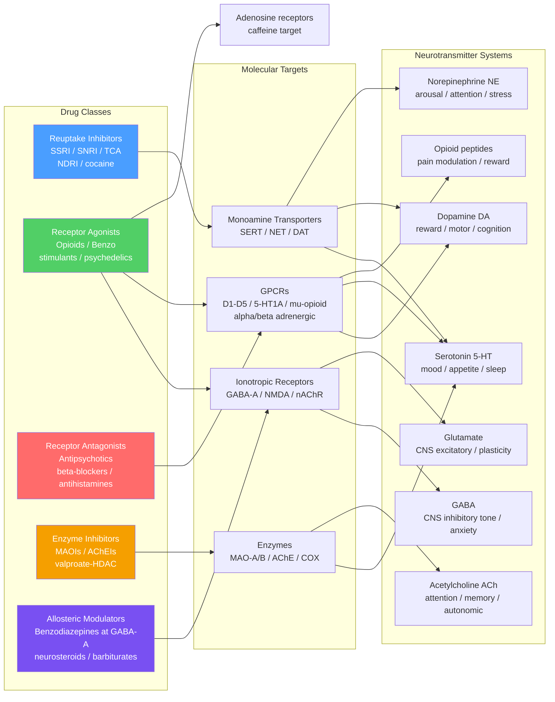

# Psychopharmacology and Drug Mechanisms

> [!abstract] TL;DR
> Psychopharmacology is the scientific discipline that studies how drugs alter brain chemistry, neural circuit function, and observable behavior — it is the molecular bridge between a pill and a mood, a thought, or a movement. Every psychoactive drug in clinical use works by modulating a specific neurotransmitter system: acting as an agonist, antagonist, allosteric modulator, reuptake inhibitor, or enzyme inhibitor at the molecular targets that natural neurotransmitters evolved to use. Understanding these mechanisms not only rationalizes why drugs work but predicts their side effects, their interactions with other drugs, the time lag before clinical benefit, and why the same molecular target can be exploited for completely different therapeutic goals.

---

## Intuition — analogy FIRST

Imagine neurotransmitter signaling as a city-wide key-and-lock postal system. Every lock (receptor) on every building (neuron) is designed for a specific key shape (neurotransmitter). Letters are delivered, locks are opened, the building responds. Psychoactive drugs are imposters in this system, and they work in three fundamentally different ways:

- **Agonists are master keys** — they fit the lock and open it, mimicking or exceeding the natural key's effect. Opioids are master keys for the brain's own endorphin locks; they open the door so effectively that the natural keys become almost redundant.
- **Antagonists are broken keys stuffed in the lock** — they occupy the keyhole without opening the door, physically preventing the real key from entering. Antipsychotic drugs jam dopamine D2 receptors this way; the lock is blocked, the door never opens, the circuit is quieted.
- **Reuptake inhibitors are locksmiths who stop removing keys from the door** — normally, after a key opens a lock, a locksmith (transporter protein) immediately retrieves it and puts it back in the sender's pouch for reuse. SSRIs fire that locksmith. The serotonin keys stay in the door far longer than usual, repeatedly opening it. Over weeks, the doors themselves adapt — and that adaptation, not just the initial key accumulation, is what relieves depression.
- **Enzyme inhibitors destroy the shredder** — MAO inhibitors prevent the enzyme that degrades monoamines intracellularly, so the neuron builds up a larger stockpile of keys and releases more per action potential.

The city metaphor extends further: **pharmacokinetics** is the study of how the drug gets from the pharmacist to the right lock (absorption, distribution, metabolism, excretion — ADME), while **pharmacodynamics** is what happens once it reaches the lock (affinity, efficacy, on/off rate).

---

## How It Works



**Pharmacokinetics (ADME) — getting the drug to the target:**

| Phase | Process | Clinical relevance |
|-------|---------|-------------------|
| **Absorption** | Oral bioavailability, first-pass hepatic metabolism | Sublingual buprenorphine bypasses first-pass; oral has ~30% bioavailability |
| **Distribution** | Volume of distribution (Vd), blood-brain barrier penetration, lipophilicity | Highly lipophilic drugs (diazepam) accumulate in CNS and adipose; Vd > 1 L/kg |
| **Metabolism** | CYP450 enzymes (CYP2D6, CYP2C19, CYP3A4) — Phase I oxidation; Phase II conjugation | Genetic polymorphisms in CYP2D6 determine ultra-rapid vs poor metabolizer status; codeine is pro-drug requiring CYP2D6 |
| **Excretion** | Renal elimination, half-life (t½), steady-state concentration | After 4–5 half-lives, drug reaches steady state; lithium is renally cleared with a narrow therapeutic window |

**Pharmacodynamics — what the drug does at its target:**
- **Affinity** (Ki / Kd): how tightly the drug binds its receptor. Haloperidol has sub-nanomolar D2 affinity.
- **Efficacy** (intrinsic activity): full agonist (1.0), partial agonist (0–1), silent antagonist (0). Aripiprazole is a D2 partial agonist — it acts as agonist in low-dopamine states and antagonist in high-dopamine states.
- **Receptor occupancy**: antipsychotic efficacy requires ~60–80% D2 occupancy; extrapyramidal side effects emerge above ~80%.
- **On-rate / off-rate** (koff): clozapine's unusually fast D2 koff ("fast-off hypothesis") may explain its atypical side-effect profile and lower EPS.

---

## Key Concepts / Details

### Secondary Level

**The six major drug classes every educated person should know:**

| Drug Class | Prototype | Target | Primary Effect | Used For |
|------------|-----------|--------|----------------|---------|
| **SSRIs** | Fluoxetine (Prozac) | Block SERT (serotonin transporter) | Increases 5-HT in synapse | Depression, anxiety, OCD, PTSD |
| **Antipsychotics** | Haloperidol, risperidone | Block D2 dopamine receptors | Reduces dopaminergic activity in mesolimbic pathway | Schizophrenia, bipolar mania |
| **Benzodiazepines** | Diazepam (Valium) | Positive allosteric modulator at GABA-A | Enhances GABA inhibitory tone | Anxiety, panic, seizures, acute alcohol withdrawal |
| **Stimulants** | Methylphenidate, amphetamine | Block/reverse DAT and NET | Raises dopamine and NE in synapse | ADHD, narcolepsy |
| **Opioids** | Morphine, fentanyl | Agonist at µ-opioid receptor (GPCR, Gi/o) | Reduces pain transmission, activates reward circuit | Acute/chronic pain, opioid use disorder (MAT) |
| **Caffeine** | Caffeine | Adenosine A1/A2A receptor antagonist | Blocks inhibitory adenosine tone → net CNS arousal | Wakefulness, alertness |

**Why SSRIs take 2–4 weeks to work despite reaching brain within hours:** SSRIs rapidly elevate synaptic serotonin, but the clinical antidepressant effect requires downstream neuroadaptation — 5-HT1A autoreceptor desensitization, BDNF upregulation, and new synapse formation in the prefrontal cortex and hippocampus. The pharmacokinetic timescale is hours; the neuroplasticity timescale is weeks.

**Positive vs negative symptoms of schizophrenia and why drugs treat them differently:**
- *Positive symptoms* (hallucinations, delusions, disorganized speech) — associated with dopamine hyperactivity in the mesolimbic pathway; respond well to D2 antagonists.
- *Negative symptoms* (flat affect, social withdrawal, anhedonia, cognitive impairment) — associated with dopamine hypofunction in the mesocortical/prefrontal pathway; poorly treated by D2 antagonists; may even worsen with conventional antipsychotics.

---

### Undergraduate Level

**Antidepressant Classes — Mechanisms Compared:**

| Drug / Class | Key Mechanism | Onset | Key Caution |
|--------------|---------------|-------|-------------|
| **SSRIs** (citalopram, fluoxetine, sertraline, paroxetine, escitalopram) | Selective SERT block | 2–4 weeks clinical effect | Sexual dysfunction, initial anxiety, serotonin syndrome with MAOIs; fluoxetine has very long t½ (~6 days active metabolite) |
| **SNRIs** (venlafaxine, duloxetine) | Block SERT + NET | 2–4 weeks | Hypertension at higher SNRI doses; useful in neuropathic pain |
| **TCAs** (amitriptyline, imipramine) | Block SERT + NET + anticholinergic + α1-blocking + antihistaminic | 2–4 weeks | Cardiotoxic in overdose (QRS widening — Na channel block); significant anticholinergic burden (urinary retention, dry mouth, delirium in elderly) |
| **MAOIs** (phenelzine, tranylcypromine) | Irreversible inhibition of MAO-A/B → reduces monoamine degradation | 2–4 weeks | **Tyramine interaction (cheese effect)**: dietary tyramine normally degraded by gut/hepatic MAO; MAOI blocks this → tyramine absorbed → massive norepinephrine release → hypertensive crisis. Strict dietary restriction mandatory. Cannot combine with SSRIs (serotonin syndrome). |
| **Mirtazapine** | α2-adrenergic autoreceptor antagonist (→ increases NE and 5-HT release) + 5-HT2A/2C + 5-HT3 + H1 blockade | 1–2 weeks (some) | Weight gain and sedation from potent H1 blockade; paradoxically more sedating at low doses (H1 dominated) than high doses |
| **Bupropion (NDRI)** | Blocks DAT + NET (no SERT action) | 2–4 weeks | Lowers seizure threshold; no sexual dysfunction; FDA-approved for smoking cessation (Zyban); contraindicated in eating disorders (risk of seizure at lower threshold) |

**Antipsychotics — First Generation (FGA) vs Second Generation (SGA):**

| Property | FGA (typical) — haloperidol, chlorpromazine | SGA (atypical) — clozapine, risperidone, olanzapine, quetiapine, aripiprazole |
|----------|----------------------------------------------|--------------------------------------------------------------------------------|
| Primary target | D2 blockade (high potency) | D2 + 5-HT2A blockade (dual antagonism); aripiprazole = D2 partial agonist |
| Efficacy: positive sx | Excellent | Excellent |
| Efficacy: negative sx | Poor | Modest improvement |
| Extrapyramidal side effects (EPS) | High (dystonia, akathisia, pseudoparkinsonism, tardive dyskinesia) | Lower (5-HT2A blockade in striatum mitigates EPS) |
| Metabolic effects | Moderate | Higher (weight gain, glucose dysregulation — especially olanzapine, clozapine) |
| Clozapine exception | N/A | Gold standard for treatment-resistant schizophrenia; 1–2% risk of agranulocytosis requires mandatory weekly/biweekly CBC monitoring; very low EPS but highest metabolic risk |

**Mood Stabilizers:**

- **Lithium** (Li⁺): Mechanistic uncertainty persists, but two leading hypotheses are: (1) *inositol depletion* — Li⁺ inhibits inositol monophosphatase and inositol polyphosphate 1-phosphatase, depleting free inositol and dampening phosphatidylinositol second-messenger signaling in overactive circuits; (2) *GSK-3β inhibition* — Li⁺ directly inhibits glycogen synthase kinase-3β, a critical node in apoptosis, circadian rhythm, and synaptic plasticity signaling. Narrow therapeutic window (0.6–1.2 mEq/L); renally cleared; interacts with NSAIDs and diuretics via Na⁺/Li⁺ competition in the proximal tubule.
- **Valproate** (sodium valproate): Multiple mechanisms — Na⁺ channel stabilization, GABA transaminase inhibition (raises GABA levels), HDAC inhibition (epigenetic effects on gene expression). Used as anticonvulsant (epilepsy), mood stabilizer (bipolar), and migraine prophylaxis. Teratogenic (neural tube defects — absolute contraindication in women of childbearing potential without specialist counselling).
- **Lamotrigine**: Blocks voltage-gated Na⁺ and Ca²⁺ channels; particularly effective for bipolar depression (not mania); serious rash risk (Stevens-Johnson syndrome) with rapid titration.

**Acetylcholinesterase Inhibitors (AChEIs) for Alzheimer's:**
Donepezil, rivastigmine, and galantamine inhibit acetylcholinesterase (AChE), the synaptic enzyme that cleaves ACh. Alzheimer's disease destroys cholinergic neurons projecting from the basal forebrain (nucleus basalis of Meynert) to the hippocampus and cortex. AChEIs slow ACh degradation, boosting cholinergic tone in surviving circuits — symptomatic improvement, not disease-modifying. Galantamine additionally acts as a nicotinic receptor PAM.

---

### Graduate Level

**Ketamine and the BDNF Hypothesis of Rapid Antidepressant Action:**

Classical monoamine theory posits that depression results from deficient serotonin/NE/DA. But this fails to explain why monoamine depletion does not cause depression in healthy people, and why antidepressants take weeks. The neurotrophic / synaptic hypothesis proposes that depression involves stress-induced synaptic loss in the PFC and hippocampus, and antidepressant action requires restoration of those synapses.

Ketamine provides the critical test case:

1. Ketamine blocks NMDA receptors at rest (low-level spontaneous NMDA activity at tonic resting synapses — "at-rest NMDA block"), disinhibiting AMPA receptors.
2. The resulting AMPA-mediated burst activates voltage-gated Ca²⁺ channels and triggers BDNF release from dendritic vesicles within minutes.
3. BDNF binds its high-affinity receptor **TrkB** (tropomyosin receptor kinase B), activating the **mTOR** (mechanistic target of rapamycin) signaling pathway.
4. mTOR drives rapid translation of synaptic proteins (GluA1 AMPA subunits, PSD-95, synapsin) within hours — new spines form, synaptogenesis is detected within 24 hours in animal models.
5. Clinical antidepressant effect is observed within 2–4 hours of a single subanesthetic infusion and persists 1–2 weeks.

The mTOR requirement is confirmed: rapamycin (mTOR inhibitor) blocks ketamine's antidepressant effect in rodents. AMPA potentiation is required: AMPA antagonists block the BDNF release cascade. This mechanistic framework explains why NMDA antagonism per se is not sufficient — specificity of ketamine's antidepressant action lies in which synapses it "unblocks" and at which dose.

**Psychedelic Pharmacology and 5-HT2A Agonism:**

Classical psychedelics (psilocybin, LSD, DMT, mescaline) are partial agonists at the 5-HT2A receptor, a Gq-coupled GPCR highly expressed on pyramidal neurons in layer V of the prefrontal cortex. 5-HT2A activation:

1. Increases glutamate release from thalamocortical afferents onto layer V cortical pyramidal neurons.
2. Produces a dramatic increase in cortical excitability and high-frequency (gamma) oscillations.
3. Disrupts the "default mode network" (DMN) — the resting-state network associated with self-referential thought and rumination — a neural correlate of "ego dissolution."
4. Promotes **metaplasticity** and neuroplasticity: 5-HT2A stimulation upregulates BDNF and synaptogenesis similarly to, but through a distinct pathway from, ketamine.

Phase II clinical trials (Johns Hopkins, NYU, Imperial College London) show that 1–2 sessions of psilocybin-assisted psychotherapy produce sustained remission in treatment-resistant depression, major depressive disorder, and end-of-life anxiety, with effect sizes larger than SSRIs and durability of 6+ months after a single session. The FDA has granted Breakthrough Therapy Designation.

**MDMA Pharmacology and PTSD Trials:**

MDMA (3,4-methylenedioxymethamphetamine) is a *releasing agent*, not a reuptake inhibitor. It enters monoamine neurons via DAT, NET, and SERT, reverses the transporter to pump 5-HT, DA, and NE into the synapse — a flood rather than a trickle. The massive 5-HT surge simultaneously activates 5-HT1A (anxiolytic, prosocial, reduces amygdala threat processing) and releases oxytocin (prosocial bonding). This combination — reduced fear + increased trust + heightened autobiographical recall — creates a specific therapeutic window of 3–4 hours ideal for trauma reprocessing. Phase III trials (MAPS) showed MAPS-grade MDMA-assisted psychotherapy produced 67% loss of PTSD diagnosis vs 32% placebo. FDA advisory panel (2024) raised concerns about trial blinding and independent replication requirements — a fascinating case study in psychedelic trial methodology.

**Pharmacogenomics and CYP Metabolism:**

| Gene | Enzyme | Clinical impact |
|------|--------|----------------|
| **CYP2D6** | Metabolizes codeine, tramadol, TCAs, SSRIs (paroxetine, fluoxetine), risperidone | *Poor metabolizers* (PM): ~7% Europeans — codeine accumulation (toxicity); *Ultra-rapid metabolizers* (UM): ~1–2% — codeine converts to morphine instantly (overdose risk in neonates when mother is UM) |
| **CYP2C19** | Metabolizes citalopram, escitalopram, sertraline, clopidogrel | *PMs*: 2–4% Europeans, 15–20% East Asians — escitalopram levels 2–3x higher; dose reduction required |
| **CYP3A4** | Metabolizes carbamazepine, quetiapine, midazolam, buspirone | Highly inducible (carbamazepine, St. John's Wort): reduces concentrations of co-administered drugs; inhibited by azole antifungals, grapefruit |
| **CYP2C9** | Metabolizes valproate, NSAIDs, S-warfarin | *Reduced function* variants: higher valproate levels, increased bleed risk with warfarin |

**GABA-A Receptor Allosteric Site Architecture:**

The GABA-A receptor has at least four pharmacologically distinct allosteric sites in addition to the orthosteric GABA binding site:

1. **Benzodiazepine site** (α/γ subunit interface): PAMs increase Cl⁻ channel *open frequency* at a given GABA concentration. Subunit selectivity: α1-containing (sedation/anticonvulsant), α2/α3 (anxiolytic, muscle relaxant) — driving search for α2-selective BZD-site drugs without sedation.
2. **Barbiturate site** (transmembrane domain, β subunit): increases *open duration*; at high concentrations can open channel without GABA. This is why barbiturate overdose is far more lethal than benzodiazepine overdose — no ceiling.
3. **Neurosteroid site** (transmembrane domain, separate from barbiturates): endogenous neuroactive steroids (allopregnanolone / brexanolone) are potent PAMs. Brexanolone (IV allopregnanolone) is FDA-approved for postpartum depression — rapid onset (days), consistent with a neurosteroid-withdrawal etiology of PPD following the post-partum progesterone crash.
4. **Ethanol/volatile anesthetic site**: enhances Cl⁻ conductance; GABA-A and GIRK channels are key targets of ethanol's CNS depressant effect.

**Drug Tolerance, Dependence, and Receptor Downregulation:**

- **Pharmacokinetic tolerance**: induction of CYP enzymes (e.g., by carbamazepine or phenobarbital) accelerates drug metabolism → lower plasma levels → reduced effect.
- **Pharmacodynamic tolerance**: receptor downregulation (GPCR endocytosis after prolonged agonist stimulation), receptor desensitization, and compensatory changes in second-messenger cascades. Opioid tolerance involves µ-receptor internalization plus Gi/o–β-arrestin uncoupling.
- **Physical dependence**: neuroadaptation such that drug withdrawal produces a rebound syndrome opposite in character to the drug's acute effects (opioid withdrawal = hyperadrenergic state; benzo withdrawal = seizures from GABA-A downregulation).
- **Addiction (substance use disorder)**: compulsive drug-seeking despite adverse consequences, driven by long-term neuroplastic changes in the prefrontal–striatal–limbic reward circuit — ΔFosB accumulation in the nucleus accumbens is a key molecular marker.

**Blood-Brain Barrier Drug Delivery:**

The BBB is a continuous tight-junction endothelium with P-glycoprotein (P-gp) efflux pumps. Strategies to enhance CNS drug delivery include:
- High lipophilicity (LogP ~2–4), low molecular weight (<450 Da), low hydrogen-bond donor count — all predict passive transcytosis.
- P-gp inhibitors co-administered to increase CNS concentrations.
- Intranasal delivery (bypasses BBB via olfactory-CSF pathway) — esketamine, dexmedetomidine intranasally.
- Nanoparticle encapsulation and focused ultrasound-mediated transient BBB opening (experimental).

---

## Python Demo

```python
import numpy as np
import matplotlib.pyplot as plt

# ---------------------------------------------------------------
# One-compartment pharmacokinetic model
# Demonstrates: drug concentration over time after oral dosing,
# accumulation at steady state with repeated dosing,
# and comparison of short half-life (lorazepam ~12 h) vs
# long half-life (fluoxetine ~96 h active metabolite).
# ---------------------------------------------------------------

def concentration_repeated_dosing(dose, vd, ka, ke, n_doses, tau_hours, t_end_hours, dt=0.1):
    """
    One-compartment model with first-order absorption and elimination.
    dose : mg administered per dose
    vd   : volume of distribution (L)
    ka   : absorption rate constant (h^-1)
    ke   : elimination rate constant (h^-1)  = ln(2) / t_half
    tau_hours : dosing interval (h)
    Returns time array and plasma concentration array (mg/L).
    """
    t = np.arange(0, t_end_hours, dt)
    C = np.zeros_like(t)
    F = 1.0  # bioavailability (assumed 100% for simplicity)

    for dose_num in range(n_doses):
        t_dose = dose_num * tau_hours
        # Only add contribution after t_dose
        mask = t >= t_dose
        delta_t = t[mask] - t_dose
        # Bateman function: single oral dose contribution
        C[mask] += (F * dose / vd) * (ka / (ka - ke)) * (
            np.exp(-ke * delta_t) - np.exp(-ka * delta_t)
        )
    return t, C

# --- Drug parameters ---
# Lorazepam: t_half ~12 h, ke = ln2/12 = 0.058 h-1, Vd ~1.3 L/kg (~91 L for 70 kg)
# Fluoxetine active metabolite norfluoxetine: t_half ~96 h, ke = ln2/96 = 0.0072 h-1, Vd ~35 L/kg (~2450 L)

drugs = {
    "Lorazepam (t1/2 = 12 h)\n1 mg q12h": dict(
        dose=1.0, vd=91.0, ka=1.5, ke=np.log(2)/12,
        tau=12, n_doses=14, t_end=14*12+24, color="#4a9eff"
    ),
    "Fluoxetine norfluoxetine\n(t1/2 = 96 h) 20 mg daily": dict(
        dose=20.0, vd=2450.0, ka=0.8, ke=np.log(2)/96,
        tau=24, n_doses=30, t_end=30*24+96, color="#f59f00"
    ),
}

fig, axes = plt.subplots(1, 2, figsize=(14, 5))
fig.suptitle("One-Compartment Pharmacokinetic Model: Short vs Long Half-Life", fontsize=13, fontweight="bold")

for ax, (label, p) in zip(axes, drugs.items()):
    t, C = concentration_repeated_dosing(
        dose=p["dose"], vd=p["vd"], ka=p["ka"], ke=p["ke"],
        n_doses=p["n_doses"], tau_hours=p["tau"], t_end_hours=p["t_end"]
    )
    t_days = t / 24.0

    # Theoretical steady-state Cmax and Cmin (closed-form one-compartment)
    Css_avg = (p["dose"] / p["vd"]) / (p["ke"] * p["tau"])

    ax.plot(t_days, C, color=p["color"], lw=1.8, label=label.split("\n")[0])
    ax.axhline(Css_avg, color="red", ls="--", lw=1.4, label=f"Theoretical Css avg = {Css_avg:.4f} mg/L")

    # Mark 5 half-lives from first dose (approximate steady-state)
    t_ss = 5 * np.log(2) / p["ke"] / 24
    ax.axvline(t_ss, color="green", ls=":", lw=1.4, label=f"~5 half-lives = {t_ss:.1f} days")

    ax.set_xlabel("Time (days)", fontsize=10)
    ax.set_ylabel("Plasma concentration (mg/L)", fontsize=10)
    ax.set_title(label, fontsize=10)
    ax.legend(fontsize=8)
    ax.grid(True, alpha=0.25)

plt.tight_layout()
plt.savefig("pharmacokinetics_demo.png", dpi=150)
plt.show()

# --- Print steady-state statistics ---
for label, p in drugs.items():
    t_half = np.log(2) / p["ke"]
    t_ss_days = 5 * t_half / 24
    Css_avg = (p["dose"] / p["vd"]) / (p["ke"] * p["tau"])
    print(f"\n{label.split(chr(10))[0]}")
    print(f"  Half-life:            {t_half:.1f} h  ({t_half/24:.1f} days)")
    print(f"  Time to steady state: ~{t_ss_days:.1f} days")
    print(f"  Average Css:          {Css_avg:.5f} mg/L")
    print(f"  Accumulation ratio:   {1 / (1 - np.exp(-p['ke'] * p['tau'])):.2f}x")
```

The simulation reveals three clinical insights:

1. **Lorazepam reaches steady state in ~2.5 days** (5 × 12-hour half-lives) — rapid enough that dose adjustments produce quick plasma level changes. Missed doses cause rapid concentration drops → rebound anxiety or withdrawal risk.
2. **Fluoxetine's norfluoxetine metabolite takes ~20 days to reach steady state** — this is why fluoxetine is not switched to an MAOI without a 5-week washout period (other SSRIs require only 2 weeks).
3. **The accumulation ratio** (peak Css / peak after first dose) is ~1.9 for lorazepam and ~3.4 for fluoxetine — long-half-life drugs accumulate much more during the loading phase, which is why fluoxetine does not require a loading dose but clinicians must wait weeks for both therapeutic effects and adverse effect emergence.

---

## Real-World Applications

**Rational prescribing and drug interactions:**
Every psychiatric drug interaction trace ultimately goes back to pharmacokinetics (CYP enzyme inhibition/induction altering plasma levels) or pharmacodynamics (additive/synergistic receptor effects). Fluoxetine and paroxetine are potent CYP2D6 inhibitors — co-prescription with codeine converts more codeine to morphine in extensive metabolizers, raising overdose risk, while co-prescription with TCAs raises TCA plasma levels dangerously. The MAOI + SSRI interaction (serotonin syndrome) is both pharmacokinetic (MAOI prevents monoamine degradation) and pharmacodynamic (both raise synaptic 5-HT).

**Therapeutic Drug Monitoring (TDM):**
TDM is clinically mandated for drugs with narrow therapeutic windows where subtherapeutic levels cause relapse and supratherapeutic levels cause toxicity. The gold standard examples: **lithium** (target trough 0.6–1.0 mEq/L; toxicity starts at 1.5 mEq/L — tremor, ataxia, renal damage; 2.0+ = cardiac arrhythmias), **valproate** (target 50–100 µg/mL), **clozapine** (target trough >350 ng/mL for efficacy; >600 ng/mL associated with seizure risk).

**Treatment-resistant depression (TRD):**
When two adequate antidepressant trials fail (TRD), options escalate in mechanistic diversity: lithium augmentation (serotonin-lithium synergy), atypical antipsychotic augmentation (aripiprazole, quetiapine — D2 partial agonism + 5-HT blockade), MAOIs (most efficacious antidepressants but dietary risks and drug interactions limit use), IV ketamine or intranasal esketamine (Spravato — FDA 2019, fastest-acting antidepressant available), and ECT (electroconvulsive therapy — produces massive neuroplastic changes, most efficacious treatment for severe/psychotic depression with suicidal risk). Each option represents a distinct molecular strategy.

**Clozapine for treatment-resistant schizophrenia:**
Up to 30% of patients with schizophrenia fail two adequate antipsychotic trials (treatment-resistant schizophrenia, TRS). Clozapine remains uniquely effective in TRS and is the only drug proven to reduce suicidality in schizophrenia. Its mechanism includes low D2/D4 affinity (fast-off hypothesis), high 5-HT2A blockade, muscarinic agonism (M1/M4 — cognitive benefit), and H1/α1 blockade. The ~1–2% risk of agranulocytosis (neutropenia) is idiosyncratic and immune-mediated, requiring mandatory absolute neutrophil count (ANC) monitoring per national registry (REMS program in USA; Clozaril Patient Monitoring Service in UK).

**Medication-Assisted Treatment (MAT) for opioid use disorder:**
Methadone is a full µ-opioid agonist with long half-life (24–36 h) and NMDA antagonist properties — dispensed daily at licensed clinics to prevent withdrawal and craving without producing the rapid reward peak of heroin. Buprenorphine is a high-affinity partial µ-agonist (ceiling on respiratory depression) combined with naloxone (antagonist, active only if injected — deters misuse). Naltrexone (oral or monthly extended-release injection, Vivitrol) is a competitive µ-antagonist that blocks all opioid reward — effective in highly motivated patients. MAT is the gold standard for opioid use disorder; opioid-related mortality drops 50–60% with maintained treatment.

**Psychedelic-assisted therapy clinical trials:**
The psilocybin + therapeutic support model requires FDA Breakthrough Therapy designation to be investigated as a drug-device combination. The session structure (preparation, 6–8 h psilocybin session with trained therapist, integration) is inseparable from the pharmacology — consistent with 5-HT2A's role in opening a "critical period" for psychotherapy. Regulatory frameworks (Australia approved TDS psilocybin for TRD in 2023; Oregon Measure 109 operational) are creating novel prescribing environments that pharmacology training did not anticipate.

---

## Common Pitfalls

- **"SSRIs work by raising serotonin"** — This is both true and misleading. Serotonin rises within hours; antidepressant benefit requires weeks. The therapeutic mechanism is primarily downstream neuroplasticity (5-HT1A autoreceptor desensitization, BDNF upregulation, hippocampal neurogenesis) that is triggered by sustained elevated serotonin but is not itself the elevated serotonin. Confusing pharmacokinetics with pharmacodynamics here is a common error in patient education and basic science interpretation.
- **"Antipsychotics treat schizophrenia"** — They treat the positive symptoms of psychosis reliably. Negative symptoms and cognitive impairment — often more disabling — respond poorly or not at all to current antipsychotics, which is why functional outcomes in schizophrenia remain poor despite good symptom control. Newer targets (mGluR2/3 agonists, M1/M4 muscarinic agonists, TAAR1 agonists) aim at negative symptoms via different pathways.
- **"Tolerance equals dependence"** — Tolerance is a reduction in pharmacological effect with repeated exposure (requiring dose escalation for the same response). Physical dependence is a neuroadaptive state producing withdrawal on abrupt discontinuation. A diabetic on insulin is physically dependent but has zero tolerance in the addiction sense. Patients on opioids for cancer pain may be physically dependent without compulsive drug-seeking. Conflating these concepts leads to undertreating pain (fear of "addiction") and misunderstanding addiction as simply "tolerance."
- **"All drugs have a single, clean molecular target"** — Most psychoactive drugs are pharmacologically dirty: clozapine binds ~30 receptors; quetiapine has antihistaminic, α-adrenergic, serotonergic, and weak dopaminergic activity; TCAs block SERT, NET, muscarinic, histaminic, and cardiac Na⁺ channels. Side effects (and sometimes therapeutic effects) arise from these off-target actions. The search for monoselective compounds (e.g., α1-selective anxiolytics) often produces weaker clinical efficacy than the "dirty" prototype.

---

## Related Concepts

- [[Synaptic_Transmission_and_Neurotransmitters]] — the fundamental mechanisms of neurotransmitter release, receptor binding, and reuptake that all psychoactive drugs exploit; the biology prerequisite for psychopharmacology
- [[Ion_Channels_and_Receptor_Pharmacology]] — agonist/antagonist/allosteric modulator classification, receptor occupancy theory, Hill equation pharmacodynamics, and GABA-A allosteric site architecture described in detail there
- [[Pain_and_Nociception]] — opioid pharmacology and the µ-receptor circuit; descending opioidergic modulation from the PAG; central sensitization mechanisms relevant to analgesic tolerance
- [[Synaptic_Plasticity_and_LTP]] — the BDNF-TrkB-mTOR cascade activated by ketamine and psychedelics depends on the same synaptic plasticity mechanisms that govern LTP and LTD; neuroplasticity is the shared language of learning and drug action
- [[Sleep_and_Circadian_Rhythms]] — sedative drugs (benzodiazepines, z-drugs, quetiapine) alter sleep architecture; melatonin agonists and orexin antagonists (suvorexant) are discussed in the context of sleep neurobiology

Cross-vault links:
- [[Biological_Basis_of_Behavior]] (Psychology) — neurotransmitter systems and their behavioral functions; biological underpinnings of depression, anxiety, addiction, and schizophrenia from a psychological perspective
- [[Psychological_Disorders_Overview]] (Psychology) — DSM-V diagnostic criteria and epidemiology for the disorders that psychopharmacology treats; pharmacotherapy sits within the broader biopsychosocial treatment framework
- [[Chemical_Kinetics]] (Chemistry) — rate laws, exponential decay, and steady-state kinetics underlie the Bateman function pharmacokinetic model; enzyme kinetics (Michaelis-Menten) applies directly to CYP metabolism and saturable first-pass effects

---

## Review Questions

**Secondary**
1. A patient asks why their antidepressant "isn't working yet" after one week. Using the concept of neuroplasticity rather than receptor occupancy, explain why clinical benefit from SSRIs is delayed even though the drug reaches the brain within hours.
2. Benzodiazepines and barbiturates both act at GABA-A receptors and both reduce anxiety. Yet benzodiazepine overdose is rarely fatal alone, while barbiturate overdose is frequently lethal. What is the mechanistic difference at the GABA-A receptor that explains this difference in safety margin?
3. Explain why a patient taking phenelzine (an MAOI) would be advised to avoid eating aged cheeses and cured meats. Name the pharmacological mechanism and the clinical consequence if the dietary restriction is violated.

**Undergraduate**
1. A pharmacology student claims: "Clozapine and haloperidol both block D2 receptors, so they should have the same antipsychotic efficacy and side-effect profile." Identify three specific mechanistic differences between these two drugs that account for clozapine's atypical profile — discuss receptor targets, receptor binding kinetics, and clinical consequences including both the benefit (treatment-resistant efficacy) and the risk (agranulocytosis monitoring).
2. Fluoxetine has a terminal half-life of ~6 days (for its active metabolite norfluoxetine), while lorazepam has a half-life of ~12 hours. Using the one-compartment pharmacokinetic model: (a) calculate the time to steady state for each, (b) predict what happens to a patient who abruptly stops each drug after 4 weeks, and (c) explain why fluoxetine requires a 5-week washout before starting an MAOI while other SSRIs require only 2 weeks.
3. A patient with treatment-resistant depression (failed 3 SSRI/SNRI trials and one SNRI + atypical augmentation) receives IV ketamine 0.5 mg/kg over 40 minutes and reports significant improvement in depressive symptoms 4 hours later. Using the NMDA → AMPA → BDNF → TrkB → mTOR pathway, construct a mechanistic explanation for this rapid effect. What would you predict if you pre-treated the patient with an AMPA receptor antagonist? What about with rapamycin?

**Graduate**
1. Psilocybin's antidepressant effect is blocked by a 5-HT2A antagonist (ketanserin) but not by a dopamine antagonist, confirming the receptor target. However, the duration of antidepressant effect (months) far exceeds the drug's half-life (hours) and the 5-HT2A occupancy period. Propose at least two complementary mechanisms — one involving receptor-level neuroplasticity and one involving circuit-level default mode network restructuring — that could account for this durability. How would you distinguish these mechanisms experimentally in a human neuroimaging study?
2. CYP2D6 poor metabolizers (PMs) taking paroxetine to treat depression show dramatically higher plasma levels than extensive metabolizers (EMs). Paroxetine also happens to be a potent CYP2D6 inhibitor. A PM patient is co-prescribed the opioid analgesic codeine for post-operative pain. (a) Predict codeine metabolism in this patient. (b) If the patient is instead an ultra-rapid metabolizer (UM), predict the outcome. (c) Design a pharmacogenomics-guided prescribing strategy for this patient, naming the alternative opioid and alternative antidepressant you would choose and why.
3. GABA-A receptor downregulation is the molecular basis of benzodiazepine tolerance and withdrawal seizure risk. Describe the molecular cascade from chronic BZD exposure to receptor internalization (include GRK/β-arrestin, subunit composition changes, and the shift in α-subunit expression from α1→α5). Given this cascade, propose a rational pharmacological strategy for BZD tapering that exploits a different GABA-A allosteric site to maintain GABA tone during the withdrawal period while allowing α-subunit re-expression.

---

## Sources

- Stahl, S.M. — *Stahl's Essential Psychopharmacology: Neuroscientific Basis and Practical Applications*, 5th ed. (Cambridge University Press, 2021) — comprehensive receptor pharmacology and clinical drug mechanisms, highly illustrated
- Rang, H.P., Dale, M.M., Ritter, J.M., Flower, R.J., Henderson, G. — *Rang & Dale's Pharmacology*, 9th ed. (Elsevier, 2019) — classical pharmacodynamic principles, receptor theory, and drug class mechanisms
- Meyer, J.S. & Quenzer, L.F. — *Psychopharmacology: Drugs, the Brain, and Behavior*, 3rd ed. (Sinauer / Oxford University Press, 2019) — behavioral pharmacology, addiction neuroscience, and systems-level drug action
- Kandel, E.R., Schwartz, J.H., Jessell, T.M., Siegelbaum, S.A., Hudspeth, A.J. (eds.) — *Principles of Neural Science*, 6th ed. (McGraw-Hill, 2021) — neuroscience foundations for drug target biology
- Zanos, P. & Gould, T.D. — "Mechanisms of ketamine action as an antidepressant," *Molecular Psychiatry* 23, 801–811 (2018) — AMPA/BDNF/mTOR pathway review
- Carhart-Harris, R.L. & Goodwin, G.M. — "The Therapeutic Potential of Psychedelic Drugs: Past, Present, and Future," *Neuropsychopharmacology* 42, 2105–2113 (2017) — 5-HT2A mechanism and clinical trials
- Leucht, S. et al. — "Comparative efficacy and tolerability of 15 antipsychotic drugs in schizophrenia," *Lancet* 382, 951–962 (2013) — landmark network meta-analysis of antipsychotic pharmacology and clinical outcomes

---

#Neuroscience #ClinicalNeuroscience #Psychopharmacology #Pharmacology
