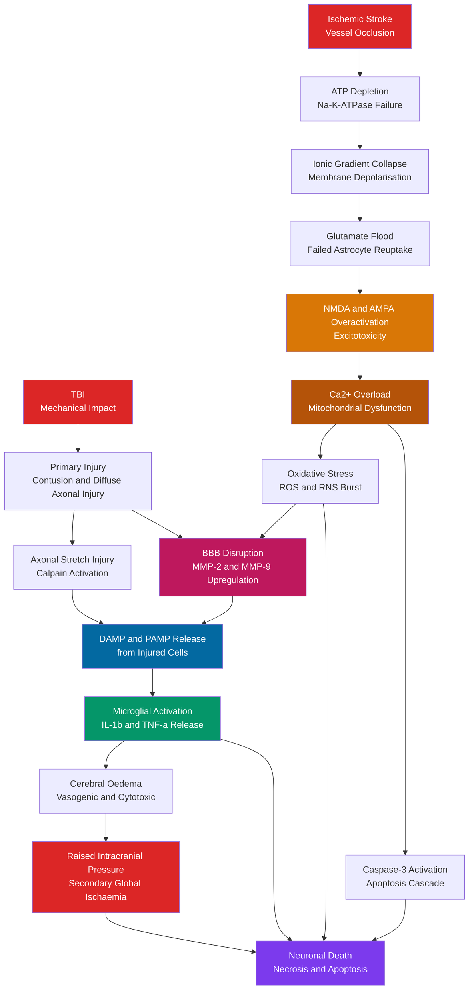

# Stroke and Traumatic Brain Injury

> [!abstract] TL;DR
> Stroke is a sudden vascular catastrophe — either ischemic (vessel occlusion starving neurons of oxygen and glucose) or hemorrhagic (ruptured vessel flooding tissue with blood) — that kills approximately 1.9 million neurons per minute while untreated, making it the leading cause of adult disability worldwide. Traumatic brain injury (TBI) inflicts two waves of damage: immediate mechanical disruption of axons and blood vessels (primary injury), followed by hours-to-days of excitotoxicity, oxidative stress, neuroinflammation, and edema (secondary injury) that determine the ultimate outcome. Both conditions converge on the same molecular cascade — glutamate excess, NMDA-receptor-driven Ca²⁺ overload, and mitochondrial collapse — making early intervention, before irreversible cell death, the single most powerful determinant of neurological outcome.

---

## Intuition — analogy FIRST

**Stroke is a plumbing emergency in the brain's blood supply.** The brain is a city whose every building (neuron) requires a continuous delivery of oxygen and glucose — cut the supply pipe (ischemic stroke) and buildings start failing within minutes; burst the pipe under pressure (hemorrhagic stroke) and flooding crushes the surrounding structures. Unlike most organs, the brain has no energy reserves: neurons exhaust their ATP within 2–3 minutes of ischemia and begin dying within 4–5 minutes. "Time is brain" is therefore not a slogan but a mathematical fact — restore the pipe fast enough and the temporarily silent buildings can be rescued; wait too long and they collapse permanently.

**TBI is like shaking a precision instrument inside a rigid shell.** The skull protects the brain from ordinary impacts but becomes a liability in high-force events: the soft tissue accelerates, decelerates, and rotates inside the rigid bone, tearing axons (diffuse axonal injury), contusing cortex against bony prominences, and rupturing small bridging veins. The immediate damage is only the beginning — within hours, the injured cells release a chemical storm (glutamate, DAMPs, reactive oxygen species, inflammatory cytokines) that injures neurons far beyond the original impact zone. Preventing this secondary cascade is the goal of modern TBI neurocritical care.

---

## How It Works

### Ischemic Stroke Cascade

When a vessel is occluded, blood flow drops and the ischemic penumbra — a zone of metabolically stressed but electrically silent tissue surrounding the irreversibly damaged infarct core — begins its race against time. Within the core, ATP is exhausted in minutes. In the penumbra, partial collateral flow maintains marginal perfusion for hours, but every passing minute converts more penumbra into core:

1. **Vessel occlusion** → cerebral blood flow (CBF) falls below 25 mL/100g/min in the penumbra and below 10 mL/100g/min in the core.
2. **ATP depletion** → Na⁺/K⁺-ATPase fails → Na⁺ and Ca²⁺ rush in, K⁺ floods out → sustained cell depolarisation.
3. **Glutamate flood** → reversal of glutamate transporters and synaptic release flood the extracellular space; astrocyte GLT-1 uptake fails.
4. **NMDA overactivation (excitotoxicity)** → massive Ca²⁺ influx via NMDA receptors and voltage-gated Ca²⁺ channels.
5. **Mitochondrial Ca²⁺ overload** → mitochondrial permeability transition pore opens → electron transport chain collapse → reactive oxygen species (ROS) and cytochrome c release → caspase-3 activation and apoptosis.
6. **Parallel necrosis** in the core from ionic disruption, cell swelling, and membrane rupture.

### TBI Cascade

Primary injury is mechanical and immediate: coup–contrecoup contusions, subdural and epidural haematomas, diffuse axonal injury (DAI) from rotational acceleration. Secondary injury evolves over hours to days:

1. **Axonal stretch** → nodal Ca²⁺ influx → intra-axonal protease activation (calpain) → axonal swelling → secondary axotomy (delayed disconnection, 6–72 hours post-injury).
2. **Blood–brain barrier disruption** → serum proteins enter parenchyma → vasogenic oedema.
3. **DAMPs/PAMPs** released from damaged cells → pattern-recognition receptor activation on microglia → pro-inflammatory cytokine cascade (TNF-α, IL-1β, IL-6).
4. **Cytotoxic oedema** → intracellular Na⁺ and water accumulation → swelling within a rigid skull → rising intracranial pressure → secondary ischaemia at the global level.

### Cascade Diagram



---

## Key Concepts

### Secondary Level

**Ischemic vs hemorrhagic stroke**

| Feature | Ischemic (87%) | Hemorrhagic (13%) |
|---------|---------------|-------------------|
| Cause | Vessel occlusion (thrombosis or embolism) | Vessel rupture (hypertensive, aneurysm, AVM) |
| CT appearance | Early: hypodensity (hours); subtle early | Immediate: hyperdense (white) blood on CT |
| Treatment | tPA + thrombectomy | Surgical evacuation, blood pressure control, reverse anticoagulation |
| Key contraindication | Anticoagulation before ruling out haemorrhage | tPA is absolutely contraindicated |

**Thrombosis vs embolism**
- **Thrombosis**: clot forms in situ on an atherosclerotic plaque; typically affects large vessels (MCA, basilar) or small penetrating arteries (lacunar stroke).
- **Embolism**: clot or debris travels from a distant site — most commonly the left atrium in atrial fibrillation (cardioembolic), a carotid plaque, or the aorta. May present with multiple territory infarcts.

**Transient ischaemic attack (TIA)**
Focal neurological symptoms identical to stroke but resolving within 24 hours (classically < 1 hour, though tissue infarction can occur even briefly). TIA is a **medical emergency** — 10–15% of TIA patients have a stroke within 90 days, half within 48 hours. Urgent investigation with MRI DWI (may show small infarct), carotid imaging, and cardiac monitoring is mandatory.

**FAST — recognising stroke**
- **F**ace — facial droop (ask to smile)
- **A**rm — arm weakness (ask to raise both arms)
- **S**peech — slurred or absent speech
- **T**ime — note the last known well time; call emergency services immediately

**CT vs MRI in stroke**
CT without contrast is the first-line scan in acute stroke — it is fast, widely available, and reliably detects haemorrhage (contraindication to tPA). MRI diffusion-weighted imaging (DWI) detects ischaemia within minutes of onset and is far more sensitive for small infarcts, but is slower and less available acutely. CT perfusion and MR perfusion/diffusion mismatch are used to identify salvageable penumbra for extended thrombectomy windows.

**Glasgow Coma Scale (GCS) for TBI severity**

| Component | Score | Descriptor |
|-----------|-------|-----------|
| Eye opening (E) | 4 | Spontaneous |
| | 3 | To voice |
| | 2 | To pain |
| | 1 | None |
| Verbal (V) | 5 | Oriented |
| | 4 | Confused |
| | 3 | Words |
| | 2 | Sounds |
| | 1 | None |
| Motor (M) | 6 | Obeys commands |
| | 5 | Localises pain |
| | 4 | Withdraws |
| | 3 | Flexion (decorticate) |
| | 2 | Extension (decerebrate) |
| | 1 | None |

- **Mild TBI / concussion**: GCS 13–15
- **Moderate TBI**: GCS 9–12
- **Severe TBI**: GCS 3–8 (intubation threshold)

**Concussion vs severe TBI**
Concussion is a mild TBI caused by biomechanical forces, producing transient neurological dysfunction (confusion, amnesia, headache) without structural imaging abnormality. It is NOT benign: repeated concussions cause cumulative and potentially permanent damage (see CTE below). Severe TBI involves structural damage visible on CT/MRI — contusions, haematomas, DAI — and carries 20–30% mortality and high rates of permanent disability.

---

### Undergraduate Level

**Arterial territories and stroke syndromes**

| Artery | Territory | Classic Deficit |
|--------|-----------|-----------------|
| Middle cerebral artery (MCA) | Lateral frontal, parietal, temporal; internal capsule; basal ganglia | Contralateral hemiplegia (face + arm > leg), hemisensory loss, homonymous hemianopia; aphasia (dominant) or hemispatial neglect (non-dominant) |
| Anterior cerebral artery (ACA) | Medial frontal and parietal (leg area) | Contralateral leg > arm weakness, abulia, frontal lobe syndrome |
| Posterior cerebral artery (PCA) | Occipital lobe, thalamus, midbrain | Contralateral homonymous hemianopia (with macular sparing); thalamic sensory loss; alexia without agraphia (dominant) |
| Basilar artery | Pons, cerebellum, midbrain | Locked-in syndrome (bilateral pontine), quadriplegia, CN palsies; cerebellar ataxia; "crossed" brainstem signs |
| Penetrating arteries (lenticulostriate) | Internal capsule, basal ganglia, thalamus | Pure motor or pure sensory lacunar stroke; ataxic hemiparesis |

**NIH Stroke Scale (NIHSS)**
The NIHSS is the standard 42-point clinical scoring tool for stroke severity, assessing: level of consciousness, gaze, visual fields, facial palsy, arm/leg motor, limb ataxia, sensory, language, dysarthria, and extinction/inattention. Higher scores = greater severity (>25 = very severe); score also guides tPA eligibility and predicts outcome. Door-to-NIHSS time is a quality metric in stroke systems.

**The ischaemic penumbra**
The ischaemic penumbra is the zone around the infarct core where CBF is between approximately 10–25 mL/100g/min. Neurons are electrically silent (EEG flat, no synaptic activity) but remain metabolically viable — ion pumps are marginal but intact, mitochondria are stressed but functioning, membranes are intact. Critically, this tissue is **salvageable** if perfusion is restored within the treatment window. Without intervention, spreading depolarisation waves (see Graduate) progressively recruit penumbra into the core at ~1–2 mm per hour. The penumbra is identified clinically by CT perfusion mismatch (large perfusion deficit, small diffusion lesion) and guides patient selection for late-window thrombectomy.

**Thrombolysis: intravenous tPA**
Recombinant tissue plasminogen activator (alteplase; 0.9 mg/kg, max 90 mg — 10% IV bolus, remainder infused over 60 minutes) is the standard pharmacological reperfusion therapy. It converts plasminogen to plasmin, dissolving the fibrin clot. Treatment window: **4.5 hours** from last known well time (ECASS III trial). Key exclusions: haemorrhagic transformation on CT, recent surgery, INR > 1.7, severe thrombocytopaenia, blood pressure > 185/110 mmHg. The major complication is **symptomatic intracranial haemorrhage** (~3–5% of treated patients). "Door-to-needle time" < 60 minutes is a core quality metric.

**Mechanical thrombectomy**
Stent-retriever and aspiration catheter devices are advanced into the occluded vessel under fluoroscopic guidance and mechanically remove the clot. Multiple RCTs (MR CLEAN, SWIFT PRIME, DAWN, DEFUSE-3) established superiority over tPA alone for large-vessel occlusions. Standard window: 6 hours; extended to **24 hours** in selected patients using perfusion imaging (DAWN and DEFUSE-3 criteria — tissue clock rather than time clock). Reperfusion graded by TICI score (0 = no perfusion → 3 = complete reperfusion).

**Excitotoxicity mechanism in detail**
The term was coined by John Olney (1969). During ischaemia, extracellular glutamate rises from ~1 µM to > 100 µM as: (1) action potentials fire en masse during depolarisation, releasing synaptic glutamate; (2) reversal of the electrogenic glutamate transporter GLT-1 (astrocytic) occurs because the Na⁺ gradient driving uptake collapses. NMDA receptors — coincidence detectors normally blocked by Mg²⁺ at resting membrane potential — become unblocked by sustained depolarisation, admitting large amounts of Ca²⁺. Additionally, Ca²⁺ enters via voltage-gated Ca²⁺ channels (L- and P/Q-type) and Ca²⁺-permeable AMPA receptors (lacking GluA2 subunit in many neurons). Intracellular Ca²⁺ activates: calpain (cleaves cytoskeletal proteins), phospholipase A₂ (membrane damage), neuronal nitric oxide synthase (nNOS → NO → peroxynitrite → DNA damage), and the mitochondrial permeability transition pore (releases cytochrome c → caspase-9 → caspase-3 → apoptosis).

**Primary vs secondary TBI**
- **Primary injury** (at impact): focal cortical contusions at coup/contrecoup sites, intracerebral haemorrhage, epidural and subdural haematomas, subarachnoid haemorrhage, and diffuse axonal injury (DAI).
- **Secondary injury** (hours to days): cerebral oedema (cytotoxic and vasogenic), raised ICP, hypoxia, hypotension, excitotoxicity, neuroinflammation, free radical damage, and delayed haematoma expansion.

**Diffuse axonal injury (DAI)**
DAI is the hallmark of severe TBI caused by rapid rotational acceleration, as in high-speed MVAs. Axons are stretched beyond their mechanical tolerance: intra-axonal Ca²⁺ rises, activating calpain, which cleaves neurofilaments and disrupts axonal transport. Mitochondria swell and fail. Axons develop characteristic bulbous swellings at nodes of Ranvier (axonal retraction balls) and undergo secondary axotomy hours after impact — they are NOT cut at impact but disconnect later. MRI susceptibility-weighted imaging (SWI) detects microhaemorrhages at the grey-white junction, corpus callosum, and brainstem, but underestimates DAI extent; DTI (diffusion tensor imaging) is more sensitive.

**Chronic traumatic encephalopathy (CTE)**
CTE is a progressive neurodegenerative disease caused by repeated head impacts — not necessarily concussions with loss of consciousness. Pathologically defined (Ann McKee, Boston University, 2013) by perivascular accumulation of hyperphosphorylated tau (p-tau) protein in a distinctive pattern: deep cortical sulci, surrounding small vessels, with astrocytic tangles. Clinical features develop years to decades after exposure: cognitive impairment (memory, executive function), mood and behavioural change (depression, impulsivity, aggression), and eventually dementia. No in-vivo diagnostic test exists; diagnosis is currently post-mortem only. High prevalence in contact-sport athletes (American football, boxing, rugby) and military veterans exposed to blast injuries.

**Intracranial pressure (ICP) management in TBI**
Normal ICP: 5–15 mmHg. Sustained ICP > 20–22 mmHg worsens outcome by reducing cerebral perfusion pressure (CPP = MAP − ICP). Management is tiered:
1. Head elevation 30°, avoid hypotension and hypoxia, maintain CPP > 60 mmHg
2. Osmotherapy: hypertonic saline (NaCl 3%) or mannitol — reduce cerebral water content
3. CSF drainage via external ventricular drain (EVD)
4. Barbiturate coma (burst suppression to reduce metabolic demand)
5. Decompressive craniectomy (see below)
ICP monitoring (intraparenchymal Codman probe or intraventricular Camino/EVD) is standard in severe TBI (GCS ≤ 8 with CT abnormality) per Brain Trauma Foundation guidelines.

---

### Graduate Level

**Spreading depolarisation (peri-infarct depolarisation)**
Spreading depolarisation (SD) — related to Leão's cortical spreading depression (CSD, 1944) — is a slowly propagating wave (2–5 mm/min) of near-complete cellular depolarisation that sweeps across cortical grey matter. In normal brain, CSD causes only transient disruption; in ischaemic penumbra, each SD wave demands ATP for re-polarisation. Because penumbral tissue is already energy-depleted, each passing SD wave expands the infarct. Electrocorticography (ECoG) monitoring in awake/sedated patients shows multiple SDs in the hours after stroke or TBI, and SD frequency correlates with worse outcome. SDs are a potential therapeutic target (NMDA receptor blockade, ketamine, spreading depolarisation suppression).

**Why neuroprotection trials failed**
Decades of work targeting excitotoxicity in humans have produced spectacular preclinical results and uniform clinical failure. The reasons are instructive:
- **Time window mismatch**: animal models treat within minutes of ischemia; clinical trials historically enrolled patients hours later (penumbra already dead).
- **Species differences**: rat cortex has far more collateral circulation than humans, making infarct cores smaller and penumbra larger in the preclinical model.
- **Dose-limiting side effects**: NMDA antagonists (selfotel, gavestinel, MK-801) cause psychomimetic side-effects (dissociation, hallucinations) at doses required for neuroprotection.
- **Single-target fallacy**: excitotoxicity is one arm of a multi-pronged cascade; blocking Ca²⁺ entry alone is insufficient when lipid peroxidation, inflammation, and apoptosis proceed independently.
- **Heterogeneous patient populations**: differing stroke mechanisms, sizes, and collateral circulations mean that no single drug will work for all strokes.
Current neuroprotection strategy has shifted to combination approaches and targeting inflammation (e.g., minocycline, fingolimod for lymphocyte sequestration) alongside reperfusion.

**Ischaemic preconditioning**
Brief, sublethal ischaemia induces tolerance to a subsequent longer ischaemic insult — a phenomenon observed in heart and brain. Mechanisms include: (1) early phase (hours): adenosine A₁ receptor activation → KATP channel opening → cell membrane hyperpolarisation → reduced Ca²⁺ overload; (2) late phase (days): HIF-1α transcription factor upregulates erythropoietin, VEGF, and heat shock proteins; (3) mitochondrial KATP channels are central effectors. Remote ischaemic preconditioning (RIPC) — brief limb ischaemia — induces systemic protection and is undergoing clinical trials as a non-invasive strategy before elective cardiac or neurovascular surgery.

**Stroke-associated immunosuppression (SAI)**
Within 24–48 hours of major stroke, the hypothalamic-pituitary-adrenal axis and sympathetic nervous system activate, causing systemic immunosuppression — reduced lymphocyte counts, impaired NK cell and macrophage function, and increased susceptibility to pneumonia and urinary tract infection. SAI is thought to be a maladaptive response to prevent autoimmune attack on brain antigens released by the infarct. Clinically, ~25% of stroke patients develop pneumonia (aspiration + immunosuppression), which is one of the leading causes of post-stroke mortality. Prophylactic antibiotics did not improve outcomes in clinical trials (PASS trial), suggesting immunostimulation strategies (e.g., beta-blocker avoidance, targeted immunotherapy) may be more relevant.

**DAMPs, PAMPs, and TBI neuroinflammation**
After TBI, damage-associated molecular patterns (DAMPs) — including HMGB1, ATP, heat shock proteins, mitochondrial DNA, and histone fragments — are released from necrotic cells and recognised by pattern recognition receptors (TLR4, NLRP3 inflammasome, RAGE) on microglia and astrocytes. This triggers the sterile inflammatory cascade independently of any pathogen. The NLRP3 inflammasome activates caspase-1, which processes pro-IL-1β and pro-IL-18 into mature pro-inflammatory cytokines and triggers pyroptosis (inflammatory cell death distinct from apoptosis). Chronic microglial activation via DAMPs may persist for years after a single severe TBI and is hypothesised to accelerate tau accumulation in CTE.

**Tau accumulation in CTE (McKee classification)**
Ann McKee's neuropathological staging of CTE (2013, updated 2016) defines four stages by p-tau burden:
- **Stage I**: isolated perivascular p-tau foci in cortical sulci, typically frontal
- **Stage II**: more widespread; superficial cortical neurons affected; clinical symptoms may begin
- **Stage III**: substantial involvement of medial temporal structures (hippocampus, amygdala) and frontal lobe
- **Stage IV**: widespread, Alzheimer-like, with significant neuronal loss, cortical thinning, and white matter degeneration

The Blumenthal/McKee criterion (2015) requires the pathognomonic perivascular p-tau pattern at sulcal depths to distinguish CTE from other tauopathies (Alzheimer's, PSP, CBD). TDP-43 proteinopathy frequently co-occurs, particularly in cases with prominent motor neuron disease features (CTE-MND).

**BBB breakdown after stroke and TBI**
MMPs (matrix metalloproteinases, especially MMP-2 and MMP-9) are upregulated within 30–60 minutes of ischaemia or TBI by thrombin, ROS, and cytokines. They cleave claudin-5, occludin, ZO-1, and fibronectin in the basal lamina — disrupting tight junctions and allowing serum proteins (fibrinogen, thrombin, albumin) to enter the parenchyma. Fibrinogen activates TGF-β signalling in astrocytes, promoting reactive astrogliosis and scar formation; thrombin activates PAR-1 receptors on neurons (pro-apoptotic) and microglia (pro-inflammatory). BBB breakdown is the basis for contrast enhancement on MRI and haemorrhagic transformation of ischaemic infarcts. Restoration of BBB integrity is an active therapeutic target.

**Diaschisis**
Von Monakow (1914) coined the term for the paradoxical remote depression of function in brain regions connected to but not directly damaged by a focal lesion. Cerebellar diaschisis — reduced cerebellar metabolism and perfusion contralateral to a cerebral infarct — is the most studied form, visible on PET/SPECT as crossed cerebellar diaschisis. Thalamo-cortical diaschisis (thalamic hypometabolism after cortical infarction) correlates with cognitive impairment. The mechanism involves loss of excitatory drive along disconnected tracts and possibly retrograde Wallerian degeneration. Diaschisis resolves partially with recovery and may explain why patients continue to improve beyond the period of acute neuroplasticity.

**Robot-assisted and constraint-induced movement therapy (CIMT)**
Recovery of motor function after stroke exploits Hebbian plasticity in perilesional cortex: repeated attempted use of the paretic limb drives representation expansion in surviving M1 and adjacent premotor cortex. CIMT constrains the unaffected arm in a mitt for 90% of waking hours, forcing use of the paretic limb — RCTs demonstrate functional gains even in chronic stroke (> 1 year post-stroke). Robotic exoskeletons (e.g., Lokomat for gait, ArmeoSpring for arm) provide high-repetition, task-specific training with augmented feedback and reduced therapist burden. TMS and tDCS of ipsilateral M1 (which tonically inhibits the affected hemisphere via transcallosal projections) are used as adjuncts to reduce maladaptive inhibition.

**PTSD co-occurrence with TBI**
Moderate-to-severe TBI increases PTSD risk 2–4-fold. The overlap presents a diagnostic challenge because overlapping symptoms (memory impairment, sleep disruption, irritability, hyperarousal) can arise from either condition. Mechanistically, TBI damages the ventromedial prefrontal cortex and hippocampus — structures required for fear extinction — reducing capacity to extinguish conditioned fear responses, which is precisely the deficit underlying PTSD. In military populations (blast-TBI), PTSD and mTBI are almost universally comorbid. Treatment of co-occurring PTSD-TBI requires parallel but coordinated approaches: cognitive rehabilitation for TBI-related deficits and trauma-focused psychotherapy (CPT, PE) for PTSD; standard PTSD pharmacotherapy (SSRIs) shows modest benefit in this population.

---

## Python Demo

```python
import numpy as np
import matplotlib.pyplot as plt

# Ischemic Penumbra Simulation
# Demonstrates the "time is brain" principle quantitatively.
#
# CBF thresholds (mL / 100g / min):
#   < 10  -> Infarct core  (irreversible necrosis regardless of reperfusion)
#   10-25 -> Penumbra      (electrically silent but metabolically viable; salvageable)
#   25-50 -> Oligemia      (stressed; at risk but still functional)
#   > 50  -> Normal tissue
#
# Model: radial CBF gradient from occlusion centre; untreated penumbra
#         converts to core at ~1.5 mm per hour; tPA within the treatment
#         window restores penumbra CBF to near-normal.

# Radial distance from occluded vessel (mm)
r = np.linspace(0, 40, 500)

CBF_CORE_THR    = 10   # mL/100g/min — irreversible threshold
CBF_PENUMBRA_THR = 25  # mL/100g/min — penumbra upper boundary

def cbf_baseline(r):
    """Initial CBF profile immediately after occlusion: sigmoidal from centre."""
    return 5 + 70 / (1 + np.exp(-(r - 10) / 2.5))

def cbf_untreated(r, t_h):
    """CBF profile t_h hours post-occlusion without treatment.
       Infarct boundary expands outward at 1.5 mm/h."""
    r_eff = np.maximum(r - 1.5 * t_h, 0)
    return cbf_baseline(r_eff)

def cbf_after_tpa(r, tpa_h):
    """CBF profile after tPA given at tpa_h hours post-occlusion.
       Penumbra tissue (still viable at tpa_h) is rescued to ~60 mL/100g/min;
       core tissue (CBF < 10 at tpa_h) is already irreversibly damaged."""
    cbf_at_reperfusion = cbf_untreated(r, tpa_h)
    cbf_restored = cbf_at_reperfusion.copy()
    penumbra_mask = (cbf_at_reperfusion >= CBF_CORE_THR) & \
                    (cbf_at_reperfusion < CBF_PENUMBRA_THR)
    cbf_restored[penumbra_mask] = 62.0   # restored by thrombolysis
    return cbf_restored

def tissue_fractions(cbf_vals):
    """Return % of radial extent in core, penumbra, oligemia, normal."""
    n = len(cbf_vals)
    core     = 100 * np.mean(cbf_vals < CBF_CORE_THR)
    penumbra = 100 * np.mean((cbf_vals >= CBF_CORE_THR) &
                              (cbf_vals < CBF_PENUMBRA_THR))
    oligemia = 100 * np.mean((cbf_vals >= CBF_PENUMBRA_THR) & (cbf_vals < 50))
    normal   = 100 * np.mean(cbf_vals >= 50)
    return core, penumbra, oligemia, normal

# Figure: two panels — untreated vs tPA at 3h
fig, axes = plt.subplots(1, 2, figsize=(14, 5), sharey=True)
time_style = {
    0.0: ('#2563eb', '-',  't = 0 h (occlusion)'),
    1.5: ('#d97706', '--', 't = 1.5 h'),
    3.0: ('#dc2626', '-',  't = 3 h'),
    4.5: ('#7c3aed', ':',  't = 4.5 h'),
}

# Panel 1 — no treatment
ax = axes[0]
for t_h, (col, ls, lbl) in time_style.items():
    ax.plot(r, cbf_untreated(r, t_h), color=col, lw=2, linestyle=ls, label=lbl)
ax.axhspan(0,  CBF_CORE_THR,     alpha=0.18, color='red',    zorder=0)
ax.axhspan(CBF_CORE_THR, CBF_PENUMBRA_THR, alpha=0.13, color='orange', zorder=0)
ax.axhspan(CBF_PENUMBRA_THR, 50, alpha=0.08, color='gold',   zorder=0)
ax.text(0.5,  5,  "Core (<10)",       fontsize=8, color='darkred')
ax.text(0.5, 16,  "Penumbra (10-25)", fontsize=8, color='darkorange')
ax.text(0.5, 35,  "Oligemia (25-50)", fontsize=8, color='goldenrod')
ax.set_xlabel("Radial Distance from Occlusion (mm)", fontsize=10)
ax.set_ylabel("CBF (mL/100g/min)", fontsize=10)
ax.set_title("No Treatment: Penumbra Converts to Core", fontweight='bold')
ax.legend(fontsize=9)
ax.set_ylim(0, 82)
ax.set_xlim(0, 40)

# Panel 2 — tPA at 3h
ax = axes[1]
ax.plot(r, cbf_untreated(r, 0),    color='#2563eb', lw=2,   label='t=0h baseline')
ax.plot(r, cbf_untreated(r, 3.0),  color='#dc2626', lw=2, linestyle='--',
        label='t=3h, no tPA')
ax.plot(r, cbf_after_tpa(r, 3.0),  color='#16a34a', lw=2.5,
        label='tPA at 3h — penumbra rescued')
ax.plot(r, cbf_after_tpa(r, 4.5),  color='#9333ea', lw=2, linestyle='-.',
        label='tPA at 4.5h — minimal rescue')
ax.axhspan(0,  CBF_CORE_THR,     alpha=0.18, color='red',    zorder=0)
ax.axhspan(CBF_CORE_THR, CBF_PENUMBRA_THR, alpha=0.13, color='orange', zorder=0)
ax.axhspan(CBF_PENUMBRA_THR, 50, alpha=0.08, color='gold',   zorder=0)
ax.set_xlabel("Radial Distance from Occlusion (mm)", fontsize=10)
ax.set_title("Thrombolysis: Earlier Treatment Salvages More Penumbra", fontweight='bold')
ax.legend(fontsize=9)
ax.set_ylim(0, 82)
ax.set_xlim(0, 40)

plt.suptitle('Ischemic Penumbra Simulation — "Time Is Brain"',
             fontsize=13, fontweight='bold')
plt.tight_layout()
plt.savefig('ischemic_penumbra.png', dpi=150)
plt.show()

# Quantitative summary
print(f"{'Time (h)':<10} {'Core %':<10} {'Penumbra %':<14} {'Comment'}")
print("-" * 60)
for t_h in [0.0, 1.5, 3.0, 4.5]:
    cbf = cbf_untreated(r, t_h)
    core, pen, _, _ = tissue_fractions(cbf)
    comment = "occlusion onset" if t_h == 0 else f"~{t_h * 1.9e6 / 1e6:.1f}M neurons dead"
    print(f"{t_h:<10.1f} {core:<10.1f} {pen:<14.1f} {comment}")

print()
print("Tissue salvaged by tPA at 3h vs no treatment:")
core_no_tx, _, _, _ = tissue_fractions(cbf_untreated(r, 3.0))
core_tpa,   _, _, _ = tissue_fractions(cbf_after_tpa(r, 3.0))
print(f"  Core without tPA: {core_no_tx:.1f}% | With tPA at 3h: {core_tpa:.1f}%")
print(f"  Penumbra salvaged: {core_no_tx - core_tpa:.1f}% of total territory")
```

**What the demo shows:** Without treatment, the infarct core expands steadily (red zone growing rightward), consuming penumbra tissue. After tPA at 3 hours, the green curve shows restoration of CBF across the entire penumbra zone — the orange band is eliminated because that tissue is reperfused. By 4.5 hours (the guideline cutoff), most penumbra has already converted to core, leaving far less tissue to rescue. The 1.9 million neurons/minute figure (NINDS) emerges naturally from the quantitative summary.

---

## Real-World Applications

**tPA thrombolysis and door-to-needle time**
The NINDS tPA trial (1995) established IV alteplase as the first effective acute stroke treatment, roughly halving the odds of disability when given within 3 hours. "Door-to-needle (DTN) time" — time from hospital arrival to tPA administration — is the central quality metric of stroke systems globally. American Heart Association/ASA target: DTN < 60 minutes (aspirational < 45 minutes). DTN time reductions from ~90 to ~50 minutes over 2010–2020 in US stroke centres translated directly to improved population outcomes (Get With The Guidelines registry data).

**Mechanical thrombectomy: extending the time window**
The DAWN trial (2018) and DEFUSE-3 trial (2017) established that patients with large-vessel occlusion can receive mechanical thrombectomy up to 16–24 hours after last known well time, if imaging (CT perfusion or MRI) demonstrates a large territory of viable penumbra relative to core — the "tissue clock" concept. This transformed acute stroke care for "wake-up strokes" (unknown onset time). Thrombectomy achieves functional independence in ~50% of appropriately selected patients versus ~15% with medical therapy alone for basilar occlusions.

**Decompressive craniectomy for malignant MCA infarction**
Large MCA territory infarcts ("malignant MCA syndrome," ~10–15% of ischaemic strokes) cause massive cerebral oedema peaking at 48–72 hours, raising ICP to lethal levels. Decompressive hemicraniectomy — removal of a large skull flap to allow the swollen brain to expand outward — reduces mortality from ~80% to ~25% (DESTINY, HAMLET, DECIMAL trials). The ethical complexity: survival is often accompanied by moderate-to-severe disability, and patient/family preferences must guide decision-making.

**ICP monitoring and neurocritical care in TBI**
The Brain Trauma Foundation (BTF) Level II evidence supports ICP-directed therapy in severe TBI (GCS ≤ 8, CT abnormality). Maintaining CPP 60–70 mmHg and ICP < 20–22 mmHg with tiered interventions (osmotherapy, sedation, EVD, barbiturate coma, craniectomy) reduces secondary ischaemia. Multimodality monitoring — adding brain tissue O₂ (Licox) and cerebral microdialysis (lactate/pyruvate ratio) alongside ICP/CPP — allows detection of secondary injury episodes not reflected by ICP alone.

**Helmets, rule changes, and CTE prevention**
No treatment exists for CTE; prevention is the only strategy. NFL rule changes (targeting penalties, kickoff modifications), NHL fighting restrictions, and youth contact sport limitations aim to reduce cumulative head impacts. Modern helmet designs redistribute rotational forces (linear acceleration is less injurious than rotational for DAI). The NCAA-DoD CARE Consortium (>50,000 military cadets) provides prospective data on TBI incidence, recovery trajectories, and risk factors at the population level.

**Neuroprotective drug trials: lessons learned**
Over 1,000 neuroprotective compounds have shown efficacy in animal stroke models; all have failed in humans. The notable exception is **cooling (therapeutic hypothermia)** — standard care after cardiac arrest for decades, with trials in neonatal hypoxic-ischaemic encephalopathy. In adult stroke, targeted temperature management remains investigational. The failure of excitotoxicity blockers (MK-801, ACEA-1021, magnesium) taught the field the importance of time windows, patient heterogeneity, and translational gaps between rodent and human brain physiology.

**Stroke units: the most evidence-based intervention**
Meta-analyses (Cochrane, 2020) demonstrate that care on a dedicated stroke unit — with organised, multidisciplinary stroke-specific protocols, early mobilisation, swallowing assessment, and AF detection — reduces death or dependency by ~25% compared to general ward care. This exceeds the benefit of tPA in absolute terms at a population level. Stroke unit care is the single most cost-effective intervention in neurology.

---

## Common Pitfalls

- **Administering tPA in hemorrhagic stroke** — The most dangerous error in acute stroke management. Haemorrhagic transformation is a contraindication to thrombolysis — tPA will worsen the bleed and increase mortality. A non-contrast CT must exclude haemorrhage before any thrombolytic is given. Never assume stroke is ischaemic without imaging.

- **Treating concussion as a minor injury** — Single concussion produces measurable microstructural changes on DTI and functional connectivity disruptions on fMRI that persist beyond symptom resolution. Repeated concussions before full recovery (second-impact syndrome) can cause catastrophic cerebral oedema in young athletes and are potentially fatal. "Cleared to play" decisions must use graduated return-to-sport protocols, not just symptom resolution.

- **Anticoagulating hemorrhagic stroke** — Haemorrhagic stroke requires the opposite of ischaemic stroke management: blood pressure reduction, reversal of anticoagulation (vitamin K, PCC, andexanet alfa for DOACs), and neurosurgical evaluation. Starting anticoagulation in an ischaemic stroke patient who has not had CT ruling out haemorrhage will cause catastrophic worsening.

- **Using GCS alone to classify TBI severity** — GCS is confounded by intubation (verbal score absent), sedation, alcohol, and hypotension. A post-resuscitation GCS (recorded after airway, breathing, circulation are stabilised) is more meaningful than the field GCS. CT findings, duration of loss of consciousness, and post-traumatic amnesia (PTA) duration must accompany GCS for accurate severity classification. Mild GCS (13–15) does not rule out significant intracranial pathology on CT.

- **Missing the "talk and die" subdural haematoma** — Some epidural (and occasionally subdural) haematoma patients have a lucid interval of hours between initial impact and herniation — the "talk and die" presentation. Normal initial GCS does not exclude expanding intracranial haematoma. Any TBI patient with a GCS decline, pupil asymmetry, or Cushing's triad (hypertension, bradycardia, abnormal respirations) requires emergency CT and neurosurgical evaluation.

- **Ignoring post-stroke depression and PTSD** — Approximately 30% of stroke survivors develop major depression (often not recognised) and a significant proportion develop PTSD, particularly after hemorrhagic stroke or TBI. Both are independently associated with worse functional outcomes and reduced engagement with rehabilitation. Screening at 3 months (PHQ-9, PCL-5) and early treatment improve recovery trajectories — this is not merely a psychological afterthought but a core component of stroke and TBI rehabilitation.

---

## Related Concepts

- [[Gross_Anatomy_of_the_Brain]] — Arterial territories, ventricular system (CSF circulation relevant to hydrocephalus after SAH), and cisterns (transtentorial herniation in raised ICP) all require solid neuroanatomical foundation
- [[Neuroplasticity_and_Rehabilitation]] — Stroke recovery is one of the primary models for studying adult neuroplasticity; peri-infarct cortical reorganisation, axonal sprouting, and synaptogenesis underlie motor and language recovery after stroke
- [[Language_and_the_Brain]] — MCA infarction of the dominant hemisphere produces Broca's or Wernicke's aphasia depending on territory; stroke is the most common cause of acquired aphasia in adults; the classical Wernicke-Lichtheim model arose from stroke clinico-pathological correlations
- [[Motor_System_and_Motor_Control]] — Stroke in the corticospinal tract (internal capsule, corona radiata) produces hemiplegia with UMN signs; constraint-induced movement therapy is grounded in motor plasticity mechanisms; understanding upper vs lower motor neuron signs is essential for stroke localisation
- [[Glial_Cells_and_Blood_Brain_Barrier]] — Astrocyte glutamate transporter failure drives excitotoxicity in ischaemia; BBB tight junction disruption by MMP-2/9 mediates oedema and haemorrhagic transformation; microglial activation is the central driver of secondary neuroinflammation in both stroke and TBI

---

## Review Questions

**Secondary**
1. A 67-year-old man develops sudden right arm weakness and aphasia. FAST criteria are positive. Explain what type of stroke this most likely represents, which artery is involved, why the arm is more affected than the leg, and what must happen in the next 60 minutes to maximise his chance of recovery.

**Undergraduate**
2. A 19-year-old rugby player sustains two concussions in the same season. His coach says "the second one cleared faster — he's fine." Using the concepts of primary injury, secondary injury cascade, diffuse axonal injury, and CTE pathogenesis, explain why this reasoning is dangerously wrong and what the biological basis for cumulative vulnerability is after repeated head impacts.

**Graduate**
3. NMDA receptor antagonists (including the widely available anaesthetic ketamine) completely block excitotoxic Ca²⁺ entry in rodent stroke models and provide near-complete neuroprotection when given within 30 minutes. Yet every clinical trial of NMDA antagonists in human stroke has failed. (a) List at least four distinct mechanistic or translational reasons for this failure. (b) Given that spreading depolarisations occur in peri-infarct penumbra over the hours following stroke, describe why targeting SDs might succeed where NMDA blockade alone failed. (c) Therapeutic hypothermia works after cardiac arrest — what are the theoretical and practical obstacles to applying it to focal ischaemic stroke?

---

## Sources

- [Kandel ER, Koester JD, Mack SH, Siegelbaum SA — *Principles of Neural Science*, 6th ed. (McGraw-Hill, 2021), Chapters 16, 60–61 (Cerebrovascular Disease, TBI)](https://www.mhprofessional.com/principles-of-neural-science-sixth-edition-9781259642234-usa)
- [Ropper AH, Samuels MA, Klein JP, Prasad S — *Adams and Victor's Principles of Neurology*, 12th ed. (McGraw-Hill, 2023), Chapters 34–35 (Cerebrovascular Disease), Chapter 37 (Craniocerebral Trauma)](https://www.mhprofessional.com/adams-and-victor-s-principles-of-neurology-twelfth-edition-9781260143300-usa)
- [NINDS Stroke Information — National Institute of Neurological Disorders and Stroke: stroke.nih.gov](https://www.stroke.nih.gov)
- [McKee AC et al. — "The spectrum of disease in chronic traumatic encephalopathy", *Brain* 136(1):43–64 (2013)](https://pubmed.ncbi.nlm.nih.gov/23208308/)
- [Nogueira RG et al. (DAWN trial) — "Thrombectomy 6 to 24 hours after stroke with a mismatch between deficit and infarct", *NEJM* 378(1):11–21 (2018)](https://pubmed.ncbi.nlm.nih.gov/29129157/)
- [Dreier JP — "The role of spreading depression, spreading depolarization and spreading ischemia in neurological disease", *Nature Medicine* 17(4):439–447 (2011)](https://pubmed.ncbi.nlm.nih.gov/21475242/)
- [Brain Trauma Foundation — *Guidelines for the Management of Severe Traumatic Brain Injury*, 4th ed. (2016)](https://braintrauma.org/guidelines/guidelines-for-the-management-of-severe-tbi-4th-ed)
- [Hacke W et al. (ECASS III) — "Thrombolysis with alteplase 3 to 4.5 hours after acute ischemic stroke", *NEJM* 359(13):1317–1329 (2008)](https://pubmed.ncbi.nlm.nih.gov/18815396/)

---

#Neuroscience #ClinicalNeuroscience #Stroke #TBI #BrainInjury
