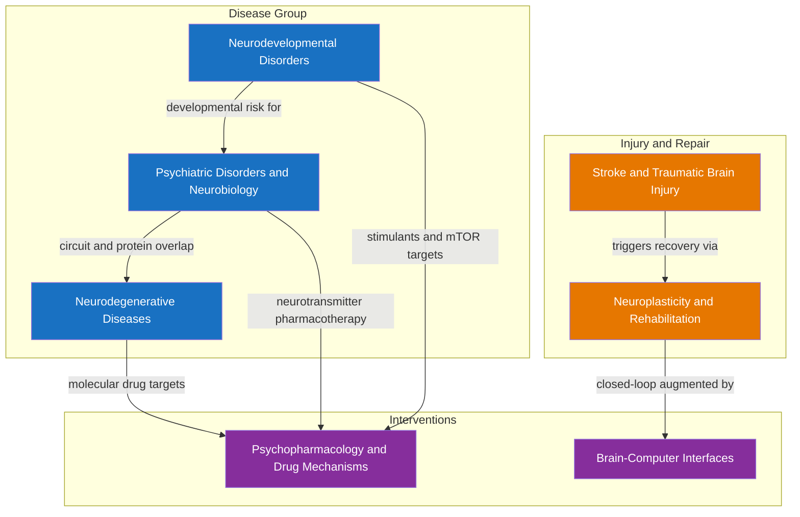

# Clinical and Applied Neuroscience — Section MOC

> [!abstract]
> This section bridges basic neuroscience and clinical medicine, translating molecular and circuit-level science into disease mechanisms, injury responses, and therapeutic interventions. It spans the full spectrum from neurodevelopmental disruptions that alter brain architecture before birth, through chronic degenerative and psychiatric disorders that erode circuits over years, to acute vascular and mechanical injuries that destroy tissue in minutes. Pharmacology, rehabilitation, and brain-computer interfaces each represent distinct strategies for restoring function when that architecture fails.

> [!info] How to use this map
> Choose the **Disease Path** to understand the full disease spectrum from developmental origins to adult neurodegeneration. Choose the **Intervention Path** to follow the clinical logic from acute injury through recovery, pharmacology, and technology. Both paths converge on the same circuits — work through at least one before tackling the other.

---

## Concept Map

*(Blue = disease cluster, Orange = injury and repair, Purple = intervention technologies; arrows = "leads to" or "informs")*

---

## Learning Paths

### Disease Path

*Recommended order for understanding the full disease spectrum, from earliest developmental origins to late-life neurodegeneration:*

1. [[Neurodevelopmental_Disorders]] — start here: disruptions to synaptogenesis, pruning, and myelination during specific embryonic windows set the stage for ASD, ADHD, and dyslexia; establishes the concept of vulnerability windows and E-I imbalance
2. [[Psychiatric_Disorders_and_Neurobiology]] — builds on circuit architecture established in development; dopamine, GABA/glutamate, and HPA axis dysregulation produce schizophrenia, depression, anxiety, and bipolar disorder in the mature brain, showing how the same circuits go wrong in different ways
3. [[Neurodegenerative_Diseases]] — culmination of the disease arc; protein misfolding and prion-like propagation drive irreversible neuron loss across decades in AD, PD, ALS, and HD, demonstrating why timing and early intervention matter

### Intervention Path

*Recommended order for understanding how damaged circuits are treated, from acute emergency to frontier technology:*

1. [[Stroke_and_Traumatic_Brain_Injury]] — understand the acute injury cascade (excitotoxicity, secondary injury, penumbra) and the "time is brain" imperative; establishes why acute intervention saves more tissue than any drug
2. [[Neuroplasticity_and_Rehabilitation]] — understand the recovery mechanisms (LTP, cortical map reorganization, BDNF) that rehabilitation deliberately harnesses; shows how the injured brain rewires itself given the right signals
3. [[Psychopharmacology_and_Drug_Mechanisms]] — understand how drugs modulate neurotransmitter systems at the molecular level; the pharmacological complement to activity-based rehabilitation across all conditions in this section
4. [[Brain_Computer_Interfaces]] — understand how technology can bypass or augment damaged pathways when biological recovery is incomplete; the frontier of restorative neurotechnology, from cochlear implants to intracortical speech decoders

---

## All Notes in This Section

| Note | Core Condition/Topic | Key Treatment/Intervention | Level |
|------|---------------------|---------------------------|-------|
| [[Neurodegenerative_Diseases]] | Protein misfolding and progressive neuron loss in AD, PD, ALS, and HD via prion-like spread | Anti-amyloid antibodies (lecanemab, donanemab), L-DOPA, riluzole, ASOs (tofersen), DBS | Graduate |
| [[Psychiatric_Disorders_and_Neurobiology]] | Circuit-level dysfunction in schizophrenia, MDD, anxiety, ADHD, and bipolar disorder | Antipsychotics (D2 blockade), SSRIs/SNRIs, ketamine/esketamine, TMS, ECT, psilocybin | Intermediate |
| [[Stroke_and_Traumatic_Brain_Injury]] | Acute ischemic/hemorrhagic stroke and mechanical TBI; excitotoxic and neuroinflammatory cascades | tPA thrombolysis, mechanical thrombectomy, ICP management, CIMT for recovery | Intermediate |
| [[Neuroplasticity_and_Rehabilitation]] | Brain's lifelong capacity to reorganize synaptic weights, cortical maps, and structural connectivity after injury | CIMT, tDCS/rTMS, robot-assisted therapy, epidural spinal cord stimulation | Intermediate |
| [[Psychopharmacology_and_Drug_Mechanisms]] | Molecular pharmacology of psychoactive drugs across all CNS neurotransmitter systems and ADME principles | SSRIs, antipsychotics, benzodiazepines, opioids, ketamine, lithium, MAT for addiction | Intermediate |
| [[Brain_Computer_Interfaces]] | Direct neural-to-device communication pipelines; signal acquisition, decoding, and closed-loop feedback | BrainGate Utah Array, ECoG speech BCIs (Moses et al. 2021), cochlear implants, closed-loop DBS | Graduate |
| [[Neurodevelopmental_Disorders]] | Disruptions to neural tube closure, synaptogenesis, pruning, and myelination producing ASD, ADHD, and dyslexia | ABA therapy, stimulants (methylphenidate), educational accommodations, mTOR inhibitors in TSC | Intermediate |

---

## Key Questions This Section Answers

- What molecular mechanism is shared across Alzheimer's, Parkinson's, ALS, and Huntington's disease, and why does each disease damage a different neuron population despite the common prion-like spread?
- How do dopamine and NMDA receptor dysfunctions together explain the positive, negative, and cognitive symptoms of schizophrenia — and why does D2 blockade treat only one symptom cluster?
- Why does tPA for ischemic stroke have a 4.5-hour window, and what determines how many neurons are saved with each minute of faster treatment?
- What cellular and circuit-level mechanisms allow the adult brain to recover function after stroke, and how does CIMT or tDCS directly drive these changes?
- Why do antidepressants take 2–6 weeks to produce clinical benefit despite reaching the brain within hours, and what does this reveal about the true therapeutic mechanism?
- How can 96 electrodes implanted in motor cortex restore voluntary cursor control or speech in a completely paralyzed patient, and what engineering constraints limit that bandwidth?
- When during embryonic or postnatal development do disruptions cause ASD versus ADHD versus schizophrenia, and why does the timing of the insult determine the resulting disorder?

---

## Cross-Section Connections

- [[_MOC_Cellular_and_Molecular_Neuroscience]] (S01) — protein misfolding, receptor pharmacology, synaptic transmission, and ion channel biophysics are the molecular substrate of every disease and drug mechanism in this section; understanding NMDA receptor function, monoamine transporter pharmacology, and APP/presenilin cleavage is prerequisite for clinical neuroscience
- [[_MOC_Neuroanatomy_and_Brain_Structure]] (S02) — the affected circuits — nigrostriatal, mesolimbic-mesocortical, corticospinal, hippocampal-entorhinal, prefrontal-limbic, and basal ganglia-thalamo-cortical pathways — are described structurally in neuroanatomy; stroke syndromes cannot be localised, and neurodegenerative staging cannot be understood, without this anatomical grounding
- [[_MOC_Cognitive_Neuroscience]] (S04) — the cognitive symptoms that define psychiatric and neurodegenerative disorders — episodic memory loss, executive dysfunction, language impairment, attention deficits — are grounded in the cognitive neuroscience of hippocampal memory systems, prefrontal circuits, and language networks; rehabilitation directly targets these same systems and leverages the same plasticity mechanisms

---

## Link to Master MOC

[[_MOC_Neuroscience_Master]]

---

#MOC #Neuroscience #ClinicalNeuroscience #SectionMOC
