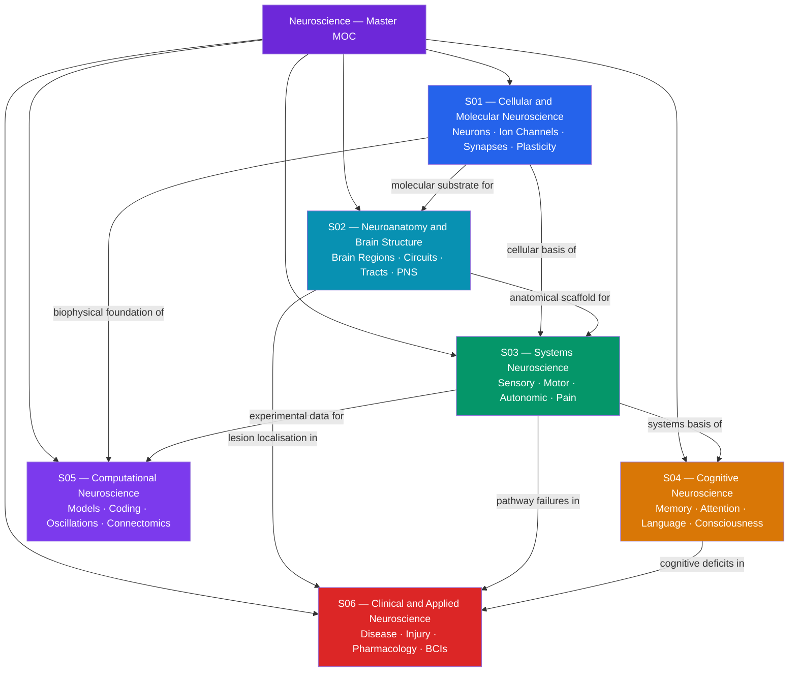

# Neuroscience — Master Map of Content

> [!abstract] About This Vault
> This vault is a comprehensive neuroscience reference spanning secondary through graduate level, with 38 notes across 6 sections; every note opens with a grounding analogy and builds through introductory theory to graduate-level depth. Sections cover cellular and molecular neuroscience, neuroanatomy, systems neuroscience, cognitive neuroscience, computational neuroscience, and clinical and applied neuroscience — tracing a path from the single ion channel to the whole mind and its diseases. The vault is richly cross-linked into the Psychology, Chemistry, Physics, Signals and Systems, AI-ML, and Mathematics vaults, making it a hub for interdisciplinary learning.

---

## Vault Architecture

*(Violet = master entry point; Blue = cellular/molecular foundation; Cyan = anatomical framework; Green = systems physiology; Amber = cognition; Purple = computational models; Red = clinical translation. Arrows show "feeds into" or "provides substrate for".)*

---

## Sections at a Glance

| # | Section | Notes | Entry Point | Level Range |
|---|---------|-------|-------------|-------------|
| 01 | Cellular and Molecular Neuroscience | 6 | [[_MOC_Cellular_and_Molecular_Neuroscience]] | Secondary → Graduate |
| 02 | Neuroanatomy and Brain Structure | 6 | [[_MOC_Neuroanatomy_and_Brain_Structure]] | Secondary → Graduate |
| 03 | Systems Neuroscience | 6 | [[_MOC_Systems_Neuroscience]] | Secondary → Graduate |
| 04 | Cognitive Neuroscience | 7 | [[_MOC_Cognitive_Neuroscience]] | Undergraduate → Graduate |
| 05 | Computational Neuroscience | 6 | [[_MOC_Computational_Neuroscience]] | Undergraduate → Graduate |
| 06 | Clinical and Applied Neuroscience | 7 | [[_MOC_Clinical_and_Applied_Neuroscience]] | Undergraduate → Graduate |

---

## Section Contents

**S01 — Cellular and Molecular Neuroscience**

- [[Neuron_Structure_and_Function]]
- [[Action_Potentials_and_Resting_Membrane_Potential]]
- [[Ion_Channels_and_Receptor_Pharmacology]]
- [[Synaptic_Transmission_and_Neurotransmitters]]
- [[Synaptic_Plasticity_and_LTP]]
- [[Glial_Cells_and_Blood_Brain_Barrier]]

**S02 — Neuroanatomy and Brain Structure**

- [[Gross_Anatomy_of_the_Brain]]
- [[Cerebral_Cortex_and_Lobes]]
- [[Limbic_System_and_Diencephalon]]
- [[Brainstem_and_Cranial_Nerves]]
- [[Cerebellum_and_Basal_Ganglia]]
- [[Spinal_Cord_and_Peripheral_Nervous_System]]

**S03 — Systems Neuroscience**

- [[Sensory_Systems_and_Transduction]]
- [[Visual_System_and_Visual_Cortex]]
- [[Auditory_System_and_Sound_Processing]]
- [[Motor_System_and_Motor_Control]]
- [[Autonomic_Nervous_System]]
- [[Pain_and_Nociception]]

**S04 — Cognitive Neuroscience**

- [[Neuroimaging_Methods]]
- [[Learning_and_Memory_Systems]]
- [[Attention_and_Executive_Function]]
- [[Language_and_the_Brain]]
- [[Decision_Making_and_Reward_Circuits]]
- [[Sleep_and_Circadian_Rhythms]]
- [[Consciousness_and_Neural_Correlates]]

**S05 — Computational Neuroscience**

- [[Hodgkin_Huxley_Model_and_Computational_Neurons]]
- [[Neural_Coding_and_Spike_Trains]]
- [[Population_Coding_and_Decoding]]
- [[Neural_Oscillations_and_Synchrony]]
- [[Sensorimotor_Integration_and_Feedback]]
- [[Connectomics_and_Network_Neuroscience]]

**S06 — Clinical and Applied Neuroscience**

- [[Neurodegenerative_Diseases]]
- [[Psychiatric_Disorders_and_Neurobiology]]
- [[Stroke_and_Traumatic_Brain_Injury]]
- [[Neuroplasticity_and_Rehabilitation]]
- [[Psychopharmacology_and_Drug_Mechanisms]]
- [[Brain_Computer_Interfaces]]
- [[Neurodevelopmental_Disorders]]

---

## Learning Paths

### Path 1: Senior Secondary Student (Foundations Only)

*Goal: Build a clear mental model of how the brain works at the cell and organ level — no calculus required.*

1. [[Neuron_Structure_and_Function]] — the fundamental unit; establishes dendrite-to-axon-terminal signal flow and why neurons are special cells
2. [[Action_Potentials_and_Resting_Membrane_Potential]] — the physics of the nerve impulse; ionic gradients, the spike, and why it is all-or-nothing
3. [[Synaptic_Transmission_and_Neurotransmitters]] — how neurons talk to each other; chemical messengers, receptors, and the basis of drug action
4. [[Gross_Anatomy_of_the_Brain]] — the spatial map; forebrain, midbrain, hindbrain, and the major lobes
5. [[Cerebral_Cortex_and_Lobes]] — the seat of cognition; functional regions and why lesions predict deficits
6. [[Sensory_Systems_and_Transduction]] — how the world becomes neural signals; the universal logic of receptor potentials
7. [[Visual_System_and_Visual_Cortex]] — the most-studied sensory system; from retina to cortex
8. [[Motor_System_and_Motor_Control]] — how the brain commands movement; the corticospinal tract and clinical lesion signs

### Path 2: Neuroscience Undergraduate (Full Cellular-to-Systems Arc)

*Goal: Master the complete chain from ion channel to behaviour across all six sections.*

1. [[Neuron_Structure_and_Function]] — start at the cellular foundation
2. [[Action_Potentials_and_Resting_Membrane_Potential]] — ionic mechanism of the spike
3. [[Ion_Channels_and_Receptor_Pharmacology]] — molecular pharmacology of channels and receptors
4. [[Synaptic_Transmission_and_Neurotransmitters]] — chemical synapse from vesicle release to postsynaptic potential
5. [[Synaptic_Plasticity_and_LTP]] — the cellular basis of learning
6. [[Glial_Cells_and_Blood_Brain_Barrier]] — the CNS microenvironment
7. [[Gross_Anatomy_of_the_Brain]] — build the spatial coordinate system
8. [[Cerebral_Cortex_and_Lobes]] — cortical organization and functional maps
9. [[Limbic_System_and_Diencephalon]] — emotion, memory, and homeostasis circuits
10. [[Brainstem_and_Cranial_Nerves]] — vital functions and cranial nerve organization
11. [[Cerebellum_and_Basal_Ganglia]] — motor modulatory loops
12. [[Spinal_Cord_and_Peripheral_Nervous_System]] — ascending and descending tracts
13. [[Sensory_Systems_and_Transduction]] → [[Visual_System_and_Visual_Cortex]] → [[Auditory_System_and_Sound_Processing]] → [[Motor_System_and_Motor_Control]] — the full sensory-motor arc
14. [[Neuroimaging_Methods]] — the empirical toolkit for cognitive neuroscience
15. [[Learning_and_Memory_Systems]] → [[Attention_and_Executive_Function]] → [[Consciousness_and_Neural_Correlates]] — higher cognition capstone

### Path 3: Computational / AI-ML Bridge

*Goal: For ML practitioners who want rigorous neuroscience foundations to inform network design, reinforcement learning, and neuromorphic engineering.*

1. [[Neuron_Structure_and_Function]] — the biological neuron that inspired artificial neurons
2. [[Action_Potentials_and_Resting_Membrane_Potential]] — the physics behind the spike; why rate vs. temporal coding matters
3. [[Synaptic_Plasticity_and_LTP]] — Hebbian learning, STDP, and the biological precursor of backpropagation
4. [[Hodgkin_Huxley_Model_and_Computational_Neurons]] — the HH equations and the LIF approximation; spiking neural networks
5. [[Neural_Coding_and_Spike_Trains]] — rate, temporal, and population codes; Fisher information and GLMs
6. [[Population_Coding_and_Decoding]] — distributed representations, neural manifolds, and BCI decoding; maps to latent-space ML
7. [[Neural_Oscillations_and_Synchrony]] — E-I circuit dynamics, PING, and communication-through-coherence as a routing mechanism
8. [[Sensorimotor_Integration_and_Feedback]] — forward models, Kalman filtering, and cerebellar supervised learning
9. [[Connectomics_and_Network_Neuroscience]] — graph topology, hub vulnerability, and structural connectomes
10. [[Decision_Making_and_Reward_Circuits]] — dopamine RPE, actor-critic architecture, and the neuroscience of reinforcement learning
11. [[Brain_Computer_Interfaces]] — closed-loop neural decoding as an applied ML problem

### Path 4: Clinical / Medical Track

*Goal: Anatomy first, then systems physiology, then disease — the traditional medical neuroscience arc.*

1. [[Gross_Anatomy_of_the_Brain]] — spatial orientation before everything
2. [[Cerebral_Cortex_and_Lobes]] → [[Limbic_System_and_Diencephalon]] → [[Brainstem_and_Cranial_Nerves]] → [[Cerebellum_and_Basal_Ganglia]] → [[Spinal_Cord_and_Peripheral_Nervous_System]] — complete neuroanatomy sequence
3. [[Neuron_Structure_and_Function]] → [[Action_Potentials_and_Resting_Membrane_Potential]] → [[Synaptic_Transmission_and_Neurotransmitters]] — cellular physiology for pharmacology
4. [[Motor_System_and_Motor_Control]] → [[Autonomic_Nervous_System]] → [[Pain_and_Nociception]] — clinically essential systems
5. [[Sensory_Systems_and_Transduction]] → [[Visual_System_and_Visual_Cortex]] → [[Auditory_System_and_Sound_Processing]] — sensory examination basis
6. [[Stroke_and_Traumatic_Brain_Injury]] — acute neurology; excitotoxicity, penumbra, and thrombolysis
7. [[Neurodegenerative_Diseases]] — AD, PD, ALS, HD; protein aggregation and circuit vulnerability
8. [[Psychiatric_Disorders_and_Neurobiology]] — circuit-level models of schizophrenia, MDD, anxiety, ADHD
9. [[Neurodevelopmental_Disorders]] — ASD, ADHD, dyslexia from a developmental biology perspective
10. [[Psychopharmacology_and_Drug_Mechanisms]] — molecular pharmacology of every major CNS drug class
11. [[Neuroplasticity_and_Rehabilitation]] → [[Brain_Computer_Interfaces]] — recovery and neurotechnology

---

## Cross-Vault Links

- **Psychology** — [[_MOC_Psychology_Master]]: [[Biological_Basis_of_Behavior]], [[Memory_Systems]], [[Psychological_Disorders_Overview]], [[Stress_and_Coping]], [[Behavioral_Economics_Psychology]]
- **Chemistry** — [[_MOC_Chemistry_Master]]: [[Membranes_and_Cell_Signaling]], [[Protein_Structure_and_Function]], [[Biomolecules_Overview]], [[Electrochemistry]], [[Chemical_Kinetics]]
- **Physics** — [[_MOC_Physics_Master]]: [[Faradays_Law_and_Induction]], [[Waves_in_Fluids_and_Acoustics]], [[Oscillations_and_SHM]], [[Electromagnetic_Waves_and_Radiation]]
- **Signals and Systems** — [[_MOC_SS_Master]]: [[Fourier_Transform]], [[Sampling_Theorem]]
- **AI-ML** — [[_MOC_AI_ML_Master]]: [[Neural_Network_Basics]], [[CNN_Fundamentals]], [[RL_Fundamentals]], [[Information_Theory]]
- **Mathematics** — [[_MOC_Mathematics_Master]]: [[Bayesian_Statistics]], [[Systems_of_ODEs]]
- **DSA** — [[_MOC_DSA_Master]]: [[Graph_Representation]]
- **Materials Science** — [[_MOC_MaterialsScience_Master]]: [[Nanomedicine_and_Drug_Delivery_Systems]]

---

## Section MOC Index

- [[_MOC_Cellular_and_Molecular_Neuroscience]] — the molecular and biophysical foundation of the vault: neuron structure, ionic signalling, synaptic transmission, plasticity, and the glial microenvironment
- [[_MOC_Neuroanatomy_and_Brain_Structure]] — the spatial coordinate system of the nervous system: six anatomical tiers from cortex to peripheral nerve, with lesion-localisation logic throughout
- [[_MOC_Systems_Neuroscience]] — the full sensory-motor arc: how peripheral receptors transduce the physical world, how cortex integrates and plans, and how the motor and autonomic systems produce output
- [[_MOC_Cognitive_Neuroscience]] — the neural basis of mind: memory, attention, language, decision-making, sleep, and consciousness examined with neuroimaging methods
- [[_MOC_Computational_Neuroscience]] — the mathematical brain: Hodgkin-Huxley models, neural coding theory, population decoding, oscillations, sensorimotor Kalman filtering, and connectomics
- [[_MOC_Clinical_and_Applied_Neuroscience]] — translational neuroscience: disease mechanisms (neurodegeneration, psychiatric disorders, stroke, neurodevelopmental disorders), pharmacology, rehabilitation, and brain-computer interfaces

---

#MOC #Neuroscience #MasterMOC
