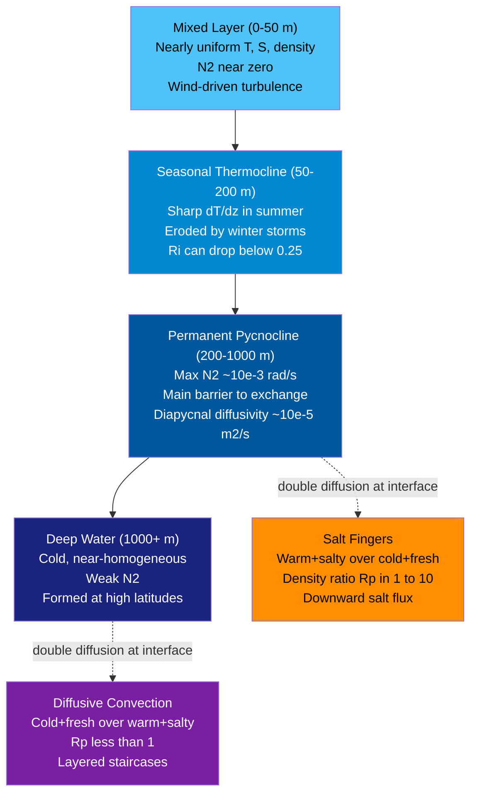

# Ocean Density Stratification and Mixing

> [!abstract] TL;DR
> The ocean is not a well-mixed tank: it is organized into stacked layers of increasing density from surface to abyss, separated by the **pycnocline** — a zone of sharp density gradient that acts as a near-impermeable barrier to vertical exchange. Stability is quantified by the **buoyancy frequency** N (rad/s), whose square N² measures how strongly a displaced parcel is pushed back; turbulent mixing begins when wind-driven shear overcomes this restoring force, captured by the **Richardson number** Ri < 0.25. Even where Ri > 0.25, the unequal molecular diffusivities of heat and salt drive **double diffusion** — either forming downward-draining salt fingers or thin convective staircases — providing a slow but persistent pathway for cross-pycnocline exchange that controls nutrient supply and water-mass transformation on climate timescales.

---

## Intuition

**Analogy:** The ocean is like an oil-and-vinegar salad dressing left to rest in a tall jar. The lighter oil (warm, low-density water) floats unambiguously on top of the denser vinegar (cold, high-density water). You can shake the jar hard — stirring with a spoon (a passing storm) — and temporarily mix them, but within minutes the oil rises back and the layers re-establish themselves. Getting the layers to *stay* mixed requires continuous, vigorous energy input.

In the ocean this restratification is even more stubborn. The enormous heat capacity and slow thermal diffusion of seawater mean the pycnocline, once formed, resists mixing over weeks to millennia. The buoyancy frequency N characterises this resistance: a water parcel displaced vertically oscillates at frequency N if the stratification is stable, and N² measures how much kinetic energy per unit mass per unit displacement it costs to stir the layers together. Turbulent mixing only wins when wind-driven velocity shear tears parcels apart faster than buoyancy can reassemble them — the competition the Richardson number encodes.

---

## How It Works

### Core Mechanics

**1. Density from temperature and salinity.**
Seawater density ρ is set jointly by temperature T, salinity S, and pressure P through the nonlinear equation of state. A linearised form around reference values T₀ = 10°C, S₀ = 35 psu, P₀ = 0 is:

$$\rho \approx \rho_0 \bigl[1 - \alpha(T - T_0) + \beta(S - S_0)\bigr]$$

where α ≈ 2 × 10⁻⁴ K⁻¹ is the thermal expansion coefficient and β ≈ 7.6 × 10⁻⁴ psu⁻¹ is the haline contraction coefficient. In the warm tropics α dominates, so temperature controls density; near the poles T is near freezing and nearly constant, so salinity drives density.

**2. Buoyancy frequency N².**
Taking z as positive upward, a stably stratified ocean has density increasing downward (∂ρ/∂z < 0). The buoyancy frequency squared is:

$$N^2 = -\frac{g}{\rho}\frac{\partial \rho}{\partial z} = g\!\left(\alpha\frac{\partial T}{\partial z} - \beta\frac{\partial S}{\partial z}\right)$$

When N² > 0 the stratification is stable: a displaced parcel oscillates back at frequency N. When N² < 0 the water column is statically unstable and overturns immediately. Typical values: N ~ 10⁻³ rad/s (period ~100 min) in the permanent thermocline; N ~ 10⁻² rad/s in a sharp seasonal thermocline.

**3. Richardson number and shear instability.**
When horizontal currents shear strongly across density interfaces, Kelvin-Helmholtz instabilities can trigger turbulent mixing. The gradient Richardson number compares stabilising buoyancy to destabilising shear:

$$Ri = \frac{N^2}{\left(\partial u / \partial z\right)^2}$$

The Miles (1961) and Howard (1961) theorems prove that a necessary condition for instability is Ri < 1/4. In practice, turbulent mixing commences when Ri falls below ~ 0.25 and fully developed mixing occurs for Ri < 0.1.

**4. Double diffusion.**
Heat diffuses ~100× faster than salt: κ_T ≈ 1.4 × 10⁻⁷ m²/s vs κ_S ≈ 1.1 × 10⁻⁹ m²/s. This disparity drives two distinct instabilities:

- **Salt fingers** — occur when warm, salty water lies above cold, fresh water. Both α∂T/∂z and β∂S/∂z oppose stability, but the density ratio R_ρ = (α ∂T/∂z)/(β ∂S/∂z) ∈ (1, 10) means temperature just barely wins. A displaced parcel loses heat to its surroundings faster than it loses salt, becoming denser and sinking as a narrow "finger." This produces downward salt flux and upward heat flux.

- **Diffusive convection** — occurs when cold, fresh water lies above warm, salty water (common in the Arctic). A parcel displaced downward gains heat rapidly from its surroundings, becomes buoyant, and rises back — but overshoots. The result is thin convective layers separated by sharp diffusive interfaces, forming centimetre-scale staircases visible in microstructure profiles.

**5. Mixed layer dynamics: Kraus-Turner slab model.**
The mixed layer (ML) is the well-stirred surface layer where turbulence from wind and surface cooling homogenises T and S. In the Kraus-Turner (1967) bulk model, ML deepening rate dh/dt is governed by an energy balance: mechanical energy input from wind stress (∝ u*³, where u* is friction velocity) must exceed the potential energy cost of entraining denser water from below:

$$\frac{dh}{dt} \propto \frac{m u_*^3 - B_0 h}{N^2 h^2}$$

where B₀ is the surface buoyancy flux (positive = buoyancy loss = destabilising) and m ≈ 1.25 is an entrainment efficiency parameter. During a storm: large u* deepens the ML. During summer: positive B₀ (solar heating) opposes deepening, and the ML shallows. This simple model captures the seasonal cycle of ML depth to first order.

### Flow / Architecture



---

## Key Concepts / Details

### Secondary Level

**Thermocline, halocline, pycnocline — what is the difference?**

| Layer name | Definition | Where it dominates |
|---|---|---|
| Thermocline | Zone of rapid decrease in T with depth | Tropics and mid-latitudes |
| Halocline | Zone of rapid change in S with depth | Polar oceans, estuaries |
| Pycnocline | Zone of rapid increase in ρ with depth | Universal term; the net result |

In the tropical and subtropical ocean (most of the surface ocean by area), temperature dominates density, so the thermocline and pycnocline nearly coincide. In polar oceans, surface water is near freezing so ΔT is small, and salinity (controlled by ice melt and formation) drives the pycnocline: the halocline is the pycnocline.

**Why tropical surface waters stay persistently warm.**
Solar heating delivers ~150–200 W/m² to the tropical ocean surface. This energy is trapped in the thin mixed layer because the pycnocline beneath acts as a lid — heat cannot diffuse downward fast enough to escape into the deep ocean. The result is the warm pool of the western Pacific (SST > 28°C) that persists year-round and drives the atmospheric circulation above it.

**Seasonal thermocline vs permanent thermocline.**

- *Seasonal thermocline*: forms each spring and summer as solar heating warms the surface layer; the mixed layer shoals and a shallow, sharp ΔT forms at its base. Each autumn, cooling and storms deepen the ML and erode the seasonal thermocline back toward the winter profile.
- *Permanent (main) thermocline*: a deeper (200–1000 m) zone of declining T set by the subduction of subtropical surface water along density surfaces. It persists year-round and on century timescales.

**Polar vs tropical density profiles.**

| Regime | T profile | S profile | Density driver |
|---|---|---|---|
| Tropical | Strong thermocline (warm surface) | Weak halocline | Temperature |
| Subpolar | Weak thermocline (surface near 2–4°C) | Moderate halocline | Mixed T and S |
| Arctic | Almost no thermocline | Strong halocline (freshwater cap from river input and ice melt) | Salinity |

---

### Undergraduate Level

**Full N² derivation including compressibility.**

The full expression for N² uses *potential density* ρ_θ (density at reference pressure P_r = 0) to remove the adiabatic compressibility of seawater:

$$N^2 = -\frac{g}{\rho}\frac{\partial \rho_\theta}{\partial z}$$

Using the linearised EOS this expands to:

$$N^2 = g\!\left(\alpha \frac{\partial T}{\partial z} - \beta \frac{\partial S}{\partial z}\right)$$

Note the sign convention carefully: z is upward, so a stable profile has ∂T/∂z < 0 (T decreasing upward, i.e., colder below) and potentially ∂S/∂z > 0 (saltier below). For the thermally dominated tropical case, α (∂T/∂z) < 0 is the dominant term, and N² > 0 because the whole expression is multiplied by −1 implicitly through the sign of ∂T/∂z.

**Richardson number criterion: Miles (1961) and Howard (1961).**

Miles and Howard independently proved (by normal mode analysis of the Taylor-Goldstein equation) that a *necessary* condition for linear instability of a stratified shear flow is:

$$Ri(z) = \frac{N^2}{(\partial u/\partial z)^2} < \frac{1}{4}$$

somewhere in the flow. This is not *sufficient* — flows with Ri < 0.25 somewhere but Ri > 1/4 elsewhere can still be stable. The criterion is powerful because it is testable from CTD and ADCP data. Observed turbulence events correlate strongly with low-Ri layers.

**Kinetic energy budget of mixing.**

Turbulent kinetic energy (TKE) equation for a stratified flow:

$$\frac{\partial \text{TKE}}{\partial t} = P_s - B_f - \varepsilon$$

where P_s = -⟨u'w'⟩ ∂U/∂z is shear production, B_f = (g/ρ₀) ⟨w'ρ'⟩ is buoyancy flux (positive = restratifying, i.e., a sink of TKE), and ε is viscous dissipation. The flux Richardson number Rf = B_f / P_s is the fraction of shear production that goes into raising potential energy; laboratory measurements give Rf_crit ≈ 0.15–0.20.

**Potential energy cost of mixing (available potential energy, APE).**

Mixing a density interface of thickness δ and density contrast Δρ over area A costs:

$$\Delta \text{APE} = \frac{1}{12} g\, A\, \delta\, (\Delta \rho)\, \delta \propto g\, \Delta \rho\, \delta^2$$

This is the minimum energy needed to homogenise the layer — actual mixing requires more because turbulent cascades waste much energy as heat. The ratio of useful mixing work to total energy dissipated is the **mixing efficiency** Γ ≈ 0.2 (Osborn 1980).

**Salt finger interface layer theory (Schmitt 1994).**

In a finger-favourable interface (warm/salty over cold/fresh), the density ratio R_ρ = (α ΔT)/(β ΔS) parameterises how close the system is to neutral stability (R_ρ → 1). Schmitt (1979, 1994) derives turbulent salt and heat fluxes:

$$F_S = \nu_f \frac{\partial S}{\partial z}, \quad F_T = r\, \nu_f \frac{\partial T}{\partial z}$$

where ν_f is an eddy diffusivity for salt (much larger than κ_S) and r = κ_T/κ_S × (R_ρ)/(1) < 1 is the flux ratio. The key observational signature is that double-diffusive mixing always transports salt *downward* (increasing the vertical salt gradient), whereas diapycnal mixing by turbulence would reduce it.

---

### Graduate Level

**Diapycnal diffusivity and Osborn (1980) mixing efficiency.**

The workhorse parameterisation of turbulent diapycnal (cross-density) mixing is:

$$\kappa_\rho = \Gamma \frac{\varepsilon}{N^2}$$

where ε is the turbulent kinetic energy dissipation rate (W/kg), Γ ≈ 0.2 is the mixing efficiency (Osborn 1980), and κ_ρ has units m²/s. In the open-ocean thermocline: ε ~ 10⁻¹⁰ W/kg, N² ~ 10⁻⁵ rad²/s², giving κ_ρ ~ 10⁻⁵ m²/s — about 100 times the molecular value for heat (κ_T ≈ 1.4 × 10⁻⁷ m²/s) but still extremely small. Near topography (mid-ocean ridges, seamounts, continental slopes) where internal tides break: ε ~ 10⁻⁸ W/kg → κ_ρ ~ 10⁻³ m²/s. Tidal mixing at rough topography is the primary driver of abyssal upwelling in the meridional overturning circulation.

**Microstructure measurements and Thorpe scale.**

Direct measurement of ε requires resolving centimetre-scale velocity fluctuations with free-fall microstructure profilers (e.g., VMP, χ-pod). The inertial sub-range of turbulence gives:

$$\varepsilon = 15 \nu \left\langle \left(\frac{\partial u'}{\partial z}\right)^2 \right\rangle$$

where ν ≈ 10⁻⁶ m²/s is kinematic viscosity and u' is the turbulent velocity. An independent route to ε uses the **Thorpe scale** L_T: sort the observed density profile into a monotonically stable reference profile; the rms of vertical displacements required to sort it is L_T. Empirically L_T ≈ L_O (Ozmidov scale), where:

$$L_O = \left(\frac{\varepsilon}{N^3}\right)^{1/2}$$

So: ε ≈ L_T² N³. Thorpe scales can be computed from standard CTD casts, making them a practical tool even without microstructure profilers.

**Double diffusion flux laws and staircases.**

In regions of active double diffusion (e.g., the tropical North Atlantic salt-finger staircase or the Arctic diffusive staircase under sea ice), the water column exhibits **thermohaline staircases**: layers ~ 5–50 m thick of nearly uniform T and S separated by mm-to-cm interfaces. The staircase structure is maintained because double-diffusive fluxes increase nonlinearly with interface ΔT and ΔS. Schmitt (1994) parametrises the salt-finger contribution to diapycnal salt diffusivity as:

$$\kappa_S^{sf} = \kappa_S^{mol} \times \left[\frac{C}{\ln(R_\rho)}\right]^n, \quad n \approx 6, \quad R_\rho \in (1, 2)$$

This produces κ_S^sf up to 10⁻⁵ m²/s in the subtropical thermocline — comparable in magnitude to turbulent diffusivity, making double diffusion a first-order process for water-mass freshwater budget at those latitudes.

**Tidal mixing geography.**

The global distribution of diapycnal mixing is highly heterogeneous:
- Open-ocean thermocline away from topography: κ_ρ ≈ 0.1–1 × 10⁻⁵ m²/s
- Mid-Atlantic Ridge, Hawaiian Ridge, Luzon Strait: κ_ρ ≈ 10⁻³–10⁻² m²/s (internal tidal beams breaking on slopes)
- Continental shelves and tidal channels: κ_ρ >> 10⁻³ m²/s

Munk and Wunsch (1998) estimated that sustaining the global overturning circulation against diapycnal diffusion requires a globally averaged κ_ρ ≈ 10⁻⁴ m²/s; tidal dissipation (~2.1 TW) and wind-driven near-inertial waves (~0.5 TW) supply most of this.

---

## Python Demo

```python
import numpy as np
import matplotlib.pyplot as plt

# Realistic tropical ocean profiles: T(z), S(z)
z = np.linspace(0, 2000, 500)      # depth in metres (positive downward)

# Temperature: warm surface (~28 degC), sharp thermocline, deep cold (~2 degC)
T = 2.0 + 26.0 * np.exp(-z / 200.0)

# Salinity: slight freshening at surface (rain), subsurface salinity max ~35.5, deep ~34.7
S = 34.7 + 0.8 * np.exp(-((z - 150) / 100)**2) - 0.3 * np.exp(-z / 50)

# Simplified linear equation of state
alpha = 2.0e-4   # thermal expansion (1/degC)
beta  = 7.6e-4   # haline contraction (1/psu)
rho0  = 1025.0   # reference density (kg/m3)
g     = 9.81     # m/s2

rho = rho0 * (1.0 - alpha * (T - 10.0) + beta * (S - 35.0))

# Buoyancy frequency squared N2(z)
# drho/dz with respect to depth (positive downward), so stable means drho_dz > 0
# N2 = (g / rho0) * drho/dz  (positive downward convention)
drho_dz = np.gradient(rho, z)           # d(rho)/d(depth)  [kg/m4]
N2 = (g / rho0) * drho_dz               # rad2/s2 (positive = stable)

# Mixed Layer Depth: density threshold criterion (delta_sigma = 0.03 kg/m3 from surface)
sigma_surface = rho[0] - 1000.0          # potential density anomaly at surface
delta_sigma = 0.03                        # kg/m3 threshold

# Find first depth where sigma exceeds surface value by threshold
below_threshold = (rho - 1000.0) - sigma_surface > delta_sigma
if below_threshold.any():
    MLD_idx = np.argmax(below_threshold)
    MLD = z[MLD_idx]
else:
    MLD = z[-1]

print(f"Mixed Layer Depth (delta_sigma = {delta_sigma} kg/m3 criterion): {MLD:.1f} m")
print(f"Peak N2: {N2.max():.2e} rad2/s2  at depth {z[np.argmax(N2)]:.0f} m")
print(f"Peak N (buoyancy period): {2*np.pi/np.sqrt(N2.max())/60:.1f} min")

# Plotting
fig, axes = plt.subplots(1, 3, figsize=(14, 7), sharey=True)
fig.suptitle("Tropical Ocean Stratification Profile", fontsize=14, fontweight="bold")

# Panel 1: Temperature
axes[0].plot(T, z, color="#e74c3c", lw=2.5)
axes[0].axhline(MLD, color="k", lw=1.5, linestyle="--", label=f"MLD = {MLD:.0f} m")
axes[0].set_xlabel("Temperature (degC)")
axes[0].set_ylabel("Depth (m)")
axes[0].set_title("Temperature T(z)")
axes[0].invert_yaxis()
axes[0].legend()
axes[0].grid(True, alpha=0.3)

# Panel 2: Salinity
axes[1].plot(S, z, color="#3498db", lw=2.5)
axes[1].axhline(MLD, color="k", lw=1.5, linestyle="--", label=f"MLD = {MLD:.0f} m")
axes[1].set_xlabel("Salinity (psu)")
axes[1].set_title("Salinity S(z)")
axes[1].legend()
axes[1].grid(True, alpha=0.3)

# Panel 3: N2 profile
axes[2].plot(N2 * 1e4, z, color="#2ecc71", lw=2.5)
axes[2].axhline(MLD, color="k", lw=1.5, linestyle="--", label=f"MLD = {MLD:.0f} m")
axes[2].axvline(0, color="gray", linestyle=":", lw=1)
axes[2].set_xlabel("N2 (x10^-4 rad2/s2)")
axes[2].set_title("Buoyancy Frequency Squared N2(z)")
axes[2].legend()
axes[2].grid(True, alpha=0.3)

# Annotate pycnocline peak on N2 panel
peak_idx = np.argmax(N2)
axes[2].annotate(
    f"Pycnocline peak\n{z[peak_idx]:.0f} m",
    xy=(N2[peak_idx] * 1e4, z[peak_idx]),
    xytext=(N2[peak_idx] * 1e4 + 0.5, z[peak_idx] + 100),
    arrowprops=dict(arrowstyle="->", color="k"),
    fontsize=9,
)

plt.tight_layout()
plt.show()
```

---

## Real-World Notes

**Mediterranean Sea double-diffusion staircase.**
The Mediterranean outflow into the Atlantic creates a tongue of warm, salty water at ~1000 m depth that underlies cooler, fresher North Atlantic water — ideal conditions for salt fingers. Temperature and salinity microstructure surveys (Schmitt et al. 1987) resolved individual fingers 2–5 cm wide in the C-SALT region of the tropical North Atlantic, with effective salt diffusivities of ~10⁻⁵ m²/s — a factor of 10 above background. The Mediterranean salt lens (meddy) edges show the same staircase structure.

**Arctic thermohaline staircase.**
In the Canada Basin and Eurasian Basin, a strong halocline of river-freshened surface water overlies the Atlantic Water intrusion at ~200–400 m (warm and salty). The cold/fresh over warm/salty configuration drives diffusive convection, producing staircases with step heights of 1–10 m and ΔT ~ 0.02–0.1°C per step. These staircases have persisted for decades and modulate the heat flux from warm Atlantic Water to the overlying sea ice.

**Storm mixing and seasonal ML deepening.**
During autumn storms in the North Atlantic and Southern Ocean, wind stress (τ ~ 1 N/m²) injects TKE into the ML, rapidly eroding the seasonal thermocline. The ML can deepen from 30 m to 150 m in a single storm over 3–5 days. This seasonal deepening entrains nutrient-rich water from the pycnocline, driving the spring phytoplankton bloom when light returns. The exact timing and depth of autumn deepening sets the initial condition for the spring bloom.

**Tropical barrier layer.**
In the western Pacific and Bay of Bengal, heavy rainfall and river discharge create a thin (5–30 m) fresh cap at the very surface that is lighter than the saltier water immediately below — even though the temperature difference is small. This **barrier layer** (the layer between the base of the isothermal ML and the top of the pycnocline) suppresses vertical mixing of heat even when the ML appears thermally homogeneous. It amplifies SST anomalies and affects tropical cyclone intensification.

**Tidal mixing at ridges and seamounts.**
Internal tides generated by barotropic tidal flow over rough topography radiate energy into the interior, eventually breaking where the beam hits a critical slope or a pycnocline. At the Hawaiian Ridge, microstructure surveys show κ_ρ ~ 10⁻³ m²/s within 500 m of the ridge crest — 100× the background value. Globally, this "hot spot" mixing pattern means that abyssal upwelling (the return branch of the overturning circulation) is geographically concentrated near ridges and continental margins, not uniformly distributed.

---

## Common Pitfalls

- **Conflating thermocline with pycnocline** — In the tropical ocean they nearly coincide, so textbooks often use them interchangeably. In polar seas the thermocline is weak or absent, and the pycnocline is driven by the halocline. Always specify which variable you mean when diagnosing stratification.
- **Assuming the pycnocline is impermeable** — The pycnocline suppresses mixing by factors of 10²–10⁴ relative to the ML, but diapycnal diffusivity κ_ρ ~ 10⁻⁵ m²/s is nonzero. Over centuries, substantial heat, salt, and nutrient fluxes cross the pycnocline despite the strong stratification.
- **Confusing N² < 0 with Ri < 0.25** — These are two distinct instability criteria. N² < 0 is *static instability* (overturning convection even without shear); Ri < 0.25 is *shear instability* (Kelvin-Helmholtz) requiring both stratification (N² > 0) and strong vertical shear. A water column can have N² > 0 everywhere but still mix turbulently if Ri is locally small due to strong shear.
- **Ignoring pressure in the EOS for deep water** — The linearised EOS ρ(T, S) is valid only near the surface. For abyssal water masses below ~2000 m, adiabatic compressibility shifts the effective α and β, and potential density must be referenced to the local pressure (using σ₂ or σ₄ rather than σ_θ) to correctly diagnose stability.
- **Treating double diffusion as a laboratory curiosity** — In the subtropical oceans, R_ρ frequently falls in the salt-finger range. Estimated double-diffusive salt fluxes rival turbulent contributions to the freshwater budget of the tropical Atlantic thermocline (Schmitt 1994). Ignoring it in coarse ocean models biases water-mass properties.

---

## Related Concepts

**Same vault — Oceanography:**

- [[Seawater_Properties_and_Equation_of_State]] — the full nonlinear EOS (TEOS-10) that underpins all density and N² calculations; α and β as functions of T, S, P
- [[Temperature_Salinity_Diagrams_and_Water_Masses]] — T-S plots reveal where the pycnocline falls on density surfaces and how water masses are modified by mixing
- [[Turbulence_and_Diapycnal_Mixing]] — deep dive into κ_ρ parameterisations, microstructure profiling, and Osborn-Cox models
- [[Thermohaline_Circulation_and_AMOC]] — the basin-scale overturning that depends on diapycnal mixing to return deep water to the surface; Munk-Wunsch energy budget
- [[Marine_Primary_Production_and_Phytoplankton]] — ML depth and stratification directly control nutrient supply and light availability; the critical depth hypothesis of Sverdrup (1953)
- [[_MOC_Physical_Oceanography]] — section map of all Physical Oceanography notes

**Cross-vault — Physics:**

- [[Fluid_Statics_and_Properties]] — buoyancy force derivation (Archimedes), hydrostatic equation, and the connection between ρ(z) and pressure gradients that underlies N²
- [[Laws_of_Thermodynamics]] — thermodynamic basis for the equation of state and for the energetics of mixing (potential energy, entropy production)
- [[Kinetic_Theory_of_Gases]] — molecular origins of diffusivity κ_T and κ_S and why they differ by a factor of ~100, which is the root cause of double diffusion
- [[Turbulence_and_Instabilities]] — Kelvin-Helmholtz instability mechanics and Richardson number criterion in the general fluid-mechanics context
- [[_MOC_Physics_Master]] — entry point to the full Physics vault

---

## Review Questions

### Secondary Level

1. A CTD cast in the tropical Pacific shows temperature dropping from 28°C at the surface to 5°C at 500 m depth with nearly constant salinity. Where would you place the thermocline, and is this also the pycnocline? In a separate cast from the Arctic, temperature is nearly constant at −1°C throughout, but salinity increases from 28 psu at the surface to 34 psu at 200 m. Where is the pycnocline now, and what is driving it?
2. Explain, without equations, why a strong pycnocline tends to keep tropical surface waters warm year-round. What event could break through the pycnocline and bring cold water to the surface?

### Undergraduate Level

1. Derive the buoyancy frequency N² from the equation of motion for a displaced parcel, stating your assumptions. Why must you use potential density (or equivalently subtract the adiabatic density gradient) rather than in-situ density when computing N² in the deep ocean?
2. A vertical current shear layer has ∂u/∂z = 0.05 s⁻¹ and N² = 4 × 10⁻⁴ rad²/s². Compute Ri. Is this layer stable or unstable to Kelvin-Helmholtz instability? How much would the shear need to increase (keeping N² fixed) to trigger instability?
3. Explain the Kraus-Turner energy balance for mixed layer deepening. During a storm with wind stress τ = 1 N/m² and u* ≈ (τ/ρ)^½ ≈ 0.031 m/s, estimate whether a mixed layer at 40 m depth with N² = 2 × 10⁻⁴ rad²/s² at its base will deepen.

### Graduate Level

1. Osborn (1980) showed that κ_ρ = Γ ε/N². Derive this relation from the TKE budget, defining all terms. What is the physical meaning of Γ, and why does Γ ≈ 0.2 rather than Γ = 1? What happens to Γ in very strongly stratified flows (large N²)?
2. Explain why the differential diffusivity of heat and salt (κ_T >> κ_S) can drive upward heat flux from a cold/fresh layer resting above warm/salty water (diffusive convection). Sketch the expected temperature and salinity staircase profile and describe how the flux ratio r = F_T / F_S relates to κ_T/κ_S and the density ratio R_ρ.
3. Munk and Wunsch (1998) estimated that maintaining the global MOC against diapycnal diffusion requires ~2 TW of mixing energy with globally averaged κ_ρ ~ 10⁻⁴ m²/s. The open-ocean thermocline has κ_ρ ~ 10⁻⁵ m²/s. Discuss what processes could supply the 10× enhanced mixing required, where geographically they act, and what observational evidence supports the tidal mixing hypothesis.

---

## Sources

- Gill, A. E. (1982). *Atmosphere-Ocean Dynamics*. Academic Press. — foundational text on buoyancy frequency, stratification, and internal waves
- Turner, J. S. (1973). *Buoyancy Effects in Fluids*. Cambridge University Press. — definitive treatment of double diffusion, salt fingers, and diffusive convection
- Schmitt, R. W. (1994). Double diffusion in oceanography. *Annual Review of Fluid Mechanics*, 26, 255–285. — comprehensive review of salt-finger theory and observations
- Osborn, T. R. (1980). Estimates of the local rate of vertical diffusion from dissipation measurements. *Journal of Physical Oceanography*, 10, 83–89. — the κ_ρ = Γ ε/N² relation
- Cushman-Roisin, B., & Beckers, J.-M. (2011). *Introduction to Geophysical Fluid Dynamics*. Academic Press. — accessible derivations of N², Richardson number, and mixed layer models
- Miles, J. W. (1961). On the stability of heterogeneous shear flows. *Journal of Fluid Mechanics*, 10, 496–508. — Ri < 1/4 necessary condition theorem
- Munk, W., & Wunsch, C. (1998). Abyssal recipes II: energetics of tidal and wind mixing. *Deep-Sea Research I*, 45, 1977–2010. — global energy budget for diapycnal mixing

---

#Oceanography #PhysicalOceanography #Stratification #Pycnocline #BuoyancyFrequency
