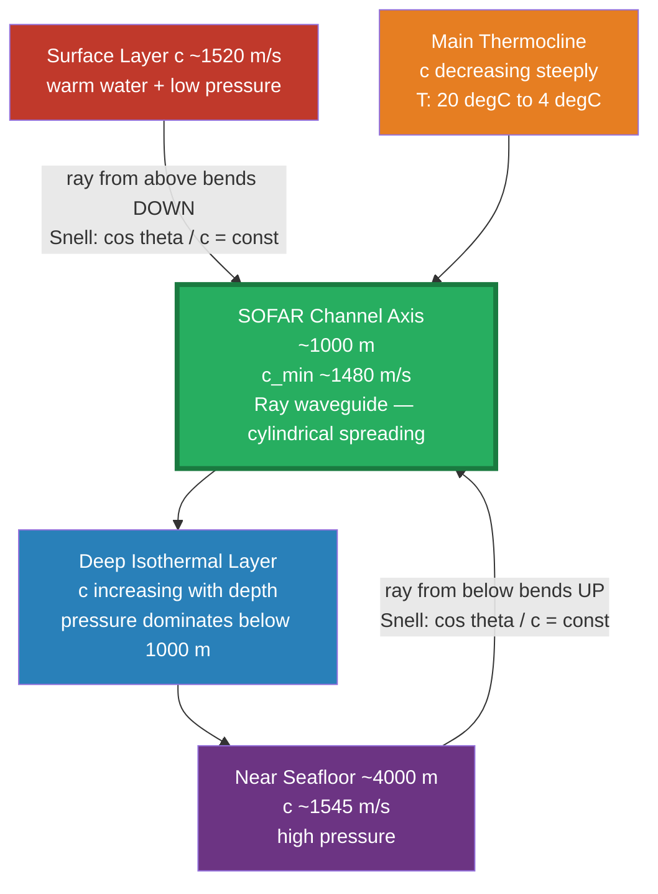

# Ocean Acoustics and Underwater Sound

> [!abstract] TL;DR
> Sound is the dominant long-range information carrier in the ocean: it travels roughly 1500 m/s (four times faster than in air) and, under the right conditions, can propagate thousands of kilometres with remarkably little energy loss. The speed of sound depends on temperature, salinity, and pressure, and their opposing depth gradients create a natural minimum near 1000 m depth called the SOFAR channel, which acts as an underwater waveguide. This physics underpins sonar, acoustic ocean thermometry, military surveillance, whale communication, and the growing problem of anthropogenic noise pollution.

---

## Intuition

**Analogy:** The SOFAR channel is a natural fibre-optic cable buried roughly 1000 m below the ocean surface. Just as a glass fibre guides light by total internal reflection — bouncing it back inward whenever it tries to escape — the ocean guides sound by continuous refraction: any ray that wanders away from the channel axis is bent back toward it, over and over, for thousands of kilometres.

The physics behind the trapping is the same as any wave obeying Snell's law: waves always curve toward regions of lower speed. At the SOFAR axis, sound speed is at a minimum, so rays approaching from above (where the warm surface makes sound faster) curve downward, and rays approaching from below (where high pressure makes sound faster) curve upward. The net effect is an acoustic waveguide that requires no walls.

---

## How It Works

### Sound Speed in Seawater

The simplified Mackenzie (1981) equation captures the three controlling variables:

$$c \approx 1449 + 4.6T - 0.055T^2 + 0.0003T^3 + (1.39 - 0.012T)(S-35) + 0.017z$$

where $c$ is in m/s, $T$ in °C, $S$ in practical salinity units (psu), and $z$ in metres (positive downward). Key sensitivities near typical oceanic values:

| Variable | Sensitivity | Dominant depth zone |
|----------|-------------|---------------------|
| Temperature $T$ | +4.6 m/s per °C | Surface to ~1000 m |
| Salinity $S$ | +1.4 m/s per psu | Surface mixed layer |
| Pressure (depth $z$) | +0.017 m/s per m | Below ~1000 m |

In the upper ocean, temperature dominates and falls steeply through the thermocline, dragging sound speed down. Below ~1000 m, temperature stabilises near 2–4 °C but pressure keeps rising, so sound speed climbs back up. The crossing of these two opposing trends creates the **sound speed minimum** — the SOFAR axis.

### SOFAR Channel Formation

A typical mid-latitude profile has:
- **Surface layer (0–200 m):** $c \approx 1510$–$1530$ m/s, warm water, pressure effect small.
- **Main thermocline (200–1000 m):** temperature plunges from ~20 °C to ~4 °C; $c$ falls to its minimum (~1480 m/s) near 800–1200 m depth.
- **Deep isothermal layer (1000–4000 m):** temperature near-constant, pressure increases linearly; $c$ rises back toward ~1540 m/s at the seafloor.

The depth of minimum sound speed is the **SOFAR axis** (Sound Fixing And Ranging). Rays originating near this depth oscillate about it indefinitely without ever reaching the surface or bottom, avoiding the strong attenuation that comes with each reflection.

### Snell's Law for Ray Bending

For a horizontally stratified ocean, the acoustic equivalent of Snell's law is constant along any ray:

$$\frac{\cos\theta}{c(z)} = \text{const} \equiv \frac{1}{c^*}$$

where $\theta$ is the grazing angle from the horizontal and $c^*$ is the sound speed at the turning depth (where $\theta = 0°$, the ray is horizontal). A ray "turns around" whenever $c(z) = c^*$: it cannot penetrate into water where $c > c^*$. Rays launched with small angles near the SOFAR axis have low $c^*$ close to $c_\text{min}$, so they stay tightly confined; steeper rays have larger $c^*$ and wander farther vertically.

The ray path equations in a range-independent ocean:

$$\frac{dz}{dr} = \tan\theta(r), \qquad \frac{d\theta}{dr} = \frac{1}{c}\frac{dc}{dz}\cos\theta$$

where $r$ is horizontal range. These can be integrated numerically for any $c(z)$ profile.

### Transmission Loss

Total transmission loss (TL) in dB has two components:

$$\mathrm{TL} = \underbrace{20\log_{10}(r)}_{\text{spreading loss}} + \underbrace{\alpha r}_{\text{absorption loss}}$$

- **Spreading loss:** cylindrical spreading in the SOFAR channel gives 10 log(r); spherical spreading near the surface gives 20 log(r). The factor-of-two difference in the exponent is enormous at long range — cylindrical spreading is the reason WWII-era SOFAR bomb signals were detected across entire ocean basins.
- **Absorption loss:** the coefficient $\alpha$ (dB/km) is strongly frequency-dependent. At 100 Hz, $\alpha \approx 0.001$ dB/km; at 10 kHz, $\alpha \approx 1$ dB/km; at 100 kHz, $\alpha \approx 30$ dB/km. This means long-range ocean acoustics is inherently a low-frequency discipline (10 Hz–1000 Hz).

### Convergence Zones

In deep water with no SOFAR trapping, upward-refracting rays from a shallow source can refocus at the surface at ranges of ~50–60 km (the first convergence zone), then again at ~100–120 km, and so on. Each CZ produces an annular region of anomalously high sound intensity — exploited by naval sonar to detect submarines at long range without bottom reflections.

### SOFAR Channel Ray Paths



---

## Key Concepts / Details

### Secondary Level

**Why sound and not light?** In clear ocean water, light attenuates to 1% of its surface intensity within ~100 m; blue light penetrates furthest, but even so, optical communication is useless beyond a few hundred metres. Sound loses less than 1 dB/km at low frequencies, making it the only practical carrier for long-range ocean sensing and communication.

**The four-times rule:** Sound travels roughly 1500 m/s in water versus ~340 m/s in air. This is counterintuitive — denser materials resist deformation, which slows sound — but water is far more incompressible (stiff) than air, and stiffness wins. The bulk modulus of water is ~2.2 GPa versus ~0.0001 GPa for air.

**SOFAR distress system:** During World War II, Ewing and Worzel proposed that downed aviators could drop a small explosive charge (SOFAR bomb) set to detonate at SOFAR depth. Hydrophone arrays on shore could triangulate the position from arrival times. The system was deployed and several pilots were rescued using it; today GPS has made it obsolete for this purpose.

**Sonar basics:** SONAR (Sound Navigation And Ranging) exists in two variants:
- *Active sonar* transmits a pulse (ping) and listens for echoes. Target range = travel time × c / 2.
- *Passive sonar* only listens. It cannot measure range directly but can classify targets by their acoustic signatures.

### Undergraduate Level

**Ray theory (eikonal equation)**

When the wavelength is much shorter than the scale over which $c$ varies (the high-frequency limit), acoustic propagation is described by geometric ray theory. The eikonal equation:

$$|\nabla \tau|^2 = \frac{1}{c^2(\mathbf{x})}$$

where $\tau(\mathbf{x})$ is the travel time (phase) field. Rays are the trajectories orthogonal to surfaces of constant $\tau$, governed by the Hamiltonian ray equations:

$$\dot{\mathbf{x}} = c^2\mathbf{p}, \qquad \dot{\mathbf{p}} = -\frac{\nabla c}{c}$$

with $\mathbf{p} = \nabla\tau$ the slowness vector. Ray theory fails near caustics (where ray density → ∞) and in shadow zones (where no rays reach).

**WKB approximation and normal modes**

At intermediate frequencies, the WKB (Wentzel-Kramers-Brillouin) approximation gives the amplitude variation along a ray in a slowly varying medium. The more powerful normal mode approach decomposes the pressure field as:

$$p(r,z) = \sum_n A_n \psi_n(z) H_0^{(1)}(k_{rn} r)$$

where $\psi_n(z)$ are depth eigenfunctions satisfying a Sturm-Liouville problem determined by $c(z)$, $k_{rn}$ are horizontal wavenumbers, and $H_0^{(1)}$ is the Hankel function (outgoing cylindrical wave). Each mode has a different group velocity; modal dispersion causes a SOFAR signal to arrive as a characteristic swept-frequency pulse called a SOFAR arrival.

**Sonar equation**

For active sonar, the sonar equation in dB:

$$\mathrm{SE} = \mathrm{SL} - 2\,\mathrm{TL} + \mathrm{TS} - (\mathrm{NL} - \mathrm{DI}) - \mathrm{DT}$$

where SL = source level, TL = one-way transmission loss, TS = target strength (echo re-radiation), NL = noise level, DI = directivity index of the receiving array, DT = detection threshold. SE > 0 means the target is detectable. For passive sonar, the TS and return TL terms are absent.

**Frequency-dependent absorption**

The dominant mechanisms are viscous relaxation of MgSO₄ at ~10–100 kHz and boric acid B(OH)₃ at ~1–10 kHz, in addition to the classical shear viscosity term dominant above ~1 MHz. The approximate Francois-Garrison formula for $\alpha$ (dB/km) reproduces measured values well from 0.1 Hz to 1 MHz. The practical consequence: whales and naval systems use < 1 kHz; military sonar up to ~10 kHz; echo-sounders at 12 kHz; ship-mounted fish finders at 38–200 kHz; medical ultrasound at 1–20 MHz.

### Graduate Level

**Normal mode theory and parabolic equation method**

The depth-separated normal mode eigenvalue problem in a range-independent ocean is:

$$\frac{d^2\psi_n}{dz^2} + \left[\frac{\omega^2}{c^2(z)} - k_{rn}^2\right]\psi_n = 0$$

with boundary conditions $\psi_n = 0$ at a pressure-release surface and a continuity condition at the sediment interface. This is a Sturm-Liouville problem; modes are orthonormal and form a complete set. In a range-dependent ocean (seamounts, continental slopes), mode coupling occurs — energy scatters between modes.

For range-dependent problems with gradual variation, the **parabolic equation (PE) method** (introduced by Tappert 1977) splits the Helmholtz equation into forward- and backward-travelling components and drops the backward wave, reducing the 2D elliptic equation to a marching initial-value problem:

$$\frac{\partial u}{\partial r} = \frac{ik_0}{2}\left[\frac{1}{k_0^2}\frac{\partial^2}{\partial z^2} + \frac{k^2(r,z)}{k_0^2} - 1\right]u$$

where $p = u(r,z)e^{ik_0 r}/\sqrt{r}$ and $k_0 = \omega/c_0$ is a reference wavenumber. The PE is solved numerically (split-step Fourier or Padé approximants) and is the workhorse of modern computational ocean acoustics.

**Matched field processing**

By computing the expected pressure field at an array of hydrophones for every candidate source location (the replica vector), and cross-correlating with the measured field, matched field processing (MFP) can localise sources with resolution far below the classical Rayleigh limit. The Bartlett processor:

$$B(\mathbf{x}_s) = \frac{|\mathbf{w}^H\mathbf{d}(\mathbf{x}_s)|^2}{|\mathbf{w}|^2|\mathbf{d}(\mathbf{x}_s)|^2}$$

peaks when the replica $\mathbf{d}$ matches the measured data $\mathbf{w}$. MFP requires accurate knowledge of the sound speed field — environmental mismatch is its Achilles heel.

**Acoustic ocean thermometry (ATOC)**

Since $c$ is sensitive to temperature (dominated by the +4.6T term), a 1 °C warming increases travel time over a 1000 km path by roughly 6 seconds. Munk and Wunsch (1979) proposed using precisely measured travel times of SOFAR-channel acoustic signals as a volumetric thermometer for the deep ocean. The Acoustic Thermometry of Ocean Climate (ATOC) project in the 1990s transmitted 75 Hz signals from a source off California to arrays in Hawaii and the North Pacific, detecting ocean warming trends consistent with climate records.

**CTBTO hydroacoustic network**

The Comprehensive Nuclear-Test-Ban Treaty Organization (CTBTO) operates 11 hydroacoustic stations globally, each with T-phase (oceanic sound converted to seismic at the seafloor) sensors and/or underwater hydrophone arrays in the SOFAR channel. These were designed to detect clandestine nuclear tests, but they continuously record: ship noise, whale calls, submarine volcanic activity, meteor ocean impacts (hydroacoustic "double bang"), and iceberg calving.

---

## Python Demo

```python
import numpy as np
import matplotlib.pyplot as plt

def mackenzie_sound_speed(T, S, z):
    """
    Simplified Mackenzie (1981) sound speed equation.
    T : temperature (deg C)
    S : salinity (psu)
    z : depth (m, positive downward)
    Returns sound speed c (m/s).
    """
    c = (1449.0
         + 4.6   * T
         - 0.055 * T**2
         + 0.0003 * T**3
         + (1.39 - 0.012 * T) * (S - 35.0)
         + 0.017 * z)
    return c

# --- Depth array 0-4000 m ---
z = np.linspace(0, 4000, 800)

# --- Realistic temperature profile ---
# Warm mixed layer (0-100 m), steep thermocline (100-900 m), deep isothermal
def T_profile(z):
    T_surf = 24.0   # deg C  (tropical surface)
    T_deep  = 2.5   # deg C  (abyssal)
    # Logistic drop centred at 500 m, scale ~250 m
    return T_deep + (T_surf - T_deep) / (1.0 + np.exp((z - 500.0) / 200.0))

# --- Realistic salinity profile ---
# Slightly saltier surface (evaporation), small subsurface minimum, deep ~34.7
def S_profile(z):
    return 34.7 + 1.3 * np.exp(-z / 600.0) - 0.2 * np.exp(-((z - 800)**2) / 50000.0)

T = T_profile(z)
S = S_profile(z)
c = mackenzie_sound_speed(T, S, z)

# Locate SOFAR axis
sofar_idx   = np.argmin(c)
sofar_depth = z[sofar_idx]
sofar_c     = c[sofar_idx]

# --- Plot ---
fig, axes = plt.subplots(1, 3, figsize=(13, 7), sharey=True)
fig.suptitle(
    "Typical Tropical Ocean Profile — Mackenzie (1981) Sound Speed",
    fontsize=13, fontweight="bold"
)

# Temperature
ax = axes[0]
ax.plot(T, z, color="#e74c3c", lw=2)
ax.invert_yaxis()
ax.set_xlabel("Temperature (°C)")
ax.set_ylabel("Depth (m)")
ax.set_title("Temperature T(z)")
ax.axhline(sofar_depth, color="navy", ls="--", lw=1.2, alpha=0.6)
ax.grid(alpha=0.3)

# Salinity
ax = axes[1]
ax.plot(S, z, color="#2980b9", lw=2)
ax.set_xlabel("Salinity (psu)")
ax.set_title("Salinity S(z)")
ax.axhline(sofar_depth, color="navy", ls="--", lw=1.2, alpha=0.6)
ax.grid(alpha=0.3)

# Sound speed
ax = axes[2]
ax.plot(c, z, color="#27ae60", lw=2.5, label="c(z)")
ax.axhline(
    sofar_depth, color="navy", ls="--", lw=2,
    label=f"SOFAR axis\nz = {sofar_depth:.0f} m\nc = {sofar_c:.1f} m/s"
)
ax.set_xlabel("Sound Speed (m/s)")
ax.set_title("Sound Speed c(z)")
ax.legend(fontsize=9)
ax.grid(alpha=0.3)

# Annotate contributions on sound speed panel
ax.annotate(
    "Temperature drives\nc down through\nthermocline",
    xy=(c[100], z[100]), xytext=(c[100] - 25, z[100] + 400),
    fontsize=8, color="#c0392b",
    arrowprops=dict(arrowstyle="->", color="#c0392b", lw=1)
)
ax.annotate(
    "Pressure drives\nc up in deep ocean",
    xy=(c[600], z[600]), xytext=(c[600] + 5, z[600] - 500),
    fontsize=8, color="#2980b9",
    arrowprops=dict(arrowstyle="->", color="#2980b9", lw=1)
)

plt.tight_layout()
plt.show()

print(f"SOFAR channel axis: depth = {sofar_depth:.0f} m,  c_min = {sofar_c:.2f} m/s")
print(f"Surface sound speed: {c[0]:.2f} m/s")
print(f"Near-seafloor speed: {c[-1]:.2f} m/s")
```

---

## Real-World Notes

**WWII SOFAR bomb system.** In 1944, Ewing and Worzel demonstrated that a 1-kg explosive detonated at SOFAR depth off the Bahamas was detectable on a hydrophone array in Bermuda, 1900 km away, and on the Canary Islands, 5800 km away. The signal arrived as a characteristic swept-frequency "chirp" caused by modal dispersion — slower (lower-group-velocity) modes arriving after faster ones. The practical rescue system was tested in the Pacific in 1945 and remained operational into the 1960s.

**Acoustic Thermometry of Ocean Climate (ATOC).** Walter Munk and Carl Wunsch formalised acoustic ocean tomography in 1979: transmit precisely timed low-frequency signals across ocean basins and invert the travel-time anomalies for 3D temperature fields. The ATOC project (1990s) used a 75-Hz source moored at 900 m depth off Point Sur, California. Travel-time precision of ~5 ms over 4000 km paths resolved temperature changes of ~0.01 °C, providing some of the cleanest early evidence of basin-scale ocean warming.

**Whale communication.** Blue whales produce calls at 10–40 Hz that can propagate in the SOFAR channel for thousands of kilometres. Before industrial shipping noise (20th century) raised the ambient noise floor by ~20 dB in this band, blue whale calls may have been audible across entire ocean basins, allowing individuals separated by thousands of kilometres to communicate. Fin whales (20 Hz) and sperm whales (clicks, ~2 kHz) also exploit ocean acoustic waveguiding. Humpback whale song is more broadband and typically propagates hundreds to a few thousand kilometres.

**Military sonar and cetacean strandings.** Mid-frequency active sonar (MFAS, 1–10 kHz), primarily used for anti-submarine warfare, has been linked to mass strandings of beaked whales (Mesoplodon, Ziphius) since the 1960s. The leading hypothesis is that intense sound causes nitrogen emboli (acoustically induced decompression sickness) or acoustic trauma to the nasal sacs. In 2000, a NATO exercise near the Bahamas coincided with 17 beaked whale strandings; necropsies showed haemorrhages consistent with acoustic injury. The U.S. Navy now implements geographic and temporal mitigation zones around known whale habitats.

**Underwater noise from shipping.** Modern commercial shipping generates broadband noise peaking below 200 Hz from propeller cavitation and engine machinery. Ship traffic has roughly doubled every decade since 1950. Ambient noise in the 10–100 Hz SOFAR band has increased ~10–12 dB since the 1960s in the North Pacific and North Atlantic — compressing the acoustic communication range of blue and fin whales by an estimated factor of 4–10. Slow-speed zones in critical habitats (e.g., St. Lawrence Seaway for North Atlantic right whales) reduce noise by ~6 dB per halving of ship speed.

---

## Common Pitfalls

- **Assuming sound travels in straight lines underwater.** In air at short range this is often a good approximation. In the ocean, continuous refraction due to the $c(z)$ gradient makes ray paths constantly curved. A hydrophone 1 km away horizontally and 200 m deeper than the source may lie in a complete shadow zone even in perfectly clear water.

- **Confusing acoustic shadow zones with silence.** A shadow zone is a region where no geometric rays arrive from the source — but it is not silent. Diffraction, scattered energy, and normal modes with evanescent tails all deposit some acoustic energy there. The intensity is reduced, not zero. Treating shadow zones as zero-energy regions leads to dangerously optimistic sonar range predictions.

- **Mixing up 20 log vs. 10 log conventions for transmission loss.** Acoustic intensity follows $I \propto r^{-2}$ for spherical spreading, giving TL = $10\log_{10}(r^2)$ = $20\log_{10}(r)$ dB. Because sonar equations are traditionally written in terms of pressure (which scales as $r^{-1}$), the factor is 20. Power levels use 10 log. Getting the factor wrong by 2 means a 40 dB error over 10 km — the difference between "definitely detectable" and "completely inaudible."

- **Ignoring the frequency dependence of absorption.** Students often treat $\alpha$ as a constant. At 100 Hz the absorption is $\sim$0.001 dB/km; at 10 kHz it is $\sim$1 dB/km — a thousand-fold difference. A system designed at one frequency can completely fail if operated at another.

- **Treating the SOFAR axis depth as fixed.** The SOFAR axis depth varies from ~150 m in the Arctic (near-surface temperature minimum) to ~1200 m in subtropical gyres. Polar oceans do not have a classical SOFAR channel bounded below because the temperature minimum is at the surface; sound may channel at the surface or reflect off ice. Applying a mid-latitude SOFAR model to polar acoustics produces large errors.

---

## Related Concepts

**Same vault:**
- [[Seawater_Properties_and_Equation_of_State]] — the equation of state ties temperature, salinity, and pressure to density; the same variables control sound speed through the Mackenzie formula.
- [[Density_Stratification_and_Mixing]] — the thermocline that drives sound speed gradients is maintained by the same stratification that inhibits vertical mixing; both topics share the Brunt-Väisälä frequency as a governing parameter.
- [[Ocean_Optics_and_Light_Penetration]] — contrasts with acoustics: light attenuates exponentially within the photic zone (~200 m), while sound propagates globally via the SOFAR channel.
- [[_MOC_Physical_Oceanography]] — section map; acoustic methods underpin temperature measurement, seafloor mapping, and current profiling (acoustic Doppler current profilers).

**Cross-vault:**
- [[Wave_Motion_and_Properties]] — the wave equation, Snell's law, group/phase velocity, and ray theory apply identically to acoustic and electromagnetic waves; the ocean merely provides an unusual inhomogeneous medium.
- [[Electromagnetic_Waves_and_Radiation]] — contrasting carrier: electromagnetic waves are used for above-water remote sensing (radar, satellite altimetry) but attenuate too rapidly in seawater for long-range propagation.
- [[Fourier_Transform]] — normal mode decomposition and the spectral analysis of SOFAR arrivals both rest on Fourier/eigenfunction expansions; matched field processing uses coherent cross-spectral matrices.
- [[_MOC_Physics_Master]] — fluid acoustics, wave theory, thermodynamics of the ocean, and the equations of motion for sound all trace back to physics fundamentals.
- [[_MOC_SS_Master]] — the parabolic equation method, filter theory for sonar signal processing, and spectral estimation for passive sonar all draw on continuous-time signals and systems theory.

---

## Review Questions

### Secondary Tier

1. Sound travels roughly 4× faster in water than in air, yet water is ~800× denser. Why does denser water support faster sound? What material property dominates?
2. A SOFAR bomb is dropped in the middle of the Atlantic Ocean. An observer's hydrophone at SOFAR depth is 5000 km away, and another is 5000 km away but at 50 m depth (surface). Which receives the signal first, which has higher intensity, and which has better signal-to-noise? Explain using the SOFAR channel concept.
3. Why do whales communicate at very low frequencies (10–200 Hz) rather than, say, 10 kHz like dolphins? What changes physically at higher frequencies?

### Undergraduate Tier

1. The sound speed profile in a region is approximately $c(z) = 1480 + 0.016z$ m/s (pure pressure effect, uniform cold water). A ray is launched horizontally from a source at 500 m depth. Does it bend upward, downward, or travel straight? Using Snell's law ($\cos\theta/c = \text{const}$), find the turning depth if the ray is instead launched at a 5° downward angle.
2. Transmission loss over 100 km at 100 Hz is approximately $20\log_{10}(10^5) + 0.001 \times 100 = 100.1$ dB (spherical spreading + absorption). At 10 kHz the absorption term becomes $1.0 \times 100 = 100$ dB alone. What does this tell you about the practical upper frequency limit for basin-scale ocean acoustics? How does the SOFAR channel change the spreading-loss term?
3. An active sonar has SL = 220 dB re 1 µPa@1m, TS = −20 dB, NL = 65 dB, DI = 20 dB, DT = 10 dB. Using the sonar equation, what is the maximum one-way range in km at which the target is detectable, assuming spherical spreading and negligible absorption?

### Graduate Tier

1. In the normal mode decomposition of the pressure field, each mode $\psi_n(z)$ propagates with horizontal wavenumber $k_{rn}$. Show that the group velocity of mode $n$ is $v_{gn} = d\omega/dk_{rn}$ and explain why this causes a broadband SOFAR pulse to arrive as a chirp (swept-frequency signal) spread over many seconds. How would you use this dispersive arrival to estimate range without knowing the source time?
2. The ATOC acoustic thermometry experiment achieved travel-time precision of ~5 ms over a 3876 km North Pacific path at 75 Hz. Given that $\partial c/\partial T \approx 4$ m/s per °C and the SOFAR channel is ~1000 m thick, estimate the ocean-average temperature change that would produce a 5 ms travel-time anomaly. How does this compare to the secular ocean warming signal over the 1990s?
3. Matched field processing correlates a measured pressure field at a vertical array with replica vectors computed from an ocean acoustic model. Explain why environmental mismatch (errors in the assumed sound speed profile) degrades MFP more severely than it degrades simple plane-wave beamforming. What strategies (focalization, sequential inversion) are used to mitigate this?

---

## Sources

- Urick, R.J. *Principles of Underwater Sound*, 3rd ed. McGraw-Hill, 1983. — The canonical engineering reference; covers sonar equations, ambient noise, TL, and propagation in full practical detail.
- Munk, W., Worcester, P., and Wunsch, C. *Ocean Acoustic Tomography*. Cambridge University Press, 1995. — Definitive treatment of acoustic thermometry, travel-time inversion, and ATOC; also contains excellent chapters on SOFAR physics.
- Jensen, F.B., Kuperman, W.A., Porter, M.B., and Schmidt, H. *Computational Ocean Acoustics*, 2nd ed. Springer, 2011. — Graduate-level; covers normal modes, PE method, ray theory, and matched field processing with numerical codes.
- Mackenzie, K.V. "Nine-term equation for sound speed in the oceans." *Journal of the Acoustical Society of America* 70(3): 807–812, 1981. — Source of the simplified formula used throughout this note.
- Ewing, M. and Worzel, J.L. "Long-range sound transmission." *Geological Society of America Memoir* 27, 1948. — Original SOFAR paper; remarkably readable account of the discovery and its wartime applications.

---

#Oceanography #PhysicalOceanography #OceanAcoustics #SOFAR
