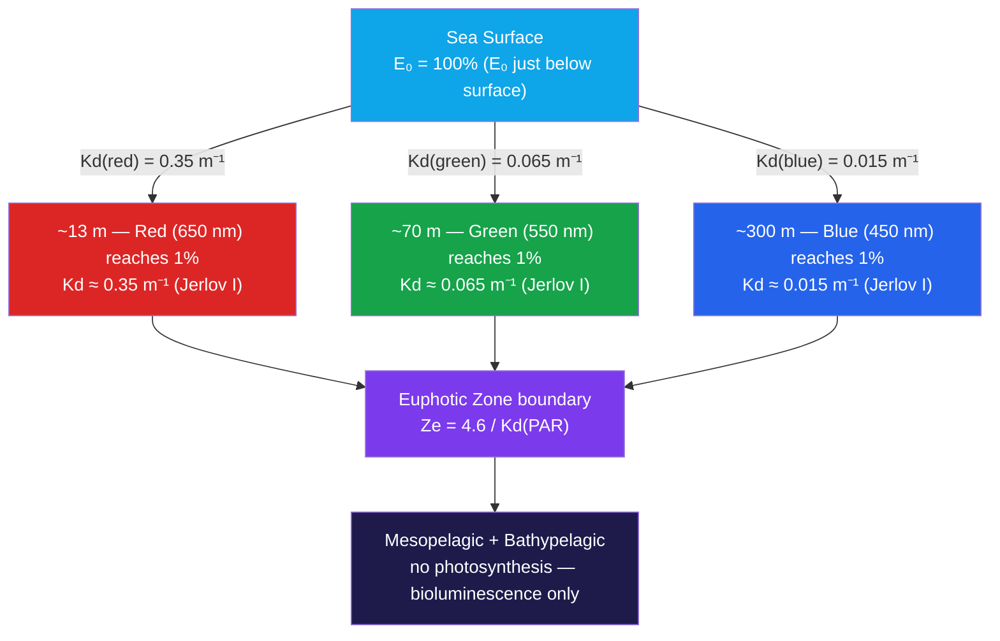

# Ocean Optics and Light Penetration

> [!abstract] TL;DR
> Sunlight penetrating the ocean is selectively attenuated by wavelength: red disappears within 10–15 m, green survives to ~80 m, and blue reaches 200 m or more in the clearest water. The governing law is the **Beer-Lambert equation** — irradiance decays exponentially with depth at a rate set by the **diffuse attenuation coefficient Kd (m⁻¹)**, which integrates both absorption and scattering by water, phytoplankton, dissolved organics, and sediment. The **euphotic zone** — where enough light remains for net photosynthesis — extends to the depth Ze = 4.6/Kd, ranging from ~270 m in oligotrophic open ocean to under 10 m in turbid estuaries. Satellite ocean-color sensors (MODIS, SeaWiFS, PACE) invert the spectral water-leaving radiance to retrieve chlorophyll and Kd globally, linking ocean optics to primary production estimates and carbon cycle monitoring.

---

## Intuition

**Analogy:** The ocean is a natural color filter stacked in layers. Dip a white plate into the water and within 2 m it looks slightly yellow-green; by 20 m it looks blue-green; below 100 m it is a uniform, ghostly blue. Red and orange wavelengths are absorbed so rapidly that underwater photographs taken without artificial light look monochromatic blue even in shallow reefs. The deeper you go, the more the spectrum has been stripped from white sunlight, leaving only the blue that water absorbs least readily.

This color-filtering behavior is not gradual and linear — it is *exponential*. Each additional meter of water removes the same *fraction* of the remaining light, not the same *amount*. Double the depth and you square the attenuation ratio. The color shift from white to blue happens abruptly in the first 10 m; what changes slowly below that is simply the brightness — until everything goes dark.

---

## How It Works

### Core Mechanics

**Beer-Lambert Law.** The downwelling irradiance at depth z (m) is:

$$E(z) = E_0 \cdot \exp(-K_d \cdot z)$$

where:
- $E_0$ = irradiance just below the surface (W m⁻² or µmol photons m⁻² s⁻¹)
- $K_d$ = diffuse attenuation coefficient (m⁻¹), wavelength-dependent
- $z$ = depth (m, positive downward)

The coefficient $K_d$ is not a property of the water alone — it also depends on the direction of the light field (solar angle, sky conditions) — making it an **apparent optical property (AOP)** rather than an intrinsic material constant.

**Inherent vs Apparent Optical Properties.**

| Category | Symbol | Definition | Example |
|---|---|---|---|
| IOP — Absorption | $a(\lambda)$ | Energy removed from beam, not re-emitted as light (m⁻¹) | Pure water, chlorophyll |
| IOP — Scattering | $b(\lambda)$ | Energy redirected without loss (m⁻¹) | Particles, bubbles |
| IOP — Attenuation | $c(\lambda) = a(\lambda) + b(\lambda)$ | Total removal from beam direction (m⁻¹) | Sum of above |
| AOP — Diffuse attenuation | $K_d(\lambda)$ | Net downwelling decay rate including multiple scattering (m⁻¹) | Measured from irradiance profiles |
| AOP — Reflectance | $R(\lambda)$ | Ratio of upwelling to downwelling irradiance | Determines ocean color |
| AOP — Radiance | $L_u(\lambda)$ | Upwelling radiance seen by satellite sensor | Ocean color signal |

The relationship between IOPs and AOPs is not algebraic — it requires solving the **radiative transfer equation**. As a practical approximation, $K_d \approx a + b(1 - \bar{\mu})$ where $\bar{\mu}$ is the mean cosine of the underwater light field.

**Euphotic Zone Depth Ze.** Defined as the depth where PAR falls to 1% of its surface value (the compensation depth for most phytoplankton):

$$1\% = e^{-K_d \cdot Z_e} \Rightarrow Z_e = \frac{\ln(100)}{K_d} = \frac{4.6}{K_d}$$

**Secchi Depth Zs.** The depth at which a white Secchi disk just disappears from view, empirically related to $K_d$ by:

$$Z_s \approx \frac{1.7}{K_d}$$

This is an AOP that integrates roughly over the PAR band. The rule-of-thumb Ze ≈ 2.7 × Zs holds in many open-ocean waters but breaks down in turbid coastal zones.

**PAR — Photosynthetically Active Radiation.** The 400–700 nm waveband that phytoplankton can use for photosynthesis. PAR is not all of solar radiation (which extends from ~300 nm UV to >2500 nm NIR); the portion outside 400–700 nm is irrelevant to photosynthesis and is absorbed or reflected near the surface regardless.

**Jerlov Water Type Classification.** Niels Jerlov (1976) measured spectral irradiance profiles across ocean basins and classified waters by optical clarity. The system has two series:

| Type | Setting | Kd(PAR) (m⁻¹) | Ze (m) | Zs (m) | Description |
|---|---|---|---|---|---|
| I | Clearest open ocean | ~0.017 | ~270 | ~100 | Sargasso Sea, gyres |
| IA | Clear open ocean | ~0.025 | ~185 | ~70 | Tropical Pacific |
| IB | Moderately clear | ~0.055 | ~84 | ~31 | Subtropical seas |
| II | Slightly productive | ~0.080 | ~58 | ~21 | Temperate open ocean |
| III | Moderately productive | ~0.120 | ~38 | ~14 | Upwelling margins |
| Coastal 1 | Clear coastal | ~0.15 | ~31 | ~11 | Coastal oligotrophic |
| Coastal 3 | Moderate coastal | ~0.35 | ~13 | ~5 | Productive shelf |
| Coastal 9 | Turbid coastal/estuarine | >2.0 | <2 | <1 | Estuaries, glacial fjords |

**Satellite Ocean Color.** Satellites measure the water-leaving radiance $L_w(\lambda)$ at the sea surface in multiple spectral bands. The ratio of blue (443 nm) to green (555 nm) radiance correlates with chlorophyll concentration (which absorbs strongly at blue and red wavelengths). The OC4v4 algorithm gives:

$$\log_{10}[\text{Chl}] = a_0 + a_1 X + a_2 X^2 + a_3 X^3 + a_4 X^4$$

where $X = \log_{10}(\max[R_{rs}(443), R_{rs}(490), R_{rs}(510)] / R_{rs}(555))$ and $a_i$ are empirically tuned coefficients. This legacy relationship from Gordon, Clark, and Morel (1977–1988) underpins global primary production estimates derived from MODIS, SeaWiFS, and now the hyperspectral PACE mission.

### Flow / Architecture



---

## Key Concepts / Details

### Secondary Level

- **Why the underwater world looks blue.** Water absorbs red, orange, and yellow wavelengths strongly and within the first 10–30 m. What remains — and what scatters back to your eye — is blue. A diver at 20 m without a torch sees a world that is uniformly blue-green because only those wavelengths are left in the light field.
- **Why the seafloor is dark.** Below ~200 m even in the clearest ocean, less than 1% of surface light survives. Below ~1000 m (the top of the bathypelagic zone), the ocean is in perpetual darkness. The only light is bioluminescence — chemical light produced by organisms themselves.
- **Why coral reefs need shallow water.** Reef-building corals host symbiotic algae (zooxanthellae) that photosynthesize and fuel coral growth. That photosynthesis demands enough light, which restricts healthy coral growth to roughly the top 30–50 m. This is why the most biodiverse reef zones hug shallow slopes and platforms.
- **Secchi disk.** A white or black-and-white disk lowered on a rope until it just disappears. The depth at which it vanishes gives a simple field measure of water clarity, used for centuries before electronic sensors. Shallower Secchi depth means more turbid water.
- **What makes coastal water green or brown.** River runoff carries soil particles and dissolved organic matter (colored dissolved organic matter, CDOM) that absorb blue light and scatter green. The result is water that looks green or yellowish-brown, unlike the deep blue of the open ocean.

### Undergraduate Level

**Radiative Transfer Equation (simplified).** The full description of the light field uses the specific intensity $L(\mathbf{r}, \hat{\Omega}, \lambda)$ (radiance in direction $\hat{\Omega}$ at position $\mathbf{r}$). Along a ray:

$$\frac{dL}{ds} = -c(\lambda) L + \int_{4\pi} L(\hat{\Omega}') \beta(\hat{\Omega}' \to \hat{\Omega}) d\Omega' + \text{bioluminescence terms}$$

where $c = a + b$ is the beam attenuation coefficient and $\beta$ is the volume scattering function. $K_d$ emerges when this is integrated over the downward hemisphere and approximated for a nearly diffuse field.

**Spectral absorption budget.** $K_d(\lambda)$ reflects contributions from all absorbers:

$$K_d(\lambda) \approx K_w(\lambda) + K_{chl}(\lambda) + K_{CDOM}(\lambda) + K_{NAP}(\lambda)$$

where:
- $K_w$ = pure water absorption (large in red: ~0.3 m⁻¹ at 675 nm; small in blue: ~0.005 m⁻¹ at 450 nm)
- $K_{chl}$ = chlorophyll + accessory pigments (blue and red peaks near 443 nm and 676 nm)
- $K_{CDOM}$ = colored dissolved organic matter (strongly absorbs UV and blue, decays exponentially with wavelength)
- $K_{NAP}$ = non-algal particles (sediment; relatively wavelength-independent)

**Why chlorophyll-rich water appears green.** Chlorophyll a absorbs strongly at 443 nm (blue) and 676 nm (red), but weakly at 550–570 nm (green). In phytoplankton-rich water, blue and red are consumed by photosynthesis; the unabsorbed green scatters back up, shifting the ocean's apparent color from blue to green.

**PAR vs total solar radiation.** Solar irradiance at the sea surface spans ~300–2500 nm; PAR (400–700 nm) represents roughly 43% of total solar energy. The 300–400 nm UV band is ecologically important for DNA damage and CDOM bleaching but cannot drive photosynthesis. Radiometry in biological oceanography always uses PAR (µmol photons m⁻² s⁻¹) rather than total solar flux (W m⁻²).

**Irradiance decay at specific wavelengths — representative Kd values:**

| Wavelength | Color | Pure water $K_w$ (m⁻¹) | Jerlov I $K_d$ (m⁻¹) | Jerlov III $K_d$ (m⁻¹) |
|---|---|---|---|---|
| 450 nm | Blue | ~0.005 | ~0.015 | ~0.11 |
| 550 nm | Green | ~0.053 | ~0.065 | ~0.18 |
| 650 nm | Red | ~0.350 | ~0.35 | ~0.45 |

### Graduate Level

**Monte Carlo radiative transfer.** The most accurate simulations (e.g. Hydrolight, by Mobley) solve the radiative transfer equation using Monte Carlo methods — tracking photon trajectories through a medium with wavelength-dependent IOPs. Each photon undergoes absorption, scattering (with directional redistribution governed by the Petzold phase function), and surface transmission. Hydrolight uses a two-flow / invariant embedding approach to produce accurate Kd, R, and radiance distributions for complex optical environments.

**Case 1 vs Case 2 waters.** Morel and Prieur (1977) divided ocean waters into:
- **Case 1:** optical properties co-vary with phytoplankton (open ocean); chlorophyll is the master variable and CDOM co-varies with it.
- **Case 2:** independent contributions from CDOM, sediment, and phytoplankton (coastal, estuarine); chlorophyll alone cannot predict $K_d$.

Most satellite ocean-color algorithms are calibrated for Case 1 water and fail in Case 2 coastal environments, which require semi-analytical inversions (e.g. QAA — Quasi-Analytical Algorithm) that separately retrieve $a$, $b_b$, and chlorophyll.

**CDOM and its spectral signature.** CDOM (also called "yellow substance" or gelbstoff) absorbs strongly in the UV and blue, with an approximately exponential spectral shape:

$$a_{CDOM}(\lambda) = a_{CDOM}(\lambda_0) \cdot \exp[-S(\lambda - \lambda_0)]$$

where the spectral slope $S \approx 0.010$–$0.025$ nm⁻¹. Freshwater-derived CDOM (rivers) has low $S$ and high absorption; photo-oxidized oceanic CDOM has high $S$ and lower absorption.

**Hyperspectral ocean color (PACE mission).** NASA's PACE satellite (launched February 2024) carries the OCI instrument, measuring ocean-leaving radiance at 5 nm spectral resolution across 340–890 nm. This hyperspectral capability resolves individual phytoplankton pigment absorption peaks (allowing phytoplankton community composition retrieval) and separates CDOM, NAP, and chlorophyll contributions that cannot be distinguished from 5–7-band sensors like MODIS.

**Non-algal particle (NAP) optical properties.** Mineral sediment particles scatter efficiently and absorb weakly with a spectrally flat signature. In resuspended sediment zones (continental shelves during storms), NAP can dominate $K_d$ and make the spectral signal nearly featureless — the worst-case scenario for ocean-color algorithms seeking biological information.

---

## Python Demo

```python
# Beer-Lambert spectral irradiance vs depth in Jerlov Type I and Type III waters.
# Shows wavelength-dependent attenuation and different euphotic depths.
import numpy as np
import matplotlib.pyplot as plt

# Diffuse attenuation coefficients Kd (m^-1) at three wavelengths
# Jerlov Type I (clearest open ocean, Sargasso Sea)
kd_type1 = {450: 0.015, 550: 0.065, 650: 0.35}   # blue, green, red
# Jerlov Type III (moderately productive open ocean)
kd_type3 = {450: 0.11,  550: 0.18,  650: 0.45}

colors = {450: "#2563eb", 550: "#16a34a", 650: "#dc2626"}   # blue, green, red
labels = {450: "450 nm (blue)", 550: "550 nm (green)", 650: "650 nm (red)"}

depth = np.linspace(0, 200, 500)   # 0 to 200 m

# PAR-integrated Kd (approximate, weighted mean over 400-700 nm)
kd_par_type1 = 0.017    # m^-1
kd_par_type3 = 0.120    # m^-1

euphotic_type1 = 4.6 / kd_par_type1
euphotic_type3 = 4.6 / kd_par_type3
secchi_type1   = 1.7 / kd_par_type1
secchi_type3   = 1.7 / kd_par_type3

print(f"Jerlov Type I  — Ze = {euphotic_type1:.0f} m,  Zs = {secchi_type1:.0f} m")
print(f"Jerlov Type III — Ze = {euphotic_type3:.0f} m,  Zs = {secchi_type3:.0f} m")

fig, axes = plt.subplots(1, 2, figsize=(13, 5), sharey=False)
titles = ["Jerlov Type I (clearest open ocean)", "Jerlov Type III (moderately turbid)"]
kd_sets = [kd_type1, kd_type3]
ze_vals = [euphotic_type1, euphotic_type3]

for ax, kd_set, title, ze in zip(axes, kd_sets, titles, ze_vals):
    for wl, kd in kd_set.items():
        irrad = np.exp(-kd * depth) * 100.0   # as percent of surface value
        ax.plot(irrad, depth, color=colors[wl], lw=2.2, label=labels[wl])

    # 1% light level (euphotic zone boundary based on PAR-integrated Kd)
    ax.axhline(ze, color="#7c3aed", lw=1.5, ls="--",
               label=f"Euphotic depth Ze = {ze:.0f} m (PAR 1%)")
    ax.axvline(1, color="gray", lw=1, ls=":")

    ax.set_xlabel("Irradiance (% of surface value)")
    ax.set_ylabel("Depth (m)")
    ax.set_title(title)
    ax.invert_yaxis()
    ax.set_xlim(-2, 105)
    ax.legend(fontsize=9)
    ax.grid(alpha=0.25)

plt.suptitle("Beer-Lambert spectral irradiance decay: E(z) = E₀ · exp(−Kd · z)", fontsize=12)
plt.tight_layout()
plt.savefig("ocean_optics_irradiance.png", dpi=120)
plt.show()
```

Expected output: In Jerlov Type I (left panel), blue light remains above 1% to ~300 m, green to ~70 m, and red falls to 1% within 13 m. The euphotic depth (purple dashed line) sits at ~270 m. In Jerlov Type III (right panel), even blue light is attenuated to 1% by ~42 m, green by ~26 m, and red by ~10 m, with a euphotic depth of ~38 m. The contrast between the two panels illustrates how a factor-of-7 change in Kd(PAR) compresses the euphotic zone from oligotrophic to productive waters.

---

## Real-World Notes

- **MODIS and SeaWiFS global primary production.** The standard VGPM (Vertically Generalized Production Model, Behrenfeld & Falkowski 1997) takes MODIS chlorophyll, sea-surface temperature, and PAR to compute depth-integrated primary production globally at ~9 km resolution. Ocean optics — specifically the Kd-derived euphotic depth — is a core input: $\int_0^{Z_e} Chl(z) \cdot P^B_{opt}(T) dz$. Current global marine NPP is estimated at ~50–60 PgC yr⁻¹, entirely dependent on accurate ocean-color retrievals.
- **Sargasso Sea.** Among the clearest natural waters on Earth. Kd(490) ≈ 0.020 m⁻¹, euphotic depth ~200–250 m, Secchi depth ~60–70 m. This ultra-oligotrophic gyre has extremely low chlorophyll (~0.05 mg m⁻³), which is why it is so transparent. The BATS (Bermuda Atlantic Time-series Study) site has measured light profiles here continuously since 1988.
- **Great Barrier Reef.** Reef-building coral requires a minimum of ~1–3% of surface PAR for their symbiotic zooxanthellae. On the outer GBR shelf where Kd ≈ 0.07–0.10 m⁻¹, this limits healthy coral to ~15–30 m depth. On the turbid inner shelf (river runoff, resuspended sediment, Kd ≈ 0.5 m⁻¹), the euphotic zone barely reaches 5–10 m — a major stress driver for inshore reefs.
- **Turbid coastal waters and estuaries.** In river plumes (e.g. Amazon, Mississippi), CDOM and sediment push Kd to 1–5 m⁻¹. The euphotic zone may be only 1–4 m deep — thinner than the mixed layer — causing phytoplankton to spend much of their time below the compensation depth. These optically extreme Case 2 waters are a standing challenge for satellite ocean-color algorithms.
- **Bioluminescence.** Below the euphotic zone, all detectable light is biological in origin. Dinoflagellates produce blue flashes (~480 nm) when disturbed by a breaking wave or ship's bow; anglerfish lure prey with bacterial bioluminescence; the majority of deep-sea animals produce bioluminescent signals for communication, camouflage (counterillumination), and predation. The mesopelagic zone (200–1000 m) is not truly dark — it is lit by a diffuse, species-rich bioluminescent light field, but at intensities ~10⁸–10¹⁰ times lower than surface sunlight.
- **PACE mission (2024).** NASA's Plankton, Aerosol, Cloud, ocean Ecosystem (PACE) satellite carries the first ocean-color instrument with full UV–NIR hyperspectral coverage (340–890 nm at 5 nm resolution). The preliminary data are already revealing phytoplankton community structure and CDOM sources invisible to MODIS, opening a new era of quantitative ocean biogeochemistry from space.

---

## Common Pitfalls

- **Confusing beam attenuation c with diffuse attenuation Kd.** The beam attenuation coefficient $c = a + b$ describes how a narrow, collimated beam (like a transmissometer beam) decays. The diffuse attenuation coefficient $K_d$ describes how the total downwelling irradiance decays in the real, multiply-scattered underwater light field. In turbid water where strong scattering redistributes photons back into the downward hemisphere, $K_d$ can be substantially smaller than $c$. Using $c$ in the Beer-Lambert equation to predict depth-integrated irradiance gives nonsense.
- **Assuming Ze = 2.7 × Zs universally.** The ratio of euphotic depth to Secchi depth (~2.7 in open ocean) breaks down in CDOM-rich or highly scattering coastal waters, where the Secchi disk responds differently to the optical mix. In some turbid estuaries the ratio can be as low as 1.5 or as high as 5.0. Always use a Kd profile or PAR sensor for reliable euphotic depth in coastal waters.
- **Treating PAR as equivalent to total solar radiation.** PAR (400–700 nm) is only about 43% of total solar energy reaching the sea surface. The near-infrared (700–2500 nm) is absorbed in the top few centimetres of the ocean and heats the surface without driving photosynthesis. Mixing PAR irradiance (µmol photons m⁻² s⁻¹) with total solar irradiance (W m⁻²) is a unit error that propagates badly into productivity models. Conversion is approximately 1 W m⁻² of PAR ≈ 4.57 µmol photons m⁻² s⁻¹.
- **Using a single scalar Kd for the whole water column.** Kd varies with depth because the solar zenith angle, the relative contribution of direct vs diffuse sky irradiance, and the phytoplankton distribution all change. In a deep chlorophyll maximum (DCM), Kd increases sharply at that layer. Assuming a constant Kd from surface to Ze underestimates light availability near the DCM.
- **Ignoring the distinction between downwelling irradiance Ed and PAR.** Ed is the total downwelling irradiance (W m⁻² or spectrally resolved). PAR integrates only 400–700 nm. Kd(PAR) is not the same as Kd measured at a single wavelength (e.g. Kd(490), commonly reported from satellites). Kd(490) is convenient for algorithms and correlates with Kd(PAR), but they are not interchangeable in productivity calculations.

---

## Related Concepts

**Same vault:**
- [[Marine_Primary_Production_and_Phytoplankton]] — ocean optics directly sets the light environment that governs where and how fast phytoplankton photosynthesize; Kd(PAR) and Ze are primary inputs to every production model.
- [[Density_Stratification_and_Mixing]] — the mixed layer depth and the euphotic depth must be compared to understand whether phytoplankton spend enough time in the light; stratification isolates the euphotic zone from deep nutrients.
- [[Ocean_Acoustics_and_Underwater_Sound]] — the electromagnetic (optical) and acoustic properties of seawater are shaped by the same water-mass structure, but via entirely different physical mechanisms; comparison of acoustic and optical remote sensing.
- [[Coral_Reefs_and_Tropical_Marine_Ecosystems]] — reef biogeography is directly constrained by the euphotic depth and Kd, which determine whether zooxanthellae can receive enough PAR to sustain calcification.
- [[Ocean_Observing_Systems_and_Remote_Sensing]] — the satellite platforms (MODIS, SeaWiFS, PACE) that carry ocean-color sensors, their algorithms, and their validation against in-situ optics.
- [[_MOC_Physical_Oceanography]] — section map for physical oceanography; light is a fundamental forcing for upper-ocean biology and air–sea gas exchange.

**Cross-vault:**
- [[Electromagnetic_Waves_and_Radiation]] — the physical nature of the photons being attenuated; the wavelength-dependent interaction of EM radiation with matter underlies all spectral selective absorption.
- [[Atomic_Models_and_Spectroscopy]] — molecular absorption spectra explain why water absorbs red/NIR strongly (O–H stretching overtones) and why chlorophyll has sharp absorption peaks at 443 nm and 676 nm.
- [[Wave_Motion_and_Properties]] — wave optics principles (scattering, refraction, dispersion) are the microscopic foundations of the IOP-to-AOP radiative transfer machinery.
- [[_MOC_Physics_Master]] — physics vault entry point for electromagnetic theory, optics, and radiative transfer.

---

## Review Questions

### Secondary

1. A coral reef at 25 m depth on a clear offshore bank is thriving, but an identical reef at 25 m depth near a river mouth is bleached and dying. Using what you know about ocean optics and the euphotic zone, explain the physical difference between the two sites.
2. You take an underwater photo in the Maldives at 15 m depth without a flash. The photo is all blue-green with no reds or yellows. Why? What wavelengths would you recover if you used an artificial white light source at the same depth?
3. Rank these three Secchi disk readings from clearest to most turbid water, and estimate the approximate euphotic zone depth for each: Zs = 2 m, Zs = 20 m, Zs = 65 m.

### Undergraduate

1. A water body has Kd(PAR) = 0.08 m⁻¹. Calculate (a) the euphotic depth Ze, (b) the Secchi depth Zs, and (c) the irradiance at 30 m as a percentage of surface PAR. At what depth does irradiance fall to 10% of its surface value?
2. Explain the distinction between an inherent optical property (IOP) and an apparent optical property (AOP). Why is Kd not strictly an IOP, even though it is often treated as one in simple models? What does it depend on beyond the water's composition?
3. In a coastal water sample, you measure $a(490) = 0.12$ m⁻¹ and $b(490) = 0.45$ m⁻¹. What is the beam attenuation c(490)? Why would Kd(490) measured from irradiance profiles be considerably smaller than c(490) in this strongly scattering environment?

### Graduate

1. Describe the difference between Case 1 and Case 2 waters (Morel & Prieur 1977). Why do standard empirical ocean-color algorithms (e.g. OC4v4) fail in Case 2 environments, and what alternative approach (semi-analytical inversion) is needed? Name the key optical components that must be retrieved separately.
2. You are designing a Hydrolight simulation of the light field in a deep chlorophyll maximum (DCM) at 80 m depth in subtropical Pacific water. What IOPs would you need to specify, how does the DCM change the vertical profile of Kd(λ), and why would a constant-Kd Beer-Lambert model overestimate PAR at the DCM?
3. The PACE OCI instrument measures ocean-leaving reflectance at 5 nm resolution from 340 to 890 nm. Compared to a 7-band MODIS sensor, what new biogeochemical retrievals become possible? Specifically discuss phytoplankton community composition, CDOM source discrimination, and the challenge of atmospheric correction at UV wavelengths.

---

## Sources

- Mobley, C. D. *Light and Water: Radiative Transfer in Natural Waters* (Academic Press, 1994) — the definitive reference for ocean radiative transfer; derives IOPs, AOPs, and Hydrolight methodology.
- Jerlov, N. G. *Marine Optics* (Elsevier, 1976) — original spectral irradiance measurements and the Jerlov water type classification.
- Morel, A. & Prieur, L. (1977). "Analysis of variations in ocean color." *Limnology and Oceanography*, 22(4), 709–722 — foundational Case 1 / Case 2 classification and bio-optical modeling.
- Kirk, J. T. O. *Light and Photosynthesis in Aquatic Ecosystems*, 3rd ed. (Cambridge University Press, 2011) — covers PAR, euphotic zone, and the biological implications of underwater light; source of the Ze = 4.6/Kd and Zs = 1.7/Kd relationships.
- Gordon, H. R. et al. (1988). "A semianalytic radiance model of ocean color." *Journal of Geophysical Research Atmospheres*, 93(D9) — Gordon-Morel ocean color legacy and OC algorithms.
- [PACE Mission — NASA Ocean Color](https://pace.gsfc.nasa.gov/) — hyperspectral ocean color from 2024 onward.
- [NASA Ocean Color Web](https://oceancolor.gsfc.nasa.gov/) — SeaWiFS, MODIS, PACE data, algorithms, and documentation.

---

#Oceanography #PhysicalOceanography #OceanOptics #EuphoticZone
