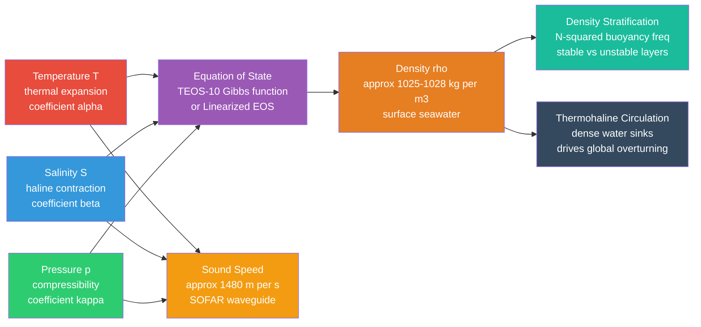

# 🌊 Seawater Properties and Equation of State

> [!abstract] TL;DR
> Seawater density is not constant — it depends on temperature, salinity, and pressure in a nonlinear way described by the Equation of State (EOS). The modern standard, TEOS-10, replaces EOS-80 and is built on a Gibbs thermodynamic potential, giving internally consistent values for entropy, enthalpy, chemical potential, and sound speed. Cold, salty, deep water is the densest, and small density contrasts drive the entire thermohaline circulation. Sound travels roughly four times faster in seawater than in air, and the depth-dependent sound-speed profile creates a natural acoustic waveguide (the SOFAR channel) used by both whales and military surveillance.

---

## Intuition

**Analogy:** You can float an egg in freshwater if you pile enough salt in — the Dead Sea, with ~33 % dissolved salts, is so dense that you bob like a cork without effort. The same volume of you displaces more weight of the dense water, so the net upward force exceeds your weight before you are even fully submerged.

That everyday observation encodes almost everything about seawater: dissolve more salt and the water becomes denser; warm the water and it expands and becomes lighter; press it deeper and it compresses and becomes slightly heavier. The Equation of State is just the precise mathematical bookkeeping of how these three variables — temperature, salinity, and pressure — combine to set density. And because density controls which water parcel sinks or rises, it ultimately drives ocean circulation on a planetary scale.

---

## How It Works

### Core Mechanics

1. **Temperature effect** — Seawater at typical ocean temperatures (above ~4 °C) expands when heated. The fractional volume increase per degree is the thermal expansion coefficient α (units K⁻¹). Warm surface water is buoyant; cold polar water is dense and sinks. Near 0 °C, α is very small: cold water barely expands, so a 1 °C cooling near the pole barely changes density compared with the same cooling in tropical water.

2. **Salinity effect** — Dissolved ions (Na⁺, Cl⁻, Mg²⁺, SO₄²⁻, …) pack more mass into the same volume. The haline contraction coefficient β (units per g/kg) captures this: adding 1 g of salt per kg of water increases density by ~β × ρ₀. Salinity dominates density in cold seas; temperature dominates in warm tropical seas.

3. **Pressure effect** — Seawater is slightly compressible. Each kilometre of depth adds roughly 10 MPa of pressure, compressing water by ~0.05 %. This matters for deep-ocean density comparisons and for sound propagation.

4. **Sound speed** — The speed of sound in seawater c increases with temperature, salinity, and pressure. A simplified formula (Mackenzie 1981) reads c ≈ 1449 + 4.6 T − 0.055 T² + 0.00029 T³ + (1.34 − 0.01 T)(S − 35) + 0.016 z, where T is in °C, S in psu, z in metres. The depth where c is minimum (~800–1200 m) traps sound rays in a waveguide called the SOFAR channel.

5. **Buoyancy frequency N²** — The square of the Brunt–Väisälä frequency quantifies static stability: N² = −(g/ρ)(dρ/dz) with z positive upward. When N² > 0 the column is stably stratified; N² < 0 means convective overturn. Internal waves oscillate at frequencies ω ≤ N.

### Flow / Architecture



---

## Key Concepts / Details

### Secondary Level

**Salt makes water heavier.** Ocean water averages about 35 grams of dissolved salt per kilogram (35 psu), giving a density of roughly 1025 kg/m³ compared with pure water at 1000 kg/m³. The ocean is not uniformly mixed: the surface is warmed by the sun and is lighter, while the deep ocean is cold and dense. This layering — lighter on top, heavier below — is called stratification, and it is as stable as oil floating on water.

**Temperature decreases with depth.** Below the sun-warmed surface layer, a zone called the thermocline marks a rapid drop in temperature. Below ~1000 m most of the ocean hovers near 2–4 °C regardless of latitude. The deep ocean is cold, dark, and dense.

**Pressure increases with depth.** Every 10 metres of seawater adds roughly one atmosphere (101 kPa) of pressure. At the deepest point in the ocean (Challenger Deep, ~10 920 m), the pressure is about 110 MPa — more than 1000 times surface atmospheric pressure — yet water compresses by only a few per cent even there.

**Salinity units.** Practical Salinity (PSU or psu) is dimensionless but numerically close to grams of salt per kilogram of seawater (g/kg). Open-ocean salinity ranges from ~33–38 psu, averaging ~34.7 psu.

---

### Undergraduate Level

**Linearized Equation of State.** Near a reference state (T₀, S₀, p₀) the density is well approximated by:

$$\rho = \rho_0 \bigl[1 - \alpha(T - T_0) + \beta(S - S_0) + \kappa(p - p_0)\bigr]$$

Typical values at T₀ = 15 °C, S₀ = 35 psu, p₀ = 0:

| Coefficient | Symbol | Value | Physical meaning |
|---|---|---|---|
| Thermal expansion | α | ~2.0 × 10⁻⁴ K⁻¹ | Density drop per °C warming |
| Haline contraction | β | ~7.4 × 10⁻⁴ (g/kg)⁻¹ | Density rise per psu of salt |
| Compressibility | κ | ~4.5 × 10⁻¹⁰ Pa⁻¹ | Density rise per Pa of pressure |

Note that α is **strongly temperature-dependent**: it is near zero at 0 °C (cold water barely expands) and reaches ~3 × 10⁻⁴ K⁻¹ at 25 °C. This nonlinearity is why the linear EOS fails at high accuracy.

**Potential density σ_θ** is the density a water parcel would have if moved adiabatically to the surface (p = 0). It removes the reversible pressure effect and allows meaningful density comparisons between parcels at different depths. The conventional notation is:

$$\sigma_\theta = \rho(T_{potential}, S, 0) - 1000 \; \text{kg/m}^3$$

For example, σ_θ = 27.4 means potential density = 1027.4 kg/m³.

**Sigma-t notation** (σ_t) uses in-situ temperature rather than potential temperature, evaluated at surface pressure. It is simpler to compute but less physically meaningful for deep waters than σ_θ.

**Temperature of maximum density** shifts with salinity. For pure water it is ~3.98 °C; for seawater above ~24.7 psu the maximum-density temperature falls below the freezing point, meaning saltwater becomes monotonically denser as it cools toward its freezing point (~−1.86 °C at S = 35 psu).

---

### Graduate Level

**EOS-80 vs TEOS-10.** EOS-80 (UNESCO 1980) expresses density as a 15-term polynomial in in-situ temperature T and Practical Salinity S_P. It has known inaccuracies for cold, deep, or high-salinity waters and does not conserve energy consistently when computing heat and salt fluxes.

TEOS-10 (IOC/SCOR/IAPSO 2010) is derived from a Gibbs thermodynamic potential G(T, S_A, p) — a function whose partial derivatives yield all thermodynamic properties (entropy, enthalpy, sound speed, chemical potential) in a mutually consistent way. Key changes:
- **Absolute Salinity S_A** (g/kg, true mass fraction) replaces Practical Salinity S_P (dimensionless conductivity ratio). The correction S_A − S_P ≈ 0.16 g/kg in the deep Pacific (different mineral composition) and matters at the ±0.01 kg/m³ level.
- Accuracy in the deep ocean improved by ~2 × compared with EOS-80.
- Provides a single framework for seawater, ice, and water vapour (the "SeaIce" and "IcePart" modules).

**Cabbeling.** Because α is a nonlinear function of T, mixing two water masses of equal density but different T/S ratios produces a mixture with **higher** density than either parent. The mixed parcel sinks without external forcing. Cabbeling is observed at the Antarctic Polar Front where cold fresh Antarctic water meets warm salty Subantarctic water, and may contribute to Antarctic Bottom Water formation.

**Thermobaricity.** The thermal expansion coefficient α increases with pressure. Thus a warm parcel displaced downward becomes relatively less buoyant at depth (because α increases, it is effectively more compressible). This can generate convective instability in the deep ocean even in apparently stable columns — a process that modifies deep-water ventilation rates.

**Neutral density surfaces.** Potential density referenced to a fixed pressure (e.g., σ₂ referenced to 2000 dbar) is not a true neutral surface at other depths because thermobaricity tilts it. Jackett & McDougall (1997) defined **neutral density γⁿ** as a continuous variable labelling surfaces along which water parcels can move without doing work against buoyancy. Neutral surfaces are the theoretically correct surfaces on which to trace water masses across ocean basins, and they differ measurably from σ₂ surfaces in the deep Pacific.

---

## Python Demo

```python
import numpy as np
import matplotlib.pyplot as plt

def eos80_surface(T, S):
    """
    EOS-80 seawater density at surface pressure (kg/m^3).
    Millero & Poisson (1981). Valid: 0-30 deg C, 0-40 psu.
    """
    rho_w = (999.842594
             + 6.793952e-2 * T
             - 9.095290e-3 * T**2
             + 1.001685e-4 * T**3
             - 1.120083e-6 * T**4
             + 6.536332e-9 * T**5)
    A = (0.824493
         - 4.0899e-3 * T
         + 7.6438e-5 * T**2
         - 8.2467e-7 * T**3
         + 5.3875e-9 * T**4)
    B = -5.72466e-3 + 1.0227e-4 * T - 1.6546e-6 * T**2
    C = 4.8314e-4
    return rho_w + A * S + B * S**1.5 + C * S**2

T = np.linspace(0, 30, 300)

# Include S=0 as a reference to show the shift of maximum-density temperature
salinities = [0, 30, 34, 35, 37]
labels     = ["S = 0  (pure water)", "S = 30 psu",
              "S = 34 psu", "S = 35 psu", "S = 37 psu"]
colors     = ["#1a9850", "#4575b4", "#74add1", "#f46d43", "#d73027"]

fig, ax = plt.subplots(figsize=(9, 5))
for S, label, col in zip(salinities, labels, colors):
    rho = eos80_surface(T, S)
    ax.plot(T, rho, label=label, color=col, linewidth=2)
    # Mark temperature of maximum density if it lies within 0-30 deg C
    T_max_idx = np.argmax(rho)
    T_max = T[T_max_idx]
    if 0.5 < T_max < 29.5:
        ax.axvline(T_max, color=col, linestyle="--", alpha=0.6, linewidth=1.2)
        ax.annotate(
            f"Tmd = {T_max:.1f} deg C",
            xy=(T_max, rho[T_max_idx]),
            xytext=(T_max + 0.4, rho[T_max_idx] - 0.2),
            fontsize=8, color=col,
        )

ax.text(14, 1000.4,
        "For S > 24.7 psu:\nTmd is below freezing point\n=> density increases monotonically\n   as seawater cools to Tf",
        fontsize=8, color="#555555",
        bbox=dict(boxstyle="round,pad=0.4", facecolor="white", alpha=0.85))

ax.set_xlabel("Temperature  (deg C)", fontsize=11)
ax.set_ylabel("Density  (kg m^-3)", fontsize=11)
ax.set_title("Seawater Density vs Temperature — EOS-80, Surface Pressure\n"
             "Dashed lines: temperature of maximum density (Tmd)", fontsize=11)
ax.legend(fontsize=9)
ax.grid(True, alpha=0.3)
plt.tight_layout()
plt.savefig("seawater_density.png", dpi=150)
plt.show()
# Expected output:
#   Pure water curve peaks near 4 deg C (visible dashed line).
#   All salinities >= 30 psu decrease monotonically over 0-30 deg C —
#   their Tmd lies below 0 deg C, outside the plotted range.
#   Higher salinity curves sit uniformly higher (denser) across all temperatures.
```

---

## Real-World Notes

- **Dead Sea buoyancy** — The Dead Sea has salinity ~330 g/kg (roughly ten times open-ocean average), giving a density of ~1240 kg/m³. A human body (~1010 kg/m³) is so much less dense than the water that it is impossible to sink, even without swimming effort.

- **Mediterranean outflow dense water** — The Mediterranean loses more water to evaporation than it gains from rivers, pushing salinity to ~38 psu. The outgoing bottom water (T ≈ 13 °C, S ≈ 38 psu, ρ ≈ 1028 kg/m³) spills over the Gibraltar sill and sinks into the Atlantic, spreading as a distinct salty lens at ~1000 m depth — a textbook example of density-driven intrusion visible on T/S diagrams across the entire North Atlantic.

- **SOFAR channel** — Sound speed has a minimum near 800–1200 m depth because the temperature effect (decreasing with depth) and the pressure effect (increasing with depth) cancel. Sound rays bend toward this minimum and become trapped, allowing low-frequency sounds to travel thousands of kilometres with minimal loss. Fin whales exploit it for long-range communication; the US Navy used it in the Cold War SOSUS surveillance network.

- **Polar deep-water formation** — In the Weddell Sea, winter cooling brings surface temperature to ~−1.9 °C. Sea-ice formation expels brine, raising salinity to ~34.7 psu. The resulting Antarctic Bottom Water (σ_θ ≈ 27.88) is the densest water mass in the open ocean, sinking to the sea floor and ventilating the global abyss.

- **Deep-sea pressure effects** — At 10 000 m (roughly 100 MPa), the in-situ density of seawater is ~1050–1070 kg/m³, about 4–5 % higher than at the surface for the same temperature and salinity. Using in-situ rather than potential density to compare water-mass stability would give the wrong answer in such deep settings — this is precisely why potential density and TEOS-10 matter for abyssal oceanography.

---

## Common Pitfalls

- **In-situ vs potential density** — Comparing in-situ densities at different depths conflates the reversible pressure effect with true buoyancy. A deep parcel always has higher in-situ density than its potential density, so always use potential density (or neutral density) when asking whether one water mass would rise above another.

- **PSU vs g/kg** — Practical Salinity (PSU) is determined from electrical conductivity ratios and is dimensionless; it closely approximates grams of dissolved salt per kilogram of seawater but is not exactly the same. TEOS-10 introduces Absolute Salinity S_A in g/kg; the difference S_A − S_P can reach 0.025 g/kg in the Atlantic and 0.160 g/kg in the deep Pacific, which matters when computing accurate densities or comparing model outputs.

- **Pressure effect on density vs compressibility confusion** — The compressibility κ tells you how much volume changes per unit pressure. The *density increase* with depth comes from both compression and the increasing weight of water above. Saying "deep water is denser because it is compressed" is partially correct, but the dominant reason is that cold, salty deep water was *formed* dense at the surface — compression is a ~4 % correction on top of a ~3 % salinity effect and a ~5 % temperature effect.

- **Sigma-t vs sigma-0 (sigma-theta)** — σ_t uses in-situ temperature, while σ_θ (sigma-zero or sigma-theta) uses potential temperature. They differ by up to 0.2 kg/m³ in the deep ocean. Published hydrographic data tables may use either, and mixing them in a calculation silently corrupts water-mass analysis.

- **Assuming α is constant** — The linearized EOS is valid for small excursions from the reference state, but α varies from ~5 × 10⁻⁵ K⁻¹ at 0 °C to ~3 × 10⁻⁴ K⁻¹ at 25 °C — a factor of six. Using a single α value across the full ocean temperature range (−1.9 °C to 30 °C) introduces large errors, and it misses cabbeling entirely.

---

## Related Concepts

**Same vault (Oceanography):**

- [[Temperature_Salinity_Diagrams_and_Water_Masses]] — T/S diagrams are the primary tool for identifying water masses and mixing lines; density isolines plotted on them come directly from the EOS.
- [[Density_Stratification_and_Mixing]] — Stability (N²) and convective mixing are computed from the density field; this note provides the EOS foundation for that analysis.
- [[Ocean_Acoustics_and_Underwater_Sound]] — Sound speed in seawater (Mackenzie, Del Grosso formulas) is derived from the same thermodynamic Gibbs function as density in TEOS-10.
- [[Thermohaline_Circulation_and_AMOC]] — The Atlantic overturning circulation is driven by density contrasts that are quantified by the EOS; Mediterranean outflow and North Atlantic Deep Water formation are canonical examples.
- [[Deep_Ocean_Circulation_and_Abyssal_Flow]] — Antarctic Bottom Water and other abyssal water masses are identified and tracked via their potential density values from the EOS.
- [[_MOC_Physical_Oceanography]] — Section map of all Physical Oceanography notes in this vault.

**Cross-vault:**

- [[Fluid_Statics_and_Properties]] — Hydrostatic pressure, Archimedes' principle, and the bulk modulus are the fluid-mechanics underpinning of ocean pressure and buoyancy.
- [[Laws_of_Thermodynamics]] — TEOS-10 is built on thermodynamic consistency; the first and second laws constrain which equations of state are physically admissible.
- [[Kinetic_Theory_of_Gases]] — Provides the molecular-scale picture of pressure and equation of state; seawater EOS is the condensed-matter analogue of the ideal-gas law.
- [[Phase_Equilibria_and_Colligative_Properties]] — Freezing-point depression of seawater (Tf ≈ −1.86 °C at S = 35 psu) is a colligative property; the phase diagram of the water–salt system governs sea-ice formation and brine rejection.
- [[_MOC_Physics_Master]] — Entry point to the Physics vault; Fluid Mechanics and Thermodynamics sections are most relevant.
- [[_MOC_Chemistry_Master]] — Entry point to the Chemistry vault; Physical Chemistry section covers thermodynamic potentials underlying TEOS-10.

---

## Review Questions

### Secondary Level

1. You have two glasses of water — one containing freshwater and one containing very salty seawater. Without looking at the labels, describe two simple tests you could perform to determine which is which, and explain the physics behind each test.
2. The ocean gets colder and denser as you go deeper. Why does this mean the ocean is usually stable (resistant to vertical mixing), and under what conditions might a column of ocean water overturn spontaneously?
3. Why do icebergs and sea ice float? If the ocean suddenly became freshwater, would icebergs float higher or lower? Explain using the concept of density.

### Undergraduate Level

1. Using the linearized EOS with ρ₀ = 1026 kg/m³, α = 2.0 × 10⁻⁴ K⁻¹, β = 7.4 × 10⁻⁴ psu⁻¹ referenced to T₀ = 15 °C and S₀ = 35 psu, calculate the density of a water parcel at T = 2 °C, S = 34.7 psu. By how much does temperature and salinity each contribute to the density anomaly?
2. Define potential density and explain, step by step, why you cannot correctly assess the stability of a deep ocean column by simply comparing in-situ densities at two depths. Give a numerical example where the in-situ density increases downward but the column is actually unstable.
3. The σ_θ of Mediterranean outflow water is ~29.07, while the surrounding North Atlantic water at 1000 m has σ_θ ≈ 27.7. Why does the Mediterranean water spread at 1000 m rather than sinking to the bottom, even though it is denser than the surface water?

### Graduate Level

1. Derive qualitatively why cabbeling occurs. Starting from the fact that α = α(T, S, p), show that mixing two water masses of equal potential density but different T/S values produces a mixture with higher potential density than either parent. What does this imply for deep-water formation at oceanic fronts?
2. TEOS-10 introduces Absolute Salinity S_A in place of Practical Salinity S_P. Describe the physical origin of the discrepancy S_A − S_P and explain why it is largest in the deep North Pacific. How large is the resulting error in density if S_P is used instead of S_A in that region, and is it oceanographically significant?
3. Explain the concept of neutral density surfaces and why they are preferable to fixed-reference potential density surfaces for tracing water mass pathways across ocean basins. What property of the equation of state (thermobaricity) makes potential density surfaces non-neutral, and in which ocean basin does this error matter most?

---

## Sources

- Talley, L. D., Pickard, G. L., Emery, W. J., & Swift, J. H. (2011). *Descriptive Physical Oceanography: An Introduction* (6th ed.). Elsevier. — Comprehensive treatment of water mass properties, T/S diagrams, and global density structure.
- McDougall, T. J., & Barker, P. M. (2011). *Getting Started with TEOS-10 and the Gibbs Seawater (GSW) Oceanographic Toolbox*. SCOR/IAPSO WG127, ISBN 978-0-646-55621-5. — The authoritative reference for TEOS-10 implementation.
- Millero, F. J. (2013). *Chemical Oceanography* (4th ed.). CRC Press. — Detailed treatment of seawater composition, Absolute vs Practical Salinity, and the thermochemistry of seawater.
- Cushman-Roisin, B., & Beckers, J.-M. (2011). *Introduction to Geophysical Fluid Dynamics: Physical and Numerical Aspects* (2nd ed.). Academic Press. — Chapter on density, stratification, and the linearized EOS in the ocean context.
- Vallis, G. K. (2017). *Atmospheric and Oceanic Fluid Dynamics* (2nd ed.). Cambridge University Press. — Graduate-level derivation of buoyancy frequency, thermobaricity, and neutral density in rotating stratified fluids.

---

#Oceanography #PhysicalOceanography #SeawaterProperties #EquationOfState
