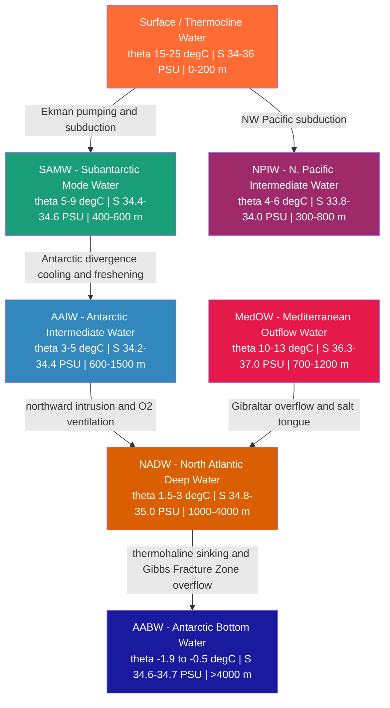

# Temperature-Salinity Diagrams and Water Masses

> [!abstract] TL;DR
> A temperature-salinity (T-S) diagram is the fundamental tool of descriptive physical oceanography: by plotting potential temperature against salinity for a water column, each distinct water mass appears as a tight cluster or characteristic curve segment whose position in T-S space is conserved for centuries as the water spreads far from its formation region. Curved isopycnal lines (surfaces of constant potential density, sigma-theta) overlay the diagram, revealing where two water masses share the same density despite different T and S values. The mixing theorem states that any mixture of two water masses must plot on the straight chord between them in T-S space, making it possible to decompose a sample into source-water fractions. Six to eight globally recognised water masses — including NADW, AAIW, AABW, SAMW, and Mediterranean Outflow Water — partition the deep ocean's volume and carry heat, salt, oxygen, and carbon between basins on millennial timescales.

---

## Intuition

**Analogy:** A T-S diagram is like a fingerprint — each ocean basin leaves a unique signature in T-S space that persists for centuries as the water spreads. A forensic analyst can match a fingerprint to a person even after the person has traveled the world; an oceanographer can match a T-S cluster to a formation region even after the water has circulated half the planet.

Water acquires its T and S at the ocean surface, where it is in contact with the atmosphere and freshwater input. Once it subducts below the mixed layer, T and S are modified only by mixing with adjacent water — they are *quasi-conservative* properties. A parcel of Antarctic Bottom Water forming near the Weddell Sea carries the cold, salty, dense stamp of that winter surface for thousands of years and thousands of kilometers, all the way to the North Pacific. The T-S diagram makes this tracer memory visible at a glance: a cold, fresh finger at depth means Antarctic Intermediate Water; a warm, salty intrusion at mid-depth means Mediterranean Outflow. Geography written in thermodynamics.

---

## How It Works

### Core Mechanics

The T-S diagram plots **potential temperature** (theta, x-axis in some conventions but usually y-axis) against **salinity** (S in PSU or practical salinity units, x-axis). Key elements:

1. **Potential temperature theta** is the temperature a parcel would have if raised adiabatically to the sea surface. It removes the ~0.1°C per 1000 m adiabatic warming of in-situ temperature with pressure, making it a conserved tracer. Use theta, never in-situ T, on a T-S diagram.

2. **Salinity** is conserved (no phase changes at depth), so (theta, S) together form a two-dimensional conserved label for a water parcel.

3. **Isopycnals** (lines of constant sigma-theta = potential density − 1000 kg/m³) are overlaid as curves. Because seawater's equation of state is nonlinear, isopycnals are slightly curved rather than straight in T-S space. This curvature is physically important (see cabbeling, below).

4. **Water mass** vs **water body**: a *water mass* is defined by its T-S signature and formation mechanism — it is a property label. A *water body* is a geographic region. NADW is a water mass; the North Atlantic Deep Water column between 45°N and 60°N is a water body.

5. **The core method (Wüst 1935)**: track the extremum (maximum or minimum) of a property such as salinity along an isopycnal surface. The core of NADW is traced by a salinity maximum near sigma-theta = 27.8; the core of AAIW is traced by a salinity minimum near sigma-theta = 27.1. These extrema persist and weaken systematically along the spreading path, allowing quantification of mixing rates.

6. **Mixing line theorem**: in T-S space, the mixture of two water masses A and B lies on the straight line segment AB, at a position determined by their volume fractions. This linearity holds because T and S are both conservative and they mix additively. Three-water-mass mixing fills a triangle; four masses fill a tetrahedron in (T, S, tracer) space.

### Flow / Architecture



---

## Key Concepts / Details

### Secondary Level

**Warm/fresh vs cold/salty.** Ocean temperature and salinity create a four-quadrant space. Most surface waters are warm and moderately salty; deep waters are cold and dense. The halocline (region of rapidly changing salinity with depth) and thermocline (region of rapidly changing temperature) mark the transition between the surface mixed layer and the deep interior. In the tropics the thermocline dominates density stratification; in polar regions the halocline dominates because cold freshwater (from ice melt) sits lighter than cold salty water.

**How oceanographers label water.** A water mass is identified by a T-S cluster in the diagram. Formation regions are where surface water sinks: the North Atlantic (deep convection in the Labrador and Nordic Seas forming NADW), the Southern Ocean margins (shelf convection forming AABW), and the subtropics (Ekman subduction forming mode and thermocline waters). Once below the mixed layer, T-S properties evolve only through mixing, tracing slow spreading pathways.

**Practical Salinity Units (PSU).** Modern salinity is reported on the Practical Salinity Scale 1978 (PSS-78) as a dimensionless ratio (conductivity-based), but numerically nearly identical to grams of salt per kilogram of seawater (g/kg). Typical ocean surface salinity: 32–37 PSU. TEOS-10 (adopted 2010) uses Absolute Salinity (g/kg), correcting for regional differences in composition.

### Undergraduate Level

**T-S mixing theorem.** For two conservative tracers C1 and C2 (e.g., theta and S), a mixture of water mass A (C1_A, C2_A) and water mass B (C1_B, C2_B) with fraction f_A from A and (1 − f_A) from B plots at:

```
C1_mix = f_A * C1_A + (1 - f_A) * C1_B
C2_mix = f_A * C2_A + (1 - f_A) * C2_B
```

This is linear in f_A, so the mixture lies on the chord AB. For three end-members (A, B, C), the mixing fraction is found by solving a 2×2 linear system (two conservation equations, two unknowns given the constraint f_A + f_B + f_C = 1).

**Isopycnal vs diapycnal mixing.** Mixing *along* an isopycnal (same density surface) does not change the density of the water — it merely redistributes T and S along the isopycnal, producing *spice* (thermohaline contrast at constant density). Mixing *across* isopycnals (diapycnal mixing) changes density and drives the overturning circulation; it requires turbulent kinetic energy, supplied largely by breaking internal waves and tidal flows over rough topography.

**Spice.** Along any isopycnal surface, different T-S combinations can achieve the same density. The coordinate measuring displacement along the isopycnal (warm/salty vs cold/fresh at the same sigma-theta) is called *spice* (or spiciness), introduced by Munk (1981). Spice anomalies are passively advected along isopycnals and serve as passive tracers of water mass origin and lateral stirring.

**Water mass fractions: multi-component mixing.** Given N water masses and M conservative tracers (with M ≥ N − 1), the fraction of each source in a sample is found by solving the over-determined system:

```
sum_i(f_i * C_j^(i)) = C_j^(obs)   for j = 1..M
sum_i(f_i) = 1
f_i >= 0
```

A least-squares or non-negative least-squares solution gives the water mass fractions. Using 3–5 tracers (theta, S, O2, silicate, nitrate) substantially constrains the solution.

### Graduate Level

**Optimum Multiparameter (OMP) Analysis.** The OMP method (Tomczak 1981; Karstensen & Tomczak 1998) casts the multi-tracer mixing problem as a weighted non-negative least-squares problem. Source water type (SWT) end-members are defined for each water mass; mixing fractions are recovered by minimising the residual between observed and reconstructed tracer fields. OMP explicitly separates conservative mixing from biogeochemical remineralisation by including nutrient and oxygen fields with Redfield-ratio corrections.

**Neutral density surfaces (gamma-n).** Potential density referenced to a fixed pressure level (sigma-0, sigma-2, sigma-4) becomes inconsistent at large horizontal distances because the thermal expansion coefficient alpha increases with pressure (thermobaricity). McDougall (1987) showed that true neutral surfaces — along which a parcel can be displaced without experiencing buoyant restoring forces — are approximately but not exactly pressure-referenced isopycnals. Jackett & McDougall (1997) constructed a practical neutral density variable gamma-n, computed from a reference dataset and interpolation, that approximates neutral surfaces globally. The gamma-n surfaces are used in modern water mass analysis instead of fixed sigma levels, particularly in the Southern Ocean where sigma-0 and sigma-4 diverge.

**Thermobaricity and cabbeling.** The nonlinearity of the seawater equation of state causes two important density effects:

- **Thermobaricity**: thermal expansion (alpha) increases with pressure, so cold water is more compressible than warm water. A cold parcel displaced downward compresses less than its warm surroundings and becomes less dense, causing convective instability in polar water columns.

- **Cabbeling**: when two water parcels with the same potential density but different T and S mix isopycnally, the mixture is *denser* than either parent. This is because the equation of state is concave in T-S space: the isopycnal curves outward while the mixing chord is straight. Cabbeling converts lateral mixing work into diapycnal (cross-density) flux and drives convection in the Antarctic Circumpolar Current fronts.

**TEOS-10 complications.** The Thermodynamic Equation Of Seawater 2010 (TEOS-10) replaced EOS-80 and PSS-78. Key changes: Absolute Salinity (SA, g/kg) replaces Practical Salinity (SP); potential temperature is replaced by Conservative Temperature (Theta, proportional to potential enthalpy). In TEOS-10, Conservative Temperature and Absolute Salinity are the most nearly conservative variables. The traditional sigma-theta becomes sigma_Theta in TEOS-10, and differences between the two are small but significant for high-precision water mass analysis. The `gsw` Python package implements the full TEOS-10 toolbox.

---

## Python Demo

```python
import numpy as np
import matplotlib.pyplot as plt
from matplotlib.lines import Line2D

def sigma_theta(T, S):
    """
    Potential density anomaly sigma-0 (kg/m^3 - 1000).
    Simplified UNESCO EOS-80 polynomial, T in deg C, S in PSU.
    Valid for roughly -2 to 35 deg C, 0 to 40 PSU.
    """
    A = (999.842594
         + 6.793952e-2 * T
         - 9.095290e-3 * T**2
         + 1.001685e-4 * T**3
         - 1.120083e-6 * T**4
         + 6.536332e-9 * T**5)
    B = (0.824493
         - 4.0899e-3 * T
         + 7.6438e-5 * T**2
         - 8.2467e-7 * T**3
         + 5.3875e-9 * T**4)
    C = -5.72466e-3 + 1.0227e-4 * T - 1.6546e-6 * T**2
    D = 4.8314e-4
    rho = A + B * S + C * S**1.5 + D * S**2
    return rho - 1000.0

# ----- Build isopycnal grid -----
S_range = np.linspace(33.0, 38.2, 500)
T_range = np.linspace(-2.5, 30.0, 500)
Sg, Tg = np.meshgrid(S_range, T_range)
sigma_g = sigma_theta(Tg, Sg)

# ----- Water mass T/S signatures -----
# (label, S_PSU, theta_degC, depth_str, color)
water_masses = [
    ("Surface Water",             35.3,  23.0, "0-200 m",     "#ff6b35"),
    ("SAMW",                      34.5,   7.5, "400-600 m",   "#1a9e77"),
    ("AAIW",                      34.3,   4.0, "600-1500 m",  "#3288bd"),
    ("MedOW",                     36.5,  11.5, "700-1200 m",  "#e6194b"),
    ("NADW",                      34.9,   2.0, "1000-4000 m", "#d95f02"),
    ("NPIW",                      33.9,   5.0, "300-800 m",   "#9e2a6a"),
    ("AABW",                      34.65, -0.5, ">4000 m",     "#1a1a9e"),
]

fig, ax = plt.subplots(figsize=(10, 8))

# ----- Isopycnal contours -----
sigma_levels = np.arange(22.0, 28.5, 0.5)
cs = ax.contour(Sg, Tg, sigma_g,
                levels=sigma_levels,
                colors="gray",
                linewidths=0.8,
                linestyles="--",
                alpha=0.65)
ax.clabel(cs, fmt=r"$\sigma_\theta$=%.1f",
          fontsize=8, inline=True, colors="dimgray")

# ----- Freezing point line (approximate) -----
S_freeze = np.linspace(33.0, 38.2, 300)
T_freeze = -0.0575 * S_freeze + 1.710523e-3 * S_freeze**1.5 - 2.154996e-4 * S_freeze**2
ax.plot(S_freeze, T_freeze, color="steelblue", lw=1.2,
        linestyle="-.", label="Freezing point")

# ----- Water mass scatter + annotation -----
for name, S_val, T_val, depth, color in water_masses:
    ax.scatter(S_val, T_val, s=200, color=color,
               zorder=6, edgecolors="k", linewidths=0.8)
    ax.annotate(
        name,
        xy=(S_val, T_val),
        xytext=(S_val + 0.08, T_val + 1.1),
        fontsize=8.5,
        color=color,
        fontweight="bold",
        arrowprops=dict(arrowstyle="-", color=color, lw=0.9),
    )

# ----- Mixing chord: NADW - AAIW example -----
S_mix = np.array([34.9, 34.3])
T_mix = np.array([2.0,  4.0])
ax.plot(S_mix, T_mix, color="black", lw=1.5,
        linestyle=":", label="NADW-AAIW mixing chord")

# ----- Axis formatting -----
ax.set_xlabel("Salinity (PSU)", fontsize=12)
ax.set_ylabel(r"Potential Temperature $\theta$ (°C)", fontsize=12)
ax.set_title(
    "T-S Diagram: Major Ocean Water Masses\nwith $\\sigma_\\theta$ isopycnals",
    fontsize=13
)
ax.set_xlim(33.0, 38.2)
ax.set_ylim(-2.5, 30.0)
ax.grid(alpha=0.25)

# ----- Custom legend -----
legend_handles = [
    Line2D([0], [0], marker="o", color="w",
           markerfacecolor=wm[4], markersize=9, markeredgecolor="k",
           label=f"{wm[0]} ({wm[3]})")
    for wm in water_masses
]
legend_handles += [
    Line2D([0], [0], color="steelblue", linestyle="-.", lw=1.2,
           label="Freezing point"),
    Line2D([0], [0], color="black", linestyle=":", lw=1.5,
           label="NADW-AAIW mixing chord"),
]
ax.legend(handles=legend_handles, loc="upper left",
          fontsize=8, title="Water Masses & Features", title_fontsize=9)

plt.tight_layout()
plt.show()
```

---

## Real-World Notes

> **Mediterranean Outflow Water tongue in the Atlantic.** Mediterranean Water exits through the Strait of Gibraltar as a dense overflow (temperature ~13°C, salinity ~37.8 PSU — far saltier than the Atlantic). It sinks to its density level (~800–1200 m depth) and spreads westward as a warm, salty tongue recognisable across the entire North Atlantic in salinity sections. On a T-S diagram it appears as a pronounced warm-salty anomaly at intermediate depths, well separated from the NADW cluster below it. SOFAR float trajectories in the 1970s first mapped this tongue's three-dimensional structure.

> **AABW spreading into the Pacific.** Antarctic Bottom Water (the densest water in the ocean, theta near −0.5 to −0.9°C, salinity ~34.65 PSU) formed on the Weddell and Ross Sea shelves fills the deepest basins of all three oceans. In the Pacific it must cross the Southwest Pacific Basin and flows northward through deep passages, gradually warming and saltifying through geothermal heating and mixing with overlying NADW. The T-S signature evolves along this multi-thousand-kilometre path: a plot of Pacific deep stations shows a systematic drift from the Antarctic source T-S point toward the NADW cluster, tracing centuries of slow diffusive mixing.

> **AAIW as a ventilation tracer.** Antarctic Intermediate Water subducts at the Antarctic Convergence (Subantarctic Front), carrying high dissolved-oxygen content from gas exchange at the cold surface into the intermediate ocean (600–1500 m). Its T-S signature (low salinity minimum, ~34.3 PSU; sigma-theta ~27.1) is detectable in every ocean basin's thermocline. The oxygen content of AAIW decreases as it ages away from the formation region, providing an age tracer for the intermediate circulation.

> **Nordic Seas overflows forming NADW.** Dense water formed in the Labrador Sea (Labrador Sea Water, LSW: theta ~3°C, S ~34.9 PSU) and the Nordic Seas (Denmark Strait Overflow Water and Iceland-Scotland Ridge Overflow Water, theta ~0–2°C, S ~34.9 PSU) descend and entrain ambient water to form the composite NADW. The entrainment dramatically increases the volume transport of NADW compared to the overflow source but dilutes its extreme properties — a classic example of how the T-S end-member of a composite water mass differs from the densest source.

---

## Common Pitfalls

- **Confusing potential temperature with in-situ temperature** — In-situ temperature increases by ~0.1°C per 1000 m of adiabatic compression. AABW at 4000 m depth has in-situ T ≈ −0.1°C but potential temperature theta ≈ −0.5°C. Plotting in-situ T gives a false T-S diagram that over-estimates density and misidentifies water masses. Always use potential temperature (or Conservative Temperature in TEOS-10) on the y-axis.

- **Assuming mixing follows a straight line in density space** — Two water masses with the same sigma-theta but different T and S mix to produce water that is *denser* than either parent (cabbeling). In T-S space the chord is straight, but because the isopycnals are curved, the mixture lies on a higher sigma-theta isopycnal. This means isopycnal mixing can spontaneously generate denser water without any diabatic forcing — a critical mechanism for deep-water renewal in the Southern Ocean.

- **Conflating water mass with water body or geographic region** — NADW is present in the South Atlantic and even the Southern Ocean; AAIW is present in the North Atlantic. A water mass is defined by its T-S cluster and formation mechanism, not by geography. Calling all deep water in the Atlantic NADW, or all intermediate water AAIW, is geographically intuitive but oceanographically incorrect.

- **Treating end-member T-S values as precise constants** — Water mass T-S properties vary seasonally, interannually (e.g., Labrador Sea Water freshens in warm decades when deep convection is shallow), and over longer climatic cycles. Published end-member values (e.g., Emery & Meincke 1986) are climatological means; OMP analyses should propagate uncertainty in the end-members.

- **Ignoring pressure effects on the equation of state in deep mixing** — Mixing analyses that span large depth ranges should use pressure-corrected reference densities (sigma-2 or sigma-4 for deep water) or neutral density gamma-n rather than sigma-0. Using sigma-0 below ~1500 m can misidentify the density ordering of water masses and produce spurious inversions.

---

## Related Concepts

**Same vault — Physical Oceanography:**
- [[Seawater_Properties_and_Equation_of_State]] — the nonlinear EOS that generates curved isopycnals and drives cabbeling and thermobaricity in T-S space
- [[Density_Stratification_and_Mixing]] — how isopycnal and diapycnal mixing rates are inferred from T-S structure and tracer microstructure
- [[Thermohaline_Circulation_and_AMOC]] — the global overturning circulation whose branches correspond to the water mass pathways visible in T-S diagrams
- [[Deep_Ocean_Circulation_and_Abyssal_Flow]] — abyssal spreading of AABW and NADW traced by T-S evolution along flow paths
- [[Arctic_and_Antarctic_Oceans]] — the primary formation regions for AABW, AAIW, SAMW, and the Nordic Seas overflow waters
- [[_MOC_Physical_Oceanography]] — section map of core physical oceanography concepts

**Cross-vault:**
- [[Fluid_Statics_and_Properties]] *(Physics — Fluid Mechanics)* — the static stability and buoyancy concepts underlying water mass stratification
- [[Phase_Equilibria_and_Colligative_Properties]] *(Chemistry — Physical Chemistry)* — freezing-point depression of seawater, the physical basis of brine rejection and AABW formation
- [[Laws_of_Thermodynamics]] *(Physics — Thermodynamics)* — entropy and adiabatic processes underlying the definition of potential temperature and neutral surfaces
- [[_MOC_Physics_Master]] *(Physics)* — gateway to fluid mechanics, thermodynamics, and wave physics relevant to oceanography

---

## Review Questions

**Secondary:**
1. A T-S diagram shows a cluster of data points at theta = 4°C and S = 34.3 PSU, deep in the water column. What water mass is this likely to be, and where was it formed? Why do these T-S properties persist far from the formation region?
2. Two beakers of seawater — one with (T = 10°C, S = 34) and one with (T = 2°C, S = 35) — are mixed in equal proportions. Where does the mixture plot on a T-S diagram relative to the two original points?

**Undergraduate:**
1. Using the mixing line theorem, explain why a three-water-mass mixing problem requires at least two conservative tracers to solve uniquely. If a fourth water mass is suspected, what is needed? Describe how you would set up the linear system.
2. Compare isopycnal mixing and diapycnal mixing in terms of energy requirements, the direction of property flux on a T-S diagram, and their role in setting the large-scale thermohaline stratification.
3. AAIW is identified by a salinity minimum in vertical profiles. Using the core method, explain how you would trace the spreading of AAIW across the South Atlantic using only CTD data.

**Graduate:**
1. Explain mathematically why cabbeling converts isopycnal mixing into a diapycnal density flux. Show that the diapycnal flux is proportional to the curvature of the equation of state (the second derivative of density with respect to temperature along an isopycnal). In which oceanic regions is cabbeling most energetically significant?
2. Critically compare potential density sigma-0, sigma-4, and neutral density gamma-n as reference surfaces for water mass analysis in the Southern Ocean. Why do sigma-0 and sigma-4 diverge, and under what conditions can sigma-4 give a spurious density inversion in the deep Pacific?
3. In an OMP analysis, you specify five source water types (NADW, AAIW, SAMW, AABW, MedOW) and use six tracers (theta, SA, O2, PO4, NO3, SiO2). Set up the matrix equation, explain the role of Redfield-ratio corrections for the non-conservative tracers, and describe how you would assess whether a sixth water mass is needed by examining the residuals.

---

## Sources

- Talley, L. D., Pickard, G. L., Emery, W. J., & Swift, J. H. (2011). *Descriptive Physical Oceanography: An Introduction* (6th ed.). Academic Press. — authoritative modern treatment of water masses, T-S diagrams, and global circulation
- Tomczak, M., & Godfrey, J. S. (2003). *Regional Oceanography: An Introduction* (2nd ed.). Daya Publishing House. — basin-by-basin T-S analysis and water mass census
- Emery, W. J., & Meincke, J. (1986). Global water masses: Summary and review. *Oceanologica Acta*, 9(4), 383–391. — classic compilation of T-S end-members for all major water masses
- Jackett, D. R., & McDougall, T. J. (1997). A neutral density variable for the world's oceans. *Journal of Physical Oceanography*, 27(2), 237–263. — definition and algorithm for gamma-n
- McDougall, T. J. (1987). Thermobaricity, cabbeling, and water-mass conversion. *Journal of Geophysical Research: Oceans*, 92(C5), 5448–5464. — fundamental paper on EOS nonlinearity and its mixing consequences
- IOC, SCOR & IAPSO (2010). *The International Thermodynamic Equation Of Seawater — 2010: Calculation and Use of Thermodynamic Properties*. UNESCO. — TEOS-10 standard
- Karstensen, J., & Tomczak, M. (1998). Age determination of mixed water masses using CFC and oxygen data. *Journal of Geophysical Research: Oceans*, 103(C9), 18599–18609. — OMP method with tracer age

---

#Oceanography #PhysicalOceanography #WaterMasses #TSdiagram
