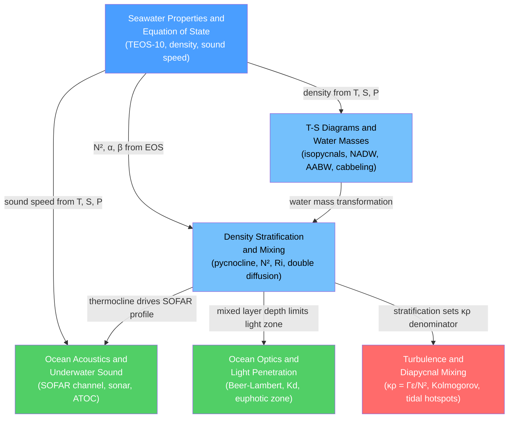

# Physical Oceanography — Map of Content

> [!info] How to use this map
> Start with **Seawater Properties**, follow the arrows, and use the Learning Path below as your guide.
> Each node links to a full note. Come back to this map when you feel lost.

Physical oceanography is the study of how seawater behaves as a physical fluid — how its density is set by temperature, salinity, and pressure; how those density contrasts layer the ocean into stacked water masses that persist for centuries; how stratification resists but ultimately permits vertical mixing through turbulence and double diffusion; and how the same temperature-salinity-pressure environment that governs density also governs the propagation of sound and the penetration of light. Together these six notes cover the physical state variables of seawater, the diagnostic tools (T-S diagrams) used to fingerprint water masses, the stability and mixing framework that links surface forcing to abyssal circulation, and two applied branches — underwater acoustics (SOFAR channel, sonar, acoustic thermometry) and ocean optics (Beer-Lambert attenuation, euphotic zone, satellite ocean color) — that exploit the physical structure of the water column for sensing and observation.

---

## Concept Map

*(Blue = foundational, Red = most advanced, Green = applied branches, arrows = "leads to" or "requires")*

---

## Learning Path

Recommended order for a first pass through this topic:

1. [[Seawater_Properties_and_Equation_of_State]] — start here; every other note inherits density, sound speed, and thermodynamic concepts from the equation of state
2. [[Temperature_Salinity_Diagrams_and_Water_Masses]] — apply the EOS to fingerprint and trace water masses in T-S space; introduces isopycnals, cabbeling, and the global water-mass census
3. [[Density_Stratification_and_Mixing]] — understand how water masses stack into layers, what the pycnocline is, how N² quantifies stability, and when turbulence breaks through
4. [[Turbulence_and_Diapycnal_Mixing]] — the advanced mechanics of diapycnal diffusivity: Kolmogorov cascade, Osborn's κρ = Γε/N², tidal hotspots, and the Munk-Wunsch energy budget
5. [[Ocean_Acoustics_and_Underwater_Sound]] — follow sound speed (derived from the same EOS) through the thermocline to the SOFAR waveguide; connects to sonar, whale communication, and acoustic thermometry
6. [[Ocean_Optics_and_Light_Penetration]] — follow sunlight through the stratified water column; Beer-Lambert attenuation, Kd, the euphotic zone, and satellite ocean color complete the picture of how the physical ocean is sensed

---

## All Notes in This Topic

| Note | Key Concept | Level Range |
|------|-------------|-------------|
| [[Seawater_Properties_and_Equation_of_State]] | TEOS-10 Gibbs potential; density as f(T, S, P); cabbeling; thermobaricity; SOFAR speed formula | Beginner–Intermediate |
| [[Temperature_Salinity_Diagrams_and_Water_Masses]] | T-S fingerprinting; isopycnals; water-mass mixing theorem; NADW, AAIW, AABW, MedOW; OMP analysis | Intermediate |
| [[Density_Stratification_and_Mixing]] | Pycnocline; buoyancy frequency N²; Richardson number; double diffusion; Kraus-Turner mixed layer | Intermediate |
| [[Turbulence_and_Diapycnal_Mixing]] | Kolmogorov cascade; Ozmidov scale; κρ = Γε/N²; Thorpe scale; Garrett-Munk spectrum; tidal mixing hotspots | Intermediate–Advanced |
| [[Ocean_Acoustics_and_Underwater_Sound]] | Mackenzie sound-speed formula; SOFAR channel; Snell's law ray tracing; sonar equation; ATOC thermometry | Intermediate |
| [[Ocean_Optics_and_Light_Penetration]] | Beer-Lambert law; Kd and Ze = 4.6/Kd; Jerlov water types; IOP vs AOP; satellite ocean color (PACE) | Beginner–Intermediate |

---

## Key Questions This Topic Answers

- Why does the ocean resist vertical mixing so strongly, and what overcomes that resistance?
- How can an oceanographer identify a water mass formed thousands of kilometres away using only temperature and salinity measurements?
- What creates the SOFAR channel, and why can fin-whale calls travel across entire ocean basins?
- How does the depth of sunlight penetration control where phytoplankton can grow?
- Why does the global overturning circulation depend on turbulent mixing driven by tides over rough seafloor topography?
- How does the nonlinear equation of state produce cabbeling — spontaneous densification when two equal-density water masses mix?

---

## Connections to Other Topics

- [[_MOC_Oceanography_Master]] — master entry point for the entire Oceanography vault; Physical Oceanography is the foundational section for all other sections
- [[Thermohaline_Circulation_and_AMOC]] — the density contrasts quantified here drive the Atlantic overturning; diapycnal mixing rates directly set AMOC strength
- [[Internal_Waves_and_Solitons]] — the primary energy pathway from tidal forcing to turbulence and diapycnal mixing
- [[Marine_Primary_Production_and_Phytoplankton]] — euphotic depth (from Ocean Optics) and mixed-layer depth (from Density Stratification) jointly control where phytoplankton can thrive
- [[_MOC_Physics_Master]] — Fluid Mechanics (buoyancy, N², Richardson number), Thermodynamics (TEOS-10 Gibbs function), and Wave Physics (Snell's law, acoustic modes) all underpin this section

---

#MOC #Oceanography #PhysicalOceanography
