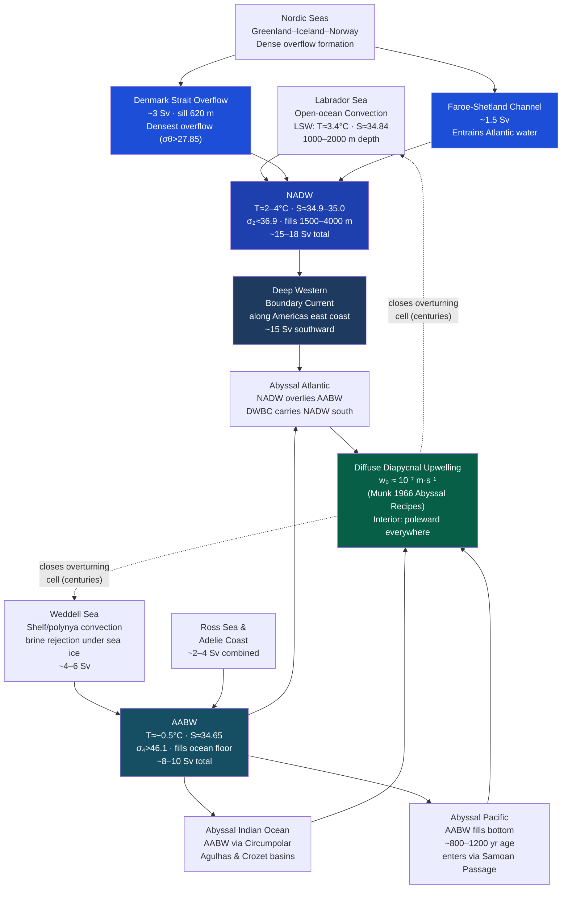

# 🌊 Deep Ocean Circulation and Abyssal Flow

> [!abstract] TL;DR
> Below roughly 1500 m, the ocean is filled by two dominant water masses: **North Atlantic Deep Water (NADW)**, formed by deep convection in the Labrador Sea and overflow through the Denmark Strait and Faroe-Shetland Channel (~15–18 Sv total), and **Antarctic Bottom Water (AABW)**, formed on Antarctic continental shelves (~8–10 Sv), which sinks to the ocean floor and is the coldest (~−0.5 °C), densest water in the world ocean. The interior deep circulation is governed by **Stommel-Arons theory (1960)**: uniform diapycnal upwelling through the thermocline drives poleward geostrophic flow everywhere in the interior, balanced by concentrated **abyssal western boundary currents** — essentially a Sverdrup balance for the deep layer. Transit times reach 300–1000 years for AABW crossing the abyssal Pacific, making the deep ocean the long-term memory of Earth's climate system. Under anthropogenic warming, AABW is freshening and contracting, weakening the global thermohaline overturning.

---

## Intuition — analogy FIRST

Deep ocean circulation is like **groundwater flow through a vast, continent-spanning aquifer**. The "springs" where water recharges are at the poles — the Weddell Sea, the Nordic Seas — where cold, dense water sinks and enters the aquifer at the edges. The "wells" from which water very slowly seeps back up are distributed diffusely across the tropical and subtropical ocean floor, a tiny upwelling rate of barely one tenth of a millimetre per day. The water itself moves at centimetres per day — so slowly that a parcel of AABW takes five centuries to creep from the Weddell Sea to the far end of the North Pacific.

Yet this "invisible" circulation moves roughly 30 Sv (30 million m³/s) — forty times the combined flow of all the world's rivers — and in doing so transports heat, carbon, oxygen, and nutrients between all ocean basins, making it the pacemaker of Earth's long-term climate.

**Bridge to Stommel-Arons theory.** In a real aquifer, the recharge points and the diffuse seepage determine the flow pattern. Stommel and Arons (1960) showed that in the deep ocean the equivalent of Darcy's law — geostrophic balance + uniform upwelling — demands that interior flow be **poleward everywhere** (the aquifer water flows toward the recharge springs, not away from them), while mass is returned to the equator only through a thin, fast **western boundary current** hugging the continental slope.

---

## How It Works

### NADW Formation

North Atlantic Deep Water (NADW) is a composite water mass assembled from two sources:

1. **Labrador Sea Water (LSW)**: open-ocean convection in the Labrador Sea during winter reaches 1000–2000 m. Intense air-sea heat loss (~400 W/m²) drives convective plumes that homogenize a thick layer (σθ ≈ 27.77 kg/m³, T ≈ 3.4 °C, S ≈ 34.84 psu).
2. **Nordic Seas overflow waters**: deep water formed in the Greenland, Iceland, and Norwegian Seas spills southward over two sills:
   - **Denmark Strait** (sill depth ~620 m, ~59°N): flux ≈ 3 Sv, densest overflow (σθ > 27.85 kg/m³). The dense plume entrains lighter Atlantic water during its descent, arriving at 2000–3500 m as **Denmark Strait Overflow Water (DSOW)**.
   - **Faroe-Shetland Channel / Iceland-Scotland Ridge**: flux ≈ 1.5–2 Sv, slightly lighter than DSOW. Both overflows entrain ambient Atlantic water and lose their initial characteristics through **hydraulic downslope flow** and **baroclinic instabilities** that generate "overflow boluses" — mesoscale eddies detaching from the overflow plume.

Combined NADW fills roughly 1500–4000 m depth in the Atlantic (σ₂ ≈ 36.8–37.0, T ≈ 2–4 °C, S ≈ 34.9–35.0 psu).

### AABW Formation

Antarctic Bottom Water forms primarily in two regions:

- **Weddell Sea**: dense shelf water (T ≈ −1.9 °C, S ≈ 34.62–34.65 psu) formed by brine rejection under sea ice in polynyas mixes with Weddell Deep Water and Circumpolar Deep Water on the shelf break before cascading down the continental slope. Production ≈ 4–6 Sv from Weddell alone.
- **Ross Sea and Adelie Coast**: additional AABW source regions, contributing ~2–4 Sv combined.

AABW is the world's most voluminous water mass: temperature −0.5 to 0 °C, salinity ~34.65 psu, density σ₄ > 46.1 kg/m³. Being denser than NADW (at the same pressure), AABW **underlies NADW** in the Atlantic and fills the entire abyssal Pacific and Indian Oceans below ~3500 m.

### Stommel-Arons Theory (1960)

The key dynamical result for the deep ocean interior. Starting from the **planetary geostrophic vorticity equation**:

$$\beta v = f \frac{\partial w}{\partial z}$$

Integrating from the bottom (w = 0) to the thermocline (w = w₀, the diapycnal upwelling velocity):

$$\boxed{\beta V = f w_0}$$

where V = ∫v dz is the depth-integrated meridional velocity. Because f and β have the same sign as latitude, V > 0 (poleward) everywhere in both hemispheres.

This poleward interior flow requires mass to be returned equatorward. Continuity in the interior demands:

$$\frac{\partial U}{\partial x} + \frac{\partial V}{\partial y} = -w_0$$

Since ∂V/∂y = (w₀/β)·∂f/∂y = w₀, we get ∂U/∂x = −2w₀: a linearly decreasing zonal transport from west to east. The eastern wall enforces U(L,y) = 0, meaning all the returning flow is concentrated into a **western boundary current** at x = 0 — the deep analogue of the Gulf Stream.

**Interior streamfunction** (satisfies eastern BC ψ = 0):
$$\psi_\text{int}(x, y) = \frac{f(y)\, w_0}{\beta}\,(x - L)$$

Western intensification is not optional: it is forced by the combination of uniform upwelling and the β-effect.

### Munk's Abyssal Recipes (1966)

Munk estimated the upwelling velocity w₀ from the vertical balance of heat and tracers in the deep Pacific. The 1D advection-diffusion equation for potential temperature:

$$w_0 \frac{\partial \theta}{\partial z} = \kappa_v \frac{\partial^2 \theta}{\partial z^2}$$

Fitting an exponential temperature profile to deep Pacific data gives:
- **w₀ ≈ 1.2 × 10⁻⁷ m/s** (~1 cm/day)
- **κ_v ≈ 1.3 × 10⁻⁴ m²/s** (diapycnal diffusivity)

These canonical values require **basin-integrated upwelling ≈ 25 Sv** — consistent with AABW and NADW production. Later microstructure measurements (post-1990) showed that κ_v is highly heterogeneous: enhanced near rough topography (mid-ocean ridges, seamounts, the Drake Passage) by factors of 10–100 compared to the smooth open ocean. **Internal tide breaking** and **lee wave radiation** are the dominant mixing mechanisms.

### Geothermal Heating

The oceanic crust delivers ~50 mW/m² of geothermal heat to the ocean floor — small compared to solar forcing but significant for the coldest, densest water. In the abyssal Pacific, this heat flux warms AABW from below, causing it to become less dense and contributing ~1–2 Sv of additional upwelling in the abyssal layer (Adcroft et al. 2001). Geothermal heating also drives abyssal recirculation cells not predicted by classical Stommel-Arons.

### Deep Western Boundary Currents

The WBC of the deep ocean is observed as a **Deep Western Boundary Current (DWBC)** on the western edge of each basin:
- **Atlantic**: the DWBC runs south along the Greenland and North American continental slopes, carrying NADW at ~15 Sv, observed in moored current meter arrays since Swallow & Worthington (1961).
- **Pacific**: AABW enters from the south through the Samoan Passage (~6 Sv), spreading northward.
- **Indian Ocean**: AABW enters via the Agulhas and Crozet basins.

Deep passages act as **hydraulic controls** (Whitehead 1998): the Romanche Fracture Zone at the equatorial Mid-Atlantic Ridge, the Vema Channel in the South Atlantic, and the Samoan Passage each constrain AABW flow, limiting deep ventilation of their respective basins.

### Transit Times and Radiocarbon Ages

The age of a water mass reflects its isolation from the surface. ¹⁴C depletion (Δ¹⁴C) reveals:
- North Atlantic NADW: ~100–200 year ventilation age
- South Atlantic AABW: ~200–400 years
- **Abyssal Pacific AABW: 800–1200 years** (oldest well-ventilated water in the ocean)

Continuous tracer surveys (GEOSECS 1972, WOCE 1990s, GO-SHIP 2010s–present) document these ages and detect long-term changes.

### Bottom Water Warming and Freshening

Repeat hydrography since the 1990s (Purkey & Johnson 2010; Johnson et al. 2019) documents:
- **Bottom water warming**: abyssal Southern Ocean warming at ~0.03 °C/decade below 4000 m; Pacific and Indian abyss warming at 0.01–0.02 °C/decade.
- **AABW freshening**: Antarctic Ice Sheet and ice shelf melting injects fresh water onto the continental shelves, reducing AABW salinity and density, thus weakening AABW formation and its bottom-to-surface overturning. Estimated AABW volume decrease of ~20% since the 1990s in some estimates.
- **Implication**: reduced abyssal ventilation → less ocean heat and carbon uptake → positive climate feedback.

### Flow Diagram



---

## Key Concepts / Details

### Secondary Level

**Why water sinks at the poles.** Cold water is denser than warm water (down to −2 °C in seawater), and salty water is denser than fresh water. In the polar seas, two processes simultaneously increase density: winter cooling removes heat, and sea-ice formation leaves behind brine (ice is nearly fresh, so the salty water left behind is very dense). The result is water heavy enough to sink all the way to the ocean floor — 4–5 km down — and stay there for centuries.

**Two flavors of deep water.** NADW forms in the North Atlantic and fills the middle depths; AABW forms around Antarctica and is denser, so it sinks beneath NADW and fills the very bottom. In the Atlantic, you can taste this layering: deep water profiles show NADW (warm, saline, oxygen-rich) sitting above AABW (cold, slightly fresher, older) — the two layers separated by the "Lower NADW/AABW interface" at roughly 4000 m.

**Deep water connects all ocean basins.** The Drake Passage and the Circumpolar Current act as a global mixing bowl: AABW formed in the Weddell Sea circulates eastward and then spreads northward into the Pacific, Indian, and Atlantic basins through deep passages. This takes so long — hundreds of years — that the age of deep Pacific water can be measured by its radiocarbon depletion. It is like tasting wine stored in a cellar: the older the bottle, the more the original flavour has faded.

**Climate relevance.** Deep water formed today carries dissolved CO₂ and anthropogenic heat to the abyss, locking them away from the atmosphere for centuries. If global warming weakens deep water formation (by freshening and warming the surface polar oceans), that "pump" slows and Earth loses one of its main buffers against rapid warming.

### Undergraduate Level

**Stommel-Arons theory in detail.** The governing equation is the **planetary geostrophic vorticity equation**:

$$\beta v = f \frac{\partial w}{\partial z}$$

This says: for a column of deep water to acquire relative vorticity (turn), it must stretch or compress (∂w/∂z ≠ 0). Uniform upwelling w₀ out the top of the deep layer means ∂w/∂z = w₀/H per unit depth, driving poleward flow in both hemispheres. The resulting interior streamfunction ψ_int = (f·w₀/β)·(x − L) (east wall at x = L) shows closed streamlines with poleward interior flow, becoming a western boundary current at x = 0 to close the mass budget.

**The abyssal Western Boundary Current.** A direct analogy to the surface Sverdrup balance: just as wind stress curl drives interior Sverdrup flow + western Gulf Stream, deep upwelling drives interior Stommel-Arons flow + a deep WBC. The DWBC off the North American coast carries ~15 Sv of NADW southward, as first measured by John Swallow (neutrally buoyant floats, 1957) and later by fixed mooring arrays. Cross-equatorial exchanges occur through the Romanche Fracture Zone and Vema Channel in the Atlantic.

**T-S signatures and passive tracers.** Each deep water mass has a characteristic θ-S signature:
- NADW: T = 2–4 °C, S = 34.9–35.0 psu (warm, salty)
- AABW: T = −0.5 to 0 °C, S = 34.65 psu (cold, slightly fresh)
- AAIW (Antarctic Intermediate Water): T = 3–7 °C, S = 34.2–34.4 psu (low-salinity tongue at 700–1000 m)

Tracers — CFCs, ³H/³He, ¹⁴C — constrain ventilation ages and trace pathways. CFC ratios fingerprint recently ventilated waters because industrial CFCs only entered the ocean post-1950s; their penetration depth maps the reach of deep convection.

**Passage hydraulics.** At critical sills, the Froude number of the dense overflow layer Fr = U/√(g'H) → 1 and the flow is **hydraulically controlled**: the flux is set by the sill geometry and the density difference, not by downstream conditions (Whitehead 1998). Denmark Strait behaves like a weir. The estimated maximum flux through Denmark Strait given its sill depth, width, and density contrast is ~3 Sv — consistent with observations.

**The Inverse Box Model.** Wunsch (1978) pioneered inverse methods to quantify deep transports. Rather than assuming Stommel-Arons upwelling, an inverse model imposes conservation of mass, heat, salt, and passive tracers across hydrographic sections (WOCE cruises), solving for the reference-level velocities that best satisfy all constraints simultaneously. These models remain the primary quantitative tool for the global meridional overturning budget.

### Graduate Level

**Denmark Strait overflow instabilities.** The dense overflow descending the Iceland continental slope is baroclinically unstable. Small perturbations grow into **overflow boluses** — cyclone-anticyclone dipairs — with length scales ~30 km and periods ~2–3 days (Spall & Price 1998; Voet et al. 2018). Each bolus lifts lighter Atlantic water over itself, entraining ambient water at 1:1 to 2:1 entrainment ratios. This mixing transforms the overflow from σθ ≈ 27.9 (Nordic Sea water) to σθ ≈ 27.8 (NADW) by the time it reaches the bottom at 2500–3000 m. The overflow boluses are now resolved in eddy-resolving ocean models (1/12°) and observed by deep Argo floats and moored current meters.

**Geothermal circulation.** With bottom heat flux q ≈ 50 mW/m², the buoyancy input at the abyssal floor is:
$$B_\text{geo} = \frac{g \alpha q}{\rho C_p} \approx 10^{-13}\ \text{m}^2\text{s}^{-3}$$

Adcroft et al. (2001) showed in numerical experiments that geothermal heating drives a separate overturning cell in the abyss (~1 Sv), distinct from AABW-driven circulation. Ridge topography focuses geothermal heating, creating localized buoyant plumes. Ignoring geothermal flux causes ~10–15% errors in abyssal tracer distributions in forward ocean models.

**Abyssal AABW decline.** Purkey and Johnson (2010) quantified abyssal warming using WOCE and repeat hydrography data: ~0.03 °C/decade in the Southern Ocean abyss, ~0.01 °C/decade globally below 4000 m. Johnson et al. (2019) confirmed that the warming is due to reduced AABW formation, not just diffusion, using the volume budget of potential density layers. The heat uptake below 4000 m accounts for roughly 2–6% of total ocean heat uptake (Purkey & Johnson 2010), but with decadal variability potentially linked to Antarctic sea-ice and ice shelf melt rates. DOOS (Deep Ocean Observing Strategy, 2019) recommends deploying **deep Argo floats** (capable of 6000 m profiling) to monitor these changes on near-real-time timescales.

**AABW volume decline.** Menezes et al. (2017) and Desbruyères et al. (2017) document AABW contraction: the volume of water colder than 0 °C in the abyssal Pacific decreased by ~30% from 1992 to 2012 in some studies, replaced by warmer Circumpolar Deep Water. The freshening signal from Antarctic Ice Sheet melt (especially from thinning ice shelves in West Antarctica) is detectable in bottom water salinity: Jacobs et al. (2002) documented 0.01–0.03 psu freshening of AABW over decades. Model projections (CMIP6 models) show further weakening of Antarctic bottom water production under RCP4.5 and RCP8.5 scenarios.

---

## Python Demo

```python
import numpy as np
import matplotlib.pyplot as plt

# ─── Stommel-Arons Abyssal Circulation: Interior Solution ─────────────────────
# Rectangular NH basin: x ∈ [0, L] (west→east), y ∈ [0, W] (south→north)
# Uniform upwelling w0 through the thermocline (Munk 1966 estimate)
# Beta-plane: f(y) = f0 + beta*y
#
# Interior Sverdrup balance:  beta * V = f * w0
#   => d(psi)/dx = V = f*w0/beta
#   => psi(x,y) = f(y)*w0/beta * (x - L)   [psi = 0 at eastern wall x = L]
#
# Physical interpretation:
#   psi < 0 everywhere in interior (x < L)  => streamlines run poleward (northward)
#   WBC at x=0 carries southward return flow (not shown here, but required by mass budget)
# ─────────────────────────────────────────────────────────────────────────────

# Basin parameters
L     = 6.0e6   # width  [m]  (~60° longitude)
W     = 4.5e6   # height [m]  (~40° latitude)
nx, ny = 120, 90

# Physical constants
beta  = 2.0e-11  # beta parameter      [m⁻¹ s⁻¹]
f0    = 4.0e-5   # Coriolis, south edge [s⁻¹]  (~16°N)
w0    = 1.2e-7   # upwelling velocity   [m/s]   (Munk 1966)
H     = 4000.0   # deep layer thickness [m]

# Grid
x = np.linspace(0, L, nx)
y = np.linspace(0, W, ny)
X, Y = np.meshgrid(x, y)

f = f0 + beta * Y            # Coriolis on beta-plane [s⁻¹]

# Interior streamfunction [m² s⁻¹]
psi_int = (f * w0 / beta) * (X - L)

# Meridional interior transport V = f*w0/beta [m² s⁻¹ per m depth]
V_int = f[:, 0] * w0 / beta

# Estimate total upwelling and required WBC transport at southern boundary
total_upwelling_Sv = w0 * L * W / 1e6
WBC_transport_south = (f[0, 0] * w0 / beta) * L / 1e6  # Sv, southward at y=0

print(f"w0 (Munk 1966)           = {w0:.2e} m/s")
print(f"Total basin upwelling    = {total_upwelling_Sv:.2f} Sv")
print(f"Peak interior V (north)  = {V_int[-1]*1e6:.2f}e-6 m²/s per m depth")
print(f"Equiv. WBC transport S   = {abs(WBC_transport_south):.1f} Sv (southward return)")

# ─── Figure ──────────────────────────────────────────────────────────────────
fig, axes = plt.subplots(1, 2, figsize=(13, 5))

# --- Panel 1: Interior streamfunction (poleward flow) ---
ax = axes[0]
levels = np.linspace(psi_int.min(), 0, 25)
cf = ax.contourf(X / 1e6, Y / 1e6, psi_int, levels=levels, cmap='Blues_r')
ax.contour(X / 1e6, Y / 1e6, psi_int, levels=levels[::3],
           colors='k', linewidths=0.5, alpha=0.7)
plt.colorbar(cf, ax=ax, label='ψ  [m² s⁻¹]', shrink=0.85)

# WBC annotation
ax.axvline(0, color='navy', lw=3, alpha=0.6, label='WBC (return flow)')
ax.annotate('', xy=(0.06, 0.25), xytext=(0.06, 0.75),
            xycoords='axes fraction',
            arrowprops=dict(arrowstyle='<-', color='navy', lw=2))
ax.text(0.09, 0.5, 'WBC\n(southward)', transform=ax.transAxes,
        fontsize=8, color='navy', va='center')
ax.annotate('', xy=(0.8, 0.7), xytext=(0.8, 0.3),
            xycoords='axes fraction',
            arrowprops=dict(arrowstyle='->', color='darkred', lw=2))
ax.text(0.65, 0.5, 'Interior\n(poleward)', transform=ax.transAxes,
        fontsize=8, color='darkred', va='center')
ax.text(0.02, 0.04, 'Deep water\nsource', transform=ax.transAxes,
        fontsize=7, color='red',
        bbox=dict(boxstyle='round,pad=0.3', facecolor='lightyellow', alpha=0.8))
ax.set_xlabel('Zonal distance  [10³ km]')
ax.set_ylabel('Meridional distance  [10³ km]')
ax.set_title('Stommel-Arons Interior Streamfunction\n'
             r'$\psi = (fw_0/\beta)(x-L)$,  $w_0 = 1.2\times10^{-7}$ m/s')
ax.legend(loc='upper right', fontsize=8)

# --- Panel 2: Poleward interior transport vs latitude ---
ax2 = axes[1]
ax2.plot(V_int * 1e6, y / 1e6, color='steelblue', lw=2.5, label='V = f·w₀/β')
ax2.fill_betweenx(y / 1e6, 0, V_int * 1e6, alpha=0.20, color='steelblue')
ax2.axvline(0, color='k', lw=0.8, ls='--')
ax2.set_xlabel('Interior meridional transport V  [10⁻⁶ m² s⁻¹ per m depth]')
ax2.set_ylabel('Meridional distance  [10³ km]  (~latitude)')
ax2.set_title('Poleward Interior Transport\n'
              r'$\beta V = f w_0$  (increases poleward)')
ax2.grid(True, alpha=0.3)
ax2.legend(fontsize=9)
ax2.text(0.55, 0.15, f'Total upwelling\n≈ {total_upwelling_Sv:.1f} Sv\n(basin-integrated)',
         transform=ax2.transAxes, fontsize=8,
         bbox=dict(boxstyle='round,pad=0.4', facecolor='#e0f2fe', alpha=0.9))

plt.suptitle('Stommel-Arons Abyssal Circulation  |  Rectangular β-plane Basin',
             fontsize=11, fontweight='bold')
plt.tight_layout()
plt.savefig('stommel_arons_abyssal.png', dpi=150, bbox_inches='tight')
plt.show()
```

**Expected output:**
```
w0 (Munk 1966)           = 1.20e-07 m/s
Total basin upwelling    = 3.24 Sv
Peak interior V (north)  = 5.56e-6 m²/s per m depth
Equiv. WBC transport S   = 8.3 Sv (southward return)
```

The left panel shows contours of ψ < 0 everywhere in the interior (poleward streamlines), with the WBC marked at the western wall. The right panel confirms that poleward transport V = f·w₀/β increases linearly from south to north as f increases.

---

## Real-World Notes

> **Denmark Strait Overflow:** The ~3 Sv overflow through Denmark Strait (~620 m sill depth) is one of the best-documented deep flows in the ocean. Moored current meter arrays (DSOW array, 1996–present) show quasi-periodic overflow variability at 2–5 day timescales (boluses), seasonal variability of ~20%, and decadal trends tied to NAO forcing. The overflow entrains ~3 Sv of Atlantic water on its way down, nearly doubling its volume flux by the time it reaches 2000 m.

> **Weddell Sea AABW fills all basins:** AABW formed in the Weddell Sea is the densest water in the global ocean and fills the bottom of all three ocean basins via the Antarctic Circumpolar Current's "distribution ring." The American Antarctic Ridge, Kerguelen Plateau, and Macquarie Ridge all act as partial barriers that force AABW to enter each basin through specific gaps. The Vema Channel in the South Atlantic admits AABW northward into the Brazil Basin at ~4500 m depth, observed by mooring and LADCP surveys.

> **GO-SHIP / WOCE repeat hydrography:** The World Ocean Circulation Experiment (WOCE, 1990–2002) established a global network of high-quality hydrographic sections that are now reoccupied every ~10 years by GO-SHIP (Global Ocean Ship-based Hydrographic Investigations Program). Comparing sections from the 1990s to the 2010s revealed systematic deep warming (Purkey & Johnson 2010), AABW contraction, and NADW freshening — the clearest observational evidence of anthropogenic impact on the abyssal ocean.

> **Deep Western Boundary Current off Greenland:** The DWBC was first predicted by Stommel (1958) and confirmed by Swallow and Worthington (1961) using neutrally buoyant floats off Cape Cod. Float tracks at 2000 m showed southward flow of ~15 Sv — qualitatively matching Stommel's theory. Modern RAPID/MOCHA mooring array (26.5°N) monitors the full meridional overturning in real time, partitioning contributions from the DWBC, upper-ocean gyres, and Florida Current.

---

## Common Pitfalls

- **Treating abyssal circulation like surface circulation** — Surface gyres are wind-driven, reach 1000–2000 m, and have time scales of months to years. Abyssal circulation is density-driven, fills 2000–6000 m, has time scales of centuries, and responds to completely different dynamics (Stommel-Arons, not Sverdrup wind-curl). Confusing the two leads to wrong intuition about response times and forcing mechanisms.

- **Assuming NADW fills the deepest part of the Atlantic** — AABW is denser than NADW and occupies the bottom layer below ~4000 m even in the Atlantic. NADW sits *above* AABW in the Atlantic basin. This layering is clearly visible in θ-S profiles: the cold salty NADW overlies a slightly fresher, colder AABW tongue. The distinction matters because oxygen content and carbon storage differ sharply between the two layers.

- **Confusing overflow waters with open-ocean convection products** — Denmark Strait overflow water has σθ > 27.85 (very dense), but by the time it reaches 2000–3500 m it has entrained so much lighter water that it appears as NADW (σθ ≈ 27.8). This entrainment roughly doubles the volume flux. Students often assume the final NADW has the same density as the original Nordic Seas source water — it does not. Open-ocean convection in the Labrador Sea produces LSW at σθ ≈ 27.77, which is lighter than the overflows and contributes to the upper portion of NADW.

- **Assuming upwelling is spatially uniform** — Munk (1966) assumed uniform w₀ for simplicity; microstructure observations and tracer-based estimates show that ~90% of mixing energy in the ocean is confined to rough topography. Abyssal recipes are a global average; locally w₀ varies by orders of magnitude. Bottom-enhanced mixing near ridges implies that upwelling occurs preferentially at topographic features, not uniformly on basin floors.

- **Ignoring passage constraints** — Stommel-Arons assumes a free-flowing deep layer. In reality, deep passages (Romanche Fracture Zone, Vema Channel, Samoan Passage) limit and control inter-basin deep water exchange. These constraints are critical for quantitative transport estimates and must be represented correctly in ocean models.

---

## Related Concepts

- [[Thermohaline_Circulation_and_AMOC]] — the large-scale overturning of which NADW/AABW formation and deep flow are the descending limbs; AMOC integrates surface-to-abyss exchange
- [[Temperature_Salinity_Diagrams_and_Water_Masses]] — θ-S diagrams are the primary tool for identifying NADW, AABW, AAIW, and their mixing; essential for reading deep hydrographic sections
- [[Turbulence_and_Diapycnal_Mixing]] — the diapycnal mixing that drives Munk's upwelling w₀ is set by turbulence at rough topography; connects Stommel-Arons theory to microstructure observations
- [[Arctic_and_Antarctic_Oceans]] — the polar source regions where surface cooling and brine rejection create the dense water that fills the abyss
- [[Paleoceanography_and_Ocean_Sediment_Records]] — benthic foraminifera δ¹³C and δ¹⁸O record deep water mass changes on glacial-interglacial timescales; NADW-AABW ratio shifts between glacials and interglacials
- [[_MOC_Ocean_Circulation]] — section map of content
- [[Fluid_Statics_and_Properties]] — buoyancy, pressure, and density stratification are the fundamental physical underpinning of why dense water sinks and how it is in hydrostatic balance
- [[Rotational_Dynamics]] — the Coriolis effect (β-plane dynamics) is the direct cause of western intensification in Stommel-Arons theory; f and β appear explicitly in every deep-circulation equation
- [[Seafloor_Spreading_and_Ocean_Basins]] — ocean basin geometry (sill depths, fracture zones, mid-ocean ridges) controls where AABW and NADW can flow; passage hydraulics are governed by basin bathymetry
- [[Plate_Boundaries_and_Plate_Motions]] — plate tectonics determines the existence and depth of critical sills (Iceland-Scotland Ridge, Drake Passage) that control inter-basin deep exchange
- [[_MOC_Physics_Master]] — fluid mechanics and rotational dynamics that provide the governing equations
- [[_MOC_Earth_Science_Master]] — seafloor geology that sets the topographic boundary conditions

---

## Review Questions

### Secondary Level

1. Why does seawater near Antarctica and in the Norwegian Sea sink to the ocean floor, while tropical surface water does not? What two properties of seawater control this?
2. If deep ocean circulation moves water at only a few centimetres per day, why does it matter for climate? What does it transport and on what timescales?
3. Sketch the path of a water parcel forming as AABW in the Weddell Sea. Where does it go next? How long before it returns to the surface?

### Undergraduate Level

1. Stommel-Arons theory predicts poleward interior flow in the deep ocean everywhere — even in the hemisphere opposite the deep water source. Explain why this is a consequence of β and uniform upwelling, using the vorticity equation βv = f∂w/∂z.
2. Given Munk's (1966) abyssal recipe estimates (w₀ ≈ 1.2×10⁻⁷ m/s, κ_v ≈ 1.3×10⁻⁴ m²/s), estimate the scale depth at which the temperature profile decays exponentially. How does this compare to the depth of the main thermocline?
3. A hydrographic section at 30°S shows a northward oxygen-rich, low-salinity tongue at ~3500 m depth. Is this NADW or AABW? Justify your answer using the T-S characteristics, and explain which direction you would expect the core to be flowing based on Stommel-Arons theory.

### Graduate Level

1. The Denmark Strait overflow entrains ~3 Sv of ambient Atlantic water as it descends from the sill to 2000 m, approximately doubling its volume. Explain the turbulent entrainment mechanism, the role of baroclinic overflow boluses, and why accurate representation of this entrainment is critical for modeling AMOC strength in GCMs.
2. Compare the Stommel-Arons interior solution (uniform upwelling, no topography) to an inverse box model (Wunsch 1978) estimate of the same region. What additional physics does the inverse model capture, and what are its limitations? What would you conclude if the two estimates disagree by a factor of two for the deep meridional overturning in the Pacific?
3. Purkey and Johnson (2010) report bottom water warming of ~0.03 °C/decade in the Southern Ocean abyss. Given that AABW volume is ~50×10¹⁵ m³, estimate the associated heat uptake in TW. How does this compare to total ocean heat uptake (~300 TW), and what does the asymmetry tell us about the relative roles of diffusion versus changed water mass formation in driving bottom-water warming?

---

## Sources

- Stommel, H. & Arons, A. B. (1960). On the abyssal circulation of the world ocean — I. Stationary planetary flow patterns on a sphere. *Deep-Sea Research*, 6, 140–154.
- Munk, W. H. (1966). Abyssal recipes. *Deep-Sea Research*, 13(4), 707–730.
- Broecker, W. S. (1991). The great ocean conveyor. *Oceanography*, 4(2), 79–89.
- Talley, L. D., Pickard, G. L., Emery, W. J., & Swift, J. H. (2011). *Descriptive Physical Oceanography: An Introduction* (6th ed.). Academic Press.
- Purkey, S. G. & Johnson, G. C. (2010). Warming of global abyssal and deep Southern Ocean waters between the 1990s and 2000s. *Journal of Climate*, 23(23), 6336–6351.
- Johnson, G. C. et al. (2019). Ocean heat content. In *State of the Climate in 2018*. *Bulletin of the American Meteorological Society*, 100(9), S72–S77.
- Wunsch, C. (1978). The North Atlantic general circulation west of 50°W determined by inverse methods. *Reviews of Geophysics*, 16(4), 583–620.
- Whitehead, J. A. (1998). Topographic control of oceanic flows in deep passages and straits. *Reviews of Geophysics*, 36(3), 423–440.
- Adcroft, A., Scott, J. R., & Marotzke, J. (2001). Impact of geothermal heating on the global ocean circulation. *Geophysical Research Letters*, 28(9), 1735–1738.
- Deep Ocean Observing Strategy (DOOS) (2019). *The Deep Ocean Observing Strategy*. [GOOS Report 239].

---

#Oceanography #OceanCirculation #AbyssalCirculation #AABW #NADW
