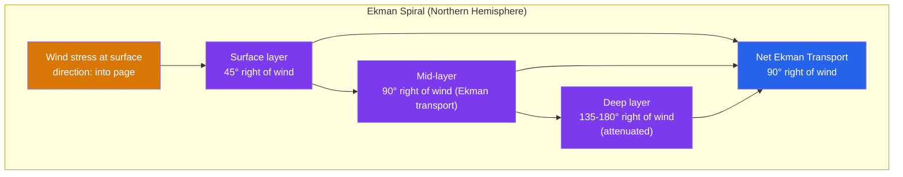
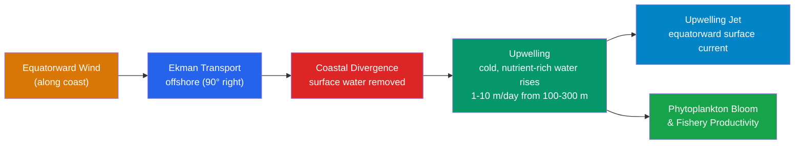

# Ekman Transport and Coastal Upwelling

> [!abstract] TL;DR
> When wind blows steadily over the ocean surface, it does not simply push water in the wind direction. The Coriolis effect deflects successive thin layers of water at progressively smaller angles, creating a velocity spiral through the water column known as the **Ekman spiral**. The depth-integrated result — **Ekman transport** — is directed exactly 90° to the right of the wind (Northern Hemisphere) or to the left (Southern Hemisphere). When winds blow parallel to a coast and Ekman transport drives surface water offshore, cold, nutrient-rich water from depth is drawn up to replace it: **coastal upwelling**. This mechanism underpins some of Earth's most productive fisheries, including the Peru–Humboldt, California, and Benguela current systems, and plays an outsized role in global carbon cycling.

---

## Intuition

**Analogy:** If you blow steadily across a wide, calm swimming pool, the water directly in front of you moves forward — but not perfectly forward. On a rotating Earth the whole pool is slowly spinning, and each thin layer of water it sets in motion gets nudged sideways before it can pass the push down to the layer below it. The top layer deflects a little rightward (in the Northern Hemisphere), the next layer inherits that push but deflects a little more, the one below it more still — until by the time you are ~100 m down the water is moving roughly opposite to the wind at the surface. Draw the tip of each layer's velocity vector and the result traces a downward-narrowing helix: the **Ekman spiral**.

The crucial consequence: add up all those layer velocities from surface to bottom and the total transport points **90° to the right of the wind**, not downwind. Now place a coastline on the left of a northward-blowing wind (a classic Eastern Boundary situation): the Ekman transport drives surface water straight offshore to the right, and the only thing that can fill that void is cold water welling up from hundreds of metres below. That is **coastal upwelling** — and with it comes a continuous conveyor belt of nutrients that fuels massive marine food webs.

---

## How It Works

### The Ekman Spiral

Vagn Walfrid Ekman (1905) derived the steady solution for wind-driven flow in a rotating ocean with constant eddy viscosity $K$. Starting from the momentum balance between Coriolis acceleration and vertical turbulent diffusion:

$$f\,\hat{k}\times\mathbf{u} = K\,\frac{\partial^2 \mathbf{u}}{\partial z^2}$$

The complex-velocity solution (using $u + iv$ where $u$ is eastward and $v$ is northward) for a wind stress $(\tau^x, \tau^y)$ applied at the surface is:

$$u(z) + i\,v(z) = \frac{\tau^x + i\,\tau^y}{\rho\,\sqrt{Kf}}\,e^{z/\delta_E}\,e^{i(\pi/4 + z/\delta_E)}$$

The **Ekman depth** $\delta_E$ sets the scale of the spiral:

$$\boxed{\delta_E = \sqrt{\frac{2K}{f}}}$$

With typical open-ocean values ($K \approx 0.01\text{ m}^2\text{s}^{-1}$, $f = 10^{-4}\text{ s}^{-1}$ at mid-latitudes) this gives $\delta_E \approx 14\text{ m}$ for the e-folding depth, with practical influence extending to **40–100 m**. The surface current is directed 45° to the right of the wind; at depth $\pi\delta_E$ the current reverses direction; below $\sim 2\pi\delta_E$ the wind's influence is negligible.

### Ekman Transport

Integrating the horizontal velocity over the full Ekman layer yields the **Ekman transport vector** $\mathbf{M}^E$:

$$\boxed{\mathbf{M}^E = \frac{1}{\rho f}\,\hat{k}\times\boldsymbol{\tau}}$$

This has dimensions of m² s⁻¹ (volume flux per unit width of coastline). For a westerly wind stress $\tau^x = 0.1\text{ N m}^{-2}$ at 45°N ($f = 10^{-4}\text{ s}^{-1}$):

$$M^E_y = -\frac{\tau^x}{\rho f} = -\frac{0.1}{1025\times10^{-4}} \approx -0.98\text{ m}^2\text{s}^{-1}$$

The transport is southward — 90° to the right of a westward-blowing trade would be equatorward, consistent with upwelling on an eastern boundary.

### Ekman Pumping

When the wind field is not uniform, the curl of the wind stress forces vertical motion at the base of the Ekman layer — **Ekman pumping** $w_E$:

$$\boxed{w_E = \frac{1}{\rho f}\,\nabla\times\boldsymbol{\tau} = \frac{1}{\rho f}\left(\frac{\partial\tau^y}{\partial x} - \frac{\partial\tau^x}{\partial y}\right)}$$

A positive (cyclonic) wind-stress curl drives **upwelling** ($w_E > 0$); anticyclonic curl drives **downwelling**. This is distinct from the coastal boundary-forced upwelling described next.

### Coastal Upwelling Mechanism

Eastern boundary current systems (California, Humboldt/Peru, Benguela, Canary, Somali) share the same forcing geometry:

1. **Equatorward winds** blow roughly parallel to the coast on the eastern margin of subtropical gyres.
2. Ekman transport drives surface water **offshore** (90° to the right in NH, to the left in SH).
3. A coastal divergence develops — surface water cannot be replaced laterally because the coast is a boundary.
4. **Continuity demands upwelling**: cold, nutrient-rich water from 100–300 m depth rises at ~1–10 m/day.
5. A **coastal upwelling jet** (equatorward geostrophic current) develops along the surface front where cold upwelled water meets warmer offshore water.
6. A **poleward undercurrent** (e.g., California Undercurrent, Peru Undercurrent) flows beneath the surface jet at ~100–300 m depth, carrying warm, salty, oxygen-poor water from equatorial regions.

### Bakun Upwelling Index

A practical measure of upwelling intensity is the **Bakun (1990) upwelling index**, the offshore Ekman transport per unit coastline length:

$$UI = \frac{\tau_{\parallel}}{\rho f}$$

where $\tau_\parallel$ is the along-shore wind stress component (positive equatorward). Units are m² s⁻¹ or sometimes expressed as m³ s⁻¹ per 100 m of coastline. Climatological indices are computed from atmospheric reanalysis products (ERA5, NCEP) and correlate strongly with chlorophyll anomalies and fishery catch records.

### Mermaid Diagrams





---

## Key Concepts / Details

### Secondary Level

- **Wind pushes water sideways, not downwind.** On a rotating Earth, the integrated ocean response to steady wind is directed 90° to the right (NH) or left (SH) of that wind — not along it. This is the single most counterintuitive fact about wind-driven ocean currents.
- **Coastal upwelling brings cold, nutrient-rich water to the surface.** Sunlight cannot penetrate more than ~100 m, so deep waters that never see the Sun are rich in dissolved nitrate, phosphate, and silicic acid. When upwelling delivers these nutrients into the sunlit euphotic zone, phytoplankton bloom explosively.
- **That is why Peru has great fishing.** The Humboldt Current upwelling system off Peru and Chile is among the most productive marine environments on Earth. When upwelling shuts down during El Nino years, anchovy stocks collapse catastrophically — and with them the seabirds and marine mammals that depend on them.

### Undergraduate Level

**Ekman spiral derivation (constant eddy viscosity).** The linearized, steady, horizontal momentum equations in a rotating frame with vertical diffusion give:

$$f\,v = K\,\frac{\partial^2 u}{\partial z^2}, \quad -f\,u = K\,\frac{\partial^2 v}{\partial z^2}$$

Combining into a single ODE for $w = u + iv$ and applying the boundary conditions (wind stress at $z = 0$, decay as $z \to -\infty$) yields the classical Ekman solution above. The phase rotation $e^{i\pi/4}$ means the **surface current is 45° to the right of the wind**, not 90°; the 90° direction is the net transport only after vertical integration.

**Ekman transport vector and units.** $\mathbf{M}^E$ has units of m² s⁻¹ = volume flux per unit width. Multiply by coastline length (m) to get total volume transport (m³ s⁻¹ = Sverdrups × 10⁻⁶). A wind stress of 0.1 N m⁻² at 30°N ($f = 7.3 \times 10^{-5}$ s⁻¹) yields $|\mathbf{M}^E| \approx 1.34$ m² s⁻¹, which over a 1000 km coastline is ~1.3 × 10⁶ m³ s⁻¹ ≈ 1.3 Sv.

**Ekman pumping and the subtropical gyre.** Large-scale anticyclonic wind stress curl over the subtropical ocean (negative $\nabla\times\boldsymbol{\tau}$ in the NH) drives **downwelling** at the base of the Ekman layer (~30–100 m day⁻¹). This feeds Sverdrup transport in the interior and ultimately drives the wind-driven gyres, connecting Ekman dynamics to basin-scale circulation via the [[Wind_Driven_Circulation_and_Sverdrup_Balance|Sverdrup balance]].

**Bakun upwelling index and observational evidence.** Satellite-derived SST shows that upwelling systems have surface temperatures 2–8°C colder than surrounding waters. Satellite ocean colour (MODIS, SeaWiFS) reveals persistent chlorophyll-a plumes. The upwelling index correlates with both wind stress anomalies (from ERA5) and with fishery catch data at interannual timescales, providing an integrated observable for the complete physical–biological chain.

**Coastal upwelling jet and poleward undercurrent.** As cold water rises at the coast and warm water sits offshore, a density (buoyancy) gradient develops across-shore. Geostrophic adjustment converts this into an **equatorward surface jet** (California Current surface expression, Peru Current). Beneath it, a **poleward undercurrent** is maintained by the across-shore pressure gradient: water imported along the coast from low latitudes at depth. In the California system this undercurrent (the California Undercurrent) can be traced continuously from Baja California to Oregon.

### Graduate Level

**Stokes drift vs Ekman drift.** The Ekman drift is an Eulerian (fixed-point) average current. Surface gravity waves generate a net Lagrangian drift in the wave propagation direction called **Stokes drift** $\mathbf{u}_{St}$. In the presence of both, the wave-averaged momentum equation (Craik–Leibovich theory) includes a **vortex force** $\mathbf{u}_{St} \times \boldsymbol{\omega}$, and the correct transport combining Stokes and Ekman contributions must be used for tracer (e.g., surface plastic, phytoplankton) dispersion estimates. Ignoring Stokes drift biases Lagrangian trajectories by 10–30%.

**Nonlinear Ekman layer and Langmuir circulation.** Real Ekman layers are not laminar. When Stokes drift and wind-driven shear interact, they produce **Langmuir turbulence** — counter-rotating vortices aligned with the wind (Langmuir cells) that create surface convergence streaks. This enhances vertical mixing beyond constant-K predictions, deepening the effective Ekman layer and altering the directional response. Large-eddy simulations (Skyllingstad & Denbo 1995; McWilliams et al. 1997) show the Langmuir turbulence velocity scale $u_{La} = (u_* u_{St,0})^{1/2}$ (turbulent Langmuir number $La_t = (u_*/u_{St,0})^{1/2}$) must be $\ll 1$ for Langmuir turbulence to dominate over pure shear turbulence.

**Turbulent Ekman layer and bulk formulae.** In GCMs the constant-K assumption is replaced by turbulence closure schemes (KPP — Large, McWilliams & Doney 1994; Large & Yeager 2009 bulk formulae). These relate wind stress to 10-m wind speed: $\boldsymbol{\tau} = \rho_a C_D |\mathbf{u}_{10}| \mathbf{u}_{10}$ with the drag coefficient $C_D \approx 1.2\text{–}1.5\times10^{-3}$ depending on stability. Misspecification of $C_D$ directly biases the Ekman transport and hence upwelling velocity estimates.

**Wind-curl-driven upwelling in the tropics (cold tongue).** At the equator, $f \to 0$, so the Ekman transport formula diverges. Equatorial dynamics require a different framework (equatorial waves, Yoshida jet). Nevertheless, just north and south of the equator, trade wind curl drives upwelling that maintains the **equatorial cold tongue** in the Pacific and Atlantic — a feature central to ENSO dynamics and global heat export. The upwelling velocity $w_E \sim 10^{-6}$ m s⁻¹ at the base of the equatorial Ekman layer is small but acts over vast areas.

---

## Python Demo

```python
# Ekman spiral hodograph and depth profiles
# Wind stress: tau_x = 0.1 N/m^2 (westerly), tau_y = 0.0
# Parameters: K = 0.01 m^2/s, f = 1e-4 s^-1, rho = 1025 kg/m^3

import numpy as np
import matplotlib.pyplot as plt

# Parameters
K = 0.01      # eddy viscosity [m^2/s]
f = 1e-4      # Coriolis parameter at ~45 deg N [s^-1]
rho = 1025.0  # seawater density [kg/m^3]
tau_x = 0.1   # wind stress x-component [N/m^2]
tau_y = 0.0   # wind stress y-component

# Ekman depth (e-folding scale)
delta_E = np.sqrt(2 * K / f)   # ~14 m for these parameters

# Depth array (negative downward)
z = np.linspace(0, -4 * np.pi * delta_E, 400)

# Analytical Ekman solution: complex velocity
# w(z) = (tau_x + i*tau_y) / (rho * sqrt(K*f)) * exp(z/delta_E) * exp(i*(pi/4 + z/delta_E))
tau_complex = tau_x + 1j * tau_y
amplitude = tau_complex / (rho * np.sqrt(K * f))
w = amplitude * np.exp(z / delta_E) * np.exp(1j * (np.pi / 4 + z / delta_E))

u = w.real
v = w.imag

fig, axes = plt.subplots(1, 3, figsize=(13, 5))

# --- Hodograph (Ekman spiral) ---
ax = axes[0]
sc = ax.scatter(u, v, c=z, cmap='Blues_r', s=12, zorder=3)
ax.plot(u, v, 'b-', lw=1, alpha=0.6)
ax.axhline(0, color='k', lw=0.5)
ax.axvline(0, color='k', lw=0.5)
# Mark surface and Ekman depth
ax.plot(u[0], v[0], 'ro', ms=8, label=f'Surface (45° right of wind)')
idx_de = np.argmin(np.abs(z + delta_E))
ax.plot(u[idx_de], v[idx_de], 'gs', ms=8, label=f'z = -δ_E ({-delta_E:.1f} m)')
ax.annotate('Wind →', xy=(0.05, 0.95), xycoords='axes fraction',
            fontsize=9, color='darkorange')
ax.set_xlabel('u [m/s]')
ax.set_ylabel('v [m/s]')
ax.set_title('Ekman Spiral (hodograph)')
ax.legend(fontsize=8)
ax.set_aspect('equal')
plt.colorbar(sc, ax=ax, label='Depth [m]')

# --- U profile ---
ax = axes[1]
ax.plot(u, z, 'b-', lw=2)
ax.axvline(0, color='k', lw=0.5)
ax.axhline(-delta_E, color='g', ls='--', lw=1, label=f'δ_E = {delta_E:.1f} m')
ax.set_xlabel('u (eastward) [m/s]')
ax.set_ylabel('Depth [m]')
ax.set_title('Eastward velocity profile')
ax.legend(fontsize=8)
ax.grid(alpha=0.3)

# --- V profile ---
ax = axes[2]
ax.plot(v, z, 'r-', lw=2)
ax.axvline(0, color='k', lw=0.5)
ax.axhline(-delta_E, color='g', ls='--', lw=1, label=f'δ_E = {delta_E:.1f} m')
ax.set_xlabel('v (northward) [m/s]')
ax.set_ylabel('Depth [m]')
ax.set_title('Northward velocity profile')
ax.legend(fontsize=8)
ax.grid(alpha=0.3)

# Compute and print Ekman transport
ME_x = np.trapz(u, z)
ME_y = np.trapz(v, z)
print(f"Ekman depth delta_E = {delta_E:.2f} m")
print(f"Ekman transport: M_x = {ME_x:.4f} m^2/s, M_y = {ME_y:.4f} m^2/s")
print(f"Analytical M_y = {-tau_x/(rho*f):.4f} m^2/s  (should match M_y above)")

plt.tight_layout()
plt.suptitle('Ekman Spiral: westerly wind stress tau_x = 0.1 N/m^2', y=1.02)
plt.savefig('ekman_spiral.png', dpi=120, bbox_inches='tight')
plt.show()
```

The printout confirms that the numerically integrated transport $M_y$ matches the analytical value $-\tau^x / (\rho f) \approx -0.976$ m² s⁻¹ — directed southward (offshore if coast is to the east), as expected for a westerly wind in the Northern Hemisphere.

---

## Real-World Notes

**Peru–Humboldt Current system.** The world's single most important upwelling system. Equatorward (southerly) winds along the South American coast drive offshore Ekman transport (to the left of the wind in the SH), bringing cold, nutrient-laden water from ~200–400 m depth to the surface across a band extending ~1000 km offshore. This fuels anchovy (*Engraulis ringens*) stocks that at their peak supported catches of ~12–20 million tonnes per year — historically **~15–20% of total global marine fish catch**. During El Nino years the equatorward winds relax, Ekman transport collapses, and the warm water cap prevents upwelling; anchovy catches can fall by 80–90% in a single year, triggering major economic disruptions.

**California Current system.** Northerly winds along the US West Coast drive offshore Ekman transport (90° to the right, i.e., westward) throughout spring and summer. The resulting cold upwelling zone sustains Dungeness crab, Chinook salmon, Pacific sardine, and a foundational krill population that feeds humpback whales. The upwelling front, visible in SST satellite imagery as a cold plume hugging the coast, moves seasonally from north to south and correlates closely with the Pacific Decadal Oscillation (PDO) at decadal timescales.

**Benguela Current system.** Off southwestern Africa (Namibia–South Africa), the southerly trade winds drive one of the most intense upwelling regimes on Earth. SST can be 10°C cooler than the open Atlantic at the same latitude. The system supports the world-famous **sardine run** — millions of Sardina sagax migrating northward along the KwaZulu-Natal coast — as well as anchovy and hake fisheries critical to Namibian and South African economies. Oxygen minimum zones (OMZ) are extreme here due to high organic matter export from the upwelling and sluggish ventilation.

**Upwelling regions as climate regulators.** Eastern boundary upwelling systems are net sources of CO₂ to the atmosphere: cold deep water is rich in respired CO₂ from sinking organic matter, and as it upwells and warms, it outgasses. However, the high biological productivity also drives significant carbon drawdown by phytoplankton — the biological pump partially counters the physical outgassing. The net balance and its sensitivity to wind-stress changes under climate change is an active research area with significant uncertainty in IPCC carbon-budget estimates.

---

## Common Pitfalls

- **Confusing transport direction with surface current direction.** The surface current is 45° to the right of the wind; the depth-integrated Ekman transport is 90° to the right. Students often apply the wrong angle. The 90° rule applies to the column integral; real surface drifters trace curves closer to 20–45° depending on wave-modified dynamics.
- **Thinking upwelling happens directly at the coastline.** In practice the maximum vertical velocity is located slightly offshore (a few km to tens of km) where the coastal divergence is strongest and stratification is weaker. The coldest SST signature often appears as a narrow filament just offshore, not pressed against the beach.
- **Ignoring the frequency of wind forcing.** The Ekman layer has a spin-up time of order $f^{-1}$ (~3 hours at mid-latitudes). For wind events shorter than this, the steady-state Ekman balance never establishes, and inertial currents (oscillations at frequency $f$) dominate the response. Upwelling intensity therefore depends on the duration, not just the instantaneous strength, of along-shore winds.
- **Assuming constant eddy viscosity.** The analytical spiral assumes $K$ = constant, but in reality $K$ is a strong function of depth, stratification, and sea state. Under strong stratification, mixing is suppressed and the spiral is shallower; in well-mixed conditions it is deeper and the spiral is less distinct. GCMs and numerical coastal models invariably use turbulence closure (KPP, MY2.5, etc.) rather than constant $K$.
- **Forgetting the Southern Hemisphere sign.** In the SH $f < 0$, so the Ekman transport is 90° to the LEFT of the wind. Equatorward winds on the eastern boundary (e.g., Peru) drive offshore transport to the west — leftward of the equatorward wind — consistent with upwelling. The physics is identical; only the sign of $f$ and the direction of deflection change.

---

## Related Concepts

- [[Wind_Driven_Circulation_and_Sverdrup_Balance]] — Ekman pumping provides the vertical velocity that drives the Sverdrup interior circulation; the two are complementary halves of the wind-driven gyre problem.
- [[Density_Stratification_and_Mixing]] — upwelling brings dense, cold water into the stratified surface layer, eroding the thermocline locally; stratification in turn limits the Ekman layer depth and controls the efficiency of upwelling.
- [[Coastal_Circulation_and_Estuaries]] — coastal upwelling interacts with along-shore buoyancy currents and estuarine outflow; the coastal jet and undercurrent are key features of the broader coastal circulation.
- [[Nutrient_Cycles_and_Trace_Elements]] — upwelling is the primary physical mechanism delivering remineralized nutrients (nitrate, phosphate, silicic acid, iron) from depth into the euphotic zone.
- [[Marine_Primary_Production_and_Phytoplankton]] — the nutrient supply from upwelling directly controls phytoplankton bloom intensity; upwelling regions account for ~50% of global marine primary production despite covering <1% of ocean area.
- [[_MOC_Ocean_Circulation]] — the map of ocean circulation topics in this vault.
- [[Fluid_Statics_and_Properties]] — the density and pressure framework underlying the hydrostatic balance that upwelling disturbs.
- [[Rotational_Dynamics]] — the Coriolis acceleration that makes Ekman transport perpendicular to the wind; without rotation the problem does not exist.
- [[Global_Atmospheric_Circulation]] — the trade winds and subtropical highs that provide the persistent along-shore wind forcing of Eastern Boundary Upwelling Systems.
- [[Ocean_Atmosphere_Coupling_and_ENSO]] — ENSO modulates equatorial upwelling through changes in trade-wind strength (Bjerknes feedback), and its coastal expression along South America collapses the Humboldt upwelling during El Nino events.
- [[_MOC_Physics_Master]] — entry point for classical mechanics, fluid mechanics, and rotational physics that underpin Ekman theory.
- [[_MOC_Meteorology_Master]] — entry point for atmospheric dynamics notes including the Coriolis effect and global wind patterns that force the ocean.

---

## Review Questions

### Secondary Level

1. If a steady northward wind blows parallel to the California coast, in which compass direction will the net Ekman transport move surface water — and will this cause upwelling or downwelling at the coast?
2. Why are upwelling zones like Peru and California so much more biologically productive than the open ocean at the same latitude?
3. During an El Nino year, winds along the Peru coast weaken. What happens to upwelling, sea-surface temperature, and anchovy stocks, and why?

### Undergraduate Level

1. Derive the Ekman transport vector $\mathbf{M}^E = \hat{k}\times\boldsymbol{\tau}/(\rho f)$ from the steady momentum equations. Why does the transport depend on $f^{-1}$ — what goes wrong near the equator?
2. A meteorological model predicts a 20% intensification of southerly winds along the Benguela coast over the 21st century. Using the Bakun upwelling index, estimate the percentage change in Ekman transport, and discuss two competing ecological effects of this change.
3. Explain why the actual surface current in the Ekman layer is 45° to the right of the wind, while the depth-integrated transport is 90° to the right. At what depth does the current flow exactly opposite to the surface current?

### Graduate Level

1. A constant-eddy-viscosity Ekman layer has depth $\delta_E = \sqrt{2K/f}$. In a turbulent, stratified ocean, the effective mixing length decreases with depth due to stable stratification. Qualitatively describe how this modifies the shape of the Ekman spiral and the direction of the surface current, referencing the KPP turbulence closure.
2. Compare equatorial upwelling (cold tongue) with coastal upwelling: what are the respective roles of Ekman transport divergence and Ekman pumping, and why does the standard Ekman transport formula require modification at the equator?
3. Langmuir circulations (CL instability) are observed to deepen the surface mixed layer beyond Ekman-layer predictions. Using the Langmuir turbulence number $La_t = (u_*/u_{St,0})^{1/2}$, explain when Langmuir turbulence dominates shear turbulence and how this affects the vertical flux of momentum through the Ekman layer.

---

## Sources

- [Ekman, V. W. (1905) — On the influence of the Earth's rotation on ocean-currents. *Arkiv f. Matematik, Astronomi och Fysik*, 2(11), 1–53.](https://archive.org/details/oninfluenceofera00ekma)
- [Gill, A. E. (1982) — *Atmosphere-Ocean Dynamics*. Academic Press, New York. Chapters 9 & 11.](https://www.elsevier.com/books/atmosphere-ocean-dynamics/gill/978-0-12-283522-3)
- [Cushman-Roisin, B. & Beckers, J.-M. (2011) — *Introduction to Geophysical Fluid Dynamics*. 2nd ed. Academic Press. Chapter 8 (Ekman layers).](https://www.elsevier.com/books/introduction-to-geophysical-fluid-dynamics/cushman-roisin/978-0-12-088759-0)
- [Bakun, A. (1990) — Global climate change and intensification of coastal ocean upwelling. *Science*, 247(4939), 198–201.](https://doi.org/10.1126/science.247.4939.198)
- [Mann, K. H. & Lazier, J. R. N. (2006) — *Dynamics of Marine Ecosystems: Biological-Physical Interactions in the Oceans*. 3rd ed. Blackwell. Chapters 2–3.](https://www.wiley.com/en-us/Dynamics+of+Marine+Ecosystems%3A+Biological-Physical+Interactions+in+the+Oceans%2C+3rd+Edition-p-9780632055364)
- [Large, W. G., McWilliams, J. C. & Doney, S. C. (1994) — Oceanic vertical mixing: A review and a model with nonlocal boundary layer parameterization. *Reviews of Geophysics*, 32(4), 363–403.](https://doi.org/10.1029/94RG01872)

---

#Oceanography #OceanCirculation #EkmanTransport #CoastalUpwelling
