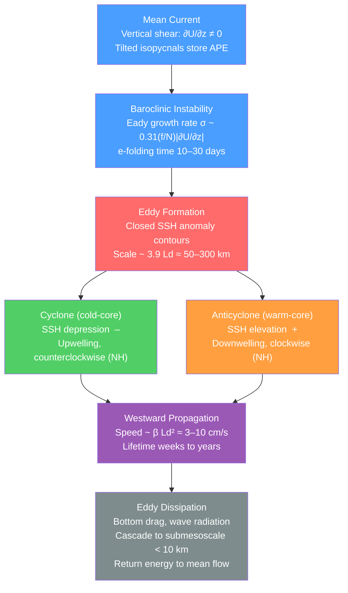

# Mesoscale Eddies and Ocean Variability

> [!abstract] TL;DR
> Mesoscale eddies are roughly circular ocean vortices 50–300 km in diameter that carry roughly ten times more kinetic energy than the time-mean circulation they swirl inside. They arise from baroclinic and barotropic instability of boundary currents and density fronts — converting available potential energy stored in tilted isopycnals into eddy kinetic energy — and propagate slowly westward at Rossby-wave speeds determined by the planetary vorticity gradient. Satellite altimeters detect approximately 300,000 eddies globally at any instant, each living weeks to years. Their stirring, trapping, and transport of heat, salt, carbon, and nutrients means that no ocean model is complete without either resolving or carefully parameterising them.

---

## Intuition

**Analogy:** Imagine looking straight down at a pot of thick oatmeal on a hot stove. You do not see smooth, laminar streaming from heat source to surface — you see a boiling chaos of rotating blobs and swirls, each 5–10 cm across, spinning against one another as they drift sideways. The slow large-scale convection driven by the bottom heat (the "mean circulation") is almost invisible beneath the energy of those whirling patches.

The ocean is the same system, only about 100,000 times wider. The mean circulation — Gulf Stream, Kuroshio, Antarctic Circumpolar Current — is the oatmeal's slow bulk drift. The mesoscale eddies are the spinning blobs. They form where mean currents become baroclinically unstable, spinning off coherent vortices whose diameter is set by the **Rossby radius of deformation**: the natural length scale at which the restoring effect of Earth's rotation balances the tendency of stratification to release available potential energy.

---

## How It Works

### Core Mechanics

**1. Rossby Radius of Deformation**

The first baroclinic Rossby radius is:
$$L_d = \frac{NH}{f}$$
where $N$ is the Brunt–Väisälä (buoyancy) frequency, $H$ is the relevant vertical scale (thermocline depth, ~500–1000 m), and $f = 2\Omega\sin\phi$ is the Coriolis parameter. At mid-latitudes ($\phi \sim 45°$):
$$N \approx 2\times10^{-3}~\text{rad/s},\quad H \approx 800~\text{m},\quad f \approx 10^{-4}~\text{rad/s}$$
$$\Rightarrow\quad L_d \approx \frac{2\times10^{-3} \times 800}{10^{-4}} = 16{,}000~\text{m}~\text{(single layer)}$$
Depth-averaging gives $L_d \sim 50$–$100$ km. Near the equator $f \to 0$ so $L_d \to \infty$; near the poles $L_d \sim 10$–$20$ km. Eddies with scales near $L_d$ are energetically preferred by baroclinic instability.

**2. Baroclinic Instability (Eady Model)**

A vertically sheared mean current ($\partial U/\partial z \neq 0$) is unstable to small perturbations. The Eady (1949) maximum growth rate:
$$\sigma_{\text{Eady}} \approx 0.31\,\frac{f}{N}\left|\frac{\partial U}{\partial z}\right|$$
gives $e$-folding times of 10–30 days in the western boundary current systems. The fastest-growing wavelength is $\approx 3.9\,L_d$, consistent with observed eddy scales. Baroclinic instability converts **available potential energy** (APE, stored in tilted isopycnals maintained by the mean circulation) into **eddy kinetic energy** (EKE).

**3. Quasi-Geostrophic (QG) Turbulence**

Once eddies form, they interact through geostrophic turbulence (Charney 1971). Unlike 3D Kolmogorov turbulence — where energy cascades to smaller scales — quasi-2D rotating stratified flows exhibit an **inverse energy cascade**: eddy energy flows to *larger* scales. The cascade is arrested at the **Rhines scale**:
$$L_\beta = \sqrt{\frac{U_{\text{rms}}}{\beta}}$$
where $\beta = \partial f / \partial y \approx 2\times10^{-11}$ m$^{-1}$s$^{-1}$ is the planetary vorticity gradient. At $L_\beta$, Rossby wave propagation becomes as fast as eddy advection, the turbulent cascade stalls, and coherent zonal jets emerge (Rhines 1975).

**4. SSH Eddy Detection from Altimetry**

Satellites (TOPEX/Poseidon, Jason-1/2/3, Sentinel-6) measure sea-surface height (SSH) to ~2 cm precision. Eddies appear as closed SSH anomaly contours:
- **Positive SSH anomaly** → anticyclone (high pressure, warm core, downwelling, clockwise in NH)
- **Negative SSH anomaly** → cyclone (low pressure, cold core, upwelling, counterclockwise in NH)

Automated detection algorithms (Chelton et al. 2011) identify eddies as closed SSH contours enclosing a local extremum, yielding a global census of ~300,000 eddies with median amplitude ~4 cm and median lifetime ~30 days.

**5. Eddy Diffusivity and Transport**

The flux of tracers by eddies is parameterised as:
$$F \approx -K_{\text{eddy}}\,\frac{\partial\bar{C}}{\partial x}, \qquad K_{\text{eddy}} \approx 500\text{–}2000~\text{m}^2/\text{s}$$
This is vastly larger than molecular ($\sim 10^{-7}$ m$^2$/s) or diapycnal ($\sim 10^{-4}$ m$^2$/s) diffusivities. The Gent–McWilliams (GM90) parameterisation represents baroclinic eddies not as simple diffusion but as an eddy-induced advection velocity that flattens isopycnals, releasing APE without spurious diapycnal mixing.

### Eddy Lifecycle



---

## Key Concepts / Details

### Secondary Level

Ocean eddies are the ocean's weather systems. Just as a mid-latitude atmospheric cyclone is a rotating low-pressure system hundreds of kilometres wide, a cyclonic ocean eddy is a swirling cold-water vortex tens to hundreds of kilometres wide — the same basic physics (geostrophic balance between pressure gradient and Coriolis force), just 1000 times narrower because the ocean's Rossby radius is 50–100 km vs. ~1000 km for the atmosphere.

**Cyclone (cold-core):** Rotates counterclockwise in the Northern Hemisphere. Water domes upward at the centre, dragging cold, nutrient-rich deep water toward the surface. Fishing fleets target these: the upwelling fuels phytoplankton blooms that support dense fish populations.

**Anticyclone (warm-core):** Rotates clockwise in the Northern Hemisphere. Water at the centre sinks (downwelling), suppressing biological productivity. The lens of warm water traps whatever organisms live inside it as the eddy drifts.

**Gulf Stream rings:** When the Gulf Stream meanders far enough, it pinches off. Warm-core rings trap Sargasso Sea water north of the Stream; cold-core rings trap Slope Water south of it. Each ring persists for weeks to months, carrying its trapped water slowly westward.

**Visible scale:** A single mesoscale eddy is 100–300 km across — the footprint of a small country. They are invisible to the naked eye from a ship's deck but strikingly clear in satellite imagery of SSH, sea-surface temperature, and ocean colour.

### Undergraduate Level

**Rossby Radius Calculation**

The baroclinic Rossby radius $L_d = NH/f$ varies dramatically with latitude:

| Latitude | $f$ (rad/s) | $L_d$ (approx.) |
|----------|-------------|------------------|
| 60°N/S   | $1.26\times10^{-4}$ | ~25 km |
| 45°N/S   | $1.03\times10^{-4}$ | ~50–80 km |
| 20°N/S   | $5.0\times10^{-5}$  | ~150 km |
| 5°N/S    | $1.3\times10^{-5}$  | ~500 km |

The poleward shrinkage of $L_d$ means that high-latitude eddies are much smaller and harder for satellites to detect. Resolving them requires ocean models with horizontal resolution $\lesssim L_d/4 \sim 5$–$10$ km poleward of 50°.

**Eady Instability**

The Eady (1949) model considers a uniform vertical shear $\Lambda = \partial U/\partial z$ between two rigid horizontal boundaries in a uniformly stratified fluid ($N$ = const). All wavenumbers $k < k_c = 2.4/H$ are unstable, with peak growth:
$$\sigma_{\max} = 0.31\,\frac{f\Lambda}{N}$$

For the Gulf Stream: $\Lambda \sim 5\times10^{-3}$ m/s/m, $f = 10^{-4}$ rad/s, $N = 5\times10^{-3}$ rad/s:
$$\sigma \approx 0.31 \times \frac{10^{-4} \times 5\times10^{-3}}{5\times10^{-3}} = 3.1\times10^{-6}~\text{s}^{-1} \quad\Rightarrow\quad \tau_{e} \approx 3.7~\text{days}$$

Strong currents are highly unstable; mesoscale eddies spin up rapidly downstream of separation points.

**Westward Propagation**

Eddies propagate westward at approximately the long baroclinic Rossby wave phase speed:
$$c \approx -\beta L_d^2 = -(2\times10^{-11})(5\times10^4)^2 \approx -0.05~\text{m/s}$$
about 5 cm/s westward — consistent with satellite tracking of individual eddies (Chelton et al. 2011). This is far slower than internal velocities (~0.5–1 m/s inside the eddy). The propagation is a property of the wave dynamics of the ambient stratified rotating ocean, not of the fluid being advected.

**Global Eddy Census**

Chelton et al. (2011) analysed 16 years of merged satellite altimetry:
- ~300,000 eddies exist at any instant
- Median radius ~90 km; median amplitude ~4 cm SSH
- Median lifetime ~30 days; ~10% of eddies survive > 6 months
- Western boundary current extension regions and the Southern Ocean are the most energetic
- Long-lived eddies (> 12 weeks) carry coherent water-mass anomalies across entire ocean basins

### Graduate Level

**Charney (1971) Geostrophic Turbulence**

Charney (1971) showed that quasi-geostrophic turbulence in a continuously stratified ocean is statistically equivalent to 2D barotropic turbulence in a 3D wavenumber space $(k, l, m)$ where $m$ is the vertical wavenumber scaled by $f/N$. Conservation of both total energy $E = \int \frac{1}{2}|\nabla\psi|^2\,dV$ and potential enstrophy $Z = \int \frac{1}{2}q^2\,dV$ (where $q$ is QGPV) produces:
- **Inverse energy cascade:** $E(k) \propto k^{-5/3}$ for $k < k_{\text{forcing}}$ (energy flows to larger scales)
- **Forward enstrophy cascade:** $E(k) \propto k^{-3}$ for $k > k_{\text{forcing}}$ (enstrophy to smaller scales)

In practice, observed SSH spectral slopes lie between $k^{-4}$ and $k^{-5}$, steeper than theory, partly because SSH projects out only the barotropic and first baroclinic modes.

**Rhines Scale and Zonal Jet Formation**

The inverse energy cascade is arrested when the eddy turnover frequency $U_{\text{rms}}/L$ matches the Rossby wave frequency $\beta L$, i.e., at the **Rhines scale** $L_\beta = \sqrt{U_{\text{rms}}/\beta}$. Energy that reaches $L_\beta$ feeds into propagating Rossby waves and ultimately into alternating zonal jets. In the ocean, weak striations with velocities ~1 cm/s are visible in long-term SSH climatologies (Maximenko et al. 2005), likely the imprint of Rhines-scale jet formation.

**Gent–McWilliams (GM90) Parameterisation**

Coarse ocean models ($\Delta x \sim 100$ km) cannot resolve $L_d \sim 50$ km. Gent & McWilliams (1990) parameterised the effect of baroclinic eddies via an **eddy-induced advection velocity**:
$$\mathbf{u}^* = \frac{\partial}{\partial z}\!\left(\kappa\,\frac{\nabla_h\rho}{\partial\rho/\partial z}\right)$$
This term flattens isopycnals (removes APE) without diapycnal mixing, correctly capturing the main thermodynamic effect of eddies. The GM90 scheme is now standard in all major ocean models (MOM6, NEMO, POP). Typical values $\kappa \sim 500$–$1000$ m²/s are derived from microstructure and float dispersion observations.

**Eddy Saturation of the ACC**

In the Antarctic Circumpolar Current (ACC), the absence of meridional boundaries means no geostrophic mean flow can balance additional wind stress through form drag in the simplest sense. Yet increased Southern Ocean westerlies (from climate change) barely accelerate the ACC transport. This **eddy saturation** occurs because extra wind energy is absorbed by baroclinic instability — more eddies, not a faster mean flow. Munday et al. (2013) confirmed this in eddy-resolving models: ACC transport is nearly insensitive to a 2× change in wind forcing.

**Eddy-Induced Poleward Heat Flux**

Eddies carry warm-water anomalies poleward and cold-water anomalies equatorward (stirring down the mean temperature gradient), contributing a meridional heat flux:
$$F_{\text{eddy}} = \rho c_p \overline{v'T'} \approx -\rho c_p K_{\text{eddy}}\,\frac{\partial\bar{T}}{\partial y}$$
In the Southern Ocean — where there is no continental barrier to support a large mean cross-ACC temperature transport — eddy heat flux is the *dominant* mechanism for poleward heat transport across the fronts of the ACC.

---

## Python Demo

```python
import numpy as np
import matplotlib.pyplot as plt
from numpy.fft import fft2, ifft2, fftfreq

# 2D QG Barotropic Vorticity Equation — Pseudospectral Method
# Equation:  dω/dt + J(ψ, ω) = -ν₆ ∇⁶ω
# Inversion: ω = ∇²ψ  →  ψ̂ = -ω̂ / k²
#
# Demonstrates mesoscale eddy formation from a barotropically-unstable zonal jet.
# All variables are non-dimensional (length ~ Ld, velocity ~ U0, time ~ Ld/U0).

N = 128                        # grid resolution
L = 2.0 * np.pi               # domain size (non-dimensional, periodic)
dt = 0.02                      # time step
nu6 = 2e-14                    # hyperviscosity (∇⁶): damps only small scales
n_steps = 300                  # total integration steps  (t_final = 6.0)
snap_steps = [0, 60, 150, 300] # steps at which to save snapshots

# --- Spectral setup ---
kx_1d = fftfreq(N, d=1.0 / N)     # integer wavenumbers for L = 2π domain
ky_1d = fftfreq(N, d=1.0 / N)
KX, KY = np.meshgrid(kx_1d, ky_1d)
K2 = KX**2 + KY**2
K2_inv = np.where(K2 == 0, 0.0, 1.0 / K2)  # ψ̂ = -ω̂ / k²; zero mode → 0
K6 = K2**3

# 2/3-rule dealiasing mask to suppress aliasing errors in nonlinear term
Kmax = N // 3
dealias = ((np.abs(KX) < Kmax) & (np.abs(KY) < Kmax)).astype(float)

# --- Physical grid ---
x = np.linspace(0, L, N, endpoint=False)
y = np.linspace(0, L, N, endpoint=False)
X, Y = np.meshgrid(x, y)

# --- Initial condition: sinusoidal zonal jet + small random perturbation ---
# Jet:  U(y) = sin(y)  =>  ω₀ = -∂U/∂y = -cos(y)
# This jet satisfies the Rayleigh–Fjørtoft instability criterion (∂²U/∂y² changes sign).
omega = -np.cos(Y)
np.random.seed(42)
omega += 0.008 * np.random.randn(N, N)    # small seed for barotopic instability
omega_hat = fft2(omega) * dealias


def psi_from_omega_hat(w_hat):
    """ψ̂ = -ω̂ / k²  (Poisson inversion in Fourier space)"""
    return -w_hat * K2_inv


def rhs(w_hat):
    """
    RHS of dω̂/dt = -Ĵ(ψ,ω) - ν₆ k⁶ ω̂
    Jacobian computed pseudospectrally to avoid aliasing.
    """
    psi_hat = psi_from_omega_hat(w_hat)

    dpsi_dx = np.real(ifft2(1j * KX * psi_hat))
    dpsi_dy = np.real(ifft2(1j * KY * psi_hat))
    domega_dx = np.real(ifft2(1j * KX * w_hat))
    domega_dy = np.real(ifft2(1j * KY * w_hat))

    # J(ψ,ω) = ψ_x ω_y − ψ_y ω_x
    J_phys = dpsi_dx * domega_dy - dpsi_dy * domega_dx
    J_hat = fft2(J_phys) * dealias

    return -J_hat - nu6 * K6 * w_hat


# --- 4th-order Runge–Kutta time integration ---
snapshots = {}

for step in range(n_steps + 1):
    if step in snap_steps:
        psi_hat = psi_from_omega_hat(omega_hat)
        snapshots[step] = (
            np.real(ifft2(omega_hat)).copy(),
            np.real(ifft2(psi_hat)).copy(),
        )

    if step < n_steps:
        k1 = rhs(omega_hat)
        k2 = rhs(omega_hat + 0.5 * dt * k1)
        k3 = rhs(omega_hat + 0.5 * dt * k2)
        k4 = rhs(omega_hat + dt * k3)
        omega_hat += (dt / 6.0) * (k1 + 2 * k2 + 2 * k3 + k4)

# --- Visualise vorticity and streamfunction (SSH proxy) at four times ---
fig, axes = plt.subplots(2, 4, figsize=(16, 7))

for col, step in enumerate(snap_steps):
    t_val = step * dt
    omega_s, psi_s = snapshots[step]

    vw = max(float(np.percentile(np.abs(omega_s), 98)), 0.01)
    vp = max(float(np.percentile(np.abs(psi_s), 98)), 0.01)

    axes[0, col].contourf(X, Y, omega_s, levels=20,
                          cmap='RdBu_r', vmin=-vw, vmax=vw)
    axes[0, col].contour(X, Y, omega_s, levels=10,
                         colors='k', linewidths=0.3, alpha=0.5)
    axes[0, col].set_title(f'Vorticity  t = {t_val:.1f}', fontsize=9)
    axes[0, col].set_aspect('equal')
    axes[0, col].axis('off')

    axes[1, col].contourf(X, Y, psi_s, levels=20,
                          cmap='RdYlBu_r', vmin=-vp, vmax=vp)
    axes[1, col].contour(X, Y, psi_s, levels=14,
                         colors='k', linewidths=0.4)
    axes[1, col].set_title(f'SSH proxy (ψ)  t = {t_val:.1f}', fontsize=9)
    axes[1, col].set_aspect('equal')
    axes[1, col].axis('off')

axes[0, 0].set_ylabel('Vorticity ω', fontsize=10)
axes[1, 0].set_ylabel('Streamfunction ψ', fontsize=10)
fig.suptitle(
    'QG Barotropic Turbulence: Mesoscale Eddy Formation from Unstable Zonal Jet\n'
    '(Sinusoidal jet → closed vortices via barotropic instability; '
    'inverse energy cascade visible at later times)',
    fontsize=10
)
plt.tight_layout()
plt.savefig('mesoscale_eddies_qg.png', dpi=120, bbox_inches='tight')
plt.show()

# Diagnostics
omega_final = np.real(ifft2(omega_hat))
eke = 0.5 * float(np.mean(omega_final**2))
print(f"Final enstrophy proxy (mean ω²/2) = {eke:.4f}")
print("Closed vorticity and SSH contours visible from t ~ 1.5 onward.")
```

---

## Real-World Notes

> **TOPEX/Poseidon and the Jason series** (1992–present) provide the definitive global eddy census. With a 10-day repeat cycle and ~3 cm SSH precision, the merged multi-satellite dataset (AVISO/CMEMS) resolves eddies down to ~50–70 km radius. Without altimetry, mesoscale eddies would be nearly invisible to the sparse in-situ observing network.

> **Agulhas rings** are shed ~6 times per year when the Agulhas Current retroflects off the southern tip of Africa. Each ring is ~200 km across, carries warm salty Indian Ocean water, and takes 2–3 years to cross the South Atlantic. They constitute a major pathway for inter-basin water-mass exchange (Indian → Atlantic), influencing the global thermohaline circulation.

> **Mediterranean Outflow Eddies (Meddies)** form when the salty, warm Mediterranean Outflow Water exits the Strait of Gibraltar and separates from the seafloor at ~1000 m depth, rolling up into subsurface lenses ~100–150 km across. Meddies can persist for 2+ years and travel thousands of kilometres into the Atlantic, carrying anomalously salty water and eroding the ambient salinity minimum.

> **Biological pump and eddy upwelling:** Cyclonic eddies dome the nutricline upward by 20–50 m, injecting nitrate and phosphate into the euphotic zone and triggering phytoplankton blooms visible in satellite ocean-colour imagery (chlorophyll-a). Some estimates attribute 20–30% of new primary production in oligotrophic gyres to eddy-driven upwelling events.

> **Argo float trajectories:** The global array of ~4000 Argo profiling floats drifts at ~1000 m parking depth. Float displacements over 10-day cycles are strongly influenced by eddy currents; statistical analysis of float trajectories provides independent estimates of $K_{\text{eddy}} \sim 500$–$2000$ m²/s, consistent with altimetric eddy census results.

---

## Common Pitfalls

- **Assuming eddies are a minor perturbation on the mean flow** — Eddy kinetic energy globally exceeds mean kinetic energy by a factor of ~10. In the western boundary current extension regions and the Southern Ocean, this ratio can reach 100:1. The eddy field *is* the ocean's dominant kinetic energy reservoir, not a small correction to it.

- **Conflating mesoscale with submesoscale** — Mesoscale eddies are 50–300 km, governed by geostrophic balance (Ro $\ll$ 1) and quasi-geostrophic theory. Submesoscale features are 0.1–10 km, have Ro ~ O(1), are highly ageostrophic, are associated with frontal dynamics and mixed-layer instabilities, and require different theory and different model resolution. The two regimes have distinct energy sources, spectra, and biogeochemical roles.

- **Thinking ocean eddies are tiny because the ocean is vast** — A mesoscale eddy 150 km across covers the same area as the country of Switzerland. It is invisible from a ship deck (the SSH anomaly is only ~10–20 cm spread over 150 km), which led oceanographers before the satellite era to drastically underestimate eddy energy. The first direct evidence came from neutrally buoyant floats in the MODE experiment (1973).

- **Treating GM90 eddy diffusivity $\kappa$ as a universal constant** — $\kappa$ varies by 2–3 orders of magnitude across the ocean: ~50 m²/s in the tropical thermocline to >3000 m²/s in the Southern Ocean and Gulf Stream extension. Using a single value introduces systematic biases in heat and carbon transport.

- **Ignoring eddy–mean flow interaction** — Eddies do not just diffuse tracers; they drive mean flows through the eddy momentum flux convergence (Reynolds stresses) and eddy-induced overturning (eddy-induced velocity $\mathbf{u}^*$). In the ACC, eddy form stress — pressure differences across submarine ridges generated by eddy activity — is the primary mechanism by which wind stress is communicated to the seafloor.

---

## Related Concepts

**Same vault (02_Ocean_Circulation):**
- [[Wind_Driven_Circulation_and_Sverdrup_Balance]] — Sverdrup balance describes the mean gyre; baroclinic instability of the gyre's western boundary current generates the eddy field
- [[Western_Boundary_Currents_and_Gulf_Stream]] — Gulf Stream rings are the most energetic class of mesoscale eddies; their ring-shedding rate depends on meander amplitude
- [[Deep_Ocean_Circulation_and_Abyssal_Flow]] — Bottom pressure torque and eddy form stress link the mesoscale eddy field to the abyssal MOC
- [[Marine_Primary_Production_and_Phytoplankton]] — Cyclonic eddy upwelling fertilises the photic zone; eddy-trapping can also suppress bloom development inside anticyclones
- [[Ocean_Observing_Systems_and_Remote_Sensing]] — Satellite altimetry is the primary tool for global eddy detection; Argo floats provide in-situ eddy diffusivity estimates
- [[_MOC_Ocean_Circulation]] — Section map of contents

**Cross-vault (Physics / Signals & Systems):**
- [[Fluid_Statics_and_Properties]] — Buoyancy frequency $N$, the key stratification parameter in $L_d = NH/f$, arises from density stratification treated in fluid statics
- [[Rotational_Dynamics]] — Coriolis force, angular momentum conservation, and geostrophic balance are the rotating-frame dynamics that govern eddy spin-up and propagation
- [[Fourier_Transform]] — Pseudospectral QG models and altimetric spectral analysis both rely on FFT; SSH wavenumber spectra diagnose the inverse cascade slope
- [[_MOC_Physics_Master]] — Parent map for fluid mechanics and geophysical fluid dynamics
- [[_MOC_SS_Master]] — Spectral methods in signals and systems underlie the pseudospectral numerical schemes used in QG turbulence models

---

## Review Questions

### Secondary
1. Why does a cyclonic ocean eddy produce upwelling at its centre, while an anticyclone produces downwelling? What effect does this have on biology, and why might a fishing vessel track a cold-core ring?
2. Describe in your own words how a Gulf Stream ring forms and why it drifts westward rather than following the Gulf Stream east.

### Undergraduate
1. The Rossby radius $L_d = NH/f$ is ~80 km at 45°N but ~500 km at 10°N. Explain physically why eddies are larger in the tropics, and discuss the implications for eddy-resolving ocean model resolution.
2. Use the Eady growth rate formula to estimate the e-folding time for mesoscale eddies in the Kuroshio Extension ($\Lambda \sim 3\times10^{-3}$ m/s/m, $N = 4\times10^{-3}$ rad/s, $f = 8\times10^{-5}$ rad/s). Compare with the Southern Ocean ACC ($\Lambda \sim 1\times10^{-3}$ m/s/m, $N = 2\times10^{-3}$ rad/s, $f = 1.2\times10^{-4}$ rad/s).
3. An eddy has SSH amplitude 8 cm and radius 90 km. Estimate its surface geostrophic azimuthal velocity using the gradient wind approximation $v_g = (g/f)(\partial\eta/\partial r)$, and compare it with the eddy's westward propagation speed at 30°N.

### Graduate
1. Charney (1971) argued that QG turbulence produces an inverse energy cascade, in contrast to 3D Kolmogorov turbulence. What symmetry — or conservation law — is responsible for the different direction of the cascade in 2D/QG flows? What does the Rhines scale represent physically, and why does the cascade stall there?
2. Explain the "eddy saturation" hypothesis for the ACC. What observational and modelling evidence supports it, and what does it imply for projecting future ACC transport under enhanced Southern Ocean westerlies?
3. Critically assess the GM90 parameterisation. What physical process does the eddy-induced velocity $\mathbf{u}^*$ represent? Under what ocean conditions does GM90 break down (e.g., the equatorial ocean, the mixed layer), and what parameterisations have been proposed to address these failures?

---

## Sources

- [Chelton, D. B., Schlax, M. G., & Samelson, R. M. (2011). Global observations of nonlinear mesoscale eddies. *Progress in Oceanography*, 91(2), 167–216.](https://doi.org/10.1016/j.pocean.2011.01.002)
- [Gent, P. R., & McWilliams, J. C. (1990). Isopycnal mixing in ocean circulation models. *Journal of Physical Oceanography*, 20(1), 150–155.](https://doi.org/10.1175/1520-0485(1990)020<0150:IMIOCM>2.0.CO;2)
- [Charney, J. G. (1971). Geostrophic turbulence. *Journal of the Atmospheric Sciences*, 28(6), 1087–1095.](https://doi.org/10.1175/1520-0469(1971)028<1087:GT>2.0.CO;2)
- Pedlosky, J. (1987). *Geophysical Fluid Dynamics* (2nd ed.). Springer. — Chapters 7–8 (baroclinic instability, QG turbulence)
- Vallis, G. K. (2006). *Atmospheric and Oceanic Fluid Dynamics*. Cambridge University Press. — Chapters 9–10 (geostrophic turbulence, eddies and the mean flow)

---

#Oceanography #OceanCirculation #MesoscaleEddies #GeostrophicTurbulence
