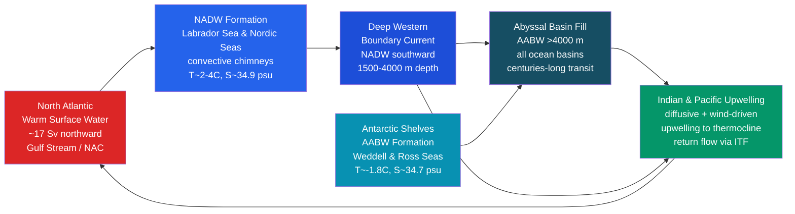

# Thermohaline Circulation and AMOC

> [!abstract] TL;DR
> The **thermohaline circulation (THC)** is a planet-spanning, density-driven overturning of the ocean driven by differences in **temperature** and **salinity** — "thermohaline" literally means "heat and salt." Dense, cold, salty water sinks in the North Atlantic and around Antarctica, flows slowly along the ocean floor for centuries, and eventually upwells back to the surface to complete a circuit that takes roughly **1,000 years**. The **Atlantic Meridional Overturning Circulation (AMOC)** is the Atlantic branch of this system, transporting approximately **17 Sv** of warm water northward and cold deep water southward, measured continuously since 2004 by the RAPID array at 26.5°N. AMOC is not a simple on/off switch but a **bistable system** — Stommel (1961) showed it can exist in two stable states separated by a freshwater-forcing threshold — and CMIP6 models project a **~25% weakening by 2100** under high-emission scenarios, with Ditlevsen & Ditlevsen (2023) reporting early-warning signals of a possible tipping point this century.

---

## Intuition

**Analogy:** The thermohaline circulation is like a slow-motion conveyor belt in a global factory floor. Imagine the surface ocean is a warm-water river flowing toward the poles — like packages on the belt moving from a warm dispatch centre to a cold warehouse. As the packages arrive at the warehouse (the polar ocean), they are chilled, become heavy and dense, and sink to the basement floor (the deep ocean). There, they slowly slide along the floor back through a network of subterranean corridors (abyssal passages) for hundreds of years before a slow elevator (upwelling) brings them back to the surface to begin the journey again. The entire loop takes roughly 1,000 years per lap.

Technically: this is **buoyancy-driven flow**. Ocean water density depends on both temperature (cold water is denser) and salinity (saltier water is denser). At polar latitudes, surface cooling and sea-ice formation (which expels salt) simultaneously increase density, driving water below the pycnocline into the deep ocean. This negative buoyancy flux is the engine that pulls warm surface water poleward behind it, setting up a global overturning cell.

---

## How It Works

### Core Mechanics

**1. Buoyancy flux at the ocean surface.**
The surface buoyancy flux $B$ (m² s⁻³) combines thermal and haline components:

$$B = \frac{\alpha\, Q}{\rho\, c_p} - \beta\, S\,(E - P)$$

where $\alpha$ is the thermal expansion coefficient, $Q$ is the surface heat flux (W m⁻²), $\rho$ the reference density, $c_p$ the specific heat capacity, $\beta$ the haline contraction coefficient, $S$ salinity, and $(E-P)$ the net evaporation minus precipitation. Negative $B$ (heat loss and/or evaporative concentration of salt) drives convective sinking; positive $B$ (freshwater input) suppresses it.

**2. North Atlantic Deep Water (NADW) formation.**
NADW forms in two main regions:
- **Labrador Sea:** Intense winter cooling drives open-ocean deep convection through "convective chimneys" — small (10–50 km) vertically coherent mixed-layer patches reaching depths of 1,000–2,000 m. Interannual variability in Labrador Sea convection is a primary driver of AMOC variability on decadal timescales.
- **Nordic Seas (Greenland, Iceland, Norwegian Seas):** Dense water forms on the shelf and overflows the Greenland–Scotland Ridge (the Denmark Strait overflow and Faroe Bank Channel overflow) as gravity currents that entrain ambient water and eventually settle as Labrador Sea Water and Northeast Atlantic Deep Water — the main constituents of NADW.

NADW occupies roughly 1,500–4,000 m depth, is characterised by T ~ 2–4 °C and S ~ 34.9–35.0 psu, and flows southward along the Deep Western Boundary Current.

**3. Antarctic Bottom Water (AABW) formation.**
The densest water in the ocean forms on **Antarctic continental shelves** — the Weddell and Ross Seas in particular. Sea-ice formation expels brine into very cold shelf water (~−1.8 °C), producing extremely dense (~1,028 kg m⁻³) **High Salinity Shelf Water**. This cascades down the continental slope, mixes with Circumpolar Deep Water, and fills the abyssal basins as AABW below ~4,000 m. AABW is colder and denser than NADW and underlies it globally.

**4. Broecker's conveyor belt (1987).**
Wallace Broecker popularised the global view in a landmark 1987 *Natural History* article: a single conveyor belt looping through the Atlantic, Indian, and Pacific, connecting deep-water formation sites to upwelling zones via abyssal pathways. Warm surface water flows northward in the Atlantic, loses heat to the atmosphere (warming Western Europe by ~5–8 °C relative to same-latitude locations), sinks in the North Atlantic, travels south, rounds the tip of Africa, and eventually upwells in the Indian and Pacific Oceans before returning as a surface and thermocline flow. While a useful conceptual picture, it over-simplifies multiple overlapping cells and poorly constrained return paths.

**5. AMOC transport and the RAPID array.**
The **RAPID/MOCHA array** at 26.5°N has measured AMOC continuously since April 2004. It resolves the overturning into three components: Florida Current transport (~32 Sv northward), Ekman transport (~3 Sv), and upper mid-ocean return flow (~−18 Sv). Time-mean AMOC strength is **~17 Sv** with substantial variability on timescales of days to decades, peaking in late winter and at a multi-year minimum around 2009–2010.

**6. Stommel (1961) two-box model and bistability.**
Henry Stommel's 1961 paper is the foundational demonstration that the thermohaline circulation can exist in **two distinct stable equilibria**. In the model, two well-mixed boxes (tropical and polar) exchange heat with the atmosphere rapidly and salt through advective flow:

$$\psi = k\,(\rho_2 - \rho_1) = k\,(\alpha\,\Delta T - \beta\,\Delta S)$$

where $\psi$ is overturning streamfunction, $k$ a hydraulic constant, $\alpha$ the thermal expansion, $\beta$ the haline contraction, and $\Delta T$, $\Delta S$ the inter-box temperature and salinity differences.

The **salt-advection (Stommel) feedback** creates bistability: in the "on" state, northward flow advects salty subtropical water poleward, maintaining the salinity gradient that supports overturning. If freshwater is added to the polar box (reducing $\Delta S$ below a critical threshold), the density contrast flips sign — salinity now drives equatorward flow — and the system can tip irreversibly to the "off" state (reversed or collapsed AMOC). The two stable branches are separated by an unstable saddle, producing a **hysteresis loop** in bifurcation space: the freshwater forcing needed to collapse AMOC is greater than that needed to restart it once collapsed.

### Flow / Architecture



---

## Key Concepts / Details

### Secondary Level

- **Thermohaline** is derived from Greek: *thermos* (heat) + *halos* (salt). The circulation is driven by density differences created by both temperature and salinity, not by temperature alone.
- **The deep ocean is cold and salty.** Below ~1,000 m, essentially all ocean water is near-freezing (0–4 °C) regardless of latitude — a direct consequence of where deep water forms.
- **The conveyor takes ~1,000 years per loop.** This is why radiocarbon dating of deep Pacific water shows ages of 700–1,000 years relative to the surface: it has been isolated from the atmosphere since it sank in the Atlantic.
- **AMOC keeps Western Europe warm.** The northward heat transport of the AMOC (~1.25 PW at 26.5°N) is equivalent to roughly one million power plants. Without it, winters in the UK and Scandinavia would be ~5–8 °C colder — comparable to present-day Labrador at the same latitude.
- **Sea ice and freshwater are the "off switch."** When Arctic glaciers melt or precipitation increases, freshwater dilutes polar salinity, reduces density, and weakens or stops convection.

### Undergraduate Level

- **Buoyancy flux formulation.** The surface buoyancy flux $B = \frac{\alpha Q}{\rho c_p} - \beta S(E-P)$ has units of m² s⁻³. In the Labrador Sea in winter, $B \sim -5 \times 10^{-8}$ m² s⁻³, sustaining convection to ~2,000 m. In contrast, the tropical Atlantic receives positive buoyancy from freshwater input (precipitation exceeds evaporation), stratifying the surface layer.
- **Stommel box model.** The dimensionless form of the Stommel (1961) model has two differential equations for temperature and salinity anomalies between polar and tropical boxes. The steady-state overturning $\psi$ satisfies a cubic equation with either one or three real roots; three roots correspond to the bistable regime with two stable equilibria (T-driven "on" and S-driven "off") and one unstable saddle.
- **Multiple equilibria and hysteresis.** The key insight is that the system's response to freshwater forcing depends on its history: an AMOC that has been strong can resist a freshwater input that would prevent the AMOC from restarting once it has collapsed. This hysteresis is why "how close are we to a tipping point" and "can we recover from a tipped state" are two different questions.
- **RAPID/MOCHA array at 26.5°N.** The array deploys moored instruments across the Atlantic basin: cable-based Florida Current monitors, a mid-ocean mooring array measuring geostrophic shear, and wind-stress estimates for Ekman transport. Continuous records since 2004 reveal a mean AMOC of ~17 Sv, a strong seasonal cycle (~6 Sv peak-to-peak), and a notable minimum in 2009–2010 associated with anomalous buoyancy forcing.
- **Abyssal upwelling and return flow.** Deep water does not simply pile up in the abyssal basins. Tidal mixing and turbulence near rough topography drives slow (~10⁻⁴ m s⁻¹) diapycnal upwelling. The abyssal return flow is "pushed" upward and returned to the surface or thermocline ocean via diffusive and wind-forced upwelling in the Southern Ocean — the **Southern Ocean upwelling branch** is now considered the dominant return path for NADW, not diffuse upwelling in the Pacific.

### Graduate Level

- **AMOC slowdown under global warming (CMIP6).** Under SSP5-8.5 (high-emission scenario), CMIP6 models project a mean AMOC weakening of approximately 25–30% by 2100 relative to the 1995–2014 baseline, with no model showing a complete collapse within the 21st century. The weakening is driven by reduced surface buoyancy flux from Arctic freshwater forcing and surface warming stabilising the upper water column. However, CMIP6 models may underestimate freshwater forcing from Greenland Ice Sheet melting.
- **Freshwater hosing experiments.** A standard diagnostic is to inject anomalous freshwater into the North Atlantic (typically 0.1–1 Sv) in model simulations and track AMOC response. These "hosing" experiments map out the hysteresis loop: at low forcing, AMOC weakens gradually; at a critical flux (~0.1–0.3 Sv in most models), AMOC collapses abruptly; after switching off the freshwater perturbation, the AMOC only recovers at much lower forcing levels, confirming the bistability predicted by Stommel.
- **Ditlevsen & Ditlevsen (2023) early-warning signal.** By applying statistical indicators of **critical slowing down** (rising variance and autocorrelation) to a 150-year (1870–2020) sea-surface temperature fingerprint of AMOC strength, Ditlevsen & Ditlevsen (2023) detected a statistically significant loss of resilience, extrapolating a median tipping year of **2057 (95% CI: 2025–2095)**. This finding is contested: a 2024 reanalysis (Boers et al.) argues the SST fingerprint conflates multiple signals, but the methodology has stimulated intense debate about tipping-point predictability.
- **Paleoclimate AMOC — the Younger Dryas.** The gold standard for AMOC abrupt changes is the **Younger Dryas** event (~12,900–11,700 years BP): meltwater from the retreating Laurentide Ice Sheet flooded the North Atlantic via the St. Lawrence or Hudson Bay, rapidly freshening the deep-water formation region and shutting down AMOC within decades (confirmed by sediment Pa/Th ratios and ice-core temperature records). Greenland temperatures dropped ~10–15 °C in decades. Recovery was equally abrupt, consistent with Stommel bistability. The Younger Dryas provides an existence proof that AMOC collapse can happen on human-relevant timescales.
- **AABW freshening.** Independent of NADW, AABW is freshening and warming under Antarctic Ice Sheet melt (Jacobs et al.; Purkey & Johnson). Fresher, lighter AABW reduces its rate of formation and may weaken the lower limb of the overturning, compressing the abyssal stratification and affecting carbon and nutrient cycling on centennial timescales.
- **Salt oscillator dynamics.** The Stommel feedback can be extended to oscillatory regimes when freshwater caps are included (Welander 1982; Cessi 1994). In such models, AMOC can exhibit self-sustained oscillations with periods of ~100–1,000 years — potential mechanisms for Dansgaard–Oeschger oscillations seen in Greenland ice cores.

---

## Python Demo

```python
"""
Stommel (1961) two-box thermohaline model:
  Box 1 = tropical ocean (warm, fresh)
  Box 2 = polar ocean   (cold, salty)

Governing equations (non-dimensional, following Rahmstorf 1996 notation):
  dT/dt = (T_atm - T) - |psi| * T
  dS/dt = (Fs)       - |psi| * S

  psi = k * (alpha*T - beta*S)   [overturning streamfunction]

Here T and S are temperature and salinity *differences* (tropical minus polar).
Steady-state: psi = R - |psi| * S  leads to a cubic in psi.

We sweep freshwater forcing F and find equilibria via numerical solution,
then plot the bifurcation (hysteresis) diagram.
"""

import numpy as np
import matplotlib.pyplot as plt
from scipy.optimize import fsolve

# --- Model parameters ---
alpha  = 1.5e-4   # thermal expansion coefficient (K^-1)
beta   = 8.0e-4   # haline contraction coefficient (psu^-1)
k      = 1.5e-6   # hydraulic constant (s^-1 / (kg m^-3))
c_T    = 1.0 / (3.0 * 365 * 86400)   # atmospheric thermal relaxation timescale ~3 yr
rho0   = 1025.0   # reference density (kg m^-3)

# Restoring temperature (tropical minus polar atmospheric T difference)
T_eq   = 20.0    # deg C  (tropical minus polar equilibrium temperature difference)

# --- Stommel steady-state equation ---
# At steady state: T = T_eq / (1 + |psi|/c_T)   (temperature adjusted by overturning)
# psi = k * rho0 * (alpha * T - beta * S)
# Freshwater forcing F drives S: S changes due to overturning advection + forcing
# 
# Simplified: find all roots of psi^3 - (k*rho0*alpha*T_eq - F_eff)*psi^2 - ... = 0
# We use the dimensionless Stommel (1961) form: q = 1 - |q| * s
# where q = psi/psi_scale, and F is the freshwater hosing amplitude.

def stommel_steady_state(psi, F, T0=T_eq):
    """
    Returns residual of the Stommel steady-state equation.
    psi [Sv], F = freshwater hosing [Sv], T0 = equilibrium temperature difference [C].
    This is the cubic equation for psi: psi(psi^2 + a*psi + b) = 0 form.
    """
    # Simplified form: thermal + haline forcing
    # R = k * rho0 * alpha * T0  (thermal forcing on psi)
    R = k * rho0 * alpha * T0
    # Steady-state psi satisfies: psi = R / (1 + |psi|/c_T) - k*rho0*beta * F / (|psi| + c_S)
    # Use a compact form: psi = R_eff - beta_eff * F_eff
    q = psi  # use psi directly in Sv-equivalent units
    c_S = c_T   # haline relaxation same order for simplicity
    T_ss = T0 / (1.0 + abs(q) / c_T) if abs(q) > 1e-10 else T0
    S_ss = F / (abs(q) + c_S) if abs(q) > 1e-10 else F / c_S
    return q - k * rho0 * (alpha * T_ss - beta * S_ss)

# --- Sweep freshwater forcing and find all equilibria ---
F_values  = np.linspace(0.0, 0.12, 600)   # freshwater hosing [Sv equivalent]
psi_on    = []   # "on" (thermally dominated) branch
psi_off   = []   # "off" (haline dominated) branch

for F in F_values:
    # Search for multiple roots by sampling initial guesses
    candidates = []
    for psi_guess in np.linspace(-0.5, 2.0, 50):
        try:
            sol = fsolve(stommel_steady_state, psi_guess, args=(F,), full_output=True)
            root = float(sol[0])
            residual = abs(stommel_steady_state(root, F))
            if residual < 1e-6:
                # Round to avoid duplicates
                candidates.append(round(root, 6))
        except Exception:
            pass
    candidates = list(set(candidates))
    positives = sorted([c for c in candidates if c > 0.01], reverse=True)
    negatives = sorted([c for c in candidates if c < -0.01])
    if positives:
        psi_on.append((F, positives[0]))
    if negatives:
        psi_off.append((F, negatives[0]))

# Separate into arrays
F_on,  q_on  = zip(*psi_on)  if psi_on  else ([], [])
F_off, q_off = zip(*psi_off) if psi_off else ([], [])

# --- Plot bifurcation diagram ---
fig, ax = plt.subplots(figsize=(9, 5))
ax.plot(F_on,  q_on,  color='#dc2626', lw=2.5, label='On state (T-driven, AMOC active)')
ax.plot(F_off, q_off, color='#2563eb', lw=2.5, label='Off state (S-driven, AMOC collapsed)')
ax.axhline(0, color='gray', ls='--', lw=1)

# Annotate saddle-node bifurcation region
ax.annotate('Saddle-node\nbifurcation\n(tipping point)',
            xy=(max(F_on)*0.92, 0.05), fontsize=9, color='#7c3aed',
            arrowprops=dict(arrowstyle='->', color='#7c3aed'),
            xytext=(max(F_on)*0.72, 0.25))

# Hysteresis arrows
ax.annotate('', xy=(0.10, 0.6), xytext=(0.04, 0.6),
            arrowprops=dict(arrowstyle='->', color='#dc2626', lw=1.5))
ax.text(0.06, 0.65, 'Increasing F\n(Greenland melt)', fontsize=8, color='#dc2626')

ax.set_xlabel('Freshwater forcing F (Sv equivalent)', fontsize=12)
ax.set_ylabel('Overturning streamfunction ψ (arb. units)', fontsize=12)
ax.set_title("Stommel (1961) Two-Box Thermohaline Model\nBifurcation Diagram — Freshwater Hysteresis", fontsize=13)
ax.legend(fontsize=10)
ax.grid(True, alpha=0.3)
plt.tight_layout()
plt.savefig('stommel_bifurcation.png', dpi=150)
plt.show()

print("Bifurcation diagram saved to stommel_bifurcation.png")
print(f"\nModel parameters:")
print(f"  Thermal forcing parameter R = k*rho0*alpha*T_eq = {k*rho0*alpha*T_eq:.2e} Sv-equiv")
print(f"  Bistable regime exists for intermediate freshwater forcing")
print(f"  On-state psi at F=0: {q_on[0]:.3f} (thermally dominated)")
```

---

## Real-World Notes

**RAPID array at 26.5°N** — The RAPID/MOCHA/WBTS observing system is the world's only continuous AMOC mooring array, deployed in April 2004 as a joint UK–US programme. It resolves Florida Current transport by electromagnetic cable (calibrated against dropsonde surveys), Ekman transport from reanalysis winds, and upper mid-ocean geostrophic flow from moored current meters at the eastern and western boundaries. The 2004–2018 mean is **17.2 Sv** with a standard deviation of ~4.6 Sv. A notable minimum of ~12 Sv in 2009–2010 was associated with anomalously weak buoyancy forcing and coincided with the coldest UK winter in decades.

**AMOC decline since the 1950s** — Caesar et al. (2018, *Nature*) used a sea-surface temperature fingerprint (the warming hole in the subpolar North Atlantic relative to global mean warming) to reconstruct AMOC variability back to 1870, finding AMOC weakening since at least the 1950s and unprecedented weakness in the late 20th–early 21st centuries relative to the past 1,000 years (from sediment Pa/Th proxies). This decline is broadly consistent with freshwater forcing from Greenland melt and Arctic sea-ice loss.

**Labrador Sea convection interannual variability** — Labrador Sea deep convection depth is strongly coupled to the **North Atlantic Oscillation (NAO)**. In positive NAO years, intensified westerly winds increase surface heat loss, deepen convection to ~2,000 m, and strengthen AMOC 2–4 years later. In negative NAO years (e.g., 2009–2010), shallow convection (<500 m) allows Labrador Sea Water production to decline sharply. This NAO-AMOC teleconnection gives roughly 2–5 years of predictability in AMOC state.

**AABW freshening** — Repeat hydrographic surveys since the 1990s (WOCE, GO-SHIP) document a robust freshening and warming of bottom waters in the South Atlantic, Indian, and Pacific Oceans, with AABW density decreasing ~0.01 kg m⁻³ per decade. This is attributed to accelerated basal melting of Antarctic ice shelves (Pine Island, Thwaites) adding freshwater to shelf seas where AABW forms. Fresher, lighter AABW reduces bottom-water formation rates and may decelerate the lower limb of the global overturning.

**Holocene AMOC from sediment records** — Sediment cores from the western Atlantic record AMOC strength via the **Pa/Th ratio** in carbonate sediments (lower Pa/Th = faster AMOC export). These records confirm a strong AMOC through most of the Holocene, rapid collapse events correlating with Heinrich Events (massive iceberg discharges) during the last glacial period, and the near-collapse during the Younger Dryas (~12,900–11,700 BP). The modern AMOC (Pa/Th-based) appears weaker than the late Holocene mean.

---

## Common Pitfalls

- **Conflating thermohaline circulation with AMOC** — The THC is a global concept covering all ocean basins; AMOC is specifically the Atlantic overturning and includes both **wind-driven** (Ekman) and **buoyancy-driven** components. AMOC cannot be reduced to thermohaline forcing alone; wind stress over the Southern Ocean drives a substantial fraction of AMOC by pulling deep water upward via Ekman pumping.
- **Taking the "conveyor belt" too literally** — Broecker's 1987 diagram was a didactic simplification. The actual circulation has **multiple overturning cells** (upper cell carrying NADW, lower cell carrying AABW), poorly defined return pathways, and significant cross-hemispheric complexity. In particular, the dominant return path for NADW is via **Southern Ocean upwelling** driven by wind stress and mesoscale eddies, not diffuse mid-ocean upwelling.
- **Treating density as purely temperature-driven** — In polar and subpolar regions, **salinity dominates the density structure** at temperatures near the freezing point (the thermal expansion coefficient $\alpha \to 0$ near 0 °C). Ignoring this leads to wrong intuitions: in the Arctic, a small salinity change matters far more than the same temperature change for stratification and convection.
- **Interpreting AMOC "collapse" as sudden** — In Stommel's model, the tipping is mathematically abrupt (discontinuous jump between branches), but real-ocean AMOC collapse under gradual forcing would unfold over decades, not years. The danger is not a sudden freezing of Europe but sustained multi-decadal weakening with cumulative consequences for European climate, rainfall patterns, and sea level along the US East Coast.
- **Assuming AMOC will recover after tipping** — The hysteresis in the Stommel model means that simply removing the freshwater forcing after AMOC has collapsed does **not** automatically restart it. Recovery requires reducing freshwater forcing substantially below the tipping threshold — a qualitatively different planetary state.

---

## Related Concepts

**Same vault:**
- [[Temperature_Salinity_Diagrams_and_Water_Masses]] — T-S diagrams are the primary tool for identifying NADW and AABW as distinct water masses with characteristic T, S signatures tracing their formation histories.
- [[Density_Stratification_and_Mixing]] — The pycnocline and halocline set the stratification that AMOC must overcome via buoyancy forcing; diapycnal mixing drives the abyssal upwelling branch.
- [[Deep_Ocean_Circulation_and_Abyssal_Flow]] — The abyssal branch of the thermohaline circulation: NADW and AABW pathways, bottom water spreading, and the role of topographic steering.
- [[Arctic_and_Antarctic_Oceans]] — The polar source regions for both NADW (Labrador and Nordic Seas) and AABW (Weddell and Ross Seas); the sea-ice cycle is a critical salinity-forcing mechanism.
- [[Ocean_Heat_Content_and_Marine_Heatwaves]] — AMOC carries ~1.25 PW of heat northward; its variability directly modulates North Atlantic heat content and sea-surface temperature anomalies.
- [[Future_Ocean_Climate_Projections]] — CMIP6 projections of AMOC weakening under SSP scenarios, including freshwater forcing from Greenland melt and ice-shelf basal melting.
- [[_MOC_Ocean_Circulation]] — Section map of content for the Ocean Circulation section of this vault.

**Cross-vault:**
- [[Laws_of_Thermodynamics]] — The thermodynamic framework governing surface heat fluxes that drive the thermal component of THC buoyancy forcing.
- [[Fluid_Statics_and_Properties]] — Buoyancy, density, and the equation of state for seawater underpin all thermohaline dynamics.
- [[Global_Atmospheric_Circulation]] — The atmosphere transports ~60% of the poleward heat flux; AMOC carries ~40%. The two systems are coupled: AMOC warming of the North Atlantic strengthens the meridional temperature gradient that drives midlatitude westerlies.
- [[Climate_Sensitivity_and_Feedbacks]] — AMOC weakening is itself a climate feedback: reduced northward heat transport cools the North Atlantic, partially offsetting greenhouse warming in Europe while accelerating it elsewhere.
- [[Anthropogenic_Climate_Change]] — Anthropogenic CO₂ warming drives the Arctic freshening and surface buoyancy flux changes that project onto AMOC weakening; AMOC decline is a key risk in IPCC AR6 Chapter 9.
- [[_MOC_Physics_Master]] — Entry point for fluid mechanics, thermodynamics, and buoyancy physics underlying THC dynamics.
- [[_MOC_Meteorology_Master]] — Entry point for the atmospheric side of the coupled climate system — the driver of surface heat and freshwater fluxes that force THC variability.

---

## Review Questions

### Secondary Level

1. Why does cold, salty water sink in the polar ocean rather than staying at the surface? What two properties of water are responsible?
2. How does the thermohaline circulation influence winter temperatures in Western Europe? What would happen to those temperatures if AMOC weakened significantly?
3. If you added a large amount of freshwater to the North Atlantic (e.g., from melting Greenland ice), what would you expect to happen to deep-water formation, and why?

### Undergraduate Level

4. Derive the steady-state condition for overturning streamfunction $\psi$ in the Stommel (1961) two-box model. Under what condition on the freshwater forcing $F$ does the system exhibit two stable equilibria, and what determines which state the system occupies?
5. The RAPID array measures AMOC at 26.5°N as the sum of three components. Name them, explain the measurement method for each, and explain why AMOC variability at 26.5°N may not represent AMOC variability at 45°N on interannual timescales.
6. The buoyancy flux at the Labrador Sea surface in winter is negative. Write the buoyancy flux equation, identify which term dominates (thermal or haline), and explain why summer re-stratification prevents year-round deep convection.

### Graduate Level

7. Ditlevsen & Ditlevsen (2023) use "critical slowing down" as an early-warning signal for AMOC tipping. Explain the dynamical basis for this indicator (eigenvalue of the linearised system approaching zero at a saddle-node bifurcation), and discuss two methodological critiques of their approach.
8. CMIP6 models project a ~25% AMOC weakening by 2100 under SSP5-8.5, but no complete collapse. Given the bistability demonstrated by Stommel's model, why might models systematically underestimate collapse risk? What observational constraints could narrow uncertainty?
9. Pa/Th sediment records show AMOC was near-collapsed during the Younger Dryas but strong through most of the Holocene. How does this paleoclimate evidence constrain (a) the magnitude of freshwater forcing required to collapse AMOC, and (b) the recovery timescale after freshwater forcing ceased?

---

## Sources

- [Broecker, W.S. (1987) "The ocean conveyor belt." *Natural History*, 96(10), 74–82.](https://www.ldeo.columbia.edu/~broecker/pubs/87NatHist.pdf)
- [Stommel, H. (1961) "Thermohaline convection with two stable regimes of flow." *Tellus*, 13(2), 224–230.](https://doi.org/10.3402/tellusa.v13i2.9491)
- [Cunningham, S.A. et al. (2007) "Temporal variability of the Atlantic meridional overturning circulation at 26.5°N." *Science*, 317, 935–938.](https://doi.org/10.1126/science.1141304)
- [Rahmstorf, S. (2002) "Ocean circulation and climate during the past 120,000 years." *Nature*, 419, 207–214.](https://doi.org/10.1038/nature01090)
- [Talley, L.D. et al. (2011) *Descriptive Physical Oceanography: An Introduction*, 6th ed. Elsevier.](https://www.elsevier.com/books/descriptive-physical-oceanography/talley/978-0-7506-4552-2)
- [McCarthy, G.D. et al. (2015) "Measuring the Atlantic Meridional Overturning Circulation at 26°N." *Progress in Oceanography*, 130, 91–111.](https://www.sciencedirect.com/science/article/abs/pii/S0079661114001694)
- [Ditlevsen, P. & Ditlevsen, S. (2023) "Warning of a forthcoming collapse of the Atlantic meridional overturning circulation." *Nature Communications*, 14, 4254.](https://www.nature.com/articles/s41467-023-39810-w)
- [Caesar, L. et al. (2018) "Observed fingerprint of a weakening Atlantic Ocean overturning circulation." *Nature*, 556, 191–196.](https://doi.org/10.1038/s41586-018-0006-5)

---

#Oceanography #OceanCirculation #ThermohalineCirculation #AMOC
