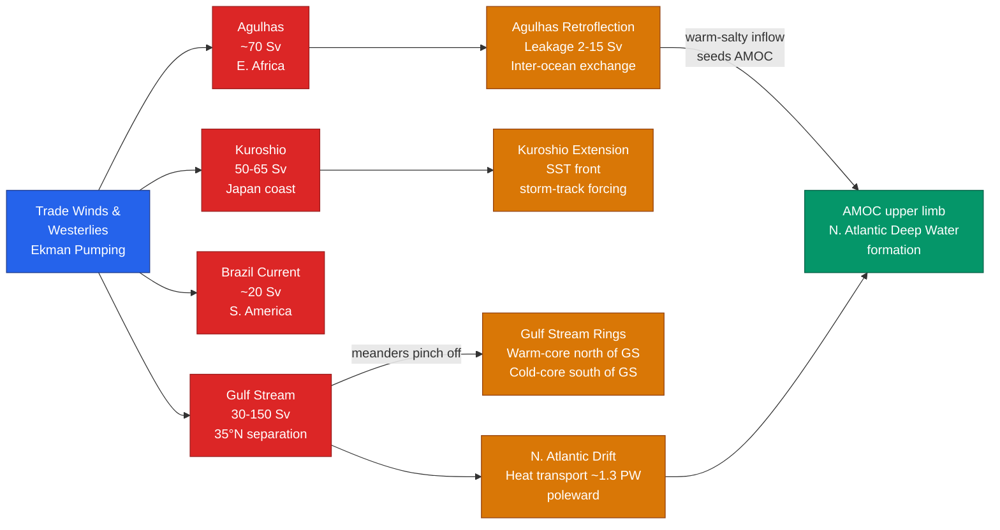

# Western Boundary Currents and Gulf Stream

> [!abstract] TL;DR
> Western boundary currents (WBCs) are the fast, narrow, deep return flows on the western edges of the major ocean gyres — the Gulf Stream, Kuroshio, Brazil Current, and Agulhas — transporting 20–150 Sv of warm water poleward. Their asymmetric intensification against the western boundary arises from the latitudinal variation of the Coriolis parameter (the β effect), first explained by Stommel in 1948: the same wind stress that drives a broad, sluggish eastern return flow concentrates all its vorticity budget against the western wall. The Gulf Stream carries roughly 1.3 PW of heat poleward, modulates northwest European climate, and after separating from the US coast at Cape Hatteras it meanders wildly, shedding warm-core and cold-core rings that stir the open ocean for months to years. The Agulhas Current of the Indian Ocean retroflects near the tip of Africa, leaking 2–15 Sv of warm salty water into the Atlantic and seeding the upper limb of the Atlantic Meridional Overturning Circulation (AMOC).

---

## Intuition

**Analogy:** Western boundary currents are the fast lane on a planetary highway. If you stir a circular basin of water, you expect the circulation to look the same everywhere around the rim. But on a rotating planet the rim is not symmetric: Earth's spin rate projected onto the vertical (the Coriolis parameter f) increases from equator to poles. This gradient — the β effect — acts like an invisible wall that squeezes all the poleward return flow into a tight jet against the *western* edge, while the equatorward return flow is allowed to spread lazily across the entire eastern basin. The result is a current 50–100 km wide and 1,000 m deep racing along the western boundary at up to 2 m/s, while the rest of the gyre drifts at a few centimetres per second in the other direction.

In technical terms: in the steady-state vorticity budget of the wind-driven gyre, the β term — the rate at which a fluid column acquires planetary vorticity as it moves meridionally — can only be balanced by friction in a very narrow layer. If that friction acts at the western boundary, the layer is narrow; if it acts at the eastern boundary, the mathematics produces an unphysical solution. Nature selects the western-intensified solution because only the western boundary provides enough frictional dissipation to close the gyre's vorticity balance.

---

## How It Works

### Core Mechanics

**1. The Stommel (1948) result — western intensification.** Stommel's one-layer ocean model with bottom friction showed that the steady vorticity equation for wind-driven flow is:

$$\beta\,\frac{\partial\psi}{\partial x} \;=\; \frac{1}{\rho\,H}\,\text{curl}(\boldsymbol{\tau}) \;-\; r\,\nabla^2\psi$$

where ψ is the streamfunction, β = ∂f/∂y is the meridional gradient of the Coriolis parameter (~2×10⁻¹¹ m⁻¹ s⁻¹ at mid-latitudes), and r is the bottom-friction coefficient. The term β∂ψ/∂x introduces an east–west asymmetry: the wind-curl source term requires a western boundary layer (where ∂ψ/∂x is large and positive) to absorb the vorticity input. Remove β (set it to zero) and the solution is symmetric; add β and the solution concentrates entirely on the western boundary. Munk (1950) extended this using lateral friction rather than bottom drag, arriving at the same qualitative conclusion with a jet width scaling as (A_H/β)^(1/3), where A_H is the eddy viscosity.

**2. Transport — Sverdrup balance in the interior.** Away from the western boundary, the interior transport is set by Sverdrup balance: V = curl(τ)/ρβ. Integrated across the basin, this determines how much flow must return through the WBC. The Gulf Stream system carries roughly 30 Sv of Sverdrup (wind-driven) transport in the open ocean but accelerates to ~150 Sv in the Straits of Florida and near the separation point, the extra mass coming from inertial recirculation gyres that flank the jet north and south.

**3. Geostrophic balance and the SSH front.** Within the Gulf Stream, along-stream flow is in geostrophic balance with the cross-stream pressure gradient:

$$f\,v \;=\; -\frac{1}{\rho}\frac{\partial p}{\partial x} \;=\; -g\frac{\partial h}{\partial x}$$

where x is the cross-stream coordinate (positive = right = Sargasso Sea). The SSH is ~1 m higher on the right (warm Sargasso Sea side) than on the left (cold slope-water side). This SSH step, resolvable by satellite altimeters, is the most reliable operational signature of WBC position.

**4. Thermal wind shear.** Because the Gulf Stream is baroclinic (density varies with depth), the along-stream velocity decreases with depth according to the thermal wind relation:

$$\frac{\partial v}{\partial z} \;=\; \frac{g}{\rho_0 f}\frac{\partial \rho}{\partial x}$$

The strong lateral temperature contrast (~10–15 °C over 50 km at the surface) drives a shear of ~0.1 m/s per 100 m, so the current is surface-intensified and largely absent below ~1,000 m.

**5. Gulf Stream path and separation.** The Gulf Stream hugs the US coastline from Florida (where it exits the Straits of Florida as a constricted jet) to Cape Hatteras (~35°N, North Carolina), where it separates abruptly from the shelf and continues as a free inertial jet in the open ocean. The separation is controlled by potential vorticity constraints: the flow cannot follow the coastal bathymetric contours beyond the point where they turn sharply poleward. After separation the jet meanders with wavelengths of ~300–400 km and amplitudes that grow over weeks to months.

**6. Rings — warm-core and cold-core.** When a meander grows large enough, it pinches off as a closed eddy (ring). The geometry determines its character:
- **Warm-core rings** form when a northward meander closes north of the Gulf Stream. They trap a lens of warm, salty Sargasso Sea water surrounded by cold slope water. They reside north/northwest of the Gulf Stream, spin anticyclonically (clockwise in the Northern Hemisphere), and decay over 6–18 months through surface heat flux and mixing.
- **Cold-core rings** form when a southward meander closes south of the Gulf Stream. They trap a lens of cold, nutrient-rich slope water surrounded by warm Sargasso Sea water. They reside south/southeast of the Gulf Stream, spin cyclonically (anticlockwise), and are biologically productive. Decay timescales are similar, 6–24 months.

Roughly 5–8 warm-core rings and 8–12 cold-core rings form per year in the northwest Atlantic. They are the primary lateral mixing mechanism at the Gulf Stream and carry heat, salt, and nutrients across the current's otherwise impermeable front.

**7. Agulhas retroflection.** The Agulhas Current (~70 Sv) flows southwestward along the east coast of Africa and accelerates toward the tip of the continent. Unlike the Gulf Stream, it does not separate quietly: the westward-propagating Rossby waves in the Indian Ocean interact with the current to induce a sharp U-turn — the **Agulhas Retroflection** — near 40°S, 20°E. Most of the current loops back into the Indian Ocean. During each retroflection cycle (every ~80 days), a large anticyclonic Agulhas Ring (~200–300 km diameter) is shed into the South Atlantic, carrying warm, salty Indian Ocean water. The leakage is 2–15 Sv and feeds the upper limb of the AMOC by adding buoyancy to the South Atlantic before it is transported northward.

### Flow / Architecture



---

## Key Concepts / Details

### Secondary Level

- **The Gulf Stream keeps northwest Europe warm** — though the mechanism is subtler than often stated (see Pitfalls), the Gulf Stream and its extension (the North Atlantic Drift) transport tropical warmth to the high latitudes of Europe, keeping Bergen, Norway (~60°N) ice-free while Labrador at the same latitude is not.
- **Fast and narrow** — at its peak the Gulf Stream is only 50–100 km wide but carries a volume transport equivalent to 100 Amazon rivers. Surface speeds reach 2 m/s, versus 1–5 cm/s in the open ocean.
- **Carries warm water poleward** — WBCs are the oceanic equivalent of a conveyor belt on the west side of each subtropical gyre, moving heat accumulated in the tropics toward the poles.
- **Meanders break off as rings** — like a river meandering across a floodplain, the Gulf Stream occasionally cuts off a loop to form a self-contained spinning eddy. These rings survive for months and are visible from space via their sharp temperature contrasts.
- **Four major WBCs** — Gulf Stream (North Atlantic), Kuroshio (North Pacific), Brazil Current (South Atlantic), Agulhas (Indian Ocean/South Atlantic exchange).

### Undergraduate Level

**Geostrophic transport calculation.** The total volume transport through a vertical section of the Gulf Stream can be estimated geostrophically from hydrographic sections using the dynamic method. The cross-stream SSH difference Δh gives a first-order barotropic estimate: T ≈ g Δh L / f, where L is the current width. For Δh ~ 1 m, L ~ 80 km, f ~ 9×10⁻⁵ s⁻¹: T ≈ (9.81 × 1 × 80000) / (9×10⁻⁵) ≈ 8.7×10⁹ m²/s = 8.7 Sv. The observed ~30 Sv (wind-driven part) requires integration over the full baroclinic structure, not just the surface signal.

**Baroclinic vs barotropic contributions.** The barotropic (depth-independent) component arises from the surface SSH slope; the baroclinic component arises from horizontal density gradients via the thermal wind relation. In the Gulf Stream, roughly 60–70% of the transport is baroclinic (driven by the cross-stream temperature/density contrast) and 30–40% is barotropic. The deep recirculation gyres flanking the jet contribute several tens of Sv to the total transport without appearing in the near-surface hydrography.

**Thermal wind balance in the Gulf Stream.** The surface SST front (cold slope water ~10–12 °C vs warm Sargasso Sea water ~22–25 °C in winter at 35°N) drives strong vertical shear. The thermal wind balance gives ∂v/∂z = -(g/ρ₀f)(∂ρ/∂x). With Δρ ~ 3 kg/m³ over 50 km at 38°N, the shear is ~1 m/s per 700 m depth, consistent with observed surface velocities of ~1.5 m/s decaying to near zero at ~1,000 m.

**Warm-core ring formation and decay.** A warm-core ring forms when a poleward meander of the Gulf Stream exceeds a critical amplitude (~100 km) and self-advection and the β effect combine to close the loop. The ring is initially ~100–150 km in diameter and carries a 400–800 m lens of Sargasso Sea water with T ~ 22–25 °C at the surface. Decay occurs by (a) lateral mixing/filamentation at the boundary, (b) surface heat loss in winter, and (c) interaction with the Gulf Stream front. Typical lifetimes are 6–18 months; the ring trajectory is generally westward at ~3–5 km/day due to the planetary β effect acting on the anticyclonic vortex.

### Graduate Level

**Inertial recirculation.** Mooring observations and inverse models show that Gulf Stream transport exceeds the Sverdrup prediction by a factor of ~3–5 near 70°W. This excess is maintained by two counter-rotating recirculation gyres (a sub-polar cyclone to the north and a subtropical anticyclone to the south) that are forced by eddy fluxes of potential vorticity (PV) generated at the Gulf Stream's diverging flanks. The recirculation is fundamentally nonlinear — it cannot be derived from the linear Sverdrup/Munk theory — and represents inertial rectification of mesoscale eddies feeding momentum back into the mean jet.

**Jet separation mechanisms and PV constraints.** The Gulf Stream's sharp separation at Cape Hatteras is one of the central unsolved problems of physical oceanography. Leading candidates: (a) **PV matching** — the Gulf Stream must match the PV distribution of the interior North Atlantic gyre; the coastal geometry at Hatteras is where the PV characteristics of the subtropical and sub-polar gyres meet. (b) **Deep western boundary current (DWBC) interaction** — the southward-flowing DWBC passes beneath/around the Gulf Stream and its PV gradients may steer the separation. (c) **Bathymetric influence** — the abrupt step in bottom topography at the continental slope near Hatteras disrupts the bottom-trapped PV contours that otherwise guide the current northward. Coupled climate models without sufficient resolution misplace the separation point by 2–5°, causing large SST biases.

**Agulhas retroflection and leakage.** The retroflection is maintained by the westward propagation of Natal Pulses (large meanders that develop on the Agulhas near 30°E and propagate downstream). Each pulse triggers a retroflection and sheds one Agulhas Ring. The mean leakage is ~15 Sv but varies on interannual to centennial timescales, sensitive to the position of the Southern Hemisphere westerlies. Under global warming, the westerlies are projected to shift poleward, increasing leakage and potentially stabilising the AMOC by increasing the salt content of the South Atlantic — an active research area since Beal et al. (2011).

**Eddy diffusivity and mixing across the Gulf Stream.** Despite being a strong coherent jet, the Gulf Stream does not act as a perfect barrier to cross-frontal mixing. Along-stream-averaged eddy diffusivity K_y is suppressed within the jet (~100–300 m²/s) compared to the surrounding ocean (~1,000–2,000 m²/s), with suppression attributed to the strong PV gradient acting as a mixing barrier. Cross-frontal tracer fluxes occur mainly at troughs and crests of meanders (strain-induced filamentation) and via ring formation. Quantifying K_y is central to ocean biogeochemistry (cross-frontal nutrient fluxes supporting open-ocean primary production) and climate models (parameterizing unresolved mesoscale mixing).

**Altimetric monitoring.** Satellite altimetry (TOPEX/Poseidon, Jason-1/2/3, Sentinel-6) provides 10-day repeat, ~25 km resolution sea-surface-height fields. The Gulf Stream appears as a ~1 m SSH front; the Kuroshio as ~0.8 m; the Agulhas as ~0.5–0.7 m. WBC position, transport proxies (SSH gradient × width), and eddy kinetic energy fields have been monitored continuously since 1993, enabling detection of interannual and decadal variability. The mean SSH gradient across the Gulf Stream at 35°N is ~10⁻⁵, i.e., ~1 m across 100 km.

---

## Python Demo

```python
# Gulf Stream cross-stream velocity profile: Gaussian jet
# Demonstrates: along-stream velocity u(y), SSH anomaly h(y) from
# geostrophic balance, and the geostrophic streamfunction psi(y).
#
# Geostrophic balance (cross-stream): dh/dy = (f/g) * u(y)
# SSH step (y = -inf to +inf): Δh = f * U0 * sigma * sqrt(2*pi) / g
import numpy as np
import matplotlib.pyplot as plt
from scipy.special import erf

# --- parameters ---
U0    = 2.0          # peak along-stream velocity [m/s]
sigma = 50e3         # Gaussian half-width [m] (50 km)
f     = 9.3e-5       # Coriolis parameter at 38 N [s^-1]
g     = 9.81         # gravitational acceleration [m/s^2]

# --- cross-stream coordinate: negative = left (coastal), positive = right (Sargasso) ---
y = np.linspace(-250e3, 250e3, 1000)  # metres

# --- velocity profile ---
u = U0 * np.exp(-y**2 / (2.0 * sigma**2))

# --- SSH anomaly: integrate geostrophic balance from -inf
# integral_{-inf}^{y} exp(-y'^2/(2s^2)) dy' = s*sqrt(pi/2) * [1 + erf(y/(s*sqrt(2)))]
h = (f / g) * U0 * sigma * np.sqrt(np.pi / 2.0) * (1.0 + erf(y / (sigma * np.sqrt(2.0))))

# --- total SSH drop across stream (diagnostic) ---
h_total = (f / g) * U0 * sigma * np.sqrt(2.0 * np.pi)

# --- geostrophic streamfunction psi = g * h / f [m^2/s] ---
psi = g * h / f

# --- plot ---
fig, axes = plt.subplots(3, 1, figsize=(8, 9), sharex=True)
y_km = y / 1e3  # convert to km for x-axis

axes[0].fill_between(y_km, 0, u, alpha=0.20, color='#dc2626')
axes[0].plot(y_km, u, color='#dc2626', lw=2.0,
             label=f'u(y) = {U0} exp(−y²/2σ²),  σ={int(sigma/1e3)} km')
axes[0].axvline(0, color='k', lw=0.8, ls='--', label='Jet centre')
axes[0].set_ylabel('Along-stream velocity [m/s]')
axes[0].set_title('Gulf Stream Gaussian Jet — Cross-Stream Structure (schematic)')
axes[0].legend(fontsize=8)
axes[0].grid(alpha=0.3)

axes[1].plot(y_km, h * 100.0, color='#2563eb', lw=2.0,
             label=f'SSH anomaly  (Δh_total = {h_total*100:.1f} cm)')
axes[1].axvline(0, color='k', lw=0.8, ls='--')
axes[1].set_ylabel('SSH anomaly h(y) [cm]')
axes[1].legend(fontsize=8)
axes[1].grid(alpha=0.3)
axes[1].annotate('Sargasso Sea\n(warm, high SSH)', xy=(120, h_total*50),
                 fontsize=7, color='#2563eb')
axes[1].annotate('Slope water\n(cold, low SSH)', xy=(-240, h_total*2),
                 fontsize=7, color='#2563eb')

axes[2].plot(y_km, psi / 1e4, color='#059669', lw=2.0,
             label='Streamfunction ψ(y) = g·h/f')
axes[2].axvline(0, color='k', lw=0.8, ls='--')
axes[2].set_xlabel('Cross-stream distance y [km]'
                   '\n(negative = left/coastal,  positive = right/Sargasso Sea)')
axes[2].set_ylabel('Streamfunction ψ(y) [×10⁴ m²/s]')
axes[2].legend(fontsize=8)
axes[2].grid(alpha=0.3)

plt.tight_layout()
plt.savefig('gulf_stream_cross_section.png', dpi=120)

print(f"Peak velocity            : {U0:.1f} m/s")
print(f"Jet half-width (sigma)   : {sigma/1e3:.0f} km")
print(f"Total SSH anomaly (Δh)   : {h_total:.2f} m  ({h_total*100:.1f} cm)")
print(f"Peak streamfunction      : {psi.max()/1e4:.2f} ×10^4 m²/s")
print("Saved: gulf_stream_cross_section.png")
```

The top panel shows the Gaussian velocity profile peaking at 2 m/s and decaying over ~100 km on either side. The middle panel shows the SSH rising monotonically from the coastal (left) to the Sargasso (right) side as an error-function step — the shape that satellite altimeters resolve directly. The bottom panel is the geostrophic streamfunction, proportional to SSH; its gradient recovers the velocity. The total SSH anomaly (~2.4 m for these parameters) is the schematic amplitude for U₀ = 2 m/s; the observed climatological step is closer to 0.8–1.2 m, reflecting the more complex real velocity structure.

---

## Real-World Notes

- **Gulf Stream heat transport ~1.3 PW poleward.** At 26°N (the RAPID mooring line), the combined Gulf Stream + AMOC system transports ~1.3 PW of heat northward — about 25% of the total poleward heat transport required to balance Earth's radiation budget at that latitude. RAPID has continuously measured this since 2004, revealing a ~10% decline in AMOC transport between 2004 and 2012, a finding that spurred intense debate about AMOC stability.

- **Kuroshio Extension SST fronts and atmospheric storm tracks.** The Kuroshio Extension (~35°N, 140–160°E) maintains a sharp SST front (~5 °C over 100 km) that acts as a lower-boundary forcing for baroclinic development of extratropical cyclones. Weather systems that cross the front receive strong surface heat fluxes (up to 400 W/m² in winter), deepening dramatically. The Kuroshio and Gulf Stream are thus the primary ocean-to-atmosphere energy sources for the North Pacific and North Atlantic storm tracks, respectively.

- **Agulhas leakage and AMOC.** Beal et al. (2011, *Nature*) argued that increasing Agulhas leakage under poleward-shifting Southern Ocean westerlies injects warm, salty Indian Ocean water into the South Atlantic, potentially counteracting the freshwater flux that threatens to weaken the AMOC. Whether leakage will be large enough to matter remains an open question, but it positions the Agulhas as a remote teleconnector between Southern Ocean winds and North Atlantic deep-water formation.

- **Global satellite altimetry.** The ongoing altimeter constellation (Sentinel-6/Jason-CS, SWOT) provides near-real-time SSH maps with ~1-cm accuracy and, since 2022, swath coverage down to 10 km scales from SWOT. Every major WBC is tracked daily; its position, meander amplitude, and ring population are operational products used by fisheries, shipping, and the US Navy.

---

## Common Pitfalls

- **"The Gulf Stream keeps Europe warm" — mostly a myth, but not entirely.** The 2002 study by Seager et al. showed that atmospheric heat transport (associated with westerlies and weather systems) dominates the difference between European and eastern North American winter temperatures. Europe's mild winters relative to Labrador are largely explained by prevailing westerlies carrying oceanic heat eastward. That said, the Gulf Stream and North Atlantic Drift do contribute meaningfully — they warm the sea surface that the westerlies blow over. The myth is not that the Gulf Stream is irrelevant, but that it is the *primary* explanation. Saying "the Gulf Stream alone keeps Europe warm" overstates a partial truth.

- **Confusing the Gulf Stream with the AMOC.** The Gulf Stream has two distinct components: (1) a **wind-driven** barotropic/baroclinic jet set by Sverdrup balance (~30 Sv of Sverdrup transport, ~80–100 Sv with recirculations), and (2) an **AMOC-driven** thermohaline component (~17 Sv in the upper limb at 26°N). A weakening AMOC would reduce the second component but not abolish the Gulf Stream itself. The current would move offshore, narrow, and cool, but not "shut down." Conflating the two leads to both under- and over-reaction when AMOC change is discussed.

- **Warm-core ring location confusion.** Students frequently swap the positions. The rule: warm-core rings are **north** of the Gulf Stream (a meander bulged northward pinches off, trapping warm Sargasso Sea water in cold slope-water surroundings). Cold-core rings are **south** of the Gulf Stream (a meander bulged southward closes, trapping cold slope water in warm Sargasso surroundings). Mnemonic: warm-core rings are north, like warm air pushing into cold polar regions.

- **Treating WBCs as steady flows.** All WBCs are highly variable on timescales from days (meanders, eddies) to interannual (ENSO modulates the Kuroshio Extension path) to decadal (Gulf Stream position shifts by ~100 km). Single hydrographic sections or Argo floats sample this variability and must be treated as instantaneous snapshots, not long-term means.

- **Sverdrup transport as total WBC transport.** Sverdrup balance predicts the *interior* meridional transport set by wind stress curl (~30 Sv at 36°N in the North Atlantic). The WBC must return this transport, so it is a lower bound. The observed ~150 Sv in the Straits of Florida includes inertial recirculation gyres not captured by Sverdrup theory. Confusing the Sverdrup estimate (~30 Sv) with the actual Gulf Stream transport (~150 Sv) leads to large errors in heat transport calculations.

---

## Related Concepts

**Same vault:**
- [[Wind_Driven_Circulation_and_Sverdrup_Balance]] — Sverdrup balance sets the interior gyre transport that the WBC must return; western intensification is the WBC's response to the β constraint that Sverdrup balance alone cannot satisfy.
- [[Thermohaline_Circulation_and_AMOC]] — the Gulf Stream carries both a wind-driven and an AMOC-driven component; Agulhas leakage seeds the AMOC upper limb; AMOC collapse would significantly alter WBC heat transport.
- [[Mesoscale_Eddies_and_Ocean_Variability]] — Gulf Stream rings are the canonical mesoscale eddies; the Kuroshio Extension eddy field is the most energetic in the ocean; WBCs are the primary source of oceanic mesoscale energy.
- [[Ocean_Heat_Content_and_Marine_Heatwaves]] — WBC-adjacent regions (Gulf Stream wall, Kuroshio Extension) experience the most intense marine heatwaves, driven by shifts in current position and increased stratification.
- [[_MOC_Ocean_Circulation]] — section map for the ocean circulation unit; parent context for this note.

**Cross-vault:**
- [[Fluid_Statics_and_Properties]] — hydrostatic pressure and the equation of state for seawater underlie the baroclinic structure and thermal wind balance of the Gulf Stream.
- [[Rotational_Dynamics]] — the Coriolis effect and its meridional gradient (the β effect) are the fundamental physical cause of western intensification; geostrophic balance is a limit of rotating-frame fluid mechanics.
- [[Global_Atmospheric_Circulation]] — the subtropical high-pressure systems that drive the trade winds and westerlies generate the Ekman pumping that forces the ocean gyres; WBCs are the western return flows of those gyres.
- [[Ocean_Atmosphere_Coupling_and_ENSO]] — the Kuroshio Extension path is modulated by ENSO and the PDO on interannual to decadal timescales; Agulhas leakage variability influences the Atlantic mean state and potentially ENSO teleconnections.
- [[_MOC_Physics_Master]] — parent physics vault; fluid mechanics, rotating-frame dynamics, and thermodynamics underpin all of ocean circulation theory.
- [[_MOC_Meteorology_Master]] — parent meteorology vault; WBC SST fronts force the extratropical storm tracks and baroclinic eddy growth that dominate mid-latitude weather.

---

## Review Questions

### Secondary

1. Why is the Gulf Stream on the *western* side of the North Atlantic rather than the eastern side? What would change if the ocean were on a non-rotating planet?
2. Where does the Gulf Stream go after it leaves the US coastline? What happens to it as it meanders out into the open Atlantic?
3. The Gulf Stream and Kuroshio are both western boundary currents, but one is in the North Atlantic and one is in the North Pacific. What makes them dynamically similar? Name one way they differ.

### Undergraduate

1. Starting from the steady vorticity equation β∂ψ/∂x = curl(τ)/ρH − r∇²ψ, explain qualitatively why β causes the return flow to intensify on the *western* side of the basin. What role does friction play, and why is an eastern boundary layer mathematically inadmissible?
2. A hydrographic section across the Gulf Stream at 36°N shows a temperature contrast of 12 °C over a horizontal distance of 60 km from the surface to 800 m depth. Use the thermal wind relation to estimate the vertical shear ∂v/∂z and the surface velocity if the deep velocity is approximately zero. Take f = 9×10⁻⁵ s⁻¹ and the thermal expansion coefficient α_T = 2×10⁻⁴ °C⁻¹.
3. Distinguish warm-core from cold-core rings in terms of (a) their location relative to the Gulf Stream, (b) the water they trap, (c) their sense of rotation, and (d) their biological productivity. Why do warm-core rings decay more rapidly in winter than in summer?

### Graduate

1. The observed Gulf Stream transport near 70°W (~150 Sv) greatly exceeds the Sverdrup prediction (~30 Sv). Explain the concept of inertial recirculation: what drives it, how does it relate to eddy PV fluxes, and why does the linear Sverdrup/Munk framework fail to capture it?
2. Discuss the two leading hypotheses for Gulf Stream separation at Cape Hatteras — the PV-matching argument and the DWBC interaction mechanism. What observational and modelling evidence supports each, and what is the current state of the debate?
3. Agulhas leakage is 2–15 Sv of warm, salty Indian Ocean water entering the South Atlantic via retroflection rings. Trace this water's pathway to the point where it could influence North Atlantic Deep Water formation. How does projected poleward migration of the Southern Ocean westerlies change leakage, and what is the proposed sign of the resulting AMOC feedback?

---

## Sources

- [Stommel, H. — *The Gulf Stream: A Physical and Dynamical Description* (1965, University of California Press)](https://archive.org/details/gulfstreamphysic0000stom) — foundational text on western intensification, the β effect, and Gulf Stream dynamics; the 1948 result is presented and expanded.
- [Pedlosky, J. — *Ocean Circulation Theory* (1998, Springer)](https://link.springer.com/book/10.1007/978-3-662-03204-6) — graduate-level treatment of Sverdrup balance, WBC theory, inertial recirculation, and baroclinic jet dynamics.
- [Wunsch, C. & Heimbach, P. (2013) — "Two decades of the Atlantic Meridional Overturning Circulation: anatomy, variations, extremes, prediction, and overcoming its limitations," *J. Climate*, 26, 7167–7186](https://doi.org/10.1175/JCLI-D-12-00478.1) — synthesis of AMOC and Gulf Stream transport observations, inverse models, and state estimates.
- [Lozier, M. S. (2010) — "Deconstructing the conveyor belt," *Science*, 328, 1507–1511](https://doi.org/10.1126/science.1189250) — accessible review of Gulf Stream–AMOC distinction, WBC variability, and the limits of the "conveyor belt" metaphor.
- [Beal, L. M. et al. (2011) — "On the role of the Agulhas system in ocean circulation and climate," *Nature*, 472, 429–436](https://doi.org/10.1038/nature09983) — definitive review of Agulhas retroflection, leakage dynamics, and their link to AMOC and global climate.
- [Topical collection on western boundary currents, AOGS 2023 — *Ocean Dynamics* (2026)](https://link.springer.com/article/10.1007/s10236-026-01775-x) — recent synthesis of WBC variability, climate interactions, and observational advances.

---

#Oceanography #OceanCirculation #WesternBoundaryCurrent #GulfStream
