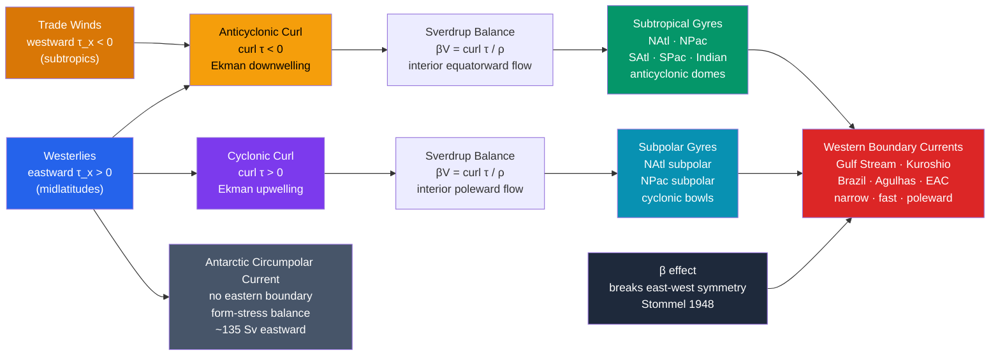

# Wind-Driven Ocean Circulation and Sverdrup Balance

> [!abstract] TL;DR
> The global ocean organises into five great **subtropical gyres** and several **subpolar gyres**, all spun by the wind-stress curl transmitted through the atmosphere. The theoretical skeleton that explains their interior structure is **Sverdrup balance** (1947): the planetary vorticity gradient $\beta$ relates the depth-integrated meridional transport to the wind-stress curl, $\beta V = (1/\rho)\,\nabla\times\boldsymbol{\tau}$. Integrating from the eastern boundary gives the **Sverdrup streamfunction**, which accounts for roughly $85\%$ of the gyre transport in the interior — but is completely silent about the western boundary. **Stommel (1948)** resolved this: adding the $\beta$ effect to bottom friction breaks east-west symmetry, confining the return flow into a narrow, fast **western boundary current** (Gulf Stream, Kuroshio). The **Munk (1950)** variant uses lateral friction instead, giving a more realistic boundary-layer structure. The resulting asymmetric gyre — broad sluggish eastern limb, intense western jet — is one of the most directly observable predictions of geophysical fluid dynamics.

---

## Intuition

**Analogy:** Picture the subtropical North Atlantic as a **lazy Susan** (a spinning tray) sitting on a table. The trade winds and westerlies push on opposite rims in opposite directions — a perfect recipe for rotation. Friction between the tray and the table ought to make it spin symmetrically, evenly. But the table is not flat: it **tilts imperceptibly from south to north** (the Earth's curvature means the Coriolis parameter $f$ increases with latitude). That tilt, the **$\beta$ effect**, forces the tray to skid — hard against the western rail, gently along the eastern one. The result is a lazy Susan that spins fast on the left edge and barely moves on the right: the Gulf Stream versus the sluggish Canary Current.

Technically: wind stress imparts a **curl** to the ocean surface, driving Ekman pumping (vertical motion at the base of the Ekman layer). That pumping stretches or squashes water columns, generating relative vorticity. On a $\beta$-plane, the only way the interior ocean can absorb that vorticity input is by moving **meridionally** — changing its planetary vorticity to compensate. That constraint is the Sverdrup balance. The western boundary current is the drainage valve that closes the vorticity budget when the interior flow alone cannot.

---

## How It Works

### Core Mechanics

**Step 1 — Wind stress and the Ekman layer.**  
The atmosphere exerts a tangential stress $\boldsymbol{\tau}$ (N m$^{-2}$) on the ocean surface. Within the top $\sim 50$–$100$ m (the **Ekman layer**), the Coriolis force deflects the wind-driven flow $90°$ to the right (NH) or left (SH), generating **Ekman transport** perpendicular to the wind:

$$M_E^y = \frac{\tau_x}{\rho f}, \qquad M_E^x = -\frac{\tau_y}{\rho f}$$

**Step 2 — Ekman pumping/suction.**  
Horizontal divergence of the Ekman transport forces a vertical velocity $w_E$ at the base of the Ekman layer:

$$\boxed{w_E = \frac{1}{\rho f}\,\nabla\times\boldsymbol{\tau}}$$

Anticyclonic curl ($\nabla\times\boldsymbol{\tau} < 0$, as under the trade-wind/westerly pair) drives **downwelling** (Ekman pumping) into the subtropical interior — piling water into the famous **subtropical dome** visible in satellite altimetry. Cyclonic curl drives **upwelling** (Ekman suction) in subpolar regions.

**Step 3 — Sverdrup balance.**  
In the **interior** ocean (away from boundary layers) the vertically integrated vorticity equation reduces to a single balance between the planetary vorticity change of a moving fluid column and the curl of the surface stress:

$$\boxed{\beta\,V = \frac{1}{\rho}\,\nabla\times\boldsymbol{\tau}}$$

where $V = \int_{-H}^{0} v\,dz$ is the **depth-integrated meridional transport** per unit width (m$^2$ s$^{-1}$), $\beta = \partial f/\partial y = 2\Omega\cos\varphi/R_E$ is the planetary vorticity gradient, and $\rho$ is the reference density.  
The **physical meaning**: to absorb the vorticity input from the wind curl, water must move meridionally — gaining or losing planetary vorticity $f$ by changing latitude.

**Step 4 — Sverdrup streamfunction.**  
Since $V = \partial\psi/\partial x$ (with $U = -\partial\psi/\partial y$), and the eastern boundary requires $\psi = 0$ at $x = L_x$, integrating westward:

$$\psi(x,y) = \frac{1}{\rho\beta}\int_{x}^{L_x}\bigl(\nabla\times\boldsymbol{\tau}\bigr)\,dx'$$

The streamfunction is maximum at the **western boundary** ($x=0$), implying that all the interior Sverdrup transport must be returned there — but Sverdrup balance itself has no solution at the western wall.

**Step 5 — Western intensification (Stommel 1948).**  
Stommel added **bottom friction** $r\,\nabla^2\psi$ to the vorticity equation. In the interior, the balance is still Sverdrup-dominated. At the western boundary a thin layer of width $\delta \sim r/\beta$ forms where friction is large enough to close the **vorticity budget**: the intense western boundary current (WBC) generates enough relative vorticity dissipation to balance the wind curl input. The **$\beta$ effect** is the crucial ingredient that breaks east-west symmetry — without it, friction and wind curl would balance everywhere equally, producing a symmetric gyre with equal transport on both sides.

**Step 6 — Munk (1950) model.**  
Munk replaced bottom friction with **lateral (eddy) friction** $A_H \nabla^4\psi$. This yields a boundary layer of width $\delta_M \sim (A_H/\beta)^{1/3}$ (~$2°$ of longitude), closer to observed WBC widths, and satisfies both no-slip and no-normal-flow boundary conditions.

**Step 7 — Subtropical vs subpolar gyres.**  
| Region | Wind-stress curl | Ekman pumping | Gyre sense |
|--------|-----------------|---------------|------------|
| Subtropical (20–40°) | Anticyclonic ($<0$) | Downwelling | Anticyclonic (clockwise NH) |
| Subpolar (50–65°) | Cyclonic ($>0$) | Upwelling | Cyclonic (counterclockwise NH) |

**Step 8 — Antarctic Circumpolar Current (ACC).**  
The ACC is a special case: there are no continental boundaries to enforce an eastern-boundary condition, so Sverdrup balance does not apply in the same way. Instead, the westerly winds drive a zonal transport of $\sim 135$ Sv eastward, with the balance between wind-stress input and bottom form stress (pressure drag across submarine ridges) — the **Munk-Stommel-Johnson** balance. The ACC has no western boundary current in the classical sense.

---

### Flow / Architecture



---

## Key Concepts / Details

### Secondary Level

- **Why does the ocean have gyres at all?** The trade winds blow westward in the tropics and the westerlies blow eastward in midlatitudes. Together they **spin the ocean in the same rotational sense** as a gear between two opposing forces — clockwise in the NH subtropics, counterclockwise in the SH subtropics. The five major subtropical gyres are the direct, planet-scale result of this wind pattern.
- **What is a western boundary current?** The return flow of each gyre is forced into a narrow corridor against the western continental margin — the Gulf Stream (North Atlantic), the Kuroshio (North Pacific), the Brazil Current (South Atlantic), the Agulhas Current (Indian Ocean), and the East Australian Current (South Pacific). These currents are fast ($\sim$1–3 m/s), narrow ($\sim$100 km), warm, and extend deep ($\sim$1 km). The broad eastern return flows (Canary, California, Benguela, Humboldt, West Australia Currents) are slow, cool, and shallow.
- **The Sargasso Sea is a desert.** The center of the North Atlantic subtropical gyre is a region of **persistent downwelling and extreme oligotrophy** — nutrients are pumped down, not up. The Sargasso Sea has among the clearest, bluest, most biologically barren water on Earth.
- **Great Pacific Garbage Patch.** Floating debris accumulates at the **convergence center** of the North Pacific subtropical gyre, where Ekman pumping sweeps surface material toward the gyre interior. The patch now occupies an area larger than Texas.
- **The ACC is different.** Antarctica circles the globe with no landmass to break the ocean into basins. The westerlies drive the ACC eastward without interruption at $\sim$135 Sv — the largest current on Earth by volume.

### Undergraduate Level

**Ekman pumping derivation.**  
Taking the curl of the depth-integrated momentum equations and retaining only the Ekman layer contribution:

$$w_E = \frac{1}{\rho}\left(\frac{\partial}{\partial x}\frac{\tau_y}{f} - \frac{\partial}{\partial y}\frac{\tau_x}{f}\right) \approx \frac{1}{\rho f}\,\nabla\times\boldsymbol{\tau}$$

(the last approximation holds when $f$ varies slowly compared with the stress curl). Under the subtropical wind pattern ($\nabla\times\boldsymbol{\tau} < 0$), $w_E < 0$ — downwelling at $\sim$25–40 m/yr piles up warm water into the SSH dome.

**Sverdrup balance derivation.**  
Start from the linearised, steady, depth-integrated shallow-water vorticity equation on a $\beta$-plane:

$$\beta V = \frac{\partial \tau_y/\partial x - \partial \tau_x/\partial y}{\rho} \equiv \frac{\nabla\times\boldsymbol{\tau}}{\rho}$$

This follows from combining the depth-integrated $x$- and $y$-momentum equations, cancelling the pressure terms via the $f$-plane approximation, and keeping only the leading-order $\beta$ term. All other terms (time tendency, nonlinearity, friction) are negligible in the interior for large-scale steady flow.

**Barotropic streamfunction and transport.**  
With $V = \partial\psi/\partial x$ and eastern boundary condition $\psi(L_x,y) = 0$:

$$\psi(x,y) = \frac{1}{\rho\beta}\int_x^{L_x}(\nabla\times\boldsymbol{\tau})\,dx'$$

For an idealised sinusoidal wind $\tau_x = -\tau_0\cos(\pi y/L_y)$ (trade winds at south, westerlies at north):

$$\nabla\times\boldsymbol{\tau} = -\frac{\tau_0\pi}{L_y}\sin\frac{\pi y}{L_y}, \qquad \psi = \frac{\tau_0\pi}{\rho\beta L_y}\sin\frac{\pi y}{L_y}\,(L_x - x)$$

This is linear in $x$: the streamfunction grows from $0$ at the eastern boundary to maximum at the western boundary, with peak transport $\psi_{\max} = \tau_0\pi L_x/(\rho\beta L_y) \sim 20$–$30$ Sv for typical North Atlantic parameters — matching observations well.

**Stommel model vorticity budget.**  
Add linear bottom friction $-r\,\zeta$ to the vorticity equation:

$$\beta V - r\nabla^2\psi = \frac{\nabla\times\boldsymbol{\tau}}{\rho}$$

In the interior ($r\nabla^2\psi \ll \beta V$) the Sverdrup balance holds. Near the western boundary, the solution has an exponential boundary layer $\exp(-x/\delta)$ with $\delta = r/\beta$. The **critical role of $\beta$**: without it ($\beta = 0$), the equation $-r\nabla^2\psi = \text{forcing}$ is symmetric in $x$ — the WBC can sit on either side. The $\beta$ term selects the **western** side uniquely.

### Graduate Level

**Rhines scale and eddy saturation.**  
At scales larger than the **Rhines scale** $L_R \sim \sqrt{U/\beta}$ ($\sim 100$–$300$ km in the ocean), Rossby waves dominate and turbulence is anisotropic, organising into zonal jets rather than isotropic eddies. In the WBC extension regions (Gulf Stream, Kuroshio Extension), energetic **inertial recirculation gyres** flank the jet, trapping high kinetic energy and causing the actual WBC transport ($\sim 150$ Sv for the Gulf Stream at $35°$N) to vastly exceed the Sverdrup transport ($\sim 30$ Sv) — the inertial recirculation is not captured by the linear Sverdrup/Stommel theory.

**Geostrophic turbulence vs mean gyre.**  
Modern ocean models and satellite altimetry reveal that the time-mean gyre picture is only a faint skeleton. **Mesoscale eddies** ($\sim$50–300 km, $\sim$10–100 days) carry $5$–$10\times$ more kinetic energy than the mean flow over most of the ocean. The eddy field is not just a perturbation on the gyre — it drives strong **eddy-mean flow interactions** that alter the WBC path, create the inertial recirculation, and influence the large-scale vorticity budget.

**ACC eddy saturation.**  
The **Meredith–Hogg (2006)** hypothesis and subsequent modelling shows that the ACC transport is insensitive to wind-stress amplitude beyond a threshold — increasing the westerlies does not proportionally increase ACC transport because the extra wind energy drives **more eddies** (which increase southward eddy heat flux and bottom form stress) rather than accelerating the zonal flow. This **eddy saturation** is a fundamental limit on ACC wind-transport sensitivity with implications for climate projections.

**Wind stress curl changes under climate change.**  
CMIP projections show poleward intensification and strengthening of the westerlies in the SH, consistent with observed Hadley-cell widening. This projects onto: (1) poleward shift of the ACC and Agulhas retroflection; (2) changes in subpolar gyre strength affecting deep-water formation (see [[Thermohaline_Circulation_and_AMOC]]); (3) altered Sverdrup transport in the subtropical gyres modifying heat-content distributions. In the NH, weakening of the Pacific High (associated with ENSO and PDO variability) directly modulates North Pacific gyre transport through the Sverdrup relation.

---

## Python Demo

```python
# Sverdrup streamfunction for the subtropical North Atlantic
# Wind stress: tau_x = -tau0 * cos(pi*y/Ly)  (trade winds at south, westerlies at north)
# Sverdrup balance: beta * V = curl(tau) / rho
# Streamfunction: psi(x,y) = (1/rho/beta) * integral_x^Lx curl(tau) dx'
# Stommel BL correction added to enforce psi=0 at western wall.
import numpy as np
import matplotlib.pyplot as plt

# --- parameters ---
Lx    = 6_000e3   # basin width (m) ~ 60 deg longitude
Ly    = 4_000e3   # basin height (m) ~ 36 deg latitude
tau0  = 0.10      # wind stress amplitude (N m⁻²)
rho   = 1_025.0   # seawater density (kg m⁻³)
Omega = 7.292e-5  # Earth rotation (s⁻¹)
R_E   = 6.371e6   # Earth radius (m)
beta  = 2 * Omega * np.cos(np.deg2rad(30.0)) / R_E  # β at 30°N (m⁻¹ s⁻¹)
H     = 1_000.0   # reference depth for Sv conversion (m)

print(f"β at 30°N = {beta:.3e} m⁻¹ s⁻¹")

# --- grid ---
Nx, Ny = 300, 200
x = np.linspace(0, Lx, Nx)
y = np.linspace(0, Ly, Ny)
X, Y = np.meshgrid(x, y)

# --- wind stress curl ---
# tau_x = -tau0 * cos(pi*y/Ly): westward (trade winds) at y=0, eastward (westerlies) at y=Ly
# curl(tau)_z = d(tau_y)/dx - d(tau_x)/dy = -d(tau_x)/dy  [since tau_y = 0]
#             = -tau0 * (pi/Ly) * sin(pi*y/Ly)  < 0  (anticyclonic = subtropical gyre)
curl_tau = -tau0 * (np.pi / Ly) * np.sin(np.pi * Y / Ly)

# --- interior Sverdrup streamfunction ---
# psi_Sv = (1/rho/beta) * curl_tau * (x - Lx)    [integrating from Lx to x]
# psi_Sv > 0 everywhere: curl_tau < 0, (x-Lx) < 0, ratio neg/neg = pos
psi_sv   = (1.0 / (rho * beta)) * curl_tau * (X - Lx)  # m² s⁻¹ (depth-integrated)
psi_sv_Sv = psi_sv * H / 1e6                            # convert to Sverdrups (Sv)

psi_max = psi_sv_Sv.max()
print(f"Peak Sverdrup streamfunction (interior): {psi_max:.1f} Sv")

# --- Stommel WBC correction ---
# Enforce psi=0 at x=0 by subtracting an exponential eastern-decaying correction:
# psi_full = psi_sv - psi_sv(x=0) * exp(-x/delta)
delta = 250e3   # WBC e-folding width (m)
psi_at_west = psi_sv_Sv[:, 0:1]  # shape (Ny, 1)
psi_full = psi_sv_Sv - psi_at_west * np.exp(-X / delta)

# --- plot ---
fig, axes = plt.subplots(1, 2, figsize=(14, 5))
lev = np.linspace(0, psi_max * 1.05, 18)

cf1 = axes[0].contourf(X / 1e6, Y / 1e6, psi_sv_Sv, levels=lev, cmap="Blues")
axes[0].contour(X / 1e6, Y / 1e6, psi_sv_Sv, levels=lev, colors="k",
                linewidths=0.5, alpha=0.4)
plt.colorbar(cf1, ax=axes[0], label="ψ  (Sv)")
axes[0].set_title("Interior Sverdrup streamfunction\n"
                  r"ψ = $\frac{1}{\rho\beta}$∫curl(τ)dx  [eastern BC: ψ=0 at x=L_x]")
axes[0].set_xlabel("x  (×10³ km)"); axes[0].set_ylabel("y  (×10³ km)")
axes[0].text(0.03, 0.5, "← All return flow\nhere (WBC needed)",
             transform=axes[0].transAxes, fontsize=8, color="crimson",
             bbox=dict(boxstyle="round,pad=0.3", fc="white", alpha=0.85))

cf2 = axes[1].contourf(X / 1e6, Y / 1e6, psi_full, levels=lev, cmap="Blues")
axes[1].contour(X / 1e6, Y / 1e6, psi_full, levels=lev, colors="k",
                linewidths=0.5, alpha=0.4)
plt.colorbar(cf2, ax=axes[1], label="ψ  (Sv)")
axes[1].axvline(3 * delta / 1e6, color="crimson", ls="--", lw=1.5,
                label=f"3δ = {3*delta/1e3:.0f} km  (WBC edge)")
axes[1].set_title("Stommel gyre: Sverdrup interior + WBC\n"
                  f"western intensification, δ = {delta/1e3:.0f} km")
axes[1].set_xlabel("x  (×10³ km)"); axes[1].set_ylabel("y  (×10³ km)")
axes[1].legend(loc="upper right", fontsize=9)

plt.tight_layout()
plt.savefig("sverdrup_gyre.png", dpi=130)
print("Saved sverdrup_gyre.png")

# --- diagnostic: check Sverdrup V at gyre centre ---
iy_mid = Ny // 2
V_sverdrup = curl_tau[iy_mid, Nx // 2] / (rho * beta)  # m² s⁻¹
print(f"Interior Sverdrup V at gyre centre: {V_sverdrup:.2f} m² s⁻¹  "
      f"(southward = {V_sverdrup:.2f} < 0)")
```

The left panel shows the **interior Sverdrup streamfunction** linearly increasing from zero at the eastern boundary to its maximum at $x = 0$ — the gyre is entirely fed from the east and must drain through the western boundary. The right panel (Stommel correction) concentrates the transport into the narrow **WBC region** ($\delta \approx 250$ km), leaving the interior almost unchanged. A typical North Atlantic calculation with $\tau_0 = 0.1$ N m$^{-2}$ gives $\psi_{\max} \approx 24$ Sv, consistent with observational estimates of the interior Sverdrup transport.

---

## Real-World Notes

- **Sargasso Sea — the gyre's high-pressure heart.** The centre of the North Atlantic subtropical gyre sits $\sim 1$ m above mean sea level in satellite altimetry, a broad **SSH dome** maintained by Ekman downwelling. The permanently stratified, nutrient-depleted water beneath supports the lowest phytoplankton biomass of any ocean region — a biological **desert** whose clear blue waters contrast with the productive upwelling margins. It is also the spawning ground of European and American eels (the mystery of eel migration to the Sargasso Sea eluded science until the 20th century).
- **ENSO modulates the Pacific gyre.** During **El Niño**, weakening trade winds reduce the anticyclonic wind-stress curl over the subtropical North and South Pacific, decreasing Sverdrup transport and relaxing the SSH dome. The Kuroshio Extension shifts southward and weakens. During **La Niña** the reverse occurs. The interannual gyre response to ENSO is measurable by the TOPEX/Jason satellite altimeter series launched in 1992.
- **ACC — the Earth's great conveyor belt junction.** The Antarctic Circumpolar Current transports $\sim 135$ Sv eastward through Drake Passage — roughly 100 times the discharge of all the world's rivers combined. It connects all three ocean basins, enabling the global thermohaline circulation, and its strength is tied to the Southern Ocean westerlies. Eddy saturation means ACC transport has not dramatically increased despite $\sim 15\%$ stronger SH westerlies since the 1970s.
- **Oligotrophic gyres — the ocean's deserts.** The five subtropical gyres cover $\sim 40\%$ of the Earth's surface and are among the most biologically unproductive regions on the planet. Persistent Ekman downwelling suppresses nutrient upwelling; the deep nutricline is effectively sealed. Together they form a vast nutrient-limited desert, accounting for less than $10\%$ of global ocean primary productivity despite their enormous area.
- **The Great Pacific Garbage Patch.** Surface convergence in the North Pacific subtropical gyre steadily concentrates floating plastic debris and organic material toward the gyre centre. The patch — centred near $30°$N, $140°$W — now contains an estimated $80{,}000$ metric tonnes of plastic, a direct consequence of Ekman convergence maintaining the gyre's downwelling centre.

---

## Common Pitfalls

- **Thinking Sverdrup balance predicts the Gulf Stream.** It does not. Sverdrup balance is a theory of the **gyre interior** only; it integrates from the eastern boundary and implicitly dumps all the returning transport at $x = 0$ but says nothing about the dynamics there. The western boundary current requires an independent physical mechanism (Stommel: bottom friction + $\beta$; Munk: lateral friction) with its own length scale $\delta \ll L_x$. Students who integrate the Sverdrup streamfunction all the way to $x = 0$ and call it the Gulf Stream are misusing the theory.
- **Confusing Sverdrup transport with Ekman transport.** The **Ekman transport** $M_E = \tau/(\rho f)$ is purely wind-driven surface-layer flow perpendicular to the wind; it has units of m$^2$ s$^{-1}$ per unit width and is confined to the top $\sim$50 m. The **Sverdrup transport** $V = (\nabla\times\boldsymbol{\tau})/(\rho\beta)$ is the **depth-integrated interior transport** — it is driven by the **curl** of the wind stress, not its magnitude, and represents barotropic motion extending throughout the water column. The two are dimensionally the same but physically and spatially distinct.
- **Ignoring stratification effects.** The classical Sverdrup/Stommel theory is **barotropic** (depth-independent). Real gyres are strongly **baroclinic**: the thermocline shallows from west to east across each gyre (the subtropical dome), and only the upper thermocline water participates in the gyre transport. The Sverdrup balance can be extended to a **reduced-gravity** (1.5-layer) model where $H$ is replaced by the thermocline depth, giving better transport estimates but adding the requirement to model thermocline dynamics separately.
- **Assuming Sverdrup balance everywhere.** It holds only in the **interior** — far from western boundary currents, eastern coasts, the equator ($f \to 0$, making $w_E$ singular), and polar regions. Near the equator the Sverdrup balance breaks down completely and must be replaced by equatorial wave theory.
- **Expecting static gyres.** Wind-driven gyres respond to time-varying wind forcing on timescales of weeks to years through **Rossby wave adjustment**. The propagation speed of long baroclinic Rossby waves ($c_R = -\beta R_d^2 \sim 2$–$10$ cm/s in the midlatitude ocean) sets the adjustment timescale: $L_x/c_R \sim 1$–$10$ years. The gyre is thus in quasi-steady Sverdrup balance only for forcing that varies more slowly than this timescale.

---

## Related Concepts

**Same vault:**
- [[Ekman_Transport_and_Coastal_Upwelling]] — Ekman transport and pumping are the direct surface forcing mechanism whose curl enters the Sverdrup balance; coastal upwelling is the regional expression of Ekman suction along eastern boundaries.
- [[Western_Boundary_Currents_and_Gulf_Stream]] — the Gulf Stream and Kuroshio are the WBC solutions that Sverdrup balance requires but cannot itself describe; their structure is governed by Stommel/Munk dynamics and inertial effects.
- [[Mesoscale_Eddies_and_Ocean_Variability]] — mesoscale eddies at the WBC separation point carry $5$–$10\times$ the kinetic energy of the mean gyre and modify the effective vorticity balance through eddy-mean flow interactions.
- [[Thermohaline_Circulation_and_AMOC]] — the wind-driven subtropical gyre and the thermohaline overturning share the same North Atlantic basin; gyre transport of heat interacts with NADW formation at the subpolar margin.
- [[_MOC_Ocean_Circulation]] — section map for ocean circulation notes in this vault.

**Cross-vault:**
- [[Fluid_Statics_and_Properties]] — density, pressure gradients, and the buoyancy effects that modulate thermocline depth and baroclinic corrections to the barotropic Sverdrup balance.
- [[Rotational_Dynamics]] — the Coriolis parameter $f$ and the $\beta$-plane approximation are the rotating-frame tools that underpin Ekman transport, Sverdrup balance, and WBC theory.
- [[Newtons_Laws_and_Kinematics]] — the depth-integrated momentum equations from which the Sverdrup vorticity balance is derived are Newton's second law applied to the ocean interior.
- [[Global_Atmospheric_Circulation]] — the trade winds and westerlies that provide the wind-stress curl driving the gyres are themselves the surface expression of the Hadley and Ferrel cells.
- [[_MOC_Physics_Master]] — cross-vault entry for the fluid mechanics, rotating-frame dynamics, and thermodynamics underlying wind-driven circulation.
- [[_MOC_Meteorology_Master]] — cross-vault entry for atmospheric forcing, ENSO–gyre coupling, and the wind-stress products used to compute Sverdrup transports.

---

## Review Questions

### Secondary
1. The Sahara is a desert because the Hadley cell causes air to sink and dry there. Analogously, why is the centre of the North Atlantic subtropical gyre (the Sargasso Sea) biologically barren — what ocean process keeps nutrients away from the surface?
2. The Gulf Stream flows northward along the US East Coast, while the Canary Current flows slowly southward along Spain and North Africa. Both are part of the same gyre. Explain in plain terms why the Gulf Stream is narrow and fast while the Canary Current is broad and slow — what physical mechanism causes this asymmetry?

### Undergraduate
1. Starting from the depth-integrated linearised vorticity equation on a $\beta$-plane with surface wind forcing and negligible interior friction, derive the Sverdrup balance $\beta V = (\nabla\times\boldsymbol{\tau})/\rho$. State clearly what terms have been dropped and why they are small in the interior.
2. For a basin of width $L_x = 6{,}000$ km and meridional extent $L_y = 4{,}000$ km with peak wind-stress amplitude $\tau_0 = 0.1$ N m$^{-2}$, compute the peak Sverdrup streamfunction $\psi_{\max} = \tau_0\pi L_x/(\rho\beta L_y)$ in Sverdrups (use $\beta = 2\times10^{-11}$ m$^{-1}$ s$^{-1}$, $\rho = 1025$ kg m$^{-3}$). How does this compare to the observed $\sim 30$ Sv Sverdrup transport of the North Atlantic subtropical gyre?
3. Explain Stommel's (1948) resolution of western intensification: why does adding the $\beta$ effect to a bottom-friction gyre model uniquely select the western side of the basin for the intensified boundary current, even though the wind forcing and basin geometry are symmetric?

### Graduate
1. The observed Gulf Stream transport at $35°$N is $\sim 150$ Sv, roughly five times the Sverdrup transport. What physical mechanisms account for the difference, and why does linear Stommel/Munk theory fail to capture them? Describe how **inertial recirculation gyres** form and how they are diagnosed from altimetric SSH maps.
2. The Southern Ocean ACC transport does not increase in proportion to increasing westerly wind stress (eddy saturation). Explain the mechanism — how do mesoscale eddies mediate the relationship between wind forcing and ACC transport through the **bottom form stress** balance — and what observational or modelling evidence supports the eddy-saturation hypothesis?
3. Sverdrup balance assumes steady, linear, barotropic, $\beta$-plane dynamics far from the equator. Identify three separate regimes or regions where each of these assumptions breaks down, describe the correct alternative dynamics in each case, and discuss what observational or modelling approach is used to close the vorticity budget in that regime.

---

## Sources

- Stommel, H. (1948). The westward intensification of wind-driven ocean currents. *Transactions, American Geophysical Union*, **29**(2), 202–206.
- Sverdrup, H. U. (1947). Wind-driven currents in a baroclinic ocean; with application to the equatorial currents of the eastern Pacific. *Proceedings of the National Academy of Sciences*, **33**(11), 318–326.
- Munk, W. H. (1950). On the wind-driven ocean circulation. *Journal of Meteorology*, **7**(2), 80–93.
- Pedlosky, J. (1987). *Geophysical Fluid Dynamics* (2nd ed.). Springer. [Chapters 5–6: Sverdrup transport, western boundary layers, gyres.]
- Vallis, G. K. (2006). *Atmospheric and Oceanic Fluid Dynamics*. Cambridge University Press. [Chapters 14–15: wind-driven circulation, eddy-mean interaction, ACC.]

---

#Oceanography #OceanCirculation #WindDrivenCirculation #SverdrupBalance #Gyres
