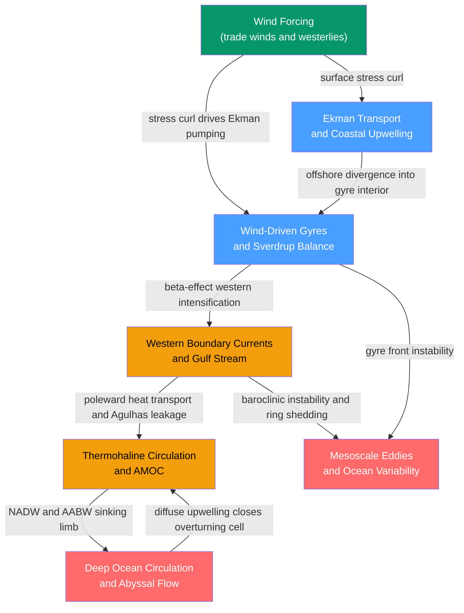

# 🗺️ Ocean Circulation — Section MOC

> [!info] How to use this map
> Start with **Ekman Transport**, follow the arrows through the surface layer into the gyre and boundary-current layer, then descend into the thermohaline and abyssal branches. Use the Learning Path below as your guide through a first pass. Return to this map whenever you lose the thread between notes.
> Each node links directly to a full note. Blue nodes are fundamental entry points; red nodes are advanced treatments.

---

## Overview

Ocean circulation divides into two interlocking systems. The **wind-driven circulation** operates in the upper ~1–2 km: trade winds and westerlies curl the surface layer into five subtropical gyres via Sverdrup balance, then concentrate the return flows into narrow western boundary currents (Gulf Stream, Kuroshio, Agulhas) that carry enormous quantities of heat poleward and shed mesoscale eddies containing roughly ten times the kinetic energy of the mean flow. The **thermohaline (density-driven) circulation** operates on the remaining ~4 km of the water column: surface cooling and brine rejection at high latitudes produce North Atlantic Deep Water and Antarctic Bottom Water, which spread through the abyss for centuries before diffuse upwelling returns them to the surface, completing a global overturning whose Atlantic branch (AMOC) is being carefully monitored for signs of anthropogenic weakening. These two systems are not independent — western boundary currents supply warm, salty water to NADW formation sites, and Ekman-driven upwelling in the Southern Ocean is now understood as the dominant return path for deep water — making ocean circulation one of the most tightly coupled systems in Earth's climate machinery.

---

## Concept Map

*(Green = external atmospheric driver, Blue = fundamental surface-layer mechanics, Orange = intermediate gyre and overturning dynamics, Red = advanced deep and mesoscale topics; arrows indicate "leads to" or "requires")*

---

## Learning Path

*Recommended order for a first pass through this topic:*

1. [[Ekman_Transport_and_Coastal_Upwelling]] — Start here: the Coriolis-mediated Ekman spiral is the first link between atmospheric winds and ocean motion, and coastal upwelling provides the most tangible real-world consequence. All other surface-layer dynamics build on Ekman transport and Ekman pumping.

2. [[Wind_Driven_Circulation_and_Sverdrup_Balance]] — Extends Ekman pumping to the basin scale: Sverdrup balance (βV = curl τ/ρ) explains the interior gyre structure, and the Stommel/Munk models show why the same physics that creates broad sluggish eastern gyres forces all the return transport into a narrow western jet.

3. [[Western_Boundary_Currents_and_Gulf_Stream]] — Applies the preceding theory to observed jets: the Gulf Stream, Kuroshio, Brazil Current, and Agulhas. Covers geostrophic balance, thermal wind structure, ring formation, Agulhas retroflection, and the crucial distinction between the wind-driven and AMOC-driven components of the Gulf Stream.

4. [[Thermohaline_Circulation_and_AMOC]] — Introduces the density-driven overturning independent of wind gyres: buoyancy flux, NADW and AABW formation, the RAPID array, Stommel's bistability model, and the current debate over AMOC tipping points. Builds on the heat-transport story established in note 3.

5. [[Deep_Ocean_Circulation_and_Abyssal_Flow]] — Descends to the ocean floor: Stommel-Arons theory (poleward interior flow + DWBC from uniform upwelling and the β-effect), Munk's abyssal recipes, passage hydraulics at Denmark Strait and the Samoan Passage, and the observed AABW warming and freshening under climate change.

6. [[Mesoscale_Eddies_and_Ocean_Variability]] — Concludes with the variability layered on top of the mean state: Rossby radius, baroclinic instability (Eady model), geostrophic turbulence, the inverse energy cascade, Rhines scale, and the Gent-McWilliams parameterisation. Best read after the WBC note because eddy energy is highest at western boundary current extension regions.

---

## All Notes in This Topic

| Note | Key Concept | Level Range |
|------|-------------|-------------|
| [[Ekman_Transport_and_Coastal_Upwelling]] | Ekman spiral directs net transport 90° to wind; coastal upwelling drives major fisheries (Peru-Humboldt, California, Benguela) | Beginner – Intermediate |
| [[Wind_Driven_Circulation_and_Sverdrup_Balance]] | βV = curl(τ)/ρ governs gyre interior; β-effect uniquely selects western side for intensified return current | Intermediate |
| [[Western_Boundary_Currents_and_Gulf_Stream]] | Gulf Stream and kin carry 20–150 Sv and ~1.3 PW poleward; ring shedding is primary lateral mixing mechanism at the jet | Intermediate – Advanced |
| [[Thermohaline_Circulation_and_AMOC]] | Density-driven ~17 Sv AMOC measured by RAPID since 2004; Stommel (1961) bistability; CMIP6 projects ~25% weakening by 2100 | Intermediate – Advanced |
| [[Deep_Ocean_Circulation_and_Abyssal_Flow]] | Stommel-Arons poleward interior flow and DWBC from uniform upwelling; NADW/AABW pathways; 300–1200 yr transit times | Advanced |
| [[Mesoscale_Eddies_and_Ocean_Variability]] | ~300,000 eddies at any instant carry 10× more KE than mean flow; baroclinic instability, Rossby radius, inverse energy cascade | Advanced |

---

## Key Questions This Topic Answers

- Why does wind drive the ocean into large rotating gyres rather than simply pushing water downwind?
- What causes the Gulf Stream to be narrow and intensely fast while the Canary and California Currents are broad and slow — and why must this asymmetry occur on the western side specifically?
- How does the ocean circulate independently of wind, and what role do temperature and salinity play in creating a global overturning that persists for thousands of years?
- What is the AMOC, how is it measured, why might it weaken or tip under anthropogenic warming, and what are the consequences for European climate?
- How does deep water form, navigate the abyss at centimetres per day, and eventually return to the surface — and what does the Stommel-Arons theory predict about where that flow must be concentrated?
- Why do mesoscale eddies dominate the ocean's kinetic energy budget, and how do they transport heat, salt, and carbon in ways that the mean circulation cannot?

---

## Connections to Other Topics

- [[_MOC_Oceanography_Master]] — parent vault entry point; Ocean Circulation is section 02 of the Oceanography vault and feeds into every other section from water masses to marine biology
- [[_MOC_Physics_Master]] — rotating-frame mechanics (Coriolis, β-plane), fluid statics (buoyancy, equation of state), and thermodynamics (heat flux, buoyancy flux) are the physical substrate of all circulation theory
- [[_MOC_Meteorology_Master]] — the trade winds, westerlies, and subtropical highs that force the gyres are products of the general atmospheric circulation; ENSO modulates Ekman upwelling and gyre transport on interannual timescales

---

#MOC #Oceanography #OceanCirculation
