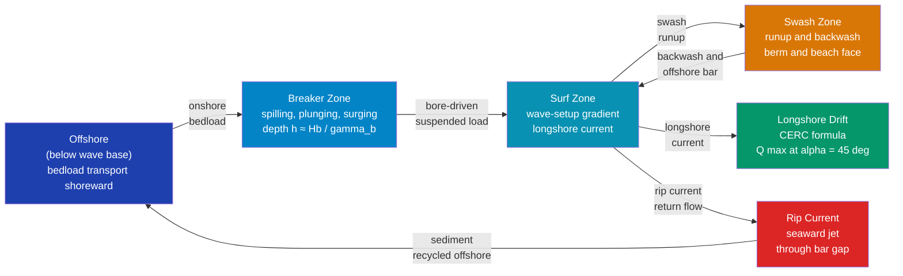

# Beach Processes and Sediment Transport

> [!abstract] TL;DR
> Beaches are not static landforms — they are dynamic sediment stores maintained by a continuous balance between wave energy inputs and sediment transport outputs. Waves shoal and break, imparting momentum to the water column that drives both onshore–offshore sediment exchange and the longshore drift that redistributes sand along the coast. The threshold of sediment motion is quantified by the **Shields parameter** θ (the ratio of bed shear stress to the submerged weight of a sediment grain), while the **CERC formula** links the volumetric longshore transport rate directly to breaking wave height and breaker angle. Beaches adopt a concave **equilibrium profile** (Dean's 2/3-power law) as a time-averaged response to wave energy, and sea-level rise drives systematic landward shoreline retreat predicted by the **Bruun Rule**. Understanding these processes is essential for coastal engineering, beach nourishment design, and managing shoreline response to climate change.

---

## Intuition

**Analogy:** Think of the beach as a river of sand. Waves are the engine that keeps this river flowing: each wave breaking at an angle pushes a wedge of swash diagonally up the beach face, while backwash returns straight down the slope under gravity. Every grain of sand zig-zags slightly downdrift with each successive wave — a thousand repetitions per day add up to enormous volumes of sediment traveling along the coast, just as countless tributaries build a river. Where the sand river encounters an obstacle — a headland, a harbour breakwater, or a groyne field — the sand drops out of transport and accumulates on the upstream side while the beach downstream starves. Remove the river's source (by damming the rivers that once delivered sand to the sea) and the beach retreats.

That "river of sand" framing connects directly to the **sediment budget**: a beach persists only when inputs of sand equal outputs. The Shields parameter is the on/off switch — it tells you whether the bed shear stress from breaking waves or currents is strong enough to move sediment at all. The CERC formula is the flow-rate gauge — once motion starts, it predicts how much moves and in which direction. Sea-level rise is the slow tilt of the entire system, forcing the budget perpetually into deficit.

---

## How It Works

### Shields Parameter and Initiation of Motion

For a grain of diameter $d$ lying on the seabed, the dimensionless **Shields parameter** compares the destabilising bed shear stress $\tau_b$ to the stabilising submerged weight per unit bed area:

$$\boxed{\theta = \frac{\tau_b}{(\rho_s - \rho)\,g\,d}}$$

where $\rho_s \approx 2650\text{ kg m}^{-3}$ is the sediment density, $\rho \approx 1025\text{ kg m}^{-3}$ is seawater density, and $g = 9.81\text{ m s}^{-2}$. Sediment begins to move when $\theta$ exceeds the **critical Shields parameter** $\theta_{cr}$. For sand in the hydraulically rough regime (particle Reynolds number $\text{Re}_* > 70$), $\theta_{cr} \approx 0.05$–$0.06$ — a value remarkably stable across grain sizes from fine sand to gravel.

Once in motion, transport splits into two modes:
- **Bedload** — grains rolling, sliding, and saltating within one to two grain diameters of the bed. Dominates for coarser sediment ($d > 0.5\text{ mm}$) or near the threshold of motion.
- **Suspended load** — grains lifted into the water column by turbulent eddies, transported at the fluid velocity, and settling out when turbulence wanes. Dominates in the energetic surf zone where wave bores generate intense turbulence.

### CERC Longshore Sediment Transport Formula

Waves arriving at a non-zero breaker angle $\alpha_b$ carry a longshore component of energy flux at the breakpoint:

$$P_{ls} = \frac{\rho\,g^{3/2}}{16\,\sqrt{\gamma_b}}\;H_b^{5/2}\,\sin(2\alpha_b)$$

where $H_b$ is the breaking wave height and $\gamma_b = H_b/d_b \approx 0.78$ is the breaker index. The US Army Corps of Engineers' **CERC (Coastal Engineering Research Center) formula** then gives the volumetric longshore sediment transport rate:

$$\boxed{Q = \frac{K\,\rho\,g^{1/2}}{16\,\sqrt{\gamma_b}\,(\rho_s - \rho)(1-n)}\;H_b^{5/2}\,\sin(2\alpha_b)}$$

with empirical coefficient $K \approx 0.77$ and sediment porosity $n \approx 0.4$. Two critical insights follow immediately:

1. Transport scales as $H_b^{5/2}$: doubling wave height increases transport by a factor of $2^{2.5} \approx 5.7$. Storm events dominate the annual sediment budget.
2. Transport is maximised when $\sin(2\alpha_b) = 1$, i.e. $\alpha_b = 45°$. It vanishes for shore-normal ($\alpha_b = 0°$) and shore-parallel ($\alpha_b = 90°$) waves.

### Surf Zone Dynamics and Breaker Classification

The **surf similarity (Iribarren) parameter** $\xi$ characterises breaker type from the beach face slope $\tan\beta$ and the deepwater wave steepness:

$$\xi = \frac{\tan\beta}{\sqrt{H_0 / L_0}}$$

| $\xi$ range | Breaker type | Characteristics |
|-------------|--------------|-----------------|
| $\xi < 0.4$ | **Spilling** | Gentle beaches; foam cascades gradually down the wave front |
| $0.4 < \xi < 2.0$ | **Plunging** | Steep, curling crest crashes violently; highest turbulence and suspended load |
| $\xi > 2.0$ | **Surging** | Very steep beaches; wave face surges up without fully breaking |

Plunging breakers are most effective at stirring sediment into suspension; spilling breakers generate the gentlest wave setup gradient and thus the weakest longshore current.

### Rip Currents

**Wave setup** — the super-elevation of the mean water surface in the surf zone due to radiation stress — is not uniform along a beach. Where waves are larger (e.g., between two sandbars), setup is higher; where waves are smaller (over a gap in the bar), setup is lower. This lateral gradient drives a **feeder current** that converges in the gap and shoots seaward as a narrow, energetic **rip current**. Rip speeds of 0.5–2.5 m s$^{-1}$ — faster than most swimmers — make rip currents the leading cause of beach drownings. They also export sediment offshore, particularly during storms.

The rip circulation cell consists of:
1. **Feeder channels** — longshore currents flowing toward the rip neck from both sides
2. **Rip neck** — the narrow, fast seaward jet (width ~5–20 m, length ~50–300 m)
3. **Rip head** — the diffuse, decelerating plume beyond the breaker zone

### Dean Equilibrium Beach Profile

Under a stationary wave climate, a sandy beach adopts a concave **equilibrium profile** that balances the onshore thrust of breaking waves against gravity-driven offshore return flow. Dean (1977) showed that the equilibrium depth $h$ as a function of cross-shore distance $x$ from the shoreline follows:

$$\boxed{h(x) = A\,x^{2/3}}$$

where the **sediment scale parameter** $A$ (units m$^{1/3}$) depends on grain size — increasing with coarser sediment as steeper profiles can be sustained. For $D_{50} = 0.25\text{ mm}$ (fine sand), $A \approx 0.10\text{ m}^{1/3}$; for $D_{50} = 0.5\text{ mm}$, $A \approx 0.14\text{ m}^{1/3}$.

The profile has an outer **closure depth** $h_*$ — roughly the depth of effective wave action — below which the seabed is not actively moved by typical wave conditions. For a 10-year wave climate, $h_* \approx 5$–$10\text{ m}$ for moderate-energy beaches.

### Bruun Rule for Sea-Level Rise

Raising sea level by $\Delta S$ shifts the equilibrium profile bodily landward and upward to restore the same water depth over the beach. The predicted shoreline retreat is the **Bruun Rule**:

$$\Delta x = \frac{\Delta S \cdot L}{B + h_*}$$

where $L$ is the active profile width (shoreline to closure depth), $B$ is the berm height above mean sea level, and $h_*$ is the closure depth. For a typical sandy beach with $L = 500\text{ m}$, $B = 1.5\text{ m}$, $h_* = 6\text{ m}$: a 0.5 m sea-level rise causes $\Delta x \approx 33\text{ m}$ of shoreline retreat.

### Mermaid Diagram — Beach Cross-Section with Sediment Transport



---

## Key Concepts / Details

### Secondary Level

**Waves carry sand along the coast.** When a wave breaks at an angle to the shore, its swash rushes up the beach diagonally and backwash returns straight down-slope. Every grain of sand makes a zig-zag journey along the shore — this is **longshore drift**. Over a year, millions of cubic metres of sand move like a conveyor belt, supplying beaches downdrift and removing sand from beaches updrift.

**Groynes trap but do not create sand.** A groyne (a low wall built perpendicular to the shore) intercepts longshore drift, causing sand to accumulate on its updrift face. The beach there widens. But sand that would have continued past is now trapped: the downdrift beach loses its supply and erodes. Groynes relocate a problem; they do not add sand to the system.

**Rip currents pull swimmers seaward.** A rip current forms when water piled up in the surf zone finds a gap in the sandbar and escapes seaward in a narrow, fast jet. Rip currents are responsible for the majority of surf beach drownings worldwide. The survival strategy is to swim parallel to shore to escape the narrow jet, rather than exhausting yourself fighting it head-on.

**Cliffs erode at their base.** On rocky coasts, waves concentrate energy at a notch near the waterline, undercutting the cliff until the overhang collapses. The debris is ground away by wave action into sand and gravel that may feed a local beach or be dispersed along the coast. Cliff retreat rates range from millimetres per year in resistant granite to metres per year in soft chalk or clay.

**Beaches shrink as sea level rises.** The Bruun Rule shows that a rising sea level forces the beach profile to shift landward. For every 1 metre of sea-level rise, a typical sandy beach retreats roughly 50–100 metres inland (depending on its geometry). Without sufficient sand supply to compensate, developed shorelines face increasing loss of beach and property.

---

### Undergraduate Level

**Shields parameter and the threshold curve.** The critical Shields parameter $\theta_{cr}$ is not truly constant — it depends weakly on the particle Reynolds number $\text{Re}_* = u_* d / \nu$ (with $u_* = \sqrt{\tau_b/\rho}$ the friction velocity). The empirical **Shields curve** (Shields 1936; Soulsby 1997) traces $\theta_{cr}$ as a function of the dimensionless grain size $D_* = d[(s-1)g/\nu^2]^{1/3}$ where $s = \rho_s/\rho$ and $\nu$ is kinematic viscosity. For $D_* > 10$ (medium sand and coarser in sea water), $\theta_{cr} \approx 0.056$. Once $\theta > \theta_{cr}$, bedload transport rate can be estimated by the Meyer-Peter & Müller formula: $q_b = 8((\theta - \theta_{cr})^{3/2})\sqrt{(s-1)g\,d^3}$.

**CERC formula derivation.** The longshore energy flux at the breaker line is the wave energy density times group velocity times the longshore projection factor:

$$P_{ls} = E\,C_g\,\sin\alpha_b\cos\alpha_b = \tfrac{1}{8}\rho g H_b^2 \cdot \sqrt{g\,d_b}\cdot\sin\alpha_b\cos\alpha_b$$

Substituting the breaker condition $d_b = H_b/\gamma_b$ and using $\sin\alpha_b\cos\alpha_b = \tfrac{1}{2}\sin(2\alpha_b)$ recovers the $H_b^{5/2}$ dependence. The volumetric transport $Q$ follows by dividing the immersed weight transport rate $I_{ls} = K P_{ls}$ by the submerged unit weight of sediment $(\rho_s - \rho)g(1-n)$.

**Surf similarity and breaker type.** The Iribarren number $\xi = \tan\beta / (H_0/L_0)^{1/2}$ links the beach slope to wave steepness and predicts breaker morphology. It also controls **swash excursion**: large $\xi$ (steep beaches, low steepness) produces long swash runup and intense bore–sediment interaction on the beach face, driving a **reflective** beach state. Low $\xi$ (gentle beaches, steep waves) gives a **dissipative** state dominated by energy dissipation across a wide surf zone. The intermediate states include the crescentic bar systems associated with regular rip current spacing.

**Beach nourishment design.** Nourishment (pumping dredged sand onto an eroding beach) must account for the fact that imported sediment of a different grain size will adopt a different equilibrium profile. Coarser nourishment sand ($A_n > A_{native}$) builds a steeper, narrower profile and loses volume more slowly to the surf zone; it provides longer nourishment life. Design volume must include overfill — the extra sand placed above the equilibrium profile — that erodes away to feed the system until a new equilibrium is reached. The overfill ratio $R$ depends on grain size mismatch between native and nourishment sediment.

---

### Graduate Level

**Morphodynamic feedback.** The beach is not a passive recipient of wave energy — its topography feeds back on the hydrodynamics. Shoaling over a sandbar focuses wave breaking, generating wave setup and a rip channel. The rip channel deepens, concentrating the rip flow, which scours the channel further. Conversely, in the absence of rip-forcing, longshore currents redistribute sediment, fill the channel, and rebuild the bar. This **morphodynamic coupling** — the mutual dependence of morphology and hydrodynamics — produces complex, self-organising coastal landforms including transverse bars, crescentic bars, beach cusps, and shore-oblique sand ridges. The characteristic timescale of morphodynamic adjustment scales with the "morphological acceleration factor" used in process-based models.

**XBEACH and process-based modelling.** The open-source **XBeach** model (Roelvink et al. 2009) is the community standard for storm-impact modelling on sandy beaches. It couples short-wave energy propagation (action balance, with roller energy), infragravity wave dynamics (bound and free long waves), depth-averaged flow (shallow-water equations with radiation stresses), sediment transport (bedload + suspended with Shields-based formulation), and morphological updating via an explicit bed-level change equation. The model resolves storm-scale dune erosion, overwash, and inlet breaching on timescales from hours to days. For seasonal-to-decadal scales, reduced-complexity one-line models (e.g., GENESIS) or equilibrium-based models track shoreline position using the CERC formula under a time-varying wave climate.

**Swash oscillations and infragravity waves.** In the swash zone, run-up is dominated not by the incident swell but by low-frequency **infragravity waves** (periods 25–250 s) generated by the groupiness of the incident wave field. These long waves cause oscillatory swash that can exceed 10 m in amplitude on dissipative beaches, controlling beach profile shape at the shoreline. Swash oscillation also pumps water through the beach face, driving **pore-pressure gradients** that liquefy the upper beach face during rundown and enhance landward sediment transport during runup — a process central to berm accretion.

**Climate change and coastal resilience.** Under RCP8.5 projections, mean sea level may rise 0.6–1.1 m by 2100, with significant uncertainty from ice-sheet instabilities. Applying the Bruun Rule globally, Vousdoukas et al. (2020) projected that ~49% of sandy beaches worldwide could effectively disappear by 2100 without intervention. However, the Bruun Rule is a zero-dimensional approximation: it assumes sediment conservation, an ideally shaped profile, and no longshore gradients. Real beaches also face changes in storminess (wave height and direction), river sediment supply, and human alteration. **Coastal resilience** assessment requires integrated sediment budget analysis across the littoral cell, probabilistic storm-impact modelling, and adaptive nourishment strategies — possibly including nature-based solutions such as dune restoration, reef creation, and the Netherlands-style mega-nourishment (Sand Motor) that harnesses longshore processes to self-distribute nourishment sand over decadal timescales.

---

## Python Demo

```python
# Beach Processes: CERC longshore transport and Dean equilibrium profile
# Demonstrates: (1) Q_ls vs breaker angle for 3 wave heights, peak at 45 deg
#               (2) Dean equilibrium cross-shore profile h(x) = A * x^(2/3)

import numpy as np
import matplotlib.pyplot as plt

# ---- Physical constants and sediment parameters ----
g = 9.81          # gravitational acceleration [m/s^2]
rho = 1025.0      # seawater density [kg/m^3]
rho_s = 2650.0    # quartz sand density [kg/m^3]
n = 0.4           # sediment porosity (void fraction)
gamma_b = 0.78    # breaker index: Hb / depth_at_breaking
K_CERC = 0.77     # dimensionless CERC empirical coefficient

# Lumped CERC coefficient for Q [m^3/s]:
# Q = C_CERC * H_b^(5/2) * sin(2 * alpha_b)
# Derived from:
#   P_ls = (rho * g^(3/2) / (16 * sqrt(gamma_b))) * H_b^(5/2) * sin(2*alpha_b)  [W/m]
#   Q    = K * P_ls / ((rho_s - rho) * g * (1 - n))                              [m^3/s]
# => C_CERC = K * rho * sqrt(g) / (16 * sqrt(gamma_b) * (rho_s - rho) * (1 - n))
C_CERC = (K_CERC * rho * np.sqrt(g)) / (16.0 * np.sqrt(gamma_b) * (rho_s - rho) * (1 - n))

# ---- Plot 1: Longshore sediment transport vs breaker angle ----
alpha_deg = np.linspace(0, 90, 500)
alpha_rad = np.radians(alpha_deg)

fig, axes = plt.subplots(1, 2, figsize=(13, 5))

ax = axes[0]
wave_heights = [1.0, 2.0, 3.0]
colors = ['#3b82f6', '#f59e0b', '#ef4444']
for H_b, color in zip(wave_heights, colors):
    Q_m3s = C_CERC * H_b**2.5 * np.sin(2 * alpha_rad)
    Q_Myr = Q_m3s * 3600 * 24 * 365.25 / 1e6   # convert m^3/s -> million m^3/yr
    ax.plot(alpha_deg, Q_Myr, lw=2.2, color=color, label=f"$H_b$ = {H_b:.0f} m")

ax.axvline(45, color='k', ls='--', lw=1.2, label='Peak transport at 45°')
ax.set_xlabel('Breaker angle α (degrees)', fontsize=11)
ax.set_ylabel('Longshore transport Q (million m³/yr)', fontsize=11)
ax.set_title('CERC Longshore Sediment Transport\nvs Breaker Angle', fontsize=11)
ax.legend(fontsize=9)
ax.grid(alpha=0.3)
ax.set_xlim(0, 90)
ax.set_ylim(bottom=0)

# Print peak values for each wave height
print("CERC Transport — peak Q at alpha = 45 deg:")
print(f"{'H_b (m)':<10}{'Q_peak (m^3/s)':<20}{'Q_peak (M m^3/yr)':<20}")
for H_b in wave_heights:
    Q_peak = C_CERC * H_b**2.5   # sin(90 deg) = 1
    print(f"{H_b:<10.1f}{Q_peak:<20.4f}{Q_peak * 3.156e7 / 1e6:<20.2f}")

# ---- Plot 2: Dean equilibrium beach profile h(x) = A * x^(2/3) ----
# A ~ 0.10 m^(1/3) for D_50 = 0.25 mm fine sand (Dean 1977 / Dean & Dalrymple 2002)
D50_mm = 0.25          # median grain diameter [mm]
A_Dean = 0.10          # sediment scale parameter [m^(1/3)]

x = np.linspace(0.1, 500, 1000)   # cross-shore distance from shoreline [m]
h = A_Dean * x**(2.0 / 3.0)       # equilibrium depth [m]

ax2 = axes[1]
ax2.plot(x, h, 'b-', lw=2.5, label=f'$h = A x^{{2/3}}$,  $A$ = {A_Dean} m$^{{1/3}}$')
ax2.fill_between(x, 0, h, alpha=0.15, color='royalblue', label='Water column')
ax2.fill_between(x, h, h.max() * 1.15, alpha=0.25, color='tan', label='Seabed')

# Mark closure depth (e.g. h* = 6 m)
h_closure = 6.0
x_closure = (h_closure / A_Dean)**1.5
ax2.axhline(h_closure, color='darkgreen', ls='--', lw=1.2,
            label=f'Closure depth $h_*$ = {h_closure:.0f} m  (x ≈ {x_closure:.0f} m)')
ax2.plot(x_closure, h_closure, 'go', ms=8)

ax2.set_xlabel('Cross-shore distance from shoreline x (m)', fontsize=11)
ax2.set_ylabel('Depth h (m)', fontsize=11)
ax2.set_title(f'Dean Equilibrium Beach Profile\n$D_{{50}}$ = {D50_mm} mm,  $A$ = {A_Dean} m$^{{1/3}}$',
              fontsize=11)
ax2.legend(fontsize=9)
ax2.grid(alpha=0.3)
ax2.invert_yaxis()   # depth increases downward

print(f"\nDean Profile depths:")
for x_pt in [50, 100, 200, 500]:
    print(f"  x = {x_pt:3d} m  ->  h = {A_Dean * x_pt**(2/3):.2f} m")

plt.tight_layout()
plt.suptitle('Beach Processes: CERC Longshore Transport & Dean Equilibrium Profile', y=1.02)
plt.savefig('beach_processes.png', dpi=130, bbox_inches='tight')
plt.show()
```

**Expected output (key values):**

| $H_b$ (m) | $Q_{peak}$ (m³ s⁻¹) | $Q_{peak}$ (M m³ yr⁻¹) |
|------------|----------------------|------------------------|
| 1.0 | 0.18 | 5.6 |
| 2.0 | 1.02 | 32 |
| 3.0 | 2.80 | 88 |

The 2 m, 45° wave result (~32 million m³ yr⁻¹) is comparable to measured longshore transport rates on high-energy beaches such as the southern California coast (~1–2 million m³ yr⁻¹ at lower typical breaker angles). The Dean profile reaches 6 m closure depth at ~270 m from the shoreline for 0.25 mm sand.

---

## Real-World Notes

**Miami Beach — the original mega-nourishment.** Miami Beach was nearly completely eroded by the 1970s. Starting in 1976, the US Army Corps of Engineers pumped approximately 14 million m³ of sand dredged from offshore shoals, restoring the beach to a 300 m width. Periodic re-nourishment cycles have continued, totalling over 300 million m³ of sand placed by 2020. Miami Beach is the world's most intensively nourished shoreline and a test case for how indefinite nourishment can sustain an urban beachfront under ongoing sea-level rise.

**California coastal erosion from river damming.** Southern California rivers — the Santa Clara, the Ventura, the San Gabriel — once delivered millions of cubic metres of sand to the coast each year. Since the 1940s–60s, dam construction blocked this supply almost entirely. The result is a sediment-starved coast: beaches along Santa Barbara and Ventura Counties have narrowed by 30–100% and some have disappeared entirely. California's beach crisis is a textbook demonstration that the river-to-coast sediment cascade is one connected system.

**Storm-driven beach flattening and recovery.** During major storms, plunging breakers rapidly erode the subaerial beach — removing the berm and depositing sand offshore as a storm bar. After the storm, lower, longer-period swell gradually drives the offshore bar back onshore through constructive swash action, restoring the pre-storm profile over weeks to months (or years after extreme events). This "cut-and-fill" cycle is the normal life of a beach; management interventions become problematic only when the recovery timescale exceeds the interval between storms.

**The Netherlands Sand Engine (Zandmotor).** In 2011, the Dutch built a 21.5 million m³ sand peninsula (hook-shaped, ~1 km offshore) on the South Holland coast — the "Sand Motor" or Zandmotor. Rather than repeatedly re-nourishing individual beach sections, the concept allows longshore drift and storm waves to gradually distribute the sand along ~20 km of coast over 20 years. Early monitoring confirms the sand is dispersing as predicted. The project represents a paradigm shift from "fighting the coast" to "feeding the coast."

**Tuvalu and Maldives — existential stakes.** These low-lying Pacific and Indian Ocean atoll nations sit at mean elevations of 1–2 m above sea level. Local sea-level rise (compounded by subsidence) already causes increased overwash, salinisation of freshwater lenses, and loss of beach area. Under the Bruun Rule, even modest sea-level rise of 0.3–0.5 m could eliminate significant fractions of their beach land area — not just the beach, but the entire land surface of some islands. The physical processes studied in coastal morphodynamics translate here into questions of national survival and climate justice.

---

## Common Pitfalls

- **Believing groynes "create" sand.** A groyne traps sediment that was already in longshore transport. It creates no new sand; it simply diverts the sand that would have passed to beaches further downdrift. Installing a groyne field to widen one beach section guarantees erosion of the next beach section downdrift — the classic "rob Peter to pay Paul" error in coastal engineering.

- **Assuming beaches naturally recover from storms without a sediment supply.** The "cut-and-fill" beach cycle (storm erosion followed by swell recovery) works only when there is sufficient offshore sand in the system to rebuild the berm. If the sediment budget is negative — because longshore drift is blocked, the river supply is dammed, or previous storms removed material to water depths beyond the closure depth — a beach may not recover between storms and will show a ratchet-like net retreat.

- **Treating the Bruun Rule as precise.** The Bruun Rule is a one-dimensional, steady-state, sediment-conserving model. Real beaches violate most of these assumptions: they have longshore gradients, exchange sediment with estuaries and dunes, respond differently depending on wave climate and storm sequencing, and may be dominated by vertical land motion rather than eustatic sea level. The Rule provides a useful order-of-magnitude estimate and a physical framework, but quantitative predictions require fully coupled morphodynamic models (XBeach, Delft3D) calibrated to local conditions.

- **Conflating breaker angle and wave incidence angle.** The angle $\alpha_b$ in the CERC formula is the angle between the breaking wave crest and the shoreline, not the deep-water wave direction. Refraction can dramatically reduce the breaker angle from the deep-water incidence angle — particularly near headlands and in embayments — and failing to account for refraction will significantly overestimate longshore transport.

- **Ignoring infragravity waves in swash dynamics.** On dissipative beaches, the swash zone is dominated by infragravity waves at periods of 30–300 s, not by incident swell. Using incident wave parameters alone to model swash excursion and sediment flux on the beach face will underestimate both runup height and sediment mobilisation during storms.

---

## Related Concepts

### Same Vault

- [[Surface_Gravity_Waves]] — the wave mechanics (shoaling, refraction, group velocity) that set the wave conditions entering the surf zone and driving all beach processes
- [[Tsunamis_and_Storm_Surges]] — extreme water-level events that reset beach morphology over minutes to hours, far beyond the equilibrium cycle
- [[Coastal_Circulation_and_Estuaries]] — the coastal ocean circulation context within which longshore currents, rip currents, and inlet flows are embedded
- [[Sea_Level_Rise_and_Ocean_Mass_Change]] — the long-term forcing driving the Bruun Rule shoreline retreat and threatening beach existence globally
- [[_MOC_Waves_Tides_Coastal]] — section map of waves, tides, and coastal dynamics notes in this vault

### Cross-Vault

- [[Coastal_Processes_and_Landforms]] — the Earth Science perspective on the same processes: cliffs, spits, barriers, and the sediment budget in a geological context
- [[Wave_Motion_and_Properties]] — dispersion relation, energy flux, group velocity, and Snell's Law refraction underpinning the CERC derivation
- [[Weathering_and_Soils]] — produces and characterises the terrigenous sediment that river systems deliver to the coast as the primary sand supply
- [[Mass_Wasting_and_Slope_Stability]] — cliff failure and coastal landslides are wave-triggered events that feed coarse sediment directly to the beach
- [[_MOC_Physics_Master]] — entry point for fluid mechanics, wave mechanics, and dimensional analysis relevant to the Shields parameter and CERC formula
- [[_MOC_Earth_Science_Master]] — entry point for geomorphology and surface processes, linking beach dynamics to the broader Earth surface system

---

## Review Questions

### Secondary Level

1. Explain why a groyne widens the beach on its updrift side but causes erosion on its downdrift side. Use the concept of longshore drift in your answer.
2. You are swimming at a beach and notice a darker-coloured, calmer patch of water cutting through the surf zone and extending beyond the breakers. What is this feature, what causes it, and what should you do if you find yourself caught in it?
3. A river flowing into the sea is dammed 50 km inland. Using the sediment budget concept, predict what will happen to the beaches near the river mouth over the next 50 years, and explain why.

### Undergraduate Level

1. A beach has a slope of 1:20 and is exposed to swell waves with deepwater height $H_0 = 1.5\text{ m}$ and wavelength $L_0 = 100\text{ m}$. Compute the Iribarren number $\xi$ and classify the expected breaker type. Then estimate the longshore transport rate $Q$ using the CERC formula if the breaker angle is 20°, $H_b \approx 1.2\text{ m}$, and $K = 0.77$.
2. The Dean equilibrium profile for a nourished beach uses sand of $D_{50} = 0.50\text{ mm}$ ($A = 0.14\text{ m}^{1/3}$) on a native beach of $D_{50} = 0.20\text{ mm}$ ($A = 0.085\text{ m}^{1/3}$). Which profile is steeper? Explain how the profile mismatch between nourished and native sediment affects the overfill volume required and the nourishment lifespan.
3. Apply the Bruun Rule to a beach with berm height $B = 2\text{ m}$, closure depth $h_* = 8\text{ m}$, and active profile width $L = 600\text{ m}$. How far does the shoreline retreat for $\Delta S = 0.4\text{ m}$ of sea-level rise? Discuss two reasons why this estimate may be unreliable for a real embayed beach.

### Graduate Level

1. The CERC formula gives volumetric transport $Q \propto H_b^{5/2}\sin(2\alpha_b)$. Starting from the wave energy flux at the breaker line, derive this expression dimensionally and explain why the longshore energy flux component — rather than the total wave energy — is the relevant forcing. How would the formula change if the breaker index $\gamma_b$ were doubled?
2. During storm conditions, XBeach simulates a rapid offshore bar migration from 1.5 m to 4 m water depth. Explain the morphodynamic feedback mechanism driving this migration, referencing wave setup gradients, rip current formation, and sediment transport. What happens to the bar after the storm when swell conditions resume?
3. Sea-level rise of 0.5 m is projected by 2100 for a West African barrier island with $L = 800\text{ m}$, $B = 1.5\text{ m}$, and $h_* = 6\text{ m}$. The island is backed by a lagoon (no dune reservoir). Using the Bruun Rule, estimate shoreline retreat. Then discuss why the actual retreat will likely be larger, referencing (a) storm intensification under climate change, (b) sediment loss to the lagoon during overwash, and (c) the absence of a dune sediment reservoir.

---

## Sources

- [Komar, P. D. (1998) — *Beach Processes and Sedimentation*, 2nd ed. Prentice Hall, Upper Saddle River, NJ.](https://www.pearson.com/en-us/subject-catalog/p/beach-processes-and-sedimentation/P100000384559)
- [Dean, R. G. & Dalrymple, R. A. (2002) — *Coastal Processes with Engineering Applications*. Cambridge University Press, Cambridge.](https://doi.org/10.1017/CBO9780511754500)
- [U.S. Army Corps of Engineers (1984) — *Shore Protection Manual*, 4th ed. Coastal Engineering Research Center, Vicksburg, MS.](https://usace.contentdm.oclc.org/digital/collection/p16021coll11/id/1934)
- [Dean, R. G. (1977) — Equilibrium beach profiles: U.S. Atlantic and Gulf Coasts. *Ocean Engineering Technical Report No. 12*, University of Delaware, Newark.](https://www.ce.udel.edu/coastal/pubs/Dean1977.pdf)
- [Roelvink, D., Reniers, A., van Dongeren, A., van Thiel de Vries, J., McCall, R. & Lescinski, J. (2009) — Modelling storm impacts on beaches, dunes and barrier islands. *Coastal Engineering*, 56(11–12), 1133–1152.](https://doi.org/10.1016/j.coastaleng.2009.08.006)
- [Vousdoukas, M. I., Ranasinghe, R., Mentaschi, L., Plomaritis, T. A., Athanasiou, P., Luijendijk, A. & Feyen, L. (2020) — Sandy coastlines under threat of erosion. *Nature Climate Change*, 10, 260–263.](https://doi.org/10.1038/s41558-020-0697-0)

---

#Oceanography #WavesTidesCoastal #BeachProcesses #SedimentTransport
