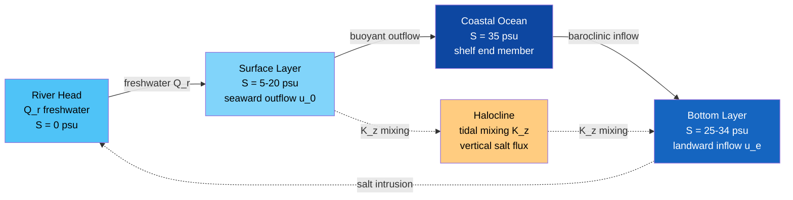

# Coastal Circulation and Estuaries

> [!abstract] TL;DR
> An estuary is the semi-enclosed coastal body of water where a river meets the sea, creating a salinity gradient from nearly fresh at the head to oceanic at the mouth. The competition between the river's freshwater outflow and oceanic tidal mixing determines whether an estuary is salt-wedge stratified, partially mixed, or well-mixed — a classification formalised by the Hansen-Rattray (1966) diagram using two dimensionless parameters: stratification (ΔS/S̄) and circulation (u₀/u_f). Gravity-driven (baroclinic) exchange flow exports freshwater at the surface and imports salt water at depth, sustaining the salinity structure through the Knudsen salt balance. River plumes extend the estuary's influence onto the continental shelf, where Coriolis deflection and frontal dynamics shape coastal jets and inner/outer shelf circulation patterns.

---

## Intuition

**Analogy:** An estuary is where a river arm-wrestles the sea. Fresh water, being lighter, wants to float over the denser salt water like oil over vinegar — if the river wins decisively, you get a perfectly layered salt wedge with crisp freshwater sliding seaward over an almost undisturbed lens of ocean water. If the tides win by stirring vigorously every six hours, you get a uniformly brackish soup from surface to bottom. Most real estuaries occupy the contested middle ground, partially mixed, creating a brackish nursery zone that supports some of the world's most productive fisheries.

The same mixing balance determines the salinity field's shape: a strong river pushes salt intrusion back toward the mouth; a weak river lets salt creep far upstream, threatening drinking-water intakes and tidal wetlands. The Hansen-Rattray diagram is the compass that locates any given estuary on this stratification-circulation spectrum, using two numbers you can calculate from a single measured salinity profile.

---

## How It Works

### Core Mechanics

**1. Estuarine classification: the Hansen-Rattray diagram.** Hansen and Rattray (1966) characterised estuaries using two dimensionless ratios computed at a representative cross-section:

- **Stratification parameter** ΔS / S̄ — the top-to-bottom salinity difference divided by the depth-averaged mean salinity. High values (> 1) indicate a strongly stratified salt wedge; values near zero indicate a well-mixed water column.
- **Circulation parameter** u₀ / u_f — the net (tidal-average) surface outflow velocity divided by the freshwater velocity u_f = Q_r / A (river discharge divided by cross-sectional area). Large values indicate vigorous gravitational exchange; values near 1 indicate the river is barely differentiating the flow.

On log-log axes, diagonal isolines of δ (the fraction of upstream salt flux carried by tidal diffusion rather than gravitational advection) divide the diagram into estuary types: **Type 1a** (salt wedge, δ ≈ 0), **Type 1b** (highly stratified with some diffusion), **Type 2** (partially mixed, δ ~ 0.5, most temperate estuaries), **Type 3** (vertically homogeneous, δ ≈ 1), and **Type 4** (fjord-type with a freshwater cap over dense deep water).

**2. Salt-wedge (stratified) estuary.** When river discharge greatly exceeds tidal stirring, freshwater slides seaward as a fast, thin surface layer over an almost stagnant wedge of ocean water. The interface is sharp; Kelvin-Helmholtz shear instabilities provide the only significant cross-interface mixing. Salt intrusion length scales as:
$$L_i \propto \frac{g \Delta\rho \, H^3}{\rho \, u_f^2}$$
Strong rivers push the salt wedge toward the mouth; the Mississippi in spring flood is a canonical example.

**3. Partially mixed estuary.** Tidal currents turbulently diffuse salt across the halocline through a vertical eddy diffusivity K_z, softening the interface into a gradient. The steady-state salt balance drives **gravitational exchange flow**: net seaward flow at the surface, net landward flow near the bottom. Salt intrusion length for this regime scales as:
$$L_i \propto Q_r^{-1/3}$$
(MacCready 2004), arising from the cubic-root coupling between baroclinic pressure gradient, vertical mixing, and river forcing when tidal amplitude is held constant.

**4. Well-mixed estuary.** Strong tidal energy homogenises the water column vertically; salinity varies only along the estuary axis. The 1-D advection-diffusion steady-state balance gives an exponential profile:
$$S(x) = S_\text{ocean} \exp\!\left(-\frac{Q_r \, x}{A \, K_x}\right)$$
where x is distance from the ocean mouth and K_x is the longitudinal dispersion coefficient. Here L_i ∝ Q_r^{-1}, a steeper discharge dependence than the partially mixed case.

**5. Gravitational (baroclinic) exchange flow and Knudsen relations.** In any estuary with a horizontal salinity gradient, denser ocean water presses landward at depth against a weaker freshwater surface pressure head. The resulting two-layer exchange — outflow velocity u₀ at the surface, inflow velocity u_e at the bottom — is quantified at steady state by the **Knudsen relations** (1900):

- Volume balance: Q_out = Q_in + Q_f
- Salt balance: Q_out × S_out = Q_in × S_in (no internal salt sources)
- Solving: Q_in = Q_f × S_out / (S_in − S_out) and Q_out = Q_f × S_in / (S_in − S_out)

The exchange amplification Q_in / Q_f = S_out / (S_in − S_out) can be large (>> 1) when S_in ≈ S_out, meaning tides recirculate far more water than the river contributes.

**6. River plumes and shelf dynamics.** Beyond the estuary mouth, the buoyant freshwater outflow spreads onto the shelf as a river plume. The **Kelvin number** Ke = √(B h) / L_d (B = plume width, h = plume depth, L_d = √(g' h) / f = Rossby radius of deformation) determines structure: Ke > 1 means Coriolis deflection dominates and the plume attaches to the coast as a geostrophically balanced coastal jet; Ke < 1 means inertia allows offshore spreading. On the **inner shelf** (water depth comparable to the Ekman layer depth), bottom friction controls along-shelf flow; on the **outer shelf**, geostrophic balance structures cross-shelf density currents and wind-driven upwelling or downwelling cells.

### Flow / Architecture



---

## Key Concepts / Details

### Secondary Level

**Why estuaries are brackish.** Rivers deliver freshwater continuously while tides pump saltwater in from the sea. Because saltwater is denser (~1025 kg/m³) than freshwater (~1000 kg/m³), the two fluids do not simply homogenise — the saltwater sinks and the freshwater floats, creating a gradient from fresh at the surface and river head to salty at depth and the ocean mouth. This brackish zone (roughly 0.5–30 psu) is one of Earth's most ecologically important environments: protected, nutrient-rich, and connected to both terrestrial and marine food webs.

**Salt-wedge vs well-mixed extremes.** The Mississippi River in spring flood pushes so much freshwater downstream that ocean water is compressed into a thin, low wedge near the mouth — this is a salt-wedge estuary, almost perfectly layered, with a sharp halocline you can feel with your hand by dragging it through the water column. By contrast, the Thames estuary experiences an enormous tidal prism relative to river flow, stirring the water column continuously until there is almost no top-to-bottom salinity difference — a well-mixed estuary. Most populated estuaries fall between these poles.

**Ecological importance and eutrophication threat.** The stratified halocline traps nutrients delivered by rivers in the surface layer where sunlight drives photosynthesis, making estuaries 10–100× more productive per unit area than the adjacent continental shelf. Salmon, flounder, shrimp, and blue crab use estuaries as nursery habitat; filter feeders such as oysters and mussels process turbid estuarine water. But the same stratification that concentrates nutrients below the pycnocline in summer traps decomposing organic matter in oxygen-poor deep water, producing seasonal **hypoxic dead zones** when agricultural nutrient loads are excessive.

---

### Undergraduate Level

**Hansen-Rattray (1966) classification in practice.** To classify an estuary, take several salinity profiles across a transect during a tidal average, compute the depth-mean salinity S̄ and the top-to-bottom difference ΔS = S_bottom − S_top, and estimate the tidal-mean surface outflow u₀. Plot the point (ΔS/S̄, u₀/u_f) on the Hansen-Rattray diagram:

| Type | ΔS/S̄ | u₀/u_f | δ | Example |
|------|--------|---------|---|---------|
| 1a (salt wedge) | > 1 | ≈ 1 | ≈ 0 | Mississippi, Ebro |
| 1b (highly stratified) | > 1 | > 1 | < 0.5 | Columbia R. in winter |
| 2 (partially mixed) | 0.1–1 | 1–10 | ≈ 0.5 | Chesapeake, Thames |
| 3 (well-mixed) | < 0.1 | > 10 | ≈ 1 | Delaware Bay, Severn |
| 4 (fjord) | large | low | low | Norwegian fjords |

**Gravitational circulation velocity.** In a channel of depth H with a horizontal salinity gradient ∂S/∂x, the baroclinic pressure gradient drives exchange flow whose magnitude scales as:
$$u_e \sim \frac{g \beta (\partial S/\partial x) H^3}{48 \, \nu_z}$$
where β ≈ 7.4 × 10⁻⁴ (g/kg)⁻¹ is the haline contraction coefficient and ν_z is the vertical eddy viscosity. Higher tidal mixing increases ν_z, which *reduces* u_e — tides simultaneously increase mixing and suppress gravitational exchange, explaining why well-mixed estuaries have weak exchange flow despite large tidal prism.

**Tidal prism and flushing time.** The tidal prism V_T is the volume exchanged between estuary and ocean each half-tidal cycle. For a well-mixed estuary of volume V_e and river inflow Q_f, the flushing time is:
$$T_f = \frac{V_e \, \bar{S}}{Q_f \, S_\text{ocean}}$$
Chesapeake Bay has T_f ~ 90–180 days, meaning a pollutant introduced today persists for months. Delaware Bay's larger tidal prism relative to volume gives T_f ~ 30–40 days.

**Case studies.** Chesapeake Bay (Virginia/Maryland) is a classic Type 2 partially mixed estuary: Coriolis force deflects saltier bottom water toward the western (Virginia) shore and fresher surface water toward the eastern shore, creating lateral salinity gradients and secondary circulation that enhance mixing on the shoals. Summer stratification traps nutrients below the pycnocline, fuelling hypoxia over 40% of the bay's volume. Delaware Bay is more funnel-shaped and wind-exposed, producing stronger tidal mixing and predominantly well-mixed (Type 3) conditions.

---

### Graduate Level

**Total Exchange Flow (TEF, MacCready 2011).** Classical Knudsen relations use spatial cross-section averages, but tidal currents create complex interleaving of inflowing and outflowing water at different salinities within a single tidal cycle — the "tidal averaging problem." TEF resolves this by replacing space with salinity as the sorting coordinate: define q(s) = ⟨u B⟩_s as the tidal-average volume flux per unit salinity at salinity class s. Integrating q(s) over all salinity classes gives a clean decomposition into Q_in (inflow above exchange salinity s_x) and Q_out (outflow below s_x), free of tidal aliasing. TEF is now the standard diagnostic for analysing estuarine exchange flow in ocean model output, and s_x is physically interpretable as the salinity of peak dissipation in the mixing efficiency landscape.

**Estuarine turbulence and stratification-mixing transitions.** Vertical eddy diffusivity K_z in a partially mixed estuary is dominated by tidal shear and parameterised through a Richardson-number-dependent scheme: K_z ~ K_0 / (1 + α Ri)ⁿ where Ri = N² / (∂u/∂z)². The feedback loop is non-linear: higher river discharge → stronger horizontal density gradient → enhanced gravitational circulation → increased vertical shear → *but also* stronger stratification N² → suppressed K_z → reduced mixing → further increased N². This creates a bifurcation in estuary state: the same Q_r can sustain either a stratified or a well-mixed equilibrium, depending on initial conditions (hysteresis). The SIPS mechanism (strain-induced periodic stratification) adds a tidal-cycle dimension: ebbing tides increase shear and *destratify* the water column; flooding tides strain the horizontal salinity gradient and *restratify* it, generating periodically varying mixing conditions.

**River plume fronts and coastal current separation.** Beyond the estuary mouth, the near-field plume (~1–2 Rossby radii) is inertia-dominated; a surface density front (the "plume front") marks the interface between buoyant outflow and shelf water. Convergent flow at the front concentrates larvae, floating debris, and surface tracers. As the plume extends to the far field (> 3 Rossby radii), Coriolis deflection (rightward in the Northern Hemisphere) attaches the plume to the coast as a geostrophically balanced coastal current with a front on its offshore edge. The transition from near-field to far-field plume is described by the Froude number Fr = u_plume / √(g' h): supercritical near-field (Fr > 1) transitions to subcritical far-field (Fr < 1) through a hydraulic jump near the mouth.

**Estuarine response to sea-level rise.** Sea-level rise (SLR) increases tidal prism (deeper mean depth → larger tidal amplitude), which enhances mixing and pushes estuaries toward well-mixed conditions. Simultaneously, gravitational circulation scales as u_e ∝ H³, so a +0.5 m SLR on a shallow estuary (~5 m mean depth) increases H by 10% and u_e by ~33%, driving salt intrusion further landward. Model projections for microtidal estuaries like the Delaware and Columbia suggest L_i increases 5–20 km per metre of SLR, threatening municipal drinking-water intakes. In deltaic systems, SLR can also reduce the bed slope that drives river flow, further weakening freshwater forcing.

**Ocean acidification amplification in estuaries.** Open-ocean buffering against CO₂-driven acidification depends on carbonate alkalinity (A_T). Estuarine waters mix river runoff (low A_T, acidic due to organic acids and soil CO₂) with ocean water (high A_T), producing a brackish water column with significantly lower buffering capacity than either end member. Regional models project estuarine pH drops 2–3 times the global-ocean average for equivalent atmospheric CO₂ scenarios, disproportionately threatening calcifying organisms (oysters, mussels, pteropods) that are concentrated in estuaries for ecological reasons. Eutrophication-driven hypoxia further lowers pH through aerobic respiration of organic matter — a compound stressor on estuarine ecosystems.

---

## Python Demo

```python
import numpy as np
import matplotlib.pyplot as plt

# ------------------------------------------------------------------
# Idealised salinity cross-section of a partially-mixed estuary.
# x = 0 at the river head; x = L_km at the ocean mouth.
# z = 0 at the surface; z = H_m at the bottom (depth increases down).
# Exchange-flow arrows superimposed to show gravitational circulation.
# ------------------------------------------------------------------

L_km = 50.0    # estuary length (km)
H_m  = 10.0    # mean depth (m)
S_0  = 35.0    # ocean end-member salinity (psu)


def salinity_field(x_km, z_m):
    """
    Analytically prescribed S(x, z) for a partially-mixed estuary.
    Along-channel mean follows a linear gradient (x/L * S_ocean).
    Vertical stratification is strongest near the river head
    (where tidal mixing is weakest) and vanishes at the ocean mouth.
    """
    x_frac = x_km / L_km           # 0 = river head, 1 = ocean mouth
    z_frac = z_m  / H_m            # 0 = surface,    1 = bottom
    S_mean = S_0 * x_frac                              # linear along-channel mean
    strat  = S_0 * 0.45 * (1.0 - x_frac**0.5) * (z_frac - 0.5)
    return np.clip(S_mean + strat, 0.0, S_0)


x = np.linspace(0.0, L_km, 400)
z = np.linspace(0.0, H_m,  200)
X, Z = np.meshgrid(x, z)
S    = salinity_field(X, Z)

fig, ax = plt.subplots(figsize=(13, 4))

# Filled salinity contours
cf = ax.contourf(X, Z, S, levels=np.arange(0, 36, 2), cmap="coolwarm_r", alpha=0.85)
# Labelled isohalines
cs = ax.contour(X, Z, S, levels=[1, 5, 10, 15, 20, 25, 30],
                colors="white", linewidths=0.9, alpha=0.85)
ax.clabel(cs, fmt="%d psu", fontsize=8, inline=True)
plt.colorbar(cf, ax=ax, label="Salinity (psu)", shrink=0.85)

# Exchange-flow arrows:
#   cyan  = surface outflow (seaward, toward ocean mouth)
#   yellow = bottom inflow  (landward, toward river head)
for xi in [8.0, 18.0, 28.0, 38.0, 46.0]:
    ax.annotate("", xy=(xi + 4, 1.2), xytext=(xi, 1.2),
                arrowprops=dict(arrowstyle="->", color="cyan",
                                lw=2.0, mutation_scale=14))
    ax.annotate("", xy=(xi - 4, 8.8), xytext=(xi, 8.8),
                arrowprops=dict(arrowstyle="->", color="yellow",
                                lw=2.0, mutation_scale=14))

# Annotations for estuary character zones
ax.text(8.0,  5.0, "Stratified\n(near river)", color="white", fontsize=8,
        ha="center", va="center",
        bbox=dict(facecolor="#37474f", alpha=0.8, boxstyle="round,pad=0.3"))
ax.text(35.0, 5.0, "Well-mixed\n(near mouth)", color="white", fontsize=8,
        ha="center", va="center",
        bbox=dict(facecolor="#37474f", alpha=0.8, boxstyle="round,pad=0.3"))
ax.text(1.5, 5.0, "River\nS = 0", color="white", fontsize=9, ha="center", va="center",
        bbox=dict(facecolor="#1565c0", alpha=0.8, boxstyle="round,pad=0.3"))
ax.text(48.5, 5.0, "Ocean\nS = 35", color="white", fontsize=9, ha="center", va="center",
        bbox=dict(facecolor="#b71c1c", alpha=0.8, boxstyle="round,pad=0.3"))

ax.set_ylim(H_m, 0)          # depth increases downward
ax.set_xlim(0.0, L_km)
ax.set_xlabel("Distance from river head (km)", fontsize=11)
ax.set_ylabel("Depth (m)", fontsize=11)
ax.set_title(
    "Partially-Mixed Estuary: Salinity Cross-Section and Exchange Flow\n"
    "Cyan arrows = surface outflow (seaward)   |   "
    "Yellow arrows = bottom inflow (landward)",
    fontsize=10)
plt.tight_layout()
plt.savefig("estuary_cross_section.png", dpi=150)
plt.show()
# Expected output:
#   Colour field shading from blue (S = 0, river end) to red (S = 35, ocean end).
#   White isohalines tilt upward toward the river, reflecting stronger
#   near-surface stratification inland (the halocline shoals toward the head).
#   Cyan arrows pointing right (seaward) near the surface throughout.
#   Yellow arrows pointing left (landward) near the bottom — the gravitational
#   exchange flow that continuously imports salt from the shelf.
```

---

## Real-World Notes

- **Chesapeake Bay hypoxia.** The Chesapeake Bay (USA) is the largest estuary in North America by watershed area. Summer solar heating strengthens the halocline, trapping oxygen-poor water in the deep channel below the pycnocline. Excess nitrogen and phosphorus from agriculture and sewage drive algal blooms at the surface; decomposing algae consume the already-depleted bottom oxygen, producing a seasonal hypoxic dead zone (DO < 2 mg/L) extending over ~40% of the bay's volume. Nutrient-load reduction programs since the 1980s have reduced peak hypoxia but have not eliminated it, because the Bay's long flushing time (90–180 days) means legacy nutrients persist for months.

- **Amazon River plume.** The Amazon discharges ~200,000 m³/s — roughly 20% of global river discharge to the ocean — creating a buoyant plume that extends more than 1,000 km into the tropical Atlantic. Coriolis deflection turns the plume northwestward along the South American shelf. Its low-salinity surface lens (~35.5 psu vs ~37 psu ambient) is visible from satellite as a reflective, chlorophyll-rich band and fertilises an otherwise nutrient-poor tropical ocean, supporting diazotrophic nitrogen fixation far offshore.

- **San Francisco Bay seasonal transitions.** The Sacramento-San Joaquin Delta delivers freshwater and fine sediment to San Francisco Bay. During wet winters (Q_r ~ 1,500 m³/s) the Bay transitions toward a Type 1b stratified estuary with salt confined to the lower bay. During droughts (Q_r < 200 m³/s) salt intrudes into the Delta, stressing the delta smelt (Hypomesus transpacificus) whose spawning habitat requires salinities below 6 psu. Historical hydraulic gold-mining (1850s–1880s) delivered enormous sediment loads that raised the bay bed by metres, permanently altering tidal mixing and sedimentation dynamics.

- **Columbia River estuary salinity intrusion.** The Columbia River (Oregon/Washington, USA) demonstrates the L_i ∝ Q_r^{-1/3} scaling dramatically: spring snowmelt (Q_r ~ 10,000 m³/s) confines the salt wedge within ~5 km of the mouth; late-summer low flow (Q_r ~ 2,000 m³/s) allows salt to intrude 30 km upstream. The estuary also exhibits SIPS-driven tidal stratification cycles, switching between well-mixed (mid-ebb) and highly stratified (mid-flood) states every 6 hours.

- **Baltic Sea: a continental-scale estuary.** The Baltic Sea functions as the world's largest brackish water basin, with a persistent halocline at 60–70 m depth separating brackish surface water (S ≈ 7 psu) from saltier bottom water (S ≈ 10–15 psu) derived from episodic large saltwater inflows through the narrow, shallow Danish straits. The restricted connection to the open Atlantic gives a basin flushing time of ~30 years, making it acutely sensitive to eutrophication; dead zones in the Baltic now cover an area comparable to Denmark and are among the largest anthropogenic hypoxic zones on Earth.

---

## Common Pitfalls

- **Assuming all estuaries are salt-wedge type.** The salt-wedge model is visually intuitive and theoretically clean, but it describes only the highest-river-flow, lowest-tidal-mixing extreme. The majority of the world's populated estuaries — Chesapeake Bay, Thames, Scheldt, Delaware, lower Yangtze — are partially mixed or well-mixed, where vertical salinity gradients are modest and tidal diffusion dominates salt transport. Applying sharp-interface theory (two discrete layers, no vertical mixing) to these systems gives wrong intrusion lengths, wrong exchange flow magnitudes, and wrong predictions for how the estuary responds to drought or sea-level rise.

- **Ignoring tidal rectification in salinity transport.** Tides do not only mix vertically — oscillating tidal currents interacting with a horizontal salinity gradient create a net (tidal-mean) up-estuary salt flux called tidal dispersion. In the SIPS mechanism, the tidal current strains the horizontal salinity gradient differentially across the water column: during ebb, shear tilts isohalines (stratifying the water column); during flood, it compresses them (mixing the water column). The tidal-mean result is a net salt flux that can exceed gravitational exchange in macrotidal estuaries. Ignoring it in a steady-state box model systematically overestimates gravitational exchange flow and underestimates the total exchange velocity.

- **Neglecting lateral circulation in wide estuaries.** Classical estuarine theory assumes a 2-D (longitudinal-vertical) section. In estuaries whose width approaches or exceeds the internal Rossby radius L_d = √(g' H) / f, Coriolis force deflects surface outflow toward one lateral boundary and bottom inflow toward the other, creating cross-channel salinity gradients and secondary (transverse) circulation. In Chesapeake Bay this lateral structure drives saltier water toward the western (Coriolis-inertial) shore and generates a helical secondary flow that enhances vertical mixing over the shoals. Ignoring lateral processes misses this additional mixing pathway and misrepresents the cross-sectional distribution of nutrients, larvae, and dissolved oxygen.

---

## Related Concepts

**Same vault (Oceanography):**

- [[Ekman_Transport_and_Coastal_Upwelling]] — coastal upwelling driven by wind-stress curl modulates the density structure of shelf waters that form the offshore end-member boundary condition for estuarine exchange flow; along-shelf winds also drive coastal jets that interact with river plumes.
- [[Density_Stratification_and_Mixing]] — the buoyancy frequency N² that controls tidal-mixing suppression and gravitational exchange flow strength is computed from the vertical density gradient in the estuary; this note provides the stratification and Richardson-number theory that underpins estuarine mixing.
- [[Tides_and_Tidal_Dynamics]] — tidal prism, tidal current speed, and tidal period directly control whether an estuary is well-mixed or stratified; tidal energy dissipation is the primary driver of vertical turbulent mixing K_z.
- [[Beach_Processes_and_Sediment_Transport]] — estuarine sediment dynamics (flocculation in the salinity gradient, turbidity maximum zone, delta formation at the mouth) connect to coastal sediment budgets and barrier-island evolution driven by wave and littoral processes.
- [[Harmful_Algal_Blooms_and_Dead_Zones]] — estuarine stratification that traps nutrients below the pycnocline is the immediate physical precursor to hypoxic dead zones and harmful algal blooms; this note provides the circulation and mixing context for those ecological phenomena.
- [[_MOC_Waves_Tides_Coastal]] — section map of all Waves, Tides, and Coastal Dynamics notes in this vault.

**Cross-vault:**

- [[Fluid_Statics_and_Properties]] — hydrostatic pressure, buoyancy (Archimedes' principle), and the baroclinic pressure gradient concept underpin the gravitational exchange flow mechanism; the pressure-gradient force derivation from the Physics Fluid Mechanics section applies directly to estuarine dynamics.
- [[Acids_Bases_and_pH]] — pH buffering by carbonate alkalinity is significantly weaker in brackish estuarine water than in the open ocean; the carbonate equilibrium chemistry from this note determines the acidification amplification factor in estuaries under rising atmospheric CO₂.
- [[Rivers_and_Fluvial_Landscapes]] — river discharge Q_r is the primary freshwater forcing for all estuarine dynamics; catchment hydrology, seasonality, flood-drought cycles, and land-use change all determine the freshwater input time series that drives estuary type transitions.
- [[Coastal_Processes_and_Landforms]] — estuaries form within coastal geomorphological contexts (drowned river valleys/rias, bar-built estuaries, fjords, tectonic estuaries); the coastal sediment budget and shoreline morphology from this note set the physical basin geometry that controls tidal prism and mixing.
- [[_MOC_Physics_Master]] — entry point to the Physics vault; the Fluid Mechanics section (Euler equations, viscous flows, rotating stratified fluids) and Waves and Optics section provide the dynamical foundation for estuarine circulation theory.
- [[_MOC_Earth_Science_Master]] — entry point to the Earth Science vault; the Geomorphology section covers coastal processes and fluvial landscapes that shape the physical basins in which estuaries form and evolve.

---

## Review Questions

### Secondary Level

1. Why does a river estuary tend to have freshwater near the surface and saltwater near the bottom rather than the reverse? What physical property of the two water types is responsible for this layering, and why is it stable rather than spontaneously overturning?
2. A city draws its drinking water from a river just upstream of an estuary. During a prolonged summer drought, residents start complaining that the tap water tastes salty. Explain the physical process causing this and describe what river-discharge or tidal conditions would make the problem worse or better.
3. Why are estuaries often described as "nurseries of the sea"? Connect the physical mixing of salt and fresh water to conditions that support high biological productivity, and explain why nutrient over-enrichment from agriculture can paradoxically lead to the death of bottom-dwelling animals.

### Undergraduate Level

1. A partially mixed estuary has depth-mean salinity S̄ = 20 psu, top-to-bottom difference ΔS = 10 psu, surface outflow velocity u₀ = 0.04 m/s, and freshwater velocity u_f = 0.01 m/s. Locate this estuary on the Hansen-Rattray diagram and identify its type. Predict qualitatively how the point's location would shift if (a) river discharge doubled and (b) tidal amplitude halved.
2. Using the Knudsen relations, calculate the oceanic inflow volume flux Q_in required to maintain steady state in an estuary receiving Q_f = 50 m³/s of freshwater, with ocean end-member salinity S_in = 34 psu and mean estuarine outflow salinity S_out = 25 psu. What is the exchange amplification factor Q_in / Q_f, and what does a large value imply for pollutant residence time?
3. Compare the scaling of salt intrusion length L_i with river discharge Q_r for (a) a well-mixed estuary governed by the 1-D advection-diffusion balance and (b) a partially mixed estuary following MacCready (2004). Derive or explain physically why the exponents differ and which regime is more sensitive to a sudden 50% reduction in river flow.

### Graduate Level

1. Describe the physical mechanism of strain-induced periodic stratification (SIPS) and explain how it generates a tidal-mean net up-estuary salt flux (tidal dispersion) that is absent from time-averaged 2-D flow models. Under what conditions (tidal amplitude, river discharge, estuary geometry) is tidal dispersion the dominant up-estuary salt transport mechanism, and how would a standard Hansen-Rattray analysis misclassify an estuary dominated by SIPS?
2. MacCready (2011) proposed the Total Exchange Flow (TEF) framework to overcome the tidal-averaging problem in estuarine salt flux diagnostics. Define the "tidal averaging problem," explain how TEF resolves it by sorting fluxes in salinity space rather than physical space, and describe what the exchange salinity s_x represents physically in terms of estuarine mixing efficiency and the Knudsen-TEF correspondence.
3. A high-resolution ocean model simulates a shallow mid-latitude estuary (mean depth H = 4 m, Q_r = 300 m³/s) under present conditions and a +0.5 m sea-level rise scenario. Salt intrusion increases by 15 km under SLR even with unchanged river discharge. Using the gravitational circulation scaling u_e ∝ H³/ν_z and the advection-diffusion intrusion length L_i ∝ K_x / (Q_r/A), trace the chain of physical changes from sea-level rise to increased L_i, and explain whether the simultaneous increase in tidal prism from SLR would amplify or counteract this salt intrusion increase.

---

## Sources

- Hansen, D. V., & Rattray, M. (1966). New dimensions in estuary classification. *Limnology and Oceanography*, 11(3), 319–326. — Original stratification-circulation parameter diagram and the δ-diffusion fraction framework.
- Pritchard, D. W. (1955). Estuarine circulation patterns. *Proceedings of the American Society of Civil Engineers*, 81(717), 1–11. — Early empirical characterisation of estuarine types and the concept of gravitational exchange flow.
- MacCready, P., & Geyer, W. R. (2010). Advances in estuarine physics. *Annual Review of Marine Science*, 2, 35–58. — Comprehensive review of exchange flow theory, tidal mixing, SIPS, and the Q_r^{-1/3} salt intrusion scaling.
- MacCready, P. (2011). Calculating estuarine exchange flow using isohaline coordinates. *Journal of Physical Oceanography*, 41(6), 1116–1124. — Original TEF paper; the definitive reference for salinity-coordinate exchange flow analysis.
- Officer, C. B. (1976). *Physical Oceanography of Estuaries (and Associated Coastal Waters)*. Wiley, New York. — Classic graduate textbook covering gravitational exchange flow, salt balance, tidal dispersion, and river plume dynamics comprehensively.
- Geyer, W. R., & MacCready, P. (2014). The estuarine circulation. *Annual Review of Fluid Mechanics*, 46, 175–197. — Excellent synthesis of exchange flow physics, turbulence parameterisations, bifurcation behaviour, and estuarine response to forcing changes.

---

#Oceanography #WavesTidesCoastal #Estuaries #CoastalCirculation
