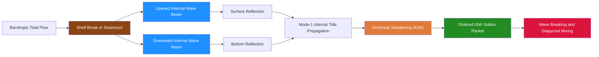

# Internal Waves and Solitons

> [!abstract] TL;DR
> Internal gravity waves propagate along density surfaces inside the ocean, invisible from the surface yet capable of displacing water by tens to hundreds of metres. Their frequency is bounded between the Coriolis frequency $f$ and the buoyancy (Brunt-Vaisala) frequency $N(z)$, and their unique dispersion relation forces energy to travel at a fixed angle to the horizontal regardless of wavelength. Tidal flow over seamounts and continental shelves converts barotropic energy into these waves; far from the generation site, nonlinearity steepens the leading face of the wave until it fissions into a rank-ordered packet of internal solitary waves (ISWs) described by the Korteweg-de Vries (KdV) equation. The resulting turbulence when these waves break is the dominant mechanism for mixing in the deep ocean, closing the global thermohaline circulation budget.

---

## Intuition

**Analogy:** Imagine a layer of oil floating on water inside a bottle. If you tilt the bottle gently, the oil-water interface sloshes back and forth — an internal wave on a sharp density interface. Now replace the bottle with the entire ocean: instead of one sharp interface you have a continuously stratified column where density increases smoothly with depth, and instead of tilting the bottle you have the twice-daily tide pressing against a submarine ridge. Waves are launched along every density surface, travelling horizontally at speeds of 1–3 m/s (roughly 100 times slower than surface waves of the same period), with vertical displacements up to 240 m.

The restoring force is buoyancy. A water parcel displaced upward finds itself denser than its surroundings and sinks back; displaced downward, it is lighter and rises. The frequency at which a parcel oscillates vertically is the **Brunt-Vaisala (buoyancy) frequency**:

$$N^2(z) = -\frac{g}{\rho_0}\frac{d\rho}{dz}$$

In a stably stratified ocean ($d\rho/dz < 0$), $N^2 > 0$ and oscillations are possible. $N$ is typically 10–100 cycles per hour in the thermocline, setting the upper frequency limit for internal wave existence.

---

## How It Works

### Core Mechanics

**1. Dispersion relation.** For a non-rotating ocean (or far from the inertial frequency), the internal wave dispersion relation is

$$\omega^2 = \frac{N^2\,k_h^2}{k_h^2 + k_z^2} = N^2\cos^2\theta$$

where $k_h$ and $k_z$ are the horizontal and vertical wavenumber magnitudes, and $\theta$ is the angle the group velocity (energy propagation) makes with the horizontal. Including Earth's rotation:

$$\omega^2 = N^2\cos^2\theta + f^2\sin^2\theta, \qquad f < \omega < N$$

The frequency is entirely controlled by the propagation angle $\theta$ — not by the wavelength. This means that a change in wavelength (e.g., from bottom reflection) must be accompanied by a change in wavelength-to-depth ratio to preserve $\theta$, not a change in frequency.

**2. Phase vs group velocity: they are perpendicular.** For a given frequency $\omega$, the wavevector $(k_h, k_z)$ points at angle $\theta$ from the vertical, while the group velocity vector (energy transport) points at angle $\theta$ from the horizontal — exactly $90°$ away. Taller laboratory tanks with visualised internal wave beams make this spectacularly visible as X-shaped "Saint Andrew's cross" patterns.

**3. Horizontal and vertical group velocity components.** Defining total wavenumber $\kappa = \sqrt{k_h^2 + k_z^2}$:

$$c_{gx} = \frac{\partial\omega}{\partial k_h} = \frac{N^2 - \omega^2}{\omega}\frac{k_h k_z^2}{\kappa^4 N}, \quad c_{gz} = \frac{\partial\omega}{\partial k_z} = -\frac{\omega^2 - f^2}{\omega}\frac{k_z k_h^2}{\kappa^4 N}$$

Upward-propagating beams carry energy away from a deep source; they reflect off the ocean surface and bottom, producing a characteristic criss-cross beam pattern before the wave field spreads into discrete vertical modes.

**4. Internal tides.** The semidiurnal ($M_2$, 12.42 h) and diurnal ($K_1$, 23.93 h) barotropic tides carry $\sim 3.5$ TW of energy. Roughly 1 TW is converted to internal (baroclinic) tides where tidal currents impinge on steep topography: continental shelf edges, mid-ocean ridges, and seamounts. The resulting internal tide radiates horizontally as a near-sinusoidal wave of mode-1 structure (single half-wavelength in the vertical) at speeds of 1–3 m/s.

**5. Nonlinear internal solitary waves (ISWs).** As the mode-1 internal tide propagates offshore, nonlinear steepening (parameter $\alpha\eta\eta_x$) competes with dispersion (parameter $\beta\eta_{xxx}$). The KdV equation describes this balance:

$$\eta_t + c_0\eta_x + \alpha\eta\eta_x + \beta\eta_{xxx} = 0$$

Its exact soliton solution is

$$\eta(x,t) = a\,\mathrm{sech}^2\!\left(\frac{x - ct}{\Lambda}\right), \quad \Lambda = \sqrt{\frac{12\beta}{\alpha a}}, \quad c = c_0 + \frac{\alpha a}{3}$$

Key soliton properties:
- Taller solitons travel **faster** ($c$ increases with $a$) and are **narrower** ($\Lambda$ decreases with $a$).
- Multiple solitons pass through each other without changing shape — only shifting in phase.
- An arbitrary localised initial condition decomposes into a finite number of solitons (rank-ordered) plus dispersive radiation — the result of the Inverse Scattering Transform (IST).

**6. Garrett-Munk background spectrum.** Away from generation sites, the open-ocean internal wave field is remarkably universal. Garrett and Munk (1975, 1976) parameterised the empirical energy density spectrum as separable in frequency and vertical wavenumber $m$:

$$E(m,\omega) \propto N^2(z)\,m^{-2}\,\omega^{-2}, \qquad f < \omega < N$$

The GM spectrum represents an approximate statistical equilibrium maintained by resonant wave-wave interactions and is used as the baseline "background" state against which anomalies from sources and sinks are measured.

**7. Wave breaking and diapycnal mixing.** As internal waves propagate into shallower, lower-$N$ regions (or onto the continental shelf), their amplitude grows and the Richardson number $Ri = N^2/(\partial u/\partial z)^2$ drops below $1/4$, triggering Kelvin-Helmholtz instability. The resulting turbulent patches mix water across density surfaces. The relevant length scale for overturning is the **Ozmidov scale** $L_O = (\varepsilon/N^3)^{1/2}$, where $\varepsilon$ is the turbulent dissipation rate. This diapycnal mixing is the primary means by which the abyssal ocean is slowly stirred upward, sustaining the overturning circulation.

### Flow / Architecture



---

## Key Concepts / Details

### Secondary Level

- **What they are.** Internal waves exist inside the ocean water column, propagating along tilted density surfaces rather than on the sea surface. They are invisible to the naked eye but betray themselves by the surface roughness patterns they imprint (slick bands from current convergence) that appear dramatically in SAR satellite imagery.
- **Why tides generate them.** As the tide pushes water horizontally over a seamount or shelf break, water is forced to move up and over the obstacle. This vertical displacement sets off a train of internal waves that propagate away at the interface between dense deep water and lighter surface water.
- **Engineering hazard.** ISW-driven currents near oil platforms and submarine pipelines in the South China Sea and other marginal seas regularly exceed 2 m/s, causing structural fatigue and operational shutdowns. The peak westward velocity of the December 2013 Luzon Strait extreme ISW was measured at 2.55 m/s.
- **Satellite detection.** SAR (Synthetic Aperture Radar) satellites (ERS-1, Sentinel-1) detect ISWs via the alternating rough-smooth surface roughness bands caused by ISW-induced surface currents converging and diverging.

### Undergraduate Level

- **Taylor-Goldstein equation and modal structure.** For background shear flow $U(z)$ in a stratified fluid, small-amplitude waves satisfy the Taylor-Goldstein equation, whose eigenvalue problem yields discrete vertical modes. Mode $n$ has $n-1$ zero crossings in the vertical velocity field. Mode-1 (single zero crossing) carries most internal tide energy; it is the dominant signal in mooring records and satellite altimetry.
- **ISW phase speed.** The KdV soliton travels at $c = c_0 + \alpha a/3$. For depression waves in the South China Sea ($\alpha < 0$, $a < 0$), the soliton is faster than the linear internal tide speed because $|\alpha a/3| > 0$ (both $\alpha$ and $a$ negative give positive increment). For the extended KdV (Gardner equation), a cubic nonlinear term $\alpha_1\eta^2\eta_x$ is added to handle very large amplitudes near the polarity-reversal depth where $\alpha = 0$.
- **Internal wave energy equation.** The wave action $A = E/\omega$ (energy per unit frequency) is conserved along ray paths in slowly varying $N(z)$. As $N$ decreases (e.g., at depth), $A$ conservation requires the amplitude to grow — the WKB amplification by $N^{-1/2}$.
- **Breaking criterion.** An internal wave breaks when its isopycnal slope exceeds $1$ (convective overturning) or when its shear exceeds $2N$ (Kelvin-Helmholtz instability). The critical amplitude for a mode-1 wave of wavenumber $k$ is approximately $a_c \approx 2N/(kU_0)$.

### Graduate Level

- **Garrett-Munk (GM75/GM76) spectrum.** The GM model parameterises the oceanic internal wave field as isotropic in horizontal wavenumber and uses an empirical joint frequency-vertical wavenumber spectrum $E(m,\omega) = E_0 \cdot B(\omega) \cdot H(m)$, where $B(\omega) \propto \omega^{-2}(f^2 - \omega^2)^{-1/2}$ near the inertial frequency and $H(m) \propto (m^2 + m_*^2)^{-1}$ with reference vertical wavenumber $m_*$. The total energy is $\sim 4\times10^{-3}$ J/kg scaled by $N/N_0$. Deviations from GM indicate local forcing, boundary proximity, or nearinertial wave events.
- **Parametric Subharmonic Instability (PSI).** PSI is the dominant cascade mechanism transferring energy from semidiurnal internal tides ($\omega = M_2$) to near-inertial waves ($\omega \approx f$) at half the tidal frequency. It is most efficient where $M_2/2 \approx f$, i.e., at latitude $\sim 28.9°$ N/S. Near this "critical latitude," PSI drains internal tide energy to scales small enough for turbulent breaking within $O(100)$ km of the generation site. The IWISE experiment confirmed this mechanism at the Luzon Strait.
- **ISW shoaling, polarity reversal, and fission at the shelf.** As a depression ISW (depressed pycnocline) shoals onto a continental shelf, the ratio of upper to lower layer thickness changes; when the pycnocline reaches mid-water depth, $\alpha = 0$ and the wave cannot maintain soliton form. It fissions into a packet of elevation solitons, with the transformation described by the variable-coefficient KdV (vKdV) or extended KdV. EXITS and IWISE experiments at the Luzon Strait-South China Sea system provided the most complete observational datasets of this process.
- **Numerical simulation.** State-of-the-art ISW shoaling simulations use 2D or 3D non-hydrostatic ocean models (MITgcm, ROMS-nhnh, SUNTANS). Key numerical challenges are: maintaining enough vertical resolution to resolve the pycnocline ($\sim 5$–10 m), handling periodic domain boundaries for long-range propagation, and parameterising subgrid-scale turbulence from breaking events. Resolution of $\sim 50$ m horizontal and $\sim 5$ m vertical is required to faithfully capture mode-1 fission.

---

## Python Demo

```python
import numpy as np
import matplotlib.pyplot as plt

# KdV equation: η_t + c0*η_x + α*η*η_x + β*η_xxx = 0
# Soliton solution: η = a · sech²((x − c·t) / Λ)
# where  Λ = √(12β / αa)  and  c = c0 + αa/3

c0    = 2.5      # linear phase speed [m/s]   (mode-1 internal tide)
alpha = 0.012    # nonlinear coefficient       [1/(m·s)]
beta  = 800.0    # dispersive coefficient      [m³/s]

N  = 2048
L  = 2.0e5                                       # domain = 200 km
x  = np.linspace(0, L, N, endpoint=False)
dt = 20.0                                        # time step [s]
k  = 2.0 * np.pi * np.fft.rfftfreq(N, d=L / N)  # wavenumbers [rad/m]

def soliton_ic(a, x0):
    """Analytical sech-squared soliton of amplitude a centred at x0."""
    width = np.sqrt(12.0 * beta / (alpha * a))
    return a / np.cosh((x - x0) / width) ** 2

def kdv_rhs(u):
    """Pseudo-spectral RHS: -(c0·u_x + α·u·u_x + β·u_xxx)."""
    h    = np.fft.rfft(u)
    ux   = np.fft.irfft(1j * k * h, n=N)
    uxxx = np.fft.irfft(-1j * k ** 3 * h, n=N)
    return -(c0 * ux + alpha * u * ux + beta * uxxx)

def rk4_step(u):
    k1 = kdv_rhs(u);               k2 = kdv_rhs(u + 0.5 * dt * k1)
    k3 = kdv_rhs(u + 0.5 * dt * k2); k4 = kdv_rhs(u + dt * k3)
    return u + (dt / 6.0) * (k1 + 2 * k2 + 2 * k3 + k4)

n_steps = int(6 * 3600 / dt)  # 6 h simulation

# ── 1. Soliton stability: exact soliton should not change shape ──────────────
u_sol   = soliton_ic(a=30.0, x0=L / 4)
u       = u_sol.copy()
for _ in range(n_steps):
    u = rk4_step(u)
print(f"Amplitude drift after 6 h:  {abs(u.max() - u_sol.max()):.5f} m  (should be ~0)")

# ── 2. Fission: a pulse 5× wider than the natural soliton width ──────────────
# This is NOT an exact soliton → it decomposes into a rank-ordered ISW packet
# (tallest/fastest ISW leads, shortest/slowest trails behind).
lam0   = np.sqrt(12.0 * beta / (alpha * 30.0))    # natural width at a=30 m
u_wide = 30.0 / np.cosh((x - L / 4) / (5.0 * lam0)) ** 2

snaps, labels = [u_wide.copy()], ["t = 0 h"]
u = u_wide.copy()
for step in range(1, n_steps + 1):
    u = rk4_step(u)
    if step in (n_steps // 2, n_steps):
        snaps.append(u.copy())
        labels.append(f"t = {step * dt / 3600:.0f} h")

# ── 3. Plot fission sequence ──────────────────────────────────────────────────
fig, axes = plt.subplots(len(snaps), 1,
                         figsize=(10, 2.8 * len(snaps)), sharex=True)
for ax, snap, lbl in zip(axes, snaps, labels):
    ax.plot(x / 1e3, snap, lw=1.5, color="steelblue")
    ax.axhline(0, color="k", lw=0.4, ls="--")
    ax.set_ylabel("η  [m]")
    ax.set_title(lbl)
axes[-1].set_xlabel("Distance  [km]")
fig.suptitle("KdV Soliton Fission: Wide Pulse → Ordered ISW Packet", fontsize=12)
plt.tight_layout()
plt.show()
```

**What to observe:**
- Case 1: The 30 m exact soliton propagates without any amplitude change — soliton stability confirmed.
- Case 2: The 5× wider pulse (same amplitude) is not a soliton; by $t = 3$ h a leading rank-ordered train of progressively shorter, slower solitons has separated from dispersive trailing radiation. This is the oceanic equivalent of an internal tide fissioning into ISWs after $O(100)$ km of propagation.

---

## Real-World Notes

> **Luzon Strait, South China Sea.** The world's most energetic source of ISWs. Tidal flow through the two-ridge system of the Luzon Strait converts an estimated 10–20 GW of barotropic tidal energy into internal tides. Waves propagate westward ~450 km into the South China Sea, reaching amplitudes of 120–250 m in typical conditions; an extreme event on 4 December 2013 recorded a 240 m displacement with a peak current of 2.55 m/s at depth. The ISW packets are visible in Google Earth via the surface roughness signatures and in SAR imagery as arc-shaped bands tens of kilometres long.

> **Hawaiian Ridge (HOME Experiment).** The Hawaiian Ocean Mixing Experiment (HOME, 2000–2002) measured ~20 GW of internal tide generation along the Hawaiian Ridge — roughly 25% of the global ridge total. Turbulent dissipation near the ridge was $O(10^{-6})$ W/kg, 1–2 orders of magnitude above open-ocean background, with the remainder radiating far-field. The experiment confirmed that only a fraction of generated internal tide energy mixes locally.

> **Mooring observations of internal tides.** Temperature records from WHOI-style moorings show sinusoidal 12 h isotherm displacements of 20–100 m at mid-ocean ridge flanks — the far-field mode-1 internal tide. The semidiurnal signal is phase-locked to the astronomical tide and extractable by harmonic analysis. In the South China Sea, the same moorings show the irregular, sharp-fronted ISW packets superimposed on the background internal tide.

> **Oil platform operations.** ISW-driven currents in the South China Sea, Gulf of Mexico, and Andaman Sea cause platform "riser" drag loads that exceed design specs. Real-time internal wave monitoring via acoustic Doppler current profilers (ADCPs) is now standard for deepwater platforms in ISW-prone regions.

---

## Common Pitfalls

- **Confusing internal waves with surface gravity waves.** They share the name "wave" but differ fundamentally: surface waves have dispersion $\omega^2 = gk\tanh(kH)$ and propagate at tens of metres per second; internal waves obey $\omega = N\cos\theta$ with phase speeds of 1–3 m/s and vertical displacements far exceeding surface amplitudes. A 10 cm surface signature from an ISW can correspond to 100 m isopycnal displacement at depth.

- **Treating the ocean as a two-layer system.** The sharp two-layer model gives an intuitive result but misses all modal structure above mode-1. In a continuously stratified ocean, $N(z)$ varies with depth, the eigenvalue problem yields infinitely many modes, each with its own phase speed and vertical structure, and the observed wave field is a superposition of all modes. Ignoring higher modes underestimates total internal wave energy and misattributes mixing.

- **Reversing phase and group velocity directions.** Because phase and group velocities are perpendicular for internal waves (in the non-rotating limit), energy in an upward-propagating internal wave beam has a downward phase progression. Students and engineers routinely mistake the direction of energy flow. The rule: for an internal wave source at depth, energy beams radiate upward at angle $\theta$, but phase lines tilt such that phase moves downward and away from the source.

- **Applying KdV beyond its validity range.** KdV is valid for weakly nonlinear, weakly dispersive waves. In the South China Sea, ISW amplitudes (100–240 m) often exceed the pycnocline depth (~100 m), placing them firmly in the strongly nonlinear regime. The extended KdV (Gardner equation) or fully nonlinear DJL (Dubreil-Jacotin-Long) equation is needed for quantitative accuracy at large amplitude.

- **Ignoring Coriolis for long-period internal waves.** Near-inertial internal waves ($\omega \approx f$) dominate internal wave energy in many ocean basins. For these, $f$ cannot be neglected and the dispersion relation requires the full expression $\omega^2 = N^2\cos^2\theta + f^2\sin^2\theta$. Using the non-rotating form underestimates $\omega$ and misestimates propagation direction.

---

## Related Concepts

**Same vault (Oceanography):**
- [[Density_Stratification_and_Mixing]] — $N(z)$ structure that sets the restoring force and controls all internal wave propagation; stable stratification ($N^2 > 0$) is a prerequisite for internal waves to exist.
- [[Turbulence_and_Diapycnal_Mixing]] — the end result of internal wave breaking: overturning Kelvin-Helmholtz billows and convective plumes that irreversibly mix water masses across isopycnals.
- [[Tides_and_Tidal_Dynamics]] — the primary energy source that drives internal tides at topographic features; the barotropic-to-baroclinic energy conversion problem.
- [[Surface_Gravity_Waves]] — the surface-wave counterpart; useful contrast for dispersion, phase speed, and amplitude scaling.
- [[_MOC_Waves_Tides_Coastal]] — section map of entry points for this domain.

**Cross-vault:**
- [[Wave_Motion_and_Properties]] (Physics) — general wave kinematics including group vs phase velocity, dispersion relations, and wave packets; the conceptual foundation for all internal wave physics.
- [[Fluid_Statics_and_Properties]] (Physics) — hydrostatics and the buoyancy restoring force; the fundamental physical basis for $N(z)$.
- [[Waves_in_Fluids_and_Acoustics]] (Physics) — surface gravity waves, KdV solitons, and shock waves in fluids; the broader fluid-wave context in which internal waves sit.
- [[Fourier_Transform]] (Signals and Systems) — Fourier decomposition is the mathematical backbone of the Garrett-Munk spectrum and the pseudo-spectral KdV numerical method.
- [[_MOC_Physics_Master]] — gateway to the Physics vault for cross-domain connections.
- [[_MOC_SS_Master]] — gateway to Signals and Systems for spectral analysis methods.

---

## Review Questions

### Secondary Level
1. Why do internal waves travel so much more slowly than surface waves of the same period, even though both are water waves?
2. A mooring time-series shows isotherm displacements with a 12-hour period. What process is most likely responsible, and where would you expect the largest-amplitude signals to be measured?
3. Why do ISWs appear as alternating bright and dark bands in satellite radar imagery even though the waves are entirely underwater?

### Undergraduate Level
1. The internal wave dispersion relation $\omega = N\cos\theta$ says that frequency depends only on propagation angle, not wavelength. What happens to the wavelength of an internal wave beam as it reflects off a sloping bottom — and under what slope condition does the reflected beam become infinitely steep (critical reflection)?
2. A mode-1 internal tide of amplitude 40 m and horizontal wavelength 150 km propagates from the deep ocean onto a continental shelf where $c_0$ decreases from 2.5 m/s to 1.8 m/s and $\alpha$ changes sign. Qualitatively describe the wave evolution, including what happens near the polarity-reversal point.
3. Estimate the number of solitons that will emerge from a broad initial KdV pulse using the IST bound-state counting argument. What determines whether the solitons are elevation (positive) or depression (negative) waves?

### Graduate Level
1. The Garrett-Munk spectrum predicts $E(m,\omega) \propto m^{-2}\omega^{-2}$. If you measure a region where the spectral slope in $m$ is $-3$ rather than $-2$, what physical processes might explain the steeper rolloff, and how would you test your hypothesis from mooring data?
2. Parametric Subharmonic Instability (PSI) is most efficient near latitude $28.9°$ N. Derive why this latitude is special in terms of the $M_2$ tidal frequency and the local inertial frequency, and explain what consequences this has for the latitudinal distribution of diapycnal mixing in the ocean.
3. You are designing a non-hydrostatic numerical simulation of ISW shoaling at a continental shelf. Specify the minimum horizontal and vertical grid resolution, the required domain length, and the boundary conditions needed to faithfully capture: (a) the initial fission from mode-1 internal tide to ISW packet, (b) the polarity reversal near the shelf break, and (c) the turbulent dissipation during shoaling and breaking.

---

## Sources

- [Garrett, C. & Munk, W. (1975) — Space-time scales of internal waves. *Journal of Geophysical Research*](https://doi.org/10.1029/JC080i003p00291)
- [Helfrich, K.R. & Melville, W.K. (2006) — Long nonlinear internal waves. *Annual Review of Fluid Mechanics*](https://doi.org/10.1146/annurev.fluid.38.050304.092129)
- [Alford, M.H. et al. (2015) — The formation and fate of internal waves in the South China Sea. *Nature*](https://doi.org/10.1038/nature14399)
- [Cushman-Roisin, B. & Beckers, J.-M. (2011) — *Introduction to Geophysical Fluid Dynamics*. Academic Press.](https://www.elsevier.com/books/introduction-to-geophysical-fluid-dynamics/cushman-roisin/978-0-12-088759-0)
- [An extreme internal solitary wave event observed in the northern South China Sea — *Scientific Reports* (2016)](https://www.ncbi.nlm.nih.gov/pmc/articles/PMC4956752/)
- [Energy cascade in the Garrett-Munk spectrum — *Journal of Fluid Mechanics* (Cambridge Core)](https://www.cambridge.org/core/journals/journal-of-fluid-mechanics/article/energy-cascade-in-the-garrettmunk-spectrum-of-internal-gravity-waves/7A33FF2445BD5C63C69303350987AF72)

---

#Oceanography #WavesTidesCoastal #InternalWaves #Solitons
