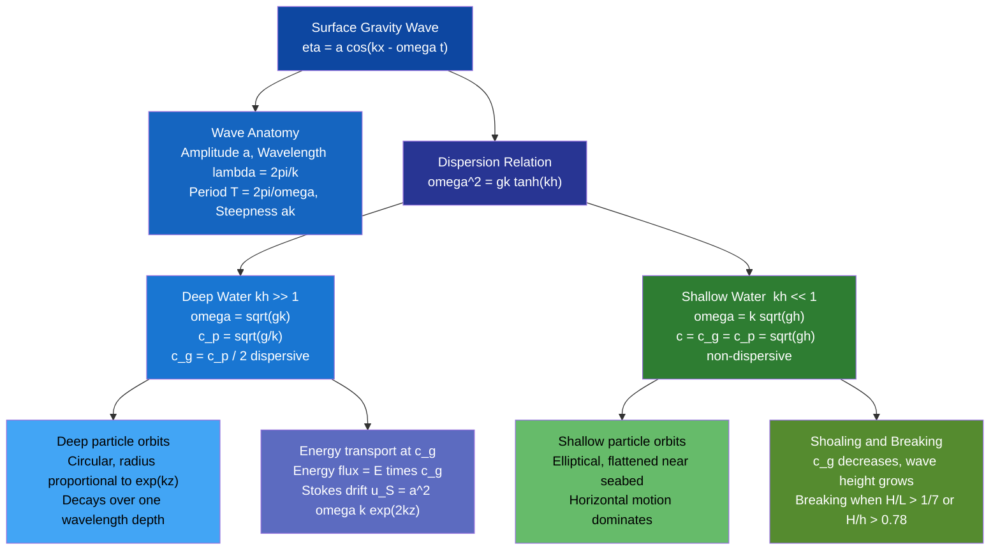

# Surface Gravity Waves

> [!abstract] TL;DR
> Surface gravity waves are oscillations of the ocean surface where gravity acts as the restoring force. Their behaviour is governed by the dispersion relation $\omega^2 = gk\tanh(kh)$, which produces the key split: in deep water waves are dispersive ($c_p \propto k^{-1/2}$, $c_g = c_p/2$), while in shallow water they become non-dispersive and all wavelengths travel at $c = \sqrt{gh}$. Water particles trace closed circular orbits in deep water (open ellipses in shallow water), so there is no net forward transport in linear theory — only the small residual Stokes drift. The statistical description of a real sea state uses the JONSWAP energy density spectrum, whose integral $m_0$ defines the significant wave height $H_s = 4\sqrt{m_0}$.

---

## Intuition

**Analogy:** Drop a stone in a still pond. Ripples spread outward, but the lily pad next to the entry point just bobs up and down — it does not drift away. Two things move: the *wave pattern* (phase) and the *energy envelope* (group). They travel at different speeds, and the water molecules themselves go almost nowhere.

In the ocean the same physics operates at vastly larger scales. A storm over the North Atlantic generates chaotic wind-waves; these organise into long, regular swells as they propagate. The swell's energy arrives at a distant coastline at the group velocity — roughly half the speed of the individual wave crests you can watch overtaking the group from behind. This separation of phase from energy transport is the heart of the dispersion relation.

---

## How It Works

Linear wave theory assumes small-amplitude oscillations ($ak \ll 1$, where $a$ is amplitude and $k$ is wavenumber) on top of a fluid at rest over a flat bottom of depth $h$.

### Dispersion Relation

Combining the Laplace equation for the velocity potential with the linearised free-surface boundary conditions (dynamic: zero pressure; kinematic: surface follows the fluid) and the impermeable bottom condition yields:

$$\boxed{\omega^2 = gk\tanh(kh)}$$

| Limit | Condition | Result |
|-------|-----------|--------|
| Deep water | $kh \gg 1$ | $\omega = \sqrt{gk}$, $c_p = \sqrt{g/k}$, $c_g = c_p/2$ |
| Shallow water | $kh \ll 1$ | $\omega = k\sqrt{gh}$, $c = c_p = c_g = \sqrt{gh}$ |
| Intermediate | general | full $\tanh$ expression |

**Phase velocity** (speed of individual crests): $c_p = \omega/k$

**Group velocity** (speed of energy envelope): $c_g = \dfrac{d\omega}{dk} = \dfrac{g(\tanh(kh) + kh\,\mathrm{sech}^2(kh))}{2\omega}$

In deep water $c_g = c_p/2$ — wave crests continuously emerge at the rear of a group, travel through it, and disappear at the front.

### Wave Energy

For a monochromatic wave $\eta = a\cos(kx - \omega t)$, the depth-integrated energy density (kinetic + potential) averaged over one period is:

$$E = \frac{1}{2}\rho g a^2 \quad [\text{J m}^{-2}]$$

Energy flux (power per unit crest width): $\mathcal{F} = E\, c_g$. This conservation law — $E c_g = \text{const}$ along a ray — drives shoaling.

### Stokes Drift

In linear theory particle orbits are exactly closed. At second order in wave steepness, there is a small net forward drift:

$$u_S(z) = a^2 \omega k\, e^{2kz} \quad [\text{m s}^{-1}]$$

where $z \le 0$ is depth below the mean surface. Surface Stokes drift $\sim a^2 \omega k$ drives upper-ocean tracer transport and contributes to Langmuir circulation.

### Significant Wave Height and Wave Spectra

A real sea state is a superposition of many wave components. The **variance spectrum** (energy density in frequency space) $S(f)$ satisfies:

$$m_n = \int_0^\infty f^n S(f)\,df \quad \text{(spectral moments)}$$

**Significant wave height**: $H_s = 4\sqrt{m_0}$, where $m_0 = \int_0^\infty S(f)\,df$ is the sea-surface elevation variance. This equals the average height of the highest third of waves for a narrow-band sea.

### JONSWAP Spectrum

The **Joint North Sea Wave Project** (1973) parameterised fetch-limited (actively wind-forced) seas as:

$$S(f) = \frac{\alpha g^2}{(2\pi)^4\, f^5} \exp\!\left[-\frac{5}{4}\!\left(\frac{f_p}{f}\right)^4\right] \gamma^{\exp\!\left[-\frac{(f - f_p)^2}{2\sigma^2 f_p^2}\right]}$$

| Parameter | Value | Meaning |
|-----------|-------|---------|
| $\alpha$ | $0.076\,(U_{10}/Fg)^{0.22}$ | Equilibrium range level |
| $f_p$ | $3.5\,(g/U_{10})(gF/U_{10}^2)^{-0.33}$ | Peak frequency |
| $\gamma$ | $\approx 3.3$ | Peak enhancement over Pierson-Moskowitz ($\gamma=1$) |
| $\sigma$ | 0.07 ($f \le f_p$), 0.09 ($f > f_p$) | Peak width parameter |
| $F$ | — | Fetch distance (m) |

### Wave Breaking

Two complementary criteria:

1. **Steepness limit**: $H/\lambda > 1/7$ (Miche criterion) — the wave cannot maintain its shape.
2. **Stokes limiting form**: crest half-angle narrows to $120°$; $a k = 0.4429$ at the Stokes limit.

In shallow water, breaking occurs when $H/h \approx 0.78$ (spilling/plunging on slopes).

### Shoaling Coefficient

As depth decreases, wavelength and group velocity drop but frequency is conserved. From $E c_g = \text{const}$:

$$K_s = \frac{H}{H_0} = \sqrt{\frac{c_{g,0}}{c_g}}$$

where subscript 0 denotes the deep-water reference. $K_s$ initially decreases (wave lengthens slightly) then rises sharply as waves enter very shallow water.

### Flow / Architecture



---

## Key Concepts / Details

### Secondary Level

**Vocabulary**

| Term | Definition |
|------|-----------|
| Wavelength $\lambda$ | Crest-to-crest distance (m) |
| Period $T$ | Time between successive crests at a fixed point (s) |
| Amplitude $a$ | Half the crest-to-trough height (m); wave height $H = 2a$ |
| Crest / Trough | Maximum / minimum surface elevation |
| Steepness | $H/\lambda$ or $ak$; dimensionless measure of nonlinearity |

**Why waves break near shore.** As a swell moves into shallower water the seabed slows the base of the wave more than the crest, which tilts forward and eventually topples. Spilling breakers form on gentle slopes (crest gradually whitens); plunging breakers on steep slopes (crest curls over and crashes).

**Swells vs wind-waves.** Wind-waves (chop) are short, steep, and irregular — actively generated by local wind. Swells are long, smooth, fast-moving waves that have travelled away from their generating storm and have sorted themselves by wavelength (longer wavelengths arrive first because $c_p \propto \sqrt{\lambda}$).

---

### Undergraduate Level

**Deriving the dispersion relation.** Assume irrotational, incompressible flow: velocity potential $\Phi$ satisfies $\nabla^2\Phi = 0$. With $\Phi = f(z)\cos(kx - \omega t)$ and the impermeable bottom BC $\partial\Phi/\partial z = 0$ at $z = -h$, the solution is:

$$\Phi = \frac{a\omega}{k}\frac{\cosh k(z+h)}{\sinh(kh)}\sin(kx - \omega t)$$

The **dynamic** free-surface BC (linearised Bernoulli at $z = 0$): $\partial\Phi/\partial t + g\eta = 0$.
The **kinematic** free-surface BC: $\partial\eta/\partial t = \partial\Phi/\partial z$ at $z = 0$.

Combining these two conditions with the solution above yields $\omega^2 = gk\tanh(kh)$.

**Demonstrating phase vs group velocity.** Consider two waves with nearly equal wavenumbers $k_0 \pm \delta k$:

$$\eta = 2a\cos(\delta k\cdot x - \delta\omega\cdot t)\cos(k_0 x - \omega_0 t)$$

The envelope (beat) travels at $\delta\omega/\delta k \to d\omega/dk = c_g$; the carrier travels at $\omega_0/k_0 = c_p$.

**Energy transport at $c_g$.** Consider the work done by pressure across a vertical plane. Integrating from bottom to surface and averaging over a wave period gives energy flux $\mathcal{F} = E c_g$. For deep water $c_g = c_p/2$, so only half the phase speed carries energy — hence swells outrun their energy.

**Shoaling in practice.** For a 1 m deep-water swell approaching a beach, $K_s$ first drops slightly (to $\approx 0.91$ at $kh \approx 1$) then increases to $\approx 1.5$–$2$ in the surf zone before breaking.

**JONSWAP $\to$ Hs.** Numerically integrating a JONSWAP spectrum with $U_{10} = 10$ m/s, $F = 200$ km gives $m_0 \approx 0.36$ m$^2$, so $H_s = 4\sqrt{0.36} = 2.4$ m — a moderate sea state.

---

### Graduate Level

**Nonlinear Stokes waves.** For finite amplitude $ak$, the free surface profile is no longer a pure sinusoid:

$$\eta = a\cos\theta + \tfrac{1}{2}a^2 k\cos 2\theta + \tfrac{3}{8}a^3 k^2\cos 3\theta + \cdots$$

where $\theta = kx - \omega t$. The dispersion relation also gains a nonlinear correction:

$$c = \sqrt{g/k}\bigl(1 + a^2k^2 + \cdots\bigr)$$

Steeper waves travel slightly faster — this is the seed of wave-wave focussing and rogue-wave formation.

**Wave-wave interactions (Phillips resonance).** Four-wave resonance occurs when:

$$\mathbf{k}_1 + \mathbf{k}_2 = \mathbf{k}_3 + \mathbf{k}_4, \quad \omega(\mathbf{k}_1) + \omega(\mathbf{k}_2) = \omega(\mathbf{k}_3) + \omega(\mathbf{k}_4)$$

This is the dominant mechanism for nonlinear spectral energy transfer in wave models (the $S_{nl}$ source term). The DIA (Discrete Interaction Approximation) provides a fast numerical shortcut.

**Wave action conservation (Whitham/Bretherton, 1965-1968).** In a slowly varying background (varying depth, background current $\mathbf{U}$), wave energy is not conserved. The conserved quantity is **wave action**:

$$N = E/\omega_r$$

where $\omega_r = \omega - \mathbf{k}\cdot\mathbf{U}$ is the intrinsic (relative) frequency. Wave action $N$ is conserved along rays:

$$\frac{\partial N}{\partial t} + \nabla\cdot(\mathbf{c}_g N) = S_{\text{in}} + S_{\text{ds}} + S_{nl}$$

where $S_{\text{in}}$ (wind input), $S_{\text{ds}}$ (dissipation by breaking), and $S_{nl}$ (nonlinear transfer) are source/sink terms.

**WAVEWATCH III.** The operational global spectral wave model maintained by NOAA solves the action balance equation on a $1/4°$ to $1/16°$ grid. It propagates the 2D directional spectrum $S(f, \theta)$ through ocean basin domains, accounting for refraction, shoaling, current interaction, and swell dissipation. Hindcasts and 10-day forecasts are routinely produced for maritime safety and wave-energy resource assessments.

**Wave-current interactions.** A following current ($U > 0$) Doppler-shifts the apparent frequency and increases wavelength; an opposing current compresses wavelength and increases steepness until breaking occurs (a mechanism for rogue-wave generation near the Agulhas current retroflection).

**Freak / rogue waves.** Conventionally defined as $H > 2 H_s$. Two main mechanisms: (i) linear focussing (superposition of wave components in phase at the same point); (ii) nonlinear Benjamin-Feir (modulational) instability, in which a monochromatic wave train spontaneously transfers energy to sidebands that focus into an extreme crest.

---

## Python Demo

```python
import numpy as np
import matplotlib.pyplot as plt

# ── Constants ────────────────────────────────────────────────────────────────
g = 9.81    # gravitational acceleration (m/s^2)
h = 100.0   # water depth (m)

k = np.linspace(1e-4, 0.6, 600)   # wavenumber range (rad/m)

# ── Full dispersion relation: omega^2 = g k tanh(k h) ───────────────────────
omega   = np.sqrt(g * k * np.tanh(k * h))
c_p     = omega / k                              # phase velocity

# Analytical group velocity: d(omega)/dk
tanh_kh  = np.tanh(k * h)
sech2_kh = 1.0 / np.cosh(k * h)**2             # sech^2(kh)
c_g      = g * (tanh_kh + k * h * sech2_kh) / (2.0 * omega)

# ── Asymptotic limits ────────────────────────────────────────────────────────
omega_deep = np.sqrt(g * k)                     # deep-water omega
c_p_deep   = np.sqrt(g / k)                     # deep-water phase speed
c_g_deep   = 0.5 * c_p_deep                     # deep-water group speed
c_shallow  = np.sqrt(g * h)                     # shallow-water (constant) speed

# ── Figure 1: dispersion and velocities ─────────────────────────────────────
fig, axes = plt.subplots(1, 2, figsize=(13, 5))

ax = axes[0]
ax.plot(k, omega,           'b-',  lw=2,   label=r'Full: $\omega^2 = gk\tanh(kh)$')
ax.plot(k, omega_deep,      'r--', lw=1.5, label=r'Deep water: $\omega = \sqrt{gk}$')
ax.plot(k, c_shallow * k,   'g:',  lw=1.5, label=r'Shallow water: $\omega = k\sqrt{gh}$')
ax.set_xlabel('Wavenumber k (rad/m)')
ax.set_ylabel(r'Angular frequency $\omega$ (rad/s)')
ax.set_title(f'Dispersion Relation  (h = {h:.0f} m)')
ax.legend(fontsize=9)
ax.set_xlim([0, 0.6]);  ax.set_ylim([0, 2.5])
ax.grid(True, alpha=0.4)

ax = axes[1]
ax.plot(k, c_p,      'b-',  lw=2,   label=r'$c_p = \omega/k$ (phase, full)')
ax.plot(k, c_g,      'g-',  lw=2,   label=r'$c_g = d\omega/dk$ (group, full)')
ax.plot(k, c_p_deep, 'b--', lw=1.5, label=r'$c_p$ deep: $\sqrt{g/k}$')
ax.plot(k, c_g_deep, 'g--', lw=1.5, label=r'$c_g$ deep: $c_p/2$')
ax.axhline(c_shallow, color='r', ls=':', lw=1.5,
           label=fr'$c$ shallow = $\sqrt{{gh}}$ = {c_shallow:.1f} m/s')
ax.set_xlabel('Wavenumber k (rad/m)')
ax.set_ylabel('Velocity (m/s)')
ax.set_title('Phase and Group Velocities')
ax.legend(fontsize=9)
ax.set_xlim([0, 0.6]);  ax.set_ylim([0, 50])
ax.grid(True, alpha=0.4)

plt.tight_layout()
plt.savefig('dispersion_velocities.png', dpi=150)
plt.show()

# ── Stokes drift profile: H = 5 m, T = 10 s, deep water ────────────────────
T_wave  = 10.0                           # period (s)
H_wave  =  5.0                           # wave height (m)
a_wave  = H_wave / 2.0                   # amplitude

omega_w  = 2 * np.pi / T_wave            # angular frequency
k_w      = omega_w**2 / g               # deep-water wavenumber  (omega^2 = gk)
lambda_w = 2 * np.pi / k_w

print(f"Wave: H={H_wave} m, T={T_wave} s")
print(f"  omega = {omega_w:.4f} rad/s")
print(f"  k     = {k_w:.5f} rad/m,  lambda = {lambda_w:.1f} m")
print(f"  c_p   = {g/omega_w:.2f} m/s,  c_g = {g/(2*omega_w):.2f} m/s")
print(f"  Surface Stokes drift = {a_wave**2 * omega_w * k_w:.4f} m/s")

z        = np.linspace(-60, 0, 400)
u_stokes = a_wave**2 * omega_w * k_w * np.exp(2 * k_w * z)

fig2, ax2 = plt.subplots(figsize=(5, 7))
ax2.plot(u_stokes, z, color='steelblue', lw=2)
ax2.fill_betweenx(z, u_stokes, alpha=0.15, color='steelblue')
ax2.axhline(0, color='k', lw=0.8)
ax2.set_xlabel(r'Stokes drift $u_S$ (m/s)')
ax2.set_ylabel('Depth z (m)')
ax2.set_title(f'Stokes Drift Profile\nH = {H_wave} m, T = {T_wave} s (deep water)')
ax2.grid(True, alpha=0.4)
plt.tight_layout()
plt.savefig('stokes_drift.png', dpi=150)
plt.show()
```

---

## Real-World Notes

> **Munk's swell-tracking experiment (1947, extended 1963).** Walter Munk and colleagues at Scripps tracked long-period swells from storms near Antarctica to coastal gauges in Alaska — a propagation distance of over 15,000 km. The swells arrived as a sequence of packets, with the longest-period waves (travelling at the highest $c_g$) arriving first. The measured arrival times agreed quantitatively with the linear dispersion relation, validating theory across an ocean basin and establishing that ocean swells are essentially non-dissipative over deep water.

> **NOAA NDBC buoy network.** The National Data Buoy Center maintains $\sim$100 moored buoys that report wave spectra $S(f)$ every 30–60 minutes. These real-time spectra are assimilated into WAVEWATCH III operational forecasts and serve as ground-truth for satellite altimeter calibration ($H_s$ from altimetry agrees with buoys to $\pm 0.2$ m RMS).

> **Teahupo'o, Tahiti — extreme shallow-water breaking.** The reef at Teahupo'o rises almost vertically from $\sim$30 m to $\sim$1 m in a very short horizontal distance. Long-period South Pacific swells ($T \approx 14$–$18$ s) shoal abruptly: the shallow-water formula $c = \sqrt{gh}$ drops from $\sim$17 m/s offshore to $\sim$3 m/s over the reef in seconds. The wave height amplifies rapidly via $K_s$ while the wave length compresses, producing plunging breakers with wave heights exceeding 10 m on a reef only 1 m deep — the Miche breaking criterion $H/h \approx 0.78$ gives the theoretical maximum.

> **Wave-energy harvesting.** The global mean wave power is $\sim$30–40 kW m$^{-1}$ of crest in mid-latitude oceans (wave-energy flux $\mathcal{F} = E c_g$). Oscillating water column (OWC) and point-absorber devices exploit the group-velocity energy transport. Portugal's Agucadoura Wave Farm (2008) was the world's first commercial-scale installation.

---

## Common Pitfalls

- **Confusing $c_p$ with $c_g$.** Energy and information travel at the group velocity $c_g$. In deep water $c_g = c_p/2$; watching a swell group, crests appear at the back, travel forward through the group, and vanish at the front. Using $c_p$ to estimate wave arrival times can introduce a factor-of-two error in travel-time forecasts.
- **Assuming water moves in the wave direction.** In linear theory, surface water particles execute closed circular orbits; there is no net horizontal transport. Only the nonlinear Stokes drift provides a small mean displacement. Confusing wave propagation with water transport leads to errors in oil-spill trajectory modelling and tracer dispersion estimates.
- **Ignoring the deep-vs-shallow boundary.** The rule of thumb is: deep water for $h > \lambda/2$ (i.e., $kh > \pi$), shallow water for $h < \lambda/20$ (i.e., $kh < \pi/10$). For a 10 s swell ($\lambda \approx 156$ m) over 50 m depth, $kh \approx 2$ — neither limit applies and the full $\tanh$ formula is needed.
- **Using Hs as a worst-case design wave.** $H_s$ is the average of the highest one-third of waves. In a stationary sea state the expected maximum wave height in a record of $N$ waves is approximately $H_{\max} \approx H_s\sqrt{(\ln N)/2}$. For a 6-hour storm ($N \approx 2000$ waves), $H_{\max} \approx 1.87 H_s$ — not $H_s$.
- **Applying JONSWAP outside its validity range.** JONSWAP was fitted to North Sea fetch-limited data. Applying it to swell-dominated or tidally complex environments without adjustment overestimates the peak enhancement factor $\gamma$.

---

## Related Concepts

**Same vault (Oceanography):**
- [[Internal_Waves_and_Solitons]] — waves at density interfaces within the ocean interior; share the dispersion framework but with reduced effective gravity $g' = g\,\Delta\rho/\rho$
- [[Tides_and_Tidal_Dynamics]] — the longest gravity waves on Earth; shallow-water limit applies ($c = \sqrt{gh}$) at the planetary scale
- [[Tsunamis_and_Storm_Surges]] — shallow-water gravity waves generated by seismic or atmospheric forcing; same $c = \sqrt{gh}$ physics at extreme scales
- [[Beach_Processes_and_Sediment_Transport]] — wave breaking in the surf zone drives longshore currents and sediment flux; breaker type (spilling vs plunging) is set by offshore wave steepness
- [[Ocean_Atmosphere_Exchange_and_Air_Sea_Fluxes]] — wind input $S_{\text{in}}$ in the action balance equation transfers momentum and energy from atmosphere to ocean waves
- [[_MOC_Waves_Tides_Coastal]] — section map of contents

**Cross-vault:**
- [[Wave_Motion_and_Properties]] — general wave mechanics: wave equation, phase vs group velocity, wave packets; the physics foundation this note builds on
- [[Fluid_Statics_and_Properties]] — buoyancy and pressure gradients are the static context for the dynamic free-surface boundary condition
- [[Fourier_Transform]] — the wave-energy spectrum $S(f)$ is the power spectral density of the sea surface; variance spectra are defined via the continuous Fourier transform
- [[_MOC_Physics_Master]] — broader physical context: fluid mechanics, oscillations, continuum mechanics
- [[_MOC_SS_Master]] — spectral analysis tools (PSD, Welch method) are directly applied to wave-buoy time-series

---

## Review Questions

### Secondary

1. A swell has wavelength 100 m and period 8 s. Calculate the wave speed. The same swell enters water 4 m deep. Estimate the new wave speed using the shallow-water formula, and explain qualitatively what happens to the wave height.
2. Why does a surfer paddling out to sea always see wave crests moving through the group faster than the group itself moves? Which velocity is responsible for the energy that actually reaches the shore?

### Undergraduate

1. Starting from the velocity potential $\Phi = A\cosh k(z+h)\sin(kx - \omega t)$, apply the linearised kinematic and dynamic free-surface boundary conditions to derive $\omega^2 = gk\tanh(kh)$. Show the deep-water and shallow-water limits explicitly.
2. A storm 5000 km away generates swells with a peak period $T_p = 16$ s. (a) Compute the deep-water group velocity $c_g$. (b) Estimate the travel time in hours. (c) What period waves would arrive 12 hours earlier, and what period waves 12 hours later?
3. For a JONSWAP spectrum with $m_0 = 0.5$ m$^2$, compute $H_s$. In a 3-hour storm with average zero-crossing period $T_z = 10$ s, estimate the expected maximum individual wave height.

### Graduate

1. Derive the group velocity $c_g = g(\tanh(kh) + kh\,\mathrm{sech}^2(kh))/(2\omega)$ analytically. Show it reduces to $c_p/2$ in deep water and to $c_p$ in shallow water.
2. Explain the concept of wave action $N = E/\omega_r$ and why it — rather than energy $E$ — is conserved when waves propagate through a slowly varying background current $\mathbf{U}(\mathbf{x})$. How does this lead to wave-current blocking?
3. Describe the Benjamin-Feir modulational instability. What condition on the wave steepness $ak$ determines whether a monochromatic wave train is unstable? How does this relate to the observed occurrence of freak waves in the Agulhas current region?

---

## Sources

- Kinsman, B. *Wind Waves: Their Generation and Propagation on the Ocean Surface*. Prentice-Hall, 1965.
- Phillips, O. M. *The Dynamics of the Upper Ocean*, 2nd ed. Cambridge University Press, 1977.
- Holthuijsen, L. H. *Waves in Oceanic and Coastal Waters*. Cambridge University Press, 2007.
- Hasselmann, K. et al. "Measurements of Wind-Wave Growth and Swell Decay during the Joint North Sea Wave Project (JONSWAP)." *Ergan. Dtsch. Hydrogr. Z.* Suppl. A, 8(12), 1973.
- Munk, W. H. "Tracking Storms by Their Swell." *Deep-Sea Research* 2 (1955): 204–208. (Also Munk et al., *Phil. Trans. R. Soc.* A 255, 1963.)
- WAVEWATCH III Development Group. *User Manual and System Documentation of WAVEWATCH III*, NOAA/NCEP Technical Note 333, 2019.

---

#Oceanography #WavesTidesCoastal #SurfaceWaves #WaveDispersion #JONSWAP
