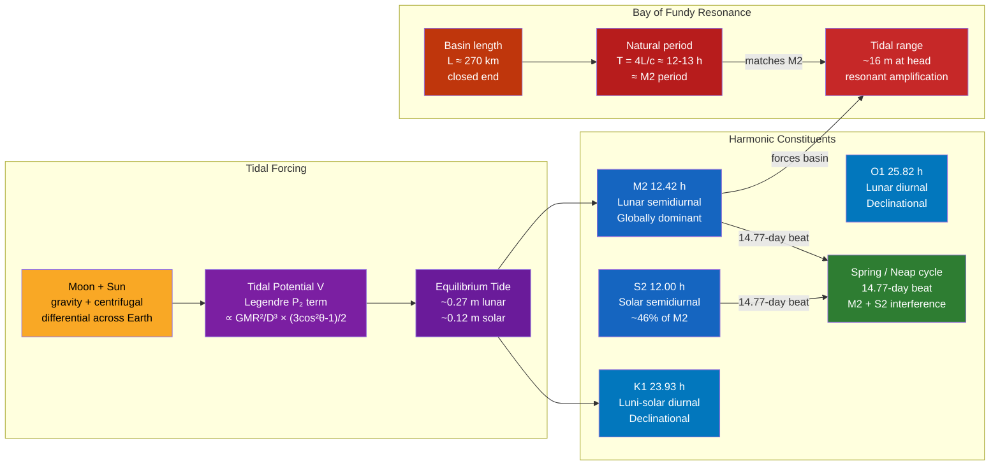

# 🌊 Tides and Tidal Dynamics

> [!abstract] TL;DR
> Tides are the periodic rise and fall of sea level driven by the differential gravitational pull of the Moon and Sun across Earth's diameter, supplemented by centrifugal effects in the Earth-Moon-Sun system. The ocean's response is decomposed into a spectrum of harmonic constituents — M2 (12.42 h), S2 (12 h), K1 (23.93 h), O1 (25.82 h) — whose amplitudes and phases are unique to each coastal location and determined by harmonic analysis of tidal records. Extreme tidal ranges such as the ~16 m tides of the Bay of Fundy arise not from unusual forcing but from resonance: the natural oscillation period of the basin nearly matches the M2 tidal period, producing dramatic standing-wave amplification. Tidal energy dissipates at roughly 3.7 TW worldwide, gradually decelerating Earth's rotation (day length increases ~1.4 ms per century) and pushing the Moon outward at 3.8 cm per year.

---

## Intuition

**Analogy:** Think of the ocean as a bathtub that someone is gently rocking from one end. The water sloshes back and forth, building up at one end and receding at the other. If you rock the bathtub at exactly its natural resonant frequency, the slosh grows and grows — a small push each cycle amplifies into dramatic waves. Rock at a different frequency and nothing much happens. Tides are the Moon and Sun rocking Earth's ocean basins twice a day; the Bay of Fundy gets 16-metre tides because the geometry of that basin produces a natural resonance period almost perfectly tuned to the Moon's rocking rhythm.

In more technical terms, the Moon's gravity pulls slightly harder on the side of Earth facing it and slightly less hard on the far side, creating two tidal bulges — a "stretched" ocean — that travels around Earth once per day relative to the Moon. The ocean basins do not respond equally to this forcing: each basin has its own resonant frequencies, amphidromic systems, and frictional properties that shape the local tidal response from less than 0.1 m (open Pacific atolls) to more than 16 m (Bay of Fundy).

---

## How It Works

### Core Mechanics

**1. The Tide-Raising Force and Tidal Potential**

The gravitational potential at a point on Earth's surface due to the Moon (mass $M_M$, distance $D$ to Earth's center) is:

$$V = -\frac{G M_M}{|\mathbf{r} - \mathbf{D}|}$$

Expanding in Legendre polynomials $P_n(\cos\theta)$ where $\theta$ is the angle between the point and the Earth-Moon line, and using $R \ll D$:

$$V = -\frac{G M_M}{D} \sum_{n=0}^{\infty} \left(\frac{R}{D}\right)^n P_n(\cos\theta)$$

- $n = 0$: uniform shift — no tide-raising force
- $n = 1$: produces a uniform acceleration — rigid Earth in free fall feels nothing
- $n = 2$: **the dominant tide-raising term**, the so-called equilibrium tidal potential:

$$V_\text{tide} = -\frac{G M_M R^2}{D^3} \cdot \frac{3\cos^2\theta - 1}{2}$$

This $P_2$ term gives two bulges per Earth rotation (semidiurnal character) and has an amplitude of about 2.7 m² s⁻² at Earth's surface. The equilibrium tidal elevation from the Moon alone is:

$$\zeta_0 = \frac{3}{4} \frac{M_M}{M_E} \left(\frac{R}{D}\right)^3 R \approx 0.27 \text{ m}$$

The Sun contributes an analogous term; the ratio of solar to lunar tidal amplitudes is:

$$\frac{\zeta_\odot}{\zeta_M} = \frac{M_\odot}{M_M} \left(\frac{D_M}{D_\odot}\right)^3 \approx 0.46$$

so solar tides are about 46% as large as lunar tides at any given moment.

**2. From Equilibrium Tide to Tidal Constituents**

The equilibrium tidal potential varies continuously because the Moon moves in an inclined, elliptical orbit and Earth rotates relative to the Moon-Sun system. Darwin (1879) and Doodson (1921) decomposed this time-varying potential into a sum of discrete harmonic terms, each with a precisely known angular frequency derived from five astronomical parameters:

| Constituent | Period (h) | Origin | Relative amplitude |
|-------------|-----------|--------|-------------------|
| **M2** | 12.4206 | Principal lunar semidiurnal | 1.000 |
| **S2** | 12.0000 | Principal solar semidiurnal | 0.465 |
| N2 | 12.6583 | Lunar elliptic semidiurnal | 0.192 |
| K2 | 11.9672 | Luni-solar declinational semidiurnal | 0.126 |
| **K1** | 23.9345 | Luni-solar declinational diurnal | 0.584 |
| **O1** | 25.8194 | Principal lunar diurnal | 0.415 |
| P1 | 24.0659 | Principal solar diurnal | 0.193 |
| Q1 | 26.8684 | Lunar elliptic diurnal | 0.079 |

The four constituents in bold — M2, S2, K1, O1 — capture ~95% of the tidal signal at most global locations.

**3. Tidal Prediction by Harmonic Summation**

Given a record of past tides at a port, harmonic analysis (e.g., using the MATLAB package T_TIDE or Python's `uptide`) fits amplitudes $A_n$ and phases $\phi_n$ for each constituent. The prediction for future sea level is:

$$h(t) = H_0 + \sum_{n=1}^{N} A_n \cos(\omega_n t - \phi_n)$$

where $\omega_n = 2\pi / T_n$, $H_0$ is mean sea level, and the sum is typically over 37–60 constituents for operational tide tables. Modern tidal predictions from a 19-year record (one nodal cycle) achieve RMS errors below 5 cm at most locations.

**4. Spring and Neap Tides**

M2 and S2 together produce the familiar spring/neap cycle. When they are in phase (new moon and full moon), their amplitudes add: **spring tides**. When they are 180° out of phase (first and third quarter moon): **neap tides**. The beat period is:

$$T_\text{spring/neap} = \frac{1}{f_{S2} - f_{M2}} = \frac{1}{\frac{1}{12.00} - \frac{1}{12.4206}} \approx 354 \text{ h} = 14.77 \text{ days}$$

which equals half the synodic month (29.53 / 2 = 14.77 days).

**5. Diurnal vs Semidiurnal Tides**

Whether a location experiences two tides per day (semidiurnal), one tide per day (diurnal), or a mixture (mixed semidiurnal) depends on the relative amplitudes of the K1/O1 (diurnal) versus M2/S2 (semidiurnal) constituents at that location. The **tidal form factor** $F = (K_1 + O_1) / (M_2 + S_2)$ classifies regimes:
- $F < 0.25$: semidiurnal (Atlantic coasts)
- $0.25 < F < 1.5$: mixed, predominantly semidiurnal (US Pacific coast)
- $1.5 < F < 3.0$: mixed, predominantly diurnal (Gulf of Mexico, Gulf of Tonkin)
- $F > 3.0$: diurnal (some South-East Asian coasts)

**6. Tidal Propagation — Kelvin Waves and Amphidromic Points**

Tides propagate as Kelvin waves — long gravity waves modified by Earth's rotation (Coriolis effect). In the Northern Hemisphere, a Kelvin wave traveling along a coastline hugs the right-hand boundary (coast on its right); in basins, this produces counterclockwise rotation. The wave amplitude is zero at an **amphidromic point** — a node in the tidal standing wave pattern — around which tidal phase rotates (cotidal lines radiating outward). High tide sweeps clockwise around the North Sea amphidromic point roughly every 12.4 hours.

**7. Bay of Fundy Resonance**

For a closed-ended rectangular basin of length $L$ and mean depth $H$, the fundamental resonant period is a quarter-wavelength condition:

$$T_\text{natural} = \frac{4L}{c}, \quad c = \sqrt{gH}$$

For the Bay of Fundy/Gulf of Maine system:
- Effective length $L \approx 270$ km (Bay of Fundy alone) to $690$ km including the Gulf of Maine
- Mean depth $H \approx 75$–$100$ m → $c = \sqrt{9.81 \times 90} \approx 29.7$ m/s
- $T_\text{natural} \approx 4 \times 270{,}000 / 29.7 \approx 36{,}364$ s $\approx$ **10–13 h**

This is close to the M2 period of 12.42 h. Near-resonance amplifies the equilibrium tide (~0.27 m) by a factor of ~30–40 to produce tidal ranges exceeding 16 m at Burntcoat Head, Nova Scotia — the highest tides on Earth. The resonant amplification factor for a lightly damped system scales as $Q / \pi$ near resonance, where $Q$ is the quality factor of the basin.

**8. Tidal Dissipation and Earth's Rotational Slowdown**

Tidal energy is dissipated at a global rate of approximately **3.7 TW** (Egbert & Ray, 2000, from TOPEX/Poseidon satellite altimetry):
- ~2.5 TW in shallow epicontinental seas (Yellow Sea, Patagonian Shelf, Northwest Australian Shelf, European shelf) — bottom friction in water depths < 200 m
- ~1.0 TW in the deep ocean — tidal flow over rough topography (mid-ocean ridges, seamounts) generates **internal tides** (internal waves at tidal frequency) that break and mix the deep water column

This dissipation slows Earth's rotation. The mechanism is a phase lag between the tidal bulge and the Earth-Moon line: Earth's rotation carries the bulge slightly **ahead** of the sub-lunar point. The Moon pulls backward on this ahead bulge, exerting a decelerating torque on Earth. By Newton's third law, Earth's gravity accelerates the Moon forward, causing it to spiral outward (Kepler's third law: larger orbit = slower orbital speed = gained total energy — the Moon gains energy even as Earth loses rotational energy to tides).

Consequences:
- **Day length** increases by ~1.4 ms per century (paleontological evidence from Devonian coral growth rings confirms ~400 days/year at ~380 Ma, compared with 365.25 today)
- **Moon's recession**: 3.82 ± 0.07 cm/yr, measured directly by lunar laser ranging from Apollo retroreflectors
- In ~50 billion years (long after the Sun becomes a red giant), Earth would be tidally locked to the Moon with a ~47-day month/day — both bodies showing the same face to each other

### Flow / Architecture



---

## Key Concepts / Details

### Secondary Level

**What is a tide?** A tide is the periodic rise and fall of sea level driven by the gravitational pull of the Moon (and, to a lesser extent, the Sun). The Moon pulls more strongly on the ocean water nearest it and less strongly on the ocean water on the far side — this differential pull stretches the ocean into two bulges, one pointing toward the Moon and one pointing away. As Earth rotates under these two bulges, a coastal observer sees two high tides and two low tides per day.

**Why two tides per day?** The far-side bulge exists because the centrifugal tendency associated with Earth's revolution around the Earth-Moon center of mass acts outward there, effectively "pushing" water away from the Moon. Intuitively: imagine stretching a water balloon from both ends simultaneously — it bulges at both ends.

**Spring and neap tides.** At new moon and full moon, the Moon and Sun pull in the same direction (or opposite directions along the same line), and their tidal effects add: spring tides with the largest tidal range. At the quarter moons (Moon at 90° to the Sun as seen from Earth), their effects partially cancel: neap tides with the smallest range. The cycle repeats every ~14.77 days (half a lunar month).

**Why not all coasts have two tides per day.** Tidal forcing always drives both semidiurnal (twice-daily) and diurnal (once-daily) components. The coast's response depends on which resonances are excited. Coasts like the Gulf of Mexico and Gulf of Tonkin, where basin geometry strongly amplifies the diurnal K1/O1 constituents relative to M2/S2, experience mainly one tide per day.

**Tidal bores.** In funnel-shaped estuaries where tidal range is large, the incoming flood tide can arrive as a turbulent wave front called a tidal bore — a single wave of whitewater advancing upstream faster than the river's current. Notable bores: the Qiantang River bore (China, up to 9 m, speed ~25 km/h) and the Severn Bore (England, up to 2 m, 10+ km/h).

---

### Undergraduate Level

**Tidal Potential in Detail**

The full tidal potential for the Moon (taking only the $n = 2$ term) at Earth's surface is:

$$V_2 = -\frac{G M_M R^2}{D^3} P_2(\cos\theta) = -\frac{G M_M R^2}{D^3} \cdot \frac{3\cos^2\theta - 1}{2}$$

This has three components that contribute to the tidal spectrum:
1. A term proportional to $\cos^2\delta$ (where $\delta$ is Moon's declination), giving the semidiurnal tides — oscillates at frequency 2σ (twice Earth's rotation rate relative to the Moon)
2. A term proportional to $\sin 2\delta$, giving the diurnal tides — oscillates at frequency σ
3. A term proportional to $\frac{3}{2}\sin^2\delta - 1$, giving the long-period tides (fortnightly, monthly)

The Doodson number system uses six integers to enumerate all tidal constituents from the six fundamental astronomical frequencies (mean lunar time, mean solar time, Moon's longitude, Sun's longitude, Moon's perigee longitude, node of Moon's orbit).

**Harmonic Analysis (Tidal Prediction)**

Given a sea-level time series $\eta(t)$, harmonic analysis performs a least-squares fit to determine $A_n$ and $\phi_n$ for each constituent at known frequency $\omega_n$:

$$\eta(t) = H_0 + \sum_{n} f_n A_n \cos(\omega_n t + u_n - \phi_n)$$

where $f_n$ and $u_n$ are nodal corrections accounting for the 18.6-year cycle of the Moon's orbital node. A minimum of 29 days of data is needed to separate the major constituents; a full nodal period (18.6 years) is required for the highest accuracy. The MATLAB package **T_TIDE** (Pawlowicz et al. 2002) is the standard tool; Python packages include `uptide` and `utide`.

**Amphidromic Points and Cotidal Charts**

In a rotating basin, the Coriolis effect deflects tidal wave propagation, creating amphidromic points where the tidal amplitude is zero and around which tidal phase rotates continuously. On a cotidal chart:
- Lines of equal tidal phase (cotidal lines) radiate from each amphidromic point
- Lines of equal amplitude (corange lines) form concentric rings around it
- Phase increases counterclockwise around amphidromic points in the Northern Hemisphere (Kelvin waves travel with the coast on their right, so counterclockwise in semi-enclosed basins)

The North Sea has three major amphidromic points; the M2 tidal wave rotates counterclockwise around them with high water sweeping from south to north along the British coast and from north to south along the Dutch/German/Danish coast.

**Kelvin Wave Model of Tidal Propagation**

Tidal waves in the open ocean and in wide channels are Kelvin waves — gravity waves for which the Coriolis force is balanced by the pressure gradient perpendicular to the wave direction, with the wave amplitude exponentially trapped toward one coast:

$$\eta(y, t) = A e^{-f y / c} \cos(kx - \omega t)$$

where $f$ is the Coriolis parameter, $c = \sqrt{gH}$ the phase speed, and $y$ is distance from the coast. The trapping scale $c/f$ (the barotropic Rossby radius) is ~2000 km for the open ocean and ~300 km on continental shelves — much larger than most basins, which is why coast-trapped Kelvin waves dominate in channels and estuaries.

**Resonance Condition in More Detail**

For a channel of uniform depth $H$ and length $L$ closed at one end and open (forced) at the other, the resonance condition for the lowest mode is $L = \lambda/4$, i.e., $T_n = 4L / [(2n-1)\sqrt{gH}]$. The amplitude amplification ratio at the closed end relative to the open end is $1 / \cos(kL)$, which diverges as $kL \to \pi/2$ (resonance). In practice, friction limits the amplification to a finite $Q$ factor. For the Bay of Fundy, $Q \approx 5$–10, meaning the tidal range is amplified by a factor of ~5–10 over the equilibrium tide at resonance.

---

### Graduate Level

**Tidal Dissipation Budget (Egbert & Ray 2000)**

By applying energy conservation to the barotropic tidal equations and assimilating TOPEX/Poseidon satellite altimetry into a tidal model (TPXO), Egbert & Ray (2000) mapped the global distribution of tidal energy dissipation:

$$\frac{\partial E}{\partial t} + \nabla \cdot \mathbf{F} = -D$$

where $E = \frac{1}{2}\rho g \eta^2 + \frac{1}{2}\rho H |\mathbf{u}|^2$ is tidal energy density, $\mathbf{F} = \rho g \eta H \mathbf{u}$ is tidal energy flux, and $D$ is the dissipation rate. Key findings:
- Total M2 dissipation: ~2.52 TW; total barotropic tidal dissipation ~3.7 TW
- **Shallow-sea hotspots** (>2.5 TW): European shelf/Irish Sea, Yellow Sea, Patagonian Shelf, NW Australian Shelf, Gulf of Maine — dominated by bottom-boundary-layer drag $D \approx C_d \rho |\mathbf{u}|^3$
- **Deep-ocean hotspots** (~1 TW): Hawaiian Ridge, French Polynesian Ridge, mid-ocean ridges — tidal flow over rough topography generates **internal tides** (baroclinic tidal waves along density surfaces) which propagate hundreds of kilometers before breaking as internal wave turbulence

**Internal Tides and Tidal Mixing**

When barotropic tidal flow encounters a submarine ridge or seamount, part of the tidal energy is converted to baroclinic (internal) tides at the tidal frequency. These propagate as low-mode internal waves along isopycnal surfaces. The conversion rate scales as:

$$E_\text{conv} \propto \frac{N^2 - \omega^2}{\omega^2 - f^2} \cdot h_0^2 \cdot k^2 \cdot U_0^2$$

where $N$ is the buoyancy frequency, $f$ Coriolis parameter, $h_0$ the topographic amplitude, $k$ the wavenumber, and $U_0$ the barotropic tidal velocity. Internal tides at the Hawaii Ridge radiate ~20 GW of energy into the Pacific and are visible in satellite altimetry as sea-surface ripples 1–3 cm high with wavelengths of 150–200 km.

**Earth's Rotational Slowdown and Angular Momentum Budget**

The tidal torque on Earth's rotation comes from the phase-lagged tidal bulge. If the bulge leads the sub-lunar point by angle $\delta$ (due to ocean friction), the Moon exerts a retarding torque:

$$\tau = -\frac{3}{2} \frac{G M_M^2 R^5}{D^6} k_2 \sin 2\delta$$

where $k_2 \approx 0.30$ is the second-degree Love number (ocean's elastic response factor). The resulting angular deceleration:

$$\frac{d\omega_E}{dt} = \frac{\tau}{I_E} \approx -5.6 \times 10^{-22} \text{ rad/s}^2$$

giving the day length increase of ~1.4 ms/century. The angular momentum removed from Earth's rotation is transferred to the Moon's orbital angular momentum $L_M = M_M \sqrt{G M_E D}$:

$$\frac{dD}{dt} = \frac{2 D^{3/2}}{\sqrt{G M_E} M_M} \cdot \frac{|dL_M/dt|}{1} \approx 3.82 \text{ cm/yr}$$

The total energy dissipated equals the loss in tidal potential energy plus the loss in Earth's rotational kinetic energy; both flow to oceanic heat. The Moon actually **gains** total mechanical energy (orbital KE + PE) as it recedes because the PE increase outweighs the KE decrease — an apparent paradox resolved by recognizing that tidal friction drives the Moon uphill while the ocean pays for it thermally.

**Tidal Influence on Ocean Mixing (Mixing Hotspots)**

Internal-tide breaking at rough topography accounts for ~30% of the diapycnal mixing power needed to maintain the observed global stratification. Munk (1966) estimated that ~2 TW of mechanical energy is needed to upwell Antarctic Bottom Water and maintain the global thermohaline overturning; tidal mixing provides ~1 TW toward this budget, with wind-forced near-inertial waves providing most of the rest. Strong tidal mixing hotspots near ridges create locally elevated $K_\rho$ (diapycnal diffusivity reaching $10^{-3}$ m² s⁻¹ vs. the open-ocean background of $10^{-5}$ m² s⁻¹), which influences the ventilation age of deep-water masses and nutrient supply to the upper ocean.

---

## Python Demo

```python
import numpy as np
import matplotlib.pyplot as plt

# Tidal harmonic constituents for Brest, France
# (classic semidiurnal port; constituent values from SHOM tide tables)
# Format: (name, period_h, amplitude_m, phase_deg)
constituents = [
    ("M2", 12.4206, 2.025, 135.0),  # principal lunar semidiurnal
    ("S2", 12.0000, 0.702, 175.0),  # principal solar semidiurnal
    ("K1", 23.9345, 0.152, 226.0),  # luni-solar diurnal
    ("O1", 25.8194, 0.122, 200.0),  # principal lunar diurnal
]

# Time array: 30 days at 6-minute (0.1 h) resolution
dt = 0.1          # hours
t = np.arange(0, 30 * 24, dt)  # hours from epoch
days = t / 24.0

# Tidal prediction: h(t) = Sigma A_n * cos(omega_n * t - phi_n)
H0 = 0.0
h = np.full_like(t, H0)
for name, period, amplitude, phase_deg in constituents:
    omega = 2 * np.pi / period       # rad/hr
    phi   = np.deg2rad(phase_deg)
    h    += amplitude * np.cos(omega * t - phi)

# Spring/neap beat period between M2 and S2
f_M2 = 1.0 / 12.4206   # cycles/hr
f_S2 = 1.0 / 12.0000
beat_period_hrs = 1.0 / (f_S2 - f_M2)
beat_period_days = beat_period_hrs / 24
print(f"Spring/neap beat period: {beat_period_days:.2f} days  (expected: ~14.77 days)")

# Identify spring-tide times (M2 and S2 in phase => beat cosine maximum)
n_springs = int(30 / beat_period_days) + 2
spring_days = [n * beat_period_days for n in range(n_springs) if n * beat_period_days <= 30]

# Compute running tidal range as proxy for spring/neap envelope
window = int(13 / dt)  # 13-hour sliding window (one M2 cycle)
h_max = np.array([h[max(0, i-window//2):i+window//2+1].max() for i in range(len(h))])
h_min = np.array([h[max(0, i-window//2):i+window//2+1].min() for i in range(len(h))])
tidal_range = h_max - h_min

# ---- Plotting ---------------------------------------------------------------
fig, axes = plt.subplots(2, 1, figsize=(14, 8), sharex=False)

# Top panel: 30-day tide prediction with spring/neap markers
ax1 = axes[0]
ax1.plot(days, h, color='#1565C0', linewidth=0.7, label='Predicted tide')
ax1.plot(days, h_max, 'r--', linewidth=1.0, alpha=0.6, label='Tidal range envelope')
ax1.plot(days, h_min, 'r--', linewidth=1.0, alpha=0.6)
ax1.axhline(0, color='gray', linewidth=0.5, linestyle='-')
for i, ts in enumerate(spring_days):
    ax1.axvline(ts, color='#E53935', linewidth=1.5, linestyle=':',
                alpha=0.8, label='Spring tide' if i == 0 else None)
# Neap tides halfway between spring tides
neap_days = [(spring_days[i] + spring_days[i+1]) / 2 for i in range(len(spring_days)-1)]
for i, tn in enumerate(neap_days):
    ax1.axvline(tn, color='#388E3C', linewidth=1.5, linestyle=':',
                alpha=0.8, label='Neap tide' if i == 0 else None)
ax1.set_ylabel('Sea Level Anomaly (m)', fontsize=11)
ax1.set_title('30-Day Tidal Prediction — Brest, France  (M2 + S2 + K1 + O1)',
              fontsize=11)
ax1.legend(fontsize=9, loc='upper right')
ax1.set_xlim(0, 30)
ax1.grid(True, alpha=0.3)

# Bottom panel: first 3 days showing individual constituents
ax2 = axes[1]
mask_3d = t <= 3 * 24
t_zoom   = t[mask_3d]
days_zoom = days[mask_3d]
ax2.plot(days_zoom, h[mask_3d], 'k-', linewidth=2.0, label='Total (sum of constituents)')
colors_c = ['#1565C0', '#E65100', '#2E7D32', '#6A1B9A']
for (name, period, amplitude, phase_deg), col in zip(constituents, colors_c):
    omega = 2 * np.pi / period
    phi   = np.deg2rad(phase_deg)
    h_c   = amplitude * np.cos(omega * t_zoom - phi)
    ax2.plot(days_zoom, h_c, '--', linewidth=1.5, color=col, alpha=0.85,
             label=f'{name}  T={period:.2f} h  A={amplitude:.3f} m')
ax2.set_xlabel('Time (days from epoch)', fontsize=11)
ax2.set_ylabel('Sea Level Anomaly (m)', fontsize=11)
ax2.set_title('First 3 Days — Constituent Breakdown', fontsize=11)
ax2.legend(fontsize=9, loc='upper right')
ax2.set_xlim(0, 3)
ax2.grid(True, alpha=0.3)

plt.tight_layout()
plt.savefig('tidal_prediction_brest.png', dpi=150)
plt.show()

# Expected output for spring/neap beat:
#   Spring/neap beat period: 14.77 days  (expected: ~14.77 days)
# In the top panel you should see:
#   ~2 spring-tide peaks (red dashed) and ~2 neap troughs (green dashed)
#   within the 30-day window, with maximum range ~5.5 m at spring
#   and minimum range ~2.6 m at neap
```

---

## Real-World Notes

- **Bay of Fundy, Canada** — The Bay of Fundy/Gulf of Maine system holds the world record tidal range at Burntcoat Head, Nova Scotia: 16.3 m. The basin's natural resonance period of ~12–13 h closely matches M2 (12.42 h), and the funnel-shaped geometry concentrates the oscillating water volume toward the head. Tidal currents exceed 5 knots in the Minas Passage. The twice-daily emptying and filling of the bay processes ~115 km³ of water.

- **Thames Barrier, London** — The Thames Barrier (1982) protects London from storm surge events superimposed on the normal tidal cycle. It closes against ~28 events per year; the count is rising with sea-level rise. The barrier is designed to handle tidal surges of 4 m above the predicted astronomical tide, the highest possible combination of North Sea surge and M2 high water. It exemplifies the engineering consequence of tidal dynamics in a funneling estuary (the Thames narrows from ~8 km at the sea to ~300 m at London Bridge).

- **La Rance Tidal Power Plant, France** — Opened in 1966 and still the world's second-largest tidal barrage (240 MW), La Rance uses the ~13 m tidal range at the Rance estuary (near Brest, Brittany) where M2 is dominant. Tidal power from a barrage scales as $P \propto A_\text{basin} \cdot \Delta h^2$, where $\Delta h$ is the tidal range — large range squared makes Atlantic French coasts uniquely attractive.

- **North Sea Amphidromic System** — The North Sea contains three counterclockwise M2 amphidromic points (off the English coast, near Holland, and north of Scotland). High water rotates counterclockwise around each; at the central amphidromic point the tidal range is effectively zero. The result is that high tide arrives at the Thames Estuary about 6 hours later than at the Orkney Islands — the tidal wave sweeps the full length of the North Sea in a single M2 half-period.

- **Qiantang River Bore, China** — The Qiantang River bore (Hangzhou Bay) is one of the world's most powerful, reaching 9 m height and traveling at ~25 km/h. It arises because the funnel-shaped bay (110 km wide at the mouth, narrowing to 3 km at Hangzhou) compresses the tidal wave into a solitary bore front every high tide. The bore has been a tourist attraction and maritime hazard for over 2000 years; ancient navigators used it to time trading voyages up the river.

- **Tidal Navigation History** — Before GPS, precise knowledge of tide tables was operationally critical. The D-Day Normandy invasion (June 6, 1944) was specifically timed to a period of spring tides followed by a rising tide at dawn, to expose German beach obstacles (designed to be submerged at high tide) while providing sufficient depth for landing craft. General Eisenhower's meteorologists and tidal analysts provided the narrow window of acceptable tidal conditions that ultimately determined the invasion date.

- **Tidal Energy from the Moon-Earth System** — The 3.82 cm/yr lunar recession measured by lunar laser ranging (LLR from Apache Point, McDonald, Matera, and Grasse observatories) is direct evidence of tidal energy transfer. The Moon was ~30 Earth radii closer 2 billion years ago; Precambrian tidal rhythmites (laminated sediments from ancient tidal flats) show ~800 days/year at ~900 Ma, consistent with the measured deceleration.

---

## Common Pitfalls

- **Assuming tides are always semidiurnal** — In much of the Pacific (Gulf of Mexico, Sea of Okhotsk, Gulf of Tonkin) and parts of Southeast Asia, diurnal tides (one high and one low per day) dominate because the basin geometry resonantly amplifies K1/O1 over M2/S2. Using a semidiurnal tide table for a diurnal coast will predict high tides at low-tide times. Always check the tidal form factor $F$ for the location.

- **Confusing tidal resonance with tidal forcing strength** — The equilibrium tidal amplitude is roughly 0.27 m (lunar) everywhere on Earth. The 16-m Bay of Fundy tides, 13-m Brittany tides, and <0.1-m Mediterranean tides all receive the same tidal forcing; the difference is entirely due to resonance (or lack of it). The Mediterranean is nearly enclosed with no resonance near semidiurnal periods, giving tidal ranges of 10–30 cm. The Atlantic funnel-shaped seas are near-resonant, giving 5–16 m ranges.

- **Thinking the tidal bulge faithfully tracks the Moon** — The equilibrium tidal theory assumes a frictionless ocean that instantly adjusts to the tidal potential. The real ocean is a finite ocean with resonances, coastlines, friction, and a finite wave speed (~200 m/s for barotropic waves). High water at a given port may lead or lag the Moon's transit by several hours. The "age of the tide" (time between new/full moon and the subsequent spring tide) averages ~2 days at most Atlantic ports, reflecting the finite response time of the ocean.

- **Neglecting nodal corrections in multi-year tidal analysis** — The amplitude and phase of tidal constituents vary slowly with the 18.6-year cycle of the Moon's orbital node (the nodal correction factors $f_n$ and $u_n$). Omitting these corrections introduces systematic errors of ~±4% in M2 amplitude and up to ±3° in phase when comparing tidal analyses from different years. Operational tide prediction software (T_TIDE, OTIS, TPXO) applies these corrections automatically.

- **Misidentifying tidal energy dissipation location** — It is intuitive to imagine tidal energy dissipating primarily in deep basins where tides feel large. In fact, ~70% of global tidal dissipation occurs in shallow epicontinental seas where bottom friction is efficient; the deep ocean contributes only ~27% (mainly via internal tide generation at topography). Open-ocean tidal amplitudes are small (~0.3 m) but the volume is enormous; shallow-sea velocities (0.5–2 m/s) dominate the $C_d \rho |\mathbf{u}|^3$ friction term.

---

## Related Concepts

**Same vault (Oceanography):**

- [[Surface_Gravity_Waves]] — Tides are the extreme long-period limit of surface gravity waves; the same shallow-water wave speed $c = \sqrt{gH}$ governs both tidal Kelvin waves and tsunami propagation.
- [[Internal_Waves_and_Solitons]] — Internal tides are the baroclinic component generated when barotropic tidal flow encounters topography; they carry ~1 TW of tidal energy into the deep ocean.
- [[Turbulence_and_Diapycnal_Mixing]] — Internal-tide breaking is a primary source of diapycnal mixing in the deep ocean, driving upwelling of abyssal water; the tidal mixing hotspot near the Hawaiian Ridge is a canonical example.
- [[Tsunamis_and_Storm_Surges]] — Both share the shallow-water wave physics of tidal propagation; storm surges superimpose on the astronomical tide to create dangerous compound flooding events (Thames Barrier context).
- [[Coastal_Circulation_and_Estuaries]] — Tidal forcing drives estuarine exchange flow, tidal mixing, and sediment transport; tidal bores are an extreme manifestation of tidal propagation into funnel-shaped estuaries.
- [[_MOC_Waves_Tides_Coastal]] — Section map of all Waves, Tides, and Coastal Dynamics notes in this vault.
- [[Seawater_Properties_and_Equation_of_State]] — Tidal mixing changes local temperature and salinity, modifying the equation of state and buoyancy structure near tidal mixing hotspots.
- [[Temperature_Salinity_Diagrams_and_Water_Masses]] — Tidal mixing hotspots near ridges create anomalous T/S signatures visible in hydrographic sections adjacent to regions of high internal-tide energy.

**Cross-vault:**

- [[Orbital_Mechanics_and_Celestial_Dynamics]] — The Moon's orbital parameters (inclination, eccentricity, nodal precession) directly determine the frequencies of all tidal constituents via Doodson's harmonic expansion of the tidal potential; the Moon's recession is a direct consequence of tidal angular-momentum transfer.
- [[Wave_Motion_and_Properties]] — Tidal Kelvin waves, standing waves in basins, and tidal bores are all governed by wave dispersion relations; the quarter-wavelength resonance condition for the Bay of Fundy is a direct application of standing-wave theory.
- [[Oscillations_and_SHM]] — The resonance amplification of tides in semi-enclosed basins (Bay of Fundy $Q \approx 5$–10) is identical in physics to the resonance of a driven damped oscillator; the tidal bore is an extreme-amplitude nonlinear oscillation.
- [[Newtons_Laws_and_Kinematics]] — Universal gravitation and the inverse-square law underlie the tidal potential; the tidal torque mechanism (retarding torque, lunar acceleration) is a direct application of Newton's third law.
- [[Rotational_Dynamics]] — Earth's rotational deceleration and the Moon's orbital angular momentum gain are connected through conservation of total angular momentum of the Earth-Moon system; Euler's equations describe the precession of Earth's axis partially driven by tidal torques.
- [[Waves_in_Fluids_and_Acoustics]] — Shallow-water wave theory (acoustic analogy: pressure waves with $c = \sqrt{gH}$ playing the role of sound speed) is the fundamental framework for barotropic tidal propagation and Kelvin wave solutions.
- [[_MOC_Physics_Master]] — Entry point to the Physics vault; Classical Mechanics and Fluid Mechanics sections are most relevant to tidal dynamics.
- [[_MOC_Astronomy_Master]] — Entry point to the Astronomy vault; Solar System and Planetary Science section covers tidal locking, Laplace resonance of Galilean moons, and the long-term evolution of the Earth-Moon system.

---

## Review Questions

### Secondary Level

1. The Mediterranean Sea has tidal ranges of only 10–30 cm, while the Bay of Fundy has ranges exceeding 16 m, yet both experience the same tidal forcing from the Moon. What single physical principle explains this difference, and what would you need to know about a basin to predict whether it will have large or small tides?

2. A coastal town records high tide at exactly noon on Monday. Approximately when will the next high tide occur, and when will the following Monday's noon-time tide be higher or lower than today's — and why? (Hint: consider spring/neap cycle duration.)

3. Why do some coasts experience only one tide per day even though the Moon creates two tidal bulges? Name a specific location and explain what feature of that coast's tidal response leads to diurnal dominance.

### Undergraduate Level

1. Derive the formula for the equilibrium tidal elevation $\zeta_0$ at Earth's surface due to the Moon, starting from the $P_2(\cos\theta)$ term of the tidal potential. Explain why the equilibrium tide has two maxima (sublunar and antipodal) rather than one. What is the numerical value of $\zeta_0$ for the Moon, and why is the observed tidal range at ocean coasts so much larger?

2. The Bay of Fundy has a mean depth of ~75 m and effective length ~270 km. Calculate the quarter-wavelength resonance period and compare it with the M2 period. By what factor is the equilibrium tide amplitude amplified, and what limits this amplification in practice?

3. Explain why the North Sea has amphidromic points where the tidal range is zero. Draw a sketch of cotidal and corange lines around an amphidromic point in the Northern Hemisphere, showing the direction of tidal phase rotation. What would the pattern look like in the Southern Hemisphere?

### Graduate Level

1. Using the TOPEX/Poseidon tidal dissipation estimate of Egbert & Ray (2000), describe the two distinct physical mechanisms by which tidal energy is dissipated in (a) shallow epicontinental seas and (b) the deep ocean near rough topography. Why does the deep-ocean mechanism matter disproportionately for abyssal ocean mixing relative to its share of total dissipation?

2. Derive qualitatively (from angular momentum conservation) the relationship between tidal energy dissipation rate $\dot{E}$, Earth's rotational deceleration $d\omega_E/dt$, and the lunar recession rate $dD/dt$. Show that tidal friction transfers angular momentum from Earth's spin to the Moon's orbit and that the Moon gains total mechanical energy despite this apparently decelerating effect. What does this imply for the eventual fate of the Earth-Moon system?

3. Internal tides generated at the Hawaiian Ridge carry ~20 GW into the Pacific. Describe the conversion mechanism (barotropic → baroclinic), the observed horizontal propagation characteristics visible in satellite altimetry, and the eventual fate of this energy. How does this tidal mixing contribution fit into the Munk (1966) abyssal mixing budget, and what observational evidence (from profiling floats, microstructure surveys) confirms the elevated $K_\rho$ near ridge topography?

---

## Sources

- Munk, W. H., & Cartwright, D. E. (1966). Tidal spectroscopy and prediction. *Philosophical Transactions of the Royal Society A*, 259(1105), 533–581. — Landmark paper establishing the modern harmonic analysis framework and tidal potential decomposition.
- Egbert, G. D., & Ray, R. D. (2000). Significant dissipation of tidal energy in the deep ocean inferred from satellite altimeter data. *Nature*, 405, 775–778. — First satellite-based estimate of the global tidal dissipation budget and identification of deep-ocean dissipation sites.
- Defant, A. (1961). *Physical Oceanography*, Vol. 2. Pergamon Press. — Classical reference covering tidal theory, resonance, amphidromic systems, and tidal observations worldwide.
- Pugh, D. T. (1987). *Tides, Surges and Mean Sea Level*. Wiley. — Comprehensive treatment of tidal analysis, prediction, storm surges, and sea-level measurement.
- Munk, W. (1997). Once again: once again — tidal friction. *Progress in Oceanography*, 40, 7–35. — Review of tidal dissipation, Earth rotation, and the ocean's role in the tidal energy budget.
- Garrett, C. (1972). Tidal resonance in the Bay of Fundy and Gulf of Maine. *Nature*, 238, 441–443. — Classic analysis of the Bay of Fundy resonance mechanism.
- Pawlowicz, R., Beardsley, B., & Lentz, S. (2002). Classical tidal harmonic analysis including error estimates in MATLAB using T_TIDE. *Computers & Geosciences*, 28(8), 929–937. — Reference for the standard harmonic analysis software.

---

#Oceanography #WavesTidesCoastal #Tides #TidalDynamics #LunarTides
