# Tsunamis and Storm Surges

> [!abstract] TL;DR
> A **tsunami** is a series of very long shallow-water waves generated by a sudden large-scale displacement of the ocean floor — most commonly by a megathrust earthquake, but also by submarine landslides and volcanic flank collapses. In the open ocean the wave is barely detectable (30–60 cm tall, 200 km wavelength), but it travels at jet-aircraft speed (~700 km/h) and shoals catastrophically near shore, piling up to 30 m or more through Green's Law energy conservation. A **storm surge** is an entirely different hazard — a meteorologically-driven piling of seawater against a coast produced by wind stress and a drop in barometric pressure, superimposed on the astronomical tide; the 1953 North Sea surge and 2005 Hurricane Katrina surge (8 m) rank among the deadliest coastal disasters in recorded history. Both phenomena are governed by long-wave, shallow-water dynamics, but their generation mechanisms, timescales, and early-warning challenges are fundamentally distinct.

---

## Intuition

**Analogy:** Drop a coin into a bathtub — the small circular ripples spread quickly but are too tiny to notice. Now imagine the entire 1000 km floor of the bathtub suddenly heaves upward by 5 m. The initial wave is broad and nearly flat — you might not notice it if you were swimming above the rupture — but as it races toward the shallow end of the tub and the water runs out of room, every bit of that gentle slope gets compressed vertically into a towering wall.

That is exactly the mechanism of a tsunami. The "coin" is a subducting tectonic plate snapping upward over hundreds of kilometres; the "bathtub" is the Pacific Ocean. In 4000 m of open water the wave speed is $c = \sqrt{gh} \approx 200$ m/s (~720 km/h), and the wave height is perhaps 30 cm spread over a 200 km wavelength — essentially undetectable at the surface. As the wave crosses the continental shelf and depth falls from 4000 m to 20 m, the wave slows by a factor of ~14, energy piles up, and amplitude grows by Green's Law to tens of metres. A storm surge works by a different route: sustained hurricane-force winds drag seawater toward a coastline over hours or days, and the associated atmospheric low-pressure system further raises the sea surface by the "inverted barometer" effect (~1 cm per hPa drop). Neither process has anything to do with tides.

---

## How It Works

### Tsunami Generation

A tsunami requires a mechanism that **rapidly displaces a large volume of water vertically**. Three primary sources:

1. **Megathrust earthquakes** — By far the most common cause (~80 % of destructive tsunamis). At a subduction zone, a locked fault suddenly slips, elastically rebounding the overlying plate upward (or downward) by Δh metres over a rupture area of hundreds to thousands of km². The initial sea-surface perturbation $\eta_0 \approx \Delta h$ (corrected for elasticity). Moment magnitude $M_w \gtrsim 7.5$ is usually needed; $M_w \geq 8$ reliably generates a destructive tsunami.

2. **Submarine landslides** — A slope failure displaces water laterally and vertically. Landslide tsunamis can be locally enormous (Lituya Bay 1958: run-up of 524 m) but decay faster with distance because the source is more compact and the wave is shorter-period.

3. **Volcanic processes** — Caldera collapse, flank collapse (Krakatau 2018), or pyroclastic flows entering the sea. Krakatau 1883 generated waves >30 m; the 2018 Anak Krakatau flank collapse created a devastating tsunami with virtually no seismic warning.

### Shallow-Water Wave Speed

Tsunamis behave as **shallow-water waves** because their wavelength $\lambda$ (100–500 km) is vastly greater than the ocean depth $h$ (4 km). In this limit the phase speed is:

$$c = \sqrt{gh}$$

| Depth (m) | Speed (m/s) | Speed (km/h) |
|-----------|-------------|--------------|
| 4000      | 198         | 713          |
| 1000      | 99          | 356          |
| 100       | 31          | 113          |
| 20        | 14          | 50           |
| 5         | 7           | 25           |

Travel time across the Pacific (~10,000 km) is therefore ~10–12 hours — enough time for warnings to reach distant coasts if detection is immediate.

### Amplitude Shoaling — Green's Law

Energy flux must be conserved as the wave crosses a gradually varying bathymetry. For a 1D wave train in a slowly varying channel (no reflections, no dissipation):

$$E \cdot c_g \cdot W = \text{const}$$

where $E \propto a^2$ is the energy density, $c_g = c = \sqrt{gh}$ is the group speed (equal to phase speed for shallow-water waves), and $W$ is the channel width. For a uniform-width coast (W = const):

$$a^2 \sqrt{gh} = \text{const} \quad \Rightarrow \quad a \propto h^{-1/4}$$

This is **Green's Law**. Going from 4000 m to 10 m, the amplitude ratio is $(4000/10)^{1/4} = 400^{1/4} \approx 4.5$, so a 30 cm open-ocean wave becomes ~1.4 m. Convergence of the coastline geometry (bay focusing, submarine ridges) can amplify this further by 3–10×, explaining observed run-ups of 30–40 m.

The full wave energy scales as $E \propto a^2$, so energy density increases as $h^{-1/2}$ — the wave gets much more energetic per unit area as it shoals.

### Run-up and Inundation

**Run-up** R is the maximum vertical height above sea level reached by the water. It exceeds the offshore amplitude because the kinetic energy of the incoming wave converts to potential energy. Empirically and through non-linear shallow-water theory:

$$R \approx 2\,a_{\text{nearshore}} \quad \text{(linear limit)}$$

but non-linear effects and resonance can push $R$ to 3–5× the nearshore amplitude. The **draw-down** (coastal retreat of the sea before the first wave) occurs when the trough of a leading-depression-N-wave arrives first — a critical warning sign.

### Storm Surge Dynamics

A storm surge has three additive components:

1. **Wind setup (dominant):** Wind stress $\tau_w = \rho_a C_D U_{10}^2$ drives water toward the coast. Over a shallow shelf of depth $D$ and fetch $L$, the hydrostatic gradient balances wind stress:

$$\eta_{\text{wind}} = \frac{\tau_w}{\rho_w g D} \cdot L$$

For a category 4 hurricane ($U_{10} \approx 60$ m/s) over a 200 km shelf of depth 20 m, this gives $\eta \approx 3$–5 m. A broad, shallow shelf (Gulf of Mexico) concentrates the surge far more than a narrow, steep one (US Pacific coast).

2. **Inverse barometer effect:** Each 1 hPa drop in atmospheric pressure below the ambient raises sea level by ~1 cm. A strong hurricane with a central pressure 100 hPa below ambient contributes ~1 m of surge. This component is often called the **pressure setup**.

3. **Ekman transport:** Wind-driven surface Ekman transport piles water against the coast when the wind blows with the coast to the right (Northern Hemisphere). This is enhanced in hurricanes making landfall with an onshore right-front quadrant.

Storm surge is superimposed on the astronomical tide — a surge occurring at high tide (as in New Orleans, 2005) is far more destructive than the same surge at low tide.

### Computational Models

- **MOST** (Method Of Splitting Tsunamis) — NOAA's operational tsunami propagation model; uses finite-difference shallow-water equations on a staggered grid.
- **ADCIRC** (Advanced CIRCulation) — unstructured-grid finite-element model used for both tsunami inundation and storm surge; the standard tool for FEMA flood-mapping and hurricane surge prediction.
- **GeoClaw** — adaptive mesh refinement tsunami code; used for probabilistic hazard maps.

### Tsunami Lifecycle Diagram

```mermaid
flowchart LR
    Rupture["Seabed Rupture<br/>Δh = 1-10 m vertical<br/>Length 100-1000 km<br/>Duration 60-300 s"]
    Open["Open Ocean<br/>h ~ 4000 m<br/>c ~ 700 km/h<br/>Amplitude 30-60 cm<br/>Wavelength 100-500 km"]
    DART["DART Buoy Detection<br/>Bottom pressure sensor<br/>SSH anomaly ~ 1 cm<br/>Triggers warning system"]
    Shelf["Continental Shelf<br/>h 200-1000 m<br/>c slows to 160-360 km/h<br/>Amplitude grows<br/>Wavelength compresses"]
    Coast["Coastal Zone<br/>h 10-50 m<br/>c ~ 30-50 km/h<br/>Amplitude 5-30 m<br/>Draw-down visible"]
    Runup["Inundation<br/>Green's Law: a ∝ h^(-1/4)<br/>Run-up R up to 40 m<br/>Inland reach 1-5 km"]

    Rupture -->|"Seabed lifts<br/>water column"| Open
    Open -->|"Radiates outward<br/>in all directions"| DART
    Open -->|"Shallow-water<br/>wave shoals"| Shelf
    DART -->|"Alert issued<br/>within minutes"| Shelf
    Shelf -->|"Wave steepens<br/>speed drops"| Coast
    Coast -->|"Run-up and<br/>wave breaking"| Runup

    style Rupture fill:#dc2626,color:#fff
    style Open fill:#2563eb,color:#fff
    style DART fill:#059669,color:#fff
    style Shelf fill:#0891b2,color:#fff
    style Coast fill:#d97706,color:#fff
    style Runup fill:#7c3aed,color:#fff
```



---

## Key Concepts / Details

### Secondary Level

**What causes a tsunami?**
The ocean floor suddenly moves — most often because two tectonic plates that have been locked together for centuries suddenly slip, lifting the seafloor and the entire water column above it. The energy of that uplift is injected into the ocean as a wave. The word "tidal wave" is a **misnomer**: tides are driven by the Moon and Sun and have nothing to do with seafloor movement. The scientific term is **tsunami** (Japanese: "harbor wave") or, in older literature, **seismic sea wave**.

**Why is open-ocean detection so hard?**
The wave is only 30–60 cm tall but 200 km long. A passing ship would not feel anything unusual; the wave looks like a gentle, slow swell. Only pressure sensors on the seafloor (**DART buoys**) can detect the fractional-centimetre change in water pressure caused by the wave passing overhead.

**The draw-down warning.**
Many tsunamis are preceded by a sudden withdrawal of the sea from beaches — the trough of the leading wave arrives before the crest. This is the most important natural warning sign: if the sea retreats unusually far and quickly, a large wave will follow within minutes. Unfortunately, many people historically walked out to see the exposed seafloor out of curiosity, walking directly into the incoming wave.

**DART buoy warning network.**
The Deep-ocean Assessment and Reporting of Tsunamis (DART) network consists of ~70 bottom-pressure recording stations worldwide, concentrated in the Pacific and Indian Oceans. A buoy detects an anomalous pressure pulse, transmits data via satellite to NOAA within 1–3 minutes, and triggers the Pacific Tsunami Warning Center (PTWC) to issue alerts. Distant coasts (e.g., Japan to Hawaii, ~6,200 km) have hours of warning; local coasts (<100 km from source) have only minutes.

**Storm surge basics.**
When a hurricane approaches shore, its strong onshore winds physically push water against the coast. Additionally, the low atmospheric pressure at the storm's center acts like a partial vacuum on the sea surface. Together, these can add metres to the local water level for hours around landfall — far more than the storm's rain or winds alone.

---

### Undergraduate Level

**Green's Law derivation.**
The shallow-water dispersion relation is $\omega = k\sqrt{gh}$, giving a group velocity $c_g = d\omega/dk = \sqrt{gh}$. For a monochromatic wave in a slowly varying medium (WKB approximation), the wave action $N = E/\omega$ is conserved, and for shallow-water waves with $\omega = const$ on a constant-width coast, this reduces to $E \cdot c_g = a^2 \cdot \sqrt{gh} = \text{const}$. Therefore $a \propto h^{-1/4}$. This derivation assumes gradual depth variation ($|dh/dx| \ll k h$), so it breaks down very near shore. Nonlinear effects (Carrier-Greenspan transformation) must replace Green's Law in the surf zone.

**DART buoy pressure sensing.**
A bottom-pressure recorder (BPR) measures total hydrostatic pressure $P = P_{\text{atm}} + \rho g H(t)$. A 1-cm change in sea-surface height $H$ produces a ~100 Pa (~0.001 atm) pressure anomaly at 5000 m depth. The BPR achieves this precision via a quartz resonator that detects pressure to ~1 Pa. Data are burst-transmitted acoustically to a surface buoy and then via Iridium satellite to PTWC in near-real-time.

**Tsunami travel time modeling (MOST).**
Travel time $T$ from source to coast is computed by integrating $dt = ds/c(x,y)$ along the fastest path — effectively solving the **eikonal equation** using bathymetric data. The MOST model's "T-time" algorithm is a Huygens-principle propagation on a global 4-arc-minute bathymetry grid (ETOPO1). Travel time accuracy is typically ±5 % of actual arrival.

**Storm surge components.**
- **Wind setup:** $\eta_\text{wind} = \frac{\rho_a C_D U^2}{\rho_w g D} L$ with drag coefficient $C_D \approx 1.5 \times 10^{-3}$ at hurricane speeds.
- **Pressure setup (inverted barometer):** $\eta_p = -\Delta p / (\rho_w g) \approx 0.01$ m per hPa drop.
- **Ekman transport:** Depth-integrated transport $M_y = \tau_x / f$ piles water at the coast when onshore Ekman flow is blocked.
- **Resonance:** The surge can resonate with the natural period of a coastal embayment (Helmholtz resonance), amplifying water levels at the head of a bay.

**Hurricane Katrina storm surge (2005).**
At its peak, Katrina's surge reached 8–9 m along the Mississippi coast and 3–6 m in New Orleans, driven by a combination of 5 m pressure setup, ~2 m wind setup amplified by the Lake Borgne funnel, and coincidence with high tide. The surge overtopped and breached New Orleans' levee system, flooding ~80 % of the city. Total surge-related deaths: ~1800. The event revealed that the levee design had assumed a weaker storm than Katrina's actual track.

---

### Graduate Level

**Finite-fault rupture models for tsunami generation.**
A point-source earthquake model is inadequate for large tsunamis. Finite-fault models distribute slip $\Delta u(x,y)$ across a fault plane using geodetic (GPS), seismological, and tsunami waveform inversions simultaneously. The vertical seafloor displacement field $\delta z(x,y)$ is computed from Okada (1985) elastic half-space dislocation theory:

$$\delta z = \int \int K(x-x', y-y') \cdot \Delta u(x',y') \, dx' \, dy'$$

where $K$ is the Green's function for surface deformation from unit slip at depth. This initial condition is fed into the hydrodynamic model. For the 2011 Tohoku event, slip exceeded 50 m over a ~450 km × 200 km patch, generating a maximum seafloor uplift of ~5 m.

**Dispersive corrections — Boussinesq equations.**
The shallow-water equations (SWE) are non-dispersive: all wavelengths travel at the same speed $c = \sqrt{gh}$. Real tsunamis show measurable dispersion for shorter-period components. Boussinesq equations add the leading-order dispersive correction:

$$\eta_t + [(h+\eta)u]_x = 0$$
$$u_t + uu_x + g\eta_x = \frac{h^2}{6} u_{xxt} - \frac{h}{2} \eta_{xxt} \quad \text{(Boussinesq term)}$$

This becomes important for landslide tsunamis (shorter wavelengths) and for accurate waveform modeling at teleseismic distances (>5000 km). Fully dispersive models (Madsen & Sørensen 1992) are used for near-field high-resolution simulations.

**Landslide-generated tsunamis.**
The 1958 Lituya Bay (Alaska) megatsunami was triggered by a 30 million m³ rockslide into the bay following an M 7.9 earthquake. The impact splash generated a run-up of **524 m** on the opposite hillside — the highest reliably measured run-up in recorded history. This was not a conventional "earthquake tsunami" but a landslide wave. Numerical models using the Navier-Stokes equations with a granular slide model reproduce the observed wave height to within ~15 %. The 2018 Anak Krakatau event (Sunda Strait) demonstrated that **flank collapses during minor eruptions**, with no M > 5.0 associated earthquakes, can generate destructive tsunamis within minutes — undetectable by seismographic warning systems.

**Climate change and storm surge amplification.**
Sea-level rise adds directly to storm surge height. A 1 m global mean sea-level rise (plausible by 2100 under SSP5-8.5) means a "1-in-100-year" surge event becomes a "1-in-10-year" or even annual event for many coastal cities. Additionally, higher sea-surface temperatures extend the hurricane season, expand the geographic range of intense tropical cyclones, and (via Clausius-Clapeyron) increase rainfall rates. ADCIRC coupled with regional climate model output projects 20–50 % increases in surge-inundated area for New York and Miami by 2100.

---

## Python Demo

```python
import numpy as np
import matplotlib.pyplot as plt

# -------------------------------------------------------
# Tsunami travel time and amplitude shoaling
# Idealized 1D cross-section: Japan trench to California
# -------------------------------------------------------

g = 9.81  # gravitational acceleration (m/s^2)
N = 2000  # number of grid points

distance_km = np.linspace(0, 10_000, N)
dx_km = distance_km[1] - distance_km[0]
dx_m = dx_km * 1000.0


def bathymetry(x_km):
    """Idealized Pacific cross-section depth (meters, positive = deep)."""
    h = np.where(
        x_km < 300,
        10 + 3990 * (x_km / 300),                            # Japan shelf/slope
        np.where(
            x_km < 9500,
            4000 + 300 * np.sin(np.pi * x_km / 3000),        # Deep Pacific basin
            10 + 3990 * ((10_000 - x_km) / 500)              # California shelf
        )
    )
    return np.maximum(h, 5.0)   # floor at 5 m to avoid division by zero


depth_m = bathymetry(distance_km)

# Shallow-water wave speed c = sqrt(g * h)
speed_ms  = np.sqrt(g * depth_m)
speed_kmh = speed_ms * 3.6

# Travel time: integrate dt = dx / c(x) along the 1D profile
dt_s         = dx_m / speed_ms
travel_time_s = np.cumsum(dt_s)
travel_time_h = travel_time_s / 3600.0

# Amplitude shoaling via Green's Law: a(x) proportional to h(x)^(-1/4)
# Reference: deep-ocean amplitude (arbitrary 0.5 m to represent a large event)
a0 = 0.50   # open-ocean amplitude (m)
amplitude_m = a0 * (depth_m[0] / depth_m) ** 0.25

# -------------------------------------------------------
# Plot: 3 panels
# -------------------------------------------------------
fig, axes = plt.subplots(3, 1, figsize=(11, 9), sharex=True)

# Panel 1 — bathymetry
axes[0].fill_between(distance_km, -depth_m, 0, color="steelblue", alpha=0.65)
axes[0].axhline(0, color="k", linewidth=0.8)
axes[0].set_ylabel("Depth (m)")
axes[0].set_title("Idealized Pacific Cross-Section  [Japan → California]")
axes[0].invert_yaxis()
axes[0].text(100, -200, "Japan\nTrench", ha="center", fontsize=8)
axes[0].text(9700, -200, "California\nShelf", ha="center", fontsize=8)

# Panel 2 — wave speed
axes[1].plot(distance_km, speed_kmh, color="darkorange", linewidth=2)
axes[1].axhline(700, color="gray", linestyle="--", linewidth=1,
                label="~700 km/h  (deep ocean)")
axes[1].set_ylabel("Wave Speed (km/h)")
axes[1].set_title("Shallow-Water Speed  c = √(gh)")
axes[1].legend(fontsize=9)
axes[1].set_ylim(0, 800)

# Panel 3 — tsunami amplitude (Green's Law shoaling)
axes[2].plot(distance_km, amplitude_m, color="crimson", linewidth=2)
axes[2].axhline(a0, color="gray", linestyle="--", linewidth=1,
                label=f"Source amplitude {a0} m")
axes[2].set_ylabel("Amplitude (m)  [Green's Law]")
axes[2].set_xlabel("Distance from source (km)")
axes[2].set_title("Tsunami Shoaling  —  a ∝ h⁻¹/⁴")
axes[2].legend(fontsize=9)

# Annotate estimated travel time at landfall
t_landfall = travel_time_h[-1]
a_landfall = amplitude_m[-1]
axes[2].annotate(
    f"Landfall ~ {t_landfall:.1f} h\nAmplitude ~ {a_landfall:.1f} m",
    xy=(distance_km[-1], a_landfall),
    xytext=(7500, a_landfall + 1.5),
    arrowprops=dict(arrowstyle="->", color="black"),
    fontsize=9,
)

plt.tight_layout()
plt.savefig("tsunami_travel_time.png", dpi=130)
plt.show()

# Print summary
deep_idx = N // 2
print(f"Deep-ocean wave speed:          {speed_kmh[deep_idx]:.0f} km/h")
print(f"Estimated travel time (source → coast):  {t_landfall:.1f} hours")
print(f"Open-ocean amplitude:           {a0:.2f} m")
print(f"Shoaled amplitude at coast:     {a_landfall:.2f} m")
print(f"Amplitude amplification factor: {a_landfall / a0:.1f}x")
```

**What the demo shows:** The deep-ocean wave travels at ~700 km/h and arrives at the far coast in roughly 10–11 hours. Green's Law amplifies the 0.5 m source amplitude by ~4–5× on the shallow shelf, illustrating how an undetectable open-ocean wave becomes a dangerous near-shore wave. On a real bathymetric grid (e.g., ETOPO1), the Dijkstra/eikonal approach on a 2D grid replaces this 1D profile — the principle is identical.

---

## Real-World Notes

> **2004 Indian Ocean Tsunami — the modern era's deadliest.**
> An $M_w$ 9.1–9.3 megathrust rupture off Sumatra on 26 December 2004 displaced ~1200 km of the Sunda subduction zone by up to 15 m of slip. The resulting tsunami killed **>230,000 people** in 14 countries — the deadliest tsunami in recorded history. Aceh, Indonesia, was struck within 20 minutes; Sri Lanka, India, and Thailand were hit 90–150 minutes later. No Indian Ocean warning system existed at the time; warnings issued by the Pacific Tsunami Warning Center never reached local populations. The disaster directly spurred the creation of the **Indian Ocean Tsunami Warning System** (IOTWS), which became operational in 2006.

> **2011 Tohoku Tsunami — the nuclear complication.**
> An $M_w$ 9.0 earthquake off the Tohoku coast of Japan generated a tsunami with run-ups exceeding **40 m** at Miyako Bay. Approximately **15,000 people** died, most from drowning. The wave overwhelmed the Fukushima Daiichi nuclear plant's seawall (designed for a 5.7 m tsunami), flooded backup diesel generators, and caused the worst nuclear accident since Chernobyl. Japan's warning system issued an alert within 3 minutes of the earthquake, but initial magnitude estimates ($M_w$ 7.9) underestimated the wave height, and many people in the coastal warning zone did not evacuate in time.

> **1960 Chilean Megathrust — the longest-distance tsunami.**
> The largest instrumentally recorded earthquake ($M_w$ 9.5) occurred off Valdivia, Chile on 22 May 1960, generating a Pacific-wide tsunami. Local run-ups in Chile reached 25 m. The wave crossed 10,000 km of the Pacific and still killed **61 people** in Hilo, Hawaii (4.5 hours after the quake) and **142 in Japan** (22 hours after the quake). This event drove the creation of the Pacific Tsunami Warning Center.

> **1953 North Sea Storm Surge.**
> A severe North Sea depression with central pressure ~968 hPa and sustained winds of 55 knots drove a storm surge of **~5.6 m** along the Dutch coast on 1–2 February 1953, killing **1836 people** in the Netherlands and 307 in England. The disaster triggered the **Delta Works** — a massive Dutch flood barrier program — and remains the benchmark event for European storm surge engineering.

> **2005 Hurricane Katrina — New Orleans storm surge.**
> Katrina made landfall as a Category 3 storm east of New Orleans. The storm surge peaked at **8–9 m** along the Mississippi Gulf Coast and 3–5 m around Lake Pontchartrain. More than 50 levee failures flooded ~80 % of New Orleans. Approximately **1,800 people** died and damage exceeded $125 billion, making Katrina the costliest hurricane in US history at the time.

> **Caribbean and Bay of Bengal surge risk.**
> The Bay of Bengal's funnel geometry amplifies storm surges dramatically; the 1970 Bhola cyclone generated a surge that killed up to **500,000 people** in Bangladesh (then East Pakistan). The Caribbean, particularly the Gulf of Mexico coast, remains acutely vulnerable: shallow shelf bathymetry and the geometry of the Gulf amplify surge from landfalling hurricanes by factors of 2–4 compared with the Atlantic coast.

---

## Common Pitfalls

- **Calling tsunamis "tidal waves"** — Tides are periodic gravitational responses to the Moon and Sun with a 12.4-hour period; tsunamis are aperiodic waves generated by sudden seabed displacement. The two phenomena share no mechanism. The term "tidal wave" persists in popular usage but is scientifically incorrect and should be avoided; it creates confusion about whether tidal conditions matter (they do for the final inundation height, but not for the wave's generation or propagation).

- **Expecting open-ocean tsunamis to be visible** — A 30–60 cm wave spread over a 200 km wavelength has a slope of ~3 × 10⁻⁶ — absolutely undetectable from a ship. The common image of a giant wave in the open ocean is a Hollywood invention. The hazard is entirely a nearshore phenomenon.

- **Assuming large magnitude always means large tsunami** — The tsunami's size depends on **vertical displacement**, which depends on **fault geometry** (dip angle, rake, depth, and rupture velocity), not just moment magnitude. A shallow, steeply-dipping thrust fault with high dip-slip component generates far more vertical displacement per unit moment than a deep, low-angle fault. "Tsunami earthquakes" ($M_w$ 7.6–8.0) sometimes generate unexpectedly large tsunamis because of slow, shallow rupture on the upper décollement.

- **Ignoring draw-down as a warning sign** — The sea retreating from beaches is the most reliable natural warning of an incoming tsunami, yet historically people have walked toward the exposed seafloor out of curiosity. Education campaigns in post-2004 tsunami-affected nations have reduced this behavior, but it remains a real risk in tsunami-naive communities.

- **Treating storm surge as just "high water"** — Storm surge can arrive as a rapid, wall-of-water inundation (surge onset rates of 0.3–1 m per hour), not a slow tide. This is compounded when the surge coincides with high tide (storm tide = surge + tide). The 1–2 m difference between timing at high vs. low tide can determine whether a coastal neighborhood floods.

- **Underestimating non-seismic tsunami sources** — Warning systems are triggered primarily by seismic detection. Landslide and volcanic tsunamis (e.g., Anak Krakatau 2018) may produce no significant seismic signal, bypassing the alert chain entirely. Dedicated nearfield warning systems (coastal tide gauges, infrasound arrays, video monitoring) are required to capture these events.

---

## Related Concepts

**Within the Oceanography vault (03_Waves_Tides_and_Coastal_Dynamics):**

- [[Surface_Gravity_Waves]] — tsunamis are the extreme long-wavelength end of the surface gravity wave spectrum; the shallow-water dispersion relation $\omega = k\sqrt{gh}$ applies to both.
- [[Tides_and_Tidal_Dynamics]] — storm tide = surge + astronomical tide; tidal phase at landfall is critical for total inundation depth.
- [[Beach_Processes_and_Sediment_Transport]] — tsunami run-up deposits (graded sand sheets, boulders) are key paleoseismic indicators; storm surge moves enormous volumes of beach sediment offshore.
- [[Coastal_Circulation_and_Estuaries]] — post-surge saltwater intrusion into estuaries; tsunami-driven currents in harbors destroy infrastructure even where wave heights are modest.
- [[Sea_Level_Rise_and_Ocean_Mass_Change]] — rising mean sea level directly adds to storm surge height and extends tsunami inundation; a 0.5 m rise converts a "100-year surge" into a much more frequent event.
- [[_MOC_Waves_Tides_Coastal]] — section map of contents for this topic folder.

**Cross-vault links (verified existing notes):**

- [[Wave_Motion_and_Properties]] — shallow-water wave theory, group velocity, and the dispersion relation that underlies tsunami propagation; Green's Law follows directly from wave action conservation.
- [[Seismology_and_Earthquakes]] — megathrust earthquakes are the primary tsunami source; moment magnitude and rupture geometry determine the initial seafloor displacement.
- [[Plate_Boundaries_and_Plate_Motions]] — subduction zones at convergent plate boundaries are responsible for the great majority of tsunamigenic earthquakes; the Cascadia and Nankai subduction zones are the highest-priority future tsunami risks.
- [[Tropical_Cyclones_and_Hurricanes]] — hurricane intensity, track, forward speed, and landfall angle are the four dominant controls on storm surge height; the right-front quadrant produces maximum surge.
- [[_MOC_Physics_Master]] — fluid mechanics and wave physics underpin the shallow-water equations, Green's Law, and inundation modeling.
- [[_MOC_Earth_Science_Master]] — plate tectonics, seismology, and volcanism provide the geological context for tsunami source characterization.
- [[_MOC_Meteorology_Master]] — tropical cyclone dynamics, wind stress parameterization, and sea-level pressure gradients drive storm surge; atmospheric reanalysis products are inputs to operational surge models.

---

## Review Questions

### Secondary Level

1. Why is the term "tidal wave" scientifically incorrect for a tsunami? What does actually cause a tsunami, and why does calling it a "tidal wave" create dangerous misconceptions?
2. You are on a beach in Thailand and notice the sea retreating far beyond the normal waterline, exposing rocks usually underwater. What should you do and why? How much time might you have?
3. Why did the 2005 Hurricane Katrina surge cause so much more flooding in New Orleans than in Miami, even though Miami also receives strong hurricanes? Think about the shape of the coast and the depth of the water offshore.

### Undergraduate Level

1. A tsunami generated by an $M_w$ 9.0 earthquake offshore Japan has an open-ocean amplitude of 50 cm in water 4000 m deep. Using Green's Law, estimate the amplitude when the wave reaches a nearshore depth of 10 m. What assumptions does Green's Law make, and at what point does it break down?
2. A hurricane with a central pressure 90 hPa below ambient makes landfall on the Louisiana coast, where the average offshore shelf depth is 15 m and the shelf width is 150 km. Estimate the wind-setup contribution to surge if sustained winds are 55 m/s. How does this compare to the pressure setup contribution?
3. Why do DART buoys need to detect sea-surface height anomalies of ~1 cm, and what physical challenge does this pose for a pressure sensor sitting on the seafloor at 5000 m depth?

### Graduate Level

1. The 2018 Anak Krakatau flank-collapse tsunami killed >430 people on the Sunda Strait coasts with no seismic warning. What physical characteristics of landslide-generated tsunamis make them particularly difficult to detect with seismograph-based warning systems, and what instrument network improvements would you propose?
2. Using the Okada (1985) elastic half-space framework, explain qualitatively why a shallow ($z \approx$ 5 km depth), steeply-dipping ($\delta = 45°$) subduction fault produces more seafloor vertical displacement per unit seismic moment than a deep ($z \approx$ 30 km), gently-dipping ($\delta = 10°$) thrust. How does this relate to the concept of "tsunami earthquakes"?
3. Climate projections suggest that by 2100, Atlantic hurricane peak intensity will increase by ~5 % and sea level will rise by 0.5–1.0 m. Using the ADCIRC-SWAN coupled surge model framework, describe the methodology you would use to quantify the compound change in 100-year surge return levels for a specific city like Miami, and identify the three largest sources of uncertainty in that projection.

---

## Sources

- [Synolakis, C. E., & Bernard, E. N. (2006). Tsunami science before and beyond Boxing Day 2004. *Philosophical Transactions of the Royal Society A*, 364(1845), 2231–2265.](https://doi.org/10.1098/rsta.2006.1824)
- [Bryant, E. (2008). *Tsunami: The Underrated Hazard* (2nd ed.). Springer/Praxis.](https://www.springer.com/gp/book/9783540742739)
- [Irish, J. L., Resio, D. T., & Ratcliff, J. J. (2008). The influence of storm size on hurricane surge. *Journal of Physical Oceanography*, 38(9), 2003–2013.](https://doi.org/10.1175/2008JPO3727.1)
- [NOAA DART (Deep-ocean Assessment and Reporting of Tsunamis) — System Description and Data Access.](https://www.ndbc.noaa.gov/dart.shtml)
- [Okada, Y. (1985). Surface deformation due to shear and tensile faults in a half-space. *Bulletin of the Seismological Society of America*, 75(4), 1135–1154.](https://www.bssaonline.org/content/75/4/1135)
- [NOAA National Tsunami Warning Center — Tsunami Preparedness and Education.](https://www.tsunami.gov/)
- [Resio, D. T., & Westerink, J. J. (2008). Modeling the physics of storm surges. *Physics Today*, 61(9), 33–38.](https://doi.org/10.1063/1.2982120)

---

#Oceanography #WavesTidesCoastal #Tsunami #StormSurge #CoastalHazards
