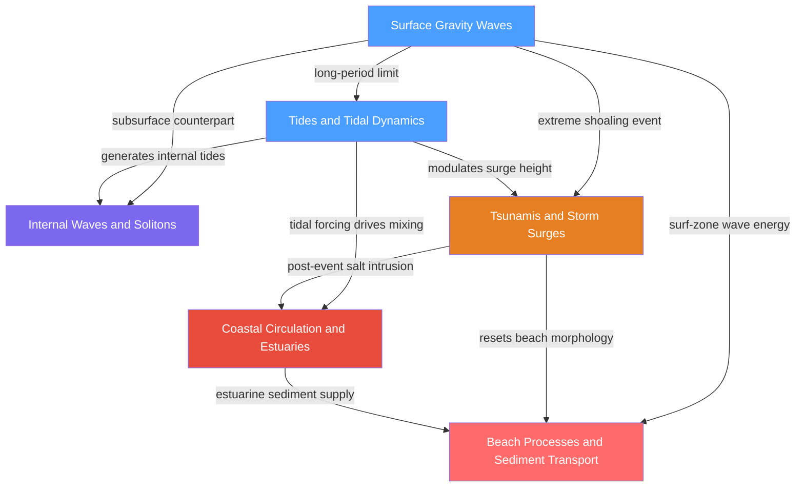

# Waves, Tides and Coastal Dynamics — Map of Content

> [!info] How to use this map
> Start with **Surface Gravity Waves** to establish the wave-mechanics foundation, follow the arrows through tides and subsurface physics, then work toward hazards and coastal processes. Each node links to a full note. Come back to this map when you feel lost.

Parent vault: [[_MOC_Oceanography_Master]]

---

## Overview

This section spans the full mechanical spectrum of ocean water motions at the surface, beneath it, and along the coast. **Surface gravity waves** — from short wind-chop to continent-crossing swells — establish the core framework: the dispersion relation, phase versus group velocity, the JONSWAP energy spectrum, and the shoaling that concentrates wave energy near shore. That same shallow-water wave physics, stretched to planetary scales and driven by the differential gravitational pull of the Moon and Sun, becomes the **tides**: harmonic constituents (M2, S2, K1, O1), basin resonance that amplifies the 0.27 m equilibrium tide to a 16 m Bay of Fundy spectacle, Kelvin-wave propagation around amphidromic points, and a 3.7 TW dissipation budget that is measurably slowing Earth's rotation. Beneath the surface, **internal waves and solitons** exploit density stratification to propagate invisibly through the water column — driven primarily by tidal flow over topography — and when they break they supply the diapycnal mixing that sustains the global thermohaline overturning circulation. At the extreme end of the energy spectrum, **tsunamis and storm surges** apply the same shallow-water wave equations to catastrophic events: megathrust seafloor rupture, Green's Law shoaling that turns a 30 cm open-ocean signal into a 30 m run-up, and the storm-wind setup and inverted-barometer effect that compound to produce the deadliest coastal floods in recorded history. All of this wave and tidal energy ultimately arrives at the coast, where **coastal circulation and estuaries** are governed by the competition between riverine freshwater outflow and tidal mixing — described by the Hansen-Rattray diagram from salt wedge to fully mixed — and where breaking waves and tidal currents power **beach processes**: longshore drift quantified by the CERC formula, equilibrium profile morphology, rip-current dynamics, and the Bruun-Rule shoreline retreat forced by rising sea level.

---

## Concept Map

*(Blue = fundamental open-ocean physics, Purple = intermediate subsurface dynamics, Orange = applied hazard physics, Red = advanced coastal processes; arrows = "leads to" or "requires")*

---

## Learning Path

*Recommended order for a first pass through this topic:*

1. [[Surface_Gravity_Waves]] — establish the dispersion relation ω² = gk·tanh(kh), phase versus group velocity, JONSWAP spectra, and the shoaling mechanics that every other note in this section builds upon
2. [[Tides_and_Tidal_Dynamics]] — apply the shallow-water wave limit at planetary scale; build understanding of harmonic constituents, basin resonance, Kelvin-wave propagation, and the Earth-Moon angular-momentum budget
3. [[Internal_Waves_and_Solitons]] — go beneath the surface; understand how tidal flow over topography generates baroclinic waves along density surfaces, how KdV soliton fission occurs, and why this matters for deep-ocean mixing
4. [[Tsunamis_and_Storm_Surges]] — revisit shallow-water wave physics applied to extreme hazard events; work through Green's Law shoaling, DART detection limits, and the additive components of storm surge
5. [[Coastal_Circulation_and_Estuaries]] — integrate wave and tidal energy at the coast-ocean interface; master the Hansen-Rattray classification, Knudsen salt balance, SIPS stratification cycles, and river-plume dynamics
6. [[Beach_Processes_and_Sediment_Transport]] — reach the terminal coastal destination: Shields threshold, CERC longshore transport, Dean equilibrium profiles, rip-current formation, and Bruun-Rule retreat under sea-level rise

---

## All Notes in This Section

| Note | Key Concept | Level Range |
|------|-------------|-------------|
| [[Surface_Gravity_Waves]] | Dispersion relation ω² = gk·tanh(kh); phase vs group velocity; Stokes drift; JONSWAP spectrum; wave shoaling and breaking | Beginner – Graduate |
| [[Tides_and_Tidal_Dynamics]] | Tidal potential (Legendre P₂ term); M2/S2/K1/O1 constituents; spring-neap cycle; Bay of Fundy resonance; 3.7 TW dissipation | Beginner – Graduate |
| [[Internal_Waves_and_Solitons]] | Brunt-Vaisala frequency N; ω = N cos θ dispersion; KdV soliton fission; Garrett-Munk spectrum; diapycnal mixing | Intermediate – Graduate |
| [[Tsunamis_and_Storm_Surges]] | Shallow-water wave speed c = √(gh); Green's Law a ∝ h⁻¹/⁴; DART buoy detection; wind setup and inverted-barometer effect | Beginner – Graduate |
| [[Coastal_Circulation_and_Estuaries]] | Hansen-Rattray diagram; Knudsen salt balance; SIPS stratification; Total Exchange Flow (TEF); river plume Kelvin number | Intermediate – Graduate |
| [[Beach_Processes_and_Sediment_Transport]] | Shields parameter θ; CERC formula Q ∝ H_b^(5/2) sin(2α); Dean profile h = Ax^(2/3); rip currents; Bruun Rule | Intermediate – Graduate |

---

## Key Questions This Topic Answers

- How do wind-generated waves organise into ocean swells, and why does wave energy travel at half the speed of individual wave crests?
- What forces create tides, and why does the Bay of Fundy amplify the ~0.27 m equilibrium tidal range by a factor of roughly 60?
- How does barotropic tidal energy flowing over a seamount spawn subsurface solitons that irreversibly mix the deep ocean?
- Why is a 30 cm open-ocean tsunami undetectable from a ship yet capable of producing a 30 m coastal run-up?
- What determines whether a river estuary is a sharp salt-wedge or a vertically uniform brackish body — and how does tidal energy tip the balance?
- How does wave energy at the breaker line drive longshore sediment transport, and how much shoreline retreat does 0.5 m of sea-level rise cause?

---

## Connections to Other Topics

- [[_MOC_Oceanography_Master]] — parent vault entry; this section sits within the broader physical oceanography framework alongside ocean circulation, thermodynamics, and biogeochemistry
- [[_MOC_Physics_Master]] — fluid mechanics (shallow-water equations, Kelvin waves, Euler equations), wave mechanics (dispersion, group velocity, wave action conservation), and classical mechanics (tidal potential, angular-momentum transfer) are the direct physical foundations of this entire section
- [[_MOC_Earth_Science_Master]] — tectonic plate boundaries provide tsunami source regions; coastal geomorphology and fluvial sediment supply link to beach and estuary dynamics
- [[_MOC_Meteorology_Master]] — tropical cyclone dynamics, wind-stress parameterisation, and sea-level pressure gradients drive storm surges; atmospheric reanalysis provides wave and surge model forcing
- [[_MOC_Astronomy_Master]] — orbital mechanics of the Earth-Moon-Sun system determine all tidal constituent frequencies and the measured 3.82 cm/yr lunar recession

---

#MOC #Oceanography #WavesTidesCoastal
