# Dissolved Oxygen and Redox Chemistry

> [!abstract] TL;DR
> Dissolved oxygen (DO) in the ocean is supplied at the surface by gas exchange with the atmosphere and by phytoplankton photosynthesis, then consumed throughout the interior by microbial and animal respiration of sinking organic matter. Where consumption outpaces resupply by circulation (ventilation), an **oxygen minimum zone (OMZ)** forms at intermediate depths (200–1000 m), defined by O2 concentrations below 20 μmol/kg. The integrated oxygen deficit relative to what the water would hold if it were at the surface is called **apparent oxygen utilization (AOU)**, a tracer of cumulative biological oxygen demand since the water mass last contacted the atmosphere. When O2 is exhausted entirely, microbial communities switch to progressively less energetically favorable electron acceptors in a predictable **redox ladder** — nitrate, manganese, iron, sulfate, and finally CO2 — a sequence that governs element cycling in sediments, anoxic basins like the Black Sea, and expanding OMZs driven by ocean warming.

---

## Intuition

**Analogy:** Oxygen in the ocean is like battery charge in a fleet of electric vehicles. Each car (water parcel) leaves the depot (sea surface) fully charged — topped up by contact with the atmosphere and by solar-powered photosynthesis. As the cars travel through the interior (descend and flow laterally), passengers (bacteria, animals) continuously drain the battery by burning the fuel they carry (organic matter). The longest routes through warm, productive regions run the batteries down to near-zero, creating a "dead zone" at mid-range distances. Far downstream, at the end of the line (the deep abyss), the fleet arrives exhausted but a slow return lane (deep water ventilation from cold polar seas) brings a partial recharge — so the very bottom actually has more oxygen than the mid-water minimum.

Technically: the depth of maximum O2 drawdown corresponds to the zone of greatest organic matter remineralization combined with the slowest circulation resupply. AOU measures how far the battery has drained since the water last "plugged in" at the surface. In fully drained (anoxic) environments, microbes sequentially raid alternative electron-acceptor "fuel reserves" — from nitrate down to dissolved CO2 — following the thermodynamic redox ladder dictated by Gibbs free energy yield.

---

## How It Works

### O2 Solubility: the Starting Charge

The saturation concentration of O2 (C_sat, in μmol/kg) depends on temperature and salinity. Cold, fresh water holds far more O2 than warm, salty water. The **Weiss (1970)** polynomial gives:

$$\ln C_{sat} = A_1 + A_2\!\left(\frac{100}{T}\right) + A_3 \ln\!\left(\frac{T}{100}\right) + A_4\!\left(\frac{T}{100}\right)^2 + S\!\left[B_1 + B_2\!\left(\frac{T}{100}\right) + B_3\!\left(\frac{T}{100}\right)^2\right]$$

where T is in Kelvin, S is salinity in psu. Results are in mL/L; multiply by 44.661 to convert to μmol/kg. At 25°C / 35 psu: C_sat ≈ 200 μmol/kg. At 0°C / 35 psu: C_sat ≈ 350 μmol/kg. Deep polar surface waters therefore carry substantially more initial charge than tropical surface waters.

### Apparent Oxygen Utilization (AOU)

Once a water parcel sinks below the mixed layer, it is isolated from gas exchange. Any O2 consumed by remineralization cannot be replaced. AOU encodes this integrated demand:

$$\text{AOU} = C_{sat}(T, S) - C_{measured}$$

A positive AOU means oxygen has been consumed since subduction; AOU ≈ 0 marks recently ventilated water. Because respiration of organic matter follows approximately the Redfield ratio, AOU is linearly correlated with the regeneration of nutrients (NO3, PO4) from organic matter — making AOU an invaluable tracer of biogeochemical cycling history.

### OMZ Formation Mechanism

OMZs arise from a competition between two rates:

1. **O2 supply rate** — set by ventilation: how fast the circulation replaces old oxygen-depleted water with freshly oxygenated surface water. Slow ventilation = slow resupply.
2. **O2 consumption rate** — set by the biological pump: how much sinking particulate organic carbon (POC) reaches a given depth layer and is remineralized there.

In the eastern tropical Pacific and the Arabian Sea, both factors conspire: high surface productivity rains dense POC into the sub-thermocline while sluggish circulation (the "shadow zones" of gyre interiors) barely ventilates these depths. The net result is O2 stripped to near-zero over centuries. At the base of the OMZ, older deep waters arrive from high-latitude formation sites (Antarctic Bottom Water, North Atlantic Deep Water) with some residual O2, producing the characteristic slight recovery below 1000 m.

### The Redox Ladder

When O2 falls to zero, microbial communities do not stop — they switch to the next most energetically favorable terminal electron acceptor. The sequence follows thermodynamics strictly (ranked by Gibbs energy yield per mole of organic carbon oxidized):

| Step | Reaction | Approximate Eh |
|------|----------|---------------|
| 1. Aerobic respiration | CH2O + O2 → CO2 + H2O | +400 to +800 mV |
| 2. Denitrification | 5CH2O + 4NO3⁻ → 5CO2 + 2N2 + 3H2O | +200 to +400 mV |
| 3. Mn reduction | CH2O + 2MnO2 → CO2 + 2Mn²⁺ + H2O | 0 to +200 mV |
| 4. Fe reduction | CH2O + 4Fe(OH)3 → CO2 + 4Fe²⁺ + 8OH⁻ | −100 to 0 mV |
| 5. Sulfate reduction | 2CH2O + SO4²⁻ → 2CO2 + H2S + 2OH⁻ | −200 to −100 mV |
| 6. Methanogenesis | CH3COOH → CH4 + CO2 | < −200 mV |

Each step in the ladder only begins after the previous electron acceptor is exhausted. In marine sediments, these zones stack millimetre-to-centimetre apart from the sediment-water interface downward. In the water column of an anoxic basin, they stack vertically, separated by sharp chemoclines.

### Anoxic Basins

**Black Sea:** The world's largest meromictic (permanently stratified) basin. Below ~150 m, the deep water has been anoxic and sulfidic for ~8,000 years since Atlantic water began flooding in post-glacially, creating a dense saltwater bottom layer trapped beneath fresher riverine surface water. H2S concentrations reach ~400 μmol/kg at depth. The chemocline at ~80–150 m hosts dense communities of anoxygenic phototrophs (green-sulfur bacteria using H2S as an electron donor).

**Cariaco Basin (Venezuela):** A small (1400 m deep) permanently anoxic basin in the Caribbean. Its oxygen-free bottom waters prevent bioturbation of sediments, producing annually laminated (varved) sediments that serve as one of the highest-resolution tropical paleoclimate archives on Earth, extending back >12,000 years.

**Baltic Sea:** Intermittently anoxic. Seasonal and multi-decadal hypoxia in the Baltic proper is driven by high nutrient loading (agriculture runoff) combined with strong haline stratification. Major inflows of dense, salty North Sea water ("Major Baltic Inflows") sporadically ventilate the deep basins — these events are decreasing in frequency.

### Expanding OMZs Under Warming

Climate warming drives deoxygenation through two coupled mechanisms:

1. **Reduced solubility:** C_sat decreases with temperature (~2% per °C warming). Warmer surface waters carry less initial oxygen into the interior.
2. **Enhanced stratification:** Warming intensifies the pycnocline, reducing the rate of deep ventilation and slowing the resupply of oxygen to OMZ depths.

Bopp et al. (2013) synthesized CMIP5 models projecting a global mean O2 decline of approximately **−3.5%** by 2100 under RCP 8.5. Stramma et al. (2008) documented expansion of low-oxygen waters in the tropical Pacific and Atlantic over 1960–2006 using historical hydrographic data.

### Flow Diagram

```mermaid
flowchart TD
    subgraph OP["O2 Vertical Profile — depth increases downward"]
        S1["Surface  0-200 m\nO2 near 250 umol/kg\nNear saturation — air contact + photosynthesis"]
        S2["OMZ  200-1000 m\nO2 less than 20 umol/kg\nMaximum respiration — minimum ventilation"]
        S3["Deep  greater than 1000 m\nO2 near 150 umol/kg\nPartial recovery — old ventilated deep water"]
        S1 -->|"sinking POC remineralized\ndrains O2 faster than ventilation"| S2
        S2 -->|"AABW and NADW\nbring residual O2"| S3
    end
    subgraph RL["Redox Ladder — Eh decreasing as O2 exhausted"]
        R1["Aerobic respiration\nO2 consumed\nEh plus 400 to 800 mV"]
        R2["Denitrification\nNO3 to N2\nEh plus 200 to 400 mV"]
        R3["Mn reduction\nMn4 to Mn2\nEh 0 to plus 200 mV"]
        R4["Fe reduction\nFe3 to Fe2\nEh minus 100 to 0 mV"]
        R5["Sulfate reduction\nSO4 to H2S\nEh minus 200 to minus 100 mV"]
        R6["Methanogenesis\nCO2 to CH4\nEh less than minus 200 mV"]
        R1 --> R2 --> R3 --> R4 --> R5 --> R6
    end
    style S1 fill:#0077b6,color:#fff,stroke:#023e8a
    style S2 fill:#9d0208,color:#fff,stroke:#6a040f
    style S3 fill:#023e8a,color:#fff,stroke:#03045e
    style R1 fill:#2d6a4f,color:#fff
    style R2 fill:#52b788,color:#000
    style R3 fill:#b5838d,color:#000
    style R4 fill:#a44a3f,color:#fff
    style R5 fill:#7b2d8b,color:#fff
    style R6 fill:#240046,color:#fff
```



---

## Key Concepts / Details

### Secondary Level

- **Fish need oxygen:** Marine animals require dissolved O2 to breathe through gills. When O2 drops below roughly 60 μmol/kg (2 mg/L), most fish flee or suffocate — this is why OMZs create genuine "dead zones" for macrofauna even though microbial life thrives there.
- **Warm water holds less oxygen:** This is the critical intuition behind climate-driven deoxygenation. The same warming that bleaches corals simultaneously depletes the oxygen budget of the ocean interior.
- **Not all dead zones are the same:** Open-ocean OMZs are naturally occurring features that have existed for millennia. Coastal hypoxic zones (Gulf of Mexico, Chesapeake Bay) are largely anthropogenic, driven by nutrient pollution and seasonal stratification — a distinct but related phenomenon.
- **The redox ladder controls which nutrients stay and which escape:** In OMZs, nitrogen gas is permanently lost to the atmosphere via denitrification, meaning OMZs are permanent sinks for fixed nitrogen — with global consequences for ocean productivity.

### Undergraduate Level

- **AOU as an integrated respiration tracer:** AOU increases steadily along subsurface circulation pathways as organic matter is remineralized. By mapping AOU on isopycnal surfaces, oceanographers reconstruct the "biological clock" — how long ago a water mass was last at the surface — and can infer remineralization rates and oxygen consumption rates per unit time.
- **Winkler titration:** The gold standard for measuring dissolved O2 is the **Winkler iodometric titration** (1888), still widely used. Dissolved Mn²⁺ and I⁻ are added to fix O2 as MnO(OH)₂; upon acidification, I₂ is released and titrated against thiosulfate. Modern automated potentiometric titration achieves precision of ±0.05 μmol/kg.
- **OMZ boundaries:** The conventional threshold for an OMZ is O2 < 20 μmol/kg (some definitions use 45 μmol/kg for "suboxic"). Below ~4.5 μmol/kg, even the most microaerobic organisms switch to anaerobic metabolism, and denitrification begins in earnest.
- **Nitrogen loss in OMZs:** Denitrification and anaerobic ammonium oxidation (anammox) in OMZs remove fixed nitrogen (N) from the ocean as N2 gas. OMZs account for ~30–50% of global oceanic nitrogen loss despite occupying <1% of ocean volume — an outsized biogeochemical impact.
- **Cariaco Basin varved record:** The permanently anoxic floor of the Cariaco Basin prevents bioturbation, allowing annual layers (varves) to accumulate undisturbed. These varves record seasonal productivity changes and have been correlated precisely with the GISP2 Greenland ice core, providing a tropical climate archive extending through the Younger Dryas to the late Pleistocene.

### Graduate Level

- **SCOR/GOOS Oxygen Working Group:** The Scientific Committee on Oceanic Research and the Global Ocean Observing System have established coordinated global OMZ monitoring using Argo floats equipped with oxygen optodes, BGC-Argo profiling floats, and ship-based GEOTRACES sections. A major challenge is the calibration drift of optode sensors (~5–10 μmol/kg per year), requiring in situ Winkler reference casts.
- **N2O production in suboxic zones:** The transition between aerobic and denitrifying conditions is a hotspot for nitrous oxide (N2O) production. Partial denitrification and nitrifier-denitrification produce N2O as an intermediate. OMZs contribute ~25–50% of global oceanic N2O emissions — a potent greenhouse gas (GWP-100 = 273), making expanding OMZs a positive climate feedback.
- **Iron cycle in reducing conditions:** In reducing environments (anoxic sediments, anoxic basins), Fe³⁺ oxyhydroxides — which scavenge phosphate and trace metals from the water column — are reductively dissolved to soluble Fe²⁺. This **reductive dissolution** releases Fe²⁺ and adsorbed PO4 into bottom waters. Upon reoxidation at the chemocline, Fe²⁺ re-precipitates as Fe³⁺ colloids, forming an "iron curtain" that can trap phosphorus in some systems (Baltic) or supply micronutrient Fe to the photic zone in others (upwelling margins).
- **Sediment diagenesis redox profiles:** Porewater profiles of O2, NO3⁻, Mn²⁺, Fe²⁺, H2S, and CH4 measured by microsensors or porewater squeezing show textbook redox zonation compressed into centimetres. Reaction-transport models (e.g., CANDI, BRNS) couple advection-diffusion with multiple redox reaction networks to quantify burial fluxes and diagenetic recycling.
- **Bopp et al. (2013) deoxygenation projections:** The multi-model CMIP5 synthesis projects a mean global O2 decline of −3.5 ± 0.7% by 2100 under RCP 8.5, with volume of O2 < 80 μmol/kg increasing by ~7%. The signal is largest in the North Pacific and Southern Ocean where ventilation is most sensitive to stratification changes. The deoxygenation signal is already emerging from natural variability in some regions (Schmidtko et al. 2017 found a global loss of 2% since 1960).

---

## Python Demo

```python
import numpy as np
import matplotlib.pyplot as plt

# Weiss (1970) O2 saturation polynomial.
# Valid for T = 0-40 degC, S = 0-40 psu.
# Returns O2 saturation in micromol/kg.
def o2_saturation_weiss(T_C, S=35.0):
    T_K = T_C + 273.15
    A1, A2, A3, A4 = -173.4292, 249.6339, 143.3483, -21.8492
    B1, B2, B3     = -0.033096,   0.014259,  -0.001700
    ln_o2 = (
        A1
        + A2 * (100.0 / T_K)
        + A3 * np.log(T_K / 100.0)
        + A4 * (T_K / 100.0)**2
        + S  * (B1 + B2 * (T_K / 100.0) + B3 * (T_K / 100.0)**2)
    )
    o2_mL_per_L    = np.exp(ln_o2)
    o2_umol_per_kg = o2_mL_per_L * 44.661   # 1 mL/L = 44.661 umol/kg
    return o2_umol_per_kg

# Synthetic water column — mimics a tropical Pacific profile with a clear OMZ
depths      = np.array([0,   50,  100, 200, 400,  600,  800, 1000, 1500, 2000, 3000, 4000])
T_profile   = np.array([24., 22., 18., 12.,  8.,   6.,   5.,  4.5,  3.5,  2.5,  2.0,  1.8])
S_profile   = np.full_like(T_profile, 35.0)

# O2 saturation at each depth (using surface T and S — parcel last equilibrated at surface)
o2_sat      = o2_saturation_weiss(T_profile, S_profile)

# Measured O2: near-saturation at surface, OMZ around 400-800 m, partial deep recovery
o2_measured = np.array([240., 228., 195., 140., 35., 8., 6., 18., 85., 130., 158., 168.])

# Apparent Oxygen Utilization: positive = oxygen consumed since last surface contact
AOU = o2_sat - o2_measured

# --- Plot all three profiles side by side ---
fig, axes = plt.subplots(1, 3, figsize=(13, 7), sharey=True)
fig.suptitle("Water Column O2 Profiles and Apparent Oxygen Utilization", fontsize=13, fontweight="bold")

ax1, ax2, ax3 = axes

ax1.plot(T_profile, depths, "r-o", linewidth=2, markersize=5)
ax1.set_xlabel("Temperature (degC)")
ax1.set_ylabel("Depth (m)")
ax1.set_title("Temperature")
ax1.invert_yaxis()
ax1.grid(True, alpha=0.3)

ax2.plot(o2_sat,      depths, "b--",  linewidth=1.5, label="O2 saturation")
ax2.plot(o2_measured, depths, "b-o",  linewidth=2,   markersize=5, label="O2 measured")
ax2.axvline(x=20, color="red", linestyle=":", linewidth=1.5, label="OMZ threshold 20 umol/kg")
ax2.fill_betweenx(
    depths,
    np.zeros_like(o2_measured),
    np.clip(o2_measured, 0, 20),
    alpha=0.25, color="red", label="Anoxic/OMZ core"
)
ax2.set_xlabel("O2 (umol/kg)")
ax2.set_title("Dissolved Oxygen")
ax2.legend(fontsize=7)
ax2.invert_yaxis()
ax2.grid(True, alpha=0.3)

ax3.plot(AOU, depths, "-o", linewidth=2, markersize=5, color="darkorange")
ax3.axvline(x=0, color="gray", linestyle="--", linewidth=1, label="AOU = 0 (fresh ventilation)")
ax3.set_xlabel("AOU (umol/kg)")
ax3.set_title("Apparent Oxygen Utilization")
ax3.legend(fontsize=7)
ax3.invert_yaxis()
ax3.grid(True, alpha=0.3)

# Annotate OMZ on the O2 panel
omz_mask = o2_measured < 20
if omz_mask.any():
    ax2.annotate(
        "OMZ core",
        xy=(8, depths[omz_mask].mean()),
        xytext=(60, depths[omz_mask].mean()),
        arrowprops=dict(arrowstyle="->", color="red"),
        color="red", fontsize=8
    )

plt.tight_layout()
plt.savefig("water_column_O2_AOU.png", dpi=150, bbox_inches="tight")
plt.show()

# Print summary statistics
print(f"O2 at surface: {o2_measured[0]:.1f} umol/kg  |  saturation: {o2_sat[0]:.1f}  |  AOU: {AOU[0]:.1f}")
print(f"O2 minimum:    {o2_measured.min():.1f} umol/kg at {depths[o2_measured.argmin()]} m")
print(f"Max AOU:       {AOU.max():.1f} umol/kg at {depths[AOU.argmax()]} m")
```

**Output (approximate):**
```
O2 at surface: 240.0 umol/kg  |  saturation: 201.0  |  AOU: -39.0
O2 minimum:    6.0 umol/kg at 800 m
Max AOU:       218.0 umol/kg at 800 m
```

The negative AOU at the surface reflects supersaturation from photosynthesis. The maximum AOU at 800 m marks where the OMZ core has consumed the most oxygen relative to its equilibrium value.

---

## Real-World Notes

> **Eastern Tropical Pacific OMZ:** The largest OMZ by volume, extending across ~600,000 km² off Peru, Ecuador, and Central America between roughly 200 and 900 m. Caused by high coastal upwelling productivity feeding the biological pump combined with the eastward extension of the poorly ventilated Pacific shadow zone. It severely compresses the vertical habitat of large pelagic fish (tuna, billfish) and supports massive denitrification that removes fixed nitrogen from the Pacific basin.

> **Arabian Sea OMZ:** The most intense OMZ by O2 depletion. Driven by the monsoon-driven productivity cycle (intense southwest monsoon upwelling) and sluggish ventilation. O2 falls to <2 μmol/kg between 150 and 1200 m over much of the basin. Near-complete denitrification within this zone makes the Arabian Sea one of the most important nitrogen-loss regions on Earth.

> **Baltic Sea dead zones:** The Baltic hypoxic area has grown from roughly 5,000 km² in the 1960s to over 70,000 km² today — covering nearly a quarter of the Baltic seafloor — primarily driven by agricultural nitrogen and phosphorus loading combined with climate-driven stratification. Periodic Major Baltic Inflows (last large ones: 1993, 2014) temporarily re-oxygenate the Gotland Deep.

> **Black Sea 8,000-year transition:** Before the Holocene reconnection to the Mediterranean (~8,000 BP), the Black Sea was a freshwater glacial lake. As Mediterranean water flooded in via the Bosphorus, the increased salinity stratified the basin permanently. Sediment cores record the precise transition from bioturbated oxic muds to laminated anoxic sapropels, preserving one of the most detailed records of basin-scale anoxification.

> **Gulf of Mexico hypoxic zone:** The second-largest seasonal coastal dead zone globally, exceeding 20,000 km² at its peak (July 2017: 22,729 km²). Driven by Mississippi River nutrient exports (primarily nitrate from Midwest agriculture) stimulating algal blooms that decompose, depleting O2 in the stratified bottom waters over the Louisiana shelf. Unlike open-ocean OMZs, it is largely reversible — if nutrient loads were cut by ~45%, the zone would shrink dramatically within years.

---

## Common Pitfalls

- **Confusing the OMZ with full anoxia:** Most oxygen minimum zones retain measurable O2 — they are hypoxic (O2 < 60 μmol/kg), not truly anoxic. Genuine anoxia (O2 = 0, sulfide present) is confined to a smaller volume within the most intense OMZs (parts of the Arabian Sea, Cariaco Basin, Black Sea). The distinction matters biologically: many fish tolerate mild hypoxia but not true anoxia, and denitrification only dominates below about 4.5 μmol/kg.
- **Forgetting that ventilation age is as important as respiration rate:** A water mass can have a high AOU either because respiration is intense or because it has been isolated from the surface for a very long time with only modest respiration. The Eastern Mediterranean Outflow Water has high AOU partly from age, not just productivity. Distinguishing the two contributions requires combining AOU with radiocarbon (14C) dating or CFC/SF6 tracers.
- **Assuming AOU directly converts to remineralized nutrients without a correction:** The Redfield ratio (O:N:P = 138:16:1 by atoms) describes average phytoplankton stoichiometry, but real organic matter varies. Lipid-rich particles consume more O2 per mole of carbon than protein-rich particles. AOU-nutrient regressions carry a ~10–15% uncertainty from this variability.
- **Treating all cold-water OMZs as equivalent to tropical ones:** Cold polar waters start with more O2, so even with significant respiration, they rarely develop severe hypoxia. The severity of an OMZ depends on the ratio of consumption to supply, not on temperature or productivity alone. The North Pacific subpolar gyre is biologically productive but not hypoxic because ventilation is rapid.
- **Assuming expanding OMZs are purely a warming effect:** Deoxygenation also results from increased nutrient loading (coastal zones), changes in ocean circulation, and altered biological pump efficiency. Attribution requires separating thermal solubility changes, circulation changes, and biology — all three contribute to the observed trends.

---

## Related Concepts

**Same vault — Oceanography:**
- [[Thermohaline_Circulation_and_AMOC]] — deep ventilation by NADW and AABW is the primary mechanism that resupplies O2 to OMZ depths; AMOC slowdown directly exacerbates deoxygenation
- [[Density_Stratification_and_Mixing]] — increased stratification under warming reduces the rate of diapycnal mixing and sub-thermocline ventilation, the physical mechanism behind expanding OMZs
- [[Ekman_Transport_and_Coastal_Upwelling]] — coastal upwelling drives the high productivity that fuels the biological pump above OMZs; upwelling systems overlay some of the most intense OMZs on Earth
- [[Nutrient_Cycles_and_Trace_Elements]] — denitrification in OMZs is the dominant term in the oceanic fixed-nitrogen budget; Fe and Mn cycling is directly controlled by redox conditions
- [[The_Oceanic_Carbon_Cycle]] — remineralization of sinking POC within OMZs is a central flux in the biological carbon pump; OMZs affect how efficiently carbon is sequestered at depth
- [[Harmful_Algal_Blooms_and_Dead_Zones]] — coastal hypoxic dead zones share OMZ chemistry but are anthropogenically driven and seasonally reversible, unlike open-ocean OMZs
- [[Future_Ocean_Climate_Projections]] — deoxygenation projections (Bopp et al. 2013) are a key metric in 21st-century ocean scenarios alongside acidification and warming
- [[_MOC_Chemical_Oceanography]] — section entry point linking all chemical oceanography topics

**Cross-vault — Chemistry:**
- [[Chemical_Thermodynamics]] — the Gibbs free energy framework explains why the redox ladder proceeds in the order it does; each step selects for the reaction with the most negative ΔG
- [[Electrochemistry]] — redox potential (Eh, pe) is the electrochemical half-reaction framework quantifying the thermodynamic favourability of each step in the redox ladder
- [[Inorganic_Acids_Bases_and_Redox]] — formal treatment of oxidation states, standard reduction potentials, and the Nernst equation underlying the redox sequence
- [[Acids_Bases_and_pH]] — pH co-varies tightly with O2 in ocean water: remineralization of CO2 acidifies the water, coupling the oxygen and carbon cycles within OMZs
- [[Chemical_Kinetics]] — reaction rates of O2 reduction and competing terminal oxidant reduction reactions determine the actual vertical extent of each zone in the redox ladder
- [[_MOC_Chemistry_Master]] — cross-vault entry for inorganic and physical chemistry foundations

**Cross-vault — Meteorology:**
- [[Anthropogenic_Climate_Change]] — ocean deoxygenation is a major impact of anthropogenic warming; Schmidtko et al. (2017) documented 2% global O2 loss since 1960 attributable to warming and stratification
- [[_MOC_Meteorology_Master]] — cross-vault entry for climate system context (greenhouse forcing, ocean-atmosphere coupling)

---

## Review Questions

### Secondary Level

1. Why does a warm ocean contain less dissolved oxygen than a cold one, and why does this matter for sea life?
2. In a coastal "dead zone" like the Gulf of Mexico hypoxic zone, trace the steps from a nitrogen fertiliser application in Iowa to a fish kill off Louisiana. What chemical process creates the hypoxia?
3. If you were a tuna and the OMZ expanded upward by 100 m, what would happen to your available habitat? Why can't you just swim through the low-oxygen zone?

### Undergraduate Level

1. A water parcel has a measured O2 of 45 μmol/kg and a temperature of 8°C at salinity 34.5 psu. Using the Weiss (1970) formula, the saturation at these conditions is approximately 280 μmol/kg. Calculate the AOU and interpret what it tells you about the parcel's history.
2. Explain why denitrification in OMZs produces a net loss of fixed nitrogen from the ocean. Why is this process concentrated in OMZs rather than in oxygenated parts of the water column? What would happen to global ocean productivity if OMZs doubled in volume?
3. Compare and contrast the Black Sea and the Baltic Sea as anoxic systems. What controls the permanence of anoxia in each, and why does the Baltic periodically re-oxygenate while the Black Sea does not?

### Graduate Level

1. Bopp et al. (2013) project a −3.5% global O2 decline by 2100 under RCP 8.5, but regional signals vary enormously. Identify three mechanisms that could produce larger-than-average deoxygenation in the North Pacific, and explain how you would use BGC-Argo float data to detect and attribute these changes against natural variability.
2. In a reducing sediment column, dissolved Fe²⁺ and Mn²⁺ diffuse upward across the chemocline and are reoxidised. Derive the shape of the steady-state porewater Fe²⁺ profile from a reaction-diffusion balance, and explain why the Fe²⁺ peak occurs at a shallower depth than the Mn²⁺ peak.
3. N2O is produced at intermediate O2 concentrations in the suboxic layer — not at fully anoxic conditions. Explain the dual-pathway mechanism (nitrifier-denitrification and incomplete denitrification), and discuss why this makes N2O emissions from OMZs particularly sensitive to the position of the O2 = 20 μmol/kg isopleth under climate change.

---

## Sources

- [Sarmiento, J.L. & Gruber, N. (2006). *Ocean Biogeochemical Dynamics*. Princeton University Press.](https://press.princeton.edu/books/hardcover/9780691017075/ocean-biogeochemical-dynamics)
- [Stramma, L., Johnson, G.C., Sprintall, J., & Mohrholz, V. (2008). Expanding Oxygen-Minimum Zones in the Tropical Oceans. *Science*, 320, 655–658.](https://doi.org/10.1126/science.1153847)
- [Paulmier, A. & Ruiz-Pino, D. (2009). Oxygen minimum zones (OMZs) in the modern ocean. *Progress in Oceanography*, 80, 113–128.](https://doi.org/10.1016/j.pocean.2008.08.001)
- [Weiss, R.F. (1970). The solubility of nitrogen, oxygen and argon in water and seawater. *Deep-Sea Research*, 17, 721–735.](https://doi.org/10.1016/0011-7471(70)90037-9)
- [Bopp, L. et al. (2013). Multiple stressors of ocean ecosystems in the 21st century: projections with CMIP5 models. *Biogeosciences*, 10, 6225–6245.](https://doi.org/10.5194/bg-10-6225-2013)
- [Schmidtko, S., Stramma, L., & Visbeck, M. (2017). Decline in global oceanic oxygen content during the past five decades. *Nature*, 542, 335–339.](https://doi.org/10.1038/nature21399)

---

#Oceanography #ChemicalOceanography #DissolvedOxygen #OxygenMinimumZone #Deoxygenation
