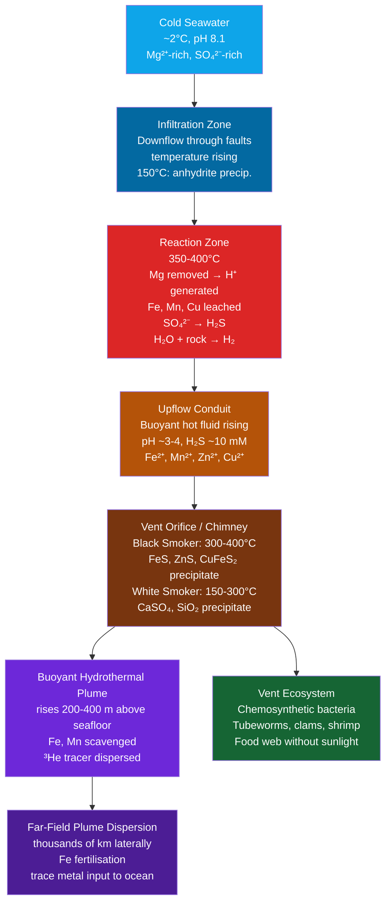

# Hydrothermal Vents and Seafloor Chemistry

> [!abstract] TL;DR
> Hydrothermal vents are seafloor openings along mid-ocean ridges where seawater percolates into fractured oceanic crust, is superheated to 350–400°C by magmatic heat, chemically transformed by water-rock reactions, and expelled back into the 2°C deep ocean as metal-rich, acidic fluid. The rapid mixing with cold seawater precipitates metal sulfide minerals, forming the iconic black or white "smoke" plumes and towering sulfide edifices. These systems are the dominant source of several trace metals to the ocean, remove large amounts of Mg while adding Ca, Si, Fe, Mn, K, H₂S, and H₂, profoundly modifying ocean chemistry on geological timescales. Most remarkably, chemosynthetic bacteria harness the chemical energy in H₂S oxidation to build entire food webs — tubeworms, giant clams, and shrimp — that operate entirely without sunlight, making hydrothermal vents one of the most compelling analogues for the origin of life and for life on icy ocean worlds.

---

## Intuition

**Analogy:** Black smokers on the seafloor are like underground geysers from hell — except instead of erupting through soil into open air, they erupt through cracked ocean rock into near-freezing, pitch-black water two to three kilometres down. Imagine pouring seawater into a crack in the road above a subterranean furnace: by the time it resurfaces it has been cooked to 400°C, has dissolved chunks of the surrounding metal-rich rock, and then blasts upward into frigid air, instantly solidifying the dissolved metals into a billowing cloud of black dust. That cloud is the "smoke," the particles are iron and copper sulfides, and the whole structure — chimney and all — is made of minerals that have been precipitating for decades to centuries.

Technically, this is the **mid-ocean ridge hydrothermal system**: a convection cell driven by the enormous heat flux (~100–200 mW m⁻²) at diverging plate boundaries, where new oceanic crust is continuously generated. Cold seawater infiltrates through normal faults and permeable basalt, heats up, reacts chemically with the rock, becomes buoyant, and rises back to the seafloor. The expelled fluid has been stripped of Mg and sulfate and loaded with H₂S, Fe, Mn, H₂, and CO₂ — an entirely different chemistry from seawater — creating a sharp chemical interface at the vent opening where life exploits the redox gradient with extraordinary productivity.

---

## How It Works

### Core Mechanics

**1. Seawater infiltration — the recharge zone.**
Cold (~2°C) seawater percolates downward through fractures and faults in the oceanic crust, driven by the density contrast with shallower, warmer water. The infiltration zone can extend laterally 5–10 km from the vent axis and to depths of 2–5 km into the crust. During this descent, seawater begins to cool the rock and is itself slightly warmed; sulfate (SO₄²⁻) begins to precipitate as anhydrite (CaSO₄) as temperatures rise above ~150°C.

**2. Water-rock reaction zone — the cracking front.**
At depths where temperatures reach 350–400°C (the "reaction zone" ~1–3 km below the seafloor), intense chemical reactions transform the fluid:
- **Mg removal:** Mg²⁺ is quantitatively removed from seawater and incorporated into secondary phyllosilicate minerals (chlorite, serpentine). Vent fluids contain essentially zero Mg; this is the most diagnostic geochemical signature of high-temperature hydrothermal fluids.
- **Acid generation:** Mg removal releases H⁺: Mg²⁺ + 2H₂O → Mg(OH)₂ + 2H⁺. The fluid drops to pH ~3–4.
- **Metal leaching:** The acidic, hot fluid dissolves Fe, Mn, Zn, Cu, Pb, Co, and other metals from the basalt and gabbro.
- **Sulfate reduction:** Sulfate is reduced to H₂S by reaction with ferrous minerals: SO₄²⁻ + 4H₂ → H₂S + 3H₂O. H₂S concentrations reach ~5–10 mM in high-temperature fluids.
- **H₂ generation:** Serpentinization of olivine produces molecular hydrogen: 3Fe₂SiO₄ (fayalite) + 2H₂O → 2Fe₃O₄ (magnetite) + 3SiO₂ + 2H₂. At ultramafic-hosted vents like LOST CITY, H₂ can reach millimolar concentrations.

**3. Black smoker discharge — the upflow zone.**
Superheated, low-pH, metal-rich fluid rises buoyantly through a narrower upflow conduit. As it emerges from the seafloor chimney at 300–400°C and encounters cold (2°C) seawater at ambient pressure (~25–30 MPa), rapid cooling causes instantaneous precipitation:
- **FeS (pyrrhotite, pyrite)** — iron sulfide, the dominant "black smoke" particle
- **ZnS (sphalerite)** — zinc sulfide
- **CuFeS₂ (chalcopyrite)** — copper-iron sulfide (higher-temperature precipitate, forms chimney walls)
- **CaSO₄ (anhydrite)** — immediately above the vent orifice where warm fluid mixes with ambient sulfate

The chimney structures grow at rates of several centimetres per day and can reach heights of 30–60 m (the TAG mound on the Mid-Atlantic Ridge hosts structures over 50 m). The resulting **massive sulfide deposits** contain economically significant concentrations of Cu, Zn, Au, Ag, and Co.

**4. White smokers — lower-temperature discharge.**
At ~150–300°C, a different mineral assemblage precipitates:
- **Anhydrite (CaSO₄)** — dominant white mineral
- **Amorphous silica (SiO₂)** — precipitates on cooling because silica solubility decreases with temperature below ~350°C
- **Barite (BaSO₄)** — from mixing of Ba²⁺-rich fluids with ambient sulfate

White smoker fluids have been diluted and partially equilibrated with seawater in a subsurface mixing zone, so metal concentrations are lower and pH is higher (~5–6) than in pure black smokers. The **LOST CITY Hydrothermal Field** (Atlantis Massif, 30°N Mid-Atlantic Ridge) is an extreme end-member: 40–90°C carbonate-rich fluids, pH 9–11, dominated by CaCO₃ and Mg(OH)₂ precipitation, driven by serpentinization rather than magmatic heat.

**5. Ridge-flank low-temperature hydrothermal circulation.**
Away from the ridge axis, the oceanic crust is cooler but still hydrothermally active for millions of years after formation. At temperatures of 5–65°C, diffuse flow through young (~10 Ma) crust cools the lithosphere, adds Ca, K, and alkalinity to the ocean, and serves as a significant sink for O₂ and nitrate. Ridge-flank circulation processes roughly 10 times more seawater volume than axial high-temperature vents and accounts for a substantial fraction of heat loss from young oceanic crust.

**6. Chemosynthesis — life without sunlight.**
Primary production at hydrothermal vents is based on **chemolithotrophy** — microorganisms oxidise inorganic electron donors (H₂S, H₂, CH₄, Fe²⁺) using O₂ or NO₃⁻ as electron acceptors:

$$\text{H}_2\text{S} + \text{CO}_2 + \text{O}_2 \rightarrow \text{CH}_2\text{O} + \text{H}_2\text{SO}_4$$

(Simplified net reaction for thioautotrophic chemosynthesis)

More precisely, for sulfur-oxidising bacteria:
$$\text{H}_2\text{S} + \frac{1}{2}\text{O}_2 \rightarrow \text{S}^0 + \text{H}_2\text{O} \quad (\Delta G = -209 \text{ kJ mol}^{-1})$$
$$\text{S}^0 + \frac{3}{2}\text{O}_2 + \text{H}_2\text{O} \rightarrow \text{H}_2\text{SO}_4 \quad (\Delta G = -587 \text{ kJ mol}^{-1})$$

**Tubeworms** (*Riftia pachyptila*, up to 2 m long) host chemosynthetic endosymbionts in a specialised organ called the trophosome. The worm delivers both H₂S (via a specialised haemoglobin that binds H₂S without inhibiting O₂ transport) and O₂ to its symbionts. Giant clams (*Calyptogena magnifica*) have gill-hosted sulfur-oxidising symbionts. Shrimp (e.g., *Rimicaris exoculata* at Mid-Atlantic Ridge vents) cultivate episymbiotic bacteria on specialised mouthparts.

**7. Hydrothermal heat flux and global budget.**
The total hydrothermal heat output from mid-ocean ridges is estimated at **~10 TW** (~10% of the total oceanic heat loss of ~90 TW). High-temperature axial venting accounts for ~30% of this, with ridge-flank low-temperature circulation responsible for ~70%. The global hydrothermal fluid flux is estimated at ~0.5–3 × 10¹³ kg yr⁻¹ — sufficient to cycle the entire ocean volume through the ridge system approximately once every 10 million years.

### Flow / Architecture



---

## Key Concepts / Details

### Secondary Level

- **Life exists without sunlight.** In 1977, the submersible *Alvin* (WHOI/NOAA) descended to the Galapagos Rift (2,500 m depth, 0°46'N, 86°10'W) and discovered dense communities of giant tube worms, white clams, and crabs clustered around warm vent openings — the first direct observation of a sunlight-free, chemosynthesis-based ecosystem. This discovery overturned the assumption that all life ultimately depends on photosynthesis.
- **Bacteria are the primary producers.** At hydrothermal vents, sulfur-oxidising bacteria (and in some settings, methane-oxidising archaea) harvest chemical energy from the reaction of vent H₂S with dissolved O₂. This energy is used to fix CO₂ into organic carbon, exactly as plants do with sunlight. The productivity of some vent communities rivals that of tropical rainforests per unit area.
- **The hottest water accessible on Earth's surface is vent fluid.** Black smoker fluids have been measured at up to 407°C (Von Damm et al., 1995, East Pacific Rise 9–10°N). This exceeds the boiling point of water at atmospheric pressure but remains liquid under the extreme pressure (~25 MPa) of 2,500 m water depth. Phase separation (boiling below the seafloor) can occur at shallower vents, producing both vapour-rich and brine-rich phases.
- **Vent chimneys are made of metal.** The towering edifices — "chimneys" — are composed almost entirely of copper, zinc, and iron sulfide minerals, the same ore minerals mined on land (chalcopyrite, pyrite, sphalerite). Ancient seafloor massive sulfide deposits on land (e.g., the Iberian Pyrite Belt) are fossil hydrothermal vent fields.

### Undergraduate Level

- **Water-rock reactions: serpentinization and spilitization.**
  At ultramafic-hosted vents (peridotite crust), serpentinization of olivine is the dominant reaction:
  `3Mg₂SiO₄ + H₂O → Mg₃Si₂O₅(OH)₄ + Mg(OH)₂` (forsterite → serpentine + brucite)
  This reaction is strongly exothermic and generates H₂, methane, and alkaline fluids. At basalt-hosted vents, spilitization (alteration of basalt to spilite) drives Mg uptake and Ca, Na exchange. The two settings produce chemically distinct fluids: ultramafic vents generate H₂- and CH₄-rich alkaline fluids (like LOST CITY), while basalt-hosted vents produce acidic, metal-rich, H₂S-dominated fluids.
- **Vent plume chemistry and dispersion.**
  Above the vent orifice, hot fluid mixes rapidly with ambient seawater, forming a **buoyant plume** that rises 200–400 m before achieving neutral buoyancy. The plume is identifiable by anomalies in temperature (+0.05°C above ambient), turbidity (from Fe and Mn oxyhydroxide particles), ³He (a primordial isotope emitted by the mantle), and CH₄. Once neutrally buoyant, the plume spreads laterally for hundreds to thousands of kilometres. Fe and Mn are initially dissolved but oxidise and scavenge onto particles with residence times of days to weeks (Fe) and years (Mn) in the plume.
- **Buoyant vs non-buoyant plume phases.**
  The **buoyant phase** (~0–200 m above vent) is vigorous, turbulent mixing with ambient seawater, described by entrainment models (see Python Demo). The **neutrally buoyant phase** is isopycnal spreading at neutral density level; this is where most geochemical transformations occur (Fe oxidation, Mn oxidation, scavenging). The **far-field plume** represents the residue after particle removal — dominated by the most soluble components (Mn²⁺, ³He, CH₄) and dissolved organic carbon.
- **Axial hot springs vs ridge-flank low-T circulation.**
  Axial vents (high-T, <1 Ma crust) are chemical **sources** for Fe, Mn, H₂S, Si, Ca, K and chemical **sinks** for Mg, sulfate, and seawater alkalinity. Ridge-flank low-T systems (1–65°C, 1–100 Ma crust) are also Mg sinks and Ca sources but in different proportions; critically, they add **alkalinity** and **dissolved inorganic carbon** to the ocean, modifying carbonate chemistry. Low-T systems also remove dissolved O₂ and can be a sink for K at lower temperatures. The global chemical balance of the ocean requires both terms.
- **Fe/Mn ratio in black smokers.**
  High-temperature black smoker fluids typically have Fe/Mn molar ratios of ~5–20, reflecting preferential Fe leaching from fresh basalt. White smokers have lower Fe/Mn because Fe precipitates more readily (as sulfides) at the lower mixing temperatures. In the buoyant plume, Fe is rapidly oxidised (minutes to hours at pH 7–8) and scavenged onto particles, while Mn²⁺ is more refractory and persists in dissolved form for weeks. This differential behaviour means Fe/Mn in the neutrally buoyant plume is much lower than in the source fluid.

### Graduate Level

- **Isotopic tracers of hydrothermal input.**
  The cleanest tracer of hydrothermal input to the deep ocean is **³He**: a primordial isotope released from the mantle in vent fluids at ~10⁻¹⁴ mol kg⁻¹ — far above its solubility equilibrium with the atmosphere. The ³He/⁴He ratio (R/Ra) in vent fluids is 8–9 times the atmospheric ratio, producing a globally detectable anomaly in the deep Pacific (the "Pacific ³He tongue" spreading west from the East Pacific Rise). The ³He signal integrates hydrothermal input over decades and can be used to infer global vent fluid fluxes (~10¹³ kg yr⁻¹). **Sr isotopes** (⁸⁷Sr/⁸⁶Sr) in vent fluids reflect the low-Sr basalt end-member (~0.7028) and provide a constraint on the mixing between hydrothermal and riverine Sr inputs to the ocean — the ocean's seawater ⁸⁷Sr/⁸⁶Sr ratio (~0.70918) reflects a balance between these sources and is recorded in marine carbonates, allowing reconstruction of past hydrothermal activity from sediment records.
- **Iron fertilisation from vents (far-field effect).**
  Dissolved Fe from hydrothermal plumes dispersing across the deep Southern Ocean has been proposed as a significant source of bioavailable Fe to surface waters through isopycnal upwelling. Tagliabue et al. (2010) and Resing et al. (2015, *Nature*) demonstrated that hydrothermal Fe can be stabilised as organic Fe complexes in plumes, extending its transport range from kilometres to thousands of kilometres. The East Pacific Rise plume Fe has been traced to ~4,000 km west of the ridge. This "hydrothermal iron fertilisation" effect may account for a significant fraction (~10–50%) of the Southern Ocean Fe budget, with direct consequences for biological productivity, the biological carbon pump, and atmospheric CO₂ on glacial-interglacial timescales.
- **LOST CITY and the alkaline vent hypothesis for the origin of life.**
  The LOST CITY Hydrothermal Field, discovered in 2000 and characterised by Kelley et al. (2005), is hosted in Jurassic-age peridotite at the Atlantis Massif (30°N Mid-Atlantic Ridge). Serpentinization drives fluids to pH 9–11 with temperatures 40–90°C, saturated in H₂ and CH₄, and precipitating delicate carbonate-brucite spires up to 60 m tall. The **alkaline vent hypothesis** (Lane & Martin, 2012; Martin et al., 2008) proposes that the proton gradient between alkaline vent fluid (pH ~10) and acidic Hadean ocean (pH ~5–6) across inorganic iron-sulfide membranes in proto-vent chimneys could have driven early chemiosmotic energy generation — directly analogous to the proton-motive force used by modern ATP synthase — without requiring organic molecules or genetic material. This hypothesis is falsifiable: it predicts that LUCA (Last Universal Common Ancestor) should have been an alkaline-vent-adapted anaerobe dependent on H₂ and CO₂, consistent with phylogenomic analyses of deep-branching archaea and bacteria. The existence of similar serpentinization-driven alkaline systems on Enceladus (Saturn's moon, confirmed by Cassini plume chemistry) and Europa (Jupiter's moon, inferred) makes hydrothermal vent astrobiology one of the most active fields in planetary science.
- **RAMOS/HOV Alvin vent biology expeditions.**
  Time-series observations at 9–10°N East Pacific Rise following the 1991–1992 eruption documented vent community succession: pioneer communities of microbial mats and Tevnia tubeworms established within weeks, displaced by Riftia pachyptila within 2–4 years, and then by large bivalves (Bathymodiolus, Calyptogena) over decades. The 2005–2006 eruption sequence was monitored by ROV Jason, providing the first full before-after-control-impact dataset for a hydrothermal eruption. These observations show that vent ecosystems are ephemeral on human timescales but are maintained globally because new vents continuously form at spreading centres.
- **Global hydrothermal geochemical fluxes.**
  The high-temperature hydrothermal flux drives significant geochemical cycling:
  | Element | Flux direction | Estimated magnitude |
  |---------|---------------|---------------------|
  | Mg | Ocean → crust (sink) | ~3 × 10¹² mol yr⁻¹ |
  | Ca | Crust → ocean (source) | ~1.5 × 10¹² mol yr⁻¹ |
  | Fe | Crust → ocean (source) | ~1–10 × 10⁹ mol yr⁻¹ |
  | Mn | Crust → ocean (source) | ~0.5–2 × 10⁹ mol yr⁻¹ |
  | K | Varies with T (complex) | net sink at high-T |
  | Si | Crust → ocean (source) | ~1 × 10¹² mol yr⁻¹ |
  | ³He | Mantle → ocean | ~500 mol yr⁻¹ |

  The hydrothermal Mn source accounts for approximately **40% of the total ocean Mn budget** (Elderfield & Schultz, 1996). Fe fluxes, while smaller in mol terms, are critical because Fe is a limiting micronutrient in large regions of the ocean (Southern Ocean, equatorial Pacific, subarctic Pacific).

---

## Python Demo

```python
"""
Hydrothermal buoyant plume rising model.

Uses the Morton-Taylor-Turner (1956) entrainment model for a buoyant plume:
  dR/dz   = alpha_e                   (plume radius grows with height)
  dW/dz   = 2*alpha_e / R * (W - we)  (vertical velocity, simplified)
  dT/dz   = -2*alpha_e*(T - T_amb)/R  (temperature via entrainment of ambient water)

where:
  R       = plume radius (m)
  z       = height above seafloor (m)
  alpha_e = entrainment coefficient (= 0.1, dimensionless)
  T       = plume temperature (deg C)
  T_amb   = ambient seawater temperature (deg C, ~2°C in deep ocean)
  W       = plume vertical velocity (m/s)

The plume becomes neutrally buoyant where its density equals ambient density.
We track temperature and estimate neutral buoyancy height.

Assumes:
  - Seawater density is approximately linear in T for small ranges:
    rho ≈ rho_0 * (1 - alpha_T * (T - T_amb))
    alpha_T = 1.5e-4 K^-1 (thermal expansion at ~2°C)
  - Simple entrainment only; ignores pressure effects and salinity anomaly for clarity.
"""

import numpy as np
from scipy.integrate import solve_ivp
import matplotlib.pyplot as plt

# ---- Physical parameters ----
T_vent      = 380.0      # vent fluid temperature (deg C)
T_amb       = 2.0        # ambient deep ocean temperature (deg C)
R0          = 0.1        # initial plume radius (m) at vent orifice
W0          = 0.5        # initial vertical velocity (m/s) at orifice
alpha_e     = 0.1        # entrainment coefficient (Morton et al. 1956)
alpha_T     = 1.5e-4     # thermal expansion coefficient (K^-1)
rho_0       = 1028.0     # reference seawater density (kg/m^3)
g           = 9.81       # gravity (m/s^2)
z_max       = 600.0      # maximum height to integrate (m above seafloor)

# ---- ODE system: [R, T, W] ----
def plume_odes(z, y):
    R, T, W = y
    if R < 1e-3:
        R = 1e-3  # prevent division by zero

    # Entrainment rate drives radius growth
    dR_dz = alpha_e

    # Temperature change from entrainment of cold ambient water
    # d(R^2 * T)/dz = 2*alpha_e * R * T_amb  (conservation of mass and heat)
    # => dT/dz = (2*alpha_e*(T_amb - T)) / R
    dT_dz = 2.0 * alpha_e * (T_amb - T) / R

    # Buoyancy: reduced gravity g' = g * alpha_T * (T - T_amb)
    g_prime = g * alpha_T * (T - T_amb)

    # Vertical momentum: dW/dz driven by buoyancy, reduced by entrainment drag
    # Simplified: dW/dz = g_prime / W - 2*alpha_e*W/R  (entrainment form)
    if abs(W) < 1e-4:
        W = 1e-4
    dW_dz = g_prime / W - 2.0 * alpha_e * W / R

    return [dR_dz, dT_dz, dW_dz]

# ---- Event: neutral buoyancy (T = T_amb) ----
def neutral_buoyancy(z, y):
    return y[1] - T_amb - 0.01  # small offset to avoid trigger at z=0
neutral_buoyancy.terminal  = True
neutral_buoyancy.direction = -1

# ---- Integrate ----
y0  = [R0, T_vent, W0]
sol = solve_ivp(
    plume_odes,
    [0, z_max],
    y0,
    method='RK45',
    events=neutral_buoyancy,
    max_step=1.0,
    rtol=1e-6,
    atol=1e-8
)

z   = sol.t
R   = sol.y[0]
T   = sol.y[1]
W   = sol.y[2]

# Neutral buoyancy height
nb_height = sol.t_events[0][0] if len(sol.t_events[0]) > 0 else z[-1]
nb_T      = np.interp(nb_height, z, T)

print(f"Neutral buoyancy height : {nb_height:.1f} m above seafloor")
print(f"Plume temperature at NB : {nb_T:.2f}°C  (ambient = {T_amb}°C)")
print(f"Plume radius at NB      : {np.interp(nb_height, z, R):.1f} m")
print(f"Vertical velocity at NB : {np.interp(nb_height, z, W):.3f} m/s")

# ---- Plot ----
fig, axes = plt.subplots(1, 3, figsize=(13, 6), sharey=True)

axes[0].plot(T, z, color='#dc2626', lw=2.5)
axes[0].axhline(nb_height, color='#6d28d9', ls='--', lw=1.5, label=f'Neutral buoyancy\nz = {nb_height:.0f} m')
axes[0].axvline(T_amb, color='gray', ls=':', lw=1, label=f'Ambient T = {T_amb}°C')
axes[0].set_xlabel('Plume Temperature (°C)', fontsize=11)
axes[0].set_ylabel('Height above seafloor (m)', fontsize=11)
axes[0].set_title('Plume Temperature', fontsize=12)
axes[0].legend(fontsize=8)
axes[0].grid(True, alpha=0.3)

axes[1].plot(R, z, color='#0369a1', lw=2.5)
axes[1].axhline(nb_height, color='#6d28d9', ls='--', lw=1.5)
axes[1].set_xlabel('Plume Radius (m)', fontsize=11)
axes[1].set_title('Plume Radius', fontsize=12)
axes[1].grid(True, alpha=0.3)

axes[2].plot(W, z, color='#166534', lw=2.5)
axes[2].axhline(nb_height, color='#6d28d9', ls='--', lw=1.5, label=f'Neutral buoyancy\nz = {nb_height:.0f} m')
axes[2].axvline(0, color='gray', ls=':', lw=1)
axes[2].set_xlabel('Vertical Velocity (m/s)', fontsize=11)
axes[2].set_title('Plume Velocity', fontsize=12)
axes[2].legend(fontsize=8)
axes[2].grid(True, alpha=0.3)

fig.suptitle(
    f'Hydrothermal Buoyant Plume — Morton-Taylor-Turner Entrainment Model\n'
    f'Vent T = {T_vent}°C, Ambient T = {T_amb}°C, Entrainment α = {alpha_e}',
    fontsize=13
)
plt.tight_layout()
plt.savefig('hydrothermal_plume.png', dpi=150)
plt.show()

print("\nPlume profile saved to hydrothermal_plume.png")
```

---

## Real-World Notes

**TAG Hydrothermal Mound, Mid-Atlantic Ridge (26°N).**
The Trans-Atlantic Geotraverse (TAG) mound is the largest known active seafloor massive sulfide deposit, located on the slow-spreading Mid-Atlantic Ridge (~2,500 m depth). The mound is approximately 200 m in diameter and 50 m high, composed of Cu-Zn-Fe sulfide and anhydrite. Active black smokers (364°C) are concentrated on the summit; diffuse low-temperature discharge occurs across the flanks. ODP Leg 158 (1994) drilled into the TAG mound and showed that the mound has been intermittently active for ~50,000 years, with individual activity episodes of ~5,000 years separated by quiescent periods during which anhydrite dissolves and sulfides oxidise. The TAG mound contains an estimated ~4 million tonnes of sulfide ore.

**East Pacific Rise (9–10°N).**
The fast-spreading East Pacific Rise (~110 mm yr⁻¹ full rate) hosts the highest density of active hydrothermal vents known, with eruption events in 1991–1992 and 2005–2006 providing natural experiments in vent ecosystem succession. Fluids here are among the hottest measured (up to 407°C), with high Fe/Mn ratios reflecting fresh basaltic substrate. The EPR 9°N vent field is the most intensively studied hydrothermal site in the world; the time-series observations following the 1991 eruption established the ecological succession model for vent communities.

**LOST CITY Hydrothermal Field, Atlantis Massif (30°N MAR).**
Discovered in 2000 by ROV Hercules, LOST CITY is fundamentally different from black smokers: it is hosted in 1.5 Ma Jurassic peridotite, fluids are 40–90°C (not 350°C+), pH is 9–11 (not 3–4), and the mineralogy is dominated by calcite and aragonite spires (not metal sulfides). Serpentinization of olivine drives H₂ and CH₄ generation; the entire system is abiotic chemistry on a massive scale. The vent community is dominated by Archaea, including methane-consuming anaerobes. Kelley et al. (2005) identified LOST CITY as a compelling analogue for the alkaline vent hypothesis for the origin of life and as a potential model for hydrothermal systems on icy ocean worlds (Enceladus, Europa).

**Kairei and Yokosuka Fields, Indian Ocean.**
The Central Indian Ridge hosts the Kairei vent field (2,415 m depth), with black smoker fluids at 365°C and a unique shrimp community (*Rimicaris kairei*) distinct from Atlantic and Pacific analogues. The Indian Ocean is particularly significant because its spreading ridges lie beneath the upwelling-influenced biological-pump-dominated Indian Ocean, making far-field Fe fertilisation by hydrothermal plumes measurable against the biogeochemical background.

**Hydrothermal input accounts for ~40% of ocean Mn source.**
The total oceanic Mn inventory is maintained against scavenging removal by three sources: rivers (~35%), aeolian dust (~25%), and hydrothermal vents (~40%, Elderfield & Schultz 1996). The hydrothermal Mn is emitted predominantly as Mn²⁺ (soluble), which oxidises to insoluble MnO₂ on timescales of weeks to months in the water column, forming characteristic Mn-rich metalliferous sediments adjacent to mid-ocean ridges. These are the same sediments that host deep-sea Mn nodules on ridge flanks, with economic interest for Ni, Co, and Cu content.

---

## Common Pitfalls

- **Thinking hydrothermal vents are only black smokers** — Black smokers (>300°C, metal sulfide precipitation) are the most dramatic but volumetrically minor component of seafloor hydrothermal activity. White smokers (150–300°C), diffuse low-temperature flow (5–150°C), and ridge-flank low-temperature circulation (5–65°C over millions of km²) together carry more total fluid and heat flux than focused black smokers. Geochemical budgets must account for all components; omitting diffuse flow systematically underestimates hydrothermal chemical inputs by factors of 5–10.
- **Assuming vent biology is isolated from the global ocean** — Vent ecosystems appear isolated (no sunlight, pressurised deep seafloor), but their chemical products — Fe, Mn, ³He, CH₄, dissolved organic carbon — are dispersed in neutrally buoyant plumes that spread thousands of kilometres laterally at mid-water depth. This means hydrothermal vents directly influence deep-ocean trace metal budgets, micronutrient availability at distant upwelling sites, and potentially biological productivity far from any vent. The "isolation" of vent ecosystems is a local biological fact; it is not a geochemical truth.
- **Confusing high-T and low-T hydrothermal fluxes for the same chemistry** — High-temperature (>300°C) hydrothermal fluids are **Mg sinks and Fe/Mn/Ca/Si sources**. Low-temperature ridge-flank fluids (<65°C) can be **K sinks** and **alkalinity sources**, with opposite effects on some elements. In particular, at low temperatures, basalt alteration can add dissolved inorganic carbon and alkalinity to the ocean, while at high temperatures the same rock leaches metals and removes alkalinity. Using a single "hydrothermal flux" number for all geochemical species without distinguishing temperature regime leads to systematic errors in ocean chemistry models.
- **Overlooking serpentinization as a separate vent-driving mechanism** — Most textbook treatments focus on magmatically heated basalt-hosted black smokers. Serpentinization of ultramafic rocks (peridotite) is a separate, exothermic water-rock reaction that can sustain hydrothermal activity millions of years after the crust has cooled below the magmatic threshold. LOST CITY demonstrates that serpentinization-hosted vents produce a fundamentally different fluid chemistry (alkaline, H₂-rich, metal-poor) with profound implications for origin-of-life chemistry and astrobiology.

---

## Related Concepts

**Same vault:**
- [[Seawater_Composition_and_Major_Ions]] — Hydrothermal venting is a primary control on the steady-state concentrations of Mg, Ca, K, Si, Fe, and Mn in seawater; understanding the vent flux is required to close elemental budgets.
- [[Nutrient_Cycles_and_Trace_Elements]] — Fe and Mn from hydrothermal vents enter biogeochemical cycles; far-field Fe fertilisation from vent plumes links deep-sea geochemistry to surface ocean productivity.
- [[Dissolved_Oxygen_and_Redox_Chemistry]] — Hydrothermal H₂S, H₂, Fe²⁺, and Mn²⁺ are strong reductants that consume dissolved O₂ in the plume and drive a redox gradient exploited by chemosynthetic organisms.
- [[Deep_Sea_Ecology]] — The entire vent ecosystem is built on chemosynthesis rather than photosynthesis; the evolutionary origin and biogeographic dispersal of vent fauna are central topics in deep-sea ecology.
- [[Deep_Ocean_Circulation_and_Abyssal_Flow]] — Neutrally buoyant hydrothermal plumes are advected laterally by abyssal currents; the dispersal path of ³He and Fe is controlled by abyssal circulation patterns.
- [[_MOC_Chemical_Oceanography]] — Section map of the Chemical Oceanography section; hydrothermal vents are a foundational topic connecting seafloor geology to ocean chemistry.

**Cross-vault:**
- [[Seafloor_Spreading_and_Ocean_Basins]] — Mid-ocean ridge spreading creates the tectonic setting for hydrothermal vents; spreading rate controls vent fluid flux, chimney type, and eruption frequency.
- [[Plate_Boundaries_and_Plate_Motions]] — Divergent plate boundaries are the locus of axial hydrothermal venting; subduction zone back-arc spreading also hosts hydrothermal systems.
- [[Chemical_Thermodynamics]] — The free energies of water-rock reactions (serpentinization, sulfide precipitation, metal leaching) determine which reactions proceed and at what temperature; Gibbs energy of chemosynthetic reactions sets the metabolic yield for vent organisms.
- [[Chemical_Kinetics]] — Reaction rates of Mn²⁺ and Fe²⁺ oxidation in vent plumes, and the kinetics of mineral precipitation (pyrite, anhydrite) at the vent orifice, govern the near-field chemistry.
- [[Acids_Bases_and_pH]] — Vent fluids span a pH range from ~3 (black smokers) to ~11 (LOST CITY); pH controls metal solubility, sulfide stability, and the carbonate chemistry of vent-influenced seawater.
- [[_MOC_Earth_Science_Master]] — Entry point for plate tectonics, igneous petrology, and mineralogy underlying the geological context of hydrothermal systems.
- [[_MOC_Chemistry_Master]] — Entry point for thermodynamics, kinetics, and inorganic chemistry relevant to water-rock reactions and vent fluid chemistry.

---

## Review Questions

### Secondary Level

1. Why do black smokers appear to emit black "smoke" when they erupt into cold seawater? What are the particles made of, and why do they form so rapidly?
2. How can animals survive at hydrothermal vents if there is no sunlight for photosynthesis? What energy source do they use instead, and what organism performs the primary production?
3. What is the difference between a black smoker and a white smoker? Name one mineral that precipitates from each.

### Undergraduate Level

4. The removal of Mg²⁺ from seawater in the high-temperature reaction zone is essentially quantitative — vent fluids contain near-zero Mg. Write the chemical reaction responsible, identify what is released into solution, and explain why this reaction makes hydrothermal vent fluids acidic (pH ~3–4).
5. Describe the chemical differences between an axial high-temperature basalt-hosted vent (black smoker) and the LOST CITY serpentinization-hosted vent system in terms of: fluid temperature, pH, dominant dissolved gases, major precipitate mineralogy, and energy source for the vent ecosystem.
6. Dissolved iron from a mid-ocean ridge hydrothermal vent is detected in the neutrally buoyant plume at a concentration of 5 nM, while Mn is 10 nM. Explain why Fe concentrations would be much lower than expected from the vent source fluid (Fe/Mn molar ratio ~10 in source), and why Mn persists in dissolved form while Fe does not.

### Graduate Level

7. The ³He anomaly in the deep Pacific Ocean (³He/⁴He ratio = 8 Ra) is used to calculate the global hydrothermal fluid flux. Outline the mass-balance approach, identify the key assumptions and their uncertainties, and explain why the Pacific ³He tongue has a characteristic depth (~2,500 m) and westward trajectory rather than being distributed uniformly in the water column.
8. The alkaline vent hypothesis (Lane & Martin 2012) proposes that the proton gradient across inorganic Fe-S membranes at LOST CITY-type vents could have driven the first life. Evaluate this hypothesis against two lines of evidence: (a) phylogenomic analysis of deep-branching organisms, and (b) the chemistry of the Hadean ocean versus modern vent fluids. What is the key prediction that distinguishes this hypothesis from the Miller-Urey "warm little pond" scenario?
9. Global biogeochemical models must partition hydrothermal Fe fluxes between "soluble" (truly dissolved, bioavailable) and "particulate" (rapidly scavenged, not bioavailable) fractions. Resing et al. (2015) showed that up to 30% of hydrothermal Fe is stabilised as organo-Fe complexes and transported thousands of kilometres from the East Pacific Rise. Discuss the implications for: (a) the Southern Ocean Fe budget and biological pump efficiency; (b) the interpretation of Fe isotope records in marine sediments as proxies for past hydrothermal activity; and (c) the sign (positive or negative) of the hydrothermal Fe feedback on atmospheric CO₂ over glacial-interglacial cycles.

---

## Sources

- [Corliss, J.B. et al. (1979) "Submarine thermal springs on the Galapagos Rift." *Science*, 203, 1073–1083.](https://doi.org/10.1126/science.203.4385.1073)
- [Von Damm, K.L. (1995) "Controls on the chemistry and temporal variability of seafloor hydrothermal fluids." *Seafloor Hydrothermal Systems* (AGU Geophys. Monogr. 91), 222–247.](https://doi.org/10.1029/GM091p0222)
- [Elderfield, H. & Schultz, A. (1996) "Mid-ocean ridge hydrothermal fluxes and the chemical composition of the ocean." *Annual Review of Earth and Planetary Sciences*, 24, 191–224.](https://doi.org/10.1146/annurev.earth.24.1.191)
- [Kelley, D.S. et al. (2005) "A serpentinite-hosted ecosystem: the Lost City hydrothermal field." *Science*, 307, 1428–1434.](https://doi.org/10.1126/science.1102556)
- [German, C.R. & Seyfried, W.E. (2014) "Hydrothermal processes." *Treatise on Geochemistry*, 2nd ed., Vol. 8, 191–233.](https://doi.org/10.1016/B978-0-08-095975-7.00607-0)
- [Resing, J.A. et al. (2015) "Basin-scale transport of hydrothermal dissolved metals across the South Pacific Ocean." *Nature*, 523, 200–203.](https://doi.org/10.1038/nature14577)
- [Martin, W. et al. (2008) "Hydrothermal vents and the origin of life." *Nature Reviews Microbiology*, 6, 805–814.](https://doi.org/10.1038/nrmicro1991)
- [Morton, B.R., Taylor, G.I. & Turner, J.S. (1956) "Turbulent gravitational convection from maintained and instantaneous sources." *Proceedings of the Royal Society A*, 234, 1–23.](https://doi.org/10.1098/rspa.1956.0011)

---

#Oceanography #ChemicalOceanography #HydrothermalVents #SeafloorChemistry
