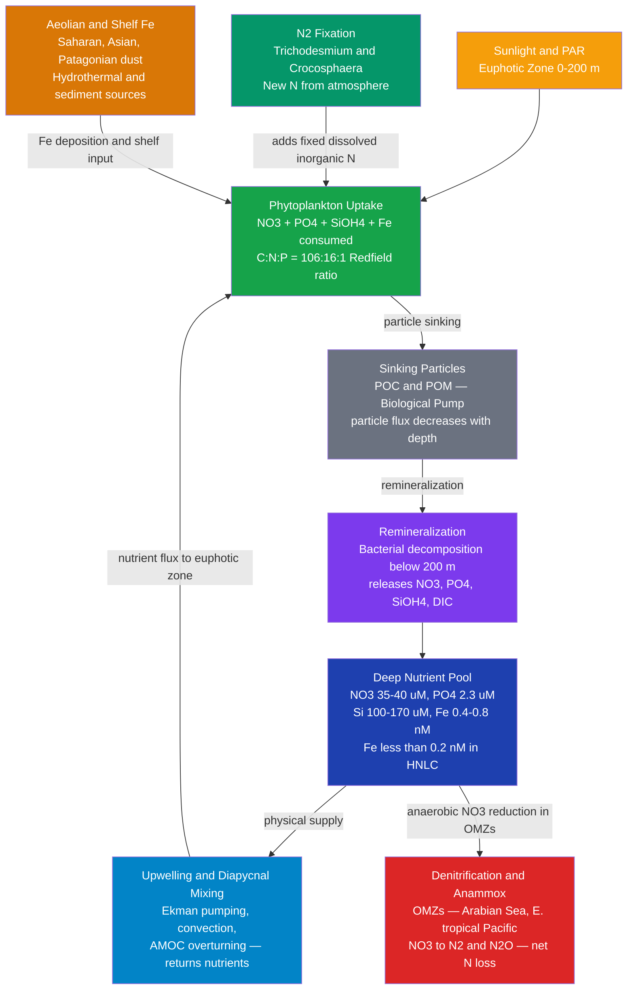

# Ocean Nutrient Cycles and Trace Elements

> [!abstract] TL;DR
> Ocean productivity is controlled by inorganic macronutrients — nitrate (NO₃⁻), phosphate (PO₄³⁻), and silicic acid Si(OH)₄ — plus the trace element iron (Fe), whose vanishingly small concentrations (< 0.2 nM) bottleneck photosynthesis across vast swaths of the Southern Ocean, equatorial Pacific, and subarctic North Pacific. Phytoplankton consume these nutrients in the near-constant **Redfield ratio** C:N:P = 106:16:1 (by atoms); nutrients depleted at the sunlit surface are replenished from depth by upwelling and mixing, establishing the **nutricline** that links physical circulation to biological productivity. The marine nitrogen cycle is shaped by N₂ fixation by cyanobacteria (adding new nitrogen) and denitrification in oxygen minimum zones (removing fixed nitrogen as N₂ and N₂O). The GEOTRACES program is now mapping trace element distributions at basin scale, revealing hydrothermal vents and continental shelves as iron sources comparable to or exceeding atmospheric dust in the ocean interior.

---

## Intuition

**Analogy:** Nutrients in the ocean work exactly like NPK fertilizer in a garden. If you have plenty of sunlight but run out of nitrogen, plant growth stalls. In a typical coastal garden the limiting nutrient is N or P, and adding more of either restores growth. But now imagine a strange garden with plenty of N and P where the soil simply contains no iron — the plants have wilted anyway, because they cannot synthesize the enzymes and pigments that run photosynthesis without Fe. That is exactly the situation in High Nutrient Low Chlorophyll (HNLC) regions of the open ocean: nitrate and phosphate are abundant, but dissolved iron is so scarce (< 0.2 nM — roughly one iron atom per trillion water molecules) that phytoplankton cannot bloom.

The "fertilizer metaphor" deepens further: the ocean's garden soil has a characteristic stoichiometry. Alfred Redfield discovered in 1958 that both living phytoplankton and the deep ocean's dissolved inorganic nutrients share the same atomic ratio — C:N:P ≈ 106:16:1 — implying that biology and ocean chemistry have co-evolved into a steady state governed by the Redfield ratio. The nutricline (the depth zone where nutrients jump from near-zero to deep-ocean values) marks the boundary between the "nutrient-depleted topsoil" where phytoplankton live and the "rich subsoil" below — a boundary that upwelling and mixing occasionally breach to deliver nutrients upward.

---

## How It Works

### Macronutrients

**Nitrate (NO₃⁻).**
The primary dissolved inorganic nitrogen source for most phytoplankton. Surface concentrations are typically < 0.5 µM in oligotrophic gyres and < 1 µM in HNLC regions despite deep-water values of 35–40 µM. Phytoplankton reduce nitrate to ammonium during assimilation at a metabolic cost of ~25 ATP equivalents per N; they preferentially use ammonium (NH₄⁺) when available. Nitrite (NO₂⁻) accumulates at the primary nitrite maximum (~50–100 m) where nitrification is inhibited by light and phytoplankton excrete it.

**Phosphate (PO₄³⁻).**
Consumed in direct proportion to N at the Redfield ratio (N:P = 16:1). Surface values range from 0.01 µM (oligotrophic subtropical gyres) to ~0.8 µM (upwelling zones). Deep-ocean values are ~2.2–2.5 µM. Unlike N, there is no gaseous reservoir for P in the ocean — rivers and atmospheric dust are the only external sources. The ocean's phosphorus residence time is ~20,000–100,000 years.

**Silicic acid Si(OH)₄.**
Required specifically by diatoms (and radiolarians, silicoflagellates) for their opaline frustules. Surface concentrations are 0–5 µM in productive regions and < 1 µM in tropical oligotrophic waters; deep Pacific values reach 100–170 µM, far exceeding N and P equivalents under Redfield scaling. This excess results from the much slower dissolution of biogenic silica relative to organic carbon remineralization: roughly 50–75% of biogenic silica dissolves in the top 1000 m, vs ~80–90% of organic C.

### The Redfield Ratio

Alfred Redfield (1958) observed that the elemental ratio of C:N:P in phytoplankton cellular biomass (106:16:1 by atoms) matches the deep-ocean drawdown ratio of dissolved inorganic carbon, nitrate, and phosphate:

$$\frac{\Delta[\text{NO}_3^-]}{\Delta[\text{PO}_4^{3-}]} \approx 16 \qquad \frac{\Delta \text{DIC}}{\Delta[\text{PO}_4^{3-}]} \approx 106$$

This equivalence implies a quasi-steady state in which ocean biology has shaped ocean chemistry over geological timescales (or vice versa). The simplified net photosynthesis/remineralization equation is:

$$106\,\text{CO}_2 + 16\,\text{NO}_3^- + \text{PO}_4^{3-} + 122\,\text{H}_2\text{O} + 18\,\text{H}^+ \rightleftharpoons \text{C}_{106}\text{H}_{263}\text{O}_{110}\text{N}_{16}\text{P} + 138\,\text{O}_2$$

(forward = photosynthesis; reverse = aerobic remineralization)

The Redfield ratio has three important qualifications:
1. It is a **statistical average** across thousands of species; individual taxa deviate by 2–3×.
2. Under iron or phosphorus stress, phytoplankton **down-regulate N and P quotas** (flexible stoichiometry), raising C:N:P ratios.
3. An **extended Redfield ratio** includes Fe and Si: C:N:P:Fe:Si ≈ 106:16:1:0.0005:15 (for diatoms in the modern ocean), though Fe and Si stoichiometry are far more variable.

### Liebig's Law and Nutrient Limitation

**Liebig's Law of the Minimum** states that growth rate is controlled by the single most deficient nutrient relative to biological demand. In the ocean:

| Region | Surplus nutrients | Limiting nutrient |
|---|---|---|
| Subtropical gyres (NPSG, SPSG) | Fe adequate | N (and sometimes P in North Atlantic gyre) |
| Southern Ocean | NO₃⁻, PO₄³⁻ abundant | Fe (< 0.05–0.2 nM) |
| Equatorial Pacific | NO₃⁻, PO₄³⁻ abundant | Fe |
| Subarctic North Pacific | NO₃⁻, PO₄³⁻ abundant | Fe (plus light in winter) |
| Coastal upwelling | Everything abundant | Light (very high nutrients) |

### The Nutricline

The **nutricline** is the vertical zone of rapid nutrient increase, typically colocated with the thermocline and pycnocline:

- **Euphotic zone (0–150 m):** nutrients nearly exhausted by phytoplankton uptake; concentrations near zero except in upwelling zones.
- **Nutricline (50–300 m):** nutrient concentration increases sharply, reflecting the transition from net production to net remineralization.
- **Deep ocean (> 300 m):** nutrients accumulate from continuous remineralization of sinking organic matter; approach asymptotic deep values.

The nutricline deepens in strongly stratified subtropical gyres (can exceed 200 m in summer) and shoals in subpolar regions where deep winter mixing erases stratification and entrains deep nutrients.

### Iron Limitation and HNLC Regions

Dissolved iron concentrations in the surface ocean of HNLC regions are **< 0.05–0.2 nM**, compared to 0.4–1.0 nM in dust-rich areas (North Atlantic, Arabian Sea) and > 2 nM near continental shelves.

**Sources of dissolved Fe to the surface ocean:**
- **Aeolian dust:** dominant in the Atlantic and western North Pacific; Saharan dust fertilizes much of the tropical Atlantic; Gobi/Taklamakan dust fertilizes the North Pacific.
- **Continental shelf sediments:** reducing conditions mobilize Fe(II) from shelf muds; coastal upwelling carries this iron offshore.
- **Hydrothermal vents:** mid-ocean ridge venting releases Fe(II) and Fe(III)-oxyhydroxide nanoparticles; once thought to be entirely scavenged locally, GEOTRACES shows hydrothermal iron plumes extending thousands of km.
- **Upwelling:** brings deep-water Fe (~0.4–0.8 nM) to the surface, though still iron-limited in the Southern Ocean.

**Iron fertilization experiments** confirmed the hypothesis directly:
- **IRONEX I (1993) and II (1995)** — John Martin's team added iron sulfate to the equatorial Pacific; chlorophyll increased 27-fold, pCO₂ dropped ~90 µatm in the patch.
- **SOIREE (1999)** — Southern Ocean; Fe addition produced a large diatom bloom lasting weeks, with measurable CO₂ drawdown.
- Later experiments (SERIES, LOHAFEX, SAGE) showed that carbon export efficiency varies greatly by diatom community composition.

### Nitrogen Cycle

The marine N cycle is the most complex of the nutrient cycles because of redox-active N species and biological transformations at both ends:

**N₂ Fixation.** Diazotrophic cyanobacteria (primarily *Trichodesmium*, *Crocosphaera*, and heterocyst-forming diatom symbionts) reduce N₂ gas to NH₄⁺ using the nitrogenase enzyme. This process requires substantial energy (~16 ATP per N₂), abundant sunlight, P, and Fe (nitrogenase is Fe-rich). It is concentrated in warm (>25°C), oligotrophic, N-depleted tropical and subtropical waters. Global marine N₂ fixation rate: ~120–200 Tg N yr⁻¹.

**Nitrification.** Ammonium oxidizers (*Nitrosomonas*, *Nitrosospira* and ammonia-oxidizing archaea, AOA) convert NH₄⁺ → NO₂⁻; nitrite oxidizers (*Nitrospira*) then convert NO₂⁻ → NO₃⁻. Nitrification is inhibited by light (< 1% PAR) and by the presence of phytoplankton competing for NH₄⁺, which explains why it is concentrated in the upper mesopelagic (100–300 m) rather than the euphotic zone.

**Denitrification.** In oxygen minimum zones (OMZs; dissolved O₂ < 5–10 µM), heterotrophic bacteria use NO₃⁻ as terminal electron acceptor to oxidize organic matter: 4 NO₃⁻ + 5 CH₂O → 2 N₂ + 5 CO₂ + 3 H₂O + 4 OH⁻. This permanently removes fixed N from the ocean and produces N₂O (a potent greenhouse gas, ~300× CO₂ global warming potential) as an intermediate. Major OMZ denitrification hotspots: Arabian Sea, eastern tropical North and South Pacific. Global marine denitrification: ~120–200 Tg N yr⁻¹, approximately balancing N₂ fixation.

**Anammox (anaerobic ammonium oxidation).** Discovered in 1999, anammox bacteria couple NH₄⁺ oxidation to NO₂⁻ reduction: NH₄⁺ + NO₂⁻ → N₂ + 2 H₂O. This pathway contributes ~20–50% of N₂ production in OMZs.

### Silica Cycle

Diatoms precipitate dissolved Si(OH)₄ as amorphous opal (SiO₂·nH₂O) frustules. The silica cycle is distinct from N and P:
- Biogenic silica (bSi) dissolves slowly — hours to weeks for diatom frustules vs hours for dissolved organic P/N remineralization.
- The Southern Ocean is the engine of the marine Si cycle: ~50% of global biogenic silica production occurs there, driven by giant diatom blooms in austral spring/summer.
- Si has a shorter residence time (~10,000 years) than P (~100,000 years), and its distribution reflects both biological productivity and the incomplete return of Si from the seafloor.

### Nutrient Cycle Diagram



---

## Key Concepts / Details

### Secondary Level

- **The open ocean is blue because it is a nutrient desert.** The clearest, deepest-blue ocean water occurs in subtropical gyres where the nutricline is deep and phytoplankton concentrations are extremely low (~0.05 mg Chl m⁻³). Without phytoplankton to scatter green and absorb red light, the water looks pure blue. Coastal and upwelling waters are green-brown because nutrients are abundant and phytoplankton bloom.
- **NPK for ocean plants.** Land plants need nitrogen, phosphorus, and potassium from fertilizer. Ocean phytoplankton need nitrogen (as NO₃⁻ or NH₄⁺), phosphorus (as PO₄³⁻), and sometimes silica (for diatoms and their glassy shells). In much of the open ocean, even trace amounts of iron govern how fast all the other nutrients can be used.
- **Upwelling brings up the "subsoil."** Below the sun-lit surface layer, nutrients accumulate because sinking organic matter decomposes and releases nutrients back to solution. This nutrient-rich deep water cannot reach phytoplankton unless something physically lifts it: coastal upwelling, storm mixing, or thermohaline circulation. That is why upwelling coasts like Peru and California are enormously productive while the surrounding open ocean is barren.
- **Why does the ocean not run out of nutrients?** Nutrients are continuously recycled: phytoplankton take them up, die or are eaten, sink, decompose, and the dissolved nutrients are eventually returned to the surface by mixing. The system leaks a small fraction to deep-sea sediments, but on timescales of decades to centuries it is essentially in balance.

### Undergraduate Level

**Redfield ratio derivation and significance.**
Redfield noticed that the slope of NO₃⁻ vs PO₄³⁻ in deep-ocean profiles is consistently ~16, matching the N:P ratio of phytoplankton biomass. This implies that the biological pump does not fractionate N from P — they are produced and consumed in constant proportion. The ratio's significance is threefold: (1) it allows prediction of nutrient depletion from a single measurement; (2) deviations from Redfield stoichiometry in the deep ocean signal biological or physical anomalies; (3) N:P ratios > 16 in a water mass indicate N₂ fixation is enriching the N pool (the North Atlantic gyre has N:P ~ 20–22 near N₂ fixation zones).

**Liebig's Law and co-limitation.**
The strict Liebig minimum model predicts one limiting nutrient at a time. In practice, phytoplankton frequently show **co-limitation** where multiple nutrients constrain growth simultaneously (e.g., Fe and light co-limit the Southern Ocean in austral winter). The Droop model of nutrient-limited growth captures this by relating specific growth rate $\mu$ to cellular nutrient quota $Q$:

$$\mu = \mu_{max}\left(1 - \frac{Q_{min}}{Q}\right)$$

where $Q_{min}$ is the minimum quota below which growth ceases and $Q$ is the actual intracellular concentration.

**Nutricline depth, seasonality, and mixing.**
In stratified subtropical gyres, the nutricline is deep (~100–200 m) and effectively decoupled from the euphotic zone. Phytoplankton at depth form a **deep chlorophyll maximum (DCM)** at the top of the nutricline where enough nutrients diffuse upward to sustain growth despite reduced light. In winter, deep mixing erases the nutricline, entraining nutrients into the surface layer — this is the mechanism for the North Atlantic spring bloom.

**Iron cycling: sources and sinks.**
Dissolved Fe (dFe) in the ocean is maintained at extremely low concentrations (~0.05–1 nM) by three competing processes: (1) biological uptake and incorporation into proteins (photosystems I/II, nitrogenase, cytochromes); (2) scavenging onto particle surfaces and removal by sinking; (3) organic complexation by iron-binding ligands (siderophores, humic substances) which keep Fe in solution. In OMZs, Fe(II) is stable and accumulates to higher concentrations than in oxygenated water.

**Stoichiometric imbalance in OMZs.**
When denitrification removes NO₃⁻ preferentially (without removing PO₄³⁻), the resulting water has a N:P ratio below 16 — a **nitrogen deficit** (N*):

$$N^* = [\text{NO}_3^-] - 16\,[\text{PO}_4^{3-}] + 2.9 \quad (\text{µmol kg}^{-1})$$

Negative N* values trace water masses influenced by denitrification (e.g., Antarctic Intermediate Water, Eastern Tropical Pacific). Positive N* values indicate N₂ fixation (North Atlantic subtropical gyre).

### Graduate Level

**Extended Redfield stoichiometry.**
The Anderson and Sarmiento (1994) extended Redfield ratio accounts for O₂ consumption during remineralization:

$$\Delta\text{O}_2 : \Delta\text{C} : \Delta\text{N} : \Delta\text{P} = -138 : -106 : -16 : -1$$

Deviations from this canonical ratio occur for specific organic matter pools: CDOM (high C:N), biogenic lipids (high C:N), and transparent exopolymer particles (TEP, very high C:P). Modern global biogeochemical models use **flexible stoichiometry** (Geider et al. 1998 approach) to account for these deviations under nutrient stress.

**Iron bioavailability and organic complexation.**
In seawater, > 99% of dissolved Fe is organically complexed with siderophore-like ligands (class L1, log K ~ 20–23) and humic substances (class L2, log K ~ 18–20). Only the tiny fraction of inorganic Fe' (Fe³⁺, FeOH²⁺, Fe(OH)₂⁺) is directly bioavailable for many phytoplankton. Some taxa express high-affinity uptake systems or produce their own siderophores to compete for ligand-bound Fe. The concentration and speciation of ligands is now mapped globally via GEOTRACES electrochemical measurements (competitive ligand exchange adsorptive cathodic stripping voltammetry, CLE-ACSV).

**GEOTRACES program and trace element distributions.**
The international GEOTRACES program (2010–present) has completed 35+ ocean sections measuring full-depth profiles of dissolved and particulate Fe, Mn, Zn, Co, Cd, Cu, Ni, and their isotopes. Key findings:
- Hydrothermal Fe plumes from the Mid-Atlantic Ridge extend > 4000 km westward into the Atlantic gyre interior (Resing et al. 2015 *Nature*).
- Benthic shelf sediments supply Fe to the Southern Ocean mixed layer via isopycnal transport, partially alleviating Fe limitation near the Kerguelen Plateau.
- Cadmium (Cd) behaves like a nutrient (Cd:P ~ constant), making δ¹¹⁴Cd in foraminifera a palaeoproductivity proxy.
- Zinc and cobalt are co-limiting with Fe in parts of the Southern Ocean.

**Denitrification rate in OMZs and N₂O production.**
Global denitrification removes ~120–200 Tg N yr⁻¹, approximately balanced by N₂ fixation. In the Arabian Sea OMZ (~300–1000 m), denitrification rates of 15–50 nmol N L⁻¹ d⁻¹ have been measured (using ¹⁵N tracer incubations). The Arabian Sea alone accounts for ~15% of global oceanic N loss. N₂O production is maximised at the OMZ boundaries where O₂ is 5–20 µM — low enough for incomplete denitrification (stopping at N₂O) but high enough for nitrification. Under climate warming, expanding OMZs will amplify N₂O emissions.

**Climate change effects on nutrient supply.**
Warming increases upper-ocean stratification, deepening the nutricline and reducing the diapycnal diffusivity that supplies nutrients to the euphotic zone. Model projections (CMIP6) suggest:
- Global marine net primary production will decline 2–10% by 2100 under high-emission scenarios due to nutrient starvation.
- Subtropical gyres will expand northward/southward, extending nutrient deserts.
- Diatom (silica-dependent) communities will decline relative to smaller phytoplankton that are better adapted to low-nutrient conditions.
- The biological pump efficiency may decrease as smaller, slower-sinking particles replace diatom-aggregated material.

---

## Python Demo

```python
# Vertical profiles of NO3-, PO4^3-, Si(OH)4, and dissolved Fe
# for a typical oligotrophic open-ocean station (HOT/ALOHA-type, North Pacific).
# Uses sigmoidal parameterizations with realistic surface depletion and deep values.

import numpy as np
import matplotlib.pyplot as plt

# Depth array (m, 0 = surface)
z = np.linspace(0, 2000, 1000)

def sigmoidal(z, C_surf, C_deep, z_mid, dz):
    """Sigmoidal nutrient profile: surface depleted, deep enriched."""
    return C_surf + (C_deep - C_surf) / (1.0 + np.exp(-(z - z_mid) / dz))

# --- Macronutrient profiles (units: µM) ---
# NO3-: surface ~0.2 uM (oligotrophic), deep ~36 uM, nutricline centered at 120 m
NO3  = sigmoidal(z, 0.20, 36.0, 120, 22)

# PO4^3-: Redfield N:P = 16:1, so PO4_deep = 36/16 = 2.25 uM
PO4  = sigmoidal(z, 0.04, 2.25, 120, 22)

# Si(OH)4: deeper nutricline (~160 m center), higher deep value in Pacific (~160 uM)
SiOH4 = sigmoidal(z, 1.20, 165.0, 165, 35)

# --- Iron profile (units: nM) ---
# Background dissolved Fe: very low surface (<0.1 nM), increases slowly with depth
Fe_bg = sigmoidal(z, 0.06, 0.70, 500, 150)
# Aeolian dust pulse: Gaussian enrichment near the surface (~15-30 m depth)
Fe_dust = 0.22 * np.exp(-((z - 20.0)**2) / (2 * 25.0**2))
# HNLC threshold line
Fe_hnlc = 0.20  # nM
Fe = Fe_bg + Fe_dust

# --- Plot ---
fig, axes = plt.subplots(1, 4, figsize=(15, 7), sharey=True)
fig.suptitle(
    "Open-Ocean Nutrient Vertical Profiles (HOT/ALOHA-type station, North Pacific Gyre)",
    fontsize=12, y=1.01
)

plot_specs = [
    (NO3,   "NO₃⁻ (μM)",         "#1d4ed8", "Nitrate",     None),
    (PO4,   "PO₄³⁻ (μM)",   "#15803d", "Phosphate",   None),
    (SiOH4, "Si(OH)₄ (μM)",           "#7c3aed", "Silicic Acid",None),
    (Fe,    "Dissolved Fe (nM)",                 "#b45309", "Iron",        Fe_hnlc),
]

# Depth ranges for display
z_disp = z  # show 0-2000 m

for ax, (nutrient, xlabel, color, title, threshold) in zip(axes, plot_specs):
    ax.plot(nutrient, z_disp, color=color, lw=2.5)
    ax.invert_yaxis()
    ax.set_ylim(2000, 0)
    ax.set_xlabel(xlabel, fontsize=10)
    ax.set_title(title, fontsize=11, fontweight="bold")
    ax.grid(alpha=0.25)

    # Shade mixed layer and nutricline reference lines
    ax.axhline(50,  color="gray", ls=":",  lw=1.2, alpha=0.7, label="Mixed layer ~50 m")
    ax.axhline(200, color="gray", ls="--", lw=1.2, alpha=0.7, label="Nutricline base ~200 m")

    if threshold is not None:
        ax.axvline(threshold, color="red", ls="--", lw=1.5,
                   label=f"HNLC threshold ({threshold} nM)")
        ax.legend(fontsize=8)
    else:
        ax.legend(fontsize=8)

axes[0].set_ylabel("Depth (m)", fontsize=11)

# Annotate Redfield ratio on PO4 panel
axes[1].text(0.55, 0.60, "Redfield\nN:P = 16:1\nshares same\nnutricline",
             transform=axes[1].transAxes, fontsize=8, color="#15803d",
             va="center", ha="center",
             bbox=dict(boxstyle="round,pad=0.3", facecolor="white", alpha=0.8))

# Annotate aeolian Fe pulse on Fe panel
axes[3].annotate("Aeolian\nFe pulse\n(~0-50 m)",
                 xy=(Fe_dust.max() + 0.06, 20), fontsize=8, color="#b45309",
                 ha="left",
                 arrowprops=dict(arrowstyle="->", color="#b45309"),
                 xytext=(0.35, 0.05))

plt.tight_layout()
plt.savefig("nutrient_profiles_ocean.png", dpi=120, bbox_inches="tight")
plt.show()

# --- Summary statistics ---
no3_surf = NO3[z <= 10].mean()
no3_deep = NO3[z >= 1000].mean()
po4_surf = PO4[z <= 10].mean()
po4_deep = PO4[z >= 1000].mean()
si_surf  = SiOH4[z <= 10].mean()
si_deep  = SiOH4[z >= 1000].mean()
fe_surf  = Fe[z <= 10].mean()
fe_deep  = Fe[z >= 1000].mean()

print("Surface (0-10 m) / Deep (>1000 m) nutrient values:")
print(f"  NO3:  {no3_surf:.2f} / {no3_deep:.1f} µM  (deep N:P ratio = {no3_deep/po4_deep:.1f})")
print(f"  PO4:  {po4_surf:.3f} / {po4_deep:.2f} µM")
print(f"  Si:   {si_surf:.2f}  / {si_deep:.1f} µM")
print(f"  Fe:   {fe_surf:.3f} / {fe_deep:.3f} nM")
print(f"  Surface Fe vs HNLC threshold (0.2 nM): {'HNLC conditions' if fe_surf < 0.2 else 'Fe sufficient'}")
```

The four-panel plot shows the characteristic shape: near-zero nutrient concentrations at the surface, a sigmoid jump across the nutricline (50–200 m), and asymptotic approach to deep values. The iron panel shows a shallow aeolian dust pulse superimposed on the rising background profile, with the HNLC threshold line confirming surface iron concentrations far below 0.2 nM at this oligotrophic station.

---

## Real-World Notes

**Southern Ocean iron fertilization and the CO₂ sequestration debate.**
The Southern Ocean accounts for ~40% of global anthropogenic CO₂ uptake. Since it is iron-limited, proposals to fertilize it with iron to enhance carbon export have attracted decades of debate. SOIREE and subsequent experiments showed that Fe addition produces a bloom, but carbon export efficiency (fraction of surface production reaching depth > 100 m) remained low (< 5%) because microzooplankton grazed the extra phytoplankton before they could sink. The London Protocol (2013 amendment) now restricts large-scale ocean fertilization as geoengineering without scientific permits, citing ecological risk.

**GEOTRACES global section surveys.**
By 2025, GEOTRACES had completed sections in every major ocean basin, producing the first global atlas of trace element and isotope (TEI) distributions. Highlights include: the discovery of large Fe and Mn plumes from slow-spreading ridges (Mid-Atlantic, Indian Ocean); the mapping of dissolved Al as a tracer of Saharan dust; and the demonstration that the mesopelagic zone remineralizes far more TEIs than previously thought (the "twilight zone" problem), meaning nutrient models underestimate interior cycling.

**Arabian Sea denitrification hotspot.**
The Arabian Sea OMZ (dissolved O₂ < 5 µmol kg⁻¹ from ~150–1250 m depth) is the largest single oceanic denitrification zone, responsible for ~15% of total marine N loss (~15–25 Tg N yr⁻¹). Sediment resuspension and advection of low-O₂ water from the north-western margins fuel particularly intense denitrification during the SW monsoon. The resulting N* anomaly of –10 to –15 µM is detectable in Indian Ocean thermocline waters thousands of kilometres away.

**Amazon River and tropical Atlantic iron fertilization.**
The Amazon River delivers ~3–4 × 10¹⁰ g of dissolved and colloidal Fe to the tropical Atlantic per year, fertilizing the western tropical Atlantic with an Fe flux comparable to Saharan dust. This supports high N₂ fixation rates by *Trichodesmium* in the iron-replete Amazon Plume region (N:P up to 24), contributing disproportionately to Caribbean basin productivity.

**Dust input to the Mediterranean.**
The Mediterranean receives some of the highest Saharan dust fluxes on Earth (~5–30 g m⁻² yr⁻¹ vs ~1–2 g m⁻² yr⁻¹ in the open North Atlantic). Despite this, the western Mediterranean is phosphorus-limited, not iron-limited — the Saharan dust delivers enough Fe but the high Fe:P ratio of dust pushes the ocean toward P limitation. This is a clear case where Liebig's minimum switches from Fe to P depending on external input stoichiometry.

---

## Common Pitfalls

- **Assuming N is always the proximate limiting nutrient.** In textbooks, nitrogen is presented as the most common limiting nutrient in marine systems. This holds for coastal waters and some open-ocean regions, but in HNLC regions covering ~30–40% of the global ocean surface area (Southern Ocean, equatorial Pacific, subarctic Pacific), NO₃⁻ and PO₄³⁻ are abundant and iron is the proximate limit. Adding NO₃⁻ to HNLC water does not trigger a bloom; adding Fe does.
- **Ignoring silica as a macronutrient.** Most nutrient-cycle diagrams discuss only N and P. But diatoms — responsible for roughly 20% of global primary production and a disproportionate share of carbon export via their dense silica frustules — require Si(OH)₄. Si limitation switches diatom communities to flagellate-dominated assemblages with lower export efficiency. In the Southern Ocean, depletion of Si(OH)₄ in surface waters controls where and when diatom blooms can occur.
- **Treating the Redfield ratio as a fixed constant.** The 106:16:1 ratio is a statistical mean for bulk phytoplankton; individual species deviate by factors of 2–5. Under phosphorus limitation, phytoplankton raise their C:P ratio dramatically (up to 500:1 in Prochlorococcus under severe P stress). Under iron limitation, C:N and C:P rise as phytoplankton reduce protein synthesis. Biogeochemical models that hard-code Redfield stoichiometry overestimate nutrient drawdown under oligotrophic conditions.
- **Confusing denitrification as a depth process rather than a low-oxygen process.** Students often think denitrification occurs only in sediments. In the ocean, water-column denitrification in OMZs (200–900 m depth) dominates the global N loss budget. The controlling variable is O₂ concentration (< 5–10 µM), not depth per se. Under climate warming, OMZ expansion increases water-column denitrification and N₂O production even in the open ocean, not just in near-shore sediments.
- **Overlooking anammox as a significant N-loss pathway.** Denitrification was historically assumed to be the sole mechanism of fixed-N removal from the ocean. Anammox (NH₄⁺ + NO₂⁻ → N₂) was discovered in 1999 and now accounts for 20–50% of N₂ production in OMZs. Including anammox roughly halves the required organic carbon oxidation rate to sustain observed N-loss rates, which had previously seemed implausibly high for some OMZs.

---

## Related Concepts

**Same vault:**
- [[Ekman_Transport_and_Coastal_Upwelling]] — the primary physical mechanism delivering remineralized deep nutrients (NO₃⁻, PO₄³⁻, Si(OH)₄) back to the euphotic zone; explains why Eastern Boundary Upwelling Systems are the ocean's most productive regions.
- [[Density_Stratification_and_Mixing]] — stratification depth controls nutricline depth and the rate of diapycnal nutrient supply; deeper stratification under warming reduces nutrient flux to the surface.
- [[Thermohaline_Circulation_and_AMOC]] — the deep overturning circulation completes the nutrient cycle on centennial–millennial timescales by returning remineralized deep-water nutrients to the surface; shutdown of AMOC would trap nutrients in the deep Atlantic.
- [[Turbulence_and_Diapycnal_Mixing]] — the dominant mechanism for nutrient supply across the nutricline in non-upwelling regions; parameterized as a diapycnal diffusivity $K_\rho$ (~10⁻⁵ m² s⁻¹) times the vertical nutrient gradient.
- [[Ocean_Optics_and_Light_Penetration]] — the euphotic zone depth sets the upper boundary of the productive layer; comparing mixed layer depth to euphotic depth determines whether phytoplankton spend enough time in the light to use available nutrients.
- [[Marine_Primary_Production_and_Phytoplankton]] — nutrient availability directly limits phytoplankton growth rate via Liebig's Law; iron, N, and P all modulate community composition (diatoms vs flagellates) and the biological pump's carbon export efficiency.
- [[The_Oceanic_Carbon_Cycle]] — nutrient uptake and the biological pump are the biological component of ocean carbon cycling; Redfield stoichiometry links nutrient drawdown to carbon sequestration.
- [[The_Biological_Pump_and_Carbon_Export]] — the sinking flux of POC that removes surface nutrients and carbon to depth; particle composition (diatom vs coccolithophore vs flagellate) governs both remineralization depth and silicon cycling.
- [[Dissolved_Oxygen_and_Redox_Chemistry]] — oxygen consumption during remineralization creates the OMZs where denitrification and anammox occur; the N* tracer requires O₂ data to interpret.
- [[_MOC_Chemical_Oceanography]] — section map for chemical oceanography topics in this vault.

**Cross-vault:**
- [[Chemical_Kinetics]] — controls the rates of nitrification, denitrification, and biogenic silica dissolution; enzyme kinetics (Michaelis-Menten) describe nutrient uptake at the cellular level.
- [[Chemical_Thermodynamics]] — governs Fe speciation (Fe²⁺ vs Fe³⁺), carbonate chemistry, and the thermodynamics of N₂ fixation (highly endergonic: ΔG° ≈ +300 kJ mol⁻¹ N₂).
- [[Acids_Bases_and_pH]] — seawater pH (~7.8–8.3) controls the speciation of phosphate (H₂PO₄⁻ vs HPO₄²⁻ vs PO₄³⁻) and of inorganic carbon (CO₂/HCO₃⁻/CO₃²⁻), which interact with nutrient cycling via the Redfield relationship.
- [[_MOC_Chemistry_Master]] — entry point for chemistry vault notes on thermodynamics, kinetics, and acid-base chemistry underlying ocean biogeochemistry.

---

## Review Questions

### Secondary Level

1. The Sahara Desert produces enormous dust storms that blow iron-rich particles over the Atlantic Ocean. Using what you know about iron limitation, predict how this might affect phytoplankton growth in the tropical Atlantic versus the Southern Ocean, and explain the difference.
2. Why does the open Pacific Ocean appear deep blue while the coast of Peru appears green during non-El Nino years? Trace the mechanism from wind to nutrients to phytoplankton to ocean color.
3. A marine biologist adds nitrogen and phosphorus fertilizer to an HNLC patch in the Southern Ocean. She observes almost no increase in phytoplankton chlorophyll. What nutrient is she missing, and why did her experiment fail?

### Undergraduate Level

1. A water sample from 800 m depth in the eastern tropical Pacific has [NO₃⁻] = 15 µM and [PO₄³⁻] = 2.1 µM. Calculate the N* value and interpret it geochemically. What biological process has influenced this water mass, and where did it likely occur?
2. The Redfield ratio predicts that for every 1 µmol PO₄³⁻ consumed by phytoplankton, 16 µmol NO₃⁻ and 106 µmol DIC should also be consumed. A surface ocean sample shows ΔPO₄³⁻ = −0.4 µM and ΔDIC = −30 µM. Calculate the expected ΔNO₃⁻ from Redfield alone, then explain why the observed ΔNO₃⁻ might be lower than expected in a region with active *Trichodesmium* blooms.
3. Explain why the nutricline is much shallower in the subpolar North Atlantic in February than in the subtropical North Pacific in July, referencing mixed layer depth, stratification, and the seasonal cycle of phytoplankton nutrient demand.

### Graduate Level

1. The GEOTRACES GP16 section across the South Pacific found elevated dissolved Fe concentrations (~1 nM) in a plume extending 4000 km west of the East Pacific Rise, compared to background HNLC values of < 0.1 nM. Quantify the iron fertilization potential of this plume and discuss what controls whether this hydrothermal Fe actually reaches the euphotic zone 4000 km away (consider organic complexation, scavenging, isopycnal transport, and buoyancy-driven plume dynamics).
2. A climate model predicts that stratification of the upper 200 m of the Southern Ocean intensifies by 20% by 2100 due to freshwater input from ice sheet melt, with diapycnal diffusivity declining by 15%. Using a simple 1D nutrient supply model ($J = K_\rho \cdot \partial C / \partial z$), estimate the fractional change in NO₃⁻ supply to the euphotic zone. Then discuss two additional mechanisms (beyond diffusion) by which stratification changes could alter Southern Ocean productivity.
3. N₂ fixation by *Trichodesmium* requires ~16 moles of Fe per mole of N fixed (via the Fe-rich nitrogenase enzyme), compared to ~0.0005 mol Fe per mol P demanded by the mean phytoplankton biomass under Redfield stoichiometry. In an iron-limited subtropical gyre where dissolved Fe = 0.15 nM, show qualitatively whether N₂ fixation is feasible based on Fe stoichiometry alone, and explain why *Trichodesmium* thrives in the iron-replete tropical Atlantic but is rare in the iron-limited Southern Ocean.

---

## Sources

- [Redfield, A. C. (1958). The biological control of chemical factors in the environment. *American Scientist*, 46(3), 205–221.](https://www.jstor.org/stable/27827139) — original observation of the Redfield ratio linking phytoplankton stoichiometry to deep-ocean chemistry.
- [Martin, J. H. et al. (1994). Testing the iron hypothesis in ecosystems of the equatorial Pacific Ocean. *Nature*, 371, 123–129.](https://doi.org/10.1038/371123a0) — IRONEX II; landmark in-situ iron fertilization experiment confirming Fe limitation in HNLC waters.
- [Sarmiento, J. L. & Gruber, N. (2006). *Ocean Biogeochemical Dynamics*. Princeton University Press.](https://press.princeton.edu/books/hardcover/9780691017075/ocean-biogeochemical-dynamics) — comprehensive graduate-level treatment of nutrient cycles, Redfield stoichiometry, and ocean biogeochemistry.
- [Moore, J. K., et al. (2013). Marine ecosystem dynamics and biogeochemical cycling in the Community Earth System Model [CESM1(BGC)]. *Journal of Climate*, 26(23), 9291–9321.](https://doi.org/10.1175/JCLI-D-12-00566.1) — iron limitation parameterization and extended Redfield stoichiometry in a global Earth System Model.
- [GEOTRACES Science Plan (2006/updated 2023). SCOR Working Group.](https://www.geotraces.org/science/science-plan/) — framework for global trace element and isotope section surveys; defines measurement standards and key science questions.
- [Anderson, L. A. & Sarmiento, J. L. (1994). Redfield ratios of remineralization determined by nutrient data analysis. *Global Biogeochemical Cycles*, 8(1), 65–80.](https://doi.org/10.1029/93GB03318) — derivation of the extended Redfield ratio including O₂:C:N:P from deep-ocean nutrient data.
- [Gruber, N. & Galloway, J. N. (2008). An Earth-system perspective of the global nitrogen cycle. *Nature*, 451, 293–296.](https://doi.org/10.1038/nature06592) — synthesis of marine and terrestrial N cycle including denitrification, anammox, and N₂ fixation fluxes.

---

#Oceanography #ChemicalOceanography #NutrientCycles #RedfieldRatio #IronLimitation
