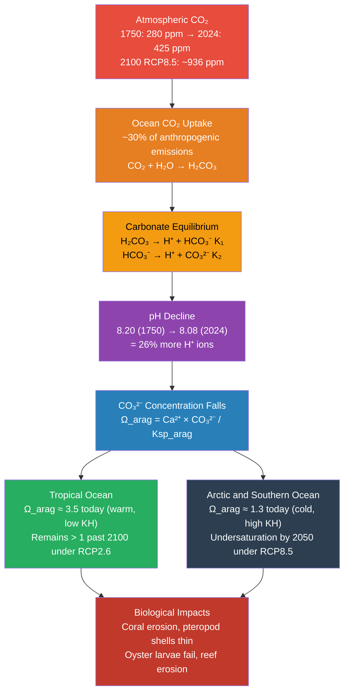

# 🌊 Ocean Acidification

> [!abstract] TL;DR
> Ocean acidification is the ongoing decrease in seawater pH caused by the ocean absorbing anthropogenic CO₂ from the atmosphere — a process that has driven surface pH from 8.20 (pre-industrial) to ~8.08 today, a 26% increase in hydrogen-ion concentration. As pH falls, the carbonate-ion concentration drops, reducing the aragonite and calcite saturation states (Ω) that corals, oysters, pteropods, and foraminifera rely on to build and maintain shells and skeletons. Polar and subpolar seas face aragonite undersaturation (Ω_arag < 1) by 2050–2100 under high-emission scenarios, threatening food webs from the base upward. Because acidification acts synergistically with warming and deoxygenation, the effective stress on marine ecosystems exceeds what any single stressor would predict in isolation.

---

## Intuition

**Analogy:** Ocean acidification is like slowly adding club soda to a fish tank. Sparkling water contains dissolved CO₂ that reacts with water to form carbonic acid. The tiny pH drop you create would barely register on a household test kit — the tank still looks and smells like plain water. But that small chemical shift is enough to start dissolving the calcium carbonate shells of snails and oysters placed inside, just as vinegar dissolves chalk. The ocean is that fish tank, and industrial civilization has been dripping in "club soda" since 1750, one molecule of CO₂ at a time.

The ocean has absorbed roughly 30% of all human CO₂ emissions since the Industrial Revolution, and each absorbed molecule releases H⁺ ions that the water's natural buffer system must absorb. The ocean remains alkaline (pH > 7), but the shift from 8.20 to 8.08 has already loaded surface seawater with 26% more hydrogen ions. That seemingly modest change is enough to tip polar seas toward **aragonite undersaturation** (Ω_arag < 1) — the threshold where calcium carbonate dissolves faster than organisms can deposit it, and where every joule spent building a shell is money spent on a shrinking bank account.

---

## How It Works

### Core Mechanics

1. **CO₂ dissolution and carbonic acid formation.** Atmospheric CO₂ dissolves in seawater in proportion to its partial pressure (Henry's law). The dissolved gas undergoes a two-step ionization:

   - CO₂(aq) + H₂O ⇌ H₂CO₃  
   - H₂CO₃ ⇌ H⁺ + HCO₃⁻   (K₁ ≈ 1.4 × 10⁻⁶ mol/kg at 25 °C, 35 psu)  
   - HCO₃⁻ ⇌ H⁺ + CO₃²⁻   (K₂ ≈ 1.1 × 10⁻⁹ mol/kg at 25 °C, 35 psu)

   Each mole of CO₂ absorbed ultimately releases H⁺ ions, lowering pH and shifting the carbonate system away from CO₃²⁻ and toward HCO₃⁻.

2. **The pH change since 1750.** Pre-industrial surface pH ≈ 8.20 (pCO₂ ≈ 280 ppm). By 2024, pH ≈ 8.08 (pCO₂ ≈ 425 ppm). This 0.12 pH unit drop equals 10^0.12 − 1 ≈ **26% more H⁺ ions**. The logarithmic pH scale amplifies the chemical significance of small numerical changes: 0.1 units is not a rounding error.

3. **Aragonite and calcite saturation states.** Calcium carbonate occurs in two biologically important polymorphs. Aragonite (used by corals, pteropods, and bivalves) is more soluble than calcite (used by foraminifera and coccolithophores; Ksp_calc ≈ 1.5 × smaller than Ksp_arag). The saturation state is:

   Ω_arag = [Ca²⁺][CO₃²⁻] / Ksp_arag  
   Ω_calc = [Ca²⁺][CO₃²⁻] / Ksp_calc

   - Ω > 1: supersaturated — shells precipitate and are thermodynamically stable  
   - Ω < 1: undersaturated — shells dissolve unless organisms expend metabolic energy to maintain them  
   - Ω = 1: saturation horizon — the boundary between stability and dissolution

   Because [Ca²⁺] is approximately constant in seawater (~10.28 mmol/kg at S = 35), Ω is governed almost entirely by [CO₃²⁻], which falls as pH falls.

4. **Why polar oceans reach undersaturation first.** Cold water dissolves more CO₂ (Henry's constant KH increases as temperature falls). Arctic and Southern Ocean surface waters already have lower Ω_arag (~1.0–1.5) compared with warm tropical seas (~3.0–3.5). Under RCP8.5, the Arctic Ocean is projected to experience year-round aragonite undersaturation by 2050; the Southern Ocean by 2070–2100. Tropical surface waters will remain supersaturated through 2100 under most scenarios, but at greatly reduced Ω_arag that progressively slows calcification.

5. **Carbonate system sensitivity and the Revelle factor.** The fractional change in pCO₂ per fractional change in dissolved inorganic carbon (DIC) is quantified by the **Revelle buffer factor** R ≈ 10:

   R = (ΔpCO₂ / pCO₂) / (ΔDIC / DIC)

   A Revelle factor of 10 means a 1% increase in DIC drives a 10% increase in pCO₂ — the ocean resists DIC accumulation. As seawater acidifies, R increases (buffering capacity decreases), meaning each additional mole of CO₂ absorbed causes a proportionally larger pH drop: the system becomes more sensitive over time.

6. **Biological response curves.** Laboratory and mesocosm experiments show calcification rates scale roughly as:

   Calcification ∝ (Ω − 1)^n,  n ≈ 0.5–1  

   This means organism impact is a continuous gradient, not a cliff at Ω = 1. Many species show reduced calcification well before undersaturation, and the threshold for larval failure (e.g., oyster veligers) is often Ω_arag ≈ 1.5–2.0, not 1.0.

7. **Temperature–acidification co-stress.** Warmer temperatures shift K₁, K₂, and Ksp values (Ksp_arag increases slightly with temperature, partially counteracting the CO₃²⁻ drop in the tropics). More importantly, warming causes coral bleaching — the breakdown of the zooxanthellae symbiosis — independently of carbonate chemistry. A bleached coral already starved of its photosynthetic partner is far more vulnerable to dissolution even at Ω_arag > 1.

---

### Flow / Architecture



---

## Key Concepts / Details

### Secondary Level

**The chain of harm.** Rising atmospheric CO₂ → more CO₂ dissolves in the ocean → more carbonic acid forms → pH falls → carbonate-ion concentration drops → corals and shellfish cannot build or maintain their calcium carbonate skeletons → reefs erode → fish that depend on reef habitat lose their home → fisheries that feed hundreds of millions of people decline.

**A 26% change matters.** Students often dismiss a pH shift from 8.2 to 8.1 as trivial. Remind them that blood pH shifting from 7.4 to 7.2 causes respiratory failure. The ocean's organisms did not evolve for pH 8.08 any more than our cells evolved for blood pH 7.2. The rate matters too: the pH shift observed since 1750 is happening roughly **10–100 times faster** than any natural acidification event in the past 55 million years (except the bolide impact that ended the Cretaceous), leaving organisms little time for evolutionary adaptation.

**Aragonite vs calcite.** Because aragonite is more soluble (higher Ksp), organisms that use it — corals, pteropods, oysters, mussels — are affected before those using calcite. This is why the Pacific oyster industry collapsed before coral reefs showed dissolution damage, and why pteropods in the Southern Ocean were already showing shell corrosion by the mid-2000s.

---

### Undergraduate Level

**Computing Ω_arag from the carbonate system.** Given total alkalinity (TA ≈ 2300 μmol/kg, approximately conserved) and dissolved inorganic carbon (DIC = [CO₂] + [HCO₃⁻] + [CO₃²⁻]):

Define h = [H⁺]. Then the species concentrations are:

- [CO₂] = DIC / (1 + K₁/h + K₁K₂/h²)  
- [HCO₃⁻] = DIC · (K₁/h) / (1 + K₁/h + K₁K₂/h²)  
- [CO₃²⁻] = DIC · (K₁K₂/h²) / (1 + K₁/h + K₁K₂/h²)

The alkalinity equation TA ≈ [HCO₃⁻] + 2[CO₃²⁻] then becomes an implicit function of h that is solved iteratively. Once h is found:
- pH = −log₁₀(h)
- Ω_arag = [Ca²⁺] · [CO₃²⁻] / Ksp_arag

**Dissolution kinetics below the saturation horizon.** Above the saturation horizon (Ω > 1), CaCO₃ particles sinking through the water column are preserved. Below it, dissolution occurs. In the modern ocean, the calcite saturation horizon lies at ~3.5–4.5 km depth; the aragonite horizon is shallower (~2–3 km). Ocean acidification raises these horizons toward the surface, exposing more of the water column — and benthic organisms on the seafloor — to corrosive conditions.

**Cold-water (deep-sea) corals.** Unlike tropical reef corals, cold-water coral ecosystems (e.g., Lophelia pertusa, ~200–2000 m depth) already live near the aragonite saturation horizon. They are among the most immediately threatened organisms: by 2100 under RCP8.5, up to 70% of deep cold-water coral habitat is projected to be in undersaturated water (Guinotte et al. 2006).

**Meta-analyses of biological responses.** Synthesising > 580 experimental studies (Kroeker et al. 2013, Nature Climate Change), the mean responses to projected 2100 CO₂ levels are:
- Calcification: −25% (corals: −33%)
- Growth: −13%
- Survival: −18%
- Reproduction: −38%

Responses are highly species-specific: some organisms (sea grasses, certain algae) benefit from elevated CO₂ via enhanced photosynthesis, while calcifiers almost universally lose.

---

### Graduate Level

**Paleo-acidification analogs.** The Paleocene–Eocene Thermal Maximum (PETM, ~56 Ma) involved a carbon injection of ~3000–5000 PgC over ~5–20 kyr — comparable in magnitude but far slower than current emissions (~10 PgC/yr). The PETM left a clear dissolution horizon in deep-sea sediment cores (the carbon isotope excursion and foraminiferal dissolution layer). The end-Permian extinction (~252 Ma) involved more rapid acidification and coincided with >90% species loss in marine environments. Current emissions (~10 PgC/yr since 1850) are 10–100× faster than any of these events, leaving marine ecosystems with no evolutionary precedent for the rate of change.

**Organism adaptation potential vs acidification rate.** Experimental evolution studies show that some organisms (e.g., the sea urchin Strongylocentrotus purpuratus; the coral Acropora digitifera) can show modest acclimation over ~10–20 generations at elevated CO₂. But given generation times of years to decades for key reef-building corals, the number of generations available before critical Ω thresholds are crossed under RCP8.5 is on the order of 1–5. This is insufficient for significant evolutionary rescue in most calcifiers.

**Synergistic stressors: the "deadly trio."** Ocean acidification rarely acts alone. Warming, deoxygenation (expansion of oxygen minimum zones), and acidification all stem from rising CO₂ and human land use, and they interact non-additively:
- Warming reduces metabolic efficiency and triggers bleaching
- Low O₂ reduces aerobic scope needed to compensate for shell dissolution costs
- Acidification reduces shell integrity, increasing vulnerability to predation and parasitism

KOSMOS (Kiel Off Shore Mesocosms for Ocean Simulations) experiments show that mesocosm-scale food webs exposed to combined stressors show greater disruption than the sum of individual stressor effects would predict.

**Economic valuation.** The global shellfish industry (oysters, mussels, clams, scallops) is valued at ~$5.8 billion/yr. The U.S. Pacific Northwest oyster industry alone represents ~$110 million/yr. Early economic analyses (Cooley & Doney 2009) estimated global costs of $10–12 billion/yr in shellfish industry losses by 2100 under business-as-usual — before accounting for reef fisheries and tourism losses. Coral reef fisheries support ~500 million people; the economic value of the Great Barrier Reef to Australia alone is estimated at $56 billion AUD (Deloitte Access Economics, 2017).

---

## Python Demo

```python
import numpy as np
import matplotlib.pyplot as plt
from scipy.optimize import brentq

# ------------------------------------------------------------------ #
# Carbonate system constants at 25 °C, S = 35 psu, surface pressure  #
# Sources: Dickson & Millero (1987), Mucci (1983)                     #
# ------------------------------------------------------------------ #
K1       = 1.39e-6    # First dissociation  [mol/kg]
K2       = 1.09e-9    # Second dissociation [mol/kg]
Ksp_arag = 6.65e-7    # Aragonite Ksp [mol²/kg²]  (Mucci 1983)
Ca       = 0.01028    # [Ca²⁺] mol/kg  (constant at S = 35)
TA       = 2300e-6    # Total alkalinity [mol/kg]  (approx. constant)

# Pre-industrial reference state
pCO2_PI = 280e-6      # atm
DIC_PI  = 1950e-6     # mol/kg  (typical pre-industrial surface DIC)
R_rev   = 10.0        # Revelle buffer factor (constant approximation)
# Note: R increases from ~9 to ~14 as pCO2 rises 280 → 936 ppm;
# using a constant R = 10 gives a conservative (slightly low) DIC estimate.

# ------------------------------------------------------------------ #
# Step 1: Use Revelle factor to compute DIC from pCO2 pathway         #
# ΔDIC = DIC₀ × ΔpCO₂ / (R × pCO₂₀)                                 #
# ------------------------------------------------------------------ #
def dic_from_pco2(pco2_atm):
    delta_pco2 = pco2_atm - pCO2_PI
    return DIC_PI * (1.0 + delta_pco2 / (R_rev * pCO2_PI))

# ------------------------------------------------------------------ #
# Step 2: Solve carbonate system iteratively for pH and Ω_arag        #
# TA ≈ [HCO₃⁻] + 2[CO₃²⁻] = DIC·(K1/h + 2K1K2/h²)/(1+K1/h+K1K2/h²) #
# ------------------------------------------------------------------ #
def carbonate_residual(h, DIC):
    denom = 1.0 + K1/h + K1*K2/(h*h)
    HCO3  = DIC * (K1/h) / denom
    CO3   = DIC * (K1*K2/(h*h)) / denom
    return HCO3 + 2.0*CO3 - TA          # residual = TA_calc - TA_obs

def solve_pH_omega(pco2_atm):
    DIC = dic_from_pco2(pco2_atm)
    h   = brentq(carbonate_residual, 1e-10, 1e-5, args=(DIC,))
    pH  = -np.log10(h)
    denom = 1.0 + K1/h + K1*K2/(h*h)
    CO3   = DIC * (K1*K2/(h*h)) / denom
    omega = Ca * CO3 / Ksp_arag
    return pH, omega

# ------------------------------------------------------------------ #
# CO₂ concentration pathways (ppm → atm)                             #
# Waypoints from Meinshausen et al. (2011) / IPCC AR5 Annex II       #
# RCP2.6: emissions peak ~2020, aggressive mitigation, CO2 peaks 2050 #
# RCP8.5: business-as-usual, CO2 rises monotonically to 2100         #
# ------------------------------------------------------------------ #
yrs = np.array([1750, 1850, 1950, 1980, 2000, 2020, 2050, 2075, 2100])
c26 = np.array([ 280,  285,  310,  338,  369,  413,  443,  430,  421])  # ppm
c85 = np.array([ 280,  285,  310,  338,  369,  413,  541,  736,  936])  # ppm

t       = np.linspace(1750, 2100, 500)
pco2_26 = np.interp(t, yrs, c26) * 1e-6   # atm
pco2_85 = np.interp(t, yrs, c85) * 1e-6   # atm

pH_26, om_26 = zip(*[solve_pH_omega(p) for p in pco2_26])
pH_85, om_85 = zip(*[solve_pH_omega(p) for p in pco2_85])
pH_26, pH_85 = np.array(pH_26), np.array(pH_85)
om_26, om_85 = np.array(om_26), np.array(om_85)

# ------------------------------------------------------------------ #
# Plot                                                                 #
# ------------------------------------------------------------------ #
fig, (ax1, ax2) = plt.subplots(2, 1, figsize=(10, 8), sharex=True)

ax1.plot(t, pH_26, color="#2196F3", lw=2, label="RCP2.6 (aggressive mitigation)")
ax1.plot(t, pH_85, color="#F44336", lw=2, label="RCP8.5 (business as usual)")
ax1.axhline(8.20, color="gray",    ls="--", lw=1,   label="Pre-industrial pH 8.20")
ax1.axhline(8.08, color="#FF9800", ls=":",  lw=1.2, label="Current pH ~8.08 (2024)")
ax1.set_ylabel("Surface Ocean pH", fontsize=11)
ax1.set_title("Ocean Acidification: Surface pH and Aragonite Saturation 1750-2100",
              fontsize=12)
ax1.legend(fontsize=9)
ax1.grid(True, alpha=0.3)
ax1.set_ylim(7.5, 8.35)

ax2.plot(t, om_26, color="#2196F3", lw=2, label="RCP2.6  Ω_arag")
ax2.plot(t, om_85, color="#F44336", lw=2, label="RCP8.5  Ω_arag")
ax2.axhline(1.0, color="black", ls="--", lw=1.5, label="Ω_arag = 1.0 (dissolution threshold)")
ax2.axhline(3.3, color="gray",  ls=":",  lw=1.0, label="Pre-industrial Ω_arag ~3.3")
ax2.fill_between(t, 0, 1, alpha=0.12, color="red", label="Undersaturated zone (Ω < 1)")
ax2.set_xlabel("Year", fontsize=11)
ax2.set_ylabel("Aragonite Saturation  Ω_arag", fontsize=11)
ax2.legend(fontsize=9)
ax2.grid(True, alpha=0.3)
ax2.set_ylim(0, 5)

plt.tight_layout()
plt.savefig("ocean_acidification_projections.png", dpi=150)
plt.show()

# Expected approximate outputs at year 2100:
#   RCP2.6 → pH ~7.92,  Ω_arag ~1.6  (marginally supersaturated)
#   RCP8.5 → pH ~7.65,  Ω_arag ~0.6  (undersaturated — dissolution regime)
# At year 2024:
#   Both scenarios → pH ~8.08,  Ω_arag ~2.4
```

---

## Real-World Notes

- **Great Barrier Reef bleaching and OA synergy.** The GBR suffered mass bleaching events in 2016, 2017, 2020, and 2022 — four events in seven years driven by marine heatwaves (the thermal bleaching trigger). Acidification acts as a second stressor: at current pH levels, reef accretion rates are already declining, meaning even corals that survive bleaching events are building their skeletons more slowly. Studies show net reef erosion (dissolution exceeding calcification) may begin when Ω_arag < 2, not 1 — a threshold the GBR will approach under mid-century projections.

- **Pacific Northwest oyster industry collapse (2007–2008).** Upwelling along the U.S. Pacific coast brings corrosive, CO₂-rich deep water to the surface. During 2007–2008, Whiskey Creek Shellfish Hatchery (Oregon) experienced near-total failure of Pacific oyster (Crassostrea gigas) larvae — the shells were dissolving within hours of hatching. Monitoring traced the cause to aragonite undersaturation in upwelled water (Ω_arag < 1.0; Feely et al. 2008). The industry subsequently installed CO₂ monitoring and now modifies hatchery intake timing to avoid the most corrosive water masses, at a cost of significant operational overhead.

- **Pteropod shell dissolution in the Southern Ocean.** Orr et al. (2005) were the first to project that the Southern Ocean would reach aragonite undersaturation by ~2050 under the IS92a scenario. Subsequent field observations (Bednaršek et al. 2012, Nature Geoscience) confirmed that pteropod shells collected from the Southern Ocean already show significant dissolution damage relative to pre-industrial specimens preserved in sediment cores. Pteropods are a key link in the Southern Ocean food web: they are a primary prey item for pink salmon, mackerel, and baleen whales.

- **Deep cold-water coral gardens at risk.** Cold-water coral reefs (e.g., the Darwin Mounds in the North Atlantic; Lophelia banks along the Norwegian shelf) already sit close to the aragonite saturation horizon. Guinotte et al. (2006) projected that by 2099 under IS92a, roughly 95% of existing cold-water coral habitat globally would be in undersaturated water. These ecosystems provide critical nursery grounds for commercial fish species and are entirely disconnected from the warming-bleaching mechanism — their driver is purely acidification.

- **Hawaiian reef monitoring.** The Hawaii Ocean Time-series (HOT) at Station ALOHA has recorded continuous surface ocean chemistry since 1988. The data show a pH decline rate of approximately −0.0015 to −0.002 pH units per year (roughly −0.015 pH units per decade), tracking atmospheric CO₂ rise with a small lag. DIC has increased by ~30 μmol/kg since 1990, and Ω_arag has declined from ~3.7 to ~2.9. This observational record provides the most rigorous long-term evidence that ocean acidification is not a model artifact but an ongoing, measured reality.

---

## Common Pitfalls

- **Calling the ocean "acidic."** Ocean pH is still ~8.08 — firmly in the alkaline range. The correct description is that the ocean is **becoming less alkaline**, or that its acidity is **increasing**. Saying "the ocean is acidic" is scientifically incorrect and gives opponents of the concern an easy rhetorical target.

- **Conflating ocean acidification with coral bleaching.** These are related but distinct phenomena. **Bleaching** is caused by thermal stress disrupting the coral–zooxanthellae symbiosis; it is reversible if temperatures return to normal within weeks. **Acidification** reduces calcification rates and weakens skeletal structure over months to years; it is not reversible on human timescales. Both stressors can occur simultaneously — and are — but attributing all reef damage to one or the other misleads policy discussions about which emissions targets matter.

- **Assuming polar undersaturation is far in the future.** Some high-latitude surface waters already reach seasonal aragonite undersaturation today. The projections of year-round undersaturation by 2050 (Arctic under RCP8.5) refer to the annual mean; seasonal undersaturation — which occurs during cold upwelling events or sea-ice melt — already damages pteropods and oyster larvae during critical larval periods, even in waters that appear supersaturated on annual average.

- **Ignoring the Revelle factor's time evolution.** The Revelle factor R ≈ 10 is a present-day approximation. As seawater acidifies, the carbonate buffering capacity decreases and R increases toward ~14 by 2100 under RCP8.5. This means the system becomes progressively more sensitive: each additional PgC absorbed drives a larger pH drop than the previous one. Models that treat R as constant underestimate future acidification rates.

- **Equating Ω_arag = 1 with ecological catastrophe.** Some organisms already struggle at Ω_arag = 2; others survive Ω < 1 by expending extra metabolic energy. The saturation state is a thermodynamic threshold, not a biological switch. The ecologically relevant question is how much metabolic cost is imposed, and whether that cost impairs reproduction or survival under real-ocean food and temperature conditions.

---

## Related Concepts

**Same vault (Oceanography):**

- [[The_Oceanic_Carbon_Cycle]] — the broader context of how CO₂ cycles between atmosphere, surface ocean, and deep ocean; ocean acidification is one consequence of carbon uptake that feeds back on the biological pump
- [[Seawater_Composition_and_Major_Ions]] — the major-ion composition of seawater (Ca²⁺, Mg²⁺, HCO₃⁻, CO₃²⁻) sets the baseline carbonate chemistry and alkalinity that determines how fast pH falls per unit CO₂ absorbed
- [[Coral_Reefs_and_Tropical_Marine_Ecosystems]] — the principal biological ecosystem at risk; examines reef ecology, bleaching dynamics, and the distinction between thermal and carbonate chemical stressors
- [[Arctic_and_Antarctic_Oceans]] — the polar seas that are the frontline of undersaturation; explores ice-ocean dynamics, upwelling, and ecosystem vulnerability in the context of rapid Arctic change
- [[Future_Ocean_Climate_Projections]] — synthesises CMIP6 projections for temperature, circulation, deoxygenation, and acidification as a combined multi-stressor outlook to 2100
- [[_MOC_Chemical_Oceanography]] — section map of all Chemical Oceanography notes in this vault

**Cross-vault:**

- [[Acids_Bases_and_pH]] — foundational acid–base chemistry including carbonic acid equilibria, buffer systems, and the Henderson–Hasselbalch framework that underpins all carbonate system calculations
- [[Chemical_Kinetics]] — dissolution kinetics of CaCO₃ below the saturation horizon follow rate laws that determine how fast shells dissolve in undersaturated water, not just whether they dissolve
- [[Anthropogenic_Climate_Change]] — the shared driver: fossil-fuel CO₂ emissions simultaneously raise global temperature and drive ocean acidification; policy scenarios that reduce one reduce the other
- [[Climate_Sensitivity_and_Feedbacks]] — ocean acidification feeds back on the carbon cycle (dissolution of carbonate sediments releases alkalinity, buffering CO₂ on million-year timescales — the "weathering thermostat" that OA partially mimics)
- [[_MOC_Chemistry_Master]] — entry point to the Chemistry vault; the Physical Chemistry and General Chemistry sections cover carbonate equilibrium, thermodynamic solubility products, and acid–base buffer theory in detail
- [[_MOC_Meteorology_Master]] — entry point to the Meteorology vault; the Climate System section covers radiative forcing and the CO₂ emission scenarios (RCP/SSP) used in OA projections

---

## Review Questions

### Secondary Level

1. A news headline reads "Oceans Turn Acidic Due to CO₂." Is this accurate? What is the correct scientific description of what is happening, and why does the distinction matter?
2. Why are polar oceans, rather than tropical oceans, the first to reach the point where seawater dissolves shells? Name two physical reasons.
3. Explain in your own words why a pH change of only 0.1 units (from 8.2 to 8.1) represents a 26% increase in acidity — why is it not just a ~1% change?

### Undergraduate Level

1. Given total alkalinity TA = 2300 μmol/kg, K₁ = 1.39 × 10⁻⁶, K₂ = 1.09 × 10⁻⁹, and DIC = 2050 μmol/kg, write the implicit equation for [H⁺] and describe how you would solve it iteratively. What pH and Ω_arag does it give if [Ca²⁺] = 0.01028 mol/kg and Ksp_arag = 6.65 × 10⁻⁷?
2. The calcite saturation horizon currently lies at ~4 km depth but has shoaled by ~100–200 m over the industrial era. What does "shoaling of the saturation horizon" mean mechanistically, and what are two consequences for deep-sea sediment preservation and benthic ecosystems?
3. Compare the biological response of a coral (uses aragonite) to that of a coccolithophore (uses calcite) as Ω_arag falls from 3.5 to 2.0. Which is affected first, and why? What does this imply for the relative timing of reef ecosystem vs. phytoplankton community impacts?

### Graduate Level

1. The PETM (~56 Ma) involved a carbon injection of ~3000–5000 PgC over ~5–20 kyr, yet modern emissions are ~10 PgC/yr. Does the modern scenario constitute a more severe acidification event than the PETM? Justify your answer in terms of both the total carbon budget and the rate of change, and explain what the sedimentary record from the PETM tells us about the long-term (> 10 kyr) recovery of ocean alkalinity.
2. The Revelle factor R ≈ 10 today but will increase to ~14 by 2100 under RCP8.5. Explain physically why R increases as pCO₂ rises, and calculate qualitatively how much this underestimates the DIC increase (and thus the pH drop) if a constant R = 10 is used throughout a 280 → 936 ppm pathway.
3. Design a mesocosm experiment (using the KOSMOS approach or equivalent) to isolate the synergistic effect of warming + acidification on oyster larval survival from the individual effects of each stressor. What controls would you include, what endpoints would you measure, and what statistical interaction term would indicate true synergy rather than additivity?

---

## Sources

- Orr, J. C., Fabry, V. J., Aumont, O., Bopp, L., Doney, S. C., Feely, R. A., … & Yool, A. (2005). Anthropogenic ocean acidification over the twenty-first century and its impact on calcifying organisms. *Nature*, 437, 681–686. — First quantitative global projection of aragonite undersaturation in the Southern Ocean, foundational to the field.
- Feely, R. A., Sabine, C. L., Lee, K., Berelson, W., Kleypas, J., Fabry, V. J., & Millero, F. J. (2004). Impact of anthropogenic CO₂ on the CaCO₃ system in the oceans. *Science*, 305(5682), 362–366. — Documented the shoaling of the calcite saturation horizon and quantified CaCO₃ dissolution driven by anthropogenic CO₂.
- Doney, S. C., Fabry, V. J., Feely, R. A., & Kleypas, J. A. (2009). Ocean acidification: the other CO₂ problem. *Annual Review of Marine Science*, 1, 169–192. — Comprehensive review of ocean acidification mechanisms, biological impacts, and research priorities; the standard graduate-level survey.
- IPCC. (2019). *Special Report on the Ocean and Cryosphere in a Changing Climate (SROCC)*, Chapter 5: Changing Ocean, Marine Ecosystems, and Dependent Communities. — Synthesises observational evidence and model projections through 2019 for acidification, warming, deoxygenation, and their combined biological and socioeconomic impacts.
- Kroeker, K. J., Kordas, R. L., Crim, R., Hendriks, I. E., Ramajo, L., Singh, G. S., … & Gattuso, J.-P. (2013). Impacts of ocean acidification on marine organisms: quantifying sensitivities and interaction with warming. *Global Change Biology*, 19(6), 1884–1896. — Meta-analysis of >580 studies; provides the empirical basis for the biological response curves summarised here.
- Dickson, A. G., & Millero, F. J. (1987). A comparison of the equilibrium constants for the dissociation of carbonic acid in seawater media. *Deep-Sea Research*, 34(10), 1733–1743. — Source of K₁ and K₂ values used in carbonate system calculations.
- Mucci, A. (1983). The solubility of calcite and aragonite in seawater at various salinities, temperatures, and one atmosphere total pressure. *American Journal of Science*, 283(7), 780–799. — Primary source for Ksp_arag and Ksp_calc values used throughout.

---

#Oceanography #ChemicalOceanography #OceanAcidification #CarbonateChemistry
