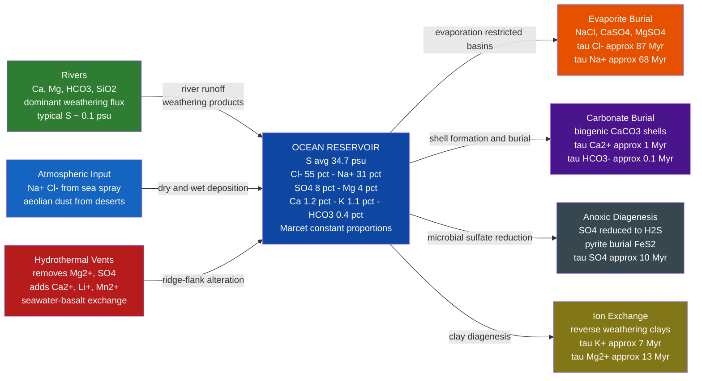

# Seawater Composition and Major Ions

> [!abstract] TL;DR
> Seawater contains seven dominant ions — Cl⁻, Na⁺, SO₄²⁻, Mg²⁺, Ca²⁺, K⁺, and HCO₃⁻ — that together account for more than 99.9 % of all dissolved salts, and their mutual ratios are nearly identical anywhere in the world ocean (Marcet's principle, 1819), meaning a single salinity measurement fully constrains all major-ion concentrations. Salinity itself is defined either as Practical Salinity (PSU, a dimensionless conductivity ratio) or as Absolute Salinity S_A (g/kg in the TEOS-10 framework), which can differ by up to 0.160 g/kg in nutrient-rich deep Pacific water. Each ion's **residence time** τ = inventory / removal rate spans five orders of magnitude — from ~110,000 years for bicarbonate to ~87 million years for chloride — and ions with τ far exceeding the ocean mixing time (~1000 yr) behave as **conservative tracers** whose concentration varies only by dilution or evaporation, not biology or chemistry. These principles underpin everything from Mohr chlorinity titrations and desalination engineering to paleosalinity reconstruction from coral archives and remote sensing of sea surface salinity by NASA's Aquarius satellite.

---

## Intuition

**Analogy:** The major ions in seawater are like the ingredients in a signature cocktail served by the same bar all over the world — whether you order it in the Caribbean, the Norwegian fjords, or the middle of the Pacific, the ratio of rum to lime to sugar is always the same; only the size of the glass (total salinity) varies. No matter where a water sample comes from, chloride is always ~55 % of the dissolved mass, sodium is always ~31 %, sulfate always ~8 %. The ocean has had billions of years to mix, and the ion removal processes are so slow (millions of years) that local river inputs or hydrothermal vent fluxes are homogenised long before they can distort the recipe.

This is Marcet's principle (1819), confirmed systematically by the *Challenger* expedition (1872–1876): **the relative proportions of the major dissolved salts are constant throughout the world ocean.** A chemist at sea needs only to measure electrical conductivity — and hence salinity — to reconstruct the full major-ion budget without analysing each ion separately. The underlying reason is residence time: chloride has a residence time of ~87 million years in the ocean. The ocean mixes in ~1000 years. So even the most remote river input representing a tiny fraction of global flux is diluted and mixed ~87,000 times before any significant net change in chloride's proportion could accumulate. Ions like nutrients (phosphate, nitrate) and dissolved oxygen have residence times comparable to ocean mixing times, which is precisely why their concentrations vary by orders of magnitude across the ocean — they are consumed by organisms faster than the ocean can homogenise them. That contrast between conservative and nonconservative tracers is the central organising principle of chemical oceanography.

---

## How It Works

### Major Ion Table

At Standard Seawater salinity S = 35.000 psu (the IAPSO reference; Millero 2013):

| Ion | g kg⁻¹ | % of dissolved salts | Residence time | Behaviour |
|-----|--------|----------------------|----------------|-----------|
| Cl⁻ | 19.354 | 55.05 % | ~87 Myr | Conservative |
| Na⁺ | 10.765 | 30.61 % | ~68 Myr | Conservative |
| SO₄²⁻ | 2.712 | 7.68 % | ~10 Myr | Semi-conservative |
| Mg²⁺ | 1.290 | 3.69 % | ~13 Myr | Semi-conservative |
| Ca²⁺ | 0.412 | 1.16 % | ~1 Myr | Semi-conservative |
| K⁺ | 0.399 | 1.10 % | ~7 Myr | Semi-conservative |
| HCO₃⁻ / CO₃²⁻ | 0.145 | 0.41 % | ~0.11 Myr | Transitional |
| All others (Br⁻, Sr²⁺, B(OH)₃, F⁻, …) | ~0.100 | 0.30 % | varies | — |

**Total major ions: ~35.077 g/kg ≈ S_P = 35.000** (small discrepancy from rounding and minor ions).

### Core Mechanics

**1. Marcet's principle and the chlorinity–salinity relationship.**
Because major-ion ratios are constant, the fractional mass of each ion at any salinity S is fixed:

$$[\text{Ion}_i] = f_i \times S \quad \text{(g/kg)}$$

where f_i is the ion's constant fraction (e.g., f(Cl⁻) = 0.5505, f(Na⁺) = 0.3061). The classical measurement was **chlorinity** Cl (g/kg), the mass of chloride + bromide + iodide per kilogram; the Knudsen (1901) conversion is:

$$S = 1.80655 \times \text{Cl} \quad \text{(Knudsen relation, valid to ~±0.001 psu)}$$

Modern practice replaces chlorinity with **conductivity-ratio** measurement (PSU), then upgrades to Absolute Salinity via TEOS-10 for thermodynamic calculations.

**2. Salinity definitions — PSU vs TEOS-10.**

| Quantity | Symbol | Definition | Unit | Notes |
|---------|--------|-----------|------|-------|
| Practical Salinity | S_P | Conductivity ratio vs KCl standard | dimensionless (psu) | EOS-80; good for most open-ocean work |
| Reference Salinity | S_R | (35.16504/35) × S_P ≈ 1.004715 × S_P | g/kg | TEOS-10 proxy, approximates Absolute Salinity |
| Absolute Salinity | S_A | True dissolved mass fraction (measured or from climatology) | g/kg | S_A = S_R + δS_A |
| Salinity anomaly | δS_A | Local deviation from Reference Salinity | g/kg | Up to +0.025 g/kg (Atlantic), +0.160 g/kg (deep Pacific) |

The anomaly δS_A arises because nutrients, silicate, and organic matter contribute mass to seawater but are not sensed by conductivity. TEOS-10 provides a global climatological lookup table (the SCOR/IAPSO atlas) to correct for this.

**3. Residence time.**
Residence time τ measures how long an ion "waits" in the ocean on average before being removed:

$$\tau_i = \frac{M_i}{\dot{J}_i^{\,\text{in}}} = \frac{M_i}{\dot{J}_i^{\,\text{out}}}$$

where M_i is the total ocean inventory of ion i (mol) and J_i is the global input or removal flux (mol yr⁻¹). At steady state, inputs equal outputs, so either definition gives the same τ. For chloride: ocean inventory ~ 2.6 × 10²⁰ mol; river + hydrothermal input ~ 3 × 10¹² mol yr⁻¹; τ = 2.6 × 10²⁰ / 3 × 10¹² ~ 87 × 10⁶ yr.

**4. Conservative vs nonconservative tracers.**

- **Conservative:** τ ≫ ocean mixing time (~1000 yr). Concentration varies linearly with dilution and evaporation. No internal sources or sinks. Examples: Cl⁻, Na⁺, Br⁻, F⁻. Also behave conservatively: SO₄²⁻, Mg²⁺, K⁺ on the timescales of ocean circulation (though altered by hydrothermal and diagenetic reactions over millions of years).
- **Nonconservative:** τ ~ ocean mixing time or shorter. Actively consumed by organisms, precipitated, or degassed. Examples: PO₄³⁻ (τ ~ 80,000 yr, but biological cycling time ~ 100 yr), NO₃⁻, SiO₂(aq), O₂, CO₂. Their ocean distributions carry a biological signal, not just a physical one — the foundation of nutrient oceanography.

### Flow / Architecture



---

## Key Concepts / Details

### Secondary Level

**Why is the ocean salty?**
Rain falls on rocks, dissolves minerals (Na⁺, Ca²⁺, Mg²⁺, K⁺, HCO₃⁻, SiO₂), and flows downhill to the sea. Rivers are extremely dilute (average salinity ~0.1 psu) because rocks dissolve slowly, but rivers have been running for ~4 billion years, delivering a constant trickle of ions. Once in the ocean, water evaporates back to the atmosphere as pure vapour, leaving the ions behind. Over geological time the ions concentrate. The same principle operates in a saucepan: boil pasta water long enough and the pan becomes coated with mineral residue.

**Why does river composition differ from seawater composition?**
Rivers are dominated by Ca²⁺ and HCO₃⁻ (released by carbonate and silicate rock weathering), while seawater is dominated by Cl⁻ and Na⁺. This is because Ca²⁺ and HCO₃⁻ are actively removed from the ocean (shells, limestone), while Cl⁻ and Na⁺ have no efficient biological sink — they just accumulate. A second source of Cl⁻ and Na⁺ is the degassing of volcanic gases (HCl from volcanoes) and hydrothermal vent circulation. The result is that seawater ion composition is **not** a simple concentrate of river water; it is shaped by which ions have efficient sinks.

**Salinity units for non-specialists.** Practical Salinity (PSU) is numerically very close to grams of salt per kilogram of seawater, so "35 psu" is a safe shorthand for "roughly 35 g of dissolved salts in every kilogram of seawater." About 3.5 % of every kilogram is salt — small enough that seawater and freshwater feel similar, but enough to make seawater about 2.5 % denser and to dramatically lower its freezing point.

---

### Undergraduate Level

**Marcet's principle (1819) — formal statement and limits.**
Alexander Marcet (1819) demonstrated that, while total salt content (salinity) varies from region to region, the ratios of the major dissolved constituents are remarkably uniform. The formal statement is:

> The mass fraction of each major ion relative to total dissolved solids is constant throughout the world ocean (Cl⁻ : Na⁺ : SO₄²⁻ : Mg²⁺ : Ca²⁺ : K⁺ ≈ 55 : 31 : 8 : 4 : 1.2 : 1.1).

This was confirmed quantitatively by William Dittmar's analysis of 77 water samples collected during the *Challenger* expedition (1872–1876), and it holds to better than 0.2 % for the major ions. The principle **does not apply** to: (a) trace metals (Fe, Mn, Cu, Zn — controlled by scavenging and biological uptake); (b) nutrients (PO₄³⁻, NO₃⁻, Si — biologically cycled); (c) dissolved gases (O₂, CO₂ — temperature and biology dependent); (d) near hydrothermal vents and river mouths where local sources dominate.

**Residence time calculation — example for calcium.**

| Quantity | Value |
|---------|-------|
| [Ca²⁺] average ocean | 0.412 g/kg = 10.3 mmol/kg |
| Ocean volume | 1.335 × 10²¹ L |
| Ocean density | ~1.027 kg/L |
| Ca²⁺ inventory | 10.3 × 10⁻³ mol/kg × 1.025 kg/L × 1.335 × 10²¹ L ≈ 1.41 × 10¹⁹ mol |
| River input flux | ~1.2 × 10¹³ mol Ca²⁺ yr⁻¹ |
| Residence time τ | 1.41 × 10¹⁹ / 1.2 × 10¹³ ≈ 1.2 × 10⁶ yr (1.2 Myr) |

At τ = 1.2 Myr ≫ ocean mixing time (~1000 yr), Ca²⁺ is still broadly conservative on the timescale of ocean circulation — but on geological timescales its flux balance (carbonate burial vs weathering) controls oceanic pH and the carbonate saturation state.

**Halide analysis — Mohr titration of chlorinity.**
The classical at-sea technique (still used in calibration work) titrates Cl⁻ with silver nitrate AgNO₃, with potassium chromate K₂CrO₄ as indicator (brick-red AgCl precipitates before the orange-red Ag₂CrO₄ endpoint). Knudsen tables (1901) then convert chlorinity Cl (g/kg) to salinity S via S = 1.80655 × Cl. The method is accurate to ±0.001 psu but is too slow for shipboard routine use; conductivity cells replaced it in the 1960s.

**PSU vs Absolute Salinity — why it matters.**
The PSU conductivity-ratio scale assumes seawater everywhere has the **same ionic composition** as IAPSO Standard Seawater (KCl-referenced at 15 °C, S = 35). But deep Pacific water has accumulated extra silicate and nutrient material — non-conducting solutes not sensed by conductivity. TEOS-10 quantifies this via:

$$S_A = S_R + \delta S_A, \quad S_R = \frac{35.16504}{35} \times S_P$$

The anomaly δS_A reaches +0.025 g/kg in the deep Atlantic and +0.160 g/kg in the deep North Pacific (where silicate exceeds 170 μmol/kg). This affects calculated densities at the ~0.0001 kg/m³ level — small but significant for tracking abyssal water masses that differ in density by only ~0.01 kg/m³.

---

### Graduate Level

**Isotopic tracers and long-term geochemical cycles.**

- **⁸⁷Sr/⁸⁶Sr** — Strontium is conservative in seawater (τ ~ 2 Myr). Its isotope ratio is set by the balance between continental weathering (high ⁸⁷Sr/⁸⁶Sr, ~0.712) and hydrothermal input (low, ~0.703). The deep-time ⁸⁷Sr/⁸⁶Sr record in marine carbonates (measured in foraminifera shells) is a proxy for weathering rates and ocean spreading rates over the Cenozoic — the **strontium isotope stratigraphy** curve is one of the most precise chronostratigraphic tools available, with precision ~0.5–1 Myr.

- **δ³⁴S of sulfate** — Sulfur isotopes in evaporite gypsum track the balance between oxidative weathering (delivers isotopically light pyrite sulfur) and pyrite burial (fractionates ~25‰). The δ³⁴S of marine sulfate rose from ~+10‰ in the Permian to ~+22‰ today (residence time ~10 Myr smooths the curve). This record constrains atmospheric O₂ history and is central to GEOCARB/COPSE biogeochemical models.

**Sulfate reduction and anoxic basin chemistry.**
In restricted basins with restricted circulation (Black Sea below ~200 m, Cariaco Basin, Framvaren Fjord), O₂ is consumed faster than it can be replenished and the water column becomes euxinic (anoxic and sulfidic). Anaerobic bacteria reduce sulfate to H₂S:

$$\text{SO}_4^{2-} + 2\text{CH}_2\text{O} \rightarrow \text{H}_2\text{S} + 2\text{HCO}_3^-$$

This removes SO₄²⁻ from solution (nonconservative behaviour in restricted basins), depletes Ca²⁺ through FeS and carbonate precipitation, and raises HCO₃⁻. The resulting **chemocline** chemistry violates Marcet's principle: Cl⁻/SO₄²⁻ and Mg²⁺/Ca²⁺ ratios are measurably perturbed even though salinity might be ~22 psu. Pore-water chemistry in marine sediments shows even larger deviations — SO₄²⁻ can be entirely absent below 10 m in organic-rich sediments.

**TEOS-10 — Gibbs thermodynamic formulation.**
TEOS-10 (IOC/SCOR/IAPSO, 2010) constructs seawater thermodynamics from a single Gibbs potential:

$$g(S_A, T, p) = g^0(T, p) + \sum_{k=1}^{7} g_k(S_A, T, p)$$

All thermodynamic properties are partial derivatives of g: entropy = −∂g/∂T, specific volume = ∂g/∂p, chemical potential of water = g − S_A(∂g/∂S_A). This guarantees mutual consistency of density, heat capacity, osmotic pressure, sound speed, and freezing point — a requirement for accurate ocean model energy and tracer budgets. The salinity-correction lookup uses a global regression of S_A − S_R against silicate, nitrate, and dissolved inorganic carbon anomalies from the WOCE/GO-SHIP hydrographic atlas.

**Remote sensing of sea surface salinity.**
NASA's Aquarius satellite (2011–2015) and ESA's SMOS satellite (2010–present) measure salinity from space by detecting L-band (1.4 GHz) microwave emission from the ocean surface; dielectric constant of seawater changes with salinity by ~0.5 % per psu. Sensitivity degrades poleward (cold water emission is less sensitive to salinity) and near coastlines (land contamination). Typical accuracy: ±0.2 psu at monthly, 150 km scales — sufficient to track large-scale salinity patterns such as the freshwater flux from Amazon River plume and the freshening of the Arctic surface from sea-ice melt, but insufficient to directly confirm Marcet-scale ratio constancy.

**Baltic Sea as a Marcet anomaly.**
The Baltic Sea has salinity ~8 psu (North Sea water diluted by >50 % with river input). At first glance, Marcet's principle predicts that ionic ratios should still hold even at S = 8. But the Baltic anomalies are subtler:
1. High riverine input of HCO₃⁻ and SiO₂ (fresh water) shifts the Cl⁻/HCO₃⁻ ratio below the open-ocean value.
2. Reduced SO₄²⁻ in the deep Gotland Basin from sulfate reduction elevates Cl⁻/SO₄²⁻ above the standard.
3. Organic-matter-rich inputs alter δS_A corrections significantly.
These deviations are used as tracers to distinguish Atlantic-origin water from Baltic-origin water in mixing studies.

---

## Python Demo

```python
import numpy as np
import matplotlib.pyplot as plt

# ---------------------------------------------------------------
# Seawater Major Ion Composition — Marcet's Principle and
# TEOS-10 Absolute Salinity Correction
# ---------------------------------------------------------------

# Reference concentrations at S_P = 35 psu (IAPSO Standard Seawater)
# Source: Millero, Chemical Oceanography, 4th ed. (2013), Table 1-1
ions     = ['Cl-', 'Na+', 'SO4(2-)', 'Mg(2+)', 'Ca(2+)', 'K+', 'HCO3-']
conc_35  = np.array([19.354, 10.765, 2.712, 1.290, 0.412, 0.399, 0.145])  # g/kg

# Marcet's principle: fractional composition is constant
fractions = conc_35 / 35.0   # dimensionless

# Compute concentrations at two representative salinities
S_values   = [35.0, 15.0]                         # psu
bar_labels = ['S = 35 psu\n(Open Ocean avg)',
              'S = 15 psu\n(Baltic-type water)']
colors     = ['#1565C0', '#E65100', '#2E7D32', '#6A1B9A',
              '#C62828', '#00695C', '#4E342E']

fig, (ax1, ax2) = plt.subplots(1, 2, figsize=(13, 6))

# ---- Part 1: Stacked bar chart ----
bottoms = np.zeros(len(S_values))
for ion, frac, col in zip(ions, fractions, colors):
    vals = frac * np.array(S_values)
    ax1.bar(bar_labels, vals, bottom=bottoms, color=col,
            label=ion, width=0.45, edgecolor='white', linewidth=0.5)
    # Annotate the two dominant ions on the S=35 bar
    if ion == 'Cl-':
        ax1.text(0, bottoms[0] + vals[0] / 2,
                 f'Cl-  55.0 %', ha='center', va='center',
                 color='white', fontsize=8, fontweight='bold')
    if ion == 'Na+':
        ax1.text(0, bottoms[0] + vals[0] / 2,
                 f'Na+  30.6 %', ha='center', va='center',
                 color='white', fontsize=8, fontweight='bold')
    bottoms += vals

ax1.set_ylabel('Concentration  (g kg$^{-1}$)', fontsize=11)
ax1.set_title("Major Ion Concentrations\nMarcet's Principle: ratios are constant", fontsize=10)
ax1.legend(fontsize=8, loc='upper right', framealpha=0.9)
ax1.grid(axis='y', alpha=0.3)
ax1.set_ylim(0, 38)

# Annotate ratio consistency
ax1.annotate('Same ion ratios,\ndifferent total height',
             xy=(0.5, 16), xycoords='data',
             xytext=(0.75, 25), textcoords='data',
             arrowprops=dict(arrowstyle='->', color='black', lw=1.2),
             fontsize=8, ha='center',
             bbox=dict(boxstyle='round,pad=0.3', facecolor='lightyellow', alpha=0.9))

# ---- Part 2: TEOS-10 Absolute Salinity correction ----
# delta_SA (g/kg) grows approximately linearly with silicate concentration
# Coefficient: deep Pacific  ~ 170 umol/kg -> delta_SA ~ 0.160 g/kg
# => slope ~ 0.160 / 170 = 0.000941 g/kg per (umol/kg)
# Source: Millero et al. (2008) & McDougall/Barker TEOS-10 manual (2011)
silicate  = np.linspace(0, 180, 300)   # umol/kg
delta_SA  = 0.000941 * silicate        # g/kg (simplified linear approximation)

ax2.plot(silicate, delta_SA, color='#c0392b', linewidth=2.5,
         label='delta_SA  (simplified from Millero et al. 2008)')
ax2.axhline(0.025, color='#2980b9', linestyle='--', linewidth=1.5,
            label='Atlantic deep max  ~0.025 g/kg  (~27 umol/kg Si)')
ax2.axhline(0.160, color='#27ae60', linestyle='--', linewidth=1.5,
            label='Pacific deep max  ~0.160 g/kg  (~170 umol/kg Si)')
ax2.axhline(0.000, color='gray', linestyle=':', linewidth=1.0,
            label='Surface open ocean  (SP approx SA)')

ax2.fill_between(silicate, 0, delta_SA,
                 where=(delta_SA <= 0.025),
                 alpha=0.12, color='#2980b9', label='Atlantic-like region')
ax2.fill_between(silicate, 0.025, delta_SA,
                 where=(delta_SA > 0.025),
                 alpha=0.12, color='#27ae60', label='Pacific deep region')

ax2.set_xlabel('Silicate  [Si(OH)$_4$]  (umol kg$^{-1}$)', fontsize=11)
ax2.set_ylabel('delta_SA = SA - SP  (g kg$^{-1}$)', fontsize=11)
ax2.set_title('TEOS-10: Absolute Salinity Correction\nSA deviates from SP in nutrient-rich water',
              fontsize=10)
ax2.legend(fontsize=7.5, loc='upper left', framealpha=0.9)
ax2.grid(alpha=0.3)
ax2.set_xlim(0, 180)
ax2.set_ylim(-0.01, 0.20)

plt.tight_layout()
plt.savefig('seawater_major_ions.png', dpi=150)
plt.show()

# Expected output:
#   Left panel: Two stacked bars of very different total height (35 vs 15 g/kg)
#   but identical colour-stripe proportions — visual proof of Marcet's principle.
#   Cl- (blue, bottom) and Na+ (orange) dominate both bars at the same fractions.
#
#   Right panel: Red line rising from 0 to 0.160 g/kg across 0-180 umol/kg silicate.
#   Blue shading (Atlantic): delta_SA up to 0.025 g/kg causes density error ~ 0.00002 kg/m^3.
#   Green shading (deep Pacific): delta_SA up to 0.160 g/kg causes density error ~ 0.00012 kg/m^3
#   — significant when tracking abyssal water masses differing by only 0.01 kg/m^3.
```

---

## Real-World Notes

- **Red Sea — highest open-ocean salinity.** The Red Sea reaches ~43 psu because it lies in a hyper-arid rift zone (evaporation >> precipitation + river input), has restricted exchange with the Gulf of Aden over the Bab el-Mandeb sill, and receives nearly zero river input. Its dense bottom water (T ~21 °C, S ~40 psu, ρ ~1028 kg/m³) spills into the Arabian Sea and is detectable as a salinity maximum at ~800 m depth — a classic conservative-tracer signature of Marcet's principle applied to an extreme end member.

- **Baltic Sea — lowest open-ocean salinity.** With a catchment area 4× larger than the sea's surface, and a shallow, sill-restricted connection to the North Sea at Skagerrak, the Baltic dilutes to ~8 psu. The major-ion ratios are measurably perturbed by SO₄²⁻ reduction in the deep Gotland Basin and by elevated HCO₃⁻ from rivers. The Baltic illustrates the limit of Marcet's principle: at S < ~10 psu with heavy river/diagenesis influence, individual ion measurements matter.

- **Challenger expedition (1872–1876) — empirical foundation.** William Dittmar, appointed chemist to the HMS *Challenger* expedition, performed complete wet-chemistry analyses of 77 seawater samples collected across all ocean basins at multiple depths. His 1884 report confirmed that while total dissolved salts varied from ~33 to ~38 g/kg, the ratios of the six major ions he could measure were constant to within analytical error. This single dataset underpins every salinity-to-ion conversion used in oceanography for the following century.

- **Desalination — reverse osmosis removes all ions.** Reverse osmosis (RO) forces seawater through semi-permeable membranes at pressures of ~5–7 MPa (~50–70 atm), retaining nearly all dissolved ions. Because Marcet's principle holds, a single design handles all ocean-source waters: feed-water ionic composition is predictable from salinity, so membrane fouling models, scaling potential (mainly CaCO₃ and CaSO₄), and energy requirement are deterministic functions of inlet salinity. The Sorek B desalination plant in Israel (capacity 2 × 10⁶ m³/day) operates on Mediterranean water at S ≈ 39 psu, and its brine concentration (S ≈ 70 psu) is precisely calculated using Marcet fractions.

- **Hydrothermal vents — local violation of Marcet's principle.** At mid-ocean ridge hydrothermal systems, seawater circulates through hot basalt and undergoes extensive chemical alteration: Mg²⁺ and SO₄²⁻ are nearly quantitatively removed (Mg²⁺ precipitates as serpentine and chlorite; SO₄²⁻ is reduced by reaction with ferrous iron), while Ca²⁺, Si, Fe, Mn, H₂S, and CH₄ are enriched. Black smoker vent fluids at 350–400 °C have near-zero Mg²⁺, essentially no SO₄²⁻, and Ca²⁺ several times the ambient seawater value. Globally, hydrothermal circulation is responsible for ~50 % of the Mg²⁺ removal from the ocean, contributing to Mg²⁺'s 13 Myr residence time.

---

## Common Pitfalls

- **Confusing PSU with g/kg.** Practical Salinity S_P is dimensionless (a conductivity ratio); it is numerically close to but not equal to grams of dissolved mass per kilogram of seawater. The true mass fraction is Absolute Salinity S_A. The difference S_A − S_P runs from 0 g/kg at the sea surface in the open North Atlantic to +0.160 g/kg in the deep North Pacific — small in everyday use, but it reaches ~0.025 % of the density signal and matters for precision hydrography and model energy conservation.

- **Assuming Marcet's principle applies to trace metals.** It does not. Iron (Fe) has a surface-ocean concentration of ~0.1 nmol/kg and a deep-ocean concentration of ~0.5 nmol/kg; both vary by 100-fold depending on distance from dust sources, hydrothermal inputs, and biological scavenging. Copper, zinc, and lead exhibit "nutrient-like" or "scavenged" profiles controlled entirely by biological and geochemical processes, not by dilution. Using salinity to infer trace-metal concentrations would be deeply wrong.

- **Treating all major ions as equally conservative.** Cl⁻ and Na⁺ are truly conservative at ocean circulation timescales (τ >> 10 Myr). Ca²⁺ (τ ~ 1 Myr) and HCO₃⁻ (τ ~ 0.1 Myr) have residence times approaching the ocean ventilation timescale; their concentrations carry subtle signals from CaCO₃ dissolution and biological carbonate production that violate strict Marcet proportionality in the deep ocean by ~0.5–2 %. For carbonate chemistry calculations, Ca²⁺ and total alkalinity must be measured independently.

- **Using Knudsen salinity (S = 1.80655 × Cl) in TEOS-10 calculations.** The Knudsen relation gives Practical Salinity to ~0.001 psu accuracy for open-ocean water. But for TEOS-10 Gibbs function calls, S_A in g/kg is required. Plugging S_P directly as if it were S_A (g/kg) introduces a ~0.5 % error in all thermodynamic outputs (density, heat capacity, chemical potential). Always convert: S_A = (35.16504/35) × S_P + δS_A.

- **Ignoring the factor of 1.80655.** A recurring student error is to compute chlorinity Cl (g/kg) and treat it directly as salinity, or vice versa. Chloride alone is 55 % of dissolved solids, not 100 %, so salinity ≈ 1.807 × [Cl⁻], not [Cl⁻]. In a sample where chloride is 10.9 g/kg, this yields S ≈ 19.7 psu, not 10.9 psu.

---

## Related Concepts

**Same vault (Oceanography — Chemical Oceanography section):**

- [[Seawater_Properties_and_Equation_of_State]] — the equation of state (TEOS-10) uses Absolute Salinity S_A derived from the major-ion framework developed here; density is the downstream product.
- [[The_Oceanic_Carbon_Cycle]] — the carbon cycle links directly to HCO₃⁻ / CO₃²⁻ chemistry; Marcet fractions for bicarbonate are the starting point for dissolved inorganic carbon calculations.
- [[Ocean_Acidification]] — the shift in CO₂ equilibrium alters HCO₃⁻ and CO₃²⁻ concentrations; Ca²⁺ residence time and carbonate saturation are central.
- [[Nutrient_Cycles_and_Trace_Elements]] — the contrast between conservative major ions and nonconservative nutrients (PO₄³⁻, NO₃⁻, Si) introduced here is the structural foundation of nutrient oceanography.
- [[Hydrothermal_Vents_and_Seafloor_Chemistry]] — hydrothermal systems are the most dramatic local violators of Marcet's principle; they consume Mg²⁺ and SO₄²⁻ and add Ca²⁺ at mid-ocean ridges.
- [[_MOC_Chemical_Oceanography]] — section map for all Chemical Oceanography notes in this vault.

**Cross-vault:**

- [[Acids_Bases_and_pH]] — seawater pH (~8.1) is set by the CO₂–HCO₃⁻–CO₃²⁻ equilibrium system; understanding Ka, Henderson–Hasselbalch, and buffer chemistry is prerequisite for ocean carbonate chemistry.
- [[Phase_Equilibria_and_Colligative_Properties]] — freezing-point depression of seawater (T_f ≈ −1.86 °C at S = 35 psu) is a colligative property arising from the major ions dissolved; sea-ice formation and brine rejection are direct applications.
- [[Chemical_Thermodynamics]] — the TEOS-10 Gibbs potential formulation of seawater thermodynamics is a direct application of thermodynamic potentials and the chemical potential of mixed electrolytes.
- [[_MOC_Chemistry_Master]] — entry point to the Chemistry vault; Physical Chemistry (Gibbs function, colligative properties) and Analytical Chemistry (titrations, conductometry) sections are most relevant.

---

## Review Questions

### Secondary Level

1. The Pacific Ocean and the Atlantic Ocean have different salinities (roughly 34.8 vs 36.5 psu on average). Given Marcet's principle, a marine chemist measures the chloride concentration in an Atlantic sample and finds 20.1 g/kg. Without any other measurement, estimate the sodium concentration and the total salinity of that sample. Show your reasoning.

2. Rivers deliver mostly calcium and bicarbonate to the sea, yet seawater is dominated by sodium and chloride. Explain the process — involving both sources and removal rates — that produces this divergence in composition.

3. You have a glass of freshwater and a glass of seawater at the same temperature. List three ways (without tasting them) you could determine which is which, and explain the physical or chemical principle behind each test.

### Undergraduate Level

1. The residence time of calcium is ~1 Myr and the residence time of chloride is ~87 Myr. Both are longer than the ocean mixing time of ~1000 yr. Explain why calcium is nonetheless described as "semi-conservative" rather than fully conservative, and in what part of the ocean would you expect the Ca²⁺/Cl⁻ ratio to deviate most strongly from the Marcet constant? By how much?

2. A water sample from the deep North Pacific has Practical Salinity S_P = 34.68 psu and silicate concentration [Si(OH)₄] = 165 μmol/kg. Using the approximate correction δS_A ≈ 0.000941 × [Si(OH)₄], calculate the Absolute Salinity S_A and the Reference Salinity S_R. What is the density error (kg/m³) introduced by using S_P in place of S_A, given β ≈ 7.8 × 10⁻⁴ kg/m³ per g/kg?

3. A student measures the chlorinity of a Baltic Sea sample using Mohr titration and obtains Cl = 4.42 g/kg. They compute S = 1.80655 × 4.42 = 7.99 psu. The conductivity meter on the same sample gives S_P = 8.06 psu. Suggest two reasons why the two methods give different results in the Baltic, when they agree to within 0.001 psu in open-ocean water.

### Graduate Level

1. The ⁸⁷Sr/⁸⁶Sr ratio of modern seawater is 0.70918 and is uniform worldwide. The river input has ⁸⁷Sr/⁸⁶Sr ~ 0.7119 and the mid-ocean ridge hydrothermal input has ⁸⁷Sr/⁸⁶Sr ~ 0.7035. Given that the ocean is in steady state with respect to Sr, set up the mass balance equations for both total Sr flux and the isotope flux, and derive the ratio of river flux to hydrothermal flux that satisfies both constraints simultaneously. How does this ratio compare with the independent estimate from riverine Sr concentration × global river discharge?

2. In a paleoceanographic reconstruction, you observe a 0.0003-unit decrease in ⁸⁷Sr/⁸⁶Sr of marine carbonates across the Paleocene–Eocene Thermal Maximum (~56 Ma ago). Given the residence time of Sr in the ocean (~2 Myr) and the isotopic shift per unit change in hydrothermal flux, interpret what this signal implies about mid-ocean ridge spreading rates or carbonate weathering rates during the PETM carbon injection event.

3. A restricted anoxic basin has Cl⁻ = 19.8 g/kg, Na⁺ = 10.9 g/kg, but SO₄²⁻ = 0.8 g/kg (versus the expected 2.7 g/kg from Marcet). The HCO₃⁻ concentration is 0.42 g/kg. Write the balanced reaction for sulfate reduction by organic carbon, and from the SO₄²⁻ deficit alone, calculate the expected excess HCO₃⁻ produced in units of g/kg. Compare with the observed HCO₃⁻ excess and comment on other processes that might account for the discrepancy.

---

## Sources

- Millero, F. J. (2013). *Chemical Oceanography* (4th ed.). CRC Press. — The definitive reference for seawater composition, major ion ratios, residence times, and TEOS-10 salinity formulations.
- Pilson, M. E. Q. (1998). *An Introduction to the Chemistry of the Sea*. Prentice Hall. — Accessible undergraduate treatment of ionic composition, residence times, and biogeochemical cycling of major elements.
- Marcet, A. (1819). On the specific gravity, and temperature of sea waters, in different parts of the ocean. *Philosophical Transactions of the Royal Society of London*, 109, 161–208. — The original statement of constant proportions.
- McDougall, T. J., & Barker, P. M. (2011). *Getting Started with TEOS-10 and the Gibbs Seawater (GSW) Oceanographic Toolbox*. SCOR/IAPSO WG127, ISBN 978-0-646-55621-5. — Authoritative technical reference for TEOS-10, Absolute Salinity corrections, and the Gibbs potential formulation.
- Dittmar, W. (1884). Report on researches into the composition of ocean-water, collected by HMS Challenger during the years 1873–76. *Challenger Reports*, Physics and Chemistry, vol. 1. — The empirical dataset that established Marcet's principle quantitatively across all ocean basins.

---

#Oceanography #ChemicalOceanography #SeawaterChemistry #MajorIons #Salinity
