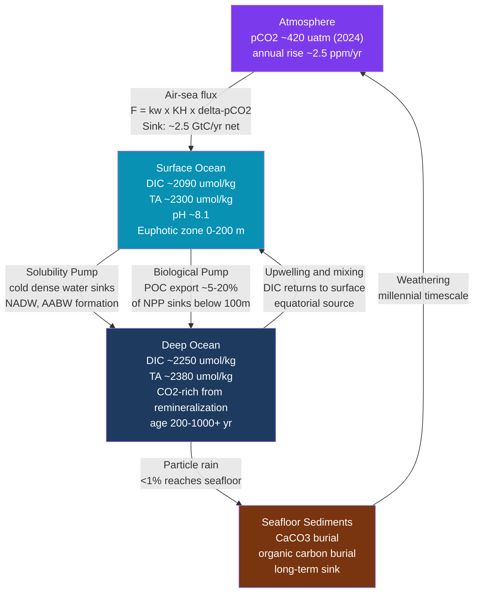

# The Oceanic Carbon Cycle

> [!abstract] TL;DR
> The ocean holds roughly **50 times more carbon than the atmosphere** (~38,000 GtC vs ~860 GtC), storing it primarily as dissolved inorganic carbon (DIC) in the form of bicarbonate (HCO₃⁻). Two coupled mechanisms shuttle carbon from the surface to the deep: the **solubility pump** (cold polar water absorbs CO₂ and sinks) and the **biological pump** (photosynthesis converts CO₂ to organic carbon that sinks as particles). The carbonate buffering system, described by the **Revelle factor** (~10), means the ocean can only absorb ~1/10th as much additional CO₂ as it would if it were chemically inert — and as anthropogenic CO₂ rises, this buffering capacity weakens, making the ocean a less effective sink over time. Air-sea CO₂ flux is driven by the gradient in partial pressure between sea and atmosphere (pCO₂_sea − pCO₂_atm), modulated by temperature, biology, and circulation.

---

## Intuition

**Analogy:** Imagine the ocean as a giant fizzy drink in reverse. When you open a cold soda bottle, CO₂ stays dissolved because cold liquid holds more gas. The polar ocean works the same way — cold surface water near Greenland and Antarctica eagerly absorbs atmospheric CO₂ like a freshly chilled bottle, then sinks to the deep carrying that dissolved carbon with it. But unlike a simple soda bottle, seawater has a carbonate buffer system — a chemical "shock absorber" made of bicarbonate and carbonate ions — that resists change. The **Revelle factor** quantifies this resistance: a 10% rise in atmospheric CO₂ raises dissolved CO₂ in the ocean by 10%, but raises total dissolved carbon (DIC) by only about 1%. The bottle is far less willing to take up the extra gas than a plain water bottle would be, and it becomes even more reluctant as it fills up.

Technically: seawater is a multicomponent carbonate buffer system. Added CO₂ reacts with carbonate (CO₃²⁻) to form two bicarbonate molecules (HCO₃⁻), so most new carbon is stored as HCO₃⁻ rather than free CO₂ — but this conversion consumes CO₃²⁻, progressively eroding the buffer and increasing the fraction of added CO₂ that stays as free CO₂ (i.e., pushing pCO₂ up faster for each unit of DIC added).

---

## How It Works

### Core Mechanics

**1. Dissolved Inorganic Carbon (DIC).**
DIC is the total concentration of all dissolved inorganic carbon species:

$$\text{DIC} = [\text{CO}_2(\text{aq})] + [\text{H}_2\text{CO}_3] + [\text{HCO}_3^-] + [\text{CO}_3^{2-}]$$

Because [H₂CO₃] is negligibly small (< 0.3% of [CO₂(aq)]), it is conventionally lumped with CO₂(aq) and written as [CO₂*]. In typical surface seawater (pH 8.1, T 20°C, S 35):

| Species | Approximate concentration | % of DIC |
|---------|--------------------------|----------|
| [CO₂*] | ~10 μmol/kg | ~0.5% |
| [HCO₃⁻] | ~1850 μmol/kg | ~88% |
| [CO₃²⁻] | ~220 μmol/kg | ~11% |
| **DIC total** | **~2090 μmol/kg** | **100%** |

**2. Carbonate equilibria.**
The system is governed by two successive acid dissociations and Henry's law:

$$\text{CO}_2(\text{g}) \xrightleftharpoons{K_H} \text{CO}_2(\text{aq}) \xrightleftharpoons{K_1} \text{H}^+ + \text{HCO}_3^- \xrightleftharpoons{K_2} 2\text{H}^+ + \text{CO}_3^{2-}$$

where:
- $K_H$ = Henry's law solubility constant (~3.4 × 10⁻² mol kg⁻¹ atm⁻¹ at 25°C, increases strongly with decreasing temperature)
- $K_1$ = 1st dissociation constant (~1.4 × 10⁻⁶ mol/kg at 25°C, S=35)
- $K_2$ = 2nd dissociation constant (~1.2 × 10⁻⁹ mol/kg at 25°C, S=35)

These four variables — DIC, TA, pH, pCO₂ — are linked such that measuring any two fully determines the other two.

**3. Total Alkalinity (TA).**
Alkalinity measures the ocean's capacity to neutralize acid — essentially the excess of proton-accepting species over proton-donating species:

$$\text{TA} \approx [\text{HCO}_3^-] + 2[\text{CO}_3^{2-}] + [\text{B(OH)}_4^-] + [\text{OH}^-] - [\text{H}^+] + \text{(minor terms)}$$

In a simplified carbonate-only system: **TA ≈ [HCO₃⁻] + 2[CO₃²⁻]**. TA is conservative with respect to temperature and pressure changes (unlike DIC), making it a robust tracer. Typical open-ocean surface value: ~2300 μmol/kg.

**4. Air-sea pCO₂ and Henry's law.**
The partial pressure of CO₂ in seawater:

$$p\text{CO}_2 = \frac{[\text{CO}_2^*]}{K_H}$$

The air-sea CO₂ flux (mol m⁻² yr⁻¹):

$$F = k_w \cdot K_H \cdot (p\text{CO}_{2,\text{sea}} - p\text{CO}_{2,\text{atm}})$$

where $k_w$ is the gas transfer velocity (~0.1 m/hr at low wind, ~1 m/hr at high wind, scaling with wind speed squared). The sign convention: **F > 0 means ocean emits CO₂ to atmosphere** (source); **F < 0 means ocean absorbs CO₂** (sink).

**5. The Solubility Pump.**
Cold polar waters can dissolve far more CO₂ than warm tropical waters ($K_H$ roughly doubles from 25°C to 2°C). At high latitudes, surface water cools, absorbs CO₂, and also becomes denser — then sinks via deep convection or shelf cascading (NADW, AABW formation). This physically transports DIC-rich water to the deep ocean, effectively isolating it from the atmosphere for centuries to millennia. Conversely, equatorial upwelling brings old DIC-rich deep water to the surface, where warming reduces solubility and CO₂ outgasses.

**6. The Biological Pump.**
In the sunlit euphotic zone, phytoplankton fix CO₂ via photosynthesis:

$$106\,\text{CO}_2 + 16\,\text{NO}_3^- + \text{HPO}_4^{2-} + 122\,\text{H}_2\text{O} + 18\text{H}^+ \rightarrow \text{C}_{106}\text{H}_{263}\text{O}_{110}\text{N}_{16}\text{P} + 138\,\text{O}_2$$

(Redfield ratio: C:N:P = 106:16:1). Most organic carbon is remineralized in the surface or mesopelagic zone, returning DIC to the water column. Only **~5–20%** of surface production sinks below ~100 m as particulate organic carbon (POC), and roughly **< 1%** reaches the seafloor. As particles sink, bacteria decompose them, adding DIC back at depth. This vertical gradient in DIC (low at surface due to uptake, high at depth due to remineralization) is a key feature of the ocean carbon distribution and is maintained against diffusion by the continuous rain of particles.

**7. The Revelle Factor.**
The Revelle (or buffer) factor quantifies how much of an atmospheric CO₂ perturbation the ocean can absorb:

$$R = \frac{\Delta p\text{CO}_2 / p\text{CO}_2}{\Delta\text{DIC} / \text{DIC}} \approx 10 \text{ (modern surface ocean)}$$

A Revelle factor of 10 means: for a 10% fractional increase in pCO₂, DIC increases by only 1%. If the ocean were a simple CO₂ dissolving solution (no carbonate buffer), R = 1 and it could absorb 10 times as much. The carbonate system constrains uptake because added CO₂ converts CO₃²⁻ to HCO₃⁻, depleting the buffer. Critically, **R increases as CO₂ rises** — as [CO₃²⁻] falls under acidification, the ocean becomes progressively less able to absorb additional CO₂. Modern high-latitude Southern Ocean R has already increased from ~9 to ~12.

### Flow / Architecture



---

## Key Concepts / Details

### Secondary Level

- **The ocean is the largest active carbon reservoir near Earth's surface.** It holds ~38,000 GtC as DIC — 50 times the atmospheric inventory (~860 GtC). Fossil-fuel combustion releases about 10 GtC/yr; the ocean absorbs roughly 25% (~2.5 GtC/yr), land biosphere ~30%, and the remaining ~45% accumulates in the atmosphere.
- **Why is seawater alkaline?** Seawater has a pH of about 8.1, slightly alkaline, because it contains large amounts of HCO₃⁻ and CO₃²⁻ derived from the weathering of carbonate and silicate rocks over millions of years. This alkalinity is what enables the ocean to absorb CO₂ without immediately acidifying.
- **Cold water is a carbon sponge.** Gas solubility increases as temperature decreases. Polar water near 0°C dissolves roughly twice as much CO₂ as tropical water near 28°C. This is why high-latitude oceans (North Atlantic, Southern Ocean) are net CO₂ sinks, while the tropics tend to be net sources.
- **Photosynthesis draws down surface CO₂ seasonally.** In spring and summer, phytoplankton blooms consume CO₂ and nutrients, lowering surface pCO₂ below atmospheric levels. The seasonal Keeling Curve oscillation (~7 ppm amplitude) partly reflects this ocean biology alongside terrestrial effects.
- **The ocean sink is already slowing.** As atmospheric CO₂ rises, the air-sea pCO₂ gradient increases — which should strengthen the sink — but rising sea-surface temperatures reduce solubility and the Revelle factor increases, partially counteracting the gradient effect.

### Undergraduate Level

- **DIC species distribution vs pH.** The speciation of DIC is entirely determined by pH at a given temperature and salinity. Below pH 6, [CO₂*] dominates. Between pH 6 and 10.3, [HCO₃⁻] dominates. Above pH 10.3, [CO₃²⁻] dominates. Ocean pH of 8.1 places seawater firmly in the bicarbonate-dominated regime, explaining why HCO₃⁻ is ~88% of DIC. Expressing this mathematically: $[\text{HCO}_3^-] = K_1[\text{CO}_2^*]/[\text{H}^+]$ and $[\text{CO}_3^{2-}] = K_1 K_2 [\text{CO}_2^*]/[\text{H}^+]^2$.
- **TA–DIC diagram.** Plotting TA vs DIC for seawater samples traces characteristic pathways: photosynthesis moves samples diagonally (DIC decreases, TA unchanged for organic-carbon production, but TA increases slightly if nitrate is taken up), CaCO₃ precipitation moves samples along a 2:1 slope (TA decreases 2 μmol per 1 μmol DIC removed), and CO₂ addition moves samples horizontally (DIC increases, TA unchanged). The combination of TA and DIC uniquely specifies pH and pCO₂.
- **Air-sea pCO₂ gradient drivers.** Surface ocean pCO₂ varies with: (a) **temperature** (~4% increase per °C of warming, following van't Hoff and $K_H$ temperature dependence); (b) **biological productivity** (photosynthesis draws down DIC and lowers pCO₂; net respiration raises it); (c) **upwelling/mixing** (brings high-DIC, high-pCO₂ deep water to the surface); (d) **freshwater** (dilutes DIC and TA proportionally, leaving pCO₂ roughly unchanged). The interplay of these drivers creates the highly heterogeneous global map of air-sea CO₂ flux (Takahashi et al. 2009 atlas).
- **Global ocean carbon budget.** Atmospheric CO₂ is rising at ~5 GtC/yr equivalent. Fossil fuels + cement contribute ~10 GtC/yr. Of this, the ocean absorbs ~2.5 GtC/yr and the land biosphere ~3 GtC/yr. The **SOCAT** (Surface Ocean CO₂ Atlas) database compiles >30 million surface-ocean pCO₂ measurements from research ships and volunteer observing vessels, enabling global air-sea flux estimation. Revelle & Suess (1957) first quantified ocean uptake, noting that the "Revelle factor" (~10) implies only ~10% of anthropogenic CO₂ could be absorbed by the surface ocean before carbonate buffering is saturated.
- **Biological pump efficiency.** The fraction of net primary production (NPP) that reaches 200 m ("export ratio" or e-ratio) varies from ~5% in stratified tropical gyres (nutrient-limited) to ~20% in productive coastal upwelling systems (diatom-rich, large fast-sinking cells). At depth, the **Martin curve** describes exponential decrease of POC flux with depth: $F(z) = F_{100}(z/100)^{-b}$, with $b \approx 0.86$ globally. Remineralization at depth enriches deep water in DIC and nutrients.

### Graduate Level

- **Revelle factor calculation.** Starting from the equilibrium constraints, one can show:

  $$R = \frac{\partial \ln p\text{CO}_2}{\partial \ln \text{DIC}} \bigg|_\text{TA} = \left(1 + \frac{K_1[\text{H}^+] + 4K_1 K_2}{[\text{H}^+]^2 + K_1[\text{H}^+] + K_1 K_2}\right) \cdot \frac{\text{DIC}}{[\text{CO}_2^*]}$$

  In practice $R \approx \text{DIC}/[\text{CO}_2^*] \cdot \gamma$ where $\gamma < 1$ accounts for the buffering. As [CO₃²⁻] decreases under acidification, [CO₂*] increases for the same DIC, driving R upward. CMIP6-era projections show the globally averaged ocean R increasing from ~10 to ~14 by 2100 under SSP5-8.5, meaning the ocean fraction of anthropogenic CO₂ uptake decreases unless gross uptake increases due to pCO₂ gradient.

- **DIC chemistry in an acidified ocean.** Ocean acidification (OA) involves: (1) [CO₂*] increasing (drives pCO₂ up); (2) [H⁺] increasing (pH declining); (3) [CO₃²⁻] decreasing (reduced saturation state Ω for CaCO₃ minerals). The carbonate saturation state is $\Omega_\text{arag} = [\text{Ca}^{2+}][\text{CO}_3^{2-}]/K_{sp}^*$. When $\Omega < 1$, aragonite dissolves. The Southern Ocean is projected to become undersaturated with respect to aragonite in winter by ~2030 under SSP2-4.5 — threatening pteropods, corals, and other calcifiers.

- **Isotopic tracers for ocean carbon uptake.** The ¹³C/¹²C ratio of atmospheric CO₂ (expressed as δ¹³C) is declining because fossil fuels are ¹³C-depleted (the "Suess effect"). Monitoring ocean DIC δ¹³C constrains the fraction of anthropogenic CO₂ absorbed. ¹⁴C (radiocarbon) provides a "clock" for the age of deep water — NADW is ~200 years old, Pacific deep water ~1,000 years — enabling estimation of ventilation rates and the turnover time of the ocean carbon inventory. Bomb radiocarbon (from atmospheric nuclear tests in the 1950s–60s) has penetrated to ~1,000 m depth, calibrating gas exchange parameterizations.

- **Air-sea flux estimation methods.** The bulk aerodynamic formula $F = k_w K_H \Delta p\text{CO}_2$ requires accurate $k_w$ parameterization. Nightingale et al. (2000) and Wanninkhof (2014) provide $k_w = a u_{10}^2$ fits from ³He/SF₆ dual-tracer experiments. Eddy covariance measurements directly measure CO₂ flux above the sea surface and are increasingly deployed on research vessels. The global integral (~2.5 GtC/yr) is uncertain by ~0.5 GtC/yr, dominated by sparse sampling in the Southern Ocean and data gaps in winter.

- **CMIP6 carbon cycle feedbacks.** Earth System Models in CMIP6 decompose the ocean carbon-climate feedback into two terms: (a) **concentration-driven feedback** (β_ocean, ocean uptake per unit CO₂ rise, dominated by carbonate chemistry); (b) **climate-driven feedback** (γ_ocean, ocean uptake response to warming, negative — warmer ocean takes up less CO₂). CMIP6 models project β_ocean decreasing (Revelle factor increase) and γ_ocean becoming more negative (SST rise reduces solubility, stratification reduces ventilation), resulting in a smaller ocean fraction of cumulative anthropogenic emissions by 2100.

- **Ocean Carbon Dioxide Removal (CDR) and iron fertilization.** Iron limits phytoplankton growth in the Southern Ocean, North Pacific, and equatorial Pacific ("High Nutrient Low Chlorophyll" regions). Iron fertilization experiments (IRONEX, SOIREE, LOHAFEX) showed 10–30× increases in chlorophyll, but export flux below 100 m increased only marginally (~0.005 GtC per tonne Fe added), partly because grazers and remineralization in the mesopelagic intercepted the bloom. The net carbon sequestration per unit iron added is far too small, and ecological side effects (O₂ depletion, N₂O production) raise concerns. Alkalinity enhancement (adding crushed silicate or calcite to the ocean to increase TA and drive more CO₂ absorption) is currently a more promising CDR pathway.

---

## Python Demo

```python
"""
Carbonate equilibrium solver for seawater.
Given DIC and TA, compute [CO2], [HCO3-], [CO32-], pH, and pCO2
using Mehrbach et al. (1973) constants refitted by Dickson & Millero (1987).
Then plot pCO2 vs DIC (TA fixed) to visualise buffer depletion (Revelle effect).
"""

import numpy as np
from scipy.optimize import brentq
import matplotlib.pyplot as plt

# --- Equilibrium constants at T=25°C, S=35 (seawater pH scale) ---
K1 = 1.391e-6    # mol/kg  -- 1st dissociation: CO2 + H2O <-> H+ + HCO3-
K2 = 1.189e-9    # mol/kg  -- 2nd dissociation: HCO3- <-> H+ + CO32-
KH = 3.391e-2    # mol/kg/atm -- Henry's law: CO2(g) <-> CO2(aq)


def solve_carbonate(DIC_umol, TA_umol):
    """
    Solve the seawater carbonate system given DIC and TA (μmol/kg).
    Uses simplified TA = [HCO3-] + 2[CO32-] (ignores borate, minor species).
    Returns dict with all key carbonate system variables.
    """
    DIC = DIC_umol * 1e-6   # mol/kg
    TA  = TA_umol  * 1e-6   # mol/kg

    def ta_residual(h):
        # CO2* = DIC / (1 + K1/h + K1*K2/h^2)
        co2  = DIC / (1.0 + K1/h + K1*K2/h**2)
        hco3 = K1 * co2 / h
        co3  = K2 * hco3 / h
        return (hco3 + 2.0*co3) - TA

    # Solve for [H+] (search pH 6 to 9)
    h = brentq(ta_residual, 1e-9, 1e-6, xtol=1e-15)

    co2  = DIC / (1.0 + K1/h + K1*K2/h**2)
    hco3 = K1 * co2 / h
    co3  = K2 * hco3 / h
    pH   = -np.log10(h)
    pCO2_uatm = (co2 / KH) * 1e6   # convert atm -> μatm

    return {
        'CO2_umol':   co2  * 1e6,
        'HCO3_umol':  hco3 * 1e6,
        'CO3_umol':   co3  * 1e6,
        'pH':         pH,
        'pCO2_uatm':  pCO2_uatm
    }


# --- Part 1: Solve for DIC=2100, TA=2300 μmol/kg ---
result = solve_carbonate(DIC_umol=2100, TA_umol=2300)
print("Carbonate equilibrium at DIC=2100, TA=2300 μmol/kg (T=25°C, S=35):")
print(f"  [CO2*]   = {result['CO2_umol']:.2f}  μmol/kg")
print(f"  [HCO3-]  = {result['HCO3_umol']:.1f} μmol/kg")
print(f"  [CO32-]  = {result['CO3_umol']:.1f}  μmol/kg")
print(f"  pH       = {result['pH']:.3f}")
print(f"  pCO2     = {result['pCO2_uatm']:.1f} μatm")

# Verify DIC and TA close
dic_check = result['CO2_umol'] + result['HCO3_umol'] + result['CO3_umol']
ta_check  = result['HCO3_umol'] + 2*result['CO3_umol']
print(f"\nVerification: DIC check = {dic_check:.1f} (should be 2100)")
print(f"Verification: TA  check = {ta_check:.1f}  (should be 2300)")


# --- Part 2: pCO2 vs DIC at fixed TA=2300 -- visualise buffer depletion ---
TA_fixed = 2300.0
DIC_range = np.linspace(1900, 2500, 300)   # μmol/kg

pCO2_values = [solve_carbonate(d, TA_fixed)['pCO2_uatm'] for d in DIC_range]

# Compute Revelle factor (finite difference approximation)
dDIC = DIC_range[1] - DIC_range[0]
diffs = np.gradient(pCO2_values, DIC_range)
pCO2_arr = np.array(pCO2_values)
revelle = (diffs / pCO2_arr) / (1.0 / DIC_range)   # (d ln pCO2) / (d ln DIC)

# --- Plot ---
fig, (ax1, ax2) = plt.subplots(1, 2, figsize=(12, 5))

# Left: pCO2 vs DIC
ax1.plot(DIC_range, pCO2_values, color='#dc2626', lw=2.5)
ax1.axvline(2100, ls='--', color='#6b7280', lw=1, label='DIC = 2100 μmol/kg')
ax1.axhline(420,  ls=':',  color='#2563eb', lw=1, label='Atm pCO2 ~420 μatm (2024)')
ax1.axhline(280,  ls=':',  color='#059669', lw=1, label='Pre-industrial ~280 μatm')
ax1.fill_between(DIC_range, pCO2_values, 420,
                 where=np.array(pCO2_values) < 420,
                 alpha=0.15, color='#059669', label='Ocean sink region (pCO2 < atm)')
ax1.set_xlabel('DIC (μmol/kg)', fontsize=12)
ax1.set_ylabel('pCO₂ (μatm)', fontsize=12)
ax1.set_title('pCO₂ vs DIC (TA = 2300 μmol/kg fixed)\nBuffer depletion at high DIC', fontsize=11)
ax1.legend(fontsize=9)
ax1.grid(True, alpha=0.3)

# Right: Revelle factor vs DIC
ax2.plot(DIC_range, revelle, color='#7c3aed', lw=2.5)
ax2.axvline(2100, ls='--', color='#6b7280', lw=1)
ax2.axhline(10, ls=':', color='gray', lw=1, label='R = 10 (typical modern value)')
ax2.set_xlabel('DIC (μmol/kg)', fontsize=12)
ax2.set_ylabel('Revelle Factor R', fontsize=12)
ax2.set_title('Revelle Factor vs DIC\nHigher DIC = weaker buffer = larger R', fontsize=11)
ax2.legend(fontsize=9)
ax2.grid(True, alpha=0.3)

plt.tight_layout()
plt.savefig('carbonate_buffer_demo.png', dpi=150)
plt.show()
print("\nPlot saved to carbonate_buffer_demo.png")
```

---

## Real-World Notes

**Southern Ocean — largest carbon sink.** The Southern Ocean (south of 35°S) absorbs approximately **0.8–1.0 GtC/yr**, roughly 30–40% of the global ocean sink, despite covering ~20% of ocean area. It is driven by cold, wind-exposed surface water with a strong pCO₂ undersaturation relative to the atmosphere. However, Southern Ocean uptake showed anomalous weakening in the 1990s–2000s (Le Quéré et al. 2007) due to intensifying westerly winds increasing upwelling of DIC-rich deep water — a climate-driven reduction in sink strength — before partially recovering post-2002 as biological uptake compensated.

**North Atlantic sink from the biological pump.** The North Atlantic spring bloom (March–May) is among the largest phytoplankton blooms on Earth, triggered by mixed-layer shoaling and nutrient supply from winter mixing. It draws surface pCO₂ well below atmospheric levels (~300 μatm in productive regions), creating a strong biological pump that complements the solubility pump. The combined effect makes the North Atlantic (~40–65°N) a sink of ~0.3 GtC/yr.

**Equatorial Pacific — a persistent source.** Along the equatorial Pacific belt (~5°S–5°N), strong trade winds drive Ekman divergence and upwelling of cold, DIC-rich deep water (pCO₂ up to 500–600 μatm). This consistently outgasses CO₂ to the atmosphere at ~0.3–0.5 GtC/yr, making it the largest single oceanic CO₂ source. During El Niño events, weakened upwelling suppresses this outgassing, briefly increasing the global ocean sink.

**SOCAT — global surface ocean CO₂ atlas.** The Surface Ocean CO₂ Atlas (SOCAT) is a community-maintained database of >33 million quality-controlled surface fCO₂ measurements from ~1957 to present. It underpins all global air-sea flux estimates and reveals long-term acidification trends. Companion database GLODAP contains interior ocean DIC and TA from repeat hydrographic surveys (WOCE, GO-SHIP), enabling 3D mapping of ocean carbon inventory changes.

**Keeling Curve and ocean biology.** The famous Mauna Loa record shows a ~7 ppm seasonal oscillation superimposed on the rising CO₂ trend. The Northern Hemisphere growing season (spring-summer photosynthesis on land and in the ocean) draws CO₂ down; autumn-winter respiration and reduced ocean uptake drives it back up. The Southern Hemisphere ocean biological cycle contributes a smaller, out-of-phase signal. The long-term trend (from 315 ppm in 1958 to ~425 ppm in 2024) documents the accumulation of anthropogenic CO₂.

**Revelle and Suess (1957).** In a landmark paper, Roger Revelle and Hans Suess calculated that the ocean could only absorb a fraction of industrial CO₂ emissions due to the carbonate buffer chemistry they quantified. They stated: "Human beings are now carrying out a large scale geophysical experiment of a kind that could not have happened in the past" — effectively predicting ocean acidification and limited buffering capacity 30 years before it became mainstream concern.

---

## Common Pitfalls

- **Confusing DIC with alkalinity** — DIC and TA are both measured in μmol/kg but represent fundamentally different things. DIC is the total dissolved inorganic carbon inventory; TA is the proton-acceptor capacity. You need **both** to fully constrain the carbonate system (pH and pCO₂). Measuring only DIC tells you nothing about pH or pCO₂ without also knowing TA (or pH, or pCO₂).

- **Thinking the ocean can absorb unlimited CO₂** — The Revelle factor (~10, rising) shows that the ocean's carbonate buffer has finite and decreasing capacity. A naive calculation based on ocean volume and Henry's law overestimates uptake by ~10x because it ignores the equilibrium chemistry. Furthermore, uptake is kinetically limited by surface-to-deep exchange on centennial timescales — even if the deep ocean could absorb much more CO₂, slow thermohaline ventilation means most of it will not be "seen" by atmospheric CO₂ on human timescales.

- **Ignoring temperature-driven outgassing** — As sea-surface temperatures rise under global warming, CO₂ solubility decreases (K_H decreases), causing thermally-driven outgassing that partially offsets the increased air-sea pCO₂ gradient driving uptake. A 1°C SST rise reduces CO₂ solubility by ~3%, meaning the warming climate tends to push CO₂ back out. This thermal feedback is already measurable in SST-corrected surface pCO₂ records.

- **Assuming pCO₂ changes linearly with DIC** — Because of the carbonate buffer chemistry, pCO₂ responds superlinearly to DIC changes at constant TA (as shown in the Python demo). At current conditions, a 1% increase in DIC causes about a 10% increase in pCO₂ (the Revelle factor). This non-linearity means that simple linear interpolation between DIC and pCO₂ gives wrong results, particularly when extrapolating to high-CO₂ scenarios.

- **Conflating biological pump "efficiency" with carbon storage** — Even if phytoplankton bloom and export rates increase, carbon is only genuinely sequestered if the exported POC reaches below the winter mixing depth. Organic carbon remineralized in the mesopelagic above the pycnocline is quickly ventilated back to the surface. Only POC remineralized below ~1,000 m is effectively isolated from the atmosphere on centennial timescales — and this fraction is often less than 1% of net primary production.

---

## Related Concepts

**Same vault (04_Chemical_Oceanography):**
- [[Seawater_Composition_and_Major_Ions]] — the major ion chemistry that sets alkalinity and the ionic background for carbonate equilibria
- [[Ocean_Acidification]] — the direct consequence of increasing oceanic CO₂: declining pH, [CO₃²⁻], and saturation state; the other side of the carbon cycle coin
- [[Nutrient_Cycles_and_Trace_Elements]] — the Redfield ratio links carbon uptake to nutrient cycling; iron limitation controls biological pump efficiency in HNLC regions
- [[The_Biological_Pump_and_Carbon_Export]] — detailed treatment of POC and DOC production, sinking, remineralization, and the Martin curve governing depth-dependent carbon flux
- [[Ocean_Atmosphere_Exchange_and_Air_Sea_Fluxes]] — gas transfer velocities, wind-speed parameterisations, and the full air-sea flux machinery that drives CO₂ exchange
- [[Future_Ocean_Climate_Projections]] — CMIP6 projections of ocean carbon uptake, Revelle factor evolution, and sink saturation under SSP scenarios
- [[_MOC_Chemical_Oceanography]] — section map for all Chemical Oceanography notes in this vault

**Cross-vault:**
- [[Acids_Bases_and_pH]] — the fundamental acid-base equilibrium theory underlying the carbonate system; Henderson-Hasselbalch and buffer chemistry directly analogous to ocean buffering
- [[Chemical_Thermodynamics]] — thermodynamic treatment of equilibrium constants, their temperature dependence (van't Hoff), and the thermodynamic basis for K_H and K1/K2 temperature sensitivity
- [[Chemical_Kinetics]] — gas exchange across the air-sea interface is a kinetically controlled process; the transfer velocity k_w depends on molecular diffusivity and turbulence
- [[Anthropogenic_Climate_Change]] — the ocean carbon sink sits at the heart of the global carbon budget; ocean uptake fraction, sink saturation, and acidification are central to IPCC AR6 assessments
- [[Climate_Sensitivity_and_Feedbacks]] — the carbon-concentration feedback (β) and carbon-climate feedback (γ) for the ocean are key terms in Earth System Model feedback analyses
- [[_MOC_Chemistry_Master]] — entry point for equilibrium chemistry, thermodynamics, and acid-base theory underlying the carbonate system
- [[_MOC_Meteorology_Master]] — entry point for atmospheric CO₂ trends, greenhouse forcing, and the atmospheric side of the carbon cycle

---

## Review Questions

### Secondary Level

1. The ocean absorbs roughly 25% of annual anthropogenic CO₂ emissions. If the ocean were simply a bucket of water obeying Henry's law without any carbonate chemistry, would it absorb more or less than 25%? Explain in terms of what the carbonate buffer system does to the dissolved CO₂.
2. Why do cold polar oceans (e.g., the Southern Ocean) tend to be net CO₂ sinks while warm equatorial regions (e.g., the equatorial Pacific) tend to be net CO₂ sources? Name the two physical factors responsible.
3. Seawater has a pH of about 8.1. Has the ocean always had this pH? What process is currently lowering it, and by how much since the pre-industrial era?

### Undergraduate Level

4. Given total DIC = 2100 μmol/kg and TA = 2300 μmol/kg, set up the system of equations (using K₁, K₂, and the simplified TA expression) needed to solve for [H⁺]. Which species dominates at the resulting pH, and why does [CO₂*] make up only ~0.5% of DIC despite being the species exchanged with the atmosphere?
5. The air-sea CO₂ flux is written as F = k_w · K_H · ΔpCO₂. Explain what each term represents physically, how k_w is measured in the field, and why rising sea-surface temperatures reduce K_H. If SSTs increase by 2°C globally, qualitatively predict the effect on the ocean carbon sink.
6. Distinguish the solubility pump from the biological pump. For each, identify: (a) the process that removes CO₂ from the surface, (b) the process that returns DIC to the deep, and (c) one observational line of evidence that the pump is operating.

### Graduate Level

7. Derive an approximate expression for the Revelle factor R in terms of DIC, [CO₂*], K₁, K₂, and [H⁺], starting from $R = \partial \ln p\text{CO}_2 / \partial \ln \text{DIC}|_\text{TA}$. Show that R increases as [CO₃²⁻] decreases, and explain the implications for the ocean's ability to absorb future anthropogenic CO₂ emissions.
8. SOCAT data shows the Southern Ocean weakened as a carbon sink in the 1990s but recovered by ~2010. Construct a mechanistic explanation involving: intensification of Southern Ocean westerly winds, increased upwelling of DIC-rich Circumpolar Deep Water, ENSO variability, and the interplay between the solubility pump and biological productivity response.
9. A proposal suggests iron fertilization of the Southern Ocean could offset 1 GtC/yr of fossil-fuel emissions. Evaluate this claim by estimating: (a) the molar ratio of carbon fixed per mole of iron in a typical diatom bloom; (b) the fraction of surface-fixed carbon that actually reaches >1,000 m depth; (c) the unintended biogeochemical side effects. What observational evidence from past iron fertilization experiments (SOIREE, LOHAFEX) constrains your estimate?

---

## Sources

- [Sarmiento, J.L. & Gruber, N. (2006) *Ocean Biogeochemical Dynamics*. Princeton University Press.](https://press.princeton.edu/books/paperback/9780691017075/ocean-biogeochemical-dynamics)
- [Zeebe, R.E. & Wolf-Gladrow, D. (2001) *CO₂ in Seawater: Equilibrium, Kinetics, Isotopes*. Elsevier Oceanography Series, 65.](https://www.sciencedirect.com/bookseries/elsevier-oceanography-series/vol/65)
- [Takahashi, T. et al. (2009) "Climatological mean and decadal change in surface ocean pCO₂, and net sea-air CO₂ flux over the global oceans." *Deep-Sea Research II*, 56, 554–577.](https://doi.org/10.1016/j.dsr2.2008.11.007)
- [Revelle, R. & Suess, H.E. (1957) "Carbon dioxide exchange between atmosphere and ocean and the question of an increase of atmospheric CO₂ during the past decades." *Tellus*, 9(1), 18–27.](https://doi.org/10.3402/tellusa.v9i1.9075)
- [Dickson, A.G. & Millero, F.J. (1987) "A comparison of the equilibrium constants for the dissociation of carbonic acid in seawater media." *Deep-Sea Research*, 34(10), 1733–1743.](https://doi.org/10.1016/0198-0149(87)90021-5)
- [Friedlingstein, P. et al. (2023) "Global Carbon Budget 2023." *Earth System Science Data*, 15, 5301–5369.](https://doi.org/10.5194/essd-15-5301-2023)
- [Wanninkhof, R. (2014) "Relationship between wind speed and gas exchange over the ocean revisited." *Limnology and Oceanography: Methods*, 12, 351–362.](https://doi.org/10.4319/lom.2014.12.351)

---

#Oceanography #ChemicalOceanography #CarbonCycle #DIC #CarbonateSystem
