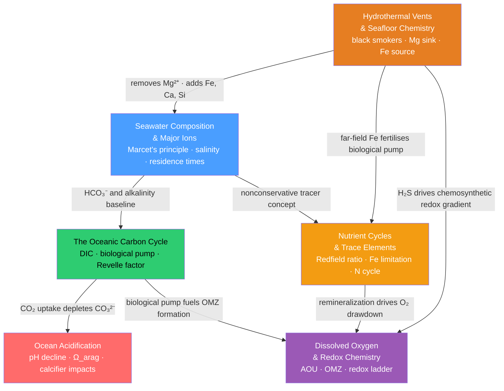

# Chemical Oceanography — Map of Content

> [!info] How to use this map
> Start with **Seawater Composition**, follow the arrows, and use the Learning Path below as your guide.
> Each node links to a full note. Come back to this map when you feel lost.

---

## Overview

Chemical oceanography studies the dissolved and particulate substances in seawater — their sources, sinks, transformations, and interactions with the atmosphere, seafloor, and ocean life. The field rests on a single organising principle: some constituents (the major ions) are **conservative**, varying only by dilution or evaporation over ocean-circulation timescales, while others (nutrients, carbon species, oxygen, trace metals) are **nonconservative**, actively cycled by biology, gas exchange, and geological inputs. From that foundation flow the ocean's role as Earth's largest active carbon reservoir, the threat of acidification as anthropogenic CO₂ is absorbed, the nutrient dynamics that govern productivity across an otherwise nutrient-desert ocean, the redox cascades that reshape chemistry wherever oxygen runs out, and the volcanic plumbing that continuously injects new chemical material from the seafloor upward into the water column.

---

## Concept Map

*(Blue = entry-point/fundamental, Red = advanced climate-impact topic; arrows show "builds on" or "supplies input to" relationships)*

---

## Learning Path

*Recommended order for a first pass through this section:*

1. [[Seawater_Composition_and_Major_Ions]] — Start here: Marcet's principle establishes the conservative/nonconservative distinction that organises everything else; understand why Cl⁻ is everywhere the same while PO₄³⁻ is not.
2. [[Nutrient_Cycles_and_Trace_Elements]] — Apply the nonconservative concept directly to the nutrients that run ocean biology; the Redfield ratio, iron limitation, and HNLC regions are the foundation of marine productivity.
3. [[The_Oceanic_Carbon_Cycle]] — Builds on alkalinity and HCO₃⁻ from note 1 and on the biological pump from note 2; learn how DIC, the solubility pump, and the Revelle factor make the ocean Earth's largest carbon reservoir.
4. [[Dissolved_Oxygen_and_Redox_Chemistry]] — Connects both the carbon cycle (remineralisation of sinking organic matter) and nutrient cycling (denitrification in OMZs); the redox ladder explains what happens when oxygen runs out.
5. [[Ocean_Acidification]] — The climate-driven consequence of the carbon cycle; now armed with carbonate chemistry from note 3, trace how a falling pH erodes aragonite saturation states and threatens calcifiers.
6. [[Hydrothermal_Vents_and_Seafloor_Chemistry]] — The external geological driver that closes the major-element budgets; ties back to composition (Mg sink, Fe source), nutrients (far-field iron), and redox (H₂S chemosynthesis).

---

## All Notes in This Section

| Note | Key Concept | Level Range |
|------|-------------|-------------|
| [[Seawater_Composition_and_Major_Ions]] | Marcet's principle: seven major ions in constant ratio; conservative vs nonconservative tracers; TEOS-10 salinity | Beginner → Advanced |
| [[The_Oceanic_Carbon_Cycle]] | Ocean holds 38,000 GtC as DIC; solubility pump + biological pump; Revelle factor limits CO₂ uptake | Intermediate → Advanced |
| [[Ocean_Acidification]] | Anthropogenic CO₂ has lowered surface pH from 8.20 to 8.08; aragonite undersaturation threatens polar calcifiers by 2050 | Intermediate → Advanced |
| [[Nutrient_Cycles_and_Trace_Elements]] | Redfield C:N:P = 106:16:1; iron limits productivity across 30–40% of ocean surface; N₂ fixation vs denitrification balance | Intermediate → Advanced |
| [[Dissolved_Oxygen_and_Redox_Chemistry]] | AOU traces cumulative respiration; OMZs form where consumption outpaces ventilation; redox ladder governs anoxic element cycling | Intermediate → Advanced |
| [[Hydrothermal_Vents_and_Seafloor_Chemistry]] | Mid-ocean ridge vents strip Mg²⁺ and add Fe, Ca, H₂S; black smokers precipitate metal sulfides; chemosynthesis builds ecosystems without sunlight | Intermediate → Advanced |

---

## Key Questions This Section Answers

- Why are the major-ion ratios in seawater virtually identical in every ocean basin, yet nutrient concentrations vary by orders of magnitude between the surface and the deep?
- How does the ocean absorb roughly 25% of annual anthropogenic CO₂ emissions, and why does the carbonate buffer system mean it cannot simply absorb all of it?
- Why are Arctic and Southern Ocean surface waters the first to become corrosive to aragonite shells, and what is happening chemically when Ω_arag drops below 1?
- What prevents phytoplankton from blooming in the Southern Ocean, the equatorial Pacific, and the subarctic North Pacific despite abundant nitrate and phosphate?
- What is the sequence of chemical reactions that unfolds when dissolved oxygen is exhausted in an oxygen minimum zone, and what global nutrient cycles does this trigger?
- How do mid-ocean ridge hydrothermal systems — operating at 2 to 3 km depth — alter the long-term chemical composition of the entire ocean?

---

## Connections to Other Topics

- [[_MOC_Oceanography_Master]] — parent vault entry point; chemical oceanography sits alongside physical, biological, and geological oceanography
- [[_MOC_Chemistry_Master]] — Physical Chemistry (Gibbs potential, equilibrium constants, Henry's law) and Analytical Chemistry (titrations, conductometry) underpin salinity measurement, carbonate equilibria, and redox calculations used throughout this section
- [[_MOC_Meteorology_Master]] — the atmospheric side of the CO₂ system; RCP/SSP emission scenarios and the global carbon budget drive the acidification and carbon-cycle projections covered here
- [[_MOC_Earth_Science_Master]] — plate tectonics and igneous petrology provide the geological context for mid-ocean ridge spreading, serpentinization, and the tectonic setting of hydrothermal vent systems

---

#MOC #Oceanography #ChemicalOceanography
