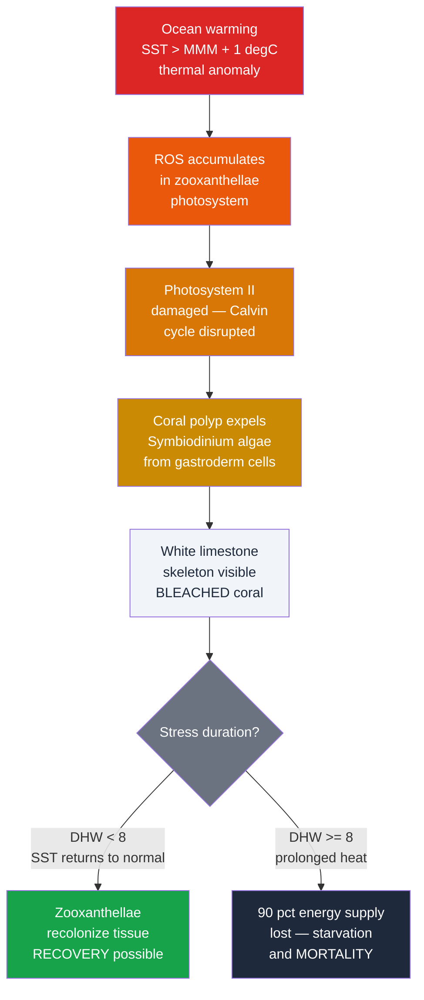

# Coral Reefs and Tropical Marine Ecosystems

> [!abstract] TL;DR
> Coral reefs are carbonate structures built by cnidarian polyps that host symbiotic photosynthetic algae (zooxanthellae, genus *Symbiodinium*) providing up to 90% of the polyp's energy via photosynthesis — making them the foundation of the most biodiverse marine ecosystem on Earth. Despite covering less than 0.1% of the ocean floor, reefs shelter an estimated 25% of all marine species. When sea surface temperature exceeds the local climatological maximum by just 1°C for several weeks, polyps expel their algae in a stress response called bleaching; sustained bleaching (Degree Heating Weeks ≥ 8) causes mass coral mortality. Ocean acidification compounds warming stress by reducing aragonite saturation (Ω_arag), slowing calcification and accelerating reef dissolution. IPCC scenarios project 70–90% reef decline at +1.5°C and near-total loss at +2°C above pre-industrial temperatures.

---

## Intuition

**Analogy:** A coral reef is a city built by millions of tiny architects. Each coral polyp secretes a limestone apartment — a cup-shaped calcium carbonate skeleton called a corallite. Inside the living tissue of each polyp lives a photosynthetic tenant: a single-celled alga called a zooxanthella that harvests sunlight and pays rent in the form of sugars, glycerol, and oxygen, supplying up to 90% of the polyp's energy needs. The skyscraper complex that results — a reef framework built over thousands of years — provides habitat for roughly 25% of all marine species despite covering less than 0.1% of the seafloor.

Now imagine a heatwave hits the city. When the ocean warms even 1°C above the summer maximum for more than a few weeks, something catastrophic happens inside each apartment: the algal tenants start producing toxic reactive oxygen species (ROS) that damage their own photosynthetic machinery. The polyp responds by evicting every tenant — the white limestone skeleton becomes visible through the now-transparent tissue, and the entire city goes bleached and white. Without the 90% energy subsidy from photosynthesis, the polyps are running on reserves. If temperatures drop in time, new tenants move back in and the city recovers. If the heat persists, the polyps starve and the city dies, leaving only the skeleton behind to be colonised by algae, eroded by bioerosion, and ultimately dissolved.

---

## How It Works

### Core Mechanics

**Zooxanthellae symbiosis.** Coral polyps (phylum Cnidaria, order Scleractinia) harbour endosymbiotic dinoflagellates of the genus *Symbiodinium* (broadly called zooxanthellae) within their gastrodermal cells at densities of ~10⁶ cells cm⁻² of coral tissue. Under normal light and temperature conditions, the algae photosynthesize using the coral's metabolic CO₂ and translocate photosynthates — primarily glycerol, glucose, and amino acids — to the host, fuelling 70–90% of the polyp's daily energy budget. The remaining nutrition comes from zooplankton captured by nematocyst-bearing tentacles at night. The symbiosis is what allows corals to build carbonate structures so rapidly in the nutrient-poor, sunlit tropical ocean.

**Calcification mechanism.** Coral polyps secrete aragonite (CaCO₃ polymorph) at the calicoblastic epithelium. The net calcification rate follows a kinetic relationship with the aragonite saturation state of seawater:

$$G = k \cdot (\Omega_\text{arag} - 1)^n$$

where:
- $G$ = calcification rate (mmol CaCO₃ m⁻² d⁻¹)
- $\Omega_\text{arag}$ = $[\text{Ca}^{2+}][\text{CO}_3^{2-}] / K_{sp}^{*}$ (aragonite saturation state)
- $k$, $n$ = empirical constants (typically $n \approx 1.5$–$2$, species-dependent)

Pre-industrial tropical $\Omega_\text{arag} \approx 3.5$; current values have declined to ~2.8 due to ocean acidification. Reef framework accretes at roughly 1–10 mm yr⁻¹ vertically in healthy systems; below $\Omega_\text{arag} \approx 1.5$, net dissolution begins to exceed accretion.

**Coral bleaching and Degree Heating Weeks (DHW).** NOAA's Coral Reef Watch uses the DHW metric to forecast bleaching:

1. Identify the **Maximum Monthly Mean (MMM)** — the highest of the 12 climatological monthly mean SSTs at a given location.
2. Compute a weekly **Hotspot** = SST − MMM. Only hotspots ≥ 1°C contribute to DHW.
3. **DHW** is the rolling 12-week sum of contributing hotspot values (units: °C-weeks):

$$\text{DHW} = \sum_{i=t-11}^{t} \max(\text{SST}_i - \text{MMM} - 1{°C},\ 0)$$

| DHW threshold | Ecological consequence |
|---|---|
| DHW ≥ 4 | Bleaching Watch: minor bleaching likely |
| DHW ≥ 8 | Bleaching Alert Level 2: severe bleaching and significant mortality likely |
| DHW ≥ 12 | Near-total colony mortality in most species |

**Why 1°C matters.** Corals acclimatise to their local thermal environment, but that acclimatisation leaves only a narrow safety margin. A bleaching temperature anomaly of just 1°C — held for 12 weeks — delivers DHW = 12, enough to kill most colonies. The mechanism is specific: at elevated temperatures, the D1 protein in Photosystem II of the zooxanthellae becomes the primary target of ROS oxidation. Electron transport is disrupted, superoxide and singlet oxygen leak out of the chloroplast, and the algae become more harmful than helpful to the polyp, triggering expulsion.

**Reef zonation.** Moving from shore toward the open ocean, a mature reef shows consistent ecological structure:

| Zone | Depth | Energy | Community |
|---|---|---|---|
| Back reef / lagoon | 0–10 m | Low wave energy | Patch reefs, seagrass, rubble |
| Reef flat | 0–3 m | Moderate energy | Encrusting corals, coralline algae |
| Reef crest | 0–2 m | Maximum wave energy | Robust branching corals (Acropora, Pocillopora) |
| Fore reef / upper slope | 3–25 m | Moderate–low | Peak coral diversity; brain, star, table corals |
| Drop-off / lower slope | 25–60 m | Low, dim light | Plating corals, gorgonians, sponges |

**The tropical triad.** Coral reefs do not exist in ecological isolation. The three interlocking shallow-water tropical ecosystems form a functional unit:

- **Coral reefs** — carbonate framework, structural habitat, larval source
- **Seagrass meadows** — behind and adjacent to reefs; sediment stabiliser, nursery habitat for juvenile reef fish, blue carbon sink (~25 tC ha⁻¹ yr⁻¹)
- **Mangrove forests** — intertidal fringe; nursery habitat, coastal protection, blue carbon storage (highest carbon density of any biome: ~1,000 tC ha⁻¹)

Connectivity flows in all directions: juvenile reef fish grow up in mangrove and seagrass nurseries; organic matter exported from reefs and seagrasses feeds mangrove detrital food webs; nutrient cycling between all three systems supports the paradox of reef productivity in oligotrophic water.

### Bleaching Mechanism — Flow



---

## Key Concepts / Details

### Secondary Level

- **Biodiversity paradox.** Coral reefs occupy less than 0.1% of the ocean floor yet harbour roughly 25% of all described marine species — more species per unit area than any other ocean habitat. The structural complexity of the three-dimensional carbonate framework creates thousands of microhabitats.
- **What bleaching looks like.** A bleached coral is not dead — it is a stressed, white-to-pale colony from which the brown-pigmented algae have been evicted. The transparent tissue reveals the white skeleton beneath. If you see a bleached coral, it may still be alive.
- **Great Barrier Reef scale.** The GBR is the world's largest coral reef system, stretching 2,300 km along the northeast Australian coast with a total area of ~348,000 km². It is the largest living structure visible from space. It consists of approximately 2,900 individual reefs and 900 islands.
- **The two threats acting together.** Ocean warming causes bleaching by the thermal stress pathway. Ocean acidification (rising dissolved CO₂ lowering seawater pH from 8.2 to ~8.1 since industrialisation) reduces the aragonite saturation state, slowing calcification and eventually making reefs dissolve faster than they build. Both threats are products of the same root cause: fossil CO₂ emissions.
- **Mangroves as blue carbon.** Mangrove forests store carbon in their biomass and sediments at rates of 25–100 tC ha⁻¹ yr⁻¹ — among the highest carbon sequestration rates of any ecosystem. Their destruction releases ancient, buried carbon, making mangrove loss a significant greenhouse gas source.

### Undergraduate Level

**DHW calculation in practice.** NOAA Coral Reef Watch (CRW) produces global DHW maps at 5 km resolution using satellite-derived SST (primarily from AVHRR and VIIRS sensors), updated daily. The MMM climatology is derived from the 1985–2013 Pathfinder v5.3 SST dataset. CRW products include: bleaching alert area maps, virtual stations, and probability forecasts for 4-month outlook periods.

**Carbonate chemistry of calcification.** Aragonite saturation:

$$\Omega_\text{arag} = \frac{[\text{Ca}^{2+}][\text{CO}_3^{2-}]}{K_{sp}^{*}(\text{aragonite})}$$

As atmospheric CO₂ rises, seawater dissolves more CO₂, producing more H₂CO₃ and ultimately H⁺, consuming CO₃²⁻ ions through the reaction:

$$\text{CO}_2 + \text{H}_2\text{O} + \text{CO}_3^{2-} \rightarrow 2\text{HCO}_3^-$$

Surface ocean $\Omega_\text{arag}$ has declined from ~3.5 (pre-industrial) to ~2.8 (2020s). Experiments show calcification rates decline roughly 10–15% per 0.1-unit decrease in $\Omega_\text{arag}$ across many coral species.

**Reef framework formation timescale.** Vertical accretion rates vary by reef type:
- Branching corals (*Acropora* spp.): up to 20 cm yr⁻¹ linear extension, but high fragility
- Massive corals (*Porites* spp.): 0.5–2 cm yr⁻¹ but extremely robust
- Net reef accretion (framework scale): ~0.1–1.0 cm yr⁻¹ after accounting for bioerosion (parrotfish, sea urchins, boring sponges)
- At sea-level rise rates of 3–4 mm yr⁻¹ (current), healthy reefs can keep pace; at IPCC high-emissions projections (8–15 mm yr⁻¹ by 2100), many reef systems will not.

**Crown-of-thorns starfish (COTS) outbreaks.** *Acanthaster planci* is a corallivorous seastar that feeds by everting its stomach over coral colonies and digesting the tissue. At low densities (<15 COTS per hectare) it is a natural part of reef ecology, preferentially consuming fast-growing *Acropora* and creating diversity-promoting disturbance. Outbreaks (>30 per hectare, reaching >1,000 on some reefs) are triggered by elevated nutrients from agricultural runoff and the resulting phytoplankton blooms that boost larval survival. The 2010–2014 COTS outbreak on the GBR killed approximately 12% of coral cover — on par with cyclone disturbance.

**Community succession.** Following a bleaching or storm disturbance, reef community succession typically proceeds: crustose coralline algae (CCA) crust → early colonisers (*Pocillopora*, fast-growing branching *Acropora*) → intermediate framework corals (*Montipora*, *Fungia*) → climax community (diverse massive and plating corals). Recovery to pre-disturbance live coral cover typically requires 10–15 years — increasingly unattainable as bleaching events now occur every 5–6 years on the GBR (versus once every 25–30 years before 1980).

### Graduate Level

**Genetic variation in thermal tolerance and adaptive potential.** Not all corals bleach at the same DHW threshold. *Symbiodinium thermophilum* (formerly clade D1a) confers significantly higher thermal tolerance (~1–1.5°C higher bleaching threshold) than the common clade C1. Corals hosting thermotolerant symbiont clades show lower bleaching rates but often trade this for reduced growth rates under normal conditions. Natural selection during bleaching events shifts symbiont community composition toward heat-tolerant clades — a process called "symbiont shuffling." Whether this adaptive capacity is fast enough to track the rate of ocean warming is a central research question.

**CRISPR-assisted "super coral" research.** The Coral Resilience Lab (Gates lab, University of Hawai'i) and KAUST's Reef Restoration program are developing assisted evolution approaches: selective breeding of thermotolerant colonies, CRISPR knockout of heat-sensitive genes in *Symbiodinium*, and direct coral genome editing to upregulate heat shock protein expression. Field trials in the Florida Keys have shown that out-planted thermotolerant coral fragments survive bleaching events at higher rates than wild corals. Regulatory, ecological (genetic erosion, novel gene flow), and scalability challenges remain substantial.

**Reef dissolution below Ω_arag ≈ 1.5.** At the whole-reef scale, net ecosystem calcification (NEC) — the balance between gross calcification and bioerosion plus dissolution — becomes negative when $\Omega_\text{arag}$ falls below ~1.5. Experimental reef mesocosm studies (Langdon et al. 2000, Andersson & Gledhill 2013) show that at $\Omega_\text{arag}$ = 1, the reef framework begins net dissolving on annual timescales. Under RCP 8.5 emissions, tropical surface $\Omega_\text{arag}$ is projected to reach ~1.5 by 2100, implying that marginal reefs (already impacted by warming and nutrients) could transition from net accretion to net dissolution by mid-century.

**Blue Carbon from seagrass and mangroves.** Seagrass meadows and mangrove forests are globally significant carbon sinks:

| Ecosystem | Area (Mha) | Carbon sequestration | Sediment carbon stock |
|---|---|---|---|
| Mangroves | ~138 | 25–100 tC ha⁻¹ yr⁻¹ | ~600–1,000 tC ha⁻¹ |
| Seagrass | ~177 | 2–10 tC ha⁻¹ yr⁻¹ | ~140 tC ha⁻¹ |
| Salt marshes | ~40 | 1.5–3 tC ha⁻¹ yr⁻¹ | ~250 tC ha⁻¹ |

Total global blue carbon ecosystem storage is estimated at ~10 Pg C. Destruction of mangroves (currently at ~1–2% yr⁻¹ globally) not only removes this sink but also releases stored carbon, contributing ~0.15–1.02 Pg CO₂ yr⁻¹ to the atmosphere.

**IPCC SR 1.5°C projections.** The 2018 IPCC Special Report on Global Warming of 1.5°C (Chapter 3) synthesised the following projections for tropical coral reefs:
- **+1.5°C** above pre-industrial: 70–90% decline in coral cover globally
- **+2.0°C** above pre-industrial: >99% of reef-building corals face annual bleaching; reef framework dissolution begins to dominate
- Even under aggressive mitigation (SSP1-1.9), +1.5°C is likely by the 2030s, meaning the window for effective conservation is measured in years, not decades.

The distinction between 1.5°C and 2°C is therefore not incremental for coral reefs — it is the difference between severely degraded reefs and functionally extinct reef ecosystems.

---

## Python Demo

```python
# Simulate a 20-year tropical SST time series and calculate cumulative Degree Heating Weeks (DHW).
# Identifies bleaching watch (DHW >= 4) and severe bleaching (DHW >= 8) events.
# The warming trend mimics projected climate change at a GBR-like reef site.
import numpy as np
import matplotlib.pyplot as plt

rng = np.random.default_rng(42)

# --- Simulation parameters ---
n_years = 20
weeks_per_year = 52
n_weeks = n_years * weeks_per_year
weeks = np.arange(n_weeks)
years = weeks / weeks_per_year

# Tropical reef SST: mean 26 degC, seasonal amplitude 2 degC, warming +0.025 degC/yr
sst_mean = 26.0
sst_amplitude = 2.0
warming_rate = 0.025   # degC per year
noise_std = 0.35

# Seasonal cycle peaks at week ~13 (southern-hemisphere summer: January)
phase_offset = np.pi / 2
sst = (sst_mean
       + sst_amplitude * np.sin(2 * np.pi * weeks / weeks_per_year - phase_offset)
       + warming_rate * years
       + rng.normal(0, noise_std, n_weeks))

# --- Establish MMM from the first 5-year baseline ---
baseline = sst[:5 * weeks_per_year]
weekly_climatology = np.array([
    np.mean(baseline[w::weeks_per_year]) for w in range(weeks_per_year)
])
MMM = np.max(weekly_climatology)           # Maximum Monthly Mean (°C)
bleach_threshold = MMM + 1.0               # 1 degC above MMM

print(f"Baseline MMM:          {MMM:.2f} degC")
print(f"Bleaching threshold:   {bleach_threshold:.2f} degC  (MMM + 1 degC)")

# --- DHW: rolling 12-week sum of weekly hotspots >= 1 degC above MMM ---
hotspot = np.maximum(sst - MMM - 1.0, 0.0)   # contribution per week
dhw = np.zeros(n_weeks)
for i in range(12, n_weeks):
    dhw[i] = np.sum(hotspot[i - 12 : i])

# --- Identify bleaching severity ---
watch = (dhw >= 4) & (dhw < 8)
alert = dhw >= 8

n_watch = np.sum(watch)
n_alert = np.sum(alert)
print(f"Weeks at Bleaching Watch (DHW 4-8):   {n_watch}")
print(f"Weeks at Bleaching Alert  (DHW >= 8): {n_alert}")

# --- Plot ---
fig, (ax1, ax2) = plt.subplots(2, 1, figsize=(14, 8), sharex=True)

# Top panel: SST time series with thresholds
ax1.plot(years, sst, color="#0ea5e9", lw=0.9, alpha=0.85, label="Weekly SST")
ax1.axhline(MMM, color="#6b7280", lw=1.2, ls=":", label=f"MMM = {MMM:.1f} degC")
ax1.axhline(bleach_threshold, color="#dc2626", lw=1.6, ls="--",
            label=f"Bleaching threshold = {bleach_threshold:.1f} degC (MMM + 1)")
ax1.set_ylabel("Sea Surface Temperature (degC)", fontsize=10)
ax1.set_title("Simulated Tropical Reef SST — 20-Year Record with +0.025 degC/yr Warming Trend",
              fontsize=11)
ax1.legend(loc="upper left", fontsize=9)
ax1.grid(alpha=0.2)

# Bottom panel: DHW accumulation with colour-coded severity
ax2.fill_between(years, dhw, 0, where=(dhw > 0) & (dhw < 4),
                 color="#93c5fd", alpha=0.5, label="DHW 0–4 (no alert)")
ax2.fill_between(years, dhw, 0, where=watch,
                 color="#fbbf24", alpha=0.75, label="DHW 4–8 (Bleaching Watch)")
ax2.fill_between(years, dhw, 0, where=alert,
                 color="#dc2626", alpha=0.75, label="DHW >= 8 (Severe bleaching / mortality)")
ax2.plot(years, dhw, color="#374151", lw=0.9, alpha=0.9)
ax2.axhline(4, color="#d97706", lw=1.3, ls="--", alpha=0.8)
ax2.axhline(8, color="#dc2626", lw=1.5, ls="--")
ax2.text(0.3, 4.3, "Watch (4)", color="#d97706", fontsize=8)
ax2.text(0.3, 8.3, "Severe (8)", color="#dc2626", fontsize=8)
ax2.set_xlabel("Year of simulation", fontsize=10)
ax2.set_ylabel("Degree Heating Weeks (degC-weeks)", fontsize=10)
ax2.set_title("Cumulative DHW — Bleaching Watch >= 4, Severe Bleaching >= 8", fontsize=11)
ax2.legend(loc="upper left", fontsize=9)
ax2.grid(alpha=0.2)

plt.tight_layout()
plt.savefig("coral_bleaching_dhw.png", dpi=120)
plt.show()
```

Expected output: In the first decade, SST rarely exceeds the bleaching threshold and DHW stays near zero. By year 10–14, warming pushes peak summer SST above the threshold annually, generating recurrent Watch events. By year 16–20, severe Alert events (DHW ≥ 8) appear with increasing frequency, reflecting the real-world compression of bleaching recurrence intervals driven by background warming.

---

## Real-World Notes

- **2016 GBR mass bleaching.** The 2015–2016 El Nino produced the highest sustained DHW values ever recorded on the Great Barrier Reef. Approximately 50% of all corals on the northern GBR bleached; aerial surveys found 67% of shallow-water corals in the northern third dead within 8–9 months of peak bleaching. This was the worst bleaching event in the GBR's recorded history.
- **2017 second mass bleaching.** Without completing recovery from 2016, the GBR experienced a second mass bleaching in 2017, this time extending further south into the central GBR. Hughes et al. (2018, *Nature*) showed that back-to-back bleaching with no recovery interval is a qualitatively new threat regime that has no analogue in the pre-1980 record.
- **Coral Triangle.** The Coral Triangle (CT) — spanning Indonesia, Philippines, Malaysia, Papua New Guinea, Solomon Islands, and Timor-Leste — is the global epicentre of marine biodiversity. It contains ~76% of all coral species, ~37% of all coral reef fish species, and 6 of the world's 7 sea turtle species. It sustains the food security of ~120 million people. It also faces among the highest rates of deforestation of mangroves and coral mining of any region.
- **Caribbean reef collapse.** Caribbean reef coral cover declined from ~50% in the 1970s to less than 10% by 2005 — a collapse driven primarily by the 1983–1984 *Diadema antillarum* (long-spined sea urchin) mass mortality (which removed a key grazer controlling algal overgrowth), overfishing, land-based pollution, and repeated bleaching events. The Caribbean is one of the most degraded reef regions on Earth and a cautionary preview of what unchecked stressors produce.
- **Coral gardening and restoration.** Programs such as the Coral Restoration Foundation (Florida Keys), the Australian Institute of Marine Science coral gardening initiatives on the GBR, and the Coral Triangle Initiative now maintain in-water nurseries of thousands of coral fragments ("fragging") on underwater tree-like structures. Out-planted fragments have survived bleaching events and reproduced in the wild, demonstrating proof-of-concept for active restoration. However, current restoration scales (tens of hectares) are many orders of magnitude smaller than the millions of hectares of degraded reef globally.
- **Palau marine reserve.** The Palau National Marine Sanctuary (2020) protects 80% of Palau's EEZ (500,000 km²) from extractive activities. Palau's reefs survived the 1998 global bleaching event better than most Indo-Pacific reefs and have shown resilience linked to low local stressors, strong community-based management, and naturally upwelling cooler water from deep channels. Palau is frequently cited as a case study for how integrated marine protected area management and reduced local stressors can build reef resilience even under global climate change.

---

## Common Pitfalls

- **Assuming bleached coral is dead.** Bleaching is a stress response — the expulsion of zooxanthellae — not immediate death. A bleached coral is alive (albeit starving) and can fully recover if water temperatures return to normal within several weeks. Recovery requires time without additional stressors. Calling a bleached reef "dead" in a report or media piece is factually wrong and can undermine conservation messaging by suggesting nothing can be saved.
- **Assuming all coral bleaching is caused by warming.** Thermal bleaching dominates in scale and frequency, but coral can also bleach from: (a) excess UV radiation on very shallow reefs during calm weather, (b) sudden freshwater dilution from extreme rainfall (osmotic shock), (c) cyanide fishing (still practiced illegally for the live reef-fish trade in Southeast Asia), (d) sublethal disease infection, and (e) anomalously cold temperatures ("cold bleaching," documented in Florida). Diagnosing bleaching cause matters for appropriate management response.
- **Ignoring that coral reefs are both CO₂ sources and sinks.** Photosynthesis by zooxanthellae and other reef algae sequesters CO₂ (a sink). But calcification — CaCO₃ deposition — releases CO₂ through the reaction: Ca²⁺ + 2HCO₃⁻ → CaCO₃ + CO₂ + H₂O. Healthy, building reefs are typically slight net CO₂ sources to the atmosphere. This is the opposite of the common intuition that "more reef = more carbon uptake," and has important implications for how reef loss is accounted in climate models.
- **Treating DHW as a deterministic mortality predictor.** DHW ≥ 8 is a probabilistic threshold for severe bleaching and significant mortality, not a guarantee. Actual outcomes depend on: local thermal history (recent heat stress hardening vs. naivety), water flow rates (high flow removes heat stress metabolites), depth (deeper corals experience lower peak SST), and genetic composition of the symbiont community. The same DHW value can produce radically different outcomes on reefs separated by kilometres. Local stressor reduction (water quality, fishing pressure) systematically improves outcomes at given DHW values.
- **Conflating reef area with reef health.** The GBR covers 348,000 km² — but live coral cover across its area averages roughly 20–30% (down from ~50% in the 1980s). "Area of reef" in news coverage often refers to reef framework area, not live coral. The difference matters enormously for accurately communicating the scale of reef degradation.

---

## Related Concepts

**Same vault:**
- [[Ocean_Acidification]] — the companion chemistry threat to thermal bleaching; declining Ω_arag from rising dissolved CO₂ reduces calcification rates and eventually drives net reef dissolution.
- [[Ocean_Optics_and_Light_Penetration]] — the euphotic depth and diffuse attenuation coefficient Kd directly constrain the maximum depth of zooxanthellae-dependent coral growth; turbidity from land runoff is a major local stressor.
- [[Marine_Primary_Production_and_Phytoplankton]] — reef systems are embedded in a broader marine productivity context; nutrient-driven phytoplankton blooms stimulate COTS outbreaks and degrade reef water quality.
- [[Seawater_Composition_and_Major_Ions]] — carbonate chemistry (CO₃²⁻, Ca²⁺, pH, total alkalinity) governs aragonite saturation state and hence calcification; understanding reef chemistry requires seawater ion composition.
- [[Ocean_Heat_Content_and_Marine_Heatwaves]] — marine heatwaves are the proximal drivers of mass bleaching events; the increasing frequency and intensity of heatwaves is the primary threat mechanism for reefs under climate change.
- [[_MOC_Biological_Oceanography]] — section map for biological oceanography in this vault.

**Cross-vault:**
- [[Acids_Bases_and_pH]] — ocean acidification is a direct acid-base chemistry problem; the carbonate system equilibria (CO₂ ↔ H₂CO₃ ↔ HCO₃⁻ ↔ CO₃²⁻) and pH buffering capacity of seawater underpin the entire ocean acidification threat to reefs.
- [[Anthropogenic_Climate_Change]] — rising CO₂ and associated ocean warming is the root cause of both mass bleaching and ocean acidification; IPCC projections for reef futures are embedded in global climate change scenarios.
- [[Climate_Sensitivity_and_Feedbacks]] — the difference between 1.5°C and 2°C of global warming has existential consequences for coral reefs; climate sensitivity determines which emissions pathway yields which reef outcome.
- [[_MOC_Chemistry_Master]] — carbonate chemistry, acid-base equilibria, and reaction kinetics that underpin reef calcification and dissolution all draw on foundational chemistry.
- [[_MOC_Meteorology_Master]] — marine heatwaves, ENSO-linked SST anomalies, and the atmospheric forcing that drives coral bleaching events are documented in the meteorology vault.

---

## Review Questions

### Secondary

1. A reef that was described as "thriving" in 2015 now appears bleached and white after an El Nino year. A newspaper headline says the reef is dead. Is this accurate? What would you need to know to determine whether the coral can recover?
2. Explain, using the city analogy, what happens inside a coral polyp during a bleaching event. What is the zooxanthella, what does it provide, and why does the coral expel it rather than keep it during a heat stress?
3. Coral reefs cover less than 0.1% of the ocean floor but support 25% of all marine species. What feature of coral reefs explains this disproportionate biodiversity? Why can't deep-sea areas support similar biodiversity through the same mechanism?

### Undergraduate

1. A reef site has an MMM of 28.5°C. In a particular 12-week summer period, weekly SST readings are: four weeks at 28.8°C, four weeks at 29.7°C, and four weeks at 30.2°C. Calculate the cumulative DHW. Is a bleaching watch, alert, or neither expected?
2. The aragonite saturation state at a reef drops from Ω_arag = 3.2 to Ω_arag = 1.8 due to ocean acidification. Using the calcification equation G = k(Ω_arag − 1)^n with n = 2, by what factor does calcification rate decline? What happens to the reef framework if erosion rate remains constant but calcification falls by this factor?
3. Crown-of-thorns starfish outbreaks devastate reefs in the Indo-Pacific. Explain the ecological mechanism linking agricultural nutrient runoff from land to a COTS population explosion. Which link in this chain is the most tractable management intervention, and why?

### Graduate

1. A coral reef study compares colonies hosting *Symbiodinium* clade C1 with colonies hosting clade D1a (thermotolerant). At DHW = 6, clade C1 colonies show 70% bleaching; clade D1a colonies show 15% bleaching. Discuss whether "symbiont shuffling" during bleaching events constitutes a meaningful adaptive response to sustained ocean warming at the rate of +0.025°C yr⁻¹. What are the physiological and evolutionary limits to this process?
2. The IPCC SR 1.5°C report concludes that 70–90% of reef-building corals will be lost at +1.5°C and >99% at +2°C. Critically evaluate these projections: what are the key assumptions about reef thermal tolerance that drive this result, what would change if a significant fraction of corals undergo genetic adaptation by 2100, and what emission pathway would be required to maintain at least 10% of current reef area?
3. A biogeochemist argues that protecting coral reefs is important for the global carbon cycle because "reefs absorb CO₂ via photosynthesis." A second scientist counters that "healthy reefs are actually slight net CO₂ sources." Resolve this apparent contradiction by explaining the competing carbon fluxes at a reef (photosynthesis/respiration vs. calcification/dissolution) and describe the conditions under which net reef carbonate chemistry makes a reef a source vs. a sink of atmospheric CO₂.

---

## Sources

- Hughes, T. P., et al. (2017). "Global warming and recurrent mass bleaching of corals." *Nature*, 543, 373–377. — Documented the 2016 GBR mass bleaching event and its unprecedented extent.
- Hughes, T. P., et al. (2018). "Spatial and temporal patterns of mass bleaching of corals in the Anthropocene." *Science*, 359(6371), 80–83. — Back-to-back 2016–2017 bleaching on the GBR; no-recovery interval as a new threat regime.
- Hoegh-Guldberg, O., et al. (2007). "Coral reefs under rapid climate change and ocean acidification." *Science*, 318(5857), 1737–1742. — Synthesised bleaching and OA threats; introduced the 1.5°C / 2°C divergence for reefs.
- Veron, J. E. N. (2000). *Corals of the World* (3 vols.). Australian Institute of Marine Science — the comprehensive taxonomic reference for scleractinian corals globally.
- IPCC (2018). *Special Report on Global Warming of 1.5°C*, Chapter 3: Impacts of 1.5°C of Global Warming on Natural and Human Systems. — Primary source for the 70–90% / 99% reef decline projections.
- [NOAA Coral Reef Watch](https://coralreefwatch.noaa.gov/) — DHW maps, bleaching alert products, and virtual stations updated daily from satellite SST.
- Langdon, C., et al. (2000). "Effect of calcium carbonate saturation state on the calcification rate of an experimental coral reef." *Global Biogeochemical Cycles*, 14(2), 639–654. — Foundational mesocosm study of calcification vs. Ω_arag.

---

#Oceanography #BiologicalOceanography #CoralReefs #CoralBleaching #TropicalOcean
