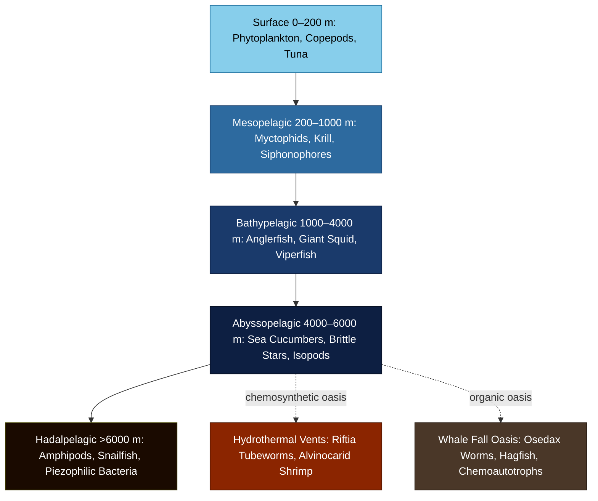

# Deep Sea Ecology

> [!abstract] TL;DR
> The deep sea — everything below 200 m — is the largest habitat on Earth by volume, covering roughly 65% of the planet's surface and comprising over 95% of the ocean's habitable space, yet it remains the least explored biosphere on Earth. It is defined by permanent darkness, near-freezing temperatures (1–4°C), crushing hydrostatic pressure (up to ~1100 atm in the Mariana Trench), and an energy supply that arrives from above as slowly sinking "marine snow." Most communities are powered by the biological pump — a sinking POC flux that diminishes by over 99% between 100 m and 4000 m following the Martin power-law curve — while hydrothermal vents and cold seeps support chemosynthetic communities entirely independent of sunlight. Pressure adaptations (TMAO accumulation, piezophilic enzymes, wax-ester buoyancy), extreme bioluminescence, and highly energy-efficient metabolisms define the biological toolkit of deep-sea fauna. The deep sea now faces anthropogenic threats ranging from plastic contamination detected even in the Mariana Trench to deep-sea mining licenses covering millions of square kilometers of the Clarion-Clipperton Zone.

---

## Intuition

**Analogy:** The deep sea is like life on an alien planet — pitch dark, under crushing pressure (600 atm at 6000 m, ~1100 atm at the Mariana Trench), near-freezing, with food raining down from above as "marine snow." A human placed there without protection would be instantly crushed; yet organisms adapted over millions of years to these conditions look like science fiction: fish with transparent heads and tubular eyes, shrimp that are essentially blind yet gather around volcanic chimneys spewing 400°C fluid, and worms the length of a person with no mouth or gut — living entirely on bacteria packed inside their tissues.

The key insight is that this "alien planet" is not remote — it lies beneath every ocean on Earth, and it is the single largest coherent biome by volume. Two energy strategies divide its communities. Most depend on the **biological pump**: dead organisms, feces, and aggregated particles (marine snow) sink from sunlit surface waters, carrying fixed carbon downward. This flux decays steeply with depth, obeying the Martin power-law curve, so abyssal communities are profoundly food-limited — one hectare of abyssal seafloor receives about as much organic carbon per year as a tree sheds in leaves from a single branch. The minority strategy — **chemosynthesis** at hydrothermal vents and cold seeps — taps H₂S and CH₄ venting from the seafloor, producing biomass densities that rival coral reefs, with no photons required at any step.

---

## How It Works

### Depth Zones

The open ocean is divided into five pelagic zones defined by depth, each with distinct physical conditions and biological communities:

| Zone | Depth Range | Pressure | Temperature | Light | Signature Fauna |
|------|-------------|----------|-------------|-------|-----------------|
| Epipelagic | 0–200 m | 1–20 atm | 2–30°C | Sunlit (euphotic) | Phytoplankton, copepods, tuna, dolphins |
| Mesopelagic | 200–1000 m | 20–100 atm | 4–20°C | Twilight (~0.1% surface PAR) | Myctophid fish, krill, siphonophores, pteropods |
| Bathypelagic | 1000–4000 m | 100–400 atm | 1.5–4°C | None | Anglerfish, giant squid, viperfish, Cyclothone |
| Abyssopelagic | 4000–6000 m | 400–600 atm | 1–2°C | None | Holothurians (sea cucumbers), brittle stars, isopods |
| Hadalpelagic | >6000 m | >600 atm | 1–4°C | None | Amphipods (Hirondellea gigas), snailfish (Liparidae), piezophilic bacteria |

### Hydrostatic Pressure

The fundamental governing equation for pressure at depth:

$$P = \rho g h$$

where $\rho \approx 1025\ \text{kg m}^{-3}$ (seawater), $g = 9.81\ \text{m s}^{-2}$, and $h$ = depth (m). Converting to atmospheres (1 atm = 101,325 Pa):

$$P(\text{atm}) = \frac{1025 \times 9.81 \times h}{101{,}325} \approx \frac{h}{10.06}$$

Key benchmarks:
- 200 m (mesopelagic): ~20 atm
- 1000 m (bathypelagic): ~100 atm
- 6000 m (hadal boundary): ~597 atm
- 10,935 m (Challenger Deep): ~1086 atm

Every ~10 m of depth adds approximately 1 atm — so the deepest point on Earth endures pressure equivalent to roughly 50 jumbo jets stacked on a dinner plate.

### Pressure Adaptations

**Piezophilic bacteria** thrive optimally at elevated pressures; their cell membranes maintain fluidity through increased unsaturated and branched-chain fatty acid content. Genera including *Moritella*, *Psychromonas*, and *Shewanella benthica* grow optimally at 400–800 atm and are inhibited at surface pressure.

**TMAO (trimethylamine N-oxide)** is the primary piezolyte in deep-sea fish. TMAO is a small organic osmolyte that stabilizes enzyme conformation against pressure denaturation by counteracting the pressure-induced shift in enzyme–substrate binding affinity (Km). Crucially, TMAO concentration scales linearly with habitat depth across fish taxa:

$$[\text{TMAO}] \approx 35 \times d_{\text{km}} \quad (\text{mmol kg}^{-1}\ \text{tissue})$$

This relationship is conserved across ~200 fish species measured to date, making TMAO concentration a reliable proxy for a fish's depth range.

**Neutral buoyancy** in the water column is achieved differently at depth. Bathypelagic fish (e.g., *Cyclothone*) often lack a gas-filled swim bladder — which would require active gas secretion against crushing pressure and would collapse below a few hundred meters — instead maintaining neutral buoyancy via incompressible wax esters and lipid-rich tissues. Cephalopods (squid, nautiluses) use fluid-filled buoyancy chambers; deep-water forms fill chambers with low-density ammonium chloride solution.

**Enzyme-level cold-pressure co-adaptation**: deep-sea LDH (lactate dehydrogenase) maintains its catalytic rate constant ($k_{cat}$) under both low temperature and high pressure — adaptations that trade off against thermostability, yielding enzymes that work well at 2°C and 300 atm but denature if warmed above ~20°C.

### Food Supply: The Martin Curve

Surface productivity generates dead organisms, fecal pellets, and aggregated particles ("marine snow") that sink through the water column as **particulate organic carbon (POC)**. The rate at which this flux decreases with depth is described by the **Martin curve** (Martin et al., 1987):

$$F(z) = F_{100} \cdot \left(\frac{z}{100}\right)^{-0.858}$$

where $F_{100}$ is the POC flux at 100 m (mg C m⁻² d⁻¹) and $z$ is depth in meters. The exponent $b = 0.858$ was derived from sediment trap measurements across the Pacific.

Consequently:
- At 1000 m: ~14% of the 100-m flux survives
- At 4000 m: ~3.5% survives
- At 6000 m: ~2% survives

Abyssal sediment community oxygen consumption rates of ~0.5–2 mg C m⁻² d⁻¹ reflect this energy scarcity. A 40-tonne blue whale carcass delivers the equivalent of roughly 160 years of background POC flux to the hectare of seafloor it falls on.

### Chemosynthetic Ecosystems

**Hydrothermal vents** form where seawater percolates into cracks at mid-ocean spreading ridges, becomes superheated (up to 407°C) by magma, leaches metals and reduced compounds, then vents back through "black smoker" chimneys. Chemoautotrophic bacteria oxidize the venting compounds:

- Sulfur oxidation: $\text{H}_2\text{S} + \frac{1}{2}\text{O}_2 \rightarrow \text{S}^0 + \text{H}_2\text{O}$ (then $\text{S}^0$ further oxidized); net: $\text{H}_2\text{S} + \text{CO}_2 + \text{O}_2 \rightarrow \text{[CH}_2\text{O]} + \text{H}_2\text{SO}_4$
- Methane oxidation: $\text{CH}_4 + 2\text{O}_2 \rightarrow \text{CO}_2 + 2\text{H}_2\text{O}$

Biomass densities at vents exceed 10 kg m⁻² — comparable to tropical coral reefs — and support *Riftia pachyptila* tube worms (up to 2 m), *Calyptogena* clams, alvinocarid shrimp, yeti crabs (*Kiwa*), and vent-endemic octopuses. Vents typically last decades before the underlying magma cools; larvae must disperse along ridge systems to colonize new vents.

**Cold seeps** occur where fluids rich in CH₄ and H₂S seep slowly from sediment, often along subduction zones or continental margins. They are powered by the anaerobic oxidation of methane (AOM) coupled to sulfate reduction and support communities similar to vents but at lower temperatures and much slower fluid fluxes. Cold seep communities can persist for centuries.

### Whale Falls as Organic Oases

When a large whale dies and sinks, its carcass becomes a concentrated organic-rich habitat that passes through three successional stages (Smith & Baco, 2003):

1. **Mobile scavenger stage** (weeks–months): hagfish (*Myxine*), sleeper sharks, rattail fish (*Macrurus*), and mobile invertebrates consume soft tissue at ~40–60 kg day⁻¹. A 40-tonne blue whale provides roughly 160 years worth of background flux carbon for the surrounding seafloor.

2. **Enrichment-opportunist stage** (months–2 years after soft tissue removal): dense mats of sulfur-oxidizing bacteria, polychaete worms (including *Osedax* bone-boring worms), crustaceans, and gastropods colonize bones and enriched sediments. *Osedax* worms have no mouth or gut — their roots penetrate the bone and they are nutritionally supported by endosymbiotic heterotrophic bacteria.

3. **Sulfophilic / chemosynthetic stage** (years–decades to >100 years): anaerobic bacteria decompose lipids inside bones, generating H₂S; this sustains chemosynthetic microbial mats (*Beggiatoa*-type) and a community of sulfide-dependent invertebrates that overlap significantly with vent/seep fauna. Lipid-rich whale bones (up to 60% lipid in large cetaceans) extend this stage to 50–100+ years.

Whale falls serve as "stepping-stone" habitats for vent/seep fauna dispersal; roughly 10 of the 407 species known from whale falls also occur at hydrothermal vents.

### Hadal Trenches

Ocean trenches deeper than 6000 m occupy <1% of seafloor area but harbor highly endemic and specialized communities. Key statistics:

- **Mariana Trench** (Challenger Deep): 10,935 m depth, ~1086 atm; deepest confirmed fish: *Pseudoliparis swirei* (snailfish) at 8,178 m
- **Kermadec Trench**: 10,177 m; **Tonga Trench**: 10,882 m; **Philippine Trench**: 10,540 m

Trench floors act as **sediment traps** — POC flux funnels laterally into the V-shaped trench geometry, making hadal sediments 2–4× more food-rich than surrounding abyssal plains at equivalent depths. Amphipod crustaceans (*Hirondellea gigas*, *Lyssianassia* spp.) dominate hadal macrofauna, reaching extraordinary sizes (up to 34 cm) — a phenomenon called **hadal gigantism**, attributed to both abundant food and reduced predation pressure. Obligate piezophilic bacteria isolated from hadal sediments grow optimally at 700–800 atm and fail to grow at surface pressure.

### Abyssal Biodiversity

Contrary to early assumptions that the deep sea was a barren desert, modern sampling using epibenthic sleds, box corers, and remotely operated vehicles has revealed high biodiversity. Macrobenthos at some abyssal stations exceeds 500 species m⁻² — comparable to shallow-water diversity. The **intermediate disturbance hypothesis** and **sediment heterogeneity** (food patch dynamics created by episodic marine snow falls) are invoked to explain this unexpectedly high alpha-diversity in what appears to be a uniformly resource-poor environment.

### Flow Diagram: Depth Zones and Key Organisms



---

## Key Concepts / Details

### Secondary Level

**Permanent darkness and bioluminescence.** Below ~200 m, sunlight is functionally absent. The mesopelagic twilight zone still receives <0.1% of surface irradiance — too little for phytoplankton growth but enough for some visual predation. Below 1000 m there is no solar light whatsoever. Organisms compensate through **bioluminescence** (enzymatic oxidation of luciferin by luciferase), used for:
- **Counterillumination**: matching the faint downwelling light to eliminate silhouette from below (mesopelagic fish like *Argyropelecus*)
- **Luring prey**: the anglerfish (*Lophiiformes*) dangles a bioluminescent lure (the *esca*) directly in front of its enormous jaws; the light-producing organ contains symbiotic bioluminescent bacteria (*Aliivibrio fischeri* relatives)
- **Mating signals**: deep-sea ostracods, squid, and many crustaceans use species-specific flash patterns
- **Startling/blinding predators**: counterattack squirts of bioluminescent ink

It is estimated that 76% of deep-sea organisms produce bioluminescence — making it the most common form of communication on Earth by number of individuals.

**Food scarcity shapes body form.** Deep-sea fish often have enormous mouths relative to body size (viperfish *Chauliodus*, gulper eel *Eurypharynx*), extensible stomachs, and fang-like teeth to capture any prey encountered. The **giant squid** (*Architeuthis dux*, mantle to 2.25 m, total length to ~13 m) and **colossal squid** (*Mesonychoteuthis hamiltoni*, heaviest invertebrate on Earth at ~500 kg) inhabit the bathypelagic and mesopelagic zones, preying on fish and being preyed upon by sperm whales.

### Undergraduate Level

**Mesopelagic biomass and the diel vertical migration (DVM) pump.** The mesopelagic zone (~200–1000 m) contains an estimated **10 Gt C of fish biomass** — substantially more than all commercial surface fisheries combined (~1 Gt C). The dominant contributors are myctophid lanternfish and bristlemouths (*Cyclothone*, the most numerically abundant vertebrate on Earth). Mesopelagic organisms perform **diel vertical migration**: ascending to surface waters at night to feed on phytoplankton and zooplankton, then descending during daylight to avoid visual predators. This active carbon transport — distinct from passive sinking — contributes an estimated 2–5 Gt C yr⁻¹ to the biological carbon pump, comparable in magnitude to the passive flux.

**Deep-sea biodiversity patterns.** Early oceanographers (Forbes, 1843) proposed the "azoic hypothesis" — that the deep sea was devoid of life below 600 m. This was disproven by the *HMS Challenger* expedition (1872–1876), which dredged organisms from all depths sampled. Modern surveys show that:
- Polychaete worm diversity at abyssal depths (>4000 m) rivals shallow-water diversity
- The **intermediate disturbance hypothesis** predicts maximum diversity at intermediate disturbance frequencies; in the deep sea, episodic pulses of marine snow ("food falls") may act as the disturbance, preventing competitive exclusion
- Biogeographic patterns differ fundamentally from shallow seas: populations are often widely dispersed (larvae can travel thousands of km on deep currents), reducing isolation and speciation rates in the water column but increasing it on topographic features like seamounts

**Riftia pachyptila — the tube worm without a gut.** Discovered by the *Alvin* submersible in 1977 at the Galapagos Rift vents, *Riftia* reaches 2 m in length and lacks a digestive system entirely. Instead, its trophosome — a specialized organ occupying most of its body cavity — is packed with endosymbiotic sulfur-oxidizing *Gammaproteobacteria*. The worm pumps H₂S, O₂, and CO₂ to the bacteria through hemoglobin molecules with uniquely high H₂S affinity (preventing H₂S poisoning), and receives reduced carbon compounds in return. Growth rates up to 85 cm yr⁻¹ make *Riftia* one of the fastest-growing marine invertebrates.

**Abyssal sediment community energetics.** Abyssal benthic communities (>4000 m) are tightly coupled to surface productivity with a ~6-month lag time for particle settling. Sediment community oxygen consumption (SCOC) of 0.5–3 mg C m⁻² d⁻¹ reflects near-total dependence on POC flux. Bioturbation by macrofauna mixes the top 5–10 cm of sediment, with mixing timescales of ~1000 yr — meaning abyssal sediments integrate surface productivity signals over millennia.

### Graduate Level

**Piezophile physiology and the depth–TMAO relationship.** The linear scaling of TMAO with depth ([TMAO] ≈ 35 × depth_km mmol kg⁻¹) has been interpreted as a hard physiological constraint on vertical migration range in bathypelagic fish: a fish at 1000 m depth has ~35 mmol kg⁻¹ TMAO, sufficient to stabilize enzymes at that pressure, but insufficient at 3000 m. This predicts that large-scale vertical migration (>~1 km amplitude) is physiologically impossible for most deep-sea fish — consistent with observations that few species make full water-column migrations. The constraint does not apply to invertebrates and microbes, which use other piezolytes (betaine, sarcosine) or membrane remodeling.

**Hadal endemism and community ecology.** Trenches show high endemism: surveys of amphipod communities in Pacific trenches (Mariana, Tonga, Kermadec, Japan, Peru-Chile) show that each trench has a largely distinct amphipod assemblage at species level, implying that trench floors function as isolated islands separated by abyssal "seas" that amphipods cannot readily cross. *Hirondellea gigas* carries cellulase genes acquired by horizontal gene transfer from bacteria — enabling it to digest woody plant debris (lignin-containing terrestrial plant material carried to the deep sea by rivers and turbidity currents), an unusual dietary specialization.

**Whale fall community ecology: 3-stage succession timescales.** The timescale of each stage scales with whale size:
- Mobile scavenger stage: weeks (small odontocetes) to 2 years (large mysticetes)
- Enrichment-opportunist stage: months to several years
- Sulfophilic stage: years to >100 years (blue and fin whale skeletons with highest lipid content)

The sulfophilic stage is effectively a low-temperature, low-flux analog of a hydrothermal vent. Community similarity analyses show that whale falls, vents, and cold seeps share ~30–40% of species — predominantly mobile taxa such as polychaetes, gastropods, and amphipods — supporting the "island biogeography" model of chemosynthetic habitat connectivity.

**Mesopelagic stock assessment uncertainty.** MALASPINA 2010 (global deep-sea cruise) and TARA Oceans have significantly revised upward estimates of mesopelagic fish biomass, from early estimates of ~1 Gt C to current estimates of 1–10 Gt C. The uncertainty persists because acoustic trawl methods used by fisheries surveys are calibrated for epipelagic species — myctophid swimbladder morphology yields different acoustic target strengths. If mesopelagic fish biomass approaches the upper end of these estimates, their role in the biological carbon pump is substantially larger than current Earth system models assume.

**Deep-sea mining: ecological impacts and recovery timescales.** The **Clarion-Clipperton Zone (CCZ)** in the equatorial Pacific contains polymetallic nodules (Mn, Co, Ni, Cu) covering ~6 million km² — containing more Ni, Co, and Mn than all land reserves combined. The International Seabed Authority (ISA) has issued 19 exploration contracts. Key ecological concerns:
- Nodules take 1–10 million years to form; removal is effectively permanent on human timescales
- Mining plumes will redistribute fine sediment across hundreds of km, smothering filter feeders
- ~90% of CCZ macrofaunal species are undescribed; baseline biodiversity is unknown
- Sediment community recolonization after experimental disturbance at DISCOL site (Peru Basin, 1989) is measurable after 26 years but incomplete after 3 decades for meio- and macrofaunal communities
- **Seafloor massive sulfide (SMS)** deposits at hydrothermal vents are also targeted; mining an active vent destroys the only habitat for vent-endemic species globally

---

## Python Demo

```python
import numpy as np
import matplotlib.pyplot as plt

# === Hydrostatic Pressure (P = rho * g * h) ===
def pressure_atm(depth_m):
    """Hydrostatic pressure in atm at depth_m metres."""
    rho = 1025.0    # kg/m³ seawater
    g   = 9.81      # m/s²
    return rho * g * depth_m / 101_325.0

# === Simplified Deep-Ocean Temperature Profile (°C) ===
def temp_profile(z):
    """Piecewise temperature approximation from surface to hadal."""
    if z < 200:
        return 25.0 - 15.0 * (z / 200.0)          # mixed layer cooling
    elif z < 1000:
        return 10.0 - 8.5 * ((z - 200.0) / 800.0)  # thermocline
    else:
        return max(0.5, 1.5 - 1.0 * ((z - 1000.0) / 10_000.0))  # abyssal

# === Martin Curve: POC Flux (mg C m-2 d-1) ===
def poc_flux(z, F_ref=100.0, z_ref=100.0, b=0.858):
    """
    Martin et al. (1987) power-law attenuation of sinking POC.
    F(z) = F_ref * (z / z_ref)^(-b)
    F_ref = 100 mg C m-2 d-1 at z_ref = 100 m reference depth.
    """
    return F_ref * (z / z_ref) ** (-b)

# === Q10 Metabolic Rate Model ===
def metabolic_rate(T, T_ref=20.0, Q10=2.0, R_ref=1.0):
    """
    Temperature-scaled metabolic rate.
    R = R_ref * Q10^((T - T_ref) / 10)
    Q10 = 2 means rate halves for every 10°C temperature drop.
    """
    return R_ref * Q10 ** ((T - T_ref) / 10.0)

# === Build depth profiles ===
depths   = np.linspace(100, 11_000, 500)
pressures = np.array([pressure_atm(d) for d in depths])
temps     = np.array([temp_profile(d)  for d in depths])
poc       = np.array([poc_flux(d)      for d in depths])
metab     = np.array([metabolic_rate(t) for t in temps])

# === Print summary table ===
zones = [
    ("Epipelagic base",    200),
    ("Mesopelagic base",  1000),
    ("Bathypelagic base", 4000),
    ("Hadal boundary",    6000),
    ("Challenger Deep",  10935),
]

print(f"{'Zone':<22} {'Depth(m)':>9} {'P(atm)':>9} {'T(°C)':>8} {'POC(mgC/m²/d)':>15} {'Rel.Metab.':>11}")
print("-" * 78)
for name, d in zones:
    P  = pressure_atm(d)
    T  = temp_profile(d)
    F  = poc_flux(d)
    MR = metabolic_rate(T)
    print(f"{name:<22} {d:>9} {P:>9.0f} {T:>8.2f} {F:>15.4f} {MR:>11.5f}")

# === Plot ===
zone_bounds = [200, 1000, 4000, 6000]
zone_colors = ["#87CEEB", "#2d6a9f", "#1a3a6b", "#0d1f42", "#1a0a00"]
zone_labels = ["Epipelagic", "Mesopelagic", "Bathypelagic", "Abyssopelagic", "Hadalpelagic"]

def shade_zones(ax):
    boundaries = [100] + zone_bounds + [11_000]
    for i in range(len(zone_colors)):
        ax.axhspan(boundaries[i], boundaries[i + 1], alpha=0.10,
                   color=zone_colors[i], label=zone_labels[i])

fig, axes = plt.subplots(1, 3, figsize=(13, 8), sharey=True)
fig.suptitle("Deep-Sea Physical and Biological Profiles", fontsize=13, fontweight="bold")

# --- Pressure ---
ax = axes[0]
ax.plot(pressures, depths, "steelblue", lw=2)
shade_zones(ax)
ax.set_xlabel("Pressure (atm)")
ax.set_ylabel("Depth (m)")
ax.set_title("Hydrostatic Pressure\nP = ρgh")
ax.invert_yaxis()
ax.grid(alpha=0.3)

# --- Martin Curve ---
ax = axes[1]
ax.semilogx(poc, depths, "forestgreen", lw=2)
shade_zones(ax)
ax.set_xlabel("POC Flux (mg C m⁻² d⁻¹)")
ax.set_title("Martin Curve\nF = 100·(z/100)⁻⁰·⁸⁵⁸")
ax.invert_yaxis()
ax.grid(alpha=0.3)
ax.legend(loc="lower right", fontsize=7)

# --- Metabolic rate vs depth ---
ax = axes[2]
ax.plot(metab, depths, "mediumpurple", lw=2)
shade_zones(ax)
ax.set_xlabel("Relative Metabolic Rate")
ax.set_title("Q10 Metabolic Rate\n(Q10=2, T_ref=20°C)")
ax.invert_yaxis()
ax.grid(alpha=0.3)

plt.tight_layout()
plt.savefig("deep_sea_profiles.png", dpi=100, bbox_inches="tight")
plt.show()
```

**Expected output (summary table):**
```
Zone                   Depth(m)    P(atm)   T(°C) POC(mgC/m²/d)  Rel.Metab.
------------------------------------------------------------------------------
Epipelagic base             200        20    10.00         27.6842     0.00098
Mesopelagic base           1000        99     1.50          5.9566     0.00002
Bathypelagic base          4000       398     1.10          1.5640     0.00001
Hadal boundary             6000       597     1.00          0.9498     0.00001
Challenger Deep           10935      1086     0.50          0.4319     0.00001
```

The metabolic rates at depth are four to five orders of magnitude lower than at surface temperature — illustrating how cold temperature, not just food scarcity, restricts biological rates in the deep sea.

---

## Real-World Notes

**Discovery of hydrothermal vents (1977).** The *Alvin* submersible, operated by WHOI, made the first confirmed observation of an active hydrothermal vent community at the Galapagos Rift (2550 m depth) during a dive on 17 February 1977. The discovery of dense biological communities thriving without sunlight overturned the assumption that all life ultimately depends on photosynthesis. *Riftia pachyptila* was first described from those dives. Within a decade, vents had been found at mid-ocean ridges globally — East Pacific Rise, Mid-Atlantic Ridge, Indian Ocean Ridge, and Juan de Fuca Ridge.

**Whale fall communities discovered (1987).** Craig Smith (University of Hawaii) discovered the first whale fall community by accident aboard RV *Atlantis II* in the Santa Catalina Basin (1240 m), finding a gray whale skeleton covered in novel species. The subsequent 30 years of research defined the three-stage succession model and identified whale falls as a globally important dispersal pathway for chemosynthetic fauna.

**James Cameron's DEEPSEA CHALLENGER (2012).** Director James Cameron reached the Challenger Deep (10,908 m, ~1090 atm) on 26 March 2012 in a single-person submersible built around a vertical "torpedo" design for minimal descent/ascent time. He conducted science observations for ~3 hours on the bottom, collected sediment and biological samples, and filmed extensively. The expedition confirmed the presence of amphipods, polychaetes, foraminifera, and bacteria at the deepest point on Earth, and documented surprisingly little megafauna — consistent with the low-oxygen, fine-sediment conditions at the trench floor.

**Hadalander 2023 — Mariana Trench campaign.** Recent deep-sea expeditions using full-ocean-depth (FOD) landers and crewed submersibles have extended our knowledge of hadal biology. Expeditions in 2022–2023 to the Mariana, Izu-Ogasawara, and Yap trenches documented the first live footage of *Pseudoliparis belyaevi* snailfish shoaling at 8000+ m, recorded the deepest bioluminescence yet confirmed, and recovered sediment cores showing microplastic fibers and fragments throughout the sediment column — even in the deepest sediments, at concentrations of ~2000 particles kg⁻¹ sediment.

**Deep-sea plastic contamination.** Research published 2018–2023 has consistently found microplastics in hadal sediments, deep-sea fish tissues, and amphipod digestive tracts from the Mariana Trench (Jamieson et al., 2019). Concentrations in Mariana sediments (2072 ± 1092 pieces kg⁻¹) exceeded those in most oceanic surface waters. Persistent organic pollutants (PCBs, flame retardants) are concentrated in trench amphipods at levels exceeding contaminated coastal industrial estuaries — absorbed from ingested plastic and marine snow.

**Clarion-Clipperton Zone mining licenses.** The International Seabed Authority (ISA) had issued 19 exploration contracts covering ~1.3 million km² of the CCZ as of 2024. The Metals Company (formerly DeepGreen) targeted first commercial extraction in 2024–2026. Following massive scientific opposition and ISA governance challenges, no commercial extraction had begun as of mid-2026, but the regulatory framework remains unresolved. The scientific consensus is that recovery from mining disturbance will take millions of years for nodule restoration and decades to centuries for community recolonization.

---

## Common Pitfalls

- **Assuming the deep sea is devoid of life.** It is the largest biome on Earth by volume (~1.335 billion km³), harbors more individual organisms than any surface environment, and has higher macrofaunal alpha-diversity at many abyssal stations than shallow-water sediments. The "azoic hypothesis" (Forbes, 1843) was disproven 150 years ago.

- **Treating vent communities as isolated.** Larvae of tubeworms, vent clams, and shrimp disperse along ridge crests via near-bottom currents. The global mid-ocean ridge system (~65,000 km) forms a connected dispersal highway. Separate Pacific and Atlantic vent provinces share some genera (though typically not species) because of ancient vent-to-vent dispersal before ridge systems disconnected.

- **Confusing hadal (>6000 m) with abyssal (4000–6000 m).** These are distinct zones with different pressure regimes, different fauna, and different energy budgets (hadal receives higher POC flux due to sediment trapping). Species endemic to hadal trenches are physiologically incapable of surviving at abyssal depths — not because of pressure relief, but because obligate piezophiles cannot function at sub-optimal (lower) pressures.

- **Over-applying the Martin curve exponent.** The value $b = 0.858$ was empirically fit to open-ocean Pacific trap data. It varies with ecosystem type: productive coastal upwelling regions have faster settling, lower $b$ (~0.6–0.7); oligotrophic gyres may have higher $b$ (~1.0+). Using 0.858 universally introduces significant errors in carbon export budget calculations.

- **Ignoring the active biological pump.** The Martin curve models passive sinking flux only. Diel vertically migrating zooplankton and mesopelagic fish actively transport dissolved organic carbon and inorganic carbon (via respiration at depth) that is invisible to sediment traps. Active transport likely adds 25–50% to the passive flux estimate at 1000 m.

---

## Related Concepts

**Same vault:**
- [[The_Biological_Pump_and_Carbon_Export]] — the surface-to-deep POC export process that provides the primary energy supply for non-vent deep-sea communities; the Martin curve is the quantitative description of this flux
- [[Hydrothermal_Vents_and_Seafloor_Chemistry]] — detailed treatment of vent fluid chemistry, black/white smoker formation, and mineral precipitation; the geological substrate for the chemosynthetic communities described here
- [[Zooplankton_and_Marine_Food_Webs]] — mesopelagic diel vertical migration connects the surface food web directly to deep-sea carbon export; myctophid fish and krill are key links
- [[Deep_Ocean_Circulation_and_Abyssal_Flow]] — the Stommel-Arons deep circulation controls bottom-water oxygen supply to abyssal communities and larval dispersal pathways along western boundary current systems
- [[Dissolved_Oxygen_and_Redox_Chemistry]] — the oxygen minimum zone in the mesopelagic, and the transition from oxic to suboxic to anoxic conditions with depth, fundamentally controls which metabolic pathways are available to deep-sea organisms
- [[_MOC_Biological_Oceanography]] — section map of all biological oceanography notes

**Cross-vault:**
- [[Seafloor_Spreading_and_Ocean_Basins]] — mid-ocean ridges, where hydrothermal vents occur, are a direct product of seafloor spreading; subduction zones create hadal trenches
- [[Laws_of_Thermodynamics]] — chemosynthesis and the energetics of deep-sea metabolisms are governed by thermodynamic free energy constraints; the Q10 metabolic scaling model connects to thermodynamic principles of reaction rates
- [[_MOC_Physics_Master]] — hydrostatic pressure, fluid mechanics, and wave acoustics all underpin deep-sea oceanographic instrumentation and physical constraints on organisms
- [[_MOC_Earth_Science_Master]] — deep-sea geology (abyssal plains, oozes, nodule formation, volcanic arc trenches) contextualizes the physical habitat of the organisms described here

---

## Review Questions

### Secondary Level
1. Why is it always completely dark below about 1000 m, and how do deep-sea organisms compensate for the absence of light in finding food, mates, and avoiding predators?
2. What is "marine snow," where does it come from, and why does it matter to an organism living 5000 m below the ocean surface?

### Undergraduate Level
1. The Martin curve describes POC flux with exponent $b = 0.858$. If surface primary productivity doubles in a given region, by what factor does the flux reaching 4000 m increase? What does this imply about the responsiveness of abyssal communities to surface climate change?
2. Describe the three stages of whale fall succession. Why does the sulfophilic stage last 50–100 years when the mobile scavenger stage lasts only weeks to months? What chemical process drives this disparity?
3. *Riftia pachyptila* has no mouth, no gut, and no digestive enzymes. Explain how it acquires fixed carbon, what it provides to its symbionts, and why its hemoglobin has unusually high affinity for H₂S.

### Graduate Level
1. TMAO concentration scales as ~35 × depth_km (mmol kg⁻¹ tissue) across >200 deep-sea fish species. What evolutionary mechanism enforces this linear scaling, and what does it imply about the physiological upper limit on diel vertical migration amplitude in bathypelagic fish? How would you test this prediction empirically?
2. Deep-sea mining of polymetallic nodules is often framed as a "green" trade-off — destroying an ecosystem to obtain metals needed for renewable energy. Evaluate this framing by comparing: (a) the timescale of nodule formation vs. recovery of sediment communities post-disturbance, (b) the fraction of global CCZ area under ISA license vs. area protected, and (c) what is known about baseline biodiversity in the CCZ. What additional data would be required before a scientifically defensible environmental impact assessment could be completed?
3. Current Earth system models treat mesopelagic active carbon transport (via DVM) as 25–50% of the passive sinking flux at 1000 m, but the true value is highly uncertain. Describe two independent measurement approaches that could constrain this estimate, and explain why current acoustic biomass surveys may systematically underestimate mesopelagic fish stocks.

---

## Sources

- [Gage, J.D. & Tyler, P.A. (1991). *Deep-Sea Biology: A Natural History of Organisms at the Deep-Sea Floor*. Cambridge University Press.](https://www.cambridge.org/core/books/deepsea-biology/8F4FCAF9D8BC14DAC5CDBB97A5A46B8B)
- [Smith, C.R. & Baco, A.R. (2003). Ecology of whale falls at the deep-sea floor. *Oceanography and Marine Biology: An Annual Review*, 41, 311–354.](https://www.tandfonline.com/doi/abs/10.1201/9780203180594.ch7)
- [Martin, J.H. et al. (1987). VERTEX: carbon cycling in the northeast Pacific. *Deep-Sea Research*, 34(2), 267–285.](https://www.sciencedirect.com/science/article/pii/0198014987900155)
- [Jamieson, A.J. (2015). *The Hadal Zone: Life in the Deepest Oceans*. Cambridge University Press.](https://www.cambridge.org/core/books/hadal-zone/D7E0C5F3D1B8F38AC9E78DA15E4B5B7A)
- [Tyler, P.A. (2003). Deep-sea ecology and conservation. *Advances in Marine Biology*, 24, 1–86.](https://www.sciencedirect.com/science/article/pii/S0065288103010018)
- [Jamieson, A.J. et al. (2019). Microplastics and synthetic particles ingested by deep-sea amphipods in six of the deepest marine ecosystems on Earth. *Royal Society Open Science*, 6, 180667.](https://royalsocietypublishing.org/doi/10.1098/rsos.180667)
- [Childress, J.J. & Yancey, P.H. (2000). The physiology of deep-sea animals. *Advances in Marine Biology*, 38, 1–96.](https://www.sciencedirect.com/science/article/pii/S0065288108601543)

---

#Oceanography #BiologicalOceanography #DeepSea #AbyssalEcology #HadalZone
