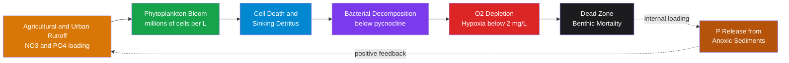

# Harmful Algal Blooms and Dead Zones

> [!abstract] TL;DR
> Harmful algal blooms (HABs) occur when certain phytoplankton species — dinoflagellates, diatoms, and cyanobacteria — proliferate explosively in nutrient-enriched coastal waters, producing biotoxins (saxitoxin, brevetoxin, domoic acid) that poison shellfish, kill fish, and sicken or kill marine mammals and humans. The underlying driver in most coastal systems is **eutrophication**: excess nitrogen (NO₃⁻) and phosphorus (PO₄³⁻) from agricultural runoff and sewage fuel blooms beyond what the ecosystem can process. When a bloom crashes, bacterial decomposition of the sunken organic matter consumes dissolved oxygen faster than it can be replenished, creating **hypoxic dead zones** (O₂ below 2 mg/L) where fish, crabs, and bottom-dwelling life suffocate. The Gulf of Mexico dead zone (~20,000 km²) and Baltic Sea bottom-water anoxia (~65,000 km²) are the world's largest and most studied examples; climate change — by warming and stratifying the ocean — is expanding both the geographic range of HABs and the duration of hypoxic events.

---

## Intuition

**Analogy:** A harmful algal bloom is like a wildfire in a heavily fertilized forest. The excess nutrients (nitrogen and phosphorus from agriculture and sewage washing into rivers and ultimately the ocean) are the fuel load; warm, calm, stratified summer water is the spark and the ideal burning condition. The bloom — millions of algal cells per liter, sometimes turning the water red or green — is the fire itself, racing across the sun-lit surface. When it burns out and the cells die, they sink below the pycnocline and bacteria decompose them like slowly smoldering logs — consuming every molecule of dissolved oxygen in the bottom water. The resulting "dead zone" is an anoxic desert: shrimp flee, fish suffocate, crabs die in place.

The technical name for this sequence is **eutrophication** (from Greek: "well-nourished"). In a pristine coastal ocean, nutrients limit phytoplankton growth, keeping biomass in check. External nutrient loading breaks that limit, sending the system through an accelerating cascade from excess nutrients to bloom to hypoxia — and, in many coastal bays, to a self-reinforcing trap where anoxic sediments release stored phosphorus, feeding the next year's bloom without any additional external loading.

---

## How It Works

### The Eutrophication Cascade

The eutrophication cascade unfolds in five linked steps:

**1. Nutrient Loading**
Agricultural fertilizers, animal waste, and municipal sewage deliver dissolved inorganic nitrogen (NO₃⁻, NH₄⁺) and phosphorus (PO₄³⁻) to rivers, estuaries, and coastal seas. Atmospheric nitrogen deposition (from fossil fuel combustion and ammonia volatilization from livestock) adds a second pathway, bypassing rivers entirely. In the Mississippi River basin — draining ~41% of the contiguous United States — nitrate concentrations have roughly tripled since the mid-20th century due to corn-belt fertilizer use, making it the dominant driver of the Gulf of Mexico dead zone.

**2. Phytoplankton Bloom**
Once nutrient concentrations exceed the half-saturation constants of fast-growing phytoplankton (K_N ~ 1–20 μmol/L for nitrate, K_P ~ 0.1–1 μmol/L for phosphate), bloom species multiply at rates up to 1–2 doublings per day. HAB species often have competitive advantages in stratified, nutrient-loaded conditions: buoyancy regulation (dinoflagellates migrate vertically to access deep nutrients while staying in the light), toxin production that deters grazers, or the ability to form resting cysts that seed blooms from the sediment. Cell concentrations exceeding 10⁶ cells/L can discolor the water (red, brown, green).

**3. Organic Matter Export**
As blooms senesce — once nutrients are depleted or when the water cools — cells die and aggregate into rapidly sinking particles (marine snow). Below the pycnocline, this fresh organic matter is out of reach of wind-mixing and sunlight but within reach of aerobic bacteria.

**4. Microbial Decomposition and O₂ Depletion**
Bacteria oxidize the organic carbon:
$$\text{CH}_2\text{O} + \text{O}_2 \rightarrow \text{CO}_2 + \text{H}_2\text{O}$$
This reaction consumes dissolved oxygen in the bottom water. The rate of consumption depends on organic matter flux (bloom intensity × settling velocity) and the volume of the bottom-water layer. When bottom water is isolated from surface oxygen by summer stratification — warm, low-density surface water floating over cold, dense bottom water — no reaeration occurs and O₂ falls inexorably.

**5. Hypoxia and Benthic Mortality**
Below **2 mg/L O₂** (~63 μmol/L) the zone is classified as hypoxic. Mobile organisms flee; slower organisms (crabs, tube worms, clams, oysters) die in place. Below ~0.5 mg/L (severe hypoxia / anoxia) sulfate-reducing bacteria take over, producing hydrogen sulfide (H₂S) — toxic even in trace amounts and lethal to virtually all metazoans. The benthic community collapses, and phosphorus previously buried in the sediment is released under anoxic conditions, creating a **positive feedback** (internal loading) that sustains the next year's bloom even if external loading is partially reduced.

The oxygen penetration depth into sediments, and hence the severity of benthic impact, is predicted well by the Fickian diffusion balance between organic matter rain rate $F_{OM}$ and sediment O₂ demand $D_O$:
$$\text{O}_2\text{ penetration depth} \propto \sqrt{\frac{D_O \cdot [O_2]_{bottom}}{F_{OM}}}$$

---

### HAB Organisms and Their Toxins

| Species | Toxin | Syndrome | Key Region |
|---------|-------|----------|------------|
| *Karenia brevis* (dinoflagellate) | Brevetoxin (PbTx-2, PbTx-3) | NSP — Neurotoxic Shellfish Poisoning; fish kills; respiratory irritation | Florida Gulf Coast, Gulf of Mexico |
| *Alexandrium tamarense* / *A. catenella* (dinoflagellate) | Saxitoxin (STX) and analogues | PSP — Paralytic Shellfish Poisoning | Northeast US, Pacific Northwest, Alaska, Europe |
| *Pseudo-nitzschia australis* / *P. multiseries* (diatom) | Domoic acid (DA) | ASP — Amnesic Shellfish Poisoning; "toxic amnesia" | California, Pacific Northwest, Europe |
| *Gymnodinium catenatum* (dinoflagellate) | Saxitoxin analogues | PSP | Iberian Peninsula, Southern Ocean |
| *Dinophysis acuminata* (dinoflagellate) | Okadaic acid, dinophysistoxins | DSP — Diarrhetic Shellfish Poisoning | Europe, Japan, Chile |
| *Microcystis aeruginosa* (cyanobacterium) | Microcystin-LR (hepatotoxin) | Liver damage; dog/livestock deaths | Freshwater, eutrophic lakes and estuaries |
| *Anabaena* / *Aphanizomenon* spp. (cyanobacteria) | Anatoxin-a (neurotoxin), cylindrospermopsin | Neurotoxicity, organ damage | Freshwater, Baltic Sea bays |

---

### Bloom Prediction and Stratification

HAB formation requires the convergence of three conditions: (1) seed population (resting cysts in sediment or advected cells), (2) nutrient availability, and (3) physical conditions that concentrate cells at the surface and reduce turbulent dilution.

The **stratification parameter** SP quantifies how strongly the water column resists vertical mixing:

$$\text{SP} = \frac{\Delta\rho \, g \, H^2}{\rho_0}$$

where $\Delta\rho$ = density difference between surface and bottom (kg/m³), $g$ = 9.81 m/s², $H$ = mixed layer depth (m), and $\rho_0$ = reference density (~1025 kg/m³). Larger SP means stronger stratification. In summer, $\Delta\rho$ increases (surface warming reduces surface density) and turbulent mixing decreases (weaker winds, calmer seas), promoting the calm, sunlit, nutrient-enriched surface conditions that dinoflagellates exploit for bloom initiation. Most mass mortality events from Karenia brevis and Alexandrium blooms correlate with sustained high SP values over multi-week periods during wind relaxation events.

Bloom prediction operationally combines:
- **Satellite ocean colour** (MODIS Aqua/Terra, SeaWiFS): chlorophyll-a anomalies >5 μg/L flag potential HABs
- **Sea-surface temperature** (SST): warm anomalies + stratification indicators
- **Rapid shellfish testing**: ELISA kits can detect saxitoxin or domoic acid in tissue within hours
- **Cyst surveys**: sediment core sampling predicts bloom risk from the resting-stage seed bank

---

### Toxin Mechanisms at the Molecular Level

**Saxitoxin (Na⁺ channel blocker — PSP).**
Saxitoxin and its ~50 analogues bind with high affinity (K_d ~ 1 nM) to site 1 of voltage-gated sodium channels (Nav1.x), occluding the pore from outside. With Na⁺ channels blocked, action potentials cannot propagate: peripheral neurons are silenced first (tingling → paralysis), then respiratory muscle paralysis causes asphyxiation. Saxitoxin is one of the most potent non-protein toxins known — the oral lethal dose in humans is estimated at ~0.5–10 μg/kg body weight. Cooking does not destroy it. Bivalves (mussels, clams, oysters) accumulate STX to hundreds of μg per 100 g tissue without being harmed because invertebrate Nav channels have lower toxin sensitivity.

**Brevetoxin (Na⁺ channel activator — NSP).**
Brevetoxins (cyclic polyether ladder compounds) bind to site 5 of Nav channels, shifting the activation threshold to more negative potentials and preventing channel inactivation. Instead of blocking action potentials (like saxitoxin), they *continuously trigger* them — every Nav channel becomes constitutively open. The result is spontaneous, uncontrolled depolarization in neurons and muscle cells: fish exhibit violent convulsions before dying. In humans who inhale sea spray during a bloom, aerosolized brevetoxin causes bronchoconstriction and respiratory distress; it is a significant public health hazard during Florida red tide events. Manatees (which are air-breathers that feed on seagrass contaminated by brevetoxin) are especially vulnerable, with hundreds dying in major bloom years.

**Domoic acid (AMPA/kainate receptor agonist — ASP).**
Domoic acid is a structural analog of glutamate that binds irreversibly to AMPA and kainate ionotropic glutamate receptors in the CNS with ~100× greater affinity than glutamate itself. The result is runaway excitatory postsynaptic potentials (excitotoxicity): sustained receptor activation causes massive Ca²⁺ influx, cell swelling, and neuronal death, particularly in the hippocampus — the brain region for spatial memory. The 1987 Prince Edward Island outbreak (domoic acid in mussels) killed 3 people and caused permanent anterograde amnesia in dozens more. In marine mammals, DA causes "sea lion epilepsy" — seizures and disorientation observed in stranded California sea lions during Pseudo-nitzschia bloom years.

---

### Gulf of Mexico Dead Zone

The northern Gulf of Mexico hypoxic zone, first documented systematically by Rabalais and Turner (1990s), is one of Earth's largest anthropogenic dead zones. It forms annually between May and September on the Louisiana–Texas continental shelf, driven by spring Mississippi–Atchafalaya River discharge which peaks after snowmelt and spring rains across the agricultural Midwest.

Key features:
- **Size:** ~13,000–22,000 km² in most years; measured at its largest at ~22,000 km² in 2017; long-term average ~14,000 km²
- **Depth of hypoxia:** typically 5–30 m bottom-water layer, on a shelf 15–50 m deep
- **Mechanism:** River plume stratifies the water column (low-salinity, warm surface water over saltier, cooler shelf water); spring-summer winds are insufficient to break stratification; bottom-water O₂ falls below 2 mg/L by June–July
- **Autumn recovery:** Fall storms (cold fronts, eventually tropical cyclones) vertically mix the water column, re-oxygenating the bottom by October–November
- **Ecological impact:** Shrimp, crabs, and finfish are displaced, reducing trawl yields. Bottom-dwelling invertebrates (worms, clams) die, disrupting benthic food webs. Long-term reduction in demersal fish condition and habitat quality
- **Management:** The Gulf Hypoxia Task Force (US EPA / Mississippi River/Gulf of Mexico Watershed Nutrient Task Force) set a target of reducing the zone to 5,000 km² by 2035 through upstream nutrient management (precision agriculture, wetland restoration, cover crops), though progress has been slow

---

### Baltic Sea Hypoxia

The Baltic Sea is arguably the world's most severe case of anthropogenic coastal hypoxia, with structural features that amplify eutrophication effects:

- **Basin geometry:** Semi-enclosed, with only the narrow Danish Straits connecting to the North Sea, limiting ventilation of deep water
- **Stratification:** Strong halocline at 60–80 m depth separates well-oxygenated surface water from deep brine (saline, dense water from North Sea inflows)
- **Anoxic area:** ~65,000 km² of seafloor (roughly the area of Latvia) persistently anoxic or severely hypoxic; hypoxic area expands to ~95,000 km² in bad years
- **Nutrient sources:** Sweden, Finland, Denmark, Poland, and the Baltic states collectively discharge substantial agricultural and municipal N and P; Russia and Belarus add major loads via the Neva, Daugava, and other rivers
- **Internal P loading:** Centuries of sediment P accumulation, released under anoxia, now sustains eutrophication even if external loads are cut — estimated at 2–4× higher than riverine inputs during anoxic years
- **HELCOM targets:** The Helsinki Commission (HELCOM) Baltic Sea Action Plan (2007, revised 2021) sets country-by-country maximum allowable nutrient inputs (MAI) targeting a 20–40% reduction in nutrient loads from the 1997–2003 baseline
- **Stagnation and ventilation events:** Deep Baltic basins can remain stagnant for years until a major saltwater inflow (barotropic inflow event) from the North Sea temporarily re-oxygenates the depths; such events have become less frequent in recent decades

---

### Flow / Architecture



---

## Key Concepts / Details

### Secondary Level

- **Red tides are algal blooms that can be toxic.** When certain species of phytoplankton multiply explosively — triggered by warm water and nutrients from farm fertilizers washing into rivers and then the sea — the water can turn red, brown, or green. Some of these blooms produce poisons that accumulate in shellfish (mussels, clams, oysters). Eating contaminated shellfish can paralyze or even kill people. Monitoring agencies close shellfish harvesting areas during bloom events.

- **Fertilizer from farms creates ocean dead zones.** Nitrogen and phosphorus from agricultural fields dissolve in rainwater, flow into rivers, and eventually reach the coast. There they fertilize not crops but algae. When the algae die and decompose, bacteria consume all the oxygen in the bottom water. Fish flee; crabs and shrimp die. This oxygen-depleted zone — a "dead zone" — forms every summer in places like the Gulf of Mexico, driven by nitrogen fertilizers from the US corn belt washing down the Mississippi River.

- **Dead zones are not permanent — but they are getting worse.** Most coastal dead zones form in summer when warm surface water sits on top of colder bottom water and blocks oxygen from mixing down. Autumn storms and cooling break this stratification, re-oxygenating the bottom. However, each year the cycle restarts if nutrient loading continues. The number of documented dead zones worldwide has roughly doubled every decade since the 1960s, now exceeding 700 globally. Climate change, by warming and further stratifying the ocean, threatens to make seasonal dead zones longer and more severe.

---

### Undergraduate Level

**Vollenweider Model for Eutrophication.**
Vollenweider (1968, 1976) developed the first quantitative framework relating phosphorus loading to a lake's (or estuary's) trophic state. The steady-state mean phosphorus concentration in a well-mixed water body is:

$$[\text{P}]_{eq} = \frac{L_P}{q_s \left(1 + \sqrt{T_r}\right)}$$

where $L_P$ = areal phosphorus loading (mg P m⁻² yr⁻¹), $q_s$ = hydraulic overflow rate (m yr⁻¹) = mean depth / residence time, and $T_r$ = hydraulic residence time (yr). Systems fall into trophic categories: [P] < 10 μg/L = oligotrophic; 10–30 μg/L = mesotrophic; >30 μg/L = eutrophic. The model defines critical loading thresholds above which a system tips into eutrophy — foundational to the nutrient reduction targets set for the Great Lakes and Chesapeake Bay.

**Redfield Ratio and Nutrient Control.**
Phytoplankton require carbon, nitrogen, and phosphorus in a ratio of approximately C:N:P = 106:16:1 by atoms (the **Redfield ratio**, 1934). This stoichiometry has profound implications: if ambient N:P exceeds 16, the system is P-limited (P is the proximate controlling nutrient); if N:P is below 16, the system is N-limited. Most freshwater systems are P-limited (hence P is the management target for lake eutrophication); many estuaries and coastal seas are N-limited at the surface (hence N loading drives blooms). Some systems switch seasonally between N and P limitation. Cyanobacteria complicate this because they can fix atmospheric N₂, effectively bypassing N limitation and becoming P-limited even in N-deficient waters — which is why cyanobacterial blooms (e.g., in the Baltic) respond poorly to N reduction alone.

**Hypoxia Threshold and DO Units.**
The **2 mg/L O₂ threshold** for hypoxia corresponds to approximately 63 μmol/L (using molecular weight of O₂ = 32 g/mol: 2 mg/L ÷ 32 g/mol × 1000 = 62.5 μmol/L). At 20°C and 35 psu, saturated seawater holds ~7.0 mg/L O₂. The half-saturation constant for aerobic metabolism in many benthic organisms is 1–3 mg/L, so hypoxia is generally defined conservatively at 2 mg/L. Severe hypoxia is defined as O₂ below 0.5 mg/L; anoxia means no measurable O₂.

**HAB Detection: Satellite to Rapid Test Kits.**
*Satellite-based detection:* Chlorophyll-a fluorescence from MODIS and VIIRS sensors detects bloom extent (>5 μg/L flags high biomass). Species identification requires complementary data — for example, Karenia brevis has a characteristic backscattering:chlorophyll ratio detectable in MODIS bands 1 and 9. *Toxin testing:* The standard US regulatory method for PSP (saxitoxin) is the AOAC mouse bioassay, being replaced by HPLC-FLD and LC-MS/MS methods that quantify individual saxitoxin congeners. Rapid ELISA kits provide shellfish-farm gate screening in ~3 hours. *Molecular methods:* qPCR (quantitative PCR) on water samples can detect and quantify HAB species DNA within hours, enabling early warning before visible bloom.

**Toxin Bioaccumulation in the Shellfish Food Chain.**
Bivalve filter feeders (mussels, clams, oysters, scallops) accumulate HAB toxins by concentrating HAB cells from the water column. At a filtering rate of 2–5 L/hr, a single mussel can accumulate toxin concentrations orders of magnitude above the water column within 24–48 hours. Many mollusks efficiently detoxify saxitoxin, but some (butter clams, *Saxidomus giganteus*) retain PSP toxins in their siphons for years. The regulatory action level in the EU is 800 μg STX-equivalent per kg tissue; the US FDA uses 80 μg/100 g. Seabirds and marine mammals feeding on contaminated prey are secondarily affected — the 1987 pelican die-off in Monterey Bay was caused by domoic acid in anchovies.

---

### Graduate Level

**Cyst-Based HAB Seeding and Long-Distance Transport.**
Many HAB dinoflagellates (Alexandrium, Gymnodinium, Scrippsiella) produce resting dinocysts that sink to the sediment after bloom termination. Cysts remain dormant for years to decades, germinating when temperature and light conditions become favorable. Sediment cyst maps are the best predictor of future bloom risk: the "seed bank" of *Alexandrium tamarense* cysts in Gulf of Maine sediments was built up over centuries and explains the recurrence of PSP events. Long-distance transport of cysts in ship ballast water is thought to have seeded HAB expansion into new regions — the 1972 first appearance of PSP in New England coincided with increased tanker traffic. The ECOHAB (Ecology and Oceanography of Harmful Algal Blooms) program coordinates US research on cyst dynamics, bloom transport (Lagrangian particle tracking with ROMS model output), and toxin quantification in sentinel species.

**Climate Change Projections: Warmer Ocean, More HABs.**
Multiple lines of evidence suggest climate change will expand HABs both in frequency and geographic range:
1. *Thermal stratification:* CMIP6 models project a 10–15% increase in global ocean stratification by 2100 under SSP2-4.5, extending the stratified season that favors surface-dwelling dinoflagellates
2. *Range expansion:* *Alexandrium* populations have been documented in Arctic waters (Bering Sea, Norwegian Sea) at sites previously too cold; *Karenia brevis* blooms in the Gulf of Mexico are tracking poleward with SST isotherms
3. *Precipitation and N loading:* Increased extreme precipitation events (projected for mid-latitudes) deliver larger nutrient pulses to coastal rivers, intensifying spring nutrient loading
4. *Reduced flushing:* Sea-level rise reduces tidal flushing of shallow estuaries, increasing residence time and eutrophication risk
5. *CO₂ effects:* Elevated pCO₂ benefits some HAB species (Heterocapsa and some cyanobacteria show enhanced growth at elevated CO₂) while reducing carbonate-shell grazers (pteropods, coccolithophores) that control bloom biomass

The interaction of these drivers makes HAB management a non-stationary problem: historical loading-impact relationships will not hold under future climate, and nutrient management targets based on pre-2000 conditions may be insufficient to maintain pre-1970s ecosystem states.

**Chesapeake Bay Restoration and Nutrient Trading.**
The Chesapeake Bay — the largest US estuary — underwent severe eutrophication from the 1960s onward, with the summertime dead zone occupying ~15% of bay volume. The Chesapeake Bay Total Maximum Daily Load (TMDL, 2010) set enforceable nitrogen (~185.9 million lb/yr) and phosphorus (~12.5 million lb/yr) caps distributed across six watershed states. Key restoration measures include: **nutrient trading** (farms buying and selling N/P discharge permits to achieve cost-effective reductions), **wetland restoration** (denitrification in restored tidal marshes can remove 30–50% of incoming N), and **oyster reef restoration** (Eastern oyster (*Crassostrea virginica*) populations filter up to 50% of Chesapeake water daily in historical estimates, grazing phytoplankton and reducing bloom biomass). Recent monitoring shows significant reductions in N and P loads and an improvement in bottom-water oxygen, though full restoration targets for hypoxia extent have not yet been met.

**HELCOM Baltic Nutrient Reduction Targets.**
The HELCOM Baltic Sea Action Plan (BSAP) uses the NEST (Nutrient Emission Scenario Tool) model to apportion country-specific maximum allowable nutrient inputs (MAI). The 2013 revised BSAP set combined N reduction targets of ~135,000 tonnes N/yr and ~15,000 tonnes P/yr below the 1997–2003 reference period. Progress is uneven: Poland, Russia, and the Baltic states lag behind targets while Sweden and Denmark are close to compliance. The **BONUS program** (Baltic Organisations' Network for Funding Science) funds research on internal P cycling, showing that legacy sediment P release (internal loading) will sustain eutrophication for decades even after external loads meet targets, due to the ~50-year reservoir of P in basin sediments.

---

## Python Demo

```python
# 4-box eutrophication ODE model
# State variables: N (nutrient), P (phytoplankton), D (detritus), O (dissolved O2)
# Demonstrates: bloom -> hypoxia under high loading, recovery after nutrient reduction

import numpy as np
from scipy.integrate import solve_ivp
import matplotlib.pyplot as plt

def eutrophication_ode(t, y, J_N):
    """4-box eutrophication model.
    
    Parameters
    ----------
    y : [N, P, D, O]
        N = dissolved inorganic nutrient (umol/L)
        P = phytoplankton biomass (umol C/L)
        D = detritus / decomposing organic matter (umol C/L)
        O = dissolved oxygen (mg/L)
    J_N : float
        External nutrient loading rate (umol/L/day)
    """
    N, P, D, O = y
    N = max(N, 0.0)
    O = max(O, 0.0)

    mu_max = 1.0    # max phytoplankton growth rate (d^-1)
    K_N    = 15.0   # half-saturation constant for N (umol/L)
    m      = 0.12   # phytoplankton mortality rate (d^-1)
    r_D    = 0.07   # detritus decomposition rate (d^-1)
    eps_N  = 0.80   # fraction of decomposition remineralized to N
    Y_O    = 0.30   # O2 produced per umol/L phytoplankton grown (mg/L per umol/L)
    c_O    = 0.40   # O2 consumed per umol/L detritus decomposed (mg/L per umol/L)
    k_ex   = 0.03   # air-sea O2 exchange coefficient (d^-1)
    O_sat  = 9.0    # O2 saturation at ~20 degC, 35 psu (mg/L)

    mu = mu_max * N / (K_N + N)   # Monod growth rate (d^-1)

    dN = -mu * P + eps_N * r_D * D + J_N
    dP = (mu - m) * P
    dD = m * P - r_D * D
    dO = Y_O * mu * P - c_O * r_D * D + k_ex * (O_sat - O)

    return [dN, dP, dD, dO]

# Initial conditions: low nutrient, small seed population, saturated O2
y0 = [5.0, 0.5, 0.1, 9.0]   # [N (umol/L), P (umol C/L), D (umol C/L), O (mg/L)]

# Phase 1 (day 0-180): HIGH nutrient loading - simulates agricultural runoff season
J_N_high = 1.5   # umol/L/day
sol1 = solve_ivp(eutrophication_ode, (0, 180), y0,
                 args=(J_N_high,), method='RK45',
                 dense_output=True, max_step=0.5,
                 rtol=1e-6, atol=1e-9)

# Phase 2 (day 180-360): LOW nutrient loading - management intervention
J_N_low = 0.2    # umol/L/day
y0_phase2 = sol1.y[:, -1]
sol2 = solve_ivp(eutrophication_ode, (180, 360), y0_phase2,
                 args=(J_N_low,), method='RK45',
                 dense_output=True, max_step=0.5,
                 rtol=1e-6, atol=1e-9)

# Combine time series
t  = np.concatenate([sol1.t,       sol2.t[1:]])
N_ = np.concatenate([sol1.y[0],    sol2.y[0, 1:]])
P_ = np.concatenate([sol1.y[1],    sol2.y[1, 1:]])
D_ = np.concatenate([sol1.y[2],    sol2.y[2, 1:]])
O_ = np.clip(np.concatenate([sol1.y[3], sol2.y[3, 1:]]), 0, None)

HYPOXIA_THRESHOLD = 2.0   # mg/L

# --- Plotting ---
fig, axes = plt.subplots(2, 2, figsize=(12, 8), sharex=True)
fig.suptitle("4-Box Eutrophication Model: Bloom -> Hypoxia -> Recovery\n"
             "(day 0-180: high loading; day 180-360: load reduced by 87%)",
             fontsize=12)

ax = axes[0, 0]
ax.plot(t, N_, color='#d97706', lw=2)
ax.axvline(180, color='k', ls='--', lw=1, label='Load reduced (day 180)')
ax.set_title("Dissolved Inorganic Nutrient (N)")
ax.set_ylabel("N (umol/L)")
ax.legend(fontsize=8)
ax.grid(alpha=0.3)

ax = axes[0, 1]
ax.plot(t, P_, color='#16a34a', lw=2)
ax.axvline(180, color='k', ls='--', lw=1)
ax.set_title("Phytoplankton Biomass (P)")
ax.set_ylabel("P (umol C/L)")
ax.grid(alpha=0.3)

ax = axes[1, 0]
ax.plot(t, D_, color='#7c3aed', lw=2)
ax.axvline(180, color='k', ls='--', lw=1)
ax.set_title("Detritus / Decomposing OM (D)")
ax.set_xlabel("Time (days)")
ax.set_ylabel("D (umol C/L)")
ax.grid(alpha=0.3)

ax = axes[1, 1]
ax.plot(t, O_, color='#0288d1', lw=2, label='Dissolved O2')
ax.axhline(HYPOXIA_THRESHOLD, color='#dc2626', ls='--', lw=1.5,
           label=f'Hypoxia threshold ({HYPOXIA_THRESHOLD} mg/L)')
ax.fill_between(t, 0, HYPOXIA_THRESHOLD,
                where=(O_ < HYPOXIA_THRESHOLD),
                color='#dc2626', alpha=0.2, label='Hypoxic period')
ax.axvline(180, color='k', ls='--', lw=1)
ax.set_title("Dissolved Oxygen (O)")
ax.set_xlabel("Time (days)")
ax.set_ylabel("O2 (mg/L)")
ax.legend(fontsize=8)
ax.grid(alpha=0.3)

plt.tight_layout()
plt.savefig('eutrophication_model.png', dpi=120, bbox_inches='tight')
plt.show()

# Summary statistics
min_O2 = O_.min()
hypoxic_days = float(np.sum(O_ < HYPOXIA_THRESHOLD) * np.median(np.diff(t)))
peak_P = P_.max()
print(f"Peak phytoplankton biomass: {peak_P:.1f} umol C/L")
print(f"Minimum O2: {min_O2:.2f} mg/L  (hypoxia threshold = {HYPOXIA_THRESHOLD} mg/L)")
print(f"Approximate duration of hypoxia: {hypoxic_days:.0f} days")
print(f"O2 at end of simulation (day 360): {O_[-1]:.2f} mg/L")
```

The model illustrates the core eutrophication dynamic: under high nutrient loading, phytoplankton bloom, crash, and the resulting detritus drives O₂ below the hypoxia threshold. After nutrient load reduction (day 180), detritus decreases, O₂ recovers — demonstrating that hypoxic zones *can* recover if nutrient management is implemented, though recovery is slow relative to degradation.

---

## Real-World Notes

> **Florida Gulf Coast — Karenia brevis Annual Blooms.**
> The West Florida Shelf experiences nearly annual *Karenia brevis* blooms (Florida red tide), typically initiated 40–200 km offshore in oligotrophic Gulf of Mexico water — a unusual feature for eutrophication-driven HABs — and transported onshore by coastal currents. Bloom events in 2017–2018 and 2021 were among the most severe on record, killing thousands of tonnes of fish, hundreds of sea turtles, and dozens of manatees. Brevetoxin-laced sea spray caused beach closures and respiratory complaints up to 1 km inland. Estimated economic losses for southwest Florida tourism, fishing, and hospitality exceeded $100 million per event. Karenia blooms are not primarily eutrophication-driven — they seed offshore — but their transport and intensity are modulated by coastal nutrient levels.

> **Chesapeake Bay Dead Zone.**
> The Chesapeake Bay experiences a recurring summer dead zone (June–September) in its deeper channel, typically covering 8–13% of bay volume, with O₂ often falling below 1 mg/L. The primary nutrient source is nitrogen from agriculture (poultry and row crops, Virginia and Maryland) and point-source wastewater discharges. Under the Chesapeake Clean Water Blueprint (TMDL), nitrogen loads have been reduced ~25% since 2009, and monitoring shows modest improvements in bottom-water O₂ in some years — but the dead zone persists because of legacy nutrient accumulation and the sensitivity of hypoxia to interannual climate variability (wet springs with high river discharge correlate directly with dead zone size).

> **2007 San Francisco Bay Domoic Acid Event.**
> An exceptional bloom of *Pseudo-nitzschia australis* in June 2007 produced domoic acid concentrations exceeding 10,000 ng/g in anchovies off the California coast. Hundreds of California sea lions (*Zalophus californianus*) stranded on beaches exhibiting seizures, disorientation, and aggression — the neurological hallmarks of ASP. Affected animals had hippocampal lesions visible on MRI. The event highlighted that domoic acid poisoning can affect wildlife thousands of kilometers from bloom epicenter through the pelagic food chain (HAB cells → anchovies → sea lions).

> **Black Sea and Adriatic — Recovery After Reduction.**
> The Black Sea shelf experienced severe eutrophication and Noctiluca scintillans (non-toxic) and Gymnodinium bloom events through the 1980s–1990s, driven by Danube River nutrient inputs from Eastern European agriculture. Following economic collapse in Eastern Europe in the early 1990s, fertilizer use dropped dramatically. Nutrient loading to the Black Sea fell 50–60%, and monitoring shows partial recovery of bottom-water oxygen on the northwestern shelf — a natural experiment demonstrating that nutrient reduction does reverse eutrophication. A similar story played out in the northern Adriatic following Italian Po River nutrient controls.

> **NOAA Economic Impact Estimate.**
> NOAA estimates that HABs cause approximately $82 million per year in economic losses in the United States, including costs to commercial and recreational fisheries, public health monitoring and beach closures, aquaculture losses (shellfish bed closures), and decreased tourism. This likely underestimates true societal costs because it excludes ecosystem service losses (reef degradation, wildlife mortality, reduction in cultural use values of coastal waters).

---

## Common Pitfalls

- **Calling all algal blooms "harmful."** The vast majority of phytoplankton blooms are non-toxic and ecologically beneficial — they form the base of marine food webs and drive the biological pump. HABs are a small subset of bloom events characterized either by toxin production or by sheer biomass sufficient to cause oxygen depletion. A diatom bloom supporting a fishery is not a HAB even if it discolors the water.

- **Assuming all red tides are toxic.** Red, brown, or rust-colored discoloration most commonly results from massive concentrations of *Noctiluca scintillans* (a heterotrophic dinoflagellate that produces no potent shellfish toxin), harmless raphidophytes, or high-density diatom blooms. In Florida, *Trichodesmium* (a cyanobacterium) regularly produces vivid rust-red surface slicks that look like red tide but do not produce shellfish toxins at dangerous levels. Species identification — not color — determines toxicity.

- **Thinking dead zones are permanent features once formed.** Most coastal dead zones are **seasonal**: stratification-driven in summer and re-aerated by autumn storms and cooling. The Gulf of Mexico dead zone collapses every October–November as cold fronts mix the water column. Even the Baltic deep basins partially re-oxygenate following intermittent North Sea saltwater inflow events. The key insight for management is that reducing nutrient loads *can* reduce dead zone severity; the challenge is that the response is delayed (years to decades) because of legacy nutrient stocks in sediments, and may not be linear — some systems exhibit hysteresis where the nutrient load required to *improve* conditions is lower than the load that originally caused them.

- **Conflating N limitation with P limitation across ecosystems.** Freshwater lakes are almost always P-limited (the Vollenweider framework targets P); coastal marine systems are often N-limited (because N:P in ocean water is commonly below Redfield). Applying freshwater nutrient management logic to estuaries (or vice versa) can target the wrong nutrient and produce no improvement. In stratified coastal systems, N controls summer bloom intensity but P controls winter nutrient accumulation — both may need management. Additionally, cyanobacteria can fix N₂, so targeting only N in cyanobacteria-dominated systems (e.g., Baltic) may actually favor cyanobacteria over other phytoplankton by reducing competition.

- **Underestimating internal loading when setting management targets.**
  Once a coastal basin has been eutrophic for years, sediments accumulate substantial stores of remineralizable organic P and N. Under anoxic conditions, ferric iron oxyhydroxides dissolve, releasing adsorbed phosphate back to the water column. This "internal loading" can sustain bloom conditions for 20–50 years after external nutrient loads are cut to target levels. Management models that ignore internal loading will predict faster recovery than observed — leading to public and political frustration with management programs. Dredging or chemical (alum) treatment of sediments can accelerate recovery in small systems but is impractical at estuary scale.

---

## Related Concepts

**Same vault — Oceanography:**

- [[Marine_Primary_Production_and_Phytoplankton]] — HABs are a subset of phytoplankton ecology; the same nutrients, light, and stratification conditions that control primary production govern whether a bloom is harmful or beneficial
- [[Nutrient_Cycles_and_Trace_Elements]] — the nitrogen and phosphorus cycles that supply the raw material for eutrophication; remineralization and denitrification rates control how long nutrients persist in the coastal system
- [[Dissolved_Oxygen_and_Redox_Chemistry]] — the electrochemical cascade from oxic to anoxic conditions in dead zones; sulfate reduction, iron cycling, and P mobilization under hypoxia
- [[Coastal_Circulation_and_Estuaries]] — stratification, residence time, and flushing dynamics that determine whether a coastal sea accumulates nutrients or exports them; estuarine gravitational circulation controls the trap efficiency for riverine N and P
- [[Marine_Fisheries_and_Ocean_Resources]] — HABs and dead zones directly impact commercial fisheries through direct mortality, closure of shellfish beds, and displacement/habitat loss for demersal species
- [[The_Biological_Pump_and_Carbon_Export]] — the same sinking of organic matter that creates dead zones is the biological pump; HAB bloom sedimentation events represent episodic, high-flux carbon export pulses
- [[The_Oceanic_Carbon_Cycle]] — eutrophication and hypoxia affect air-sea CO₂ exchange: decomposition in bottom water acidifies it and increases pCO₂, while surface blooms draw down CO₂ temporarily
- [[Density_Stratification_and_Mixing]] — summer stratification (pycnocline formation) is the physical prerequisite for dead zone development; without stratification, vertical mixing would re-oxygenate bottom water faster than decomposition consumes it
- [[_MOC_Biological_Oceanography]] — section map of all Biological Oceanography notes

**Cross-vault:**

- [[Acids_Bases_and_pH]] — pH shifts accompany O₂ consumption in dead zones (CO₂ produced by decomposition dissolves to form carbonic acid); the carbonate buffering system relevant to ocean acidification interacts with hypoxia in "compound stressor" effects on marine organisms
- [[Chemical_Kinetics]] — microbial decomposition kinetics (first-order O₂ consumption models), toxin degradation rates, and the kinetics of nitrogen transformations (nitrification, denitrification) in hypoxic sediments
- [[Weathering_and_Soils]] — terrestrial weathering and soil N cycling determine the baseline N and P export from watersheds; agricultural intensification augments natural weathering fluxes by 5–10× in impacted river basins
- [[_MOC_Chemistry_Master]] — entry point for carbonate chemistry, redox chemistry, and biochemical reactions underlying HAB toxin synthesis and eutrophication geochemistry
- [[_MOC_Earth_Science_Master]] — entry point for geomorphology (river routing of agricultural nutrients), sedimentary processes (P storage in sediments), and paleoclimate (past anoxic ocean events like Oceanic Anoxic Events)

---

## Review Questions

### Secondary Level

1. Why does the Gulf of Mexico dead zone form every summer near the Mississippi River delta rather than in the middle of the ocean, and why does it disappear in autumn?
2. A person eats clams harvested during a red tide event in the Pacific Northwest and develops tingling lips, progressive paralysis, and difficulty breathing. Which toxin is responsible, which HAB species produced it, and how does it affect the nervous system?
3. A farmer near the Chesapeake Bay is told to reduce fertilizer application. Explain, step by step, why this should reduce summer hypoxia in the bay — even though the farm is 200 km from the coast.

### Undergraduate Level

1. Using the Redfield ratio (C:N:P = 106:16:1) and the stoichiometry of aerobic respiration, estimate how many moles of O₂ are consumed per mole of P in a eutrophication event. If a coastal bottom-water layer initially contains 250 μmol/L O₂ and receives a bloom-derived organic matter sedimentation flux equivalent to 0.5 μmol P/L/day, how long before the layer becomes hypoxic (below 63 μmol/L O₂), assuming no reaeration?
2. The Vollenweider model predicts that halving phosphorus loading to an estuary will not halve the resident phosphorus concentration. Explain why, using the model equation, and discuss what additional process (not in the original Vollenweider model) makes recovery even slower in many real systems.
3. Compare the toxin mechanisms of saxitoxin (PSP) and domoic acid (ASP): both are HAB biotoxins that attack the nervous system, but their molecular targets and clinical syndromes differ fundamentally. Describe the receptor/channel target, the physiological effect of binding, and the key clinical features distinguishing PSP from ASP.

### Graduate Level

1. A Baltic Sea model shows that even if all external nutrient inputs are reduced to zero today, hypoxia on the western Baltic shelf would persist for 30–50 years. Construct a quantitative argument for why, using estimates of: (a) the mass of P stored in Baltic sediments (~600,000 tonnes), (b) the annual P release rate under anoxic conditions (~3 mg/m²/day over 65,000 km² anoxic area), and (c) the riverine P load that would have been the natural background. What management strategy beyond external load reduction does this imply?
2. Climate change models project a 15% increase in stratification and a 10-day extension of the summer stratified season by 2100 (SSP2-4.5). Using the 4-box eutrophication ODE framework from the Python demo, describe qualitatively how each of these changes would modify: (a) peak phytoplankton biomass, (b) minimum dissolved O₂, and (c) the recovery time after an autumn mixing event. Are these effects additive, synergistic, or antagonistic?
3. Alexandrium catenella forms resting dinocysts that remain viable in sediments for decades. Propose an experiment using radiocarbon dating of cyst layers and Lagrangian particle-tracking model output to test the hypothesis that increased PSP events in a Norwegian fjord are driven by in-situ cyst germination (from local historical accumulation) rather than by advection of vegetative cells from a known offshore bloom population. What data would distinguish between these two mechanisms?

---

## Sources

- [Rabalais, N. N., Turner, R. E., & Wiseman, W. J. Jr. (2002). Gulf of Mexico hypoxia, a.k.a. "The Dead Zone." *Annual Review of Ecology and Systematics*, 33, 235–263.](https://doi.org/10.1146/annurev.ecolsys.33.010802.150513)
- [Anderson, D. M., Cembella, A. D., & Hallegraeff, G. M. (2012). Progress in understanding harmful algal blooms: paradigm shifts and new technologies for research, monitoring, and management. *Annual Review of Marine Science*, 4, 143–176.](https://doi.org/10.1146/annurev-marine-120308-081121)
- [Nixon, S. W. (1995). Coastal marine eutrophication: a definition, social causes, and future concerns. *Ophelia*, 41(1), 199–219.](https://doi.org/10.1080/00785236.1995.10422044)
- [Diaz, R. J., & Rosenberg, R. (2008). Spreading dead zones and consequences for marine ecosystems. *Science*, 321(5891), 926–929.](https://doi.org/10.1126/science.1156401)
- [Vollenweider, R. A. (1976). Advances in defining critical loading levels for phosphorus in lake eutrophication. *Memorie dell'Istituto Italiano di Idrobiologia*, 33, 53–83.](https://www.sciencedirect.com/science/article/pii/S0043135476001012)
- [Hallegraeff, G. M. (2010). Ocean climate change, phytoplankton community responses, and harmful algal blooms: a formidable predictive challenge. *Journal of Phycology*, 46(2), 220–235.](https://doi.org/10.1111/j.1529-8817.2010.00815.x)

---

#Oceanography #BiologicalOceanography #HAB #Eutrophication #DeadZone
