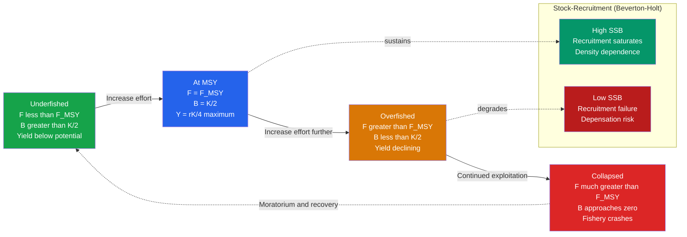

# Marine Fisheries and Ocean Resources

> [!abstract] TL;DR
> The ocean provides roughly half of the animal protein consumed globally, but the mechanisms that govern how much can be harvested sustainably are governed by population dynamics, not politics. **Maximum Sustainable Yield (MSY)** is the largest long-run catch a stock can support, achieved when the population is held at half its unfished carrying capacity. As of FAO 2022, approximately 34% of assessed fish stocks are already overfished and 63% are fished at maximum sustainable limit, leaving only 3% underfished. Beyond wild capture, **aquaculture** now supplies more than half of all seafood consumed, while the deep seabed harbors polymetallic nodules, methane hydrates, and seafloor-mounted renewable energy systems that represent both resources and major conservation concerns.

---

## Intuition

**Analogy:** A fish stock is like a savings account. The principal is the spawning biomass — the reproducing adults. Every year the account pays "interest" in the form of surplus production: new fish born in excess of those needed to replace natural deaths. You can withdraw that interest (your catch) without touching the principal, and the account keeps paying. But the interest rate is not fixed — it is highest when the account is at half its maximum balance (the "sweet spot" where individual growth and reproduction rates are highest relative to population density). If you withdraw more than the interest, you eat into the principal; the account shrinks; it pays less interest next year; and if you keep overdrawn long enough, the account goes bust — the stock collapses.

**Maximum Sustainable Yield** is the maximum interest rate the stock can sustain permanently: it falls out of the logistic growth equation as MSY = rK/4, achieved when biomass B = K/2. Everything to the right of that optimum point is overfishing — you are consuming principal, not just interest.

---

## How It Works

### Logistic Population Model and MSY Derivation

The simplest fisheries model treats biomass B as growing logistically:

$$\frac{dN}{dt} = rN\left(1 - \frac{N}{K}\right)$$

where r is the intrinsic rate of population increase and K is the carrying capacity (unfished equilibrium biomass). The right-hand side — the **surplus production** — is a downward-opening parabola in N, peaking at N = K/2:

$$\text{Surplus production} = rN\left(1-\frac{N}{K}\right) \quad \text{maximised at } N^* = \frac{K}{2}$$

$$\boxed{\text{MSY} = \frac{rK}{4}}$$

This is the maximum catch that can be permanently removed without driving the stock down. Fishing below this level leaves yield on the table; fishing above it draws down biomass until the stock either finds a new (lower) equilibrium or collapses to zero.

### Total Mortality, Fishing Mortality, and Natural Mortality

Fish die two ways: naturally (predation, disease, senescence) at rate M, and from fishing at rate F. The **total instantaneous mortality** is:

$$Z = F + M$$

Population dynamics under fishing: $dN/dt = -ZN$, so the population decays as $N(t) = N_0\,e^{-Zt}$. The fraction surviving to age a is $e^{-Za}$.

Biological overfishing is defined as **F > F_MSY** (fishing mortality exceeding the rate that sustains MSY). Management targets include:

- **F_MSY**: fishing mortality that produces MSY at equilibrium
- **B_MSY = K/2**: biomass at which MSY is achieved
- **F_0.1**: 10% of the slope of the yield-per-recruit curve at the origin — a more conservative proxy for F_MSY
- **B_lim**: biomass below which stock recruitment is impaired (the "red line")

### Schaefer Surplus Production Model

Schaefer (1954, 1957) embedded fishing into the logistic model by writing catch as proportional to both effort E and biomass B:

$$C = qEB \quad \text{(catchability coefficient q)}$$

$$\frac{dB}{dt} = rB\left(1-\frac{B}{K}\right) - qEB$$

At equilibrium ($dB/dt = 0$), biomass settles at:

$$B^* = K\left(1 - \frac{qE}{r}\right)$$

Substituting back gives the **equilibrium yield–effort curve**:

$$\boxed{Y(E) = qEB^* = qEK\left(1 - \frac{qE}{r}\right) = qKE - \frac{q^2K}{r}E^2}$$

This is again a parabola in E. The effort that maximises yield is:

$$E_{\text{MSY}} = \frac{r}{2q}$$

and the resulting maximum sustainable yield is:

$$Y_{\text{MSY}} = \frac{rK}{4}$$

identical to the biological result. For E > E_MSY the stock is overexploited; the yield curve turns down; for E >> E_MSY the stock crashes (B* → 0, Y → 0).

### Beverton-Holt Stock-Recruitment Relationship

The Beverton-Holt (1957) stock-recruitment curve models how spawning-stock biomass (SSB) translates into recruits (age-0 or age-1 fish entering the fishery):

$$R = \frac{\alpha \cdot \text{SSB}}{1 + \beta \cdot \text{SSB}}$$

where α is the slope at the origin (recruits per unit SSB at low stock) and β controls saturation. At high SSB, recruitment saturates due to competition and cannibalism. The curve is **compensatory**: it has a stabilising negative-feedback at high biomass. An alternative form (Ricker 1954) is dome-shaped, allowing overcompensation.

When SSB is pushed very low by overfishing, recruitment may fail not just because fewer eggs are produced, but because behavioural and ecological Allee effects (reduced mating efficiency, schooling disruption) create **depensation** — a positive feedback where low biomass begets lower recruitment, preventing natural recovery.

### Overfishing — Three Definitions

| Type | Definition | Metric |
|------|-----------|--------|
| **Biological overfishing** | F > F_MSY; stock biomass driven below B_MSY | F, B relative to reference points |
| **Economic overfishing** | Effort exceeds the **Maximum Economic Yield (MEY)** level; total costs exceed marginal revenue | Cost-benefit; open-access race to fish |
| **Ecosystem overfishing** | Removal of apex predators or forage fish triggers **trophic cascades** that restructure the entire food web | Multi-species indicators, mean trophic level of catch |

### Global Status (FAO 2022)

- **34.2%** of assessed stocks are overfished (below B_lim)
- **57.3%** are fished at maximum sustainable levels
- **Only 8.4%** are underfished
- **IUU fishing** (illegal, unreported, unregulated) adds an estimated 11–26 million tonnes per year — up to 20% of global landings — that evade all management
- **Bycatch and discards**: up to 40% of global catch is non-target species or undersized fish thrown back dead; bottom trawls destroy benthic habitat at rates equivalent to clear-cutting large areas of seabed per year

### Stock Collapse Case Studies

**Grand Banks cod (Newfoundland, 1992).** The northwest Atlantic cod had supported a fishery for 500 years. By the 1980s, advances in trawl technology, satellite navigation, and fish-finding sonar allowed fishing effort to massively exceed sustainable levels while stock assessments underestimated the severity of depletion. In 1992 the Canadian government imposed a total moratorium; the catch dropped from ~800,000 t/year to near zero overnight. The cod stock has never recovered to commercial levels, partly because the ecosystem shifted to a new stable state dominated by shrimp and crab (a predator-release cascade).

**Pacific sardine (California, 1940s).** A combination of a multi-decadal cold-phase Pacific Decadal Oscillation (PDO) that reduced sardine productivity and industrial purse-seine fishing collapsed the California sardine fishery from ~700,000 t in 1936 to near zero by the late 1940s. Canneries immortalised by Steinbeck's *Cannery Row* closed. The lesson: ignoring climate variability when setting catch limits leads to catastrophe even at seemingly "sustainable" effort levels.

### Aquaculture

Aquaculture crossed a historic milestone around 2012: it now contributes **more than 50% of seafood destined for human consumption** (FAO 2022). Major systems include:

- **Atlantic salmon** (Salmo salar) cage culture — Norway alone produces ~1.4 million t/year; dominant global supplier
- **Whiteleg shrimp** (Litopenaeus vannamei) — ponds across Southeast Asia; world's most valuable aquaculture species
- **Bivalves** (oysters, mussels, clams) — filter feeders that require no feed inputs; net-positive for local water quality
- **Tilapia and carp** — freshwater pond aquaculture, dominant in China, feeding 1 billion+ people

Environmental concerns: nutrient and waste discharge causing localised hypoxia, escaped farmed fish interbreeding with and outcompeting wild stocks, spread of sea lice (*Lepeophtheirus salmonis*) to wild salmon in adjacent waters, land clearing for shrimp ponds destroying mangroves.

### Non-Living Ocean Resources

| Resource | Location | Status |
|----------|---------|--------|
| **Polymetallic nodules** | Abyssal plains, 4,000–6,000 m | Rich in Mn, Ni, Co, Cu; commercial mining trials underway; ISA regulating |
| **Cobalt-rich ferromanganese crusts** | Seamount flanks | High Co, Ni, Te; no commercial production yet |
| **Seafloor massive sulfides** | Hydrothermal vents | Cu, Zn, Pb, Au, Ag; biodiversity hotspot conflict |
| **Methane hydrates** | Continental slopes, 300–2,000 m | Vast energy resource; extraction risks slope instability and methane release |
| **Offshore wind** | Continental shelves ≤ 60 m (fixed); deeper (floating) | Rapid expansion; potential conflict with fishing grounds |
| **Wave and tidal energy** | Coastal and estuarine | Pre-commercial; tidal lagoons at Swansea Bay, MeyGen in Scotland |

### Mermaid Diagram



---

## Key Concepts / Details

### Secondary Level

- **Overfishing means catching fish faster than they can reproduce.** When fishing mortality F exceeds the rate at which surplus production replaces it, the stock shrinks year by year until the fishery is no longer viable. The 1992 Grand Banks cod moratorium is the most famous example: a fishery worth billions collapsed to nothing in a few years.
- **MSY is the maximum "interest" the stock can pay.** It equals rK/4 — one quarter of the product of the growth rate and the carrying capacity. The key insight is that you want to keep the stock at half its unfished size, where productivity per fish is highest.
- **Trawl nets drag along the seafloor, bulldozing benthic habitat.** Bottom trawling physically destroys the sponges, corals, and tube worms that provide structure for juvenile fish. A single trawl pass can remove decades of habitat development in minutes.
- **Aquaculture now supplies more seafood than wild catch.** Salmon farms in Norwegian fjords, shrimp ponds in Vietnam, oyster rafts in Brittany — farmed seafood has transformed food supply but brings its own environmental pressures.

### Undergraduate Level

**Logistic growth and MSY derivation.** Starting from dN/dt = rN(1 − N/K), the maximum of the right-hand side occurs at N = K/2 (set derivative with respect to N equal to zero). The value at that maximum is MSY = r(K/2)(1 − 1/2) = rK/4. This tells a manager: fish hard enough to hold the population at K/2 and you extract the maximum sustainable catch.

**Yield-per-recruit (Beverton-Holt, 1957).** Rather than modelling total biomass, YPR analysis tracks a single cohort from recruitment through its lifetime, integrating the product of numbers surviving, individual weight, and fishing mortality across ages. YPR peaks at an intermediate level of fishing effort and at an intermediate age of first capture — taking fish too young squanders weight they would have gained; taking them too old wastes them to natural mortality. F_0.1 (the effort at which 10% of the initial slope of the YPR curve is met) is a widely used conservative reference point.

**Virtual Population Analysis (VPA).** VPA reconstructs historical stock size from catch-at-age data by working backwards through time. If you know how many 5-year-old fish were caught and what fraction survived to age 6, you can estimate how many 5-year-olds there must have been to generate that catch. The method requires terminal estimates of F (uncertain) and is sensitive to errors in the oldest age classes, creating substantial retrospective uncertainty in stock assessments.

**Reference points: B_MSY, F_MSY, B_lim, F_lim.** ICES (International Council for the Exploration of the Sea) and NOAA both use a two-dimensional traffic-light system: biomass relative to B_MSY (x-axis) and fishing mortality relative to F_MSY (y-axis) divide the state space into four quadrants. Only the upper-right quadrant (high B, low F) is truly safe. Harvest control rules automatically reduce F as B declines toward B_lim.

**IUU fishing.** Illegal, unreported, and unregulated fishing is estimated at 11–26 million tonnes per year globally (MRAG, 2014), representing up to USD 23 billion in lost economic value. It concentrates in areas with weak governance (West Africa, parts of the South Pacific and Arctic). Flag-of-convenience vessels, corruption in port inspections, and the difficulty of satellite surveillance of the high seas all contribute.

### Graduate Level

**Ecosystem-based fisheries management (EBM).** Single-species MSY ignores the fact that fish are embedded in food webs. Removing a forage species (anchovies, capelin, herring) not only affects that stock but also starves seabirds, marine mammals, and larger fish that depend on it as prey. EBM explicitly accounts for trophic interactions, sets multi-species harvest limits, and considers habitat and climate effects. The transition from single-species to EBM is legislatively mandated in the US (Magnuson-Stevens Fishery Conservation and Management Act, 2006 reauthorisation) but remains difficult to implement operationally.

**Multi-species models: MSVPA and Ecopath/Ecosim.** Multi-Species Virtual Population Analysis (MSVPA) extends the VPA framework by estimating predation mortality M2 from stomach content data and species interactions, rather than treating M as fixed. Ecopath (Polovina 1984; Christensen & Walters 2004) is a mass-balance model of the entire food web; its dynamic extension Ecosim simulates temporal responses to fishing or climate forcing. Ecopath has been applied to >400 ecosystems worldwide and is the dominant tool for EBM scenario analysis.

**Climate change impacts on fisheries.** Ocean warming drives poleward range shifts of ~72 km per decade (Cheung et al. 2013). Species like Atlantic cod, which is near its thermal tolerance limit in the North Sea, experience reduced recruitment success during warm years. Acidification impairs calcification in juvenile bivalves and echinoderm larvae. Deoxygenation compresses the depth range of commercially important midwater species. These effects mean historical F_MSY estimates calculated under past climatic conditions may be systematically too high for a warmer future ocean.

**Rights-based management and individual transferable quotas (ITQs).** Open-access fisheries suffer the "tragedy of the commons": individual fishers race to catch fish before competitors do, even when collective restraint would yield higher total value. ITQs assign each vessel a property right — a percentage share of the total allowable catch (TAC). Holders can fish their quota, lease it, or sell it, creating economic efficiency. New Zealand (1986) and Iceland adopted ITQ systems early; evidence shows they reduced overcapacity and improved profitability, but critics note that quota consolidation can concentrate ownership and displace small-scale fishing communities.

**Bioeconomic models and MEY.** The Maximum Economic Yield occurs at lower effort than MSY because beyond MEY, marginal costs exceed marginal revenue. Clark's (1976) bioeconomic model shows that under a pure open-access equilibrium, effort expands until all resource rent is dissipated (rent = 0). Optimal management therefore targets effort between MEY and MSY, not MSY itself. Private discount rates push optimal fishing effort toward open-access outcomes when future fish stocks are valued less than present cash.

**Deep-sea fisheries sustainability.** Deep-sea species (orange roughy, grenadier, alfonsino) can live 100–200+ years and do not reach sexual maturity until age 20–30. Their intrinsic r is orders of magnitude lower than shallow-water targets, making their effective MSY tiny. The orange roughy fishery off New Zealand collapsed within 15 years of discovery; assessments had assumed productivity similar to shallow-water fish. Deep-sea bottom trawling also destroys cold-water coral ecosystems (Lophelia pertusa) that are thousands of years old and cannot recover on human timescales.

---

## Python Demo

```python
# Schaefer surplus production model simulation
# dB/dt = rB(1 - B/K) - qEB
# Equilibrium yield: Y(E) = qEK(1 - qE/r)
# Find MSY, simulate stock trajectories under different effort levels

import numpy as np
from scipy.integrate import solve_ivp
import matplotlib.pyplot as plt

# ---- Model parameters ----
r = 0.4          # intrinsic growth rate [yr^-1]
K = 1000.0       # carrying capacity [tonnes]
q = 0.0002       # catchability coefficient [effort^-1]
B0 = K           # initial biomass (unfished)

# ---- Analytical equilibrium yield curve ----
E_max = r / q    # effort at which stock is driven to zero
E_vals = np.linspace(0, E_max * 0.99, 500)
Y_eq = q * E_vals * K * (1.0 - (q * E_vals) / r)  # parabola

# MSY and corresponding effort, biomass
E_MSY = r / (2.0 * q)
B_MSY = K / 2.0
Y_MSY = r * K / 4.0

print(f"E_MSY = {E_MSY:.1f} effort units")
print(f"B_MSY = {B_MSY:.1f} tonnes  (= K/2)")
print(f"Y_MSY = {Y_MSY:.1f} tonnes/yr  (= rK/4)")

# ---- Simulate stock dynamics under constant effort ----
def schaefer(t, B, r, K, q, E):
    B = max(B, 0.0)
    dBdt = r * B * (1.0 - B / K) - q * E * B
    return [dBdt]

t_span = (0, 80)
t_eval = np.linspace(0, 80, 800)

effort_scenarios = {
    "Sustainable  (E = 0.5 * E_MSY)":  0.5 * E_MSY,
    "At MSY       (E = E_MSY)":         E_MSY,
    "Overfished   (E = 1.6 * E_MSY)":  1.6 * E_MSY,
    "Collapsed    (E = 2.5 * E_MSY)":  2.5 * E_MSY,
}
colors = ["#16a34a", "#2563eb", "#d97706", "#dc2626"]

fig, axes = plt.subplots(1, 2, figsize=(13, 5))

# --- Left: Yield-effort curve ---
ax = axes[0]
ax.plot(E_vals, Y_eq, "k-", lw=2.5, label="Equilibrium yield Y(E)")
ax.axvline(E_MSY, color="#2563eb", ls="--", lw=1.5, label=f"E_MSY = {E_MSY:.0f}")
ax.axhline(Y_MSY, color="#2563eb", ls=":", lw=1.5, label=f"MSY = {Y_MSY:.0f} t/yr")
ax.fill_between(E_vals[E_vals <= E_MSY], Y_eq[E_vals <= E_MSY],
                alpha=0.15, color="#16a34a", label="Underfished zone")
ax.fill_between(E_vals[E_vals >= E_MSY], Y_eq[E_vals >= E_MSY],
                alpha=0.15, color="#dc2626", label="Overfished zone")
for (label, E_sc), col in zip(effort_scenarios.items(), colors):
    ax.axvline(E_sc, color=col, ls="-", lw=1.0, alpha=0.7)
ax.set_xlabel("Fishing effort E")
ax.set_ylabel("Equilibrium yield Y (tonnes/yr)")
ax.set_title("Schaefer Yield–Effort Curve")
ax.legend(fontsize=8)
ax.grid(alpha=0.3)

# --- Right: Stock biomass trajectories over time ---
ax = axes[1]
for (label, E_sc), col in zip(effort_scenarios.items(), colors):
    sol = solve_ivp(schaefer, t_span, [B0], args=(r, K, q, E_sc),
                   t_eval=t_eval, method="RK45", rtol=1e-8)
    ax.plot(sol.t, sol.y[0], color=col, lw=2, label=label)

ax.axhline(B_MSY, color="#2563eb", ls="--", lw=1.5, alpha=0.6,
           label=f"B_MSY = K/2 = {B_MSY:.0f} t")
ax.axhline(K, color="#6b7280", ls=":", lw=1.2, alpha=0.6, label=f"K = {K:.0f} t")
ax.set_xlabel("Time (years)")
ax.set_ylabel("Stock biomass B (tonnes)")
ax.set_title("Stock Dynamics under Constant Effort")
ax.legend(fontsize=7.5)
ax.set_ylim(-20, K * 1.05)
ax.grid(alpha=0.3)

plt.suptitle("Schaefer Surplus Production Model: r=0.40, K=1000 t, q=0.0002",
             fontsize=11)
plt.tight_layout()
plt.savefig("schaefer_model.png", dpi=120, bbox_inches="tight")
plt.show()
```

**Reading the output.** The yield–effort parabola peaks at E_MSY = 1000 effort units; fishing to the left is leaving yield uncaptured; fishing to the right erodes the stock below B_MSY = 500 t, so the stock produces less surplus each year. The trajectory plot shows that at E = 2.5 × E_MSY the stock crashes to near zero within ~30 years — the classic overfishing collapse — while at E = 0.5 × E_MSY the stock stabilises at B = 750 t (three-quarters of carrying capacity) with a modest but indefinitely sustainable yield.

---

## Real-World Notes

**Peru anchovy collapse (1972).** In 1972 the anchovy catch off Peru — the world's largest single-species fishery at ~12 million t/year — crashed in a single season. The proximate trigger was an exceptionally strong El Nino that warmed the sea surface, depressed the thermocline, and shut down the Humboldt upwelling system that underpins the fishery's productivity. But the stock had already been systematically overfished through the late 1960s as the Peruvian government, flush with foreign exchange earnings, failed to constrain fleet expansion. The collapse demonstrated that natural climate variability and human overexploitation are not independent risks: a stock fished near its limit has no resilience to absorb an environmental shock.

**Alaskan pollock (Theragra chalcogramma).** The Eastern Bering Sea pollock fishery is the world's largest by volume at ~1.5 million t/year, generating the fish used in McDonald's Filet-O-Fish and most commercial fish sticks. It is also one of the few large-scale fisheries consistently regarded as sustainably managed. Rigorous stock assessments, precautionary reference points, real-time At-Sea Observer coverage, and a system of community development quotas (CDQs) allocating 10% of the TAC to Western Alaska coastal communities have kept fishing mortality below F_MSY for three consecutive decades.

**Atlantic bluefin tuna (Thunnus thynnis).** Bluefin tuna are slow to mature (age 8–12 years), extremely long-lived (40+ years), and fetch up to USD 40,000 per individual at Tokyo's Toyosu market. These economics created intense fishing pressure well beyond sustainable levels throughout the late 20th century. The western Atlantic stock declined by ~90% from historical baselines. ICCAT (International Commission for the Conservation of Atlantic Tunas) was long ridiculed as the "International Conspiracy to Catch All Tunas" for setting TACs above scientific advice; after dramatically increased quotas were cut in 2010–2012, western Atlantic stocks have partially recovered, illustrating that recovery is possible but requires sustained political will against powerful commercial interests.

**Norwegian Atlantic salmon aquaculture.** Norway produces ~1.4 million tonnes of farmed Atlantic salmon per year, roughly 65% of global supply, generating NOK 80+ billion in export value. The industry operates in open-net sea cages in Norwegian fjords. Sea lice infestations in cage fish spill into adjacent wild salmon and sea trout populations, reducing their survival. Escaped farmed salmon (estimated millions per year from all Atlantic-rim countries) interbreed with wild populations, reducing their genetic fitness. Norway has imposed traffic-light regulation since 2017: if wild salmonid louse counts exceed thresholds, production licenses in that region are cut by 6%; if below threshold, licenses can expand by 6%.

**Georges Bank and offshore wind.** The New England fisheries council has raised concerns that proposed offshore wind development on Georges Bank — historically one of the world's great fishing grounds — will displace fishing effort, damage trawl gear on foundations, and alter bottom currents and sediment transport in ways that may change benthic habitat. The Bureau of Ocean Energy Management (BOEM) conducted environmental impact assessments noting that turbine foundations act as artificial reefs, potentially increasing local fish biomass. The conflict between the blue economy's two largest sectors — fishing and wind energy — is unresolved and politically contentious in both the US and EU.

---

## Common Pitfalls

- **Treating MSY as a fixed, reliable target.** MSY is derived from a simple logistic model with two fixed parameters (r and K) that in reality vary with climate, ocean productivity cycles, and ecosystem state. Using a single historical estimate of F_MSY as a permanent harvest target ignores the fact that the productivity regime may have shifted. Under climate change, r for many cold-water species is declining; using historical F_MSY will systematically overfish a stock whose carrying capacity is shrinking.

- **Assuming aquaculture is environmentally benign.** The narrative that aquaculture "relieves pressure on wild stocks" is partially true for filter feeders (bivalves) and omnivores (tilapia, carp), but salmon aquaculture requires large quantities of fishmeal and fish oil derived from wild forage fisheries (anchovies, herring, sand lance), creating an indirect wild-capture burden. Open-net cage aquaculture also discharges significant quantities of nitrogen and phosphorus, causing localised benthic hypoxia. The environmental footprint of aquaculture is species- and production-system-specific and cannot be generalised.

- **Ignoring uncertainty in stock assessments.** ICES and NOAA stock assessments routinely carry 30–50% uncertainty bands around biomass estimates, with some assessments carrying over 100% uncertainty on historic spawning stock biomass. Managers and policymakers sometimes act on point estimates as if they were precise, setting TACs that assume biomass is at the centre of the uncertainty range. A precautionary approach requires choosing harvest rates based on the lower bound of biomass estimates, not the central estimate — precisely the opposite of what economic incentives push toward.

- **Conflating the Beverton-Holt relationship with the Ricker relationship.** Beverton-Holt recruitment is monotonically increasing and saturating; Ricker recruitment is dome-shaped, declining at high SSB due to cannibalism or egg predation. Applying a Beverton-Holt functional form to a stock whose biology follows Ricker dynamics will underestimate the risk of depensation at low population sizes and give falsely optimistic recovery projections.

- **Neglecting discards in catch statistics.** Official FAO catch statistics report landed catches. Discards — bycatch thrown overboard, often dead — may equal 10–40% of targeted catch in some trawl fisheries. Using landed catch as the sole measure of fishing impact substantially underestimates total fishing mortality, leading to optimistic stock assessments. The EU Landing Obligation (2019) was partly designed to make discards visible in official statistics, forcing quota systems to account for total mortality rather than just retained landings.

---

## Related Concepts

- [[Zooplankton_and_Marine_Food_Webs]] — fish populations are embedded in food webs; MSY calculations that ignore predator-prey dynamics miss trophic cascades that can destabilise "sustainably managed" stocks.
- [[Ekman_Transport_and_Coastal_Upwelling]] — the physical mechanism that delivers deep nutrients to the euphotic zone, underpinning the extraordinary productivity of the world's most important commercial fisheries (Peru, California, Benguela, Canary).
- [[Harmful_Algal_Blooms_and_Dead_Zones]] — eutrophication from agricultural runoff and aquaculture waste drives hypoxic dead zones that directly kill fish and shellfish populations in coastal fishery zones.
- [[Ocean_Atmosphere_Coupling_and_ENSO]] — ENSO is the dominant source of interannual variability in fishery productivity; the 1972 Peru anchovy collapse and recurring California sardine cycles are direct consequences of ENSO-driven changes in upwelling and primary production.
- [[_MOC_Biological_Oceanography]] — the section map for all biological oceanography notes in this vault.
- [[_MOC_Meteorology_Master]] — entry point for climate system notes including ENSO teleconnections that drive multi-year fishery productivity cycles.

---

## Review Questions

### Secondary Level

1. Explain the "savings account" analogy for a fish stock. What does the "principal" represent, and what happens if you consistently withdraw more than the "interest"?
2. The Grand Banks cod fishery operated for 500 years but collapsed in the 1990s. What combination of technological and management failures made this possible, and why has the stock not recovered 30 years after the moratorium?
3. A fishing nation argues that switching from wild-capture to aquaculture will save the oceans. Identify two specific cases where this argument holds and two where it does not, explaining why.

### Undergraduate Level

1. Derive the Schaefer equilibrium yield–effort relationship Y(E) = qKE(1 − qE/r) starting from the logistic surplus production model. Show that E_MSY = r/(2q) and Y_MSY = rK/4, and explain graphically why fishing beyond E_MSY reduces yield even though effort is higher.
2. Compare Beverton-Holt and Ricker stock-recruitment curves. Under what biological circumstances does each apply, and what are the management implications of choosing the wrong functional form when a stock has declined to low biomass?
3. A fisheries assessment estimates that biomass B = 0.45 × B_MSY and current fishing mortality F = 1.3 × F_MSY. Plot the position of this stock on the ICES Kobe plot, identify which category it falls in, and recommend an appropriate management response using harvest control rule logic.

### Graduate Level

1. Single-species MSY implicitly assumes that natural mortality M is constant and independent of ecosystem state. Under an Ecopath/Ecosim multi-species framework, how would you modify the MSY calculation to account for predation mortality M2 that varies with predator abundance, and what new equilibria or instabilities might emerge?
2. Individual transferable quota (ITQ) systems in New Zealand and Iceland are cited as economic successes — they reduced fleet overcapacity and increased profitability. However, critics argue they created social harms. Construct a bioeconomic argument for why ITQs, if not accompanied by community quotas or buyback programmes, may achieve optimal harvesting at the aggregate level while concentrating the rents in a way that undermines small-scale fishing communities.
3. Climate change is shifting the geographic ranges of commercial fish stocks poleward at ~72 km per decade. How does this interact with existing quota allocation systems (which assign national quotas based on historical stock distributions), and what governance mechanisms would you propose to manage transboundary stock shifts between neighbouring EEZs?

---

## Sources

- [Beverton, R. J. H. & Holt, S. J. (1957) — *On the Dynamics of Exploited Fish Populations*. Fishery Investigations Series II, Vol. XIX. HMSO, London.](https://www.google.com/search?q=Beverton+Holt+1957+Dynamics+Exploited+Fish+Populations)
- [Schaefer, M. B. (1954) — Some aspects of the dynamics of populations important to the management of commercial marine fisheries. *Bulletin of the Inter-American Tropical Tuna Commission*, 1(2), 25–56.](https://repository.library.noaa.gov/view/noaa/3193)
- [Schaefer, M. B. (1957) — A study of the dynamics of the fishery for yellowfin tuna in the eastern tropical Pacific Ocean. *Bulletin of the Inter-American Tropical Tuna Commission*, 2(6), 247–268.](https://repository.library.noaa.gov/view/noaa/3193)
- [FAO (2022) — *The State of World Fisheries and Aquaculture 2022*. Food and Agriculture Organization of the United Nations, Rome.](https://www.fao.org/3/cc0461en/cc0461en.pdf)
- [Pauly, D., Christensen, V., Dalsgaard, J., Froese, R. & Torres, F. Jr. (1998) — Fishing down marine food webs. *Science*, 279(5352), 860–863.](https://doi.org/10.1126/science.279.5352.860)
- [Christensen, V. & Walters, C. J. (2004) — Ecopath with Ecosim: methods, capabilities and limitations. *Ecological Modelling*, 172(2–4), 109–139.](https://doi.org/10.1016/j.ecolmodel.2003.09.003)
- [Clark, C. W. (1976) — *Mathematical Bioeconomics: The Optimal Management of Renewable Resources*. Wiley-Interscience, New York.](https://onlinelibrary.wiley.com/doi/book/10.1002/9780470022450)

---

#Oceanography #BiologicalOceanography #MarineFisheries #MaximumSustainableYield #Overfishing
