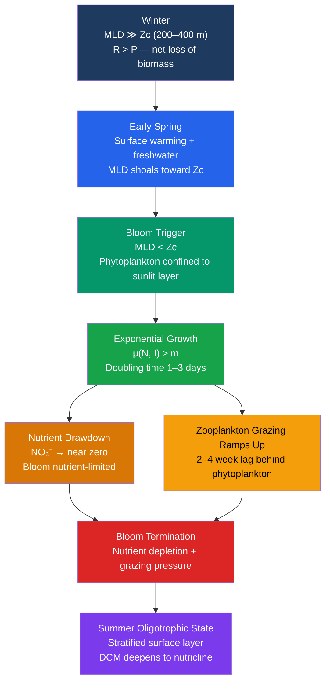

# Marine Primary Production and Phytoplankton

> [!abstract] TL;DR
> Phytoplankton — microscopic algae and cyanobacteria drifting in the sunlit upper ocean — perform roughly half of all photosynthesis on Earth, fixing ~50 GtC per year and producing approximately half of atmospheric oxygen. Their productivity is governed by the co-availability of light (which exists only within the euphotic zone, the top ~200 m) and inorganic nutrients (nitrate, phosphate, silicic acid, iron), which are consumed at the surface and replenished by mixing and upwelling from depth. The dramatic seasonal **spring bloom** — a rapid, month-scale pulse of phytoplankton growth — is triggered when the mixed layer shoals above Sverdrup's **critical depth**: the depth at which depth-integrated photosynthesis exactly equals depth-integrated respiration. Global satellite ocean-color sensors (MODIS, SeaWiFS, PACE) track phytoplankton abundance through chlorophyll a concentrations, providing a continuous planet-scale window onto ocean productivity, carbon cycling, and climate feedbacks.

---

## Intuition

**Analogy:** Marine primary production is like a solar farm floating at the ocean surface — phytoplankton are the solar panels, sunlight and dissolved nutrients are the fuel inputs, and the organic carbon produced powers almost all ocean life above them. The farm operates only as long as the solar panels stay in the sunlit zone. In winter, vigorous storms mix the water column hundreds of metres deep, carrying phytoplankton far below where any useful light can reach — the panels are buried underground and the farm shuts down. In spring, as the sun strengthens and winds ease, the surface warms and freshwater from snowmelt lightens the top layer, creating a buoyant cap that traps the phytoplankton in the sunlit surface. The farm switches on and output explodes in days.

Harald Sverdrup (1953) formalised exactly this intuition: there is a **critical depth Zc** at which the column-averaged photosynthesis rate equals the column-averaged respiration rate. When the **mixed layer depth (MLD)** drops below Zc, phytoplankton averaged through the mixed layer receive net positive light energy — the spring bloom begins. When MLD exceeds Zc, respiration costs exceed photosynthetic gain and populations decline regardless of how much nutrient is available.

---

## How It Works

### Core Mechanics

**1. Photosynthesis**

The fundamental chemical reaction of phytoplankton (oxygenic photosynthesis):

$$6\text{CO}_2 + 6\text{H}_2\text{O} + h\nu \;\rightarrow\; \text{C}_6\text{H}_{12}\text{O}_6 + 6\text{O}_2$$

Light energy (*hν*) drives the conversion of inorganic carbon and water into biomass and oxygen. In practice, phytoplankton fix carbon as carbohydrates, lipids, and proteins, not pure glucose; the stoichiometry above is a useful summary.

**2. The P-I Curve (Photosynthesis-Irradiance Response)**

The Jassby-Platt (1976) formulation describes how gross photosynthesis rate $P$ varies with irradiance $I$:

$$P(I) = P_{max} \cdot \tanh\!\left(\frac{I}{I_k}\right)$$

| Parameter | Symbol | Typical Range | Meaning |
|---|---|---|---|
| Maximum photosynthesis | $P_{max}$ | 1–20 mgC mgChl⁻¹ hr⁻¹ | Light-saturated rate |
| Light saturation parameter | $I_k = P_{max}/\alpha$ | 50–300 µmol photons m⁻² s⁻¹ | Irradiance at which P = 0.76 Pmax |
| Initial slope | $\alpha$ | 0.01–0.10 mgC mgChl⁻¹ hr⁻¹ per µmol m⁻² s⁻¹ | Photosynthetic efficiency |
| Compensation irradiance | $I_c = R \cdot I_k / P_{max}$ | 5–20 µmol photons m⁻² s⁻¹ | Irradiance where P = R (net production = 0) |

At low $I$ (deep in the water column): $P \approx \alpha \cdot I$ — photosynthesis is linear, light-limited.
At high $I$ (near the surface): $P \to P_{max}$ — light-saturated; adding more light does not help.
At very high $I$ (surface on clear days): photoinhibition can reduce $P$ below $P_{max}$.

**3. Sverdrup Critical Depth**

Assume:
- Irradiance decays exponentially: $I(z) = I_0 \cdot e^{-K_d z}$
- A well-mixed water column (uniform phytoplankton and uniform $R$)
- Linear approximation of the P-I curve at low light

Integrating gross production and respiration over a mixed layer of depth $H$:

$$\bar{P}(H) = \frac{1}{H} \int_0^H P_{max} \cdot \tanh\!\left(\frac{I_0 e^{-K_d z}}{I_k}\right) dz \;\approx\; \frac{P_{max} \cdot I_0}{H \cdot I_k \cdot K_d} \left(1 - e^{-K_d H}\right)$$

Setting $\bar{P}(Z_c) = R$ (community respiration per unit volume, assumed constant) and using the definition $I_c = R \cdot I_k / P_{max}$:

$$\boxed{Z_c = \frac{1}{K_d} \ln\!\left(\frac{I_0}{I_c}\right)}$$

This is the depth at which the compensation irradiance $I_c$ is reached. **Bloom initiates when MLD < Zc**, because phytoplankton mixed throughout a shallower-than-critical layer receive on average more light than they need to offset respiration.

Typical values: $I_0 \approx 200$ µmol photons m⁻² s⁻¹ (spring mean), $I_c \approx 10$ µmol m⁻² s⁻¹, $K_d \approx 0.05$ m⁻¹ → Zc ≈ 60 m.

**4. Spring Bloom Trigger and Seasonal Cycle**

| Season | MLD vs Zc | Outcome |
|---|---|---|
| Winter | MLD ≫ Zc (MLD 200–400 m) | Phytoplankton diluted below light zone; R > P; biomass declines |
| Early Spring | MLD ≈ Zc (MLD shoaling) | Critical threshold; bloom can initiate in stratified patches |
| Spring Bloom | MLD ≪ Zc (MLD 20–50 m) | Exponential growth; nutrient drawdown; doubling time 1–3 days |
| Summer | MLD ≪ Zc but nutrients exhausted | Nutrient-limited; deep chlorophyll maximum (DCM) forms at nutricline |
| Autumn | Winds deepen MLD again | Brief autumn bloom if nutrients mixed up before MLD exceeds Zc |

**5. Net vs. Gross Primary Production**

$$\text{Gross PP} \;=\; \text{total photosynthesis (all carbon fixed)}$$
$$\text{NPP} \;=\; \text{Gross PP} - \text{Phytoplankton respiration}$$
$$\text{Net Community Production (NCP)} \;=\; \text{NPP} - \text{Zooplankton grazing and microbial respiration}$$

Global ocean NPP: **~50 GtC yr⁻¹** ≈ 50% of total Earth primary production (terrestrial NPP ~50–60 GtC yr⁻¹).

**6. Major Phytoplankton Groups**

| Group | Key Feature | Habitat | Export Role |
|---|---|---|---|
| Diatoms (*Bacillariophyceae*) | Biogenic silica frustule (SiO₂·nH₂O) | Cold, nutrient-rich; spring blooms | High — large, dense, fast-sinking |
| Coccolithophores (*Prymnesiophyceae*) | Calcite coccolith plates; *Emiliania huxleyi* | Subtropical, stratified | Moderate — CaCO₃ ballast |
| Cyanobacteria (*Prochlorococcus*, *Synechococcus*, *Trichodesmium*) | Tiny cells 0.5–2 µm; N₂ fixers | Oligotrophic open ocean | Low — recycled in microbial loop |
| Dinoflagellates | Cellulose theca; mixotrophic; toxic HABs | Stratified coastal water | Low–moderate |
| Green algae (*Chlorophyta*) | Chlorophyll b; freshwater-brackish | Coastal, estuarine | Variable |

**7. Redfield Ratio and Nutrient Stoichiometry**

Alfred Redfield (1934) observed that phytoplankton consume inorganic nutrients in a fixed atomic ratio:

$$\underbrace{C:N:P = 106:16:1}_{\text{Redfield Ratio}}$$

equivalent to removing 16 moles of $\text{NO}_3^-$ and 1 mole of $\text{PO}_4^{3-}$ for every 106 moles of $\text{CO}_2$ fixed. A complete spring bloom can draw surface nitrate from ~12 µmol kg⁻¹ to near zero (< 0.1 µmol kg⁻¹) within 3–6 weeks, terminating growth in the absence of new supply.

---

### Flow / Architecture



---

## Key Concepts / Details

### Secondary Level

**Phytoplankton = ocean grass.** Just as grasses form the base of most terrestrial food webs, phytoplankton form the base of nearly all marine food webs. Remove them and the ocean's fish, whales, and seabirds collapse — everything from zooplankton to blue whales ultimately traces its energy back to phytoplankton.

**Half of Earth's oxygen.** Every second breath you take was produced by ocean phytoplankton. The marine contribution (~50%) is not steady — it pulses with spring blooms, shifts with climate, and is entirely invisible unless you look at the ocean from space.

**Spring bloom.** In temperate and polar seas, phytoplankton populations grow explosively in spring, increasing a hundredfold or more in a few weeks. The bloom is visible from satellite as a sweeping wave of green ocean color moving poleward each year — one of the most striking biological patterns on Earth.

**Satellite chlorophyll.** Phytoplankton contain the green pigment chlorophyll a. When they are abundant, the ocean surface appears green rather than blue. Satellites measure this color shift and use it to estimate chlorophyll concentration (mg m⁻³), which serves as a proxy for phytoplankton biomass. High chlorophyll = green ocean; low chlorophyll = deep blue.

**The euphotic zone.** Photosynthesis requires light. Below ~200 m, even the clearest ocean is too dark for net photosynthesis. This "euphotic zone" is the engine room of ocean productivity; everything below it runs on organic carbon raining down from above.

---

### Undergraduate Level

**P-I curve in detail.** The Jassby-Platt $\tanh$ formulation $P(I) = P_{max} \tanh(I/I_k)$ captures three regimes:
1. **Linear phase** ($I \ll I_k$): slope $\alpha = P_{max}/I_k$ (units: mgC mgChl⁻¹ hr⁻¹ per µmol m⁻² s⁻¹)
2. **Saturation** ($I \approx I_k$): P = 0.76 $P_{max}$
3. **Photoinhibition** (not in this model): at very high $I$, reactive oxygen species damage photosystems and $P$ declines below $P_{max}$

Chlorophyll a is a state variable, not a rate. "High chlorophyll" means high phytoplankton biomass, not necessarily high photosynthesis rate. Productivity = biomass × specific growth rate; both must be high for high NPP.

**Sverdrup (1953) critical depth derivation.** The key insight is that a phytoplankton cell mixed throughout a deep winter mixed layer spends most of its time in darkness. Sverdrup showed that the **average irradiance available** over the mixed layer is:

$$\bar{I}(H) = \frac{I_0}{K_d \cdot H}\left(1 - e^{-K_d H}\right)$$

and that there is a critical H (= Zc) at which the average exceeds the compensation irradiance $I_c$. Below $I_c$, phytoplankton respire more than they fix. The critical depth is:

$$Z_c = \frac{1}{K_d} \ln\!\left(\frac{I_0}{I_c}\right)$$

**Mixed layer depth control on bloom timing.** Bloom timing varies with latitude and year:
- Low latitudes (~10–30°N/S): no deep winter mixing → no spring bloom; oligotrophic gyres year-round
- Mid-latitudes (~30–60°N/S): clear seasonal cycle; bloom in March–May (NH) or Sept–Nov (SH)
- High latitudes (>60°N/S): bloom limited by both light (polar night) and ice cover; short summer window

**Chlorophyll a as a biomass proxy.** Chl a (mg m⁻³) is measured by:
- *In situ*: fluorometers (active fluorescence) or HPLC extraction (most accurate)
- *Satellite*: ratio of water-leaving radiance at 443 nm (blue absorbed by Chl) to 555 nm (green); OC4v6 polynomial algorithm; validated to ±30% in open ocean, worse in coastal Case 2 waters

**Satellite ocean-color (MODIS/SeaWiFS/PACE).** The VGPM (Vertically Generalized Production Model, Behrenfeld & Falkowski 1997) integrates Chl, SST, PAR, and euphotic depth to compute NPP globally at 9 km resolution. The algorithm:
$$\text{NPP}_{depth} = 0.66125 \cdot P^B_{opt} \cdot \frac{I_{rr}}{I_{rr}+4.1} \cdot Z_{eu} \cdot C_{sat} \cdot \text{DL}$$
where $P^B_{opt}$ (optimal photosynthetic rate) is a function of SST, $Z_{eu} = 4.6/K_d$ is the euphotic depth, $C_{sat}$ is surface Chl, and DL is day length.

---

### Graduate Level

**Dilution-recoupling hypothesis (Behrenfeld 2010).** Sverdrup's critical depth requires a sharp MLD shoaling event, but blooms often begin in winter or early spring before stratification. Behrenfeld proposed that as the mixed layer deepens in autumn and winter, phytoplankton and their grazers are **diluted** apart at similar rates, reducing grazing mortality relative to growth. The bloom is initiated not by light availability crossing a threshold, but by the **decoupling of growth and loss rates** during mixed-layer deepening and subsequent shoaling. This reframes the bloom as a year-round process whose *net accumulation* is controlled by predator-prey dynamics, not just physics.

**Size structure and carbon export efficiency.** Phytoplankton span 3–4 orders of magnitude in size (0.5 µm *Prochlorococcus* to 2000 µm chain diatoms). Cell size determines fate:
- **Large cells (diatoms, 10–200 µm):** fast sinking velocity ($w_s \propto r^2$, Stokes), aggregate into marine snow, export efficiently to depth → **high biological pump efficiency**
- **Small cells (pico-phytoplankton, 0.5–2 µm):** grazed by protists, biomass recycled in the microbial loop → **low export efficiency**
High-nutrient blooms dominated by diatoms typically export 20–30% of NPP to depth; oligotrophic pico-phytoplankton ecosystems export < 5%. This size-export relationship is key to modeling the **biological pump** and its climate feedbacks.

**Emiliania huxleyi blooms and DMS production.** The coccolithophore *E. huxleyi* forms massive blooms (up to 100,000 km²) in the North Atlantic and sub-Arctic. It produces **dimethylsulfoniopropionate (DMSP)** as an osmoprotectant; enzymatic cleavage yields **dimethylsulfide (DMS)**, the major natural source of sulfur to the atmosphere. DMS oxidizes to sulfate aerosols that act as cloud condensation nuclei (CCN), potentially increasing cloud albedo (the CLAW hypothesis). Additionally, *E. huxleyi* blooms appear turquoise from space due to high reflectance of calcite coccoliths — distinct from the green of chlorophyll-dominated blooms. Viral lysis by EhV terminates most *E. huxleyi* blooms abruptly, releasing dissolved organic matter rather than producing sinking particles.

**Climate change projections.** Under RCP 8.5 scenarios (CMIP6 ensemble, Bopp et al. 2013; Kwiatkowski et al. 2020):
- **Tropical and subtropical gyres (20–40°N/S):** increased thermal stratification → reduced winter mixing → less nutrient supply → **NPP declines 5–20%** by 2100
- **High latitudes (>60°N/S):** sea-ice retreat + longer growing season + warming → **NPP increases 15–40%** (Arctic Ocean) despite increased stratification reducing deep nutrient supply
- **Phytoplankton community shifts:** warmer, more stratified oceans favour small pico-phytoplankton over diatoms → reduced carbon export efficiency even where NPP is stable
- **Net global ocean NPP:** projected modest decline (~3–5%) in total carbon fixation, but with large regional heterogeneity and high model uncertainty; iron-limited Southern Ocean response is particularly poorly constrained

---

## Python Demo

```python
# Seasonal Nutrient-Phytoplankton (NP) model with Michaelis-Menten nutrient
# uptake and sinusoidal light forcing.
# Simulates the spring bloom, peak, nutrient drawdown, and summer oligotrophic state.
# dP/dt = (mu(N, I(t)) - m) * P
# dN/dt = -mu(N, I(t)) * P + r * (N_deep - N)
import numpy as np
from scipy.integrate import odeint
import matplotlib.pyplot as plt

# ── Parameters ────────────────────────────────────────────────────────────────
mu_max = 0.7      # maximum specific growth rate (d^-1)
Ks     = 1.0      # half-saturation constant for nitrate (mmol N m^-3)
Ki     = 60.0     # half-saturation constant for light (W m^-2)
m      = 0.05     # phytoplankton loss rate (mortality + sinking, d^-1)
r      = 0.008    # deep-water nutrient replenishment rate (d^-1)
N_deep = 14.0     # nitrate in deep water, below nutricline (mmol N m^-3)
I_min  = 15.0     # winter minimum irradiance (W m^-2)
I_peak = 280.0    # summer peak irradiance (W m^-2)

# ── Seasonal light forcing (sinusoidal, peaks at summer solstice day ~172) ──
def I_light(t):
    # Smooth cosine-shaped seasonal cycle; minimum in winter, peak in summer
    seasonal = 0.5 * (1.0 - np.cos(2.0 * np.pi * t / 365.0))
    return I_min + (I_peak - I_min) * seasonal

# ── Michaelis-Menten growth rate with light and nutrient co-limitation ────────
def mu(N, I):
    return mu_max * (N / (Ks + N)) * (I / (Ki + I))

# ── ODE system ────────────────────────────────────────────────────────────────
def np_model(y, t):
    P, N = y
    P = max(P, 0.0)    # prevent negative values from numerical noise
    N = max(N, 0.0)
    I  = I_light(t)
    mu_t = mu(N, I)
    dP = (mu_t - m) * P
    dN = -mu_t * P + r * (N_deep - N)
    return [dP, dN]

# ── Integrate for one year ────────────────────────────────────────────────────
t = np.linspace(0, 365, 3651)
y0 = [0.03, 13.5]          # [P₀ mmol C m^-3, N₀ mmol N m^-3] — winter values
sol = odeint(np_model, y0, t, rtol=1e-6, atol=1e-8)
P_t = sol[:, 0]
N_t = sol[:, 1]
I_t = np.array([I_light(ti) for ti in t])

# Month tick positions (approx day-of-year for start of each month)
month_days  = [1, 32, 60, 91, 121, 152, 182, 213, 244, 274, 305, 335]
month_names = ['Jan', 'Feb', 'Mar', 'Apr', 'May', 'Jun',
               'Jul', 'Aug', 'Sep', 'Oct', 'Nov', 'Dec']

# ── Plot ─────────────────────────────────────────────────────────────────────
fig, axes = plt.subplots(3, 1, figsize=(10, 9), sharex=True)
fig.suptitle('Seasonal Phytoplankton Bloom — Nutrient-Phytoplankton (NP) Model',
             fontsize=13)

axes[0].plot(t, I_t, color='#f59e0b', lw=2.2)
axes[0].set_ylabel('Surface Irradiance\n(W m⁻²)')
axes[0].set_title('Sinusoidal Light Forcing (peak ~day 172, summer solstice)')
axes[0].grid(alpha=0.25)
axes[0].set_ylim(0, 320)

axes[1].plot(t, P_t, color='#16a34a', lw=2.2)
axes[1].axvspan(60, 180, alpha=0.08, color='#16a34a', label='Spring–summer window')
axes[1].set_ylabel('Phytoplankton Biomass\n(mmol C m⁻³)')
axes[1].set_title('Phytoplankton: Spring Bloom, Peak, and Crash')
axes[1].legend(fontsize=9)
axes[1].grid(alpha=0.25)

axes[2].plot(t, N_t, color='#2563eb', lw=2.2)
axes[2].axhline(1.0, color='gray', lw=1, ls='--', label='Limiting threshold ~1 mmol m⁻³')
axes[2].set_ylabel('Nitrate [NO₃⁻]\n(mmol N m⁻³)')
axes[2].set_xlabel('Day of Year')
axes[2].set_title('Nutrient Drawdown and Slow Replenishment')
axes[2].legend(fontsize=9)
axes[2].grid(alpha=0.25)

for ax in axes:
    ax.set_xticks(month_days)
    ax.set_xticklabels(month_names)

plt.tight_layout()
plt.savefig('phytoplankton_bloom_np_model.png', dpi=120)
plt.show()
```

**Expected output:** Light (top panel) rises smoothly from ~15 W m⁻² in winter to ~280 W m⁻² at midsummer. Phytoplankton (middle panel) remain near their winter minimum through January–February, then explode in a spring bloom peaking around April–May once light and residual nutrients combine for high growth rates (μ >> m). The crash follows within weeks as nitrate (bottom panel) is drawn down from ~13 mmol m⁻³ to near zero. Through summer, phytoplankton persist at low biomass maintained by the slow nutrient replenishment term. A weak secondary growth period may appear in autumn when residual light is still adequate but before winter mixing fully deepens the mixed layer.

---

## Real-World Notes

- **North Atlantic spring bloom visible from space.** Each March–April, a wave of high chlorophyll (> 1 mg m⁻³) sweeps from ~40°N toward Iceland and beyond, detectable in SeaWiFS and MODIS true-color imagery as a green cloud expanding poleward. The bloom starts in the south where stratification forms earliest, tracking northward at ~30 km per day as spring warming penetrates higher latitudes. The BATS (Bermuda Atlantic Time-series Study) and NABE (North Atlantic Bloom Experiment) programs have documented this in extraordinary detail since the late 1980s.

- **Saharan dust fertilizes the tropical Atlantic.** The South Atlantic subtropical gyre is one of the most oligotrophic (nutrient-poor) regions of the ocean, but every year Saharan dust plumes transport 0.18–0.45 Tg of bioavailable iron and 0.11 Tg of phosphorus across the Atlantic. This aeolian input provides the limiting nutrient to phytoplankton in the gyre interior — without it, primary production would be even lower than observed. Amazon river discharge also fertilizes a swath of the western tropical Atlantic.

- **Antarctic ice-edge spring bloom.** Every austral spring (October–December), retreating sea ice exposes fresh, stabilized surface water (the **melt-water lens**) at the ice edge, triggering intense diatom blooms. The stabilization from glacial meltwater — rather than warming — creates the stratification needed for MLD < Zc. These Antarctic blooms are among the most intense on Earth and are critical feeding grounds for krill, which support the entire Antarctic food web.

- **Southern Ocean HNLC — iron limitation.** The Southern Ocean has abundant nitrate (~30 µmol kg⁻¹) and phosphate, yet phytoplankton are chronically sparse — a **High Nutrient, Low Chlorophyll (HNLC)** condition. John Martin (1990) hypothesised and confirmed that **iron** is the limiting micronutrient: dust deposition is minimal, deep water brings up iron-depleted water, and biological demand cannot be met. Iron addition experiments (IRONEX 1993, SOIREE 1999) produced dramatic blooms, confirming the hypothesis and reigniting interest in ocean iron fertilisation as a climate intervention.

- **NASA PACE mission (2024) and hyperspectral phytoplankton identification.** NASA's PACE (Plankton, Aerosol, Cloud, ocean Ecosystem) satellite, launched February 2024, carries the OCI hyperspectral sensor (340–890 nm at 5 nm resolution). Unlike 7-band MODIS, PACE resolves individual phytoplankton pigment peaks — enabling direct retrieval of phytoplankton functional types (diatoms, coccolithophores, cyanobacteria) from space for the first time. This is revolutionising global mapping of community composition, which determines carbon export efficiency.

---

## Common Pitfalls

- **Confusing chlorophyll a concentration with primary production rate.** Chlorophyll is a biomass proxy (how many phytoplankton), not a rate (how fast they are growing). A deep chlorophyll maximum (DCM) at 80–120 m depth in summer may have high Chl but near-zero NPP because irradiance is too low for net growth. Conversely, a surface bloom under intense light may have moderate Chl but very high NPP due to high specific growth rates. Always distinguish *standing stock* from *productivity*.

- **Assuming all high-chlorophyll regions have high carbon export.** Small pico-phytoplankton (*Prochlorococcus*, *Synechococcus*) dominate warm, stratified, permanently high-Chl subtropical systems — but their biomass is almost entirely recycled within the microbial loop by protist grazing, yielding very low carbon export to depth (< 5% of NPP). Large spring-bloom diatoms in the North Atlantic can export 25–35% of NPP. Conflating total NPP with export leads to large errors in biological pump models.

- **Forgetting that satellite chlorophyll represents only the top optical depth.** Satellite ocean-color sensors retrieve the water-leaving radiance from the surface optical depth — approximately the top 1/Kd metres, typically **20–100 m in clear water but as little as 5–10 m in turbid coastal water**. A DCM at 80 m is completely invisible to MODIS in clear oligotrophic water. Global NPP models that use surface Chl without accounting for DCM structure can underestimate tropical NPP by 20–40%.

- **Applying the Sverdrup critical depth hypothesis to stratified or iron-limited systems.** Sverdrup's model assumes a uniformly mixed water column and sufficient nutrient supply. In HNLC regions (Southern Ocean, equatorial Pacific), blooms fail to develop even when MLD < Zc because iron, not light, limits growth. The hypothesis also breaks down in very shallow, mixed polar waters where sea-ice retreat, not MLD-Zc relationships, controls bloom initiation.

- **Treating the Redfield ratio as universal.** The C:N:P = 106:16:1 ratio is a mean; real phytoplankton vary by taxon (diatoms have lower C:Si efficiency than other groups; N-fixing cyanobacteria have much higher C:N because they fix their own N), acclimation state (luxury uptake), and nutrient history. Using a fixed Redfield ratio to back-calculate carbon export from nutrient drawdown measurements can introduce errors of 20–30%.

---

## Related Concepts

**Same vault:**
- [[Ocean_Optics_and_Light_Penetration]] — Kd(PAR) and Ze are the direct physical inputs to the P-I model; the euphotic zone depth is one side of the Sverdrup inequality; satellite ocean-color algorithms derive Chl from spectral reflectance modulated by chlorophyll absorption.
- [[Nutrient_Cycles_and_Trace_Elements]] — nitrogen, phosphorus, silicic acid, and iron set the ultimate upper limit on phytoplankton biomass; Redfield-ratio stoichiometry links nutrient drawdown to carbon fixation.
- [[Zooplankton_and_Marine_Food_Webs]] — zooplankton grazing is the dominant loss term in the NP model during bloom termination; the match-mismatch between phytoplankton bloom timing and zooplankton recruitment controls carbon flux.
- [[The_Biological_Pump_and_Carbon_Export]] — the fraction of NPP that sinks below ~1000 m as particles is directly controlled by phytoplankton community composition; diatom-dominated spring blooms are the engine of the biological pump.
- [[Ekman_Transport_and_Coastal_Upwelling]] — upwelling delivers deep, nutrient-rich water into the euphotic zone, sustaining continuous high NPP in Eastern Boundary Current systems; upwelling regions account for ~20% of global fish catch despite covering < 1% of ocean area.
- [[Density_Stratification_and_Mixing]] — mixed layer depth is the key physical variable in the Sverdrup model; seasonal stratification/destratification cycles drive bloom timing; the pycnocline acts as a barrier to nutrient supply from depth.
- [[_MOC_Biological_Oceanography]] — section map for biological oceanography; this note is the foundational entry point for the section.

**Cross-vault:**
- [[Electromagnetic_Waves_and_Radiation]] — photons driving photosynthesis are absorbed by chlorophyll at specific wavelengths (443 nm and 676 nm); EM wave behaviour governs ocean-color remote sensing and satellite retrieval of Chl.
- [[Chemical_Kinetics]] — Michaelis-Menten enzyme kinetics formalise the saturation-type nutrient uptake relationship μ = μmax·N/(Ks+N); the same mathematical structure describes P-I curve saturation at high light.
- [[Ocean_Atmosphere_Coupling_and_ENSO]] — ENSO modulates equatorial upwelling and nutrient supply; El Niño suppresses NPP in the eastern Pacific by deepening the thermocline and reducing upwelling-driven nutrient flux; the Southern Oscillation controls interannual variability in global ocean NPP.
- [[_MOC_Physics_Master]] — fluid mechanics and thermodynamics underpin mixed layer physics, stratification, and the Ekman dynamics that supply nutrients from depth.
- [[_MOC_Chemistry_Master]] — inorganic chemistry, nutrient stoichiometry, and carbonate system chemistry are foundational to understanding marine biogeochemistry and Redfield-ratio nutrient cycling.

---

## Review Questions

### Secondary

1. In spring, a satellite image of the North Atlantic shows a large patch of green ocean that was dark blue in February. What organism is responsible, and what physical change in the water column allowed it to bloom so suddenly?
2. Why are upwelling zones like the coast of Peru far more biologically productive than the open tropical Pacific at the same latitude, even though both receive intense sunlight year-round?
3. You are told that the Southern Ocean has plenty of nitrate and phosphate but very little phytoplankton. What does this tell you about the limiting nutrient, and how might you test your hypothesis?

### Undergraduate

1. A spring-onset mixed layer at 45°N has the following properties: $I_0 = 180$ µmol photons m⁻² s⁻¹, $K_d = 0.06$ m⁻¹, $P_{max} = 8$ mgC mgChl⁻¹ hr⁻¹, $I_k = 80$ µmol m⁻² s⁻¹, $R = 0.6$ mgC mgChl⁻¹ hr⁻¹. Calculate the compensation irradiance $I_c$ and the Sverdrup critical depth $Z_c$. If the current MLD is 55 m, will a bloom initiate? What MLD would be needed to trigger blooming?
2. Explain the difference between gross primary production, net primary production, and net community production. Which of these is measured by the light-dark bottle oxygen method? Which is estimated from satellite ocean-color? Why are they different?
3. Two locations in the North Atlantic have identical surface chlorophyll concentrations of 2 mg m⁻³. Location A is dominated by 50 µm chain diatoms; Location B is dominated by 2 µm *Synechococcus*. Which site has higher carbon export to depth, and why? What determines the fraction of NPP that reaches depth?

### Graduate

1. Behrenfeld (2010) argued that the classic Sverdrup critical-depth model cannot explain winter bloom initiation observed in Argo float data. Describe the dilution-recoupling hypothesis and explain how it reframes the spring bloom as a year-round coupled predator-prey process rather than a light-threshold event. What observational evidence distinguishes the two hypotheses?
2. You wish to parameterise a size-structured phytoplankton model for climate projections. Describe how you would represent (a) the cell-size dependence of maximum growth rate ($\mu_{max} \propto r^{-0.25}$, Eppley 1972), (b) the size dependence of sinking velocity (Stokes law), and (c) the different temperature responses of large diatoms vs small pico-phytoplankton. How would increasing ocean stratification under RCP 8.5 alter the community size structure and biological pump efficiency?
3. A 2000 km² *Emiliania huxleyi* bloom appears in MODIS true-color imagery as a turquoise patch in the subpolar North Atlantic. Describe the optical mechanisms responsible for the turquoise signal (how does calcite differ from chlorophyll as an optical scatterer?), the biogeochemical consequences for DMS/CCN production and the CLAW feedback, and the likely termination mechanism. Why does viral lysis produce a different biogeochemical signature than zooplankton grazing as a bloom termination mechanism?

---

## Sources

- Sverdrup, H. U. (1953). "On conditions for the vernal blooming of phytoplankton." *Journal du Conseil International pour l'Exploration de la Mer*, 18(3), 287–295 — original derivation of the critical depth hypothesis.
- Behrenfeld, M. J. & Falkowski, P. G. (1997). "Photosynthetic rates derived from satellite-based chlorophyll concentration." *Limnology and Oceanography*, 42(1), 1–20 — the VGPM model; foundational NPP review and satellite algorithm.
- Falkowski, P. G., Barber, R. T., & Smetacek, V. (1998). "Biogeochemical controls and feedbacks on ocean primary production." *Science*, 281(5374), 200–206 — global synthesis of ocean primary production controls.
- Mann, K. H. & Lazier, J. R. N. *Dynamics of Marine Ecosystems: Biological-Physical Interactions in the Oceans*, 3rd ed. (Blackwell, 2006) — accessible graduate-level treatment of Sverdrup theory, bloom dynamics, and upwelling ecology.
- Behrenfeld, M. J. (2010). "Abandoning Sverdrup's Critical Depth Hypothesis on phytoplankton blooms." *Ecology*, 91(4), 977–989 — dilution-recoupling hypothesis; the main modern challenge to Sverdrup's framework.
- Falkowski, P. G. & Raven, J. A. *Aquatic Photosynthesis*, 2nd ed. (Princeton University Press, 2007) — comprehensive treatment of phytoplankton photosynthesis, P-I curves, and light harvesting.
- [NASA Ocean Color Web — MODIS/PACE](https://oceancolor.gsfc.nasa.gov/) — global chlorophyll and NPP data products and algorithm documentation.

---

#Oceanography #BiologicalOceanography #PrimaryProduction #Phytoplankton #SpringBloom
