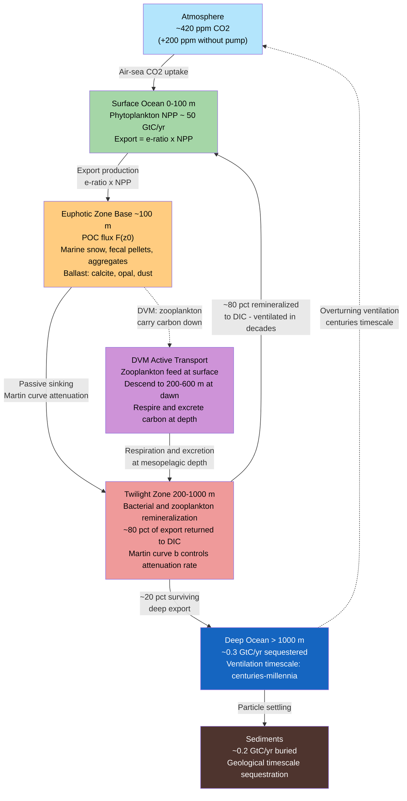

# The Biological Pump and Carbon Export

> [!abstract] TL;DR
> The biological pump is the ocean's gravitationally driven carbon conveyor: photosynthesis at the sunlit surface converts dissolved CO₂ into organic matter, and a fraction of that organic matter sinks as particles (marine snow, fecal pellets, dead cells) before bacteria can remineralize it back to CO₂, effectively transferring carbon from the atmosphere to the deep ocean on timescales of centuries to millennia. Without the biological pump, atmospheric CO₂ would be roughly 200 ppm higher than today. The fraction of net primary production that actually escapes the surface layer is quantified by the **e-ratio** (typically 0.05–0.5), and how rapidly that flux attenuates with depth is described by the **Martin curve** power law, F(z) = F(z₀) × (z/z₀)^(−b), where the Martin exponent b ≈ 0.858 (Martin et al. 1987) controls how much carbon survives transit through the mesopelagic twilight zone (200–1000 m) to reach the permanent deep ocean. An often-overlooked companion pathway — **active transport** by diel vertically migrating zooplankton — can contribute a further 20–40% of the passive particle flux in some regions.

---

## Intuition

**Analogy:** Imagine a city whose garbage collectors (phytoplankton) pick up CO₂ "trash" from the streets (atmosphere) and package it into bags (organic particles). Most bags are torn open and emptied by raccoons (bacteria) before they reach the landfill. Only the bags wrapped in heavy plastic (ballast minerals: calcite, opal) make it to the deep compactor (the seafloor), where the carbon is locked away. The deeper and faster the bags sink, the fewer raccoons have time to attack them. The city never overflows with CO₂ trash only because enough bags always make it through.

In ocean terms: phytoplankton fix atmospheric CO₂ into organic carbon during photosynthesis in the euphotic zone (0–100 m). When cells die, get eaten, and aggregate into marine snow, a fraction sinks. Bacteria remineralize most of this material back to dissolved inorganic carbon (DIC) in the twilight zone (200–1000 m), where it can be returned to the atmosphere on decadal timescales. Only the ~20% that escapes remineralization below 1000 m enters the truly sequestered reservoir. The Martin curve describes the bacterial "raccoon attack rate" as a function of depth; b is the community-integrated degradation constant.

---

## How It Works

### Core Mechanics

**1. Export production and the e-ratio.**
Net primary production (NPP) is the gross rate of photosynthetic carbon fixation minus autotrophic respiration: globally ~50 GtC yr⁻¹. Export production (EP) is the flux of particulate organic carbon (POC) sinking below the base of the euphotic zone (z₀ ≈ 100 m). The e-ratio (also called the f-ratio in some formulations) connects them:

EP = e × NPP

where e typically ranges from 0.05 in warm, stratified, oligotrophic gyres (dominated by small picophytoplankton with tight microbial loops) to 0.5 in cold, nutrient-rich, bloom-dominated systems (e.g., diatom-dominated sub-Antarctic or North Atlantic). The f-ratio (new production / total production) is conceptually related but strictly measures the proportion of NPP supported by newly upwelled nitrate rather than recycled ammonium; in steady state f-ratio ≈ e-ratio.

**2. The Martin curve: depth attenuation of POC flux.**
Martin et al. (1987) fitted VERTEX sediment trap and drifting trap data from the Pacific to a simple power law:

F(z) = F(z₀) × (z / z₀)^(−b)

where F(z) is POC flux (mmol C m⁻² d⁻¹) at depth z, z₀ = 100 m is the reference depth (base of the euphotic zone), and b ≈ 0.858 is the original canonical exponent. The power-law form implies that most attenuation occurs near the surface (steep log-log slope in the upper 100–500 m) and the rate of attenuation slows with depth. The exponent b is not universal: it ranges from ~0.5 (cold, diatom-dominated, fast-sinking aggregates) to ~1.5 (warm, oligotrophic, slow-sinking small particles). Global model uncertainty in b translates directly into large uncertainty in deep-ocean carbon sequestration estimates.

**3. Twilight zone remineralization (200–1000 m).**
The mesopelagic "twilight zone" is the critical battleground. No sunlight penetrates, yet heterotrophic bacteria, zooplankton, and mesopelagic fish consume sinking particles. Observations from sediment traps and ²³⁴Th disequilibrium methods consistently show that ~80% of the euphotic zone export is remineralized within the twilight zone, returning carbon to DIC where it can potentially upwell to the surface on decadal timescales. Only ~0.3 GtC yr⁻¹ crosses the 1000 m horizon to join the truly sequestered deep-water reservoir (ocean ventilation timescale: centuries to millennia).

**4. Active transport via diel vertical migration (DVM).**
A parallel and often underappreciated flux operates through behavior rather than gravity. Mesozooplankton (copepods, euphausiids) and mesopelagic fish migrate to the surface at night to feed on phytoplankton and zooplankton, then descend to 200–600 m depth during the day to avoid predation. At depth they respire, excrete, and die, releasing the ingested surface carbon at mesopelagic depths below the thermocline. Longhurst et al. (1990) estimated the DVM active flux at ~15–20% of the passive particle flux globally, with some regions (e.g., Arabian Sea, North Pacific) reaching 20–40%. The significance is that DVM bypasses the twilight zone upper portion, depositing carbon deeper than much of the passive flux reaches.

**5. Ballast hypothesis (Klaas & Archer 2002).**
Raw organic material (POC) is low-density and prone to dissolution; it sinks slowly and is rapidly degraded. Heavy minerals — particularly biogenic calcite (CaCO₃, from foraminifera and coccolithophores), opal (biogenic silica, SiO₂, from diatoms), and lithogenic dust — act as ballast that increases particle density, accelerates sinking speed, and physically protects organic matter from bacterial access. Klaas & Archer (2002) analysed global sediment trap data and found that calcite was the most efficient carrier of POC to depth per unit mass of mineral, because CaCO₃ dissolves slowly (below the calcite compensation depth, ~3500 m) compared to opal (which dissolves quickly in cold, low-silicate deep water). This produces the counterintuitive result that a shift from diatom-dominated to coccolithophore-dominated phytoplankton communities might actually increase carbon export efficiency despite lower overall NPP.

**6. Measuring export: ²³⁴Th disequilibrium.**
Uranium-238 (²³⁸U) decays to thorium-234 (²³⁴Th, t½ = 24.1 days) at a known rate. ²³⁴Th is particle-reactive and is scavenged onto sinking particles. In productive surface waters, ²³⁴Th is depleted relative to its parent ²³⁸U (secular equilibrium). The magnitude of the ²³⁴Th deficit, combined with the POC:²³⁴Th ratio on sinking particles, gives an independent, in-situ estimate of export flux integrated over the ~24-day half-life timescale — far less prone to trapping artifacts than moored sediment traps.

### Flow / Architecture



---

## Key Concepts / Details

### Secondary Level

**Why does the ocean reduce atmospheric CO₂?**
When phytoplankton die and sink, their carbon is physically removed from the atmosphere–surface-ocean equilibrium. The surface ocean constantly exchanges CO₂ with the atmosphere (Henry's Law solubility equilibrium). If the surface DIC concentration falls because carbon has sunk, the ocean draws down more CO₂ from the air to reestablish equilibrium. The deeper and more permanently the carbon is stored, the longer it stays out of the atmosphere. During the last glacial maximum (~20,000 years ago), a more efficient biological pump (driven by increased iron supply from glacial dust) is thought to have kept atmospheric CO₂ at ~180 ppm, compared to the pre-industrial ~280 ppm.

**Marine snow: what is it and why does it matter?**
Marine snow is the continuous shower of organic debris — dead phytoplankton cells, zooplankton fecal pellets, shed mucous feeding webs (from appendicularians), and sticky transparent exopolymer particles (TEP) — that aggregates into loose, flocculent particles visible to the naked eye as snowflakes. Marine snow concentrates organic carbon into rapidly sinking aggregates (1–100 m d⁻¹) that can traverse the twilight zone before bacteria fully degrade them. Without aggregation, individual phytoplankton cells (~10 µm) would take months to sink 100 m, giving bacteria ample time for complete remineralization.

**What happens to carbon that reaches the deep ocean?**
Carbon that crosses 1000 m depth is isolated from the atmosphere on the timescale of the thermohaline overturning circulation — roughly 500–2000 years. It is not "permanently" sequestered on geological timescales, but it is effectively removed from the modern climate system. When deep water eventually upwells (primarily in the Southern Ocean and North Pacific), the stored DIC re-enters the surface and can be re-exchanged with the atmosphere.

**Export efficiency varies by ecosystem.**
| Ecosystem | Dominant phytoplankton | Typical e-ratio | Driver |
|---|---|---|---|
| Oligotrophic gyre (e.g., Pacific subtropical) | Prochlorococcus, Synechococcus | 0.03–0.08 | Nutrient-limited; small cells, microbial loop dominates |
| North Atlantic spring bloom | Large diatoms, dinoflagellates | 0.2–0.5 | Nutrient-rich post-winter; large cells, direct sinking |
| Southern Ocean | Mixed; iron-limited | 0.05–0.15 | High macronutrients but iron-limited; small cells dominate |
| Coastal upwelling (e.g., Benguela, Peru) | Large chain-forming diatoms | 0.3–0.5 | Strong new nutrient injection |

---

### Undergraduate Level

**Martin curve derivation and sensitivity.**
The Martin power law is empirical, not mechanistic, but can be derived from a simple first-order degradation model. If POC concentration C(z) sinks at a constant velocity w (m d⁻¹) and is remineralized at a first-order rate k (d⁻¹), the steady-state flux F = wC satisfies:

dF/dz = −k F / w = −(k/w) F

This gives exponential decay: F(z) = F(z₀) exp[−(k/w)(z − z₀)]. If we allow k/w to decrease with depth (slower degradation at lower temperatures and pressures, or particle refractory enrichment with depth), an effective power law emerges. Fitting: (z/z₀)^(−b) ≈ exp[−b ln(z/z₀)], so the Martin exponent b is an integrated measure of the ratio k/w over the depth range. Higher b means more attenuation (higher k relative to w, or lower sinking speed relative to degradation rate).

**f-ratio vs e-ratio: the important distinction.**
The **f-ratio** (new/total production, Eppley & Peterson 1979) is defined as: f = new production / NPP, where new production is supported by nitrate (NO₃⁻) upwelled or mixed into the euphotic zone (as opposed to recycled ammonium from within-euphotic-zone remineralization). In steady state, new production must equal export production (the biological pump must export as much carbon as new nutrients bring in), so f-ratio ≈ e-ratio in steady state. In a developing bloom or upwelling pulse, the two can diverge: new nutrients sustain extra NPP that accumulates locally before sinking.

**Ballast multiple end-member model.**
Klaas & Archer (2002) regressed global sediment trap POC fluxes against the three mineral types. Their best-fit equations give "carrying capacity" in units of gC per g mineral:

| Ballast mineral | POC carrying capacity (gC/g mineral) |
|---|---|
| Calcite (CaCO₃) | 0.074 |
| Opal (SiO₂) | 0.025 |
| Lithogenic dust | 0.044 |

Calcite is ~3× more efficient than opal. Mechanistically, this may reflect: (a) CaCO₃ is denser than opal (2.71 vs 2.10 g cm⁻³), giving higher sinking speeds; (b) the calcite dissolution depth (lysocline ~3500 m) is deeper than the silica dissolution horizon; (c) calcite platelet geometry may better protect embedded organic material from enzymatic attack.

**²³⁴Th method for export flux: quantitative steps.**
Step 1: Measure ²³⁸U activity A_U from salinity (linear relationship: A_U ≈ 0.0686 × S dpm L⁻¹). Step 2: Measure ²³⁴Th activity A_Th in seawater by beta-counting large-volume filtered samples. Step 3: Compute the ²³⁴Th deficit ΔA = A_U − A_Th. Step 4: Integrate ΔA over the euphotic zone to get the scavenging flux. Step 5: Multiply by the POC:²³⁴Th ratio on particles (mmol C / dpm Th) measured by filtration to get POC export flux. The Th method gives a time-integrated flux over ~1 half-life (24 days) and is free of the collection-efficiency artifacts that plague moored sediment traps.

---

### Graduate Level

**Microbial carbon pump (MCP): the dissolved pathway.**
Azam et al. and Hansell & Carlson describe a parallel sequestration pathway operating entirely in dissolved form. Bacteria processing fresh, labile dissolved organic carbon (DOC) produce recalcitrant dissolved organic carbon (RDOC) — humic-like material resistant to further microbial degradation on timescales of centuries to millennia. This RDOC accumulates in the deep ocean (deep DOC inventory ~662 GtC) and is technically "sequestered" without ever sinking as particles. The MCP may contribute ~0.1–0.2 GtC yr⁻¹ to sequestration — comparable in magnitude to the hard biological pump's deep export — but is far harder to measure. The MCP is most active in oligotrophic systems where the particle pump is weak, suggesting the two pathways partially compensate.

**Martin b parameter global variability and the twilight zone uncertainty problem.**
The original Martin b = 0.858 was derived from northeast Pacific data. Global compilations (e.g., Buesseler et al. 2007, EXPORTS program synthesis) show b ranging from ~0.5 in polar/diatom-dominated systems to ~1.5 in tropical/warm/nutrient-poor systems. A shift of 0.2 in b changes the flux reaching 500 m by a factor of ~2, and the flux at 4000 m by nearly an order of magnitude. This uncertainty — dubbed the "twilight zone problem" — is the largest single source of uncertainty in bottom-up estimates of the biological pump's carbon sequestration efficiency. The NASA-NERC EXPORTS program (2018–present) deployed autonomous floats, gliders, ROVs, and net tows in the North Atlantic (PAP site) and North Pacific (Ocean Station Papa) to constrain b and the DVM contribution simultaneously.

**Diatom vs picophytoplankton export efficiency paradox.**
Eppley & Peterson (1979) showed that large diatoms support high f-ratios. Yet the Southern Ocean, dominated by large diatoms when iron is added (iron fertilization experiments: SOIREE 1999, SOFEX 2002), has a surprisingly low e-ratio (~0.05–0.1). The explanation involves: (a) diatom aggregation producing rapidly sinking frustule-loaded fecal pellets, but (b) strong remineralization in the cold, deep winter mixed layer before export; and (c) the "silicate pump" — diatom silica dissolves more slowly than organic matter, so biogenic silica reaches the sediments preferentially, and the organic C:Si ratio of exported material decreases with depth. Furthermore, high iron from fertilization stimulates a diatom bloom whose senescence produces aggregates, but mesozooplankton grazing converts much of this to small fecal pellets that are rapidly remineralized near the surface. Globally, iron fertilization experiments consistently showed brief (days to weeks) export pulses that never matched theoretical estimates derived from e-ratio × NPP change.

**EXPORTS program and multi-platform flux closure.**
The 2018 EXPORTS North Atlantic campaign achieved the first near-simultaneous measurement of: (1) NPP from ¹³C uptake and modeled satellite products; (2) particle export at 100 m from ²³⁴Th; (3) mesopelagic attenuation from neutrally buoyant SOFAR-tracked sediment traps at 150, 330, and 500 m; (4) active DVM transport from MOCNESS net tows and acoustic backscatter; (5) mesopelagic respiration from oxygen consumption measured on drifting profiling floats. Closure was achieved to within ~30%, establishing that DVM active flux was ~13–17% of passive flux at the PAP site during the post-bloom period — consistent with Longhurst et al. (1990) but now with mechanistic attribution to copepod vs euphausiid species.

---

## Python Demo

```python
import numpy as np
import matplotlib.pyplot as plt
import matplotlib.gridspec as gridspec

# ─── Martin Curve: F(z) = F(z0) * (z/z0)**(-b) ─────────────────────────────
z0 = 100.0          # reference depth (m) — base of euphotic zone
F_z0 = 5.0          # mmolC/m2/d — export flux at 100 m

z = np.linspace(100, 4000, 800)

b_params = {
    'b = 0.70  (slow remineralisation, cold diatom system)': 0.70,
    'b = 0.858 (Martin et al. 1987 canonical)':              0.858,
    'b = 1.00  (fast remineralisation, warm oligotrophic)':  1.00,
}
colors = ['#1976D2', '#D32F2F', '#388E3C']

# Key depths for sequestration bar chart
key_depths = np.array([500, 1000, 2000, 4000])

fig = plt.figure(figsize=(14, 6))
gs  = gridspec.GridSpec(1, 2, figure=fig, wspace=0.38)

# ── Panel 1: POC flux vs depth on log-log axes ────────────────────────────
ax1 = fig.add_subplot(gs[0])
for (label, b), color in zip(b_params.items(), colors):
    F = F_z0 * (z / z0) ** (-b)
    ax1.loglog(F, z, color=color, lw=2.5, label=label)

ax1.axhline(200,  color='gray', ls='--', lw=1.2, alpha=0.8)
ax1.axhline(1000, color='gray', ls=':',  lw=1.2, alpha=0.8)
ax1.text(0.015, 200,  ' Twilight zone top (200 m)',  va='bottom', fontsize=8, color='gray')
ax1.text(0.015, 1000, ' Twilight zone base (1000 m)', va='bottom', fontsize=8, color='gray')
ax1.invert_yaxis()
ax1.set_xlabel('POC Flux (mmolC m$^{-2}$ d$^{-1}$)', fontsize=10)
ax1.set_ylabel('Depth (m)', fontsize=10)
ax1.set_title('Martin Curve: POC Flux Attenuation\n(log-log scale)', fontsize=11)
ax1.legend(fontsize=7.5, loc='lower right')
ax1.grid(True, alpha=0.3, which='both')

# ── Panel 2: % of export flux remaining at key depths ────────────────────
ax2 = fig.add_subplot(gs[1])
x     = np.arange(len(key_depths))
width = 0.25

for i, ((label, b), color) in enumerate(zip(b_params.items(), colors)):
    fracs = (key_depths / z0) ** (-b)          # fraction of F(z0) remaining
    ax2.bar(x + i * width, fracs * 100, width,
            label=f'b = {b}', color=color, alpha=0.85, edgecolor='white')

ax2.set_xticks(x + width)
ax2.set_xticklabels([f'{d} m' for d in key_depths], fontsize=10)
ax2.set_xlabel('Depth (m)', fontsize=10)
ax2.set_ylabel('POC flux remaining (% of 100 m export)', fontsize=10)
ax2.set_title('Carbon Remaining vs Depth\n(as % of surface export at 100 m)', fontsize=11)
ax2.legend(fontsize=8)
ax2.grid(True, alpha=0.3, axis='y')
ax2.set_ylim(0, 55)

fig.suptitle(
    f'Biological Pump — Martin Curve Sensitivity\n'
    f'F(z0) = {F_z0} mmolC m$^{{-2}}$ d$^{{-1}}$ at z0 = {z0:.0f} m',
    fontsize=12, fontweight='bold'
)
plt.tight_layout()
plt.show()

# ── Print summary table ──────────────────────────────────────────────────
print(f"\nPOC flux (mmolC m-2 d-1) and % of F(z0) = {F_z0} at z0 = {z0:.0f} m\n")
print(f"{'Depth':>6}  {'b=0.70':>12}  {'b=0.858':>12}  {'b=1.00':>12}")
print("-" * 52)
for d in [200, 500, 1000, 2000, 4000]:
    vals = [F_z0 * (d / z0) ** (-b) for b in [0.70, 0.858, 1.00]]
    pcts = [v / F_z0 * 100 for v in vals]
    print(
        f"{d:>6} m  "
        f"{vals[0]:>5.3f} ({pcts[0]:>4.1f}%)  "
        f"{vals[1]:>5.3f} ({pcts[1]:>4.1f}%)  "
        f"{vals[2]:>5.3f} ({pcts[2]:>4.1f}%)"
    )
```

**Expected output (sample rows):**
```
Depth     b=0.70       b=0.858      b=1.00
------------------------------------------------------
  200 m   1.616 (32.3%)  1.248 (25.0%)  1.000 (20.0%)
  500 m   0.798 (16.0%)  0.539 (10.8%)  0.400  (8.0%)
 1000 m   0.497  (9.9%)  0.300  (6.0%)  0.200  (4.0%)
 2000 m   0.310  (6.2%)  0.167  (3.3%)  0.100  (2.0%)
 4000 m   0.193  (3.9%)  0.093  (1.9%)  0.050  (1.0%)
```
The table illustrates the high sensitivity of deep sequestration to b: at 4000 m, b = 0.70 delivers twice the carbon of b = 0.858, and four times that of b = 1.00.

---

## Real-World Notes

**VERTEX sediment trap program and the birth of the Martin curve.**
Jack Martin and colleagues deployed free-drifting sediment traps at multiple depths during the VERTEX cruises in the northeast Pacific (1983–1988). By plotting POC flux against depth across seven cruises, Martin et al. (1987) identified the clean power-law attenuation that now bears his name. The same Jack Martin subsequently proposed the iron limitation hypothesis (1990), with the famous quip: "Give me half a tanker of iron, and I'll give you an ice age." The VERTEX data remained the quantitative backbone of biological pump parameterizations for two decades.

**Southern Ocean biological pump efficiency debate.**
The Southern Ocean receives abundant light and macronutrients (NO₃⁻, PO₄³⁻) but is chronically iron-deficient outside the island wakes. As a result, phytoplankton communities are dominated by small flagellates and prymnesiophytes rather than large chain-forming diatoms, and the e-ratio remains stubbornly low (0.05–0.10) despite high surface productivity. Iron fertilization experiments (SOIREE 1999, EisenEx 2000) demonstrated that iron addition switches the community toward diatoms and increases NPP dramatically, with a transient export signal detected by ²³⁴Th. However, the increased export lasted only 7–14 days before grazing and remineralization re-asserted control, and the fraction reaching depths below 500 m was smaller than predicted — highlighting that NPP enhancement does not translate proportionally into sequestration.

**North Atlantic spring bloom and high-latitude export.**
The North Atlantic is the canonical high-export ocean. Winter deep mixing supplies ~10–20 µmol L⁻¹ NO₃⁻ to the surface; in March–May, shoaling of the mixed layer (Sverdrup's critical depth hypothesis) triggers a massive diatom bloom. Diatom frustules and fecal pellets aggregate rapidly, producing POC fluxes of 20–50 mmol C m⁻² d⁻¹ at 100 m — 5–10× the global average — with e-ratios up to 0.4–0.5. The PAP (Porcupine Abyssal Plain) time-series sediment trap (deployed annually since 1989) documents strong seasonality in POC flux even at 3000 m, with the spring bloom signal arriving ~30–50 days after the surface peak, corresponding to aggregate sinking speeds of 50–100 m d⁻¹.

**Iron fertilization and geoengineering implications.**
Ocean iron fertilization (OIF) has been proposed as a deliberate climate intervention. The ~13 small-scale fertilization experiments conducted between 1993 and 2009 consistently showed short-lived NPP and chlorophyll increases, but only one experiment (LOHAFEX 2009) achieved a statistically unambiguous increase in POC export below 200 m, and the enhancement was modest (~2× background). The fundamental problem is leakage: zooplankton grazing converts bloom biomass into small fecal pellets that are rapidly remineralized in the upper 100 m. Commercial-scale OIF would require sustained, vast-area fertilization with attendant risks of deoxygenation, harmful algal blooms, and disruption of downstream nutrient supplies — currently unverified at scale and contentious in the scientific and policy community.

**Mesopelagic fish and active carbon packaging.**
Myctophids (lanternfishes) and hatchetfish are the most abundant vertebrates on Earth by number. They are obligate diel vertical migrators: feeding at the surface at night, spending daylight hours at 400–800 m. Hideki Nishikawa and others have shown that myctophid fecal pellets and carcasses at depth represent a "packaged" carbon flux that sinks faster and is less accessible to bacteria than raw POC. Global estimates of mesopelagic fish active carbon transport range from 0.01 to 0.05 GtC yr⁻¹, with high uncertainty because fish abundance estimates from acoustic surveys are poorly calibrated. Importantly, commercial mesopelagic fisheries (proposed as protein source) could directly short-circuit the active transport flux, returning carbon to the atmosphere.

---

## Common Pitfalls

- **Conflating NPP with export production** — Only 5–50% of NPP (the e-ratio) is exported below 100 m. Statements like "the ocean sequesters X% of NPP" are almost always wrong; the correct framing is that the ocean sequesters a fraction of export production, which is itself a fraction of NPP. A doubling of NPP does not double sequestration if the e-ratio simultaneously decreases.

- **Assuming Martin b = 0.858 is universal** — The original value was derived from seven Northeast Pacific cruises. Global compilations show b ranging from 0.5 to 1.5 depending on temperature, community composition, particle ballasting, and midwater oxygen concentration (low-oxygen zones slow remineralization, reducing b). Using a single global b introduces order-of-magnitude errors in estimates of deep-water carbon supply.

- **Ignoring DVM active transport** — Models that include only passive particle flux underestimate carbon export by 20–40% in regions of high zooplankton biomass. This matters especially for oxygen minimum zone formation (DVM respiration at mesopelagic depths consumes O₂) and for estimating the efficiency of geoengineering interventions.

- **Using moored (not drifting) sediment traps uncritically** — Moored traps suffer from hydrodynamic biases: current-induced upwelling around the trap mouth can over-collect fine particles; lateral advection can introduce allochthonous material. In the upper 500 m, moored trap fluxes can be off by factors of 2–5. ²³⁴Th disequilibrium is the preferred method for euphotic zone export; neutrally buoyant traps are preferred for the mesopelagic.

- **Treating export flux as equivalent to sequestration** — Carbon exported below 100 m is not yet "sequestered" in the climate sense. Most twilight zone carbon returns to the surface on decadal timescales when intermediate waters upwell. True sequestration requires export below ~1000 m (the ventilation depth for centennial-timescale circulation). The distinction is critical for climate models assessing biological pump feedbacks on CO₂.

---

## Related Concepts

**Same vault — Oceanography:**

- [[Marine_Primary_Production_and_Phytoplankton]] — the source of exported organic matter; NPP rates, phytoplankton community composition, and the e-ratio all originate here
- [[Zooplankton_and_Marine_Food_Webs]] — zooplankton grazing controls export efficiency; DVM active transport is a zooplankton-mediated flux
- [[The_Oceanic_Carbon_Cycle]] — the broader framework in which the biological pump operates alongside the solubility pump and carbonate chemistry
- [[Nutrient_Cycles_and_Trace_Elements]] — nitrogen cycle (new vs regenerated production), iron limitation (controls e-ratio and bloom magnitude), and silicate supply (ballast for diatom export)
- [[Deep_Sea_Ecology]] — the biological community in the twilight zone and abyssal plain that remineralizes and consumes exported POC
- [[Paleoceanography_and_Ocean_Sediment_Records]] — sediment records preserve biological pump signals (foram and diatom assemblages, organic carbon burial rates, Cd/Ca proxies for nutrient depletion)
- [[_MOC_Biological_Oceanography]] — section map of all Biological Oceanography notes

**Cross-vault:**

- [[Chemical_Kinetics]] — first-order degradation kinetics underpins the Martin curve power law; temperature dependence of bacterial remineralization rates follows Arrhenius-type kinetics (Chemistry vault)
- [[Anthropogenic_Climate_Change]] — biological pump feedbacks on atmospheric CO₂ are a key uncertainty in climate projections; ocean iron fertilization as CDR strategy (Meteorology vault)
- [[_MOC_Chemistry_Master]] — carbonate chemistry, Henry's Law solubility, and ²³⁴Th radiochemistry are all covered in the Chemistry vault
- [[_MOC_Meteorology_Master]] — air-sea CO₂ exchange, ocean-atmosphere coupling, and climate sensitivity feedbacks all depend on the biological pump magnitude

---

## Review Questions

### Secondary Level

1. A jar of seawater from the surface contains living phytoplankton; after a week in a dark, cold refrigerator all the cells have died. Explain, in terms of the biological pump, why the ocean does not simply allow all dead phytoplankton to decompose at the surface rather than sinking them to depth.
2. The Southern Ocean is full of nutrients but has very low carbon export compared to the North Atlantic. Suggest two reasons why high nutrient concentration does not guarantee high export production, and what the limiting factor might be.

### Undergraduate Level

1. Martin et al. (1987) fitted POC flux data to F(z) = F(z₀) × (z/z₀)^(−b). Show that this can be derived from a first-order remineralization model if you allow the ratio k/w (degradation rate to sinking speed) to decrease with depth, and explain what physical or biological factors might cause k/w to vary.
2. A sediment trap deployed at 500 m in the North Atlantic measures a POC flux of 2.0 mmol C m⁻² d⁻¹. The ²³⁴Th method at the same site gives an export at 100 m of 8.0 mmol C m⁻² d⁻¹. Compute the implied Martin b value. Is this value consistent with a warm or cold, diatom-rich or oligotrophic system? What fraction of the 100 m export would reach 2000 m with this b?
3. Explain the Klaas & Archer (2002) ballast hypothesis. Why is calcite a more efficient ballast mineral than opal per unit mass? What would you predict about carbon export efficiency in an ocean where ocean acidification has dissolved the calcite shells of surface organisms?

### Graduate Level

1. The microbial carbon pump and the biological hard pump both sequester carbon, but through entirely different mechanisms. Compare and contrast: (a) the form of carbon sequestered (particulate vs dissolved); (b) the ecosystem conditions that favour each pathway; (c) the analytical approaches used to quantify each; and (d) the timescale of sequestration. Under what circumstances might the two pathways partially compensate for each other?
2. Buesseler et al. (2007) argued that the twilight zone remineralization exponent b is the critical unknown for global carbon cycle models. Using the Martin curve, demonstrate quantitatively why a change of Δb = 0.3 has a proportionally larger effect on deep (4000 m) than shallow (500 m) flux. What observational strategy would you design to constrain b globally, and what are the key methodological challenges?
3. Design a hypothetical large-scale (10,000 km²) iron fertilization experiment in the Southern Ocean intended to demonstrate genuine, verifiable carbon sequestration (not just NPP enhancement). Specify: reference and treatment sites; duration; measurement variables needed for mass balance closure; and the three most likely failure modes that would prevent sequestration even if NPP doubles. How would you distinguish fertilization-induced export from natural variability using existing monitoring infrastructure?

---

## Sources

- Martin, J. H., Knauer, G. A., Karl, D. M., & Broenkow, W. W. (1987). VERTEX: carbon cycling in the northeast Pacific. *Deep-Sea Research*, 34(2), 267–285. — original Martin curve derivation
- Longhurst, A. R., Bedo, A. W., Harrison, W. G., Head, E. J. H., & Sameoto, D. D. (1990). Vertical flux of respiratory carbon by oceanic diel migrant biota. *Deep-Sea Research*, 37(4), 685–694. — quantification of DVM active transport
- Klaas, C., & Archer, D. E. (2002). Association of sinking organic matter with various types of mineral ballast in the deep sea: implications for the rain ratio. *Global Biogeochemical Cycles*, 16(4), 63-1–63-14. — ballast hypothesis and multiple end-member model
- Sarmiento, J. L., & Gruber, N. (2006). *Ocean Biogeochemical Dynamics*. Princeton University Press. — comprehensive textbook covering biological pump, carbon cycle, and nutrient dynamics
- Buesseler, K. O., Lamborg, C. H., Boyd, P. W., et al. (2007). Revisiting carbon flux through the ocean's twilight zone. *Science*, 316(5824), 567–570. — twilight zone attenuation uncertainty and the need for EXPORTS
- Eppley, R. W., & Peterson, B. J. (1979). Particulate organic matter flux and planktonic new production in the deep ocean. *Nature*, 282, 677–680. — f-ratio concept and new vs regenerated production
- Hansell, D. A., & Carlson, C. A. (2001). Marine dissolved organic matter and the carbon cycle. *Oceanography*, 14(4), 41–49. — microbial carbon pump and recalcitrant DOC

---

#Oceanography #BiologicalOceanography #BiologicalPump #CarbonExport #CarbonSequestration
